# Transformer&预训练语言模型&预训练语言模型

> - https://helloai.blog.csdn.net/article/details/126474707
> - https://www.bilibili.com/video/BV1UG411p7zv

ps：鉴于本科阶段已经学习过多遍，因此该文档主要以blog为核心进行快速复习，若后有空将重新过一遍视频

## Transformer&预训练语言模型

### 研究动机

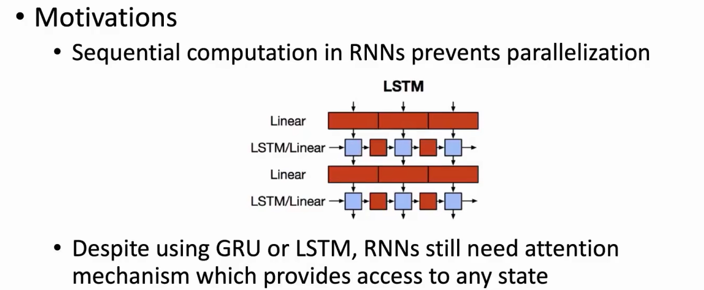

典型的双层LSTM模型，它最大的缺点是必须要顺序地执行，即不能并行化。因此为了解决这个问题提出了Transformer&预训练语言模型

### 总体框架

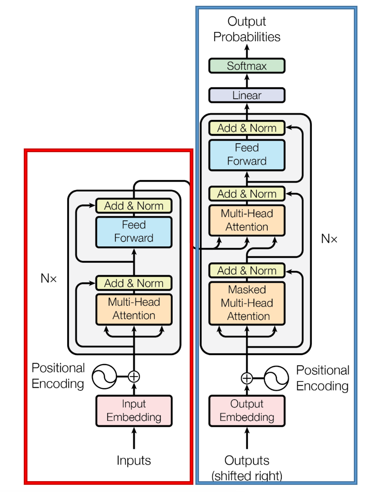

可以看到它也是一种编码器-解码器架构，上图红色框框出了编码器，蓝色框出了解码器。

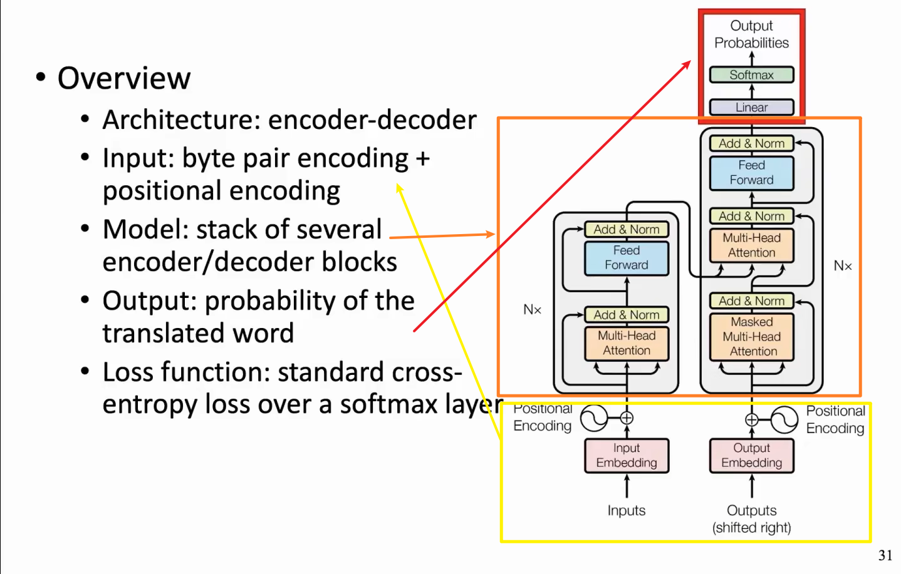

- 输入层(Input Layer)，和RNN中一样，我们需要将文本序列进行词元化(分词)为不同的token，然后通过Input Embedding得到词向量表示。同时加上了位置编码来表示位置信息。
- Transformer&预训练语言模型的核心部分，它是由多个Encoder/Decoder block堆叠而成，
- 输出层，就是一个线性变换和一个Softmax转换为概率分布。

### 细节介绍

#### BPE

在输入层中进行分词时使用的技术是BPE(字节对编码)。

BPE是一种分词算法，对于英文来说，它首先将语料库中所有的单词按字母切分，随后它统计语料库这些字母组成的byte gram出现的数量，然后逐步把频度最高的byte gram抽象为一个词加入词表中。

> byte gram：连续两个相邻位置拼到一起，它的一个组合，比如i,o拼到一起就是一个byte gram

##### 例子

举个例子，假设在文本中单词和对应出现的次数：

low : 5
lower : 2
newest : 6
wildest : 3

最开始的词表为这4个单词所有的字母组成。

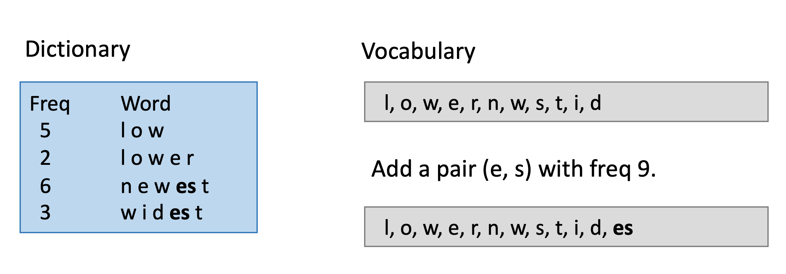

这样我们可以计算出现频率最高的是`es`这样的组合。分别为6次出现在newest中，3次出现在widest中。

这样，我们把`es`拼接为新的单词加入到词表中，同时标记它的频次为9。因为`s`不再单独出现，所以我们也将其从词表中去除。

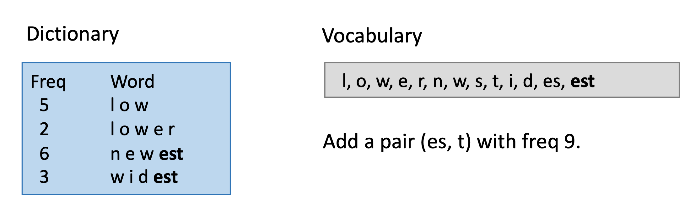

随后，按照新的词表再次组合bi-gram，统计出现频次最高的组合为`est`。

将`est`加入到词表中，同时`es`不再单独出现，也将它从词表中去除。
不断重复此过程，直到词表中单词数量达到预设的值。

##### 优势

BPE主要用来**解决未登陆词问题(Out of vocabulary,OOV)**。它通过将文本序列变成一个个子词(sub word)的更小的单元。

比如在上面的例子中，如果出现了新的单词`lowest`，那么就可以被切分为`low`和`est`两个子词。

而在传统的基于空格分词技术中，若该单词没有出现在词表中，那么会被替换为`<UNK>`，从而失去了意义。

#### 位置编码

由于Transformer&预训练语言模型没有使用类似RNN那种顺序地读取输入的方式，而是一次并行处理所有的输入，因此它没有位置信息。为了增加位置信息到输入中，我们需要利用位置编码。

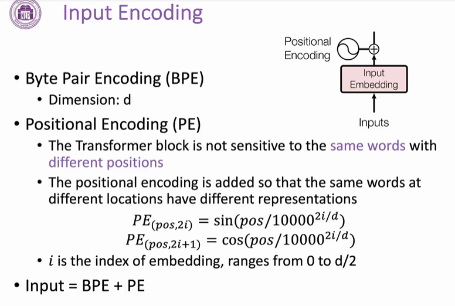

其实就是为原来的token编码加上位置向量，使其具有位置信息。而这里的位置向量，是基于正选加余弦来实现的。

#### Transformer&预训练语言模型 Block

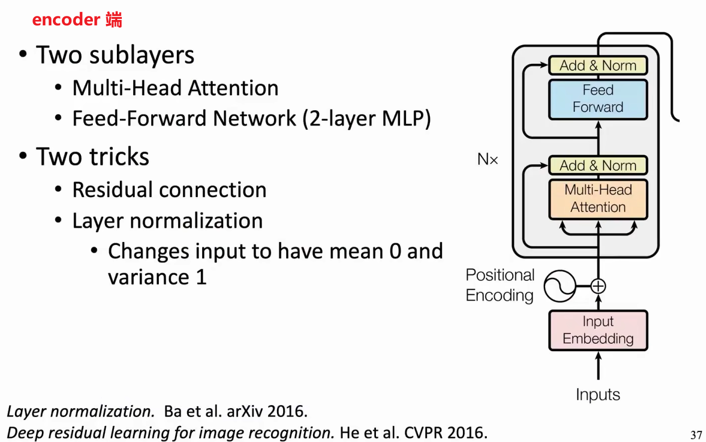

可以看到，它主要由两个子层组成：

- 多头注意力层
- 前馈网络

但这两个子层不是直接连接的，它们有一些小技巧：

- 残差连接
- 层归一化

在这些子层中假如残差连接，防止模型过深带来梯度消失问题。

而层归一化将输入的向量变成均值为0方差为1的分布，针对梯度消失和梯度爆炸的问题。

##### 注意力层

在Transformer&预训练语言模型中使用的注意力也是基于点积来实现的。

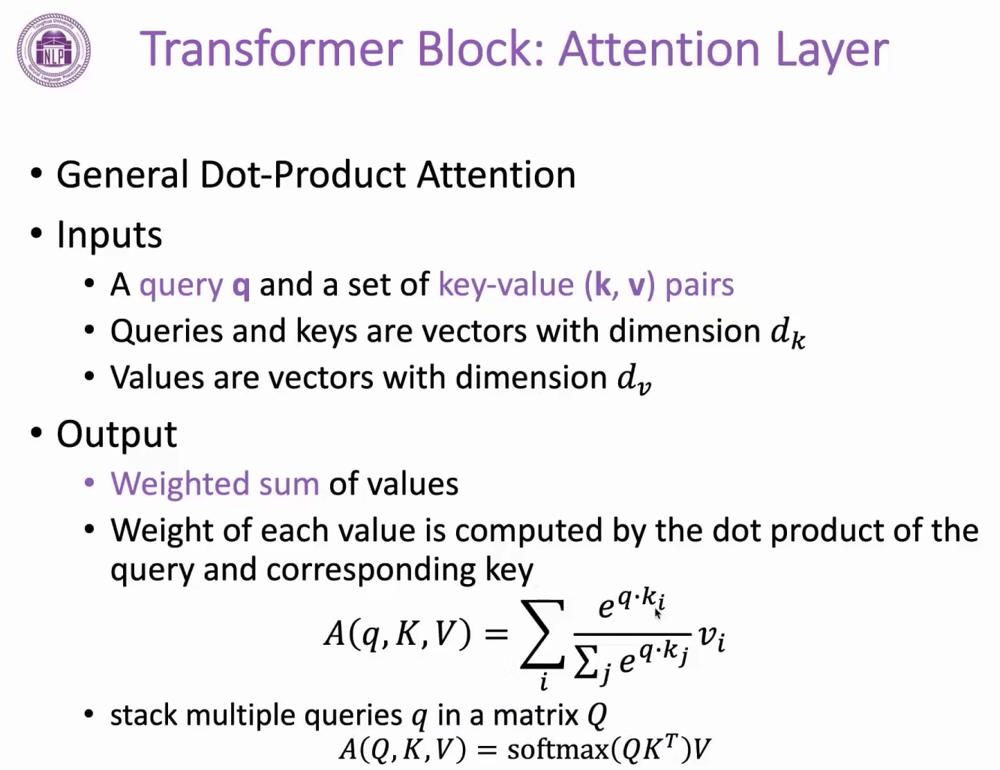

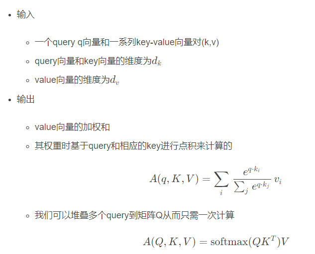

###### 实例计算

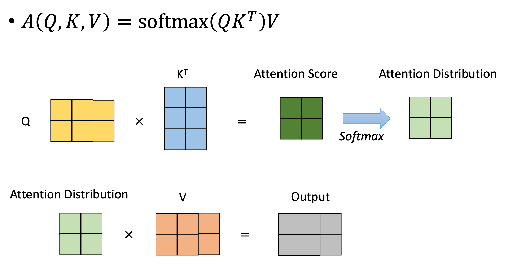

首先有三个矩阵，Q , K , V .然后计算$QK^T$得到一个注意力分数，再经过Softmax得到注意力分布。再乘上V矩阵就得到输出。
在前面Attention的基础上，我们进一步假如一个缩放系数。就得到了Transformer&预训练语言模型中使用的缩放点积注意力。

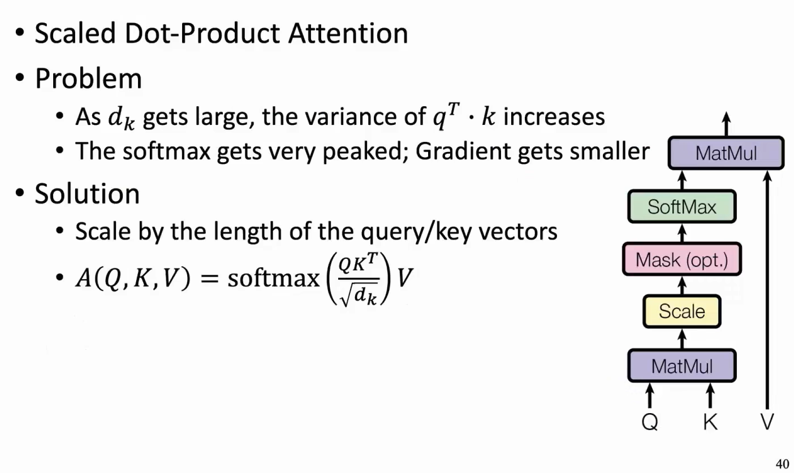

**为什么要加这个缩放系数呢？**因为注意力是通过q和k的点积实现的，如果没有这个缩放系数，那么q和k的点积得到的标量的方差会随着$d_k$的增加而变大，这样得到的概率分布会非常尖锐，从而使得梯度变得很小，不好训练。

由于我们的这个Attention是一种自注意力机制，我们希望模型能够让每个token可以自主地选择应该关注输入中的哪些token，并进行信息的整合。

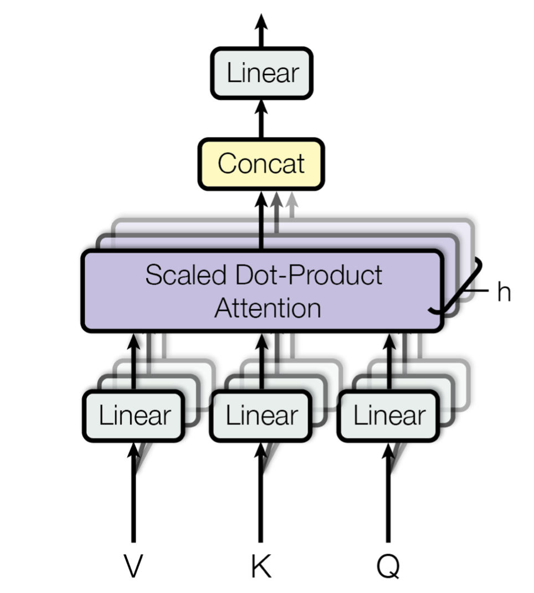

所以对应到QKV三个矩阵，它们其实都是从文本的表示向量乘上变换矩阵(Linear)得到的。
对于非第一层的Transformer&预训练语言模型 block来说，文本的表示向量就是前一层的输出。而对于第一层来说，就是词向量和对应位置编码的求和。

###### Multi-head Attention

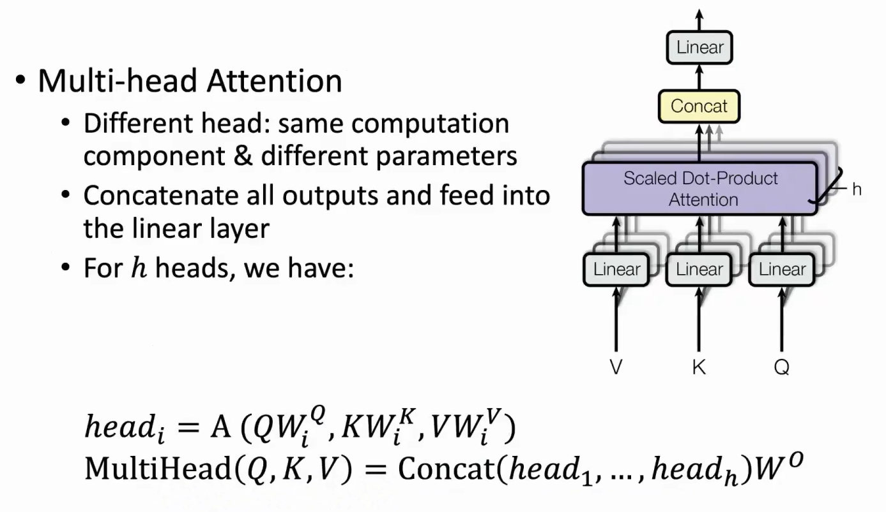

在上述单个Attention的基础上，Transformer&预训练语言模型为了增强模型的表示能力，采用了多个结构相同但参数不同的一个注意力模块，组成了一个多头的注意力机制。其中每个头的注意力计算方式和上面介绍的无二。

只不过每个头都会有一个自己对应的权重矩阵。

每个注意力头在得到自己的输出之后，我们将这些输出在维度层面进行拼接，然后通过一个线性层整合，就得到了多头注意力的输出。

##### Transformer&预训练语言模型 Decoder Block

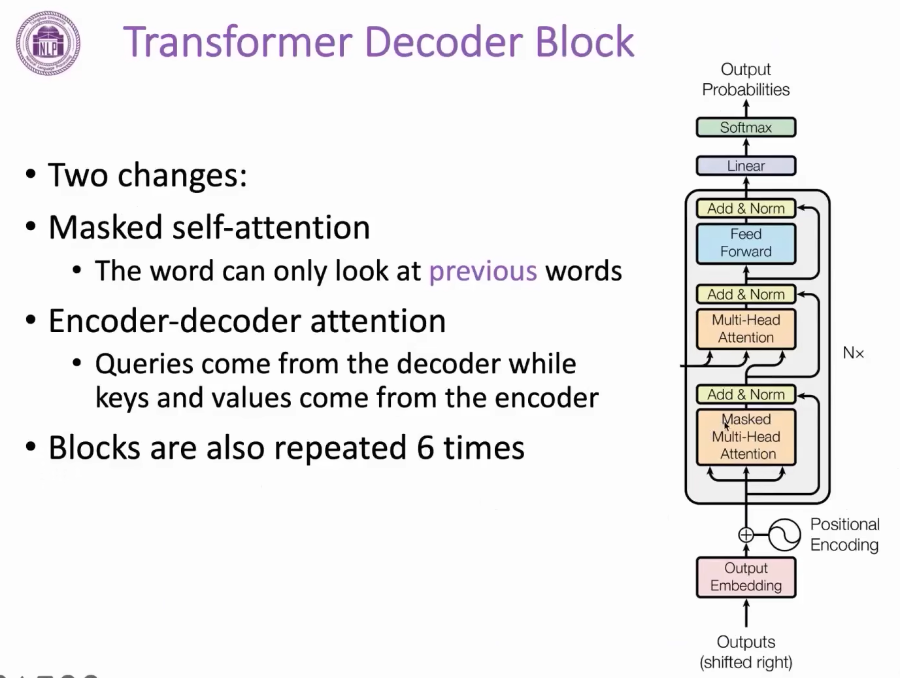

- 第一个不同在于输入经过的不是编码器那样的多头注意力，而是增加了掩码。
- 为什么需要这个掩码呢？因为在预测任务时，我们只能让解码器看到它已经输出的单词，而不能看到后面未输出的单词。

- 第二个不同是接着加入了编码器和解码器端之间的注意力，上图中的Multi-Head Attention。这和解码器的多头注意力完全相同，不同之处在于，它的query向量来自解码器中掩码多头注意力的输出，而key和value向量来自于编码器最后一层的输出。

和带注意力机制的seq2seq类似，为了帮助解码器端每一步生成都可以关注和整合编码器端每个位置信息而设计的。

###### Masked Attention

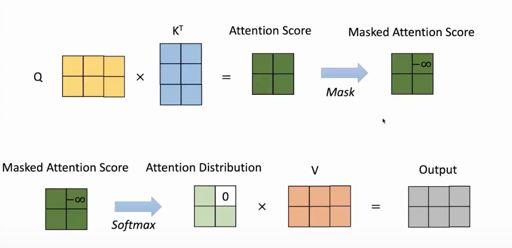

在通过Q和K矩阵计算出注意力分数后，接着就是掩码部分，即将矩阵左对角线的上三角部分(右上角)的值变为负无穷大。这样在经过Softmax后，右上角的值会变为零。这样保证了解码器端在文本生成的时候，它是顺序生成的，不会出现在生成第i个位置的时候，参考了i+1等后面位置的信息。

### 优化技巧

Transformer&预训练语言模型在训练和生成的过程中采用了很多小技巧：

- ADAM优化器
- 在残差连接之前加上Dropout
- 输出层加入了Label smoothing
- 在解码器生成了过程中采用了更加复杂的生成策略

### 优缺点

- 优点
  - 是一个很强的模型，在很多NLP任务中得到了证明
  - 适用于并行化
  - 给后续的预训练语言模型比如BERT和GPT等带来了很多启发

- 缺点
  - 模型本身对于参数敏感，优化过程非常困难
  - 处理文本的复杂度是文本长度的平方$O(n^2)$，这样无法处理特别长的文本
    

## 预训练语言模型

语言建模
语言建模的任务是预测下一个单词。
途径就是计算下一个单词$w_n$的条件概率：
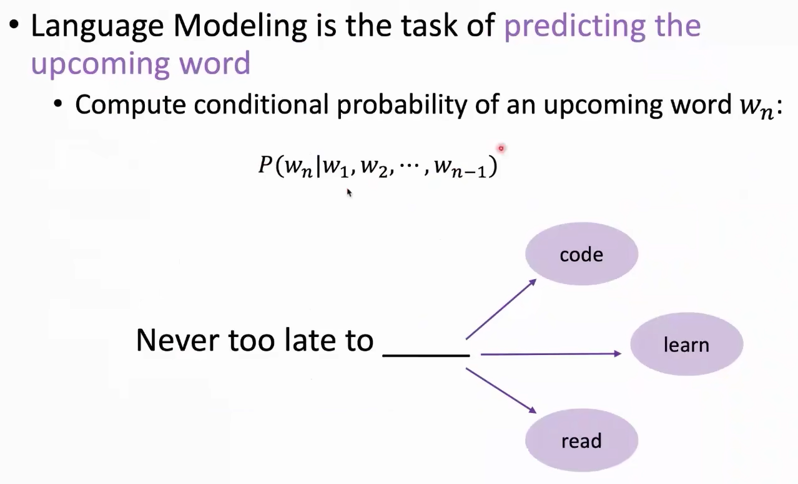

语言模型重要的是可以迁移到其他NLP任务中。比较有代表性的三种模型是：

- word2vec
- 预训练RNN
- GPT&BERT

### 预训练语言模型

预训练语言模型(PLM)的好处是，在语言模型预训练后学到的知识可以非常容易地迁移到各种下游任务。
word2vec是第一个预训练语言模型。
现在大多数预训练语言模型都是基于Transformer&预训练语言模型(e.g. BERT)。

预训练语言模型可以分成两种范式

- 特征提取器
  - 最代表性的是word2vec
  - 使用PLM的输出作为下游任务的输入
- 模型参数微调
  - 最代表性的是BERT
  - 语言模型也会作为下游模型进行参数更新(主流)

### 微调

有两种具有代表性的微调模型，首先我们来介绍GPT。

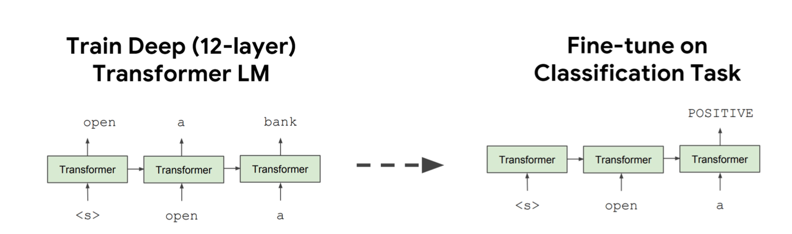

受到了Transformer&预训练语言模型的启发，GPT是第一个在Transformer&预训练语言模型上预训练PLM工作的。

- 它拿了Transformer&预训练语言模型的Decoder，用自回归的方式去训练一个语言模型。

- 具体地，使用了12层的Transformer&预训练语言模型的decoder来自回归地在无监督文本语料上训练一个语言模型，在下游任务可以通过这种方式对整体的文本内容进行编码。

- 下一步，作者们又提出了GPT-2。主要不同是提升了模型的参数量，训练了不同的模型大小。并且使用了更大规模的语料(40GB)进行预训练。

- GPT还具有非常好的一个zero-shot能力。我们可以实现很多种任务使用语言模型形式把它统一起来。可以在没有任何标注数据的情况下来完成任务。

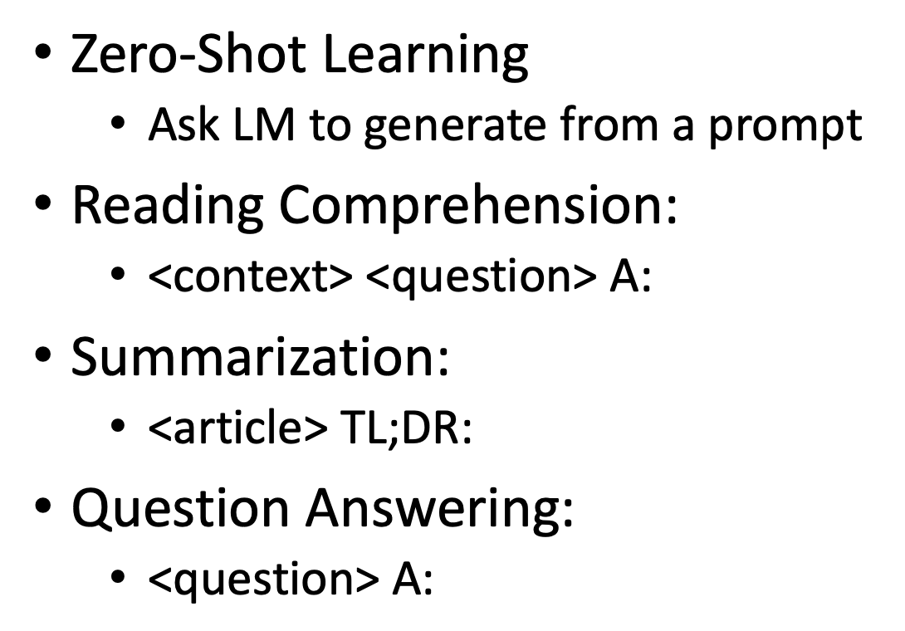

#### BERT

BERT是现在最受欢迎的预训练语言模型。它改变了NLP研究的范式。**BERT网络结构是多层 transformer Encoder叠加**。

##### 总体框架

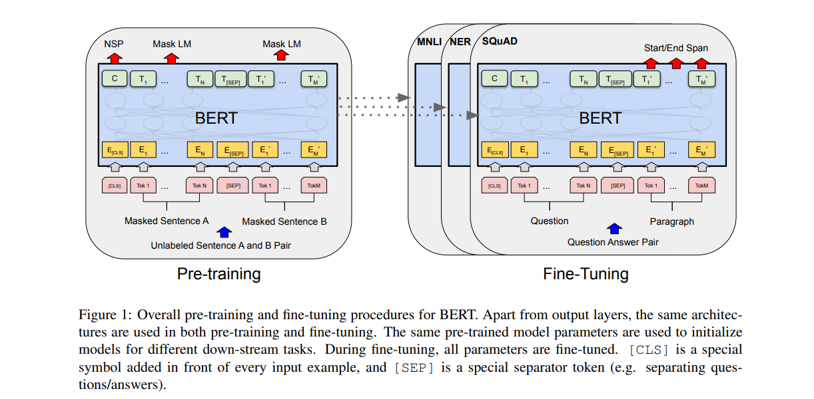

PS:

双向表示模型在处理一个词的时候，能够同时利用前面的词和后面的词两部分信息。它不是在给出前面词的条件下预测最可能的当前‘词，**而是随机遮掩一些词，并利用所有没有被遮掉的词进行预测**（如下图所示）

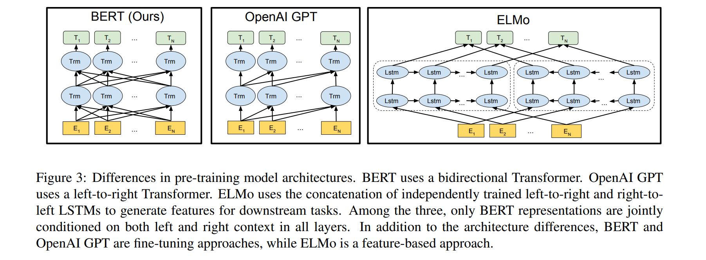

- **单向的 transformer 一般被称为 transformer decoder，每个token 只会注意到其左边的 token，而双向的 transformer 则被称为 transformer encoder ，每一个 token 会被所有的 token 注意到**

在BERT之前最成功的预训练语言模型是GPT，它通过自左到右自回归的去做预训练。但是在语言理方面，我们直观的认为它是一个双向的过程。即当前内容左边和右边的信息对于理解当前内容都是很有帮助的。

- 为什么之前的GPT是单向的呢？

  - 需要一个方向去自然地把长文本拆解成一些小部分

  - 双向模型如果能看到所有内容，会发生信息泄露。

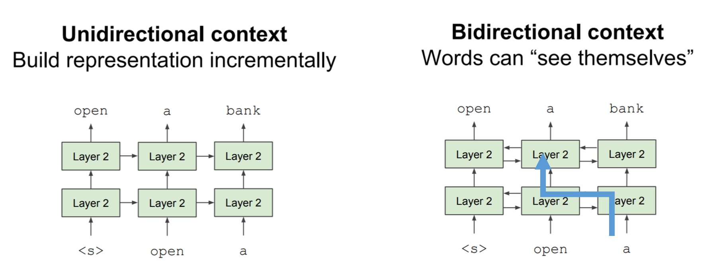

单向的GPT在语言生成方面很有优势，但是在语言理解上就有不足。
如果在双向的环节中，把整个序列输入进去，那么模型能看到当前单词的下一个单词，它只需要学会简单地复制即可。比如上图右边输入"open"时它能看到下一个单词是"a"。

- BERT作为**一个双向的语言模型**，它是如何解决信息泄露问题的呢？

**它的解决方案**是通过遮盖(Mask)的方式，这是受到完形填空启发。

比如上面的例子中，将store和gallon遮盖住，然后让BERT去预测这两个单词。

BERT采用了随机Mask掉15%单词的策略。

- 虽然这样可以解决信息泄露的问题，但是也会带来一个新的问题。就是Mask token在下游任务微调时是不会出现的，比如在做下游的与阅读理解的时候，它不会有mask这样一个token。

这样会造成预训练和微调非常大的差异，这样的差异会导致模型的效果变差。因为模型可能会只关注mask的表示，因为其他正常的token模型认为都是作为一些上下文出现的。它任务只要把mask预测好就完事了，这样模型可能会具有偏差。

针对此问题，BERT也提出了解决方法。在做15%Mask的时候，也细分成几种方式：

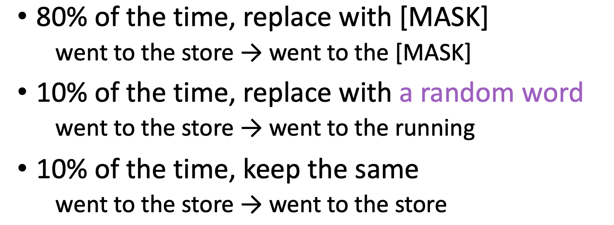

**即80%的概率替换为Mask；10%的概率替换为随机单词；10%的概率不替换。**

这样来要求模型去关注那些看起来不是mask的单词，去维持一个比较好的表示。但这样其实也会带来问题。最后10%的概率保持不变(即上图store预测出store)是为了防止模型认为现实中出现的词都是错的。

通过这三种策略的叠加来解决Mask带来的预训练和微调阶段的差异。

- BERT除了Mask语言模型这样一个最核心的预训练任务，还有另外一个预训练任务——**下一句预测(NSP)**。来更好地利用大规模无监督语料库中句子间的信息。

如果Mask作为词和词之间的条件概率，那么NSP就是句子间的条件概率。
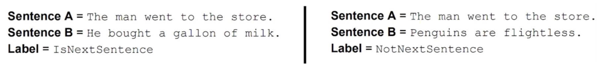

做法也很简单，如果是两个相邻的句子，那么标签就是True；如果是随机的两个句子，那么标签就是False。

##### 输入

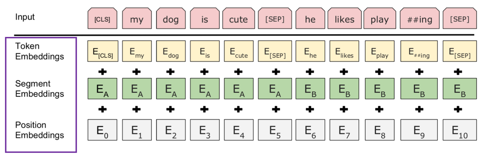

- BERT整体上是基于Transformer的encoder， BERT在输入方面做了微小地调整。

- 首先的第一个输入单词是`[CLS]`，定位是汇聚所有的输入信息，来支持下游的句子分类这样的任务。通常会接收几段的输入，中间通过`[SEP]`单词来进行分隔。最后也通过`[SEP]`表示整个输入的结束。

- 这里输入的token会分为三部分相加。
  - 第一部分是词嵌入，采用的是word piece这种data driven分词方式。
  - 第二部分是片段嵌入，表示文本属于哪个文本段。
  - 第三部分是位置编码，BERT中采用了更加简单地方式，预定义了512个这样的位置token，是随机初始化可学习的。

##### 总结

- 特征提取方式的模型给下游任务提供单词嵌入，会固定输入的特征，效果非常有限。
- 基于微调的方式可以根据下游任务更新整个模型参数，取得了非常好的效果。

#### BERT之后的预训练语言模型

BERT虽然带来了很大的提升，但也存在很多问题。

- 第一个就是我们上面提到的预训练和微调之间的差异(gap)。BERT通过混合不同的Mask策略来解决。但仍然没有从根本上解决这个问题，因为Mask在预训练中起到了非常重要的做法，但在下游任务中不会出现。

- 第二个是预训练的效率非常地，每次只能预测15%的单词，只有这些单词受到了有效的监督，其他的词不会受到监督的上下文进行编码。

下面简单介绍几个有代表性的改进。

##### RoBERTa

RoBERTa发现BERT没有完全被训练好，它探索了很多细节的改进。比如：

- 动态Mask
- NSP是否有必要存在
- 训练更大的批次
- 文本编码

基于这些改动，RoBERTa做了很多实验来证明改进效果。其整体架构与BERT架构是一样的。

##### ELECTRA

- 它主要解决的问题是预训练的效率不高(15%)
- 基于传统的语言模型其实所有的词都会受到监督
- 它提出了替换标记检测(Replaced Token Detection)任务。

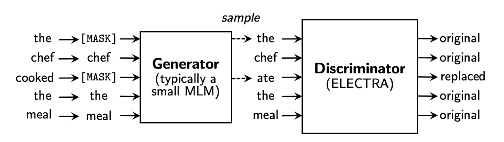

它首先也会对原始的输入做随机的Mask，然后用一个小的类似Bert的语言模型(预训练之后会丢弃掉)来尝试还原mask的结果，这里强调的是一个小的模型，所以该小模型还原出来的应该是大致合理但不是非常好的结果，比如这里把"cooked"还原成了"ate"。
接下来使用一个比较大的判别模型，这里就是ELECTRA来判断每一个单词是否发生了替换。这种方式同时解决了上述两个问题，首先它所有的单词都受到了有效监督，同时真正会用到的模型(ELECTRA)没有受到Mask单词的影响。

- 还有非常多的模型尝试进行了改进，下图中有所体现

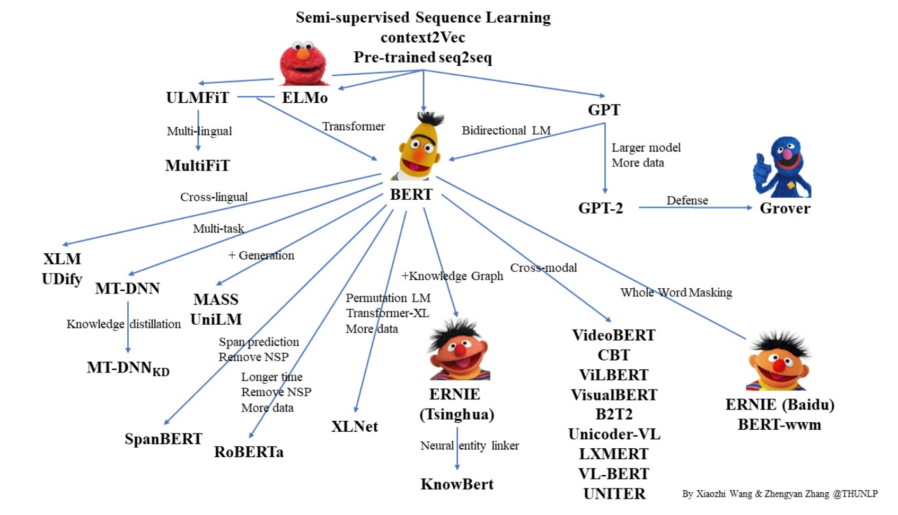

#### Mask语言模型应用

- 基本思想：利用双向信息去预测目标token

除了基于单语言token建模之外，还可以通过mask获取多模态和多语言信息

比如跨语言应用，在本应用中的挑战是如何把不同的语言的词和句法结构建立关联。Masked LM可以提供非常好的工具，比如在英法翻译中，我们Mask掉一个英文单词，模型可以注意到该英语单词的上下文来还原该单词，同样也可以注意到在它的翻译中，法语，应该也会大概对应一个法语词，鼓励模型对应英法与法语表征。

在跨模态模型中也有对齐问题，比如视频和文本，需要把文本的token和视觉区域做关联。

可以看到，Masked LM作为无监督数据中数据关联的一种方式，除了在文本之外，在很多其他的领域也可以有所应用。

### 预训练语言模型前沿发展

#### GPT-3

首先不得不提的就是GPT-3，前面介绍的GPT的第三代，一个超大的模型。

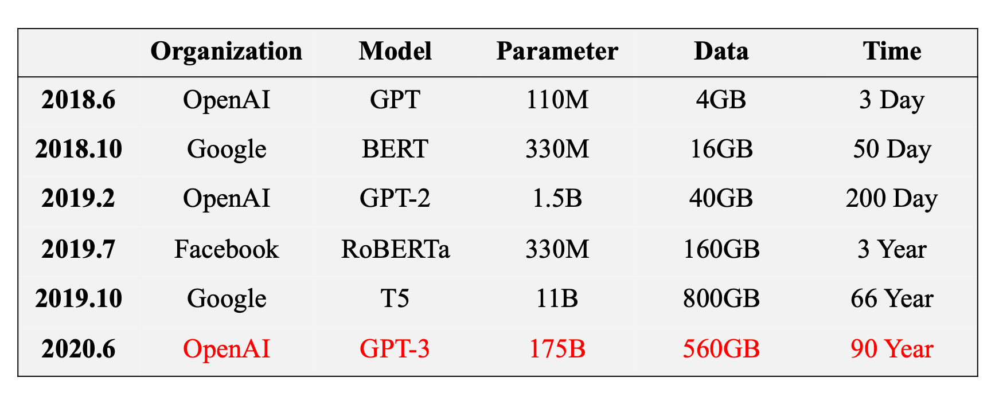

在它的模型规模和预训练数据增大了之后，我们会观察到一些神奇的现象。

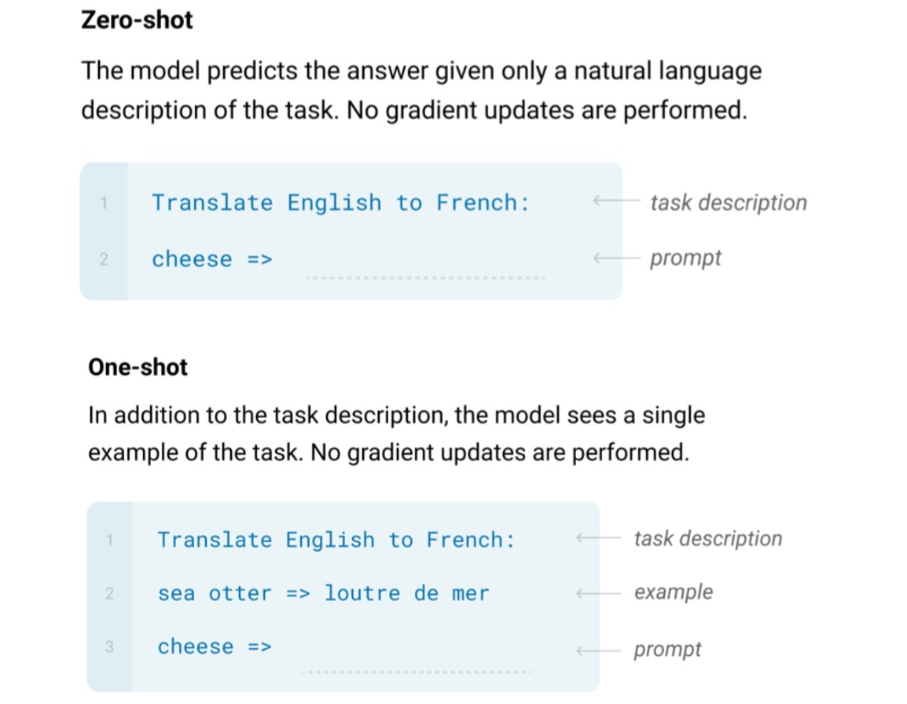

它的Zero-shot/One-shot效果非常好。

- zero-shot就是可以不给模型任何训练数据，只给它一个整体的任务描述，模型就可以完成任务，如上图所示。

- 而one-shot就是在zero-shot的基础上，我们可以只提供一个样例，让模型来完成任务。

它其实都是以in-context learning的形式完成的，所谓in-context learning指它没有针对下游任务做任何参数的更新，只是在上下文中给了这个任务的描述以及样例，通过语言模型自回归地生成来完成这个任务。

#### T-5

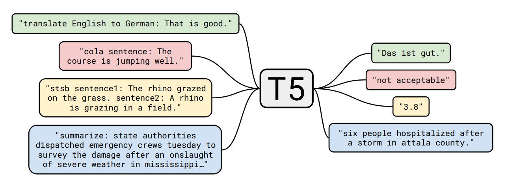

在GPT之后的这个T5也是非常重要的一种预训练语言模型。它的创新在于将所有的NLP任务统一成一个text-to-text的形式，输入都是任务的描述加上任务的内容，T5基于encoder-decoder的一个架构，利用seq2seq的方式去生成答案。

T5也是非常通用的一个框架，在语言理解以及生成上面都取得了非常好的效果。

#### MoE

在发现预训练模型规模越大，效果越好之后，大家进行了各种尝试来训练更大的模型，但后面研究者发现，在模型越来越大之后，它的优化上会出现各种问题。

为了解决这些问题，研究者提出了基于Mixture of Experts(MoE)的方式去增大模型的参数，以训练更大规模的预训练语言模型。

- 主要的思想是把模型的参数分成一块块的子模块，每次模型的输入只调用其中部分的子模块来参与计算。将每个子模块看成是一个专家(expert)，而整体的模型是不同export组合的结果。

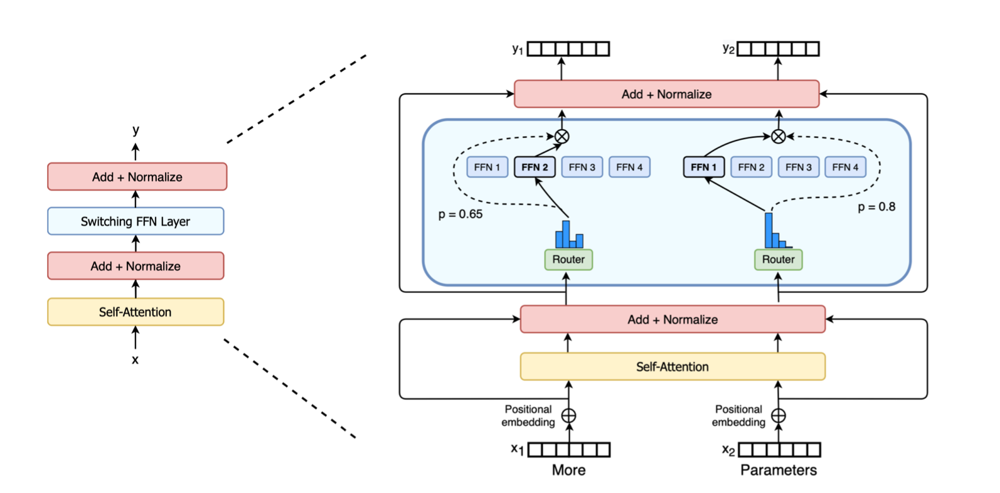