## 注意力机制

### 1. Attention

#### 1.1 核心思想

其实就是通过在decoder的每一步都把encoder端所有的向量提供给decoder模型，这样decoder根据自己当前的状态来自动选择需要使用的信息和向量

#### 1.2 一般的定义

给定一个查询向量和一组值向量，注意力技术根据查询计算值的加权和

#### 1.3 直观定义

根据查询，加权和是值的选择性汇总。我们可以通过注意机制获得任意表征集的固定大小表征。

#### 1.4 数学公式

#### 1.5 注意力分数计算方法

##### 1.5.1 点乘

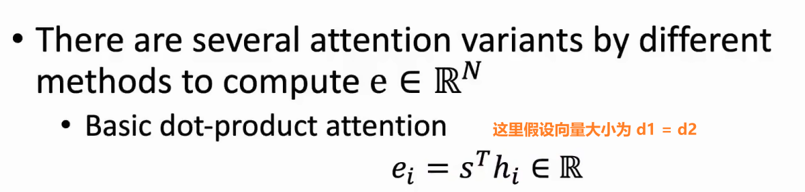

注：如果d1、d2维度不一致，我们就需要在中间加上一个权重矩阵，表达式如下。

##### 1.5.2 Additive attention

使用了一层的前馈神经网络，将两个向量变成一个标量来得到注意力分数

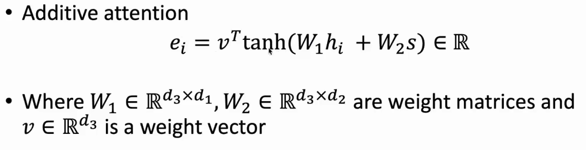

### 2. seq2seq

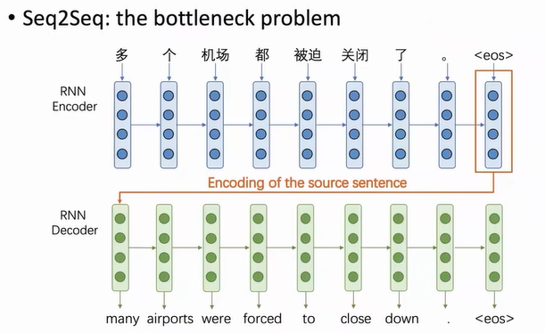

**瓶颈问题**：要求encoder端得到的最后一个向量表示需要包含输入句子的所有信息，而一个向量会显著地限制模型encoder端的一个表示。最后一个向量是限制encoder和decoder端的一个信息瓶颈

### 3. Seq2Seq with Attention

用encoder用蓝色来表示，decoder用绿色来表示，encoder端得到的每一个隐向量分别用h1到h7来表示，在decoder端得到的第一个隐向量用s1来表示

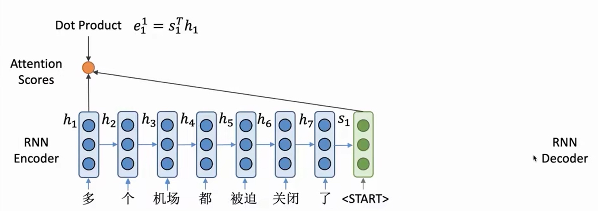

与之前RNN模型不同的是，我们不用这个s1来直接计算这一步生成的单词的概率，而是用s1来选择关注输入句子中的哪些部分，并计算得到一个新的隐向量来得到生成单词的一个概率

- 根据s1来对encode端的向量进行选择：计算注意力分数=将S1与h1进行点积，一直持续计算

  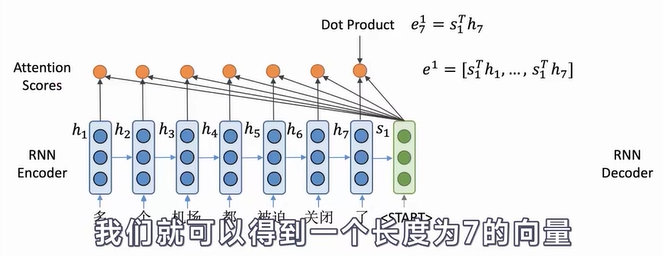

$e^1$中每个无素都是S1和对应位置的隐向量点积得到，$e^1$称为encoder端隐问量的一个注意力分数，而这个分数其实就表示了s1与每I个encode端隐向量hi的一个相似程度，值越高表示s1与对应的隐向量相似程度越高

- 接下来对e^1进行softmax转换为概率分布后，再进行加权求和得到注意力分布输出o1.

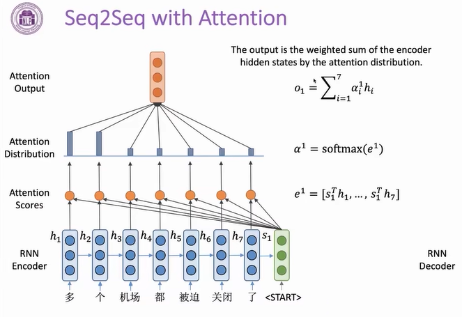

- 最后将o1与RNN得到的隐向量s1进行拼接来表示encoder端这一步的一个状态，用这样一个向量来预测下步需要生成的单词

  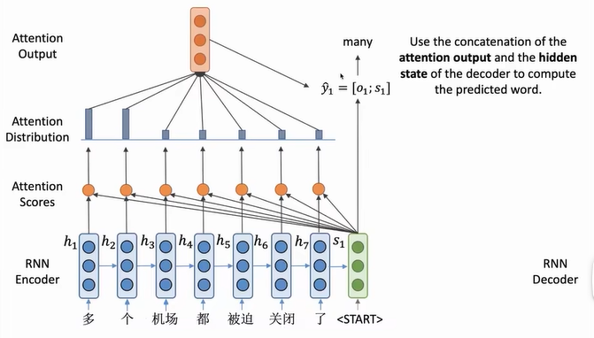

- 推演，上一个输出作为输入，可以看到前7个单词的注意力概率分布有变化

  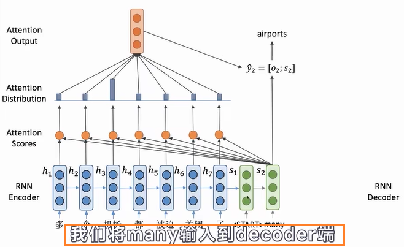

  最后的模型输出效果如下

  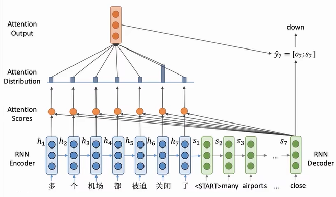

  

### 4. 算法流程

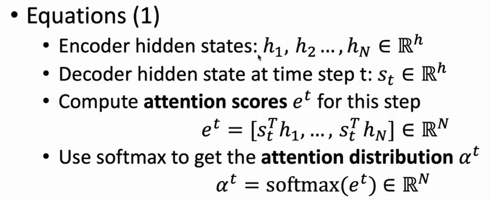

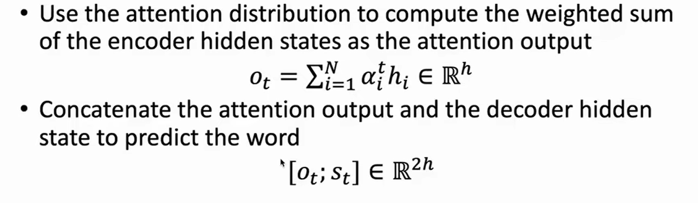

### 5. 算法优点

- 注意力解决瓶颈问题：解码器可以直接看源

- 注意力有助于消失梯度问题：通过提供通往long-distance states的捷径，它通过在encoder和decoder之间提供了一种直接连接的方式防止了梯度在RNN中会传播过长进而导致梯度消失

- 注意力提供了一定的可解释性: 我们可以通过注意力特征找出解码器所关注的内容
- 注意力允许网络对齐相关词汇