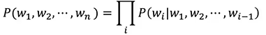
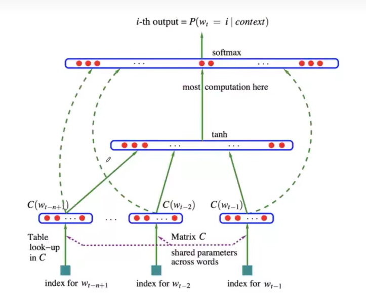
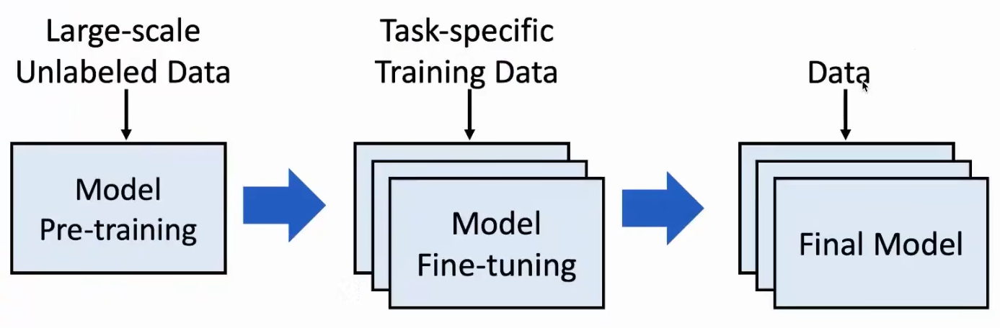

## 自然语言基础处理基础&大模型基础

> https://www.bilibili.com/video/BV1UG411p7zv

### 1. 判断是否具备人工智能？

最初的判断标准为模仿游戏，鸭子定律。只要表现得像人就认为具备，图灵测试。

### 2. 自然语言处理的基本任务

1. 词性标注（Part of speech）：分析词性（adj、n、v...)
2. 命名实体识别（Named entity recognition）：分析是人名、地名、机构名等
3. 共指消解（Co-reference）：分析代词与前面哪个实体是指代关系
4. 依存句法（Basic dependencies）：分析主谓宾等等
5. 在中文中还有一个基本任务：自动分词

### 3. 自然语言的应用

1. 搜索引擎和广告投放系统：将用户的query与网页/广告进行相似度计算
2. Google搜索引擎：构建知识图谱来（Machine reading 挖掘文本生成结构性三元组用以生成知识图谱）
3. 情感分类
4. 机器翻译

### 4. 词的表示

1. 词与词之间的相关性计算
2. 词与词之间的关系（如WR(Man)~=WR(King)-WR(Queen)+WR(Woman)）
3. 用相关的词来表示这个词，但有细致差异的词之间无法很好表示
4. **最常用的方法是采用One-hot 方式**，但是由于词都正交，任意词相似度为0，因此采用上下文的方式（contextual representation）来进行表示
5. Count-based distributional representation，就是利用这个词上下文词的统计数构建跟vocabulary维度一样的向量，但是有些词不多，向量会很稀疏，并且当词越多占用存储越多
6. 分布式表示 Distributed Representation（word embedding），建立一个低纬的稠密向量空间，然后将每个词学习到这个空间里。即为从大规模文本语料库中学习的每个单词构建稠密向量，代表作Word2Vec

### 5. 语言模型

语言建模是预测即将出现的单词的任务，主要分为以下2个任务

1. 计算单词序列的联合概率，即判断词序列成为一句话的可能性

2. 计算即将出现的单词 $ w_n $ 的条件概率，即预测即将出现的单词的概率

实现假设：当前词只受前面词的影响

模型表示：一个句子的联合概率=它里面前面每个词的条件概率之积

#### 5.1 语言模型 N-gram Model

收集关于不同n-gram的频率的统计数据，并使用这些数据来预测下一个单词。即为前面出现n-1个词然后后面出现这个词的概率有多大。

实现假设：Markov assumption

模型问题：很少去考虑更多的历史，存在存储和稀疏的问题;没有办法去理解词交互之间的相似度造成什么。（The cat is walking in the bedroom；A dog was running in a room。N-gram在猫和狗、走路和跑步之间找不到相似的语义和语法角色）

N：一般是2/3.

> 以下源自[知乎](https://zhuanlan.zhihu.com/p/589369480)

> N-gram 中的 N 就是数字 1、2、3...，表示预测下一个词的出现概率时，限制前面词的数量，对比上述朴素语言模型的「前面所有的词」，用 back-off 或 smothing 平滑的方法处理新的单词组合。
>
> N-gram 有一个前提假设——Markov 马尔科夫假设，没有假设之前，预测第 i 个词，要看 wi 前面所有的词，使用马尔科夫假设之后，现在预测第 i 个词，只看 wi 前面的 k 个词，不再考虑太远的词，它们对当前词的预测影响可能已经不大了，因此公式可简化为：P（wi｜w1，w2，...，wi-1）约等于 P（wi｜wi-k，...，wi-1）。
>
> 同样使用【I love your money】这句话，当 N=2 时，即 Bigram，P（money｜I，love，your）约等于 P（money｜your）。当 N=3 时，即 Trigram，P（money｜I，love，your）约等于 P（money｜love，your），N 值越大，需要的算力越大。
>
> N-gram 模型改进了朴素语言模型，但是同样也存在自身不足：
>
> - N-gram 本质上是原有朴素语言模型的近似简化；
> - 没有考虑 N 之外的上下文信息，必然会丢掉一部分信息特征；
> - 把词看作独立的符号，没有考虑词之间的相似度，没有考虑词背后的语义信息。

#### 5.2 语言模型 Neural Language Model

神经语言模型（Neural Language Model）是一种基于神经网络的语言模型，用于学习（单词的分布式表示）前文和当前词的预测条件概率

每个词都是一个低维向量（而N-gram Model中每个词都是符号），相似的词的向量也就会比较相似，就有可能会在语境里面发挥相似的作用。

### 6. 大模型背后的范式

在预训练阶段，预训练的语言模型从大规模的未标记数据中获取丰富的知识。然后，可以用特定任务的训练数据对预训练的模型进行微调，以适应预训练的知识.预训练和微调的基本范式可以追溯到**迁移学习**

