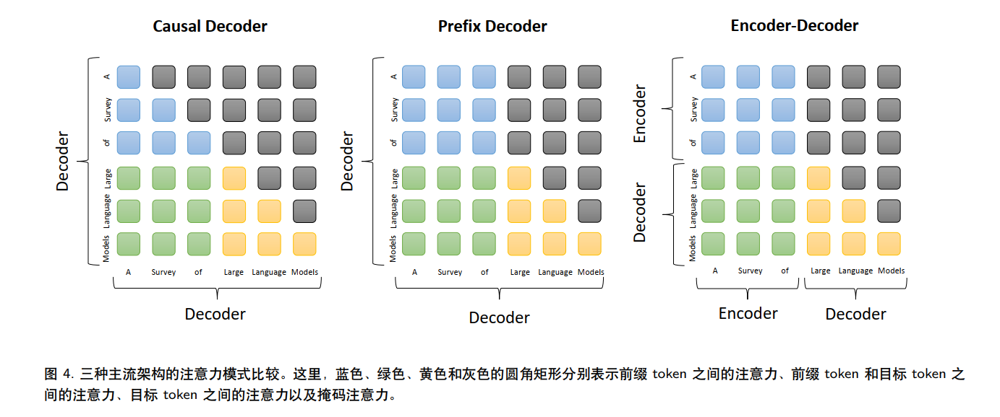
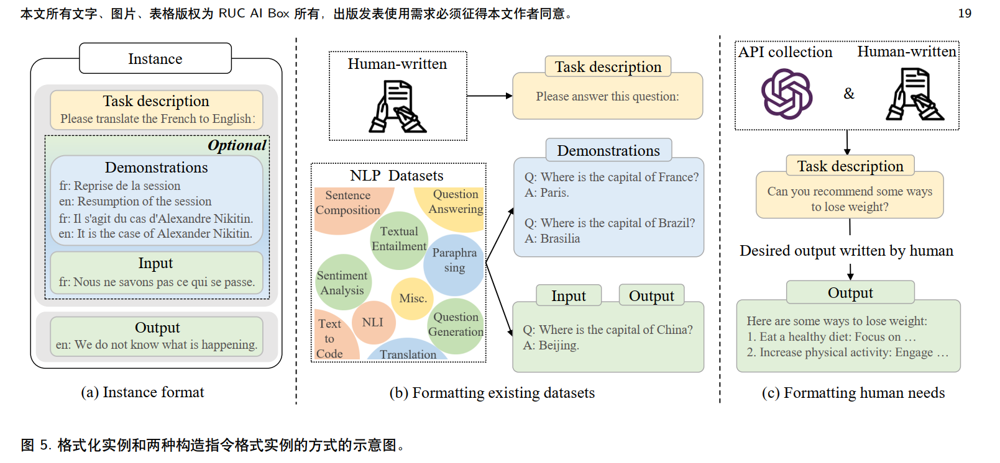

# A Survey of Large Language Models

> - A Survey of Large Language Models 中文版本综述 [点击此处](https://github.com/RUCAIBox/LLMSurvey/blob/main/assets/LLM_Survey_Chinese.pdf)
>
> #### 索引
>
> [1.引言](#1引言)${\begin{cases} 统计语言模型 (SLM)\\神经语言模型 (NLM)\\预训练语言模型 (PLM)\\大语言模型 (LLM) \end{cases}}$
>
> [2.概述](#2概述)
>
> > - [2.1.大语言模型的背景](#21大语言模型的背景)${\begin{cases} 扩展法则\\涌现能力\\关键技术 \end{cases}}$
> >- [2.2.GPT系列模型的技术演进](#22GPT系列模型的技术演进)
>
> [3.大语言模型资源](#3大语言模型资源)${\begin{cases} 公开可用的模型检查点或API\\常用语料库\\代码库资源\end{cases}}$
>
> [4.预训练](#4预训练)
>
> > - [4.1.数据收集](#41数据收集)
> > - [4.2.架构](#42架构)${\begin{cases} 主流架构\\详细配置(标准化、位置编码、激活函数、注意力和偏置)\\预训练任务\\总结和讨论\end{cases}}$
> > - [4.3.模型训练](#4.3.模型训练)
>
> [5.大语言模型的适配微调](#5大语言模型的适配微调)
>
> > - [5.1.指令微调](#51指令微调)
> > - [5.2.对齐微调](#52对齐微调)
> > - [5.3.高效微调](#53高效微调)
>
> [6.使用](#6使用)
>
> > - [6.1.上下文学习](#61上下文学习)
> > - [6.2.思维链提示](#62思维链提示)
>
> [7.能力测试](#7能力测试)
>
> > - [7.1.基础评测任务](#71基础评测任务)
> > - [7.2.高级能力评估](#72高级能力评估)
> > - [7.3.公开基准和经验性分析](#73公开基准和经验性分析)
>
> [8.总结与未来方向](#8总结与未来方向)

## 1.引言

[点击返回](#A-Survey-of-Large-Language-Models)

本节主要讲述了大语言模型发展的四个过程：统计语言模型 (SLM)、神经语言模型 (NLM)、预训练语言模型 (PLM)，再到大语言模型 (LLM) 

> - 【发展历程】[大语言模型是如何发展来的？](#1引言)
>
>
> 引言部分主要介绍了LLM的发展历程，从统计语言模型 (SLM)、神经语言模型 (NLM)，到预训练语言模型 (PLM)，再到大语言模型 (LLM) ，模型所用的方法从统计学变成神经网络，再从双向LSTM变成基于transformer的方法，数据量越来越大

- **统计语言模型 *(SLM)***： SLMs [4–7] **基于统计学习方法开发**，并在 20 世纪 90 年代兴起。其基本思想是**基于马尔可夫假设建立词预测模型**，例如根据最近的上下文预测下一个词。**具有固定上下文长度 *n* 的 SLM 也称为 *n* 元语言模型，例如bigram 和 trigram 语言模型**

- **神经语言模型 (NLM)**： **NLM [15–17] 通过神经网络， 如循环神经网络（RNN），来描述单词序列的概率。**作为一个显著贡献，[15] 的工作**引入了词的分布式表示这一概念，并在聚合上下文特征（即分布式词向量）的条件下构建词预测函数**

> 词的分布式表示(可参考[笔记](../../../NLP/词的分布式表示.md))：
>
> 简而言之，局部表示（Local Representation）中，每一个元素（如词向量中的一个元素、神经网络中的一个神经元）表示一个实体（词汇）；而在分布式表示（Distributed Representation）中，一个实体（词汇）是由多个元素表征的，同样，一个元素也不仅只涉及到一个实体。
>
> 基于分布式表示的思想，我们构建一个密集向量（Dense Vector）来表征一个词汇。使用向量点积表征词汇含义相似度，这就是Word2Vec([word2vec笔记](../../清华NLP/word2vec.md))方法的基本思想。即
>
> - 将词典中的每一个词都用分布式实数词特征向量表示以对抗维度灾难；
> - 基于该特征向量表达词序的联合概率函数；
> - 同时学习词特征向量与概率函数的参数。

- **预训练语言模型 (PLM)**：作为早期尝试，**ELMo [21] 被提出来通过预训练一个双向 LSTM（biLSTM）网络（而不是学习固定的词表示）来捕捉上下文感知的词表示，然后根据特定的下游任务微调 biLSTM 网络**。进一步，**基于自注意力机制的高度并行化 Transformer 架构 [22]，BERT [23] 作为双向语言模型，在大规模无标签语料库上使用专门设计的预训练任务**。

这些预训练的上下文感知词表示作为通用语义特征非常有效，其极大地提高了 NLP 任务的性能。这项研究激发 了大量后续工作，确立了“预训练和微调”学习范式。

- **大语言模型 (LLM)**： **研究人员发现，扩展 PLM（例如扩展模型大小或数据大小）通常会提高下游任务的模型性能（即遵循扩展法则 [30]）。**

大规模的 PLM 在解决一系列复杂任务中展示了惊人的能力（称为涌现能力）。例如， **GPT-3 可以通过上下文学习（in-context learning, ICL） 来解决小样本任务**，而 GPT-2 则表现不佳。

## 2.概述

[点击返回](#A-Survey-of-Large-Language-Models)

> 本节主要介绍大语言模型的背景及GPT技术的演进过程
>
> - [2.1.大语言模型的背景](#21大语言模型的背景)
> - [2.2.GPT系列模型的技术演进](#22GPT系列模型的技术演进)

### 2.1.大语言模型的背景

[点击返回](#2概述)

此节主要介绍如何从预训练模型变成大语言模型，而大语言模型的能力以及核心技术是什么？

> 【扩展法则】[如何从预训练模型变成大语言模型？](#211大语言模型的扩展法则)
>
> - 大语言模型主要从扩展 “ 模型规模、数据规模和总计算量（数量级）”三个角度进行分析
>
> > 从扩展法则而言，三者存在一定的关系，分别提出了 KM、Chinchilla 俩种扩展法则
> >
> > > 在给定计算资源的情况下
> > >
> > > - KM 扩展法则更偏向于将更大的预算分配给模型大小
> > > - Chinchilla 扩展法则则认为模型大小和数据大小应该以相同的比例增加
>
> 【涌现能力】[大语言模型的能力是什么？](#212大语言模型的涌现能力)
>
> - LLM 的涌现能力被定义为 “在小型模型中不存在但在大型模型中产生的能力”，这是区别 LLM 与先前 PLM 的最显著特征之一 
>
> > LLM 的三种典型涌现能力和具备这种能力的代表性模型
> >
> > > - 上下文学习：假设已经为语言模型提供了一个自然语言指令和/或几个任务演示，它可以通过完成输入文本的单词序列的方式来为测试实例生成预期的输出，而无需额外的训练或梯度更新
> > > - 指令遵循：通过使用自然语言描述的混合多任务数据集进行微调（称为指令微调）， LLM 在未见过的以指令形式描述的任务上表现出色
> > > - 逐步推理：对于小型语言模型而言，**通常很难解决涉及多个推理步骤的复杂任务**，例如数学问题。然而，通过使用思维链（Chain-of-Thought, CoT）提示策略， LLM 可以通过利用包含中间推理步骤的提示机制来解决这类任务，从而得出最终答案
>
> 【关键技术】[大模型形成的关键技术是什么？](#213大语言模型的关键技术)
>
> - 在LLM 进化到当前的状态——通用且有能力的学习者 这个过程中，人们提出了许多重要的技术，这些技术（可能）是导致 LLM成功的关键，大大提升了 LLM 的能力。
>
> > 以下简要列举了几种重要的技术 ，这些技术（可能）是导致 LLM成功的关键
> >
> > > - 扩展：Transformer 语言模型存在明显的扩展效应：更大的模型/数据规模和更多的训练计算通常会导致模型能力的提升
> > >
> > > - 训练：分布式训练算法是学习 LLM 网络参数所必需的，其中通常联合使用各种并行策略。为了支持分布式训练，已经发布了一些优化框架来促进并行算法的实现和部署，例如 DeepSpeed [65] 和 Megatron-LM [66–68]。
> > >
> > > - 能力引导：设计合适的任务指令或具体的 ICL 策略激发已经具备作为通用任务求解器的潜在能力，如CoT提示、指令微调
> > >
> > > - 对齐微调：利用**基于人类反馈的强化学习技术**使 LLM 能够按照期望的指令进行操作，产生高质量、无害的回答
> > > - 工具操作： 即利用外部工具（如计算器、搜索引擎）来弥补 LLM 在数字计算、获取最新信息上等不足

#### 2.1.1.大语言模型的扩展法则

大语言模型的扩展法则： 目前， LLM 主要建立在 Transformer架构上 [22]， LLM 大幅度扩展了**模型规模、数据规模和总计算量（数量级）**。大量研究表明，扩展可以大幅提高 LLM 的模型能力 [26, 55, 56]。接下来，我们介绍两个 Transformer 语言模型的代表性扩展法则 [30, 33]。  

<a href="#扩展法则">点击返回</a>

##### 2.1.1.1.KM 扩展法则

**KM 扩展法则**：2020 年， Kaplan 等人 [30]（OpenAI团队）首次提出了神经语言模型的性能与**模型规模（N）、数据集规模（D）和训练计算量（C）**之间的幂律关系。**在给定计算预算 c 的条件下**，他们依据实验提出了三个基本公式来描述扩展法则  

这里， L(·) 表示用 nats 表示的交叉熵损失。这三个规律是通过拟合模型在<u>不同数据大小（2200 万到 230 亿个 token）、模型大小（7.68 亿到 15 亿个非嵌入参数）</u>和训练计算量下的性能得出的，同时做出了一些假设（如**一个因素的分析不会受到其他两个因素的限制**）。结果表明，模型性能与这三个因素存在着强依赖关系。  

> 在计算时，相当于给定计算量C后，L(C)=L(D)=L(N)来分别计算模型规模和数据集规模

##### 2.1.1.2.Chinchilla 扩展法则

**Chinchilla 扩展法则**： 作为另一代表性研究， Hoffmann等人 [33]（Google DeepMind 团队）**提出了一种扩展法则的替代形式来指导 LLM 最优计算量的训练**。他们通过变化更大范围的模型大小（7000 万到 160 亿个参数）和数据大小（50 亿 到 5000 亿个 token）进行了严格的实验，并拟合了一个类似的扩展法则，但具有不同的系数，如下所示 [33]：  

其中 E = 1.69, A = 406.4, B = 410.7， α = 0.34 和 β = 0.28。**通过在约束条件 C ≈ 6ND 下优化损失 L(N, D)**，他们展示了将计算预算最优地分配给模型大小和数据大小的方法（如下）：  

这里， $a = {α\overα+β}$， $b = {β\over α+β}$， **G** 是由 A、 B、 α 和 β 计算得出的扩展系数。正如 [33] 中所分析的那样，随着给定计算预算的增加， **KM 扩展法则更偏向于将更大的预算分配给模型大小**，而 **Chinchilla 扩展法则则认为模型大小和数据大小应该以相同的比例增加**，即在公式 (3)中的 a 和 b 取相近的值。  

#### 2.1.2.大语言模型的涌现能力

大语言模型的涌现能力：LLM 的涌现能力被正式定义为 “在小型模型中不存在但在大型模型中产生的能力”，这是区别 LLM 与先前 PLM 的最显著特征之一 。我们简要介绍了 LLM 的三种典型涌现能力和具备这种能力的代表性模型 

<a href="#涌现能力">点击返回</a>

##### 2.1.2.1.上下文学习

**上下文学习**： ICL 能力是由 GPT-3 [55] 正式引入的：**假设已经为语言模型提供了一个自然语言指令和/或几个任务演示，它可以通过完成输入文本的单词序列的方式来为测试实例生成预期的输出，而无需额外的训练或梯度更新。**

在 GPT系列模型中， 1750 亿的 GPT-3 模型在一般情况下表现出强大的 ICL 能力，但 GPT-1 和 GPT-2 模型则没有。然而，这种能力还取决于具体的下游任务。例如， **130 亿参数**的 GPT-3可以在**算术任务**（例如 3 位数的加减法）上展现出 ICL 能力，但 1750 亿参数的 GPT-3 在波斯语 QA 任务上甚至无法很好地工作.

##### 2.1.2.2.指令遵循

**指令遵循**： **通过使用自然语言描述的混合多任务数据集进行微调（称为指令微调）， LLM 在未见过的以指令形式描述的任务上表现出色** 。通过指令微调， **LLM 能够在没有使用显式示例的情况下遵循新的任务指令，因此它具有更好的泛化能力**。

 [62] 中的实验证明，当模型大小**达到 680 亿时**，经过指令微调的 LaMDA-PT [63] 开始在未见过的任务上显著优于未微调的模型，但对于 80 亿或更小的模型大小则不会如此。最近的一项研究 [64] 发现， PaLM **至少在 620 亿**的模型大小上才能在四个评估基准（即 MMLU、 BBH、 TyDiQA和 MGSM）的各种任务上表现良好，尽管较小的模型可能足够完成某些特定任务（例如 MMLU）。  

##### 2.1.2.3.逐步推理

**逐步推理**： 对于小型语言模型而言，**通常很难解决涉及多个推理步骤的复杂任务**，例如数学问题。然而，通过使用思维链（Chain-of-Thought, CoT）提示策略 [32]， LLM 可以通过利用包含中间推理步骤的提示机制来解决这类任务，从而得出最终答案。

这种能力可能是通过在代码上进行训练而获得。一项实证研究 [32] 表明，当应用于模型大小**大于 600 亿**的 PaLM 和 LaMDA 变体时， CoT 提示可以提高模型在算术推理基准任务上的性能，而当模型大小超过 1000 亿时，其相对于标准提示的优势更加明显。此外， CoT 提示的性能改进在不同的任务上也存在差异，例如对于 PaLM 来说， GSM8K > MAWPS > SWAMP [32]。  

#### 2.1.3.大语言模型的关键技术

经过漫长的发展， LLM 进化到了当前的状态——通用且有能力的学习者。在这个过程中，人们提出了许多重要的技术，大大提升了 LLM 的能力。在此，我们简要列举了几种重要的技术，**这些技术（可能）是导致 LLM成功的关键** 

<a href="#关键技术">点击返回</a>

##### 2.1.3.1.扩展

**扩展**： 如前面的部分所讨论的， Transformer 语言模型存在明显的扩展效应：更大的模型/数据规模和更多的训练计算通常会导致模型能力的提升。

例如， Chinchilla（具有更多的训练 token）通过在相同的计算预算下增加数据规模，优于其对应的模型 Gopher（具有更大的模型规模） [33]。然而，需要注意的是，**数据扩展应该经过谨慎的清理过程，因为预训练数据的质量在模型能力中起着关键作用**  

##### 2.1.3.2.训练

**训练**：分布式训练算法是学习 LLM 网络参数所必需的，其中通常联合使用各种并行策略。为了支持分布式训练，已经发布了一些优化框架来促进并行算法的实现和部署，例如 DeepSpeed [65] 和 Megatron-LM [66–68]。

此外，优化技巧对于训练稳定性和模型性能也很重要，例如重新开始以克服训练损失激增 [56] 和混合精度训练 [69]。最近， GPT-4 [45] 提出开发特殊的基础结构和优化方法，用更小的模型来可靠地预测大模型性能。  

##### 2.1.3.3.能力引导

**能力引导**： 在大规模语料库上预训练之后， LLM 具备了作为通用任务求解器的潜在能力。然而，当 LLM 执行一些特定任务时，这些能力可能不会显式地展示出来。作为技术手段，设计合适的任务指令或具体的 ICL 策略可以激发这些能力。

例如，通过包含中间推理步骤， **CoT 提示**已被证明对解决复杂的推理任务有效。此外，我们还可以使用自然语言表达的任务描述对 LLM 进行**指令微调**，以提高 LLM 在未见任务上的泛化能力。然而，这些技术主要对应于 LLM 的涌现能力，可能对小语言模型的效果不同。  

##### 2.1.3.4.对齐微调

**对齐微调**： 由于 LLM 被训练用来捕捉预训练语料库的数据特征（包括高质量和低质量的数据），它们可能会为人类生成有毒、偏见甚至有害的内容。因此，有必要使 LLM 与人类价值观保持一致，例如利用**基于人类反馈的强化学习技术**使 LLM 能够按照期望的指令进行操作。

ChatGPT 实际上采用类似于 InstructGPT 的技术，在产生高质量、无害的回答（例如拒绝回答侮辱性问题）方面表现出很强的对齐能力。  

##### 2.1.3.5.工具操作

**工具操作**： 即利用外部工具来弥补 LLM 的不足，比如在那些不适合以文本形式表达的任务上表现不佳（例如数字计算），受限于预训练数据无法获取最新信息等

例如， LLM 可以利用计算器进行准确计算 [71]，利用搜索引擎检索未知信息 [72]。最近， ChatGPT 已经实现了使用外部插件（现有或新创建的应用程序）的机制，这类似于 LLM 的“眼睛和耳朵”。这种机制可以广泛扩展 LLM 的能力范围。  

### 2.2.GPT系列模型的技术演进

[点击返回](#2概述)

图1.最近几年现有的 LLM（大小超过 100 亿）的时间轴。时间轴主要是根据模型技术论文的发布日期（例如提交到 arXiv 的日期）建立的。  

> 此节特别讨论了GPT 系列模型的技术演进。总体而言， OpenAI 对 LLM 的研究可以大致分为以下几个阶段。  
>
> > 【早期探索】【GPT-1、2】[初始GPT架构是如何诞生的？](#221早期探索)
>>
> > - 在 OpenAI 的早期是尝试使用循环神经网络（RNN）。随着 Transformer 的出现， OpenAI开发了两个初始的 GPT 模型，即 GPT-1[74] 和 GPT-2[26]，它们可以看作是后来更强大模型（如 GPT-3 和 GPT-4）的基础
>>
> > > - GPT-1：GPT-1 是基于生成型的、仅解码器的 Transformer 架构开发的，并采用了无监督预训练和有监督微调的混合方法.
> > > - GPT-2：采用了与 GPT-1 类似的架构，将参数规模增加到 15 亿，使用大规模的网页数据集 WebText进行训练，引入了多任务求解的概率形式，即p(output|input, task)。认为每个 NLP 任务可以被视为基于世界文本的子集的单词预测问题
>>
> > 【能力飞跃】【GPT-3】[GPT-3能力飞跃采用何种技术？](#222能力飞跃)
>>
> > - GPT-3使用代码数据进行训练以及与人类偏好的对齐进一步提升能力
>>
> > > - 使用代码数据进行训练：采用 大量GitHub 代码微调的方法 / 训练文本和代码嵌入的对比方法 都提高了推理能力，猜测称使用代码数据进行训练可以**极大地增加 LLM 的CoT 提示能力**
> > > - 与人类对齐：GPT2采用RL的近端策略优化 ( PPO)  算法进行了微调，其利用人类偏好来改进 GPT-2 在 NLP 任务上的性能。InstructGPT则以上为基础正式建立了一个三阶段的基于人类反馈的强化学习（RLHF） 算法
>>
> > 【语言模型的重要里程碑】【ChatGPT 、GPT-4】[OpenAI 取得的两个重要的里程碑](#223语言模型的重要里程碑)
>>
> > > - ChatGPT：ChatGPT 是以类似 InstructGPT的方式进行训练的， 与 InstructGPT一个不同之处在于ChatGPT 训练数据是通过将人类生成的对话（扮演用户和AI 两个角色）与 InstructGPT 数据集结合起来以对话形式生成
> > > - GPT-4：在 RLHF 训练中加入了额外的安全奖励信号，引入红队评估 的机制来减少有害或生成有毒内容的可能性，引入了一种称为可预测扩展（predictable scaling） 的新机制，可以使用模型训练期间一小部分的计算量来准确预测最终性能
>>

#### 2.2.1.早期探索

<a href="#早期探索">点击返回</a>

##### 2.2.1.1.GPT-1

**GPT-1**：GPT代表生成式预训练（Generative Pre-Training），GPT-1 是**基于生成型的、仅解码器**的 Transformer 架构开发的，并采用了无监督预训练和有监督微调的混合方法。 GPT-1 为 GPT 系列模型建立了核心架构，并确立了**对自然语言文本进行建模的基本原则**，**即预测下一个单词**  

##### 2.2.1.2.GPT-2

**GPT-2**： GPT-2[26] 采用了与 GPT-1 类似的架构，将参数规模增加到了 15 亿，并使用大规模的网页数据集 WebText进行训练。通过无监督语言建模来执行任务，而无需使用标记数据进行显式微调。为了推动这种方法，引入了多任务求解的概率形式，即p(output|input, task)（类似的方法已在 [75] 中采用），它在给定输入和任务信息的条件下预测输出。为了对该条件概率建模，自然语言文本可以自然地用作为格式化输入、输出和任务信息的统一方式。通过这种方式，解决任务的过程可以被视为生成解决方案文本的单词预测问题。

此外，他们对这个想法提出了更正式的说明：“**由于（特定任务的）有监督目标与无监督（语言建模）目标相同，但只在序列的子集上进行评估，所以无监督目标的全局最小值也是有监督目标的全局最小值（对于各种任务）**” 。对这个主张的基本理解是，**每个 NLP 任务可以被视为基于世界文本的子集的单词预测问题**。因此，如果模型训练后具有足够能力以复原世界文本，无监督语言建模可以解决各种任务。

#### 2.2.2.能力飞跃

总体而言， OpenAI 探索了两种主要方法来进一步改进 **GPT-3 模型**，即使用代码数据进行训练以及与人类偏好的对齐

<a href="#能力飞跃">点击返回</a>

##### 2.2.2.1.使用代码数据进行训练  

原始的 GPT-3 模型（在纯文本上进行预训练）的一个**主要限制在于缺乏复杂任务的推理能力，例如完成代码和解决数学问题**。

为了增强这种能力， OpenAI 在 2021 年 7 月推出了 Codex [78]，这是一个**在大量GitHub 代码上微调的 GPT 模型**。它证明了 Codex 可以解决非常困难的编程问题，并且在数学问题上有显著的性能提升 [79]，表明这是改善 GPT 模型能力（尤其是**推理能力**）的一种非常有用的实践。此外，一种用于**训练文本和代码嵌入的对比方法** [80]，它在一系列相关任务（例如线性探测分类、文本搜索和代码搜索）上有所提升。此外，还有一种猜测称使用代码数据进行训练可以**极大地增加 LLM 的CoT 提示能力** [46]，尽管这仍然需要更全面的验证。  

##### 2.2.2.2.与人类对齐

最初“learning from human preferences” 描述了应用强化学习（RL）来学习由人类标注的偏好比较的工作，类似于InstructGPT 在图 6中的对齐算法的奖励训练步骤.

GPT-2 通过**RL的近端策略优化 (Proximal Policy Optimization, PPO)  算法进行了微调，其利用人类偏好来改进 GPT-2 在 NLP 任务上的性能**。InstructGPT[61] 在 2022 年 1月提出，以改进 GPT-3 模型的与人类对齐能力，**正式建立了一个三阶段的基于人类反馈的强化学习（RLHF） 算法**。请注意， OpenAI 的论文和文档中似乎很少使用 “指令微调” 一词，而是用在人类示例上有监督微调来替代（即 RLHF 算法的第一步 [61]）。

除了提高指令遵循能力之外， **RLHF 算法对于缓解有害或有毒内容的生成问题十分有效**，这对于 LLM 在实践中的安全部署至关重要。 OpenAI 在一篇技术文章中描述了他们在对齐研究中的方法 [83]，总结了三个有前途的方向： “训练 AI 系统使用人类反馈，协助人类评估以及做对齐研究”。  

#### 2.2.3.语言模型的重要里程碑

基于所有的探索工作， OpenAI 取得了两个重要的里程碑： ChatGPT [84] 和 GPT-4 [45]，这两个模型大大提升了现有 AI 系统的能力水平。 

<a href="#语言模型的重要里程碑">点击返回</a>

##### 2.2.3.1.ChatGPT

**ChatGPT**：ChatGPT 是以类似 InstructGPT的方式进行训练的（在原始文章中称为“InstructGPT 的姊妹模型”），但专门针对对话能力进行了优化。在 ChatGPT和 InstructGPT 的数据收集上，他们指出了**一个不同之处**： **ChatGPT 训练数据是通过将人类生成的对话（扮演用户和AI 两个角色）与 InstructGPT 数据集结合起来以对话形式生成**。

##### 2.2.3.2.GPT-4

> - [GPT-4技术概要](https://zhuanlan.zhihu.com/p/614349287)
> - [GPT-4论文地址](https://cdn.openai.com/papers/gpt-4.pdf)：`https://cdn.openai.com/papers/gpt-4.pdf`

**GPT-4**：**在 RLHF 训练中加入了额外的安全奖励信号**，GPT-4 对于具有恶意或挑衅的提问的响应更加安全。采用了多种干预策略来减轻语言模型的可能问题，如幻觉、隐私和过度依赖，比如引入了一种称为**红队评估（red teaming） 的机制 [85] 来减少有害或生成有毒内容的可能性**。作为另一个重要方面， GPT-4 是在成熟的深度学习基础上开发的，采用了改进的优化方法。他们**引入了一种称为可预测扩展（predictable scaling） 的新机制，可以使用模型训练期间一小部分的计算量来准确预测最终性能**。  

> **红队评估机制**：
>
> - GPT-4红队由十几位成员组成，他们多从事白领工作，包括学者、教师、律师、风险分析师和安全研究人员等，主要工作地点在美国和欧洲。他们将发现反馈给了OpenAI, 后者在更广泛地推广GPT-4之前，用这些发现来改进和“再培训”GPT-4。在几个月的时间里，专家们每人花了10到40个小时来测试这个模型，多数人的时薪约为100美元。[链接](https://new.qq.com/rain/a/20230416A00ONM00)
>
> - Anthropic进行了一个内部red-teaming evaluation（红队评估），**使用自动测试对大量具有代表性的有害提示对模型进行评分，同时还会定期手动检查结果。**在此评估中，与Claude 2相比，Claude 1.0在提供无害性响应方面好3倍。[链接](https://www.yuanyuzhouneican.com/article-621320.html)
>
> **可预测的扩展性**：对于 GPT-4 规模的超大模型来说，tuning 的成本太高了，因此为了减少计算量而有了可预测的扩展性方面的议题.
>
> > OpenAI 试图用更小规模的模型，并在数据（并不出现在训练数据中）上进行损失函数计算，然后用一个拟合曲线（一个带有不可约损失的 scaling law），进行 GPT-4 的表现预测。所用的预测曲线公式如下：
> >
> > 
> >
> > 用该公式的预测曲线、小模型上的实际值、GPT-4 跑出来的实际值都画在一张图上，如下：
> >
> > 可以看到这个预测还是非常准的，曲线极其贴合 GPT-4 的实际值。用这个方法可以大幅减少计算量（缩减 1000 倍、10000 倍计算量），用这个曲线进行损失结果外推。
> >
> > 下图是另一个任务（HumanEval）上的预测情况，拟合公式、曲线及实际值如下，可以看到整体预测效果也以接受。
> >
> > 
> >
> > 但 OpenAI 也承认，有些能力仍很难预测。例如下面这个 Hindsight Neglect 任务，随着模型的增大，准确率竟然达到了 100%
> >
> > [参考链接](https://zhuanlan.zhihu.com/p/614349287)

## 3.大语言模型资源

[点击返回](#A-Survey-of-Large-Language-Models)

在本节中，简要整理了用于**开发 LLM 的公开可用的资源**，包括公开的模型检查点（或 API）、语料库和代码库。  

> - [3.1.公开可用的模型检查点或 API](#31公开可用的模型检查点或 API)
>- [3.2.常用语料库](#32常用语料库)
> - [3.3.代码库资源](#33代码库资源)

### 3.1.公开可用的模型检查点或 API

[点击返回](#3大语言模型资源)

> 【百亿模型】[百亿参数的LLM模型分类](#311百亿参数量级别的模型)
>
> > 根据模型参数量分类
> >
> > - LLaMA （最大版本 650 亿参数）和 NLLB（最大版本 545 亿参数）
> > - 参数在 100 亿至 200 亿之间： mT5 [88]、 PanGu-α [89]、 T0 [28]、 GPT-NeoX-20B [92]、CodeGen [91]、 UL2 [94]、 Flan-T5 [64] 和 mT0 [98]   
>
> 【千亿模型】[千亿参数的LLM模型分类](#312千亿参数量级别的模型)
>
> > 根据模型参数量分类
> >
> > - 参数量几乎与 GPT-3（175B）大致相同
> >   - OPT（175B）和OPT-IML [99]
> >   - BLOOM（176B）和 BLOOMZ（176B）
> > - GLM [97] 和 Galactica [34] 的参数数量分别为 1300 亿和1200 亿 
>
> 【公开API】[大语言模型的公共 API](#313大语言模型的公共 API)

#### 3.1.1.百亿参数量级别的模型

<a href="#百亿模型">点击返回</a>

> **根据模型参数分类**
>
> > **LLaMA （最大版本 650 亿参数）和 NLLB（最大版本 545 亿参数**）
> >
> > > - LLaMA 使用了 2048 个 A100-80G GPU
> >
> > **参数在 100 亿至 200 亿之间**
> >
> > > - mT5 [88]
> > > - PanGu-α [89]
> > >   - 对于中文的下游任务， PanGu-α [89]具有较好的表现，**特别是在零样本或小样本的设置下**，该模型基于深度学习框架 MindSpore [117] 开发，拥有多个参数版本（最大版本 2000 亿参数），而最大的公开版本只有 130 亿参数。  
> > > - T0 [28]
> > > - GPT-NeoX-20B [92]
> > >   - GPT-NeoX-20B 使用了 12 个微服务器，每个服务器配备了 8 个 NVIDIA A100-SXM4-40GB GPU  
> > > - CodeGen [91]
> > >   - CodeGen（11B）是一个为生成代码设计的自回归语言模型，可用作**探索代码生成能力**的候选模型。 
> > >   - 它提出了一个新的基准测试 MTPB [91]，专门用于多轮程序合成，由 115 个专家生成的问题组成。  
> > > - UL2 [94]
> > > - Flan-T5 [64]
> > >   - Flan-T5（110 亿版本）可以作为研究**指令微调的首选模型**
> > >   - 从三个方面探索了指令微调 [64]：增加任务数量、扩大模型规模和使用 CoT 提示数据进行微调
> > > - mT0 [98]
> > >   - 对于**多语言任务**， mT0（13B）可能是一个比较好的候选模型，因为它在多语言任务中使用多语言提示进行微调。  

#### 3.1.2.千亿参数量级别的模型

<a href="#千亿模型">点击返回</a>

其中， OPT [95]、 OPT-IML [99]、 BLOOM [69]和 BLOOMZ [98] 的参数量几乎与 GPT-3（175B）大致相同，而 GLM [97] 和 Galactica [34] 的参数数量分别为 1300 亿和1200 亿。  

> **参数量几乎与 GPT-3（175B）大致相同**
>
> > - OPT（175B）和OPT-IML [99]
> >
> >   - OPT（175B）专注于复现和开源，旨在使研究人员能够进行大规模可重复研究。
> >
> >   - 在这些模型中， **OPT-IML 进行了指令微调**，是研究指令微调效果的较好选择。
> >
> >   - OPT（175B）使用了 992 个 A100- 80GB GPU
> >
> > - BLOOM（176B）和 BLOOMZ（176B）
> >   - 对于跨语言泛化研究，可以将 BLOOM（176B）和 BLOOMZ（176B）用作基础模型，因为其在多语言语言建模任务中具有较好的能力。
>
> **GLM [97] 和 Galactica [34] 的参数数量分别为 1300 亿和1200 亿**  
>
> > - GLM（130B）使用了 96 个 NVIDIA DGX-A100 （8x40G） GPU 节点集群。  

#### 3.1.3.大语言模型的公共 API

<a href="#公开API">点击返回</a>

> **GPT-3 系列模型接口：**
>
> > - 提供的七个主要接口：
> >   - ada、babbage、curie、davinci（其中davinci是最强大的版本）、 text-ada-001、 text-babbage-001 和text-curie-001。
> > - 微调能力：
> >   - ada、babbage、curie、davinci可在OpenAI服务器上进行微调。
> > - 模型规模对应：
> >   - babbage、curie、davinci对应于GPT-3 (1B)、GPT-3 (6.7B)和GPT-3 (175B)模型。
>
> **与Codex相关的API：**
>
> > - Codex API：
> >   - code-cushman-001是Codex (12B)的多语言版本，而code-davinci-002也与Codex相关。
>
> **GPT-3.5 和 GPT-4 系列模型接口：**
>
> > - GPT-3.5 系列：
> >   - 包括基础模型code-davinci-002和增强版本text-davinci-002、text-davinci-003以及gpt-3.5-turbo-0301（ChatGPT的接口）。
> > - GPT-4 相关API：
> >   - 近期发布了与GPT-4对应的API，包括gpt-4、gpt-4-0314、gpt-4-32k和gpt-4-32k-0314。
>
> **接口选择：**
>
> > - 应用场景和需求决定：
> >   - 选择适当的API接口取决于具体的应用场景和需求，各个接口都有不同的特性和能力。
> > - 详细用法可查看项目网站：
> >   - 更详细的用法和信息可以在相应的项目网站上找到。

### 3.2.常用语料库

[点击返回](#3大语言模型资源)

基于它们的内容类型，我们将这些语料库分为六个组别进行介绍： Books、CommonCrawl、 Reddit Links、 Wikipedia、 Code、 Others。  

> **基于内容类型**
>
> > **Books**
> >
> > > - **BookCorpus**: 包含超过 11,000 本电子书，涵盖广泛的主题和类型，被用于 GPT 和 GPT-2。
> > >
> > > - **Gutenberg**: 拥有超过 70,000 本文学作品，包括小说、散文、诗歌、戏剧、历史、科学、哲学等公共领域作品。用于训练 MT-NLG 和 LLaMA。
> > >
> > > - **Books1 和 Books2**: 比 BookCorpus 更大，但尚未公开发布，在 GPT-3 中使用。
> >
> > **CommonCrawl**
> >
> > > - **CommonCrawl**: 是最大的开源网络爬虫数据库之一，被用于训练 LLM。有多个基于其数据的过滤数据集，如 C4、CC-Stories、CC-News 和 RealNews。
> > >
> > > - **C4**: 包括多个变种，其中 en 版本被用于预训练 T5、LaMDA、Gopher 和 UL2，而 multilingual 版本被用于 mT5 的预训练。
> > >
> > > - **CC-Stories 和 CC-News**: 是 CommonCrawl 数据的子集，用于训练预训练模型。
> >
> > **Reddit Links**
> >
> > > - Reddit 上高赞的链接被用来创建语料库，如 WebText 和 OpenWebText。
> > >
> > > - **PushShift.io**: 是一个实时更新的数据集，包括自 Reddit 创建以来的历史数据，提供数据转储和实用工具。
> >
> > **Wikipedia**
> >
> > > - **Wikipedia**: 在线百科全书，包含大量高质量的文章，覆盖广泛的知识领域。被广泛应用于各种语言模型，如 GPT-3、LaMDA 和 LLaMA。
> >
> > **Code**
> >
> > > - 代码数据主要来源于开源代码库（如 GitHub）和与代码相关的问答平台（如 StackOverflow）。
> > >
> > > - **BigQuery 数据集**: 包括各种编程语言的大量开源许可证代码片段，被用于训练 CodeGen 和 CodeGen-Multi。
> >
> > **Others**
> >
> > > - **The Pile**: 包括超过 800GB 的多样化文本数据，由 22 个高质量子集组成，被广泛应用于不同参数规模的模型。
> > >
> > > - **ROOTS**: 由各种较小的数据集组成，覆盖 59 种不同的语言，被用于训练 BLOOM。
> > >
>
> **三个代表性 LLM 的预训练语料库：**  
>
> > - GPT-3（175B） [55] 是在混合数据集（共 3000 亿 token）上进行训练的，包括 CommonCrawl [132]、 WebText2 [55]、Books1 [55]、 Books2 [55] 和 Wikipedia [128]。
> >
> > - PaLM（540B） [56] 使用了一个由社交媒体对话、过滤后的网页、书籍、 Github、多语言维基百科和新闻组成的预训练数据集，共包含 7800 亿 token。
> >
> > - LLaMA [57] 从多个数据源中提取训练数据，包括CommonCrawl、 C4 [87]、 Github、 Wikipedia、书籍、 ArXiv和 StackExchange。 LLaMA（6B）和 LLaMA（13B）的训练数据大小为 1.0 万亿 token，而 LLaMA（32B）和 LLaMA（65B）使用了 1.4 万亿 token。

### 3.3.代码库资源

[点击返回](#3大语言模型资源)

在这部分，我们简要介绍了一些可用于开发 LLM 的代码库。  

> **Transformers [135]**
>
> > - 开源 Python 库，使用 Transformer 架构构建模型。
> > - 由 Hugging Face 开发和维护。
> > - 具有简单、用户友好的 API，方便使用和定制各种预训练模型。
> > - 拥有庞大而活跃的用户和开发者社区。
> > - 定期更新和改进模型和算法。
>
> **DeepSpeed [65]**
> > - 由 Microsoft 开发的深度学习优化库，与 PyTorch 兼容。
> > - 用于训练多个 LLM，如 MTNLG 和 BLOOM。
> > - 提供各种分布式训练优化技术，如内存优化和管道并行。
>
> **Megatron-LM [66–68]**
> > - 由 NVIDIA 开发的深度学习库，用于训练 LLM。
> > - 提供丰富的分布式训练优化技术，如模型和数据并行、混合精度训练和 FlashAttention。
> > - 可大大提高训练效率和速度，并实现 GPU 间的高效分布式训练。
>
> **JAX [136]**
> > - 由 Google 开发的用于高性能机器学习算法的 Python 库。
> > - 允许在带有硬件加速（例如 GPU 或 TPU）的情况下进行数组的高效运算。
> > - 支持自动微分和即时编译等特色功能。
>
> **Colossal-AI [137]**
> > - 由 HPC-AI Tech 开发的深度学习库，用于训练大规模人工智能模型。
> > - 基于 PyTorch 实现，并支持丰富的并行训练策略。
> > - 可以使用 PatrickStar 提出的方法优化异构内存管理。
> > - 最近发布了类 ChatGPT 模型 ColossalChat（7B 和 13B 版本）。
>
> **BMTrain [139]**
>
> > - 由 OpenBMB 开发的用于分布式训练大规模参数模型的高效库。
> > - 强调代码简洁、低资源占用和高可用性。
> > - 已迁移一些常见的 LLM（如 FlanT5 和 GLM）到其 ModelCenter 中，用户可以直接使用这些模型。
>
> **FastMoE [140]**
> > - 专门用于 MoE （即混合专家）  模型的训练库。
> > - 基于 PyTorch 开发，注重效率和用户友好性。
> > - 简化了将 Transformer 模型转换为 MoE 模型的过程。
> > - 支持数据并行和模型并行训练。

## 4.预训练

[点击返回](#A-Survey-of-Large-Language-Models)

预训练语料库的规模和质量对于 LLM 获得强大的能力至关重要。此外，为了有效地预训练 LLM，也需要设计好模型架构、加速方法和优化技术。  接下来，我们首先在第 4.1节讨论数据收集和处理，然后在第 4.2节介绍常用的模型架构，最后在第 4.3节介绍用于稳定高效地优化 LLM 的训练技巧。  

> - [4.1.数据收集](#41数据收集)
> - [4.2.架构](#42架构)${\begin{cases} 主流架构\\详细配置(标准化、位置编码、激活函数、注意力和偏置)\\预训练任务\\总结和讨论\end{cases}}$
> - [4.3.模型训练](#43模型训练)

### 4.1.数据收集

[点击返回](#4预训练)

> 【数据来源】[预训练的数据从哪来？](#411数据来源)
>
> > 预训练语料库的来源可以广义地分为两种类型：通用文本数据和专用文本数据。 
> >
> > - **通用文本数据**：大多数LLM使用通用的预训练数据，如网页、书籍和对话文本等
> > - **专用文本数据**：专用数据集有三种类型，多语言文本、科学文本、代码
>
> 【数据预处理】[如何将预训练数据处理？](#412数据预处理)
>
> > 对数据进行预处理，特别是消除噪声、冗余、无关和潜在有害的数据，可通过以下步骤完成
> >
> > - **质量过滤**
> >
> > > 为删除收集到的语料库中的低质量数据，现有的工作通常采用两种方法：
> > >
> > > - **基于分类器的方法**：基于高质量文本训练分类器来识别和过滤低质量数据，使用高质量数据作为正样本，采样候选数据作为负样本，并预测每个数据的质量分数。然而，此方法可能导致偏见和减少语料库多样性。
> > > - **基于启发式的方法**：BLOOM和Gopher采用一组规则来消除低质量文本，包括基于**语言、度量、统计和关键词**的过滤。这些规则有助于维持语料库质量。
> >
> > - **去重处理**
> >
> > > 不同粒度上进行去重处理，包括**句子级、文档级和数据集级**。
> > >
> > > - 在句子级别上，删除包含重复单词和短语的低质量句子以避免引入重复模式。
> > > - 在文档级别上，依赖文档间的表层特征（例如单词和 n元的重叠）的重叠比率来检测和删除相似内容的文档。
> > > - 为了避免数据集污染问题，删除训练集与测试集之间的可能出现的重复文本，这三个级别的去重处理有助于提高LLM的训练效果。
> >
> > - **隐私保护**
> >
> > > 采用基于规则的方法如关键字识别删除预训练语料库中的个人识别信息（PII）。去重操作也有助于降低隐私风险，特别是去除存在重复PII数据的情况。
> >
> > - **分词处理**
> >
> > > 分词是数据预处理的重要步骤，目的是将原始文本分割成词序列用于LLM的输入。
>
> 【预训练数据影响】[预训练数据处理是否真的有效？](#413预训练数据对大语言模型的影响)
>
> > - 混合不同来源数据时需注意数据分布的设置，不同来源数据的比例对模型性能有影响
> > - 随着模型参数规模增加，需要更多数据训练模型，数据大小与模型大小扩展类似。
> > - 重复数据可能导致“双下降现象”（指性能最初恶化，随后得到改善）  和不稳定训练，并可能降低模型从上下文中复制信息的能力，这可能进一步影响 LLM 在 ICL 中的泛化能力

#### 4.1.1.数据来源

<a href="#数据来源">点击返回</a>

预训练语料库的来源可以广义地分为两种类型：通用文本数据和专用文本数据。  

##### 4.1.1.1.通用文本数据

如图 2 所示 ,大多数LLM使用通用的预训练数据，如网页、书籍和对话文本等。这些数据源提供了丰富的文本资源，涉及多种主题。以下是三种重要的通用文本数据的总结：

> **网页**
>
> > - **作用：** 提供了多样化的语言知识，增强了LLM的泛化能力。
> > - **数据获取：** 之前的工作从网络中爬取了大量数据，如CommonCrawl，但需过滤和处理以提高数据质量。
> > - **问题：** 爬取的网络数据包含高质量文本（如维基百科）和低质量文本（如垃圾邮件），需要处理以提高数据质量。
> >
>
> **对话文本**
>
> > - **作用：** 增强了LLM的对话能力，可能改善在问答任务上的表现。
> > - **数据来源：** 可利用公共对话语料库的子集（如PushShift.io Reddit语料库）或从在线社交媒体收集。
> > - **处理方法：** 可将对话转换成树形结构，划分为预训练语料库中的多个子对话，但需小心过度引入对话数据训练可能导致的潜在风险，陈述性指令和直接疑问句被错误地认为是对话的开始，从而导致指令有效性下降。
> >
>
> **书籍**
>
> > - **作用：** 提供了更正式的长文本，有助于LLM学习语言知识、建模长期依赖关系以及生成叙述性和连贯的文本。
> > - **数据获取：** 研究通常采用Books3和Bookcorpus2数据集，可在Pile数据集中获取。

##### 4.1.1.2.专用文本数据

专用文本数据对于 LLM 在特定下游任务中的能力提升很有用,专用数据集有三种类型：

> **多语言文本**：
>
> > - 整合多语言语料库可以增强模型在多语言理解和生成方面的能力。
> > - 模型如 BLOOM [69] 和 PaLM [56] 使用包含多种语言的数据，展现出在多语言任务中优秀的性能，如翻译、摘要和问答。
>
> **科学文本**：
>
> > - 将科学语料库纳入预训练可以增强模型对科学知识的理解，提高在科学和推理任务中的性能。
> > - 构建科学语料库的工作主要收集了 arXiv 论文、科学教材等资源
> > - 由于科学领域数据的复杂性，例如数学符号和蛋白质序列，需要特定的标记化和预处理技术来统一数据格式。
>
> **代码**：
>
> > - 在大量代码语料库上预训练 LLM 可以显著提高编写程序的质量。
> > - 使用编程问答社区（如 Stack Exchange）和开源软件仓库（如 GitHub）作为代码预训练来源。
> > - 与自然语言文本相比，代码具有编程语言的格式，能提供长距离依赖和准确执行逻辑。
> > - **训练代码可能是复杂推理能力的来源**，将推理任务格式化为代码形式有助于 LLM 生成更准确的结果。

#### 4.1.2.数据预处理

<a href="#数据预处理">点击返回</a>

在收集大量文本数据后，对数据进行预处理，特别是消除噪声、冗余、无关和潜在有害的数据，对于构建预训练语料库是必不可少的.预处理 LLM 的预训练数据的典型流程已在图 3中说明  

> 在预处理数据方面，有几个关键策略：
>
> **质量过滤**
>
> > - **基于分类器的方法**：基于高质量文本训练分类器来识别和过滤低质量数据，使用高质量数据作为正样本，采样候选数据作为负样本，并预测每个数据的质量分数。然而，此方法可能导致偏见和减少语料库多样性。
> >
> > - **基于启发式的方法**：BLOOM和Gopher采用一组规则来消除低质量文本，包括基于语言、度量、统计和关键词的过滤。这些规则有助于维持语料库质量。
> >
> >   > - 基于语言的过滤： 如果 LLM 主要用于某项语言的任务中，那么其他语言的文本可以被过滤掉。
> >   > - 基于度量的过滤： 可以利用生成文本的评估度量，例如困惑度（perplexity），来检测和删除不自然的句子。
> >   > - 基于统计的过滤： 可以利用语料库的统计特征，例如标点符号分布、符号与单词比率和句子长度，来衡量文本质量并过滤低质量数据。
> >   > - 基于关键词的过滤： 基于特定的关键词集合，可以识别和删除文本中的噪声或无用元素，例如 HTML 标签、超链接、模板和攻击性词语。
>
> **去重处理**
>
> > - 不同粒度上进行去重处理，包括**句子级、文档级和数据集级**。
> >
> >   > - 在句子级别上，删除包含重复单词和短语的低质量句子以避免引入重复模式。
> >   > - 在文档级别上，依赖文档间的表层特征（例如单词和 n元的重叠）的重叠比率来检测和删除相似内容的文档。
> >   > - 为了避免数据集污染问题，删除训练集与测试集之间的可能出现的重复文本，这三个级别的去重处理有助于提高LLM的训练效果。
>
> **隐私保护**
>
> > - 采用基于规则的方法如关键字识别删除预训练语料库中的个人识别信息（PII）。去重操作也有助于降低隐私风险，特别是去除存在重复PII数据的情况。
>
> **分词处理**
>
> > - 分词是数据预处理的重要步骤，目的是将原始文本分割成词序列用于LLM的输入。专门为预训练语料库设计的分词器可能更有效，例如使用SentencePiece来训练定制化的分词器，并利用字节级的Byte Pair Encoding（BPE）算法来确保信息不会丢失。然而，归一化技术如NFKC可能会降低分词性能。

#### 4.1.3.预训练数据对大语言模型的影响

<a href="#预训练数据影响">点击返回</a>

由于对计算资源的巨大需求，通常不可能对 LLM 进行多次预训练迭代。因此，在训练 LLM 之前构建一个准备充分的预训练语料库尤为重要。在这一部分中，我们将讨论预训练语料库的质量和分布如何潜在地影响 LLM的性能

> **混合来源**
>
> > - Gopher的实验表明，混合不同来源数据时需注意数据分布的设置，不同来源数据的比例对模型性能有影响。
> >
> >   > - 在 LAMBADA 数据集 [167] 上的实验结果表明，增加书籍数据的比例可以提高模型从文本中捕捉长期依赖的能力
> >   > - 增加 C4 数据集 [87] 的比例则会提升它在 C4 验证数据集 [59] 上的性能。  
> >   >
> > - 增加特定领域的数据可能提高模型在该领域的能力，但过多的某一领域数据会影响模型在其他领域的表现。
> > - 建议根据需求确定预训练语料库中不同领域数据的比例，以开发更符合特定需求的LLM。
>
> **预训练数据量**
>
> > - 随着模型参数规模增加，需要更多数据训练模型，数据大小与模型大小扩展类似。
> > - Chinchilla 表明缺乏充足数据可能导致模型次优训练，建议在调节模型参数时重视高质量数据量。
> > - LLaMA [57] 表明，**使用更多的数据和进行更长时间的训练**，**较小的模型**也可以实现良好的性能  
>
> **预训练数据质量**
>
> > - 研究表明，在清理后的数据上训练LLM可以提高性能，重复数据可能导致“双下降现象”（指性能最初恶化，随后得到改善）  和不稳定训练。
> > - 重复数据可能降低模型从上下文中复制信息的能力，这可能进一步影响 LLM 在 ICL 中的泛化能力。

### 4.2.架构

[点击返回](#4预训练)

> 【主流架构】[大语言模型主流框架是哪些？](#421主流架构)
>
> > 现有 LLM 的主流架构可以大致分为三种类型，即编码器-解码器、因果解码器和前缀解码器
> >
> > > - **编码器-解码器架构**： 由**两个 Transformer 块分别作为编码器和解码器**。**编码器**采用堆叠的多头自注意层对输入序列进行编码以生成其潜在表示，而**解码器**对这些表示进行交叉注意并自回归地生成目标序列。
> > > - **因果解码器架构**： **因果解码器架构采用单向注意力掩码**，以确保每个输入 token **只能关注过去的 token 和它本身**。输入和输出 token 通过**解码器**以相同的方式进行处理。
> > > - **前缀解码器架构**： 前缀解码器架构（也称非因果解码器架构）修正了因果解码器的掩码机制，以使其**能够对前缀 token 执行双向注意力** [169]，**并仅对生成的 token 执行单向注意力**。
>
> 【详细配置】[大语言模型框架内通用的几个模块](#422详细配置)
>
> > 讨论Transformer 的四个主要部分的相应配置，包括**标准化、位置编码、激活函数、注意力和偏置**
> >
> > - 标准化：**层标准化**（Layer Norm, LN）可以解决训练过程中的不稳定性，而LN的位置对LLM的性能至关重要。
> >
> >   - **根据LN在Transformer中的位置**：${\begin{cases} 后置LN\\前置 LN\\在嵌入层后添加额外的LN \end{cases}}$
> >
> >   - **替代LN的高级标准化技术**:${\begin{cases} RMS Norm\\DeepNorm \end{cases}}$
> >
> > - 激活函数${\begin{cases} GeLU激活函数\\GLU激活函数的变体,例如SwiGLU和GeGLU \end{cases}}$
> >
> > - 位置编码${\begin{cases} 绝对位置编码的两种变体:正弦函数和学习的位置编码\\相对位置编码\\其它的位置编码：ALiBi、RoPE \end{cases}}$
> >
> > - 注意力和偏置${\begin{cases} 全自注意力 vs. 分解注意力 \\针对长序列的注意力模式:FlashAttention\\偏置的保留与移除 \end{cases}}$
>
> 【预训练任务】[大语言模型预训练的俩个常用任务](#423预训练任务)
>
> > 对于训练 LLM，有两个常用的预训练任务，即语言建模和去噪自编码
> >
> > - **语言建模**： 语言建模任务（LM）是**预训练仅包含解码器的LLM**（如 GPT3 [55] 和 PaLM [56]）最常用的目标。给定一个token 序列 x = {x1, . . . , xn}， LM 任务旨在基于序列中前面的 token x<i，自回归地预测目标 token $x_i$
> > - **去噪自编码**： 除了传统的 LM 之外，去噪自编码任务（DAE）也被广泛用于 PLM [24, 87]。 **DAE 任务的输入 $x_{\tilde x} $是一些有随机替换区间的损坏文本**。然后，训练语言模型以恢复被替换的 token $\tilde x$
>
>  [【小结】](#424总结与讨论) 
>
> - 通过使用语言模型目标进行预训练，**因果解码器架构似乎可以实现更优越的零样本和小样本泛化能力**
> - 在没有进行多任务微调的情况下，**因果解码器比其他架构具有更好的零样本性能** [29]
> - GPT-3 [55] 的成功证明了**大因果解码器模型可以成为一个很好的小样本学习器**
> - **通过扩展模型大小、数据集大小和总计算量，可以大幅提高因果解码器的性能** 

#### 4.2.1.主流架构

<a href="#主流架构">点击返回</a>

一般来说，现有 LLM 的主流架构可以大致分为三种类型，即编码器-解码器、因果解码器和前缀解码器, 正如图4所示 

##### 4.2.1.1.编码器-解码器架构

**编码器-解码器架构**： 传统 Transformer 模型是建立在编码器-解码器架构上 [22]，由**两个 Transformer 块分别作为编码器和解码器**。**编码器**采用堆叠的多头自注意层对输入序列进行编码以生成其潜在表示，而**解码器**对这些表示进行交叉注意并自回归地生成目标序列。

编码器-解码器 PLM（例如 T5 [87]和 BART [24]）能有效完成各种 NLP 任务。目前，只有少数LLM 是基于编码器-解码器架构构建的，例如 Flan-T5 [64]。有关架构选择的详细讨论将在第 4.2.4节中进行。

##### 4.2.1.2.因果解码器架构

**因果解码器架构**： **因果解码器架构采用单向注意力掩码**，以确保每个输入 token **只能关注过去的 token 和它本身**。输入和输出 token 通过**解码器**以相同的方式进行处理。

作为这种架构的代表性语言模型， **GPT 系列模型 [26, 55, 74] 是基于因果解码器架构开发的**。特别地， GPT-3 [55] 成功展示了这种架构的有效性，同时也展示了 LLM 惊人的 ICL 能力。有趣的是， GPT-1 [74] 和 GPT-2 [26] 没有展现出与 GPT-3 相同的卓越能力，表明了模型规模的扩大在增加这种模型架构的能力方面起到了重要作用。至今，因果解码器已被广泛用作为各种现有 LLM 的体系结构，例如 OPT [95]、 BLOOM [69]和 Gopher [59]。注意，接下来讨论的因果解码器和前缀解码器都属于仅解码器体系架构。当提到“仅解码器架构”时，除非另有说明，否则主要是指现有文献中的因果解码器架构。  

##### 4.2.1.3.前缀解码器架构

**前缀解码器架构**： 前缀解码器架构（也称非因果解码器架构）修正了因果解码器的掩码机制，以使其**能够对前缀 token 执行双向注意力** [169]，**并仅对生成的 token 执行单向注意力**。这样，与编码器-解码器架构类似，前缀解码器可以双向编码前缀序列并自回归地逐个预测输出 token，其中在编码和解码过程中共享相同的参数。

实用的建议是不从头开始进行预训练，而是继续训练因果解码器，然后将其转换为前缀解码器以加速收敛 [29]，例如 U-PaLM [115] 是从 PaLM [56] 演化而来。基于前缀解码器架构的现有代表性 LLM 包括 GLM-130B [97]和 U-PaLM [115]。  

> [169]：L. Dong, N. Yang, W. Wang, F. Wei, X. Liu, Y. Wang, J. Gao, M. Zhou, and H. Hon, “Unified language model pre-training for natural language understanding and generation,”  
>
> https://arxiv.org/abs/1905.03197
>
> UniLM是一种简洁的预训练方法，其模型的框架与BERT一致，是由一个多层Transformer Encoder网络构成；但训练方式不同，它是通过联合训练三种不同目标函数得到 -- 通过控制mask来控制预测单词的 **可见上下文词语数量** ，在同一个模型中同时实现了bidirectional, unidirectional和seq2seq prediction 三种任务，因此可以同时用于语言生成和语言理解。
>
> 模型的三种预训练目标如下图所示：
>
> 

#### 4.2.2.详细配置

<a href="#详细配置">点击返回</a>

在这部分中，我们将讨论Transformer 的四个主要部分的相应配置，**包括标准化、位置编码、激活函数、注意力和偏置。**为了使这份综述更加独立完整，我们在表 4中呈现了这些配置的详细公式。  

##### 4.2.2.1.标准化

> **问题：** 训练过程中的不稳定性是预训练大型语言模型（LLM）所面临的一个难题。
>
> **解决方案：** 为了缓解这个问题，**层标准化**（Layer Norm, LN）被广泛应用于Transformer 架构中。<u>LN的位置对LLM的性能至关重要。</u>
>
> - **LN在Transformer中的位置**：
>
> > - 最初的Transformer使用后置LN，但**大多数LLM采用前置LN**以实现更稳定的训练，尽管会带来一定的性能损失。
> > - 基于前置 LN，  Sandwich-LN在残差连接之前添加额外的LN，以避免数值爆炸。但研究发现有时无法稳定LLM的训练，可能导致训练崩溃。
> > - 在嵌入层后添加额外的LN可以稳定LLM的训练，但通常会导致显著的性能下降，在一些最近的LLM中已经被移除。
>
> - **替代LN的高级标准化技术**:
>
> > - RMS Norm在训练速度和性能方面表现优越，在某些模型中得到采用。
> > - DeepNorm相比LN表现出更好的训练稳定性，并与后标准化一起被GLM-130B采用。

##### 4.2.2.2.激活函数

> **GeLU激活函数的广泛应用：**
>
> > - 在现有的LLM中，GeLU激活函数被广泛采用，用于前馈网络。
>
> **GLU激活函数的变体在最新LLM中的使用：**
>
> > - 最新的LLM（如PaLM和LaMDA）采用GLU激活函数的变体，例如SwiGLU和GeGLU。
> > - 这些变体在实践中通常能够获得比GeLU更好的性能。
>
> **性能与参数之间的权衡：**
>
> > - 然而，相比于GeLU，这些变体在前馈网络中需要额外约50%的参数。

##### 4.2.2.3.位置编码

> **位置编码的必要性：**
>
> > - Transformer的自注意力模块具有置换不变性，因此需要位置编码来注入绝对或相对位置信息以建模序列。
>
> **绝对位置编码与相对位置编码的区别：**
>
> > - 绝对位置编码的两种变体：
> >   - 经典Transformer中有两种绝对位置编码的变体：正弦函数和学习的位置编码，后者在LLM中常见。
> > - 相对位置编码的特点：
> >   - 相对位置编码根据键和查询之间的偏移量生成嵌入，能在比训练序列更长的序列上表现良好，即外推。
>
> **不同位置编码的实证结果：**
>
> > - ALiBi的方法：
> >   - ALiBi使用基于键和查询之间距离的惩罚来偏置注意力分数，表现出比其他位置编码更好的零样本泛化能力和更强的外推能力。
> > - RoPE的应用：
> >   - RoPE利用基于绝对位置设置特定的旋转矩阵，让键和查询之间的分数能够使用相对位置信息计算，这对于建模长序列是有用的。
> >   - RoPE已经被广泛应用于一些最新的LLM中，如文献中提到的LLM。

##### 4.2.2.4.注意力机制和偏置

> **注意力机制变化：**
>
> > - 全自注意力 vs. 分解注意力：
> >   - 原始Transformer采用全自注意力机制，而GPT-3则使用了稀疏注意力机制，即分解注意力，以降低计算复杂度。
> > - 针对长序列的注意力模式：
> >   - 研究者为了有效建模更长的序列，尝试引入特殊的注意力模式或考虑显存访问，比如FlashAttention。
>
> **偏置在LLM中的变化：**
>
> > - 偏置的保留与移除：
> >   - 大多数LLM在线性层和层标准化中保留了偏置，类似于原始Transformer的做法。
> >   - 但是在一些模型如PaLM和Galactica中，偏置被移除。
> > - 影响：
> >   - 研究指出，对LLM来说，去除偏置能增强训练的稳定性。

#### 4.2.3.预训练任务

<a href="#预训练任务">点击返回</a>

预训练在将大规模语料库中的通用知识编码到巨大的模型参数中起着关键作用。对于训练 LLM，有两个常用的预训练任务，**即语言建模和去噪自编码**

##### 4.2.3.1.语言建模

**语言建模**： 语言建模任务（LM）是**预训练仅包含解码器的LLM**（如 GPT3 [55] 和 PaLM [56]）最常用的目标。给定一个token 序列 x = {x1, . . . , xn}， LM 任务旨在基于序列中前面的 token x<i，自回归地预测目标 token $x_i$。通常的训练目标是最大化以下似然函数：  

由于大多数语言任务**可以转换为基于输入的预测问题来解决**，因此这些仅包含解码器的 LLM 可能具有优势，可以隐式地学习如何以统一的 LM 方式完成这些任务。一些研究还表明，仅包含解码器的 LLM 可以通过自回归地预测下一个token 而自然地迁移到某些任务中，而无需微调 [26, 55]。 

LM的一个重要变体是**前缀语言建模任务**，它是为预训练具有前缀解码器架构的模型设计的。在计算前缀语言模型的损失时，将不使用随机选择的前缀内的 token。由于模型预训练涉及的序列中 token 较少，因此在使用相同数量的预训练 token 时，前缀语言模型的性能往往**略低于传统语言模型任务** [29]。  

##### 4.2.3.2.去噪自编码

**去噪自编码**： 除了传统的 LM 之外，去噪自编码任务（DAE）也被广泛用于 PLM [24, 87]。 **DAE 任务的输入 $x_{\\{\tilde x}}$ 是一些有随机替换区间的损坏文本**。然后，训练语言模型以恢复被替换的 token $\tilde x$。形式上， DAE 的训练目标如下：  

然而， DAE 任务在实现上似乎比 LM 任务更为复杂。因此，它并没有被广泛用于预训练 LLM。采用 DAE 作为预训练目标的现有 LLM 包括 T5 [87] 和 GLM-130B [97]。这些模型主要通过自回归地恢复替换区间来进行训练。  

#### 4.2.4.总结与讨论

<a href="#424小节">点击返回</a>

通过使用语言模型目标进行预训练，**因果解码器架构似乎可以实现更优越的零样本和小样本泛化能力**。现有研究表明，在没有进行多任务微调的情况下，**因果解码器比其他架构具有更好的零样本性能** [29]。 GPT-3 [55] 的成功证明了大**因果解码器模型可以成为一个很好的小样本学习器**。此外，第 5节中讨论的**指令微调和对齐微调已被证明可以进一步增强大因果解码器模型的能力** [61, 62, 64]  

因果解码器中已经广泛观察到了扩展法则。**通过扩展模型大小、数据集大小和总计算量，可以大幅提高因果解码器的性能 [30, 55]**。因此，扩展已成为提高因果解码器模型能力的重要策略。然而，对于编码器-解码器模型的更详细的研究仍然缺乏，需要更多的努力来研究大规模编码器-解码器模型的性能  

### 4.3.模型训练

[点击返回](#4预训练)

在这一部分中，我们回顾了训练 LLM 的重要设置、技巧或诀窍。  

> 【优化设置】[批量训练、学习率、优化器、训练稳定性的常用设置](#431优化设置)
>
> > - 批量训练：在语言模型的预训练中，使用较大的批量大小（例如 2,048 个例子或 400 万个 token）有助于提高训练的稳定性和吞吐量。
> > - 学习率：大多数大型语言模型在预训练中使用相似的学习率调整策略，包括预热（warm-up）和衰减（decay）。
> > - 优化器：常用Adam 优化器 、 AdamW 优化器、Adafactor优化器
> > - 训练稳定性：通常使用权重衰减（weight decay）和梯度裁剪（gradient clipping）解决训练不稳定的问题
>
> 【可扩展的训练技术】[提高训练吞吐量和加载更大模型到显存](#432可扩展的训练技术)
>
> > - 3D 并行：3D 并行实际上是三种常用并行训练技术的组合，包括数据并行、流水线并行和张量并行。
> > - 数据并行需要每个 GPU 存储相同副本的模型参数、模型梯度和优化器参数，但并非所有数据都需要在每个 GPU 上保留，导致内存冗余。
> > - ZeRO 解决方案：仅在每个 GPU 上保留部分数据，需要时可从其他 GPU 检索
> > - 混合精度训练：近年来，一些研究开始利用16位浮点数（FP16）来预训练极大的语言模型，以减少内存使用和通信开销，对于预训练任务而言，研究发现BF16通常比FP16在表示准确性方面表现更好
> >
> > - [整体训练建议](#4324整体训练建议)

#### 4.3.1.优化设置

<a href="#优化设置">点击返回</a>

**4.3.1.1.批量训练**

> - 内容概要：在语言模型的预训练中，**使用较大的批量大小（例如 2,048 个例子或 400 万个 token）有助于提高训练的稳定性和吞吐量**。
> - 举例：像 GPT-3 和 PaLM 这样的语言模型引入了一种新的策略，即**在训练过程中动态增加批量大小**，例如 GPT-3 的批量大小从 3.2 万逐渐增加到 320 万个 token。
> - 结论：实证结果表明，动态调整批量大小的策略可以有效地稳定大型语言模型的训练过程 [56]。

##### 4.3.1.2.学习率

> - 内容概要：大多数大型语言模型在预训练中使用相似的学习率调整策略，包括预热（warm-up）和衰减（decay）。
> - 策略描述：
>   - 预热：在训练的初始 0.1% 到 0.5% 的步骤中，采用线性预热策略逐渐增加学习率到最大值的范围，通常在 $5 × 10^{-5}$ 到 $1 × 10^{-4}$ 之间（例如 GPT-3 使用的学习率为 $6 × 10^{-5}$）。
>   - 衰减：在后续步骤中采用余弦衰减策略，逐渐将学习率降低到其最大值的约 10%，直到训练损失的收敛。

##### 4.3.1.3.优化器

> - Adam 和 AdamW 优化器：
>   - 应用范围：广泛应用于大型语言模型（LLM）的训练，如 GPT-3。
>   - 特点：使用基于一阶梯度的低阶矩自适应估计。
>   - 超参数设置：通常设定为 β1 = 0.9，β2 = 0.95，ϵ = 10^-8。
> - Adafactor 优化器：
>   - 应用范围：用于训练一些大型语言模型，比如 PaLM 和 T5。
>   - 特点：是 Adam 优化器的变体，经过特殊设计以在训练过程中节省显存。
>   - 超参数设置：通常设定为 β1 = 0.9，β2 = 1.0 - k^-0.8，其中 k 表示训练步骤的数量。

##### 4.3.1.4.稳定训练

> - 训练不稳定问题：
>   - 问题描述：在大型语言模型（LLM）的预训练过程中，常遇到训练不稳定的问题，可能导致模型崩溃。
>   - 解决方法：通常使用权重衰减（weight decay）和梯度裁剪（gradient clipping）。
> - 方法与研究：
>   - 梯度裁剪与权重衰减：研究中通常将梯度裁剪阈值设置为 1.0，权重衰减率设置为 0.1。
>   - LLM 规模扩展问题：随着LLM规模扩展，训练损失的突增更容易发生，导致训练不稳定。
>   - 解决方法：
>     - PaLM 和 OPT 使用从发生突增之前的一个检查点重新开始训练，并跳过可能导致问题的数据。
>     - GLM 发现嵌入层的异常梯度通常导致突增，因此提出缩减嵌入层梯度以缓解这个问题。

#### 4.3.2.可扩展的训练技术

<a href="#可扩展的训练技术">点击返回</a>

随着模型和数据规模的增加，有限的计算资源下高效地训练LLM 变得具有挑战性。尤其是两个主要的技术问题需要解决，即提高训练吞吐量和加载更大模型到显存中。在本部分中，我们回顾了已有工作中广泛用于解决上述两个挑战的几种方法，即 3D 并行 [66, 193, 194]， ZeRO [195] 和混合精度训练 [196]，并就如何利用它们进行训练提供了一般性的建议。  

##### 4.3.2.1.3D 并行

> - 3D 并行概述：3D 并行实际上是三种常用并行训练技术的组合，包括数据并行、流水线并行和张量并行。
> - 数据并行：
>   - 方法描述：将模型参数和优化器状态复制到多个 GPU 上，然后将整个训练语料库分配到这些 GPU 上。每个 GPU 处理分配给它的数据，执行前向和反向传播以获取梯度。不同 GPU 上计算的梯度将进一步聚合以获得整个批量的梯度，以更新所有 GPU 上的模型。
>   - 特点：高度可扩展性，可以通过增加 GPU 数量提高训练吞吐量；实现简单，大多数深度学习库已实现数据并行，如 TensorFlow 和 PyTorch。
> - 流水线并行：
>   - 方法描述：将 LLM 的不同层分配到多个 GPU 上。尤其在 Transformer 模型中，加载连续的层到同一 GPU 上，以减少在 GPU 之间传输隐藏状态或梯度的成本。
>   - 问题与解决：流水线并行的朴素实现可能导致 GPU 利用率降低，因为每个 GPU 必须等待前一个 GPU 完成计算，导致不必要的气泡开销。为减少这些气泡， GPipe [193] 和 PipeDream [194] 提出了填充多个数据批量和异步梯度更新技术，以提高流水线效率。
> - 张量并行：
>   - 方法描述：专注于为多 GPU 加载而分解 LLM 的张量（参数矩阵）。例如，对于矩阵乘法操作 Y = XA，可以将参数矩阵 A 按列分成两个子矩阵 A1 和 A2，从而在不同 GPU 上并行调用矩阵乘法操作，并通过跨 GPU 通信将输出组合成最终结果。
>   - 支持与扩展：在几个开源库中得到支持，例如 Megatron-LM，并可扩展到更高维度的张量。Colossal-AI 还为更高维度的张量实现了张量并行，并针对序列数据提出了序列并行，可进一步分解 Transformer 模型的注意力操作。

##### 4.3.2.2.ZeRO

> - ZeRO 技术描述：由 DeepSpeed [65] 提出，专注于解决数据并行中的内存冗余问题。
> - 内存冗余问题：
>   - 描述：数据并行需要每个 GPU 存储相同副本的模型参数、模型梯度和优化器参数，但并非所有数据都需要在每个 GPU 上保留，导致内存冗余。
> - ZeRO 解决方案：
>   - 目标：仅在每个 GPU 上保留部分数据，需要时可从其他 GPU 检索。
>   - 解决方案：根据三个数据部分具体的存储方式， ZeRO 提供了三种解决方案，即优化器状态分区、梯度分区和参数分区。优化器状态分区和梯度分区不增加通信开销，而参数分区增加约 50% 的通信开销，但可节省与 GPU 数量成比例的内存。
> - PyTorch 中的类似技术：
>   - 描述：PyTorch 实现了与 ZeRO 类似的技术，称为FSDP [201]。

##### 4.3.2.3.混合精度训练

> - 前期情况：
>   - 描述：以前的部分语言模型（如BERT [23]）主要使用32位浮点数（FP32）进行预训练。
> - 最新发展：
>   - 趋势：近年来，一些研究 [196] 开始利用16位浮点数（FP16）来预训练极大的语言模型，以减少内存使用和通信开销。
>   - 优势：流行的 NVIDIA GPU（例如 A100）具有的FP16计算单元是FP32的两倍，因此FP16计算效率更高。
> - FP16存在问题：
>   - 发现：现有研究发现，FP16可能导致计算精度的损失 [59, 69]，进而影响最终模型的性能。
> - 替代方案 BF16：
>   - 描述：为了缓解FP16可能导致的计算精度损失，BF16作为替代方案被用于训练。BF16相比FP16分配更多的指数位和更少的有效位。
>   - 性能对比：对于预训练任务而言，研究发现BF16通常比FP16在表示准确性方面表现更好 [69]。

##### 4.3.2.4.整体训练建议

> - 训练技术：
>   - 并行训练方法：3D 并行技术通常联合使用以提高训练吞吐量和大模型加载。例如，BLOOM 将8路数据并行、4路张量并行和12路流水线并行纳入 384 个 A100 GPU 的训练中。
>   - 支持库：开源库如 DeepSpeed、Colossal-AI 和 Alpa 很好地支持这三种并行训练方法。
>   - 减少内存冗余：使用 ZeRO、FSDP 和激活 c 重计算技术来训练大型语言模型，这些技术已集成到 DeepSpeed、PyTorch 和 Megatron-LM 中。
>   - 混合精度训练：BF16等混合精度训练技术可以提高训练效率和减少显存使用，但需要硬件支持。
> - 预测模型性能：
>   - 新机制：GPT-4 引入了可预测扩展，利用更小的模型对大模型进行性能预测。
> - 其他训练技术：
>   - PyTorch 支持完全分片数据并行训练算法 FSDP，可将部分训练计算卸载到 CPU 上。
> - 推理速度优化：
>   - 量化技术：被广泛用于减少语言模型推理阶段的时间和空间开销。INT8 量化是流行的选择，一些研究工作尝试开发更激进的 INT4 量化方法。
>   - 可用模型：最近，包括 BLOOM、GPT-J 和 ChatGLM 在 Hugging Face 上发布了量化模型副本。

## 5.大语言模型的适配微调  

[点击返回](#A-Survey-of-Large-Language-Models)

越来越多的研究表明， LLM 的能力可以进一步适配（adapting）到特定的目标。本节中，我们将介绍两种适配预训练后的 LLM 的方法：指令微调（instruction tuning）和对齐微调（alignment tuning）。前一种方法旨在增强（或解锁） LLM 的能力，而后一种方法旨在将 LLM 的行为与人类的价值观或偏好对齐。进一步，我们还将讨论用于模型快速适配的高效微调方法。  

> [5.1.指令微调](#51指令微调)
>
> [5.2.对齐微调](#52对齐微调)
>
> [5.3.高效微调](#53高效微调)

### 5.1.指令微调

[点击返回](#5大语言模型的适配微调)

**本质上，指令微调是在自然语言格式的实例（instance）集合上微调预训练后的 LLM 的方法 [62]。**

为了进行指令微调，我们首先需要收集或构建指令格式（instruction-formatted）的实例。然后，我们使用这种格式的实例以有监督的方式微调LLM（例如使用序列到序列的损失进行训练）。指令微调后， LLM 可以展现出泛化到未见过任务的卓越能力 [28, 62, 64]，即使在多语言场景下也能有不错表现 [98]。  

>  [【格式化实例的构建】](#511格式化实例的构建)
>
> > 通常情况下，指令格式的实例包括以下内容：
> >
> > - 任务描述（指令）
> > - 一对输入-输出
> > - 可选的少量示例
>
>  [【指令微调策略】](#512指令微调策略)
>
> > - 优化参数设置
> > - 平衡数据分布
> > - 结合指令微调和预训练
>
>  [【指令微调的效果】](#513指令微调的效果)
>
> > - 性能改进
> > - 任务泛化性

#### 5.1.1.格式化实例的构建

<a href="#格式化实例的构建">点击放回</a>

通常情况下，指令格式的实例包括以下内容：
- 任务描述（指令）
- 一对输入-输出
- 可选的少量示例

这些实例构成了重要的公共资源，现有的研究已经发布了大量带标注的自然语言格式数据（可见表6中的可用资源列表）。接下来，将介绍构建格式化实例的两种主要方法（可见图5中的插图），并讨论构建实例的关键因素。

##### 5.1.1.1.格式化已有数据集

> - **早期研究创建多任务训练数据集：**
>   在指令微调被提出之前，一些早期的研究通过收集来自不同领域（例如文本摘要、文本分类和翻译）的实例，创建了有监督的多任务训练数据集。
>
> - **使用自然语言任务描述增广数据集：**
>   近期的工作 使用人类撰写的任务描述来增广带标注的数据集。这些描述通过解释任务目标来指导LLM理解任务。例如，在图 5（b）中，每个问答任务的实例都添加了一个任务描述“请回答下列问题”。
>
> - **指令微调后的泛化能力：**
>   在指令微调之后，LLM可以通过遵循任务描述很好地泛化到其他未见过的任务上。研究表明指令是影响LLM任务泛化能力的关键因素 
>
> - **PromptSource众包平台：**
>   提出了名为PromptSource的众包平台，可以有效地创建、共享和验证不同数据集的任务描述。
>
> - **特殊设计的任务描述：**
>   一些研究尝试通过为指令微调特殊设计的任务描述，来反转已有实例的输入-输出对。例如，对于一个已有的问题-答案对，可以基于以问题预测答案的方式创建一个新实例（例如，“请基于以下答案生成一个问题：”）。
>
> - **利用启发式任务模板的转换：**
>   还有工作利用启发式任务模板将大量无标注的文本转换为带标注的实例。
>   

##### 5.1.1.2.格式化人类需求

> - **任务描述多样性不足的问题：**
>   大部分已有的训练实例虽然经过指令格式化，但主要来自公共的NLP数据集，任务描述缺乏多样性或与人类真实需求不匹配
>
> - **InstructGPT提议的解决方案：**
>   InstructGPT [61] 建议采用真实用户提交给OpenAI API的查询作为任务描述。这些用户查询以自然语言表示，有助于引导LLM遵循指令的能力。为丰富任务多样性，标注者撰写真实生活中的任务指令，如开放式生成、问答、头脑风暴和聊天等。然后，另一组标注人员根据这些指令直接提供期望的输出作为答案，将指令（即采集的用户查询）和期望的输出（即人工编写的答案）配对作为一个训练实例。
>
> - **任务对齐微调和安全性考虑：**
>   InstructGPT使用以自然语言格式化的真实世界任务用于对齐微调，同时GPT-4 [45] 设计了潜在高风险的指令，监督微调模型拒绝这些指令以确保安全。
>
> - **减轻人工标注负担的半自动化方法：**
>   为减轻人工标注的负担，提出了几种半自动化的方法 [218–220]，这些方法将现有实例输入LLM以生成多样的任务描述和实例来构建实例。
>   

##### 5.1.1.3.构建实例的关键因素

> - **增加指令数量：** 大量研究表明增加任务数量可以极大提高LLM的泛化能力。随着任务数量增加，模型性能通常呈现连续增长的趋势。但一定数量的任务可能已提供相对充足的知识，而进一步添加任务可能不会带来额外的收益。此外，任务描述的多样性也是关键，包括对任务描述在长度、结构和创造性等方面的增强。
> - **每个任务实例数量：** 研究发现，较少数量的实例通常可以使模型的泛化性能达到饱和。但某些任务的实例数量过多可能导致过拟合并影响模型性能。
> - **指令的格式设计：** 指令的格式设计对LLM的泛化性能至关重要。任务描述是LLM理解任务的关键部分。适当数量的示例对模型有实质性改进，并减轻了其对指令工程的敏感性。一些最新的工作建议包含面向推理数据集的实例，如算术推理，以促进LLM的逐步推理能力。
> - **指令多样性的重要性：** 多样性似乎比实例数量更重要，表现良好的模型通常使用数量较少但更多样化的指令。邀请标注者构建任务，以满足人类真实需求比使用特定数据集的任务更有用。
> - **自动构建指令的方法：** 为减少人力成本，可以重用现有的格式化数据集或使用现有的LLM来自动构建指令。

#### 5.1.2.指令微调策略

<a href="#指令微调策略">点击放回</a>

> - **优化参数设置：** 与预训练不同，因为只需要使用较少数量的实例进行训练，指令微调通常更加高效。指令微调是有监督的训练过程，其优化参数设置与预训练有所不同。这包括训练目标函数（如序列到序列的损失）  和优化参数设置（如更小的批量大小和学习率）。这些设置需要根据具体情况进行调整。
> - **平衡数据分布：** 在指令微调中，平衡不同任务的比例至关重要。一种广泛使用的方法是实例比例混合策略 [87]，即将所有数据集合并，然后从混合数据集中按比例采样每种实例。此外，增加高质量数据集的采样比例通常能带来性能提升。同时，设置最大容量限制可以防止较大的数据集挤占整个采样集合。
> - **结合指令微调和预训练：** 为了提高微调过程的有效性和稳定性，有一些方法将预训练数据集整合到指令微调中，起到了正则化的作用。一些研究尝试在单个阶段内同时使用预训练数据和指令微调数据，通过多任务学习的方式对模型进行全面训练，从而结合了预训练和指令微调的优势。

#### 5.1.3.指令微调的效果

<a href="#指令微调的效果">点击放回</a>

> - **性能改进：** 指令微调即使在有限数量的数据上进行，仍然是提升或发掘LLM能力的关键方式。各种规模的模型都可以从指令微调中受益，并且随着参数规模的增加，性能得到进一步提升。即便是经过微调的较小模型也可能比未经微调的较大模型表现更好。指令微调在不同模型架构、预训练目标和适配方法上都展现出稳定的改进效果。
> - **任务泛化性：** 指令微调有助于模型理解和执行自然语言指令，赋予LLM遵循指令并执行特定任务的能力，即使在未见过的任务上也能够执行。这种能力是一种涌现能力，对已见过和未见过的任务都有卓越的性能表现。指令微调还可以帮助缓解LLM的一些弱点（例如生成重复内容或补全 输入但不完成相应任务），使其在解决现实世界任务时表现更强。并且，通过指令微调训练的LLM可以泛化到其他语言的相关任务上，甚至在多语言任务中，仅使用英文指令也可以产生令人满意的结果。

### 5.2.对齐微调

[点击返回](#5大语言模型的适配微调)

这部分首先介绍对齐微调的背景，包括其定义和标准，然后重点讨论用于对齐 LLM 的人类反馈数据的收集，最后探讨用人类反馈进行强化学习（RL）以对齐微调的关键技术

> [5.2.1.对齐微调的背景和标准](#521对齐微调的背景和标准)
>
> - **对齐标准：** 选取了**有用性、诚实性和无害性**作为代表性的对齐标准。
>
> 【5.2.2.人类反馈的收集】  
>
> > - **标注人员选择：** 人类标注者在反馈收集中扮演重要角色。他们需要具备合格的教育水平和优秀的英语能力，以确保提供高质量的反馈数据。一些研究在选择标注人员时会进行严格筛选，例如衡量标注者与研究人员的意图一致性或者通过评估标注人员的表现来选择优秀的标注者。
> >
> > - **人类反馈收集方法：** 从人类标注者中收集反馈和偏好数据通常采用三种方法：
> >   1. **基于排序的方法：** 标注人员对模型输出结果进行排序或评分，以此调整模型更倾向于输出更可靠和更安全的结果。
> >   2. **基于问题的方法：** 标注人员回答研究人员设计的特定问题，提供更详细的反馈，覆盖不同的对齐标准和其他约束条件。
> >   3. **基于规则的方法：** 使用一系列规则来测试模型生成的回复是否符合特定标准，通过人类标注者的评估和规则反馈来获得质量评估。
> >
> > - **基于人类反馈的强化学习（RLHF）：** 这一部分还提到了一种广泛应用于语言模型（如ChatGPT）中的技术，即基于人类反馈的强化学习。通过学习人类对模型回答用户请求的反馈，RLHF 可以实现对齐标准的优化。
> >
>
> [5.2.3.基于人类反馈的强化学习](#523基于人类反馈的强化学习)
>
> > RLHF系统包括三个主要组件：要对齐的模型（PLM）、用于学习人类反馈的奖励模型（RM）以及用于训练LM的强化学习算法（RL算法）。
> >
> > - **RLHF的关键组件**：
> >   - **PLM：** 通常是一个生成模型，如GPT-3或Gopher，在初始阶段使用现有的PLM参数初始化。
> >   - **奖励模型（RM）：** 提供反映人类对LLM生成文本偏好的指导信号，通常以标量值表示，可能是微调后的LM或使用人类偏好数据重新训练的LM。
> >   - **RL算法：** 使用特定的RL算法（例如PPO）对大型模型进行微调，以优化PLM，结合RM提供的信号。
> > - **基于人类反馈的强化学习系统的关键步骤**：
> >   1. **监督微调：** 收集包含指令和期望输出的监督数据集，对LM进行微调，确保具备执行任务所需的初步行为能力。
> >   2. **训练奖励模型：** 使用人类反馈的数据训练RM。通过对LM生成的文本进行排序标注，从而训练RM预测人类偏好的输出。
> >   3. **强化学习微调：** 将对齐微调问题形式化为RL问题。RL问题的策略由PLM给出，行动空间是LM的词表，状态是当前生成的token序列，奖励由RM提供。通过RL算法对LM进行微调，以在人类价值观方面更好地对齐LLM。
>

#### 5.2.1.对齐微调的背景和标准

> - **背景：** 虽然大型语言模型在许多任务上展现出强大的能力，但它们有时可能展示出意料之外的行为，例如编造虚假信息、产生有害或误导性的内容。这些模型的预训练目标是语言建模，但没有考虑人类的价值观或偏好。为了避免这些不良行为，对齐微调被提出，以确保模型的行为符合人类的期望。然而，与预训练和其他微调方式相比，对齐微调需要考虑的标准（如有用性、诚实性和无害性）不同，因此可能会对模型的通用能力产生一定影响。
> - **对齐标准：** 选取了**有用性、诚实性和无害性**作为代表性的对齐标准。这些标准基于人类认知，是相当主观的，因此难以直接制定为模型的优化目标。有用性要求模型能够以简明扼要的方式帮助用户解决任务，并具备提出合适问题获取额外信息的能力。诚实性要求模型提供准确内容并传达适当的不确定性。无害性则要求模型生成的内容不得具有冒犯性或歧视性，并能够识别和拒绝执行有害行为。
>
> 这些标准虽然难以直接作为优化目标，但有许多方法可以在对齐微调时达到这些标准。例如，通过红队攻防等技术手段来检测并防止模型生成有害输出。

#### 5.2.2.人类反馈的收集

> - **标注人员选择：** 人类标注者在反馈收集中扮演重要角色。他们需要具备合格的教育水平和优秀的英语能力，以确保提供高质量的反馈数据。一些研究在选择标注人员时会进行严格筛选，例如衡量标注者与研究人员的意图一致性或者通过评估标注人员的表现来选择优秀的标注者。
>
> - **人类反馈收集方法：** 从人类标注者中收集反馈和偏好数据通常采用三种方法：
>     
>     > 1. **基于排序的方法**
>     >
>     > - 早期方法：标注人员不考虑更精细的对齐标准选择最佳候选结果，并可能对最佳候选结果的选择持有不同的意见 ，同时这种方法忽略未被选中的样本，可能导致不完整或不准确的人类反馈。
>     > - 解决方法：引入 Elo 评分系统，通过一一比较所有候选输出结果，生成偏好排序，用于调整模型输出，产生更可靠和安全的结果。
>     >
>     > 2. **基于问题的方法**
>     >
>     > - 标注人员回答设计的特定问题，提供更详细的反馈，覆盖对齐标准和其他约束条件。
>     > - 示例：在 WebGPT 中，通过回答关于检索到的文档是否有帮助的选择题，帮助模型过滤和利用相关信息。
>     >
>     > 3. **基于规则的方法**
>     >
>     > - 根据一系列规则评估模型生成的回复是否符合对齐标准。
>     > - 例如：Sparrow不仅选择了标注人员挑选的最佳回复，还设计了规则来测试模型生成的回复是否有用、正确和无害。
>     > - 获取的反馈数据包括通过比较输出结果质量获得的偏好反馈以及针对输出结果违反规则程度的评估获得的规则反馈。
>     > - 此外，GPT- 4利用一组（基于 GPT-4 本身的）零样本分类器作为基于规则的奖励模型，可以自动地确定模型生成的输出是否违反了一组人类编写的规则
>     
> - **基于人类反馈的强化学习（RLHF）：** 这一部分还提到了一种广泛应用于语言模型（如ChatGPT）中的技术，即基于人类反馈的强化学习。通过学习人类对模型回答用户请求的反馈，RLHF 可以实现对齐标准的优化。
>
> 这些方法都旨在收集标注人员提供的高质量反馈数据，以帮助改进语言模型的输出结果，使其符合特定的对齐标准。

#### 5.2.3.基于人类反馈的强化学习

> - **概述**
>
> > 1. **要对齐的PLM（Pre-trained Language Model）：**
> >    - 通常是一个生成模型，如GPT-3或Gopher，用现有的PLM参数初始化。例如，在OpenAI的InstructGPT模型中使用了1750亿参数的GPT-3，在DeepMind的GopherCite模型中使用了2800亿参数的Gopher模型。
> > 2. **从人类反馈中学习的奖励模型（RM）：**
> >    - RM提供学习到的指导信号，反映了人类对LM生成文本的偏好，通常以标量值表示。
> >    - 奖励模型通常有两种形式：一种是经过微调的LM，另一种是使用人类偏好数据重新训练的LM。在现有工作中，奖励模型的参数规模通常与要对齐的LM不同。例如，OpenAI使用60亿参数的GPT-3作为奖励模型，DeepMind使用70亿参数的Gopher作为奖励模型。
> > 3. **用于训练LM的RL算法：**
> >    - 为了利用奖励模型的信号优化PLM，设计了特定的RL算法用于大规模模型的微调。
> >    - 具体地，PPO（Proximal Policy Optimization）是一种在现有工作中广泛应用的RL对齐算法，用于训练和微调这些模型。
> >
>
> - **基于人类反馈的强化学习的三个关键步骤**
>
> > 1. **监督微调：**
> >    - 为了使LM具备执行所需行为的能力，通常需要一个包含输入提示和所需输出的监督数据集对LM进行微调。这些提示和输出可以由人工标注员针对特定任务编写，确保任务多样性。
> >    - 例如，在InstructGPT中，人工标注者需要编写提示（例如，“列出五个关于我如何重拾对职业热情的想法”）和期望输出，涵盖开放域问答、头脑风暴、聊天和重写等生成式任务。这一步在特定场景中可能是可选的。
> > 2. **训练奖励模型：**
> >    - 第二步是利用人类反馈的数据训练奖励模型（RM）。这涉及将采样的提示输入LM以生成一定数量的输出文本，并邀请人工标注员为这些输入-输出对标注偏好。
> >    - 常见的做法是对生成的候选文本进行排序标注，以减少标注者间的差异。最终，训练RM来预测人类偏好的输出。例如，在InstructGPT中，标注员对模型生成的输出进行排名，然后使用GPT-3等模型训练RM来预测排名。
> > 3. **强化学习微调：**
> >    - 在这一步骤中，将LM的对齐微调形式化为RL问题。RL问题的策略由PLM给出（将提示作为输入并返回输出文本），行动空间是LM的词表，状态是当前生成的token序列，奖励由RM提供。
> >    - 为了避免LM显著偏离初始模型，在奖励函数中通常包括一项惩罚项。例如，InstructGPT使用PPO算法对抗RM来优化LM，计算当前LM和初始LM生成结果之间的KL散度作为惩罚项。

### 5.3.高效微调

[点击返回](#5大语言模型的适配微调)

由于 LLM 包含大量的模型参数，进行全参数微调将会有较大开销。在本节中，我们将讨论如何对 LLM进行高效微调。我们首先回顾几种用于 Transformer 语言模型的代表性参数高效微调方法，然后总结现有关于参数高效微调 LLM 的工作。  

> [5.3.1.参数高效微调方法](#531参数高效微调方法)
>
> > 1. **适配器微调（Adapter Tuning）：**
> >    - 引入小型神经网络模块（适配器）到Transformer模型中。适配器模块嵌入到每个Transformer层中，通常串行插入  在注意力层和前馈层之后。在微调期间，适配器根据特定任务进行优化，而原始语言模型的参数保持不变，有效减少可训练参数的数量。
> > 2. **前缀微调（Prefix Tuning）：**
> >    - 在语言模型的每个Transformer层前添加一系列可训练的**前缀向量**。这些向量被视为特定任务的虚拟token嵌入。为了优化前缀向量 ，文章提出了一种重参数化技巧，通过学习一个将小矩阵映射到前缀参数矩阵的MLP函数来优化前缀向量。此技巧有助于稳定训练并最终提高与特定任务相关的性能。
> > 3. **提示微调（Prompt Tuning）：**
> >    - 主要在输入层加入可训练的提示向量，扩充输入文本以解决特定下游任务。提示嵌入与输入文本嵌入相结合，并输入到语言模型中。通过自由形式或前缀形式的软提示token，扩充输入，P-tuning和其他方法特定地用于自然语言理解和生成。
> > 4. **低秩适配（LoRA）：**
> >    - 通过添加低秩约束来近似每层的更新矩阵，减少适配下游任务的可训练参数。基本思想是通过低秩分解矩阵来近似参数更新矩阵，以节省内存和存储使用，并减少适配特定下游任务的训练参数量。
>
> [5.3.2.大语言模型上的参数高效微调](#531参数高效微调方法)
>
> > - LoRA被广泛应用于开源的大型语言模型，比如LLaMA和BLOOM。针对LLaMA的实验表明，Alpaca-LoRA是通过LoRA进行微调的轻量级版本。
> > - LLaMA-Adapter将可学习的提示向量插入到每个Transformer层中，提出了零初始化的注意力，通过减轻欠拟合提示向量的影响以改善训练，该方法还扩展到了多模态设置，例如视觉问答
> > - 虽然有许多高效微调方法被提出，但大多数方法都是在小型PLM上进行测试，而在LLM上的实验研究还相对缺乏。

#### 5.3.1.参数高效微调方法

简要回顾四种用于 Transformer 语言模型的参数高效微调方法，包括适配器微调（adapter tuning）、前缀微调（prefix tuning）、提示微调（prompt tuning）和低秩适配（LoRA）

##### 5.3.1.1.适配器微调

> - **定义：** 在Transformer模型中引入了小型神经网络模块，称为适配器。
> - **实现方式：** 使用瓶颈架构，对原始特征向量进行压缩（到较小维度）和非线性变换后恢复到原始维度。
> - **集成方式：** 将适配器模块集成到每个Transformer层中，通常以串行插入方式，分别在注意力层和前馈层之后。也可采用并行适配器，在注意力层和前馈层并行放置两个适配器模块。
> - **微调过程：** 适配器模块根据特定任务目标进行优化，而原始语言模型的参数在此过程中保持不变。
> - **优势：** 有效地减少微调过程中可训练参数的数量。
>

#####  5.3.1.2.前缀微调

> - **定义：** 在每个Transformer层之前，引入一系列前缀，这些前缀是一组可训练的连续向量。这些向量具有任务特异性，可以视为虚拟的token嵌入。
> - **优化方法：** 引入了重参数化技巧，通过学习一个将较小矩阵映射到前缀参数矩阵的MLP函数来优化前缀向量，而非直接优化前缀。这种技巧有助于稳定训练。
> - **优化后的结果：** 优化后，映射函数会被舍弃，只保留派生的前缀向量，以增强与特定任务相关的性能。
> - **参数高效优化：** 由于只有前缀参数会被训练，因此这种方法可以实现参数高效的模型优化。
> - **类似方法：** p-tuning v2是类似的方法，它针对自然语言理解，在Transformer架构中引入了逐层提示向量，并利用多任务学习来共同优化共享的提示。已经证明，在自然语言理解任务上，它能有效提高不同参数规模的模型性能。

##### 5.3.1.3.提示微调

> - **定义：** 提示微调与前缀微调不同，它主要是在输入层中加入可训练的提示向量。这些提示向量是一组软提示token，可以是自由形式或前缀形式（基于离散提示方法），用于扩充输入文本，然后应用于解决特定的下游任务。
> - **实现方法：** 在实施中，任务特定的提示嵌入与输入文本嵌入相结合，然后输入到语言模型中。P-tuning提出了一种自由形式来组合上下文、提示和目标token，适用于自然语言理解和生成的架构。此外，它还通过双向LSTM学习了软提示token的表示。
> - **不同方法：** 另一种提示微调方法直接在输入前加入前缀提示。在训练过程中，只有提示嵌入会根据特定任务的监督进行学习。但是，由于这种方法在输入层只包含少量可训练参数，因此其性能高度依赖底层语言模型的能力。

##### 5.3.1.4.低秩适配

> - **概述：** LoRA是通过添加低秩约束来近似每层的更新矩阵，以减少适配下游任务的可训练参数。它着眼于优化参数矩阵W的更新过程。
> - **基本思想：** 基于更新矩阵的一般形式（W ← W + ∆W），LoRA的核心概念是通过冻结原始矩阵W ∈ Rm×n，同时使用低秩分解近似参数更新矩阵$∆W = A · B^T$。这里，$A ∈ R^{m×k}$和$B ∈ R^{n×k}$是用于任务适配的可训练参数，r ≪ min(m, n)表示降低后的秩。
> - **优点：** LoRA的主要优势在于它可以显著节省内存和存储使用，比如VRAM。此外，它使得可以只保留一个大型模型副本，并同时保留多个用于适配不同下游任务的特定低秩分解矩阵。
> - **进一步研究：** 此外，还有一些研究探讨了如何更加原则地设置秩的方法，例如基于重要性分数的分配和无需搜索的最优秩选择等方法。

#### 5.3.2.大语言模型上的参数高效微调

> **LoRA 应用于开源 LLM：**
>
> - **LLaMA和BLOOM：** LoRA被广泛应用于开源的大型语言模型，比如LLaMA和BLOOM。针对LLaMA的实验表明，Alpaca-LoRA是通过LoRA进行微调的轻量级版本。在不同语言或模型规模方面都有对Alpaca-LoRA广泛的探索和应用。
> - **LLaMA-Adapter：** LLaMA-Adapter将可学习的提示向量插入到每个Transformer层中，提出了零初始化的注意力，通过减轻欠拟合提示向量的影响以改善训练，该方法还扩展到了多模态设置，例如视觉问答。
>
> **对不同高效微调方法的比较：**
>
> - **实证研究：** 一项实证研究比较了四种高效微调方法：串行适配器微调、并行适配器微调和LoRA在三个开源LLM上的影响。根据在六个数学推理数据集上的实验结果，这些方法在困难任务上可能不如参考基准模型GPT-3.5，在简单任务上性能相当。总体而言，LoRA在这些方法中表现相对较好，同时使用的可训练参数较少。
>
> **参数高效微调资源：**
>
> - **PEFT代码库：** PEFT代码库是一个重要资源，包含了多种广泛使用的高效微调方法，例如LoRA、前缀微调、PTuning和提示微调。它支持多种语言模型和视觉Transformer模型。
>
> 虽然有许多高效微调方法被提出，但大多数方法都是在小型PLM上进行测试，而在LLM上的实验研究还相对缺乏。

## 6.使用

[点击返回](#A-Survey-of-Large-Language-Models)

经过预训练或适配微调之后，使用 LLM 的主要方法是为解决各种任务设计适当的提示策略。一种典型的提示方法是将任务描述和（或）示范（demonstration）以自然语言文本的形式表达的上下文学习（in-context learning, ICL） [50, 55]。此外，采用思维链提示（chain-of-thought prompting） [32] 可以通过将一系列中间推理步骤加入提示中来增强 ICL。  

> - [6.1.上下文学习](#61上下文学习)
> - [6.2.思维链提示](#62思维链提示)

### 6.1.上下文学习

> [6.1.1.上下文学习的形式](#611上下文学习的形式)
>
> > - 描述
> >   - ICL（上下文学习）使用任务描述和示范任务样例构成的自然语言提示。
> > - 步骤
> >   1. 选择任务描述作为起点。
> >   2. 从任务数据集中选取若干示范样例。
> >   3. 使用特定顺序和设计的模板将示范样例组合成自然语言提示。
> >   4. 将测试样例添加到LLM（语言生成模型）的输入中生成输出。
>
> [6.1.2.示范设计](#612示范设计)
>
> > - 示范设计对ICL有效性的影响
> >   - 多项研究表明示范设计对上下文学习（ICL）的有效性有很大影响。
> > - 示范设计的三个方面
> >
> > > 1. 示范选择
> > >    - 示例选择对ICL性能至关重要。
> > >    - 方法包括启发式方法和基于LLM的方法。
> > >      - 启发式方法：使用k-NN检索器选择语义相关样例，或基于多样性选择代表性样例集。
> > >      - 基于大语言模型的方法：LLM评估样例信息量，使用两阶段检索或RL问题建模进行选择。
> > > 2. 示范格式
> > >    - 示例样例需要格式化为LLM可理解的自然语言提示。
> > >    - 方法包括使用预定义模板实例化输入输出对、添加任务描述或CoT提示，甚至半自动生成任务描述。
> > > 3. 示范顺序
> > >    - 示例顺序对LLM受顺序偏差影响的情况至关重要。
> > >    - 方法包括根据相似度排列、使用全局和局部熵度量以及最小化码长来整合更多任务信息。
>
> [6.1.3.底层机制](#613底层机制)
>
> > 1. 预训练对ICL的影响：
> >
> >    > - ICL的能力与模型规模之间存在关联，但研究也表明特别设计的训练任务可以使小规模的PLM表现出强大的ICL能力，有时甚至超越规模更大的模型。因此，训练任务的设计被认为是影响LLM的ICL能力的关键因素之一。
> >    > - 研究还表明，ICL的性能更多地取决于预训练语料的来源而不是规模。预训练语料的特点和分布对于LLM的ICL能力有着重要影响。当训练数据可以被聚类成许多不常见的类别，而不是均匀分布时，模型会表现出 ICL 的能力  
> >    > - 一些研究认为ICL的产生与在具备长程连贯性的文档上进行的预训练有关。
> >
> > 2. **大语言模型如何实现上下文学习**：
> >
> >    > - 在推理阶段，ICL不涉及显式的学习或更新。研究人员从梯度下降的角度分析ICL，将其视为一种隐式微调。
> >    > - 在这个框架下，ICL被解释为LLM通过前向计算生成关于示范的元梯度，并通过注意力机制隐式地执行梯度下降。
> >    > - 实验显示，LLM中的某些注意力头能够执行与ICL能力密切相关的任务无关的原子操作。
> >    > - 一些研究将ICL抽象为一种算法学习过程，认为LLM在预训练阶段对隐式模型进行编码，并且在前向计算阶段可以通过提供的示例实现诸如梯度下降的学习算法或者计算出闭式解以更新模型。

#### 6.1.1.上下文学习的形式

> - 描述
>
>   - ICL（上下文学习）使用任务描述和示范任务样例构成的自然语言提示。
>
> - 步骤
>
>   1. 选择任务描述作为起点。
>   2. 从任务数据集中选取若干示范样例。
>   3. 使用特定顺序和设计的模板将示范样例组合成自然语言提示。
>   4. 将测试样例添加到LLM（语言生成模型）的输入中生成输出。
>
> - LLM工作原理
>
>   - 基于任务示范，LLM无需显式梯度更新即可识别和执行新任务。
>
> - 示范格式化的三个主要方面
>
>   1. 选择示范样例的组成。
>   2. 使用函数将每个样例格式化为提示。
>   3. 合理顺序排列示范。
>
>   形式上，设 Dk = {f(x1, y1), . . . , f(xk, yk)} 代表由 k 个样例组成的一组示范，其中 f(xk, yk) 是将第 k 个任务样例转换为自然语言提示的函数。给定任务描述 I、示范 Dk 以及新的输入查询 xk+1， LLM 生成的输出 $y^{k+1}$ 的预测可以用如下公式表示  
>
>   
>
>   其中，真实的答案 yk+1 留白，来由 LLM 预测。因为 ICL的性能非常依赖示范，在提示中合理地设计它们是一个重要的  问题
>
> - ICL与指令微调的关系
>
>   - ICL将任务或样例转化为自然语言，而指令微调需要微调LLM以增强适配。指令微调提高LLM在目标任务上的执行能力，尤其是在零样本设置下（仅使用任务描述）。

#### 6.1.2.示范设计

根据6.1.1节中的讨论，我们将主要从三个方面介绍 ICL 的示范设计，即示范选择、格式和顺序

##### 6.1.2.1.示范选择

> 1. 启发式方法
>    - **基于k-NN的检索器**：用于选择与查询语义相关的样例。虽然简单且成本较低，但仅对每个样例进行单独选择，未对整个样例集合进行评估。
>    - **基于多样性的选择策略**：旨在选择特定任务最具代表性的样例集合，结合了相关性和多样性考虑。
> 2. 基于大语言模型的方法
>    - **LLM评估样例信息量**：LLM可以根据添加样例后的性能提升来评估每个样例的信息量，然后进行选择。
>    - **EPR提出的两阶段检索方法**：首先使用无监督方法召回相似样例，然后使用LLM标记的正负样例训练密集检索器对其进行排名。
>    - **RL问题建模**：将示范选择任务建模为RL问题，LLM作为奖励函数，为训练策略模型提供反馈。
>    - **LLM本身作为示范生成器**：一些研究使用LLM本身作为示范生成器，不需要人工干预。

##### 6.1.2.2.示范格式

> 在选择任务示范样例后，下一步是将它们整合及格式化为对LLM 的自然语言提示。  
>
> 1. **直接模板化方法**：
>    - 使用相应的输入输出对来实例化预定义的模板是一种直接的方法。
> 2. **构建更具信息量的模板**：
>    - 通过添加任务描述或CoT提示来增强LLM的推理能力。
>    - 例子：在某项研究中，作者收集了一个大规模数据集，其中包含人工编写的任务描述。通过对LLM进行微调使用这个数据集后，不仅提高了已见任务的性能，而且在一定程度上LLM能够泛化到未见任务上。
> 3. **降低标注成本的半自动化方法**：
>    - 提出了一种半自动化方法，利用由人工编写的任务描述组成的种子集合来指导LLM为新任务生成任务描述。
> 4. **自动生成高质量示范格式的研究**：
>    - Auto-CoT利用LLM使用零样本提示“Let’s think step by step”来生成中间推理步骤。
>    - least-to-most提示首先询问LLM执行问题分解，然后利用LLM根据先前解决的中间答案逐步解决子问题。

##### 6.1.2.3.示范顺序

> 1. **LLM受示范顺序影响**：
>
>    - LLM在示范顺序上有时倾向于重复示范结尾附近的答案，这可能影响其表现。
>
> 2. **重要性与解决方法**：
>
>    - **合理的示范顺序排列**非常重要。
>
>    - 早期工作
>
>      提出了一些启发式方法来快速寻找良好的示范顺序。
>
>      - 基于在嵌入空间中示范与查询的相似度来排列，即相似度越高，距离结尾越近的方法。
>      - 使用全局和局部熵度量来对不同的示范顺序进行评分。
>
>    - 信息论启发方法
>
>      近期的研究提出了一种最小化压缩和传输任务标签所需码长的方法，以整合更多任务信息。
>
>      - 这些方法需要额外的标记数据作为用来评估特定示范顺序性能的验证集。
>      - 为了消除这种需要，在 [247]中，作者提出从 LLM 本身采样获得验证数据。  

#### 6.1.3.底层机制

> 1. **预训练对ICL的影响**：
>
>    > - ICL的能力与模型规模之间存在关联，但研究也表明特别设计的训练任务可以使小规模的PLM表现出强大的ICL能力，有时甚至超越规模更大的模型。因此，训练任务的设计被认为是影响LLM的ICL能力的关键因素之一。
>    > - 研究还表明，ICL的性能更多地取决于预训练语料的来源而不是规模。预训练语料的特点和分布对于LLM的ICL能力有着重要影响。当训练数据可以被聚类成许多不常见的类别，而不是均匀分布时，模型会表现出 ICL 的能力  
>    > - 一些研究认为ICL的产生与在具备长程连贯性的文档上进行的预训练有关。
>
> 2. **大语言模型如何实现上下文学习**：
>
>    > - 在推理阶段，ICL不涉及显式的学习或更新。研究人员从梯度下降的角度分析ICL，将其视为一种隐式微调。
>    > - 在这个框架下，ICL被解释为LLM通过前向计算生成关于示范的元梯度，并通过注意力机制隐式地执行梯度下降。
>    > - 实验显示，LLM中的某些注意力头能够执行与ICL能力密切相关的任务无关的原子操作。
>    > - 一些研究将ICL抽象为一种算法学习过程，认为LLM在预训练阶段对隐式模型进行编码，并且在前向计算阶段可以通过提供的示例实现诸如梯度下降的学习算法或者计算出闭式解以更新模型。

### 6.2.思维链提示

思维链（Chain-of-Thought， CoT） [32] 是一种改进的提示策略，旨在提高 LLM 在复杂推理任务中的性能，例如算术推理[273–275]，常识推理 [276, 277] 和符号推理 [32]。不同于 ICL中仅使用输入输出对来构造提示， CoT 将可以导出最终输出的中间推理步骤纳入提示中。  

> [【6.2.1.使用思维链的上下文学习】](#621使用思维链的上下文学习)
>
> > CoT 可以在小样本（few-shot）和零样本（zeroshot）设置这两种主要设置下与 ICL 一起使用。
> >
> > **小样本思维链**
> >
> > > 1. **思维链提示设计**：
> > >    - 设计合适的CoT提示对于引导LLM展现复杂推理能力至关重要。一种方法是使用多样的CoT推理路径，这可以有效提高性能(即对于每个问题的多个推理路径)。另一个基于直觉的想法是，具有复杂推理路径的提示更有可能激发LLM的推理能力，从而提高生成正确答案的准确性。 
> > > 2. **增强的思维链策略**：
> > >    - Self-consistency提出了一种在生成CoT和最终答案时新的解码策略，通过在多个推理路径中进行投票选择最一致的答案，极大地提高了CoT推理的性能。
> > >    - 此外， [282] 中的作者将 self-consistency 策略扩展为更通用的集成框架（延伸至提示的集成），他们发现多样化的推理路径是 CoT 推理性能提高的关键  
> >
> > **零样本思维链**
> >
> > - 零样本CoT采用了一种简单的策略，首先通过使用“Let's think step by step”这样的提示来促使LLM生成推理步骤，然后使用“Therefore, the answer is”提示来推断最终答案。
>
> [【6.2.2.关于思维链的进一步讨论】](#622关于思维链的进一步讨论)
>
> > - CoT何时适用于 LLM？
> >
> > CoT（思维链）在大型语言模型中适用性具有一些限制和条件。它表现出涌现能力，主要在满足以下条件时效果显著：
> >
> > > 1. **模型规模：** CoT适用于有100亿或更多参数的大型模型。这些模型能够更好地处理CoT中的中间推理步骤，从而有效增强性能。
> > > 2. **任务类型：** CoT在需要逐步推理的任务中表现良好。例如，对于算术推理、常识推理和符号推理等任务，CoT通过中间推理步骤增强了标准提示  ，有助于模型更好地解决问题。
> > > 3. **任务依赖：** CoT的效果可能在对于不依赖于复杂推理的任务上表现不佳。例如，对于GLUE数据集中的某些任务（比如MNLI-m/mm、SST-2和QQP），CoT的性能提升可能不明显，甚至可能比标准提示差。
> >
> > - LLM为什么能够进行 CoT 推理？
> >
> > > - 关于 CoT 能力的来源，研究人员普遍假设其可以**归因于使用代码进行训练**，但后研究发现**指令微调似乎不是获得 CoT 能力的关键原因**
> > > - 研究将CoT提示分为三个核心部分：符号（如数值）、模式（例如方程）和文本（非符号或模式的其他部分）
> > >   - 结果表明，模式和文本对模型性能至关重要，若去除其中任何一部分都会显著降低性能。但符号和模式的正确性似乎不是关键因素。
> > >   - 文本有助于模型生成有用的模式，而模式则有助于模型理解任务并生成额外的文本以解决问题。

#### 6.2.1.使用思维链的上下文学习

通常情况下， CoT 可以在小样本（few-shot）和零样本（zeroshot）设置这两种主要设置下与 ICL 一起使用。

##### 6.2.1.1.小样本思维链

> 1. **思维链提示设计**：
>    - 设计合适的CoT提示对于引导LLM展现复杂推理能力至关重要。一种方法是使用多样的CoT推理路径，这可以有效提高性能(即对于每个问题的多个推理路径)。另一个基于直觉的想法是，具有复杂推理路径的提示更有可能激发LLM的推理能力，从而提高生成正确答案的准确性。
>    - 但这两种方法需要标注CoT，限制了它们在实践中的应用。为了克服这个限制，Auto-CoT提出了利用Zero-shot-CoT通过特定提示LLM来生成CoT推理路径，消除了人工操作。
>    - Auto-CoT进一步改进了性能，将训练集中的问题分成不同的簇，并选择最接近每个簇质心的问题，代表整个训练集中的问题。
>      - 尽管小样本CoT 可以被视为 ICL 的一种特殊提示情况，但相比于 ICL 中的标准提示，示范的顺序似乎对性能影响相对较小：在大多数任务中，重新排序样例导致的性能变化仅仅少于 2% [32]。  
> 2. **增强的思维链策略**：
>    - CoT提示不仅提供了更多上下文信息，还为推断答案提供了更多选项。现有研究主要关注如何生成多个推理路径，并在这些路径的答案中寻找一致性。
>    - Self-consistency提出了一种在生成CoT和最终答案时新的解码策略，通过在多个推理路径中进行投票选择最一致的答案，极大地提高了CoT推理的性能。
>    - 此外， [282] 中的作者将 self-consistency 策略扩展为更通用的集成框架（延伸至提示的集成），他们发现多样化的推理路径是 CoT 推理性能提高的关键  
>    - 其他研究则通过训打分模型来衡量生成的推理路径的可靠性 [278]，或者持续地使用 LLM 自己生成的推理路径进行训练以提高性能。  

##### 6.2.1.2.零样本思维链

与小样本 CoT 不同，零样本 CoT 没有在提示中加入人工标注的任务示范。相反，它直接生成推理步骤，然后利用生成的 CoT 来得出答案。

> 1. **零样本CoT的提出**：
>    - 零样本CoT采用了一种简单的策略，首先通过使用“Let's think step by step”这样的提示来促使LLM生成推理步骤，然后使用“Therefore, the answer is”提示来推断最终答案。
>    - 结果显示，这种策略在大规模模型中可以显著提高性能，但在小规模模型中效果不佳，这突显了涌现能力的重要性。
> 2. **进一步应用CoT**：
>    - Flan-T5和Flan-PaLM等工作进一步利用CoT进行指令微调，有效地增强了模型在未见任务上的零样本性能。这种方法的应用扩展了CoT的使用范围，使其在解决更多任务时能够提供更好的性能。

#### 6.2.2.关于思维链的进一步讨论  

在这部分中，我们将讨论两个与 CoT 相关的基本问题，即“CoT 何时适用于 LLM”和“LLM 为什么能够进行 CoT 推理”。  

##### 6.2.2.1.CoT何时适用于 LLM

> CoT（思维链）在大型语言模型中适用性具有一些限制和条件。它表现出涌现能力，主要在满足以下条件时效果显著：
>
> 1. **模型规模：** CoT适用于有100亿或更多参数的大型模型。这些模型能够更好地处理CoT中的中间推理步骤，从而有效增强性能。
> 2. **任务类型：** CoT在需要逐步推理的任务中表现良好。例如，对于算术推理、常识推理和符号推理等任务，CoT通过中间推理步骤增强了标准提示  ，有助于模型更好地解决问题。
> 3. **任务依赖：** CoT的效果可能在对于不依赖于复杂推理的任务上表现不佳。例如，对于GLUE数据集中的某些任务（比如MNLI-m/mm、SST-2和QQP），CoT的性能提升可能不明显，甚至可能比标准提示差。
>
> 总体而言，CoT在大型模型和需要逐步推理的任务中表现良好，但在其他情况下可能无法提供明显的性能改进。其性能提升似乎更多地体现在标准提示效果较差的情况下。

##### 6.2.2.2.LLM为什么能够进行 CoT 推理

###### 6.2.2.2.1.思维链能力的来源：

关于 CoT 能力的来源，研究人员普遍假设其可以**归因于使用代码进行训练**，因为在代码数据上训练过的模型表现出了强大的推理能力 [46, 286]。直观上，代码数据具有规范的<u>算法逻辑和编程流程</u>，这可能有助于提高 LLM 的推理性能。然而，这个假设仍然缺乏公开的消融实验作为证据（有和没有在代码上的训练）。

此外，**指令微调似乎不是获得 CoT 能力的关键原因**，因为有实验表明，在非CoT 数据上进行指令微调不会提高模型使用 CoT 完成任务的性能 [64]。  

###### 6.2.2.2.2.提示中组成部分的影响：

- **CoT提示的组成部分**：研究将CoT提示分为三个核心部分：符号（如数值）、模式（例如方程）和文本（非符号或模式的其他部分）。
- **组成部分的影响**：结果表明，模式和文本对模型性能至关重要，若去除其中任何一部分都会显著降低性能。但符号和模式的正确性似乎不是关键因素。
- **文本和模式之间的关系**：文本有助于模型生成有用的模式，而模式则有助于模型理解任务并生成额外的文本以解决问题。

总的来说， CoT 提示提供了一种通用而灵活的方法来引出 LLM 的推理能力。还有一些工作尝试将这种技术扩展至多模态任务 [288] 和多语言任务 [289]。除了直接通过 ICL 和CoT 使用 LLM，最近还有一些研究探索了如何将 LLM 的能力专业化于特定任务 [290–292]，这被称为模型专业化（model specialization） [293]。例如，在 [293] 中，研究人员用 LLM 生成推理路径，然后再用这些推理路径微调小规模的语言模型Flan-T5 [64]，从而将 LLM 的数学推理能力专业化。模型专业化可以应用于解决各种任务，如问答 [294]、代码生成 [295]和信息检索 [296]。  

## 7.能力评测

[点击返回](#A-Survey-of-Large-Language-Models)

> - [7.1.基础评测任务](#71基础评测任务)
> - [7.2.高级能力评估](#72高级能力评估)
> - [7.3.公开基准和经验性分析](#73公开基准和经验性分析)
>
> 【注】：第7节结合原始论文看，以下为摘要

### 7.1.基础评测任务

[点击放回](#7能力评测)

> - [7.1.1.语言生成](#711语言生成)
> - [7.1.2.知识利用](#712知识利用)
> - [7.1.3.复杂推理](#713复杂推理)

#### 7.1.1.语言生成

> ##### 语言建模
>
> - 语言建模是LLM的基本能力，着重于预测下一个token，对语言理解和生成进行关注。
> - 数据集如Penn Treebank、WikiText-103和Pile，使用困惑度来评估模型性能。LLM在这些数据集上显示出比先前方法更好的性能。
> - LAMBADA数据集要求LLM基于上下文预测句子的最后一个单词，评估LLM性能的准确性和困惑度。通常，提升语言模型参数量会提高模型准确性并降低困惑度。
>
> ##### 条件文本生成
>
> - 重要话题包括机器翻译、文本摘要和问答系统等条件文本生成任务。
> - 自动化指标和人类评分用于衡量生成文本质量。LLM在现有数据集上取得显著性能，甚至超越了人类表现。
> - 人们开始关注任务评估是否能够良好反映LLM能力，并探索更具挑战性的任务和新的评估基准。
>
> ##### 代码合成
>
> - LLM显示出生成形式语言，特别是满足特定条件的计算机程序（代码）的能力。
> - 通过计算测试用例的通过率来评估生成代码的质量。有一些新的代码基准，例如APPS、HumanEval和MBPP，重点关注功能正确性。
> - 代码数据微调对于提高代码合成能力至关重要。LLM在程序竞赛平台和GitHub Copilot等实际场景中表现出与人类相当的水平。
>
> ##### 主要问题
>
> - 可控生成：LLM通常使用自然语言指令或提示进行文本生成，但在施加细粒度或结构化约束方面仍存在挑战。迭代提示和安全控制是解决该问题的潜在方法。
> - 专业化生成：尽管LLM学习了一般语言模式，但在处理专业领域或任务时可能受到限制。有效的模型专业化方法对于适应不同任务场景至关重要。

#### 7.1.2.知识利用

> ##### 闭卷问答
>
> - LLM在闭卷问答任务中仅使用预训练语料库中的事实知识，无法使用外部资源。数据集包括Natural Questions、Web Questions和TriviaQA。
> - 实验表明，LLM在此类任务中表现良好，甚至与目前最佳的开放领域问答系统相匹配。模型大小和训练数据量的增加会提高LLM的性能。
> - 在需要细粒度知识的任务上，LLM可能表现较差，即使预训练数据中存在相关知识。
>
> ##### 开卷问答
>
> - 开卷问答任务允许LLM从外部知识库或文档中提取信息以回答问题。数据集如Natural Questions、OpenBookQA和SQuAD，其中包含维基百科等外部数据。
> - 使用文本检索器与LLM配对，独立或联合训练，评估重点在于LLM如何利用提取到的信息回答问题。检索到的证据显著提高了LLM的答案准确性。
> - 时间敏感问题可能会受到过时知识资源的影响，导致LLM生成不正确的答案。
>
> ##### 知识补全
>
> - 在知识补全任务中，LLM被视为一个知识库，用于填充或预测知识单元的缺失部分，例如知识三元组。任务涉及知识图谱补全和事实补全。
> - LLM在特定关系类型的知识补全任务中面临挑战。一些任务显示，在特定关系上LLM表现良好，但在出现频率较低的关系上表现欠佳。
> - 在相同评估设定下，InstructGPT在特定任务中优于GPT-3，表明指令微调对于LLM完成知识补全任务很有帮助。
>
> ##### 主要问题
>
> - 幻觉：LLM在生成事实文本时容易出现幻觉，即生成的信息可能与现有来源相冲突或无法验证。这种问题广泛存在于LLM中，甚至在顶级模型中也有。解决方法包括对齐调整策略和幻觉检测任务，例如TruthfulQA。
> - 知识实时性：LLM在需要更新知识的任务中可能面临困难。有效方法包括使用外部知识源补充LLM，但直接修改内在知识或将特定知识注入LLM仍然是一个难题。

#### 7.1.3.复杂推理

>
> 复杂推理是理解和运用相关证据或逻辑以推导结论或做出决策的能力。根据涉及的逻辑和证据类型，现有的评估任务可以分为三大类：知识推理、符号推理和数学推理。
>
> ##### 知识推理
>
> - 任务依赖于逻辑关系和事实知识的证据来回答问题，如CSQA/StrategyQA用于常识推理、ScienceQA用于科学知识推理。
> - 现有工作通过自动化评估或人类评估，评估生成推理过程的质量。任务要求LLM根据事实知识逐步推理，但在某些常识推理等任务上，LLM性能仍落后于人类。
> - LLM可能基于错误的事实知识生成不准确的中间步骤，导致最终结果错误。解决方法包括特殊解码策略和集成策略以提高整个推理链的准确性。
>
> ##### 符号推理
>
> - 主要集中在使用符号进行形式化规则操作来达成特定目标，评估任务包括尾字母拼接和硬币反转。
> - LLM需要理解符号操作之间的语义关系，但在领域外测试中难以捕捉准确含义。解决方案包括使用scratchpad和tutor策略来帮助LLM操作符号，以及利用形式化编程语言来简化推理过程。
>
> ##### 数学推理
>
> - 要求综合利用数学知识、逻辑和计算解决问题或生成证明过程。任务包括数学问题求解和自动定理证明两类。
> - LLM需要输出准确的数字或方程来回答数学问题，而自动定理证明则要求LLM严格遵循推理逻辑和数学技能。挑战在于处理大数字的算术运算和缺乏相关的形式化语言语料库。
>
> ##### 主要问题
>
> - 不一致性：LLM经常出现不一致性问题，在正确的推理过程之后产生错误答案或在错误的推理路径下仍生成正确答案。解决方法包括重新检查推理过程和最终答案，以及将任务重新形式化为代码生成任务。
> - 数值计算：LLM在数值计算上仍然面临困难，特别是对于在预训练阶段很少遇到的符号。解决方法包括使用外部工具处理算术运算，但LLM仍然依赖于文本上下文捕捉数学符号的语义含义。

### 7.2.高级能力评估

[点击放回](#7能力评测)

> - [7.2.1.与人类对齐](#721与人类对齐)
> - [7.2.2.与外部环境的互动](#722与外部环境的互动)
> - [7.2.3.工具使用](#723工具使用)
> - [7.2.4.总结](#724总结)

#### 7.2.1.与人类对齐

> - **定义**:
>     - 使LLM符合人类的价值和需求，在实际应用中是至关重要的能力。
> - **评估方法**:
>     - 评估标准包括有益性、真实性和安全性。
>     - 利用对抗性问答任务（例如TruthfulQA）检查虚假性能力。
>     - 使用数据集（如CrowS-Pairs和Winogender）评估有害性。
>     - OpenAI邀请AI风险领域专家评估和改进GPT-4在遇到风险内容时的行为。
> - **改进方法**:
>     - 使用具体指令和设计标注规则指导评价过程。
>     - 在预训练数据中添加高质量数据，减少对齐工作量。
> - **实例**:
>     - GPT-4在与专家交互收集的数据对齐调整后，在处理敏感或不允许的提示时错误行为率降低。

#### 7.2.2.与外部环境的互动

> - **定义**:
>     - LLM具有接收反馈并根据指令执行操作的能力。
> - **评估方法**:
>     - 通过具身AI环境和评价基准测试LLM生成的行动计划的可执行性和正确性。
>     - 现实世界中成功执行生成的行动计划来评估这种能力。
> - **改进方法**:
>     - 提供类似代码的提示和真实世界的反馈，增强LLM的交互能力。
> - **实例**:
>     - VirtualHome和ALFRED等评估任务要求LLM执行复杂的任务和生成详细的行动计划。

#### 7.2.3.工具使用

> - **定义**:
>     - LLM在解决问题时可以利用外部工具。
> - **评估方法**:
>     - 使用复杂推理任务（如GSM8k和TruthfulQA）评估LLM使用工具的能力。
>     - 任务的评估性能可以反映出LLM在工具使用方面的能力。
> - **改进方法**:
>     - 在上下文中添加使用工具的示例，让LLM学习使用方法。
>     - 使用工具相关数据对LLM进行微调。
> - **实例**:
>     - 工具的帮助使LLM更有能力解决不擅长的问题，例如方程计算和利用实时信息。

#### 7.2.4.总结

> - 这三种能力（与人类对齐、与外部环境的互动、工具使用）对LLM在实际应用中具有重要价值。
> - 除了这些高级能力，LLM还可能展现出其他有关特定任务或学习机制的能力。
> - 发现、衡量和评估这些新兴能力是提升LLM的开放研究方向。

### 7.3.公开基准和经验性分析

[点击放回](#7能力评测)

> - [7.3.1.评测基准](#731评测基准)
> - [7.3.2.大语言模型能力的综合分析](#732大语言模型能力的综合分析)

#### 7.3.1.评测基准

> 1. **MMLU**
>    - **定义**: 用于评估LLM的多任务知识理解能力的通用评测基准。
>    - **内容**: 涉及数学、计算机科学、人文社科等不同领域的任务，难度从基础到进阶不等。
>    - **结果**: 大多数情况下，LLM在MMLU上表现比小模型更出色，扩展模型尺寸对性能提升有显著作用。
> 2. **BIG-bench**
>    - **定义**: 社区协作收集的综合性评测基准，涵盖多方面的LLM能力。
>    - **内容**: 包含204个任务，主题涵盖多领域，从语言学到生物学等。
>    - **结果**: 在小样本设置下，LLM甚至在65%的BIG-bench任务中超越人类平均表现。提出了BIG-bench-Lite和BIG-bench hard基准来探索不同难度任务。
> 3. **HELM**
>    - **定义**: 综合性评测基准，包括16个核心场景和7类指标。
>    - **内容**: 通过对LLM进行全面评估，着重实验结果表明指令微调可以提高LLM性能。
>
> 这些评测基准涵盖了主流LLM评估任务。除了这些，还有针对特定任务的评测基准，例如评估多语言知识利用能力的TyDiQA和多语言数学推理的MGSM。此外，有一些开源评估框架如Language Model Evaluation Harness和OpenAI Evals可供研究人员使用。

#### 7.3.2.大语言模型能力的综合分析

> 在对大型语言模型（LLM）的综合分析中，主要关注两个方面：
>
> ##### 7.3.2.1.通用能力：
>
> - **精通度：** LLM在各种任务和领域中展现出出色的通用能力，甚至可以超越特定数据集上训练的方法。GPT-4在语言理解、常识推理和数学推理等多个任务中取得了显著成果。
> - **鲁棒性：** 对噪声或扰动的稳定性考虑尤为重要。LLM相对于小型模型更稳定，但会面临输出结果不一致的问题，特别是对相同含义但不同表达方式的输入产生不同答案的情况。
>
> ##### 7.3.2.2.专业能力：
>
> - **医疗：** LLM被用于处理医疗保健任务，但存在可能制造医学错误信息和隐私问题的风险。
> - **教育：** 在数学、物理、计算机科学等领域，LLM在标准化测试中表现出学生水平。但使用智能助手引发了担忧，例如如何避免作弊行为。
> - **法律：** LLM在法律文件分析、判决预测和法律文件撰写方面显示出强大的能力，甚至在模拟律师考试中取得良好成绩。但使用LLM也引发了法律挑战，如版权问题、个人信息泄露以及偏见和歧视。
>
> 除了这些，还有研究探索了LLM的类人特征（自我意识、心理理论和情感计算等）和对评估设置公平性和准确性的调查。

## 8.总结与未来方向

[点击返回](#A-Survey-of-Large-Language-Models)

【注】：第8节结合原始论文看，以下为摘要

> 1. **理论与原理**：理解LLM的工作机制是重中之重。如何分配、组织和利用LLM中海量且深层次的信息，以及涌现能力的研究都是关键。建立LLM能力的基本原则和要素是未来研究的重点。
> 2. **模型架构**：开发更高效的Transformer变体和解决灾难性遗忘问题，以确保模型的通用能力和灵活性，是关键挑战。需要寻求更具扩展性和灵活性的机制来支持数据更新和任务专用化。
> 3. **模型训练**：寻找更系统、经济的预训练方法，考虑模型的有效性、训练稳定性等因素。同时，提高模型检查和性能诊断方法，以及更灵活的硬件支持或资源调度机制，也是重要的。
> 4. **模型应用**：现有的提示方法对于LLM在新任务上表现良好，但仍需要改进。自动生成有效提示和开发更具信息量和灵活性的任务格式化方法是未来研究的重点。
> 5. **安全与对齐**：解决LLM可能产生的安全问题，如虚假信息、滥用风险等，需要更好的人类纳入训练循环的方法。在模型安全性方面，采用红队方法来提高模型安全性已经被尝试，但还需要更多研究。
> 6. **应用与生态**：随着LLM在各种任务中表现出强大的能力，它们将对信息检索技术和智能信息助手的发展产生重大影响。同时，LLM的发展也将为人工通用智能（AGI）的探索提供启示。
