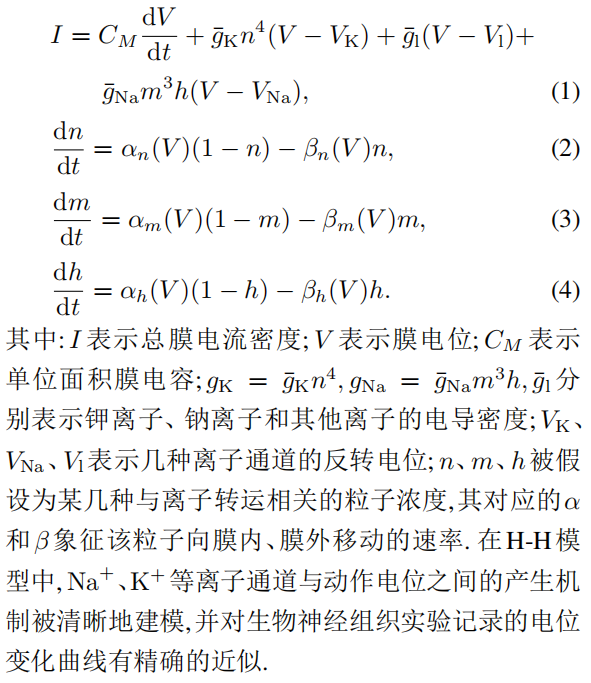
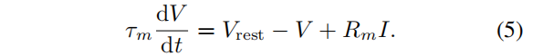
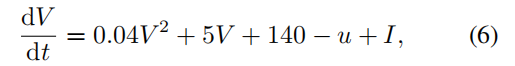
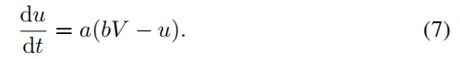
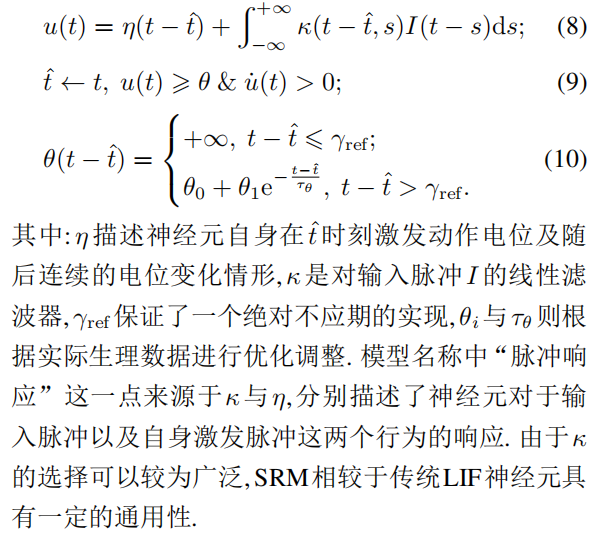
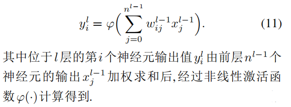

# 脉冲神经网络研究进展综述

> 清华大学 类脑计算研究中心

## 1. 脉冲神经网络的基本要素

脉冲神经网络的构造：
1. 神经元模型：作为基本处理单元
2. 突触可塑性理论：作为学习与记忆基础
3. 神经元通信中脉冲序列的编码方式
4. 网络层面上各基本层的拓扑结构.

### 1.1 神经元模型

#### 1.1.1 H-H(Hodgkin-Huxley) 模型

在动作电位的产生及传播机制方面作出了奠基性贡献

H-H模型可表示为以下4个方程：

#### 1.1.2 LIF(Integrate-and-fire)模型

动作电位的过程被简化描述为:“当膜电位达到阈值*V*th 时神经元将激发脉冲,而膜电位回落至静息值*V*reset”.

模型则针对阈下电位的变化规律进行描述

其中: *$τ_m$* 表示膜时间常数, *V*rest表示静息电位, *$R_m$*、*I*分别表示细胞膜的阻抗与输入电流.

LIF模型极大简化了动作电位过程,但保留了实际神经元膜电位的泄露、积累以及阈值激发这3个关键特征

#### 1.1.3 Izhikevich模型

Izhikevich模型希望能在具有生物合理性的H-H模型与计算高效的LIF模型之间得到折衷.

其中: *u*为一膜恢复变量,用于总体描述离子电流行为; *a*、*b*分别用于调整*u*的时间尺度和关于膜电位*V*的敏感度.

#### 1.1.4 SRM模型

脉冲响应模型是基于LIF模型提出的一种更具通用性的描述模型,它也采用了LIF模型中动作电位的简化描述,而与LIF模型相比, SRM模型包含了对于不应期(refractory period)的模拟,且采用了滤波器而非微分方程的形式描述电位变化

#### 1.1.5 ANN神经元模型

ANN神经元模型保留了生物神经元多输入单输出的信息处理功能,但对其阈值特性以及动作电位机制作了进一步的抽象简化,其建模如下

#### 1.1.6 ANN与SNN的比较

| 特征/属性        | SNN (脉冲神经网络) | ANN (人工神经网络) |
| ---------------- | ------------------ | ------------------ |
| 激活函数         | 连续激活函数       | 高精度连续激活函数 |
| 通信方式         | 离散脉冲序列       | 连续值             |
| 时间域运算       | 舍弃               | 存在               |
| 空间域结构       | 逐层计算           | 逐层计算           |
| 表达精度         | 较低               | 高                 |
| 神经元动态       | 丰富               | 有限               |
| 时空数据处理潜力 | 更强               | 有限               |
| 历史时刻影响     | 有                 | 无                 |
| 脉冲信号稀疏性   | 有                 | 无                 |
| 计算方式         | 事件驱动           | 连续计算           |
| 功耗特性         | 低                 | 高                 |
| 硬件应用         | 神经形态硬件       | 一般硬件           |

##### 1.1.7 总结

| 特征/属性           | 描述                                                         |
| ------------------- | ------------------------------------------------------------ |
| 建模抽象层次选择    | 生物神经元的建模可以在仿生度与计算代价之间选择不同的抽象层次，以满足不同建模需求。 |
| SNN与ANN基本差异    | SNN神经元采用脉冲通信方式与动力学特征，与ANN有基本差异，赋予其超低功耗计算和时序任务处理的潜力。 |
| 单个神经元模型      | 在大规模神经网络中，单个神经元的计算资源有限，复杂模型如H-H模型难以应用，因此需要简化模型以加速模拟仿真。 |
| 广泛使用的模型(LIF) | 目前脉冲神经网络中广泛使用LIF模型，因其简洁的数学表达可保证较低实现代价，但在生物可信度上有所欠缺。 |
| 模型发展方向        | 在保证大规模集成电路构建能力的基础上，仍需寻找兼具良好学习能力与高生物可信度的神经元模型，是当前需要研究的问题。 |

### 1.2 突触可塑性的生物学基础

Hebb (赫布)的神经记忆与学习机制假设: 当 A 细胞重复或持续地参与激活 B 细胞时, 两个细胞间会发生某种生长过程或代谢变化,使得A细胞激活B细胞的效率得到提高. 换言之,同时激活的细胞将彼此相连

脉冲时间相关的突触可塑性(spike-timing dependent plasticity, STDP):突触前-突触后的神经元发放顺序会引起长时程增强作用(long term potentiation, LTP),而突触后-突触前的神经元发放顺序将导致长时程抑制作用(long term depression, LTD)“同时”不一定导致连接增强,时间上存在的逻辑将会决定突触改变的方向和幅度. 

赫布学习与STDP规则成功揭示了突触结构内权重的修改过程,但它们不足以解释突触个体的改变如何协调以实现神经系统的整体目标

神经调质作为突触可塑性中的第三种影响因素，丰富了赫布规则。神经调质可以调整它们所到之处的突触可塑性，可能通过门控信号或调整STDP窗口的形状和极性来实现。此外，不同神经调质的组合也可以在不同大脑区域实现不同的神经元可塑性。

赫布规则与STDP规则具有局部学习的特征,是脉冲神经网络模型中无监督算法模拟的重要对象,而神经调质的引入为微观上的突触结构变化与宏观上生物体适应性行为间建立了联系的桥梁,突触可塑性的变化因而具有了目的和方向. 在整个神经网络功能优化的全局角度上,这样的三因子规则(three factor learning rule)相较于原始赫布规则引入了监督性学习的特点,有力地推动了大脑深层网络的高效学习.

### **1.3** 编码方式

目前较为常见的神经编码方式主要包括**频率编码(rate coding)、时间编码(temporal coding)、bursting编码和群编码(population coding)等(见图3)**. 具体的脉冲在<u>持续时间、振幅或形状上</u>都可能有所不同,但在神经编码研究中,它们通常被视为相同的定型事件

