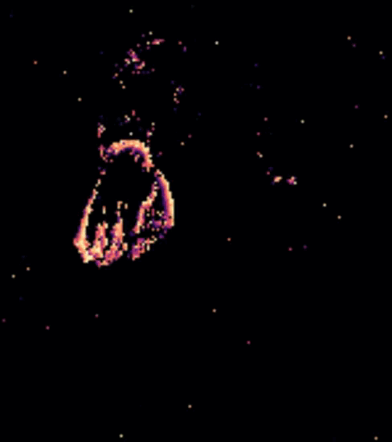
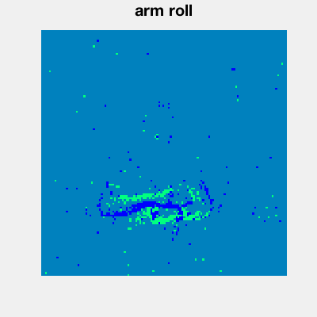
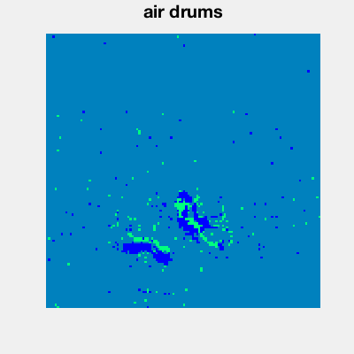
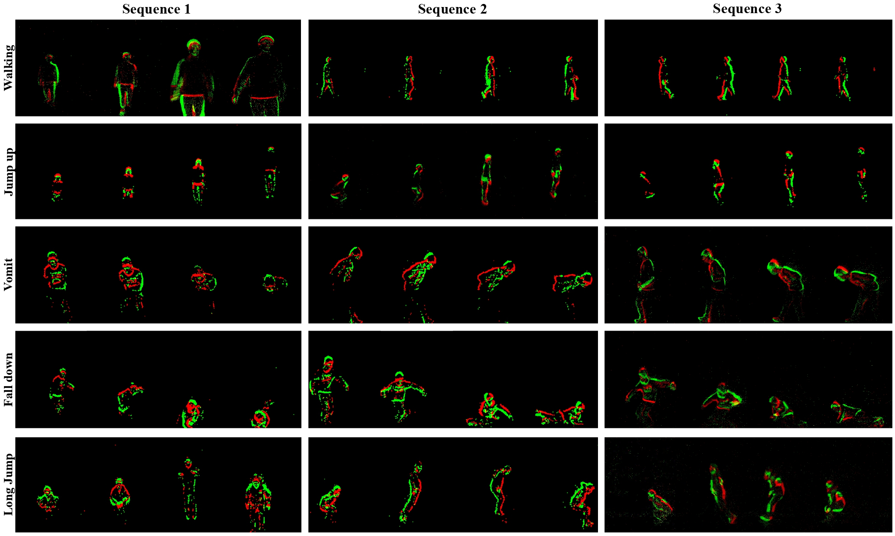
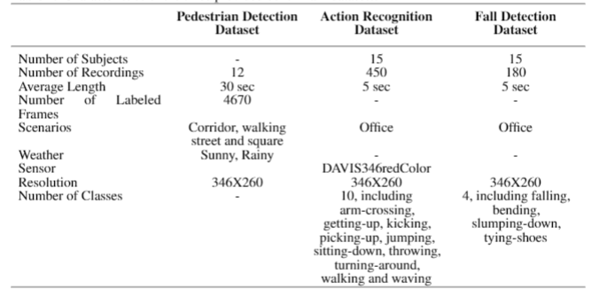
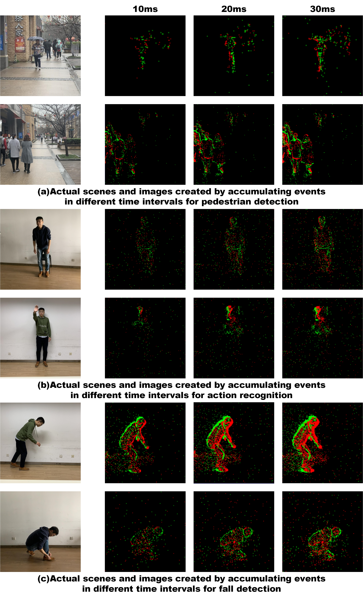

# 事件相机格式的动作识别数据集

#### 1. Event-based Manipulation Action Dataset

> - <https://github.com/danideniz/davishanddataset-events>
> - <https://arxiv.org/abs/2307.14332>
> - 代码未开源：<https://github.com/DaniDeniz/EventVisionTransformer>

该资源库包含基于事件的操作动作数据集，代表使用事件摄像机记录的操作动作。该数据集包含 30 种不同的操作动作，使用 6 个对象。该数据集中包含的 30 个类别如下：

- cup
  - drink, pound, shake, move, pour
- stone
  - pound, move, play, grind, carve
- sponge
  - squeeze, flip, wash, wipe, scratch
- spoon
  - scoop, stir, hit, eat, sprinkle
- knife
  - cut, chop, poke a hole, peel, spread
- spatula
  - flip, lift, cut, squeeze, scrape

请参阅 classes.json 查看每个动作的 ID。

Action: Cup pour/Spatula lift

此外，这些示例由 5 个不同的受试者（S1、S2、S3、S4 和 S5）记录。每个受试者记录了每个动作的五个实例。因此，每个类别有 25 个样本，共记录了 750 个示例，事件平均持续时间为 3 秒。

#### 2. DVS128 Gesture Dataset

> - <https://research.ibm.com/interactive/dvsgesture/>

该数据集用于构建CVPR 2017论文《低功耗、完全基于事件的手势识别系统》中描述的实时手势识别系统。使用DVS128记录数据。该数据集包含29名受试者在3种照明条件下的11个手势，并根据知识共享归因4.0许可证发布。

class is a value between 1 and 11. Here is how the class values corresponds to the gesture:

1: hand clap
2: right hand wave
3: left hand wave
4: right arm clockwise
5: right arm counter clockwise
6: left arm clockwise
7: left arm counter clockwise
8: arm roll
9: air drums
10: air guitar
11: other gestures

#### 3. N-EPIC-Kitchens

> - <https://github.com/EgocentricVision/N-EPIC-Kitchens>
> - <https://arxiv.org/abs/2112.03596>

N-EPIC-Kitchens: is the first event-based dataset for egocentric action recognition, presented at CVPR2022 in the paper *"E^2(GO) MOTION: Motion Augmented Event Stream for Egocentric Action Recognition"* [Publication](https://arxiv.org/abs/2112.03596)

如图2所示，它们中的大多数都专注于受控设置中的动作或图像识别[3，47，48，70]，其中相机和背景都是静态的，没有一个考虑以自我为中心的动作识别，从而阻止了基于事件的相机在这种情况下的使用。为了证明基于事件的摄像机在以自我为中心的在线场景中的优势，以及它们与其他模式的互补性和等效性，我们扩展了EPIC Kitchens（EK）[14]数据集，这是一个以自我为核心的动作视频的大集，具有多种模式和不同的环境。根据[72]的设置，我们从EPIC厨房中选择了三个最大的厨房作为训练动作实例，我们称之为D1、D2和D3，分析了8个最大动作类别的表现，即“放”、“拿”、“开”、“关”、“洗”、“切”、“混合”和“倒”

数据集很大：64*（0.4GB~7.5GB)

#### 4. THUE-ACT-50: A Real-World Event-Based Action Recognition Benchmark

> - <https://github.com/lujiaxuan0520/THU-EACT-50>

THUE-ACT-50由TPAMI 2023中的论文“使用事件相机的动作识别和基准”介绍，是一个大规模的、现实世界中特定于事件的动作识别数据集，其大小是当前最大的基于事件的动作辨识数据集的4倍多。它包含50个动作类别，主要用于全身运动和室内医疗应用。此存储库提供对数据集的访问，以及有关其内容和结构的详细信息。

**THUE-ACT-50**

In the THU-EACT-50 dataset, which is provided in the .csv format, the data is structured with 5 columns as follows:

- y: Represents the y-coordinate of the event.
- x: Represents the x-coordinate of the event.
- b: This is an additional brightness value provided by the CeleX-V camera. It's worth noting that for our method, this value is not utilized.
- p: The polarity value. It contains three categories: 1, -1, and 0. In our experiments, we ignore the 0 values and consider 1 as positive polarity and -1 as negative polarity.
- t: Represents the timestamp of the event.

**THUE-ACT-50 CHL**

For the THU-EACT-50-CHL dataset, which is available in the .npy format, each line contains 4 elements:

- x: Represents the x-coordinate of the event.
- y: Represents the y-coordinate of the event.
- t: Represents the timestamp of the event.
- p: The polarity value. In this dataset, the polarity only includes standard values of 1 and 0. Here, 1 represents positive polarity, and 0 represents negative polarity.

#### 5. PAFBenchmark

> - Neuromorphic Vision Datasets for Pedestrian Detection, Action Recognition, and Fall Detection
> - <https://github.com/CrystalMiaoshu/PAFBenchmark>

下表总结了这三个数据集的特征，并在下文中对其进行了详细描述。

#### 6. DailyAction-DVS

> <https://drive.google.com/drive/folders/1JrYJnikaJdiNgq5Zz5pwbN-nwns-NNpz>
>
> Results reported in the paper [“Event-based Action Recognition Using Motion Information and Spiking Neural Networks” ](https://www.ijcai.org/proceedings/2021/0240.pdf)are obtained with 80% of each category randomly selected for training and the rest for testing. 

提出的基于事件的动作识别DailyAction-DVS数据集有1440个12个日常动作的记录。该数据集由DVS相机在2种不同的光照条件和2个不同的相机位置（具有不同的距离和角度）下拍摄，这给数据集带来了更多的挑战，也更符合现实情况

