# SNN博客学习

> - https://zhuanlan.zhihu.com/p/591416095

## snntorch中的泄漏神经元模型

同样的事情可以通过实例化snn.Leaky的方式来实现。与我们使用snn的方式类似。在之前的教程中使用Lapicque，但是超参数更少:

```text
lif1 = snn.Leaky(beta=0.8)
```

神经元模型现在存储在lif1中。要使用这个神经元:

输入

- **cur_in: W×X[t] 的每个元素依次作为输入传递**
- **mem:上一步的膜电位 U[t−1] 也作为输入传递。**

输出

- spk_out:输出峰值 S[t] (如果有峰值，则为1;如果没有峰值，则为0)
- mem:当前步骤的膜电位 U[t]

这些都需要是torch.Tensor类型。请注意，这里我们假设输入电流在传递到snn.Leaky之前已经被加权。当我们构建一个网络规模的模型时，这将更有意义。此外，公式(10)被时间向后移了一步，而不失一般性。

## 前馈脉冲神经网络

到目前为止，我们只考虑了单个神经元如何响应输入刺激。snntorch可以直接将其扩展到深度神经网络。在本节中，我们将创建一个维度为784-1000-10的3层全连接神经网络。与我们到目前为止的模拟相比，每个神经元现在将整合更多的输入峰值。

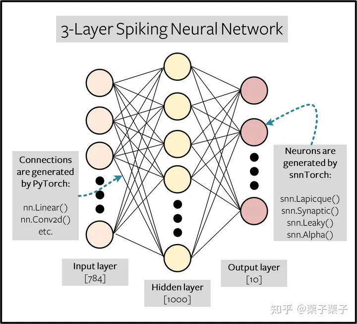

##  snn的循环表示

在之前的教程中，我们推导出了一个泄漏的LIF神经元的递归表示:

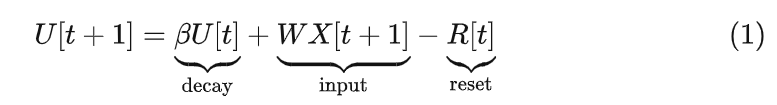

其中输入突触电流被解释为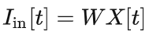，而 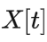可以是任意的脉冲输入、阶跃时变电压或无权阶跃时变电流。脉冲用下面的公式表示，如果膜电位超过阈值，就会发出一个脉冲:

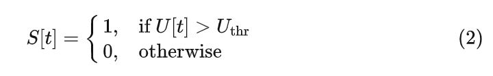

这种离散递归形式的脉冲神经元模型几乎完美地利用了训练递归神经网络(rnn)和基于序列的模型的发展。这用膜电位衰减的**隐式**递归连接来说明，并与**显式**递归进行区分，其中输出脉冲 Sout 被反馈到输入。在下图中，连接的权重为 −Uthr ，表示重置机制 R[t] 。

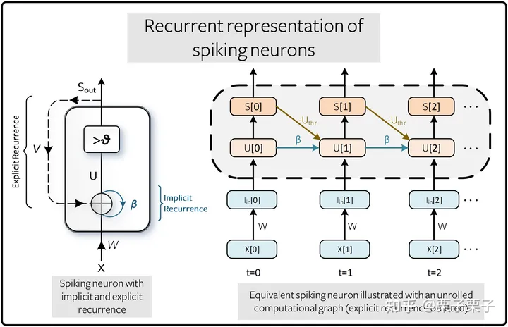

展开图的好处是它提供了如何执行计算的显式描述。展开的过程说明了信息在时间上向前流动(从左到右)以计算输出和损失，在时间上向后流动以计算梯度。模拟的时间步长越多，图就越深。

传统的rnn将 β 视为一个可学习的参数。这对于snn也是可能的，尽管默认情况下，它们被视为超参数。这用超参数搜索取代了梯度消失和梯度爆炸问题。未来的教程将描述如何使  β 成为一个可学习的参数。

### 2.1使用反向传播算法进行训练

用(2)表示 S 和 U 之间关系的另一种方法是:

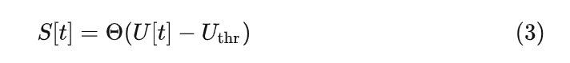

其中 Θ(⋅) 是Heaviside阶跃函数:

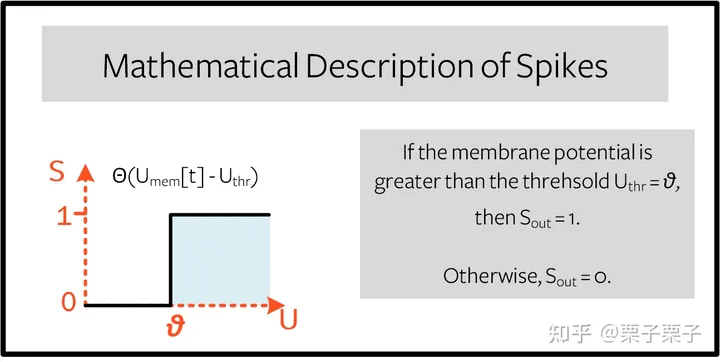

训练这种形式的网络带来了一些严峻的挑战。考虑前面标题为“脉冲神经元的递归表示”的计算图中的一个单独的时间步长，如下面的**前向传递**所示:

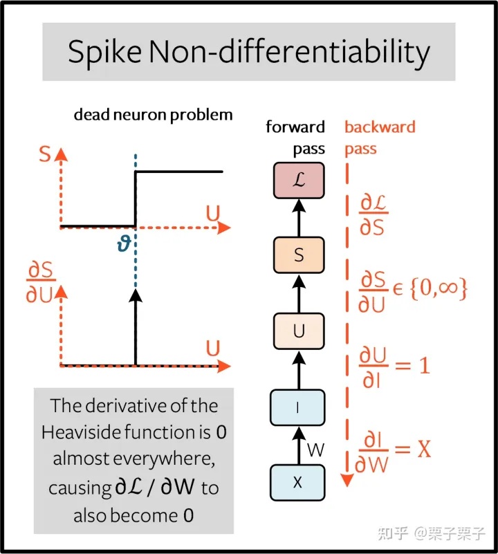

目标是使用相对于权重的损失梯度来训练网络，以便更新权重以最小化损失。反向传播算法使用链式法则来实现这一点:

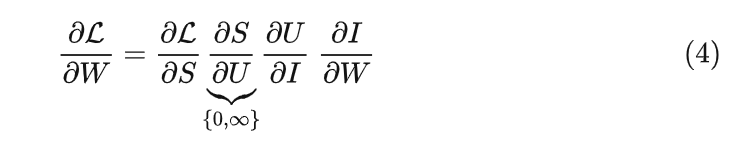

从(1)， ∂I/∂W=X ，以及 ∂U/∂I=1 。虽然我们还没有定义损失函数，但我们可以假设 ∂L/∂S 具有解析解，其形式类似于交叉熵或均方误差损失(稍后详细介绍)。

然而，我们要处理的术语是 ∂S/∂U 。Heaviside阶跃函数(3)的导数是Dirac函数，除了阈值 Uthr=θ 趋于无穷外，其他地方的值都为0。这意味着梯度几乎总是为零到零(或饱和，如果 U 正好位于阈值)，并且无法进行学习。这被称为死神经元问题。

### 2.2克服死神经元问题

解决死神经元问题的最常见方法是保持Heaviside函数在正向传递时的状态不变，但将导数项 ∂S/∂U 替换为在反向传递时不会终止学习过程的项，即$ ∂\tilde S/∂U $。这可能听起来很奇怪，但事实证明，神经网络对这种近似是相当鲁棒的。这通常被称为代理梯度方法。

使用代理渐变有多种选择，我们将在后续教程中深入探讨这些方法的更多细节。现在，我们应用了一个简单的近似，其中 $∂\tilde S/∂U$ 设置为S本身。

如果 S 没有峰值，那么峰值梯度项为 0 。如果 S 峰值，则梯度项为 1 。这看起来只是像ReLU函数的梯度移位到阈值。这种方法被称为Spike-Operator方法，在下面的论文中有更详细的描述:

> Jason K. Eshraghian, Max Ward, Xinxin Wang, Gregor Lenz, Girish Dwivedi, Mohammed Bennamoun, Doo Seok Jeong, and Wei D. Lu. "Training Spiking Neural Networks Using Lessons From Deep Learning". arXiv, 2021.

脉冲运算符（Spike-Operator）将梯度计算分成两个块:一个是神经元发出脉冲的地方，另一个是静默的地方:

- 静默:如果神经元处于静默状态，那么可以通过将细胞膜缩放0来获得脉冲响应: S=U×0⟹$∂\tilde S/∂U=0$ 。
- 脉冲:**如果神经元是脉冲，那么假设 $U≈U_{thr}$，规范化 $U≈U_{thr}$ ，脉冲响应可以通过将膜缩放1得到: S=U×1⟹$∂\tilde S/∂U=1$ ，其中 $\tilde S $上面的波浪符号表示近似。

总结如下:

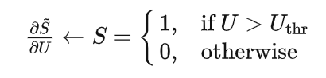

左边的箭头表示替换。

## BPTT(Backprop Through Time)

公式(4)只计算单个时间步的梯度(称为下图中的*即时影响*)，但反向传播(BPTT)算法计算从损失到所有后代的梯度，并将它们相加。

权重W 在每个时间步长应用，因此假设在每个时间步长也计算损失。权重对当前损失和历史损失的影响必须相加，以定义全局梯度:

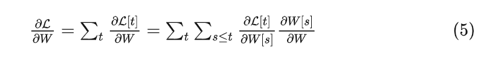

(5)的意义在于确保因果关系:通过约束 s≤t ，我们只考虑 W 对损失的直接影响和先前影响的贡献。循环系统限制在所有步骤中共享权重: W[0]=W[1]= … =w 。因此， W[s] 的变化将对所有 W 产生相同的影响，这意味着 ∂W[s]/∂W=1 :

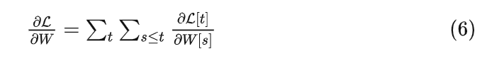

例如，隔离 s=t−1 的先验影响;这意味着向后传递必须在时间上后退一步。 W[t−1] 对损失的影响为:

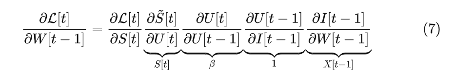

我们已经处理了(4)的所有项，除了 ∂U[t]/∂U[t−1] 。从(1)开始，时间导数项的值为 β 。因此，如果我们真的想这样做，我们现在已经知道了足够多的知识，可以辛苦地手动计算每个时间步的每个权重的导数，对于单个神经元来说，它看起来像这样:

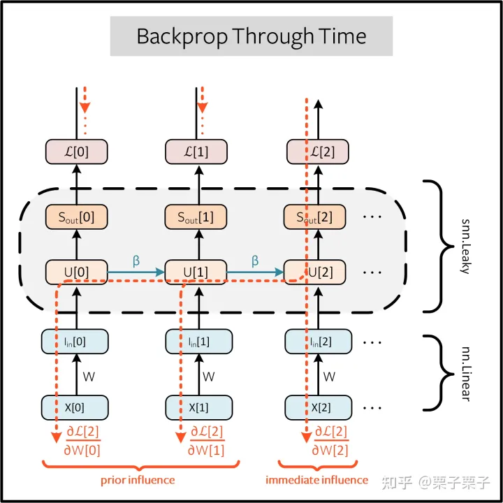

但值得庆幸的是，PyTorch的autodiff会在后台为我们处理这些。

## 设置损耗/输出解码

在传统的非脉冲神经网络中，有监督的多类分类问题将具有最高激活值的神经元视为预测类别。

在脉冲神经网络中，有几个选项来解释输出的脉冲。最常见的方法是:

- 速率编码:将具有最高放电率(或脉冲计数)的神经元作为预测类别
- 延迟编码:将最先触发的神经元作为预测类别

**这和之前讲编码方式的教程很像。不同的是，在这里，我们解释(解码)输出峰值，而不是将原始输入数据编码/转换为峰值。**

让我们关注一下速率编码。当输入数据传递到网络时，我们希望正确的神经元类在模拟运行过程中发出最多的峰值。这就对应了最高的平均发射频率。一种实现方法是将正确类别的膜电位增加到 U>Uthr ，将错误类别的膜电位增加到 U<Uthr 。将目标函数应用于 U ，可以作为从 S 调制峰值行为的代理。

这可以通过对输出神经元的膜电位进行softmax来实现，其中 C 是输出类别的数量:

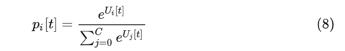

 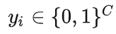中的目标之间的交叉熵是一个one-hot目标向量，可以用下面的表达式得到:

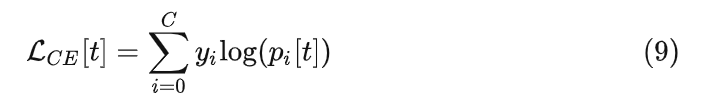

其实际效果是鼓励提高正确类别的膜电位，而降低不正确类别的膜电位。实际上，这意味着在所有时间步骤中鼓励触发正确的类，而在所有步骤中禁止不正确的类。这可能不是最有效的SNN实现，但它是最简单的。

该目标应用于仿真的每个时间步骤，因此在每个步骤也会产生损失。在模拟结束时，将这些损失相加:

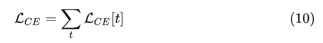

这只是将损失函数应用于脉冲神经网络的许多可能方法之一。在snnTorch中(在模块`snn.functional`中)可以使用多种方法，这将是未来教程的主题。

在了解了所有的背景理论之后，让我们最后深入研究一下训练全连接脉冲神经网络。