# 单个神经元运行原理

> - https://blog.csdn.net/Extremevision/article/details/123853471
> - https://blog.csdn.net/weixin_37864449/article/details/126772830

## 前向传播

ANN中单个基本神经元前向传播：

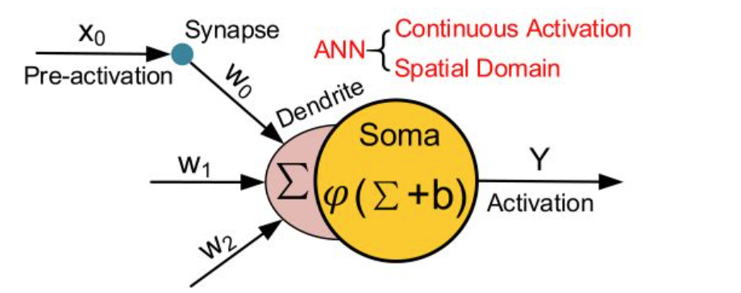

&nbsp;

SNN中单个基本神经元前向传播：

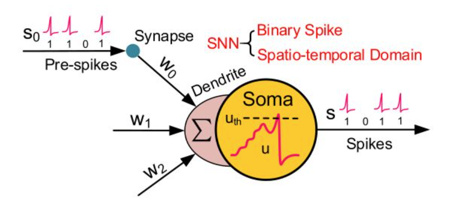

$S_0$代表上个神经元过来的一个一个的脉冲 (Spike)，通过突触 (Synapse) 传递到树突的位置 (Dendrite)，并且最终由细胞体 (Soma) 来处理这些脉冲 (具体处理方法就是下面的式子)。

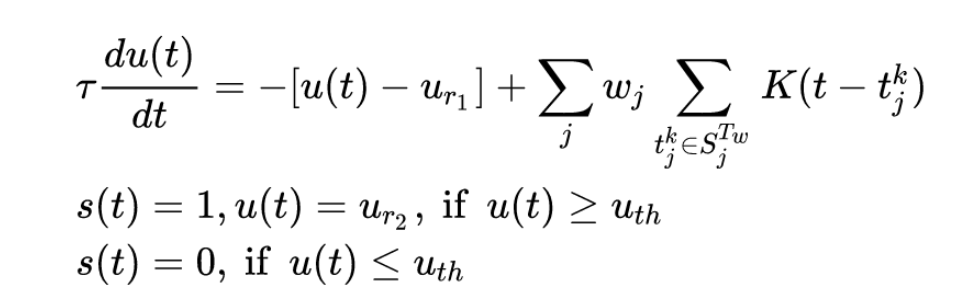

式中t代表时间步长，$τ$是常数，u和s代表膜电位和输出峰值。

$u_{r_1}$和$u_{r_2}$分别是静息电位和重置电位。

$w_j$是第j个输入突触的权重。

$t_j^k$是当第j个输入突触的第k个脉冲在$T_w$这个积分时间窗口内激发了 (即状态为1) 的时刻。

$K(\cdot)$是代表延时效应的核函数。

$T_w$是积分时间窗口。

$u_{th}$是个阈值，代表要不要点火 (Fire) 一次。

1. 当膜电位$u(t)$ (也就是细胞体 Soma 这个隐含电位) 高于阈值$u_{th}$时，脉冲神经元看做一次点火，此时输出电位$s(t)$置为1，同时膜电位u(t)回归到重置电位$u_{r_2}$。

2. 当膜电位$u(t)$ (也就是细胞体 Soma 这个隐含电位) 低于阈值$u_{th}$时，不点火，此时输出电位$s(t)$保持为0。

3. 在每个 time step，膜电位u(t)的更新过程满足一个微分方程，即第一个式子。

4. 在每个 time step，膜电位u(t)值应下降$u(t)-u_{r_1}$这么大的值，其中$u_{r_1}$是静息电位。

5. 同时在每个 time step，膜电位$u(t)$值应上升一个值，这个值来的大小与这个神经元的j个输入突触有关，每个输入突触的权值是$w_j$，这个突触对膜电位上升的贡献值是$\sum_{t_j^k\in S_j^{T_w}}K(t-t_j^k)$，即在$S_j^{T_w}$个脉冲中，如果$t_j^k$时刻的输入脉冲是点火状态 (即1状态)，那么计算一次$K(t-t_j^k)$并累积起来。

与主要通过空间传播和连续激活的ANN神经网络相比，SNN神经网络通常具有更多的时间通用性，但精度较低。 由于只有当膜电位超过一个阈值时才会激发尖峰信号，因此整个尖峰信号通常很稀疏。 此外，由于尖峰值 (Spike) 是**二进制**的，即0或1，如果积分时间窗口T_w调整为1，输入和权重之间的乘法运算就可以消除。由于上述原因，与计算量较大的 ANN 网络相比，SNN 网络通常可以获得较低的功耗。

&nbsp;

举个例子：

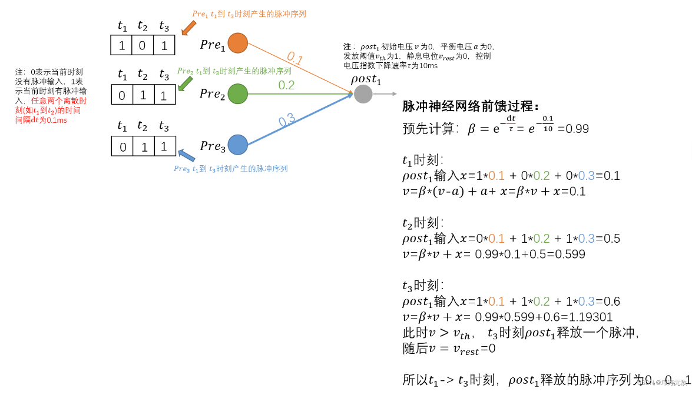&nbsp;

## 突触权重学习方法

### STDP

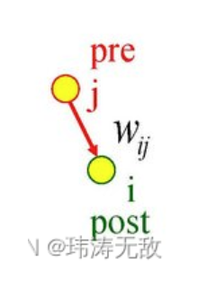

脉冲神经元连接有前突触和后突触之分，索引 j 神经元称为前突触，**若神经元 j 产生了一个脉冲，则称神经元 j 产生了一个突触前脉冲，索引 i 神经元称为后突触，同理神经元 i 产生的脉冲称为突触后脉冲。**j与i的连接权重为$w_{ji}$。

STDP更新突触权重的方式是：若突触前脉冲比突触后脉冲到达时间早，会导致**Long-Term Potentiation(LTP)效应**，即$w_{ji}$权重会增加。反之，若突触前脉冲比突触后脉冲到达时间晚，会引起**LTD**，即$w_{ji}$权重会减小。

根据上面的定义，STDP更新权重的公式可写成：

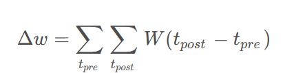

也就是说，突触权重$w_{ji}$的变化是某个函数 W的所有突触前尖峰时间$t_{pre}$和突触后尖峰时间$t_{post}$差的总和。一个常用的函数 W 是：

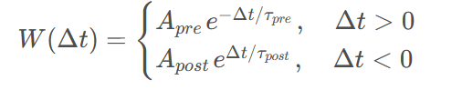

&nbsp;

举个例子：

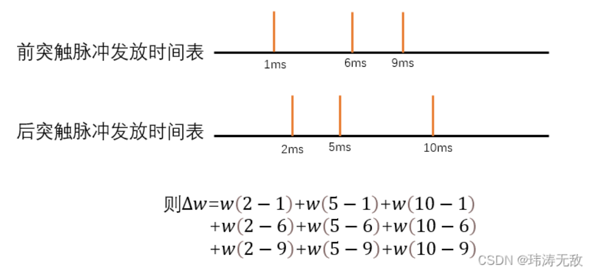

然而使用该定义需要事先知道前突触脉冲和后突触脉冲一段时间内各自发放脉冲的时间表，因此直接使用这个方程更新权重将**非常低效**，因为我们必须对每个神经元先记录好它的脉冲发放时间表，然后对所有尖峰对时间差求和。这在生物学上也是不现实的，因为神经元无法记住之前的所有尖峰时间。

#### online-STDP

事实证明，有一种更有效、生理上更合理的方法可以达到同样的效果，该方法可以在**突触前脉冲发放或突触后脉冲发放就立刻更新权重**

我们**先定义两个新变量$a_{pre}$和$a_{post}$，它们分别为突触前脉冲发放后的活动“痕迹”变量和突触后脉冲发放后的活动“痕迹”变量**（如下图所示）：

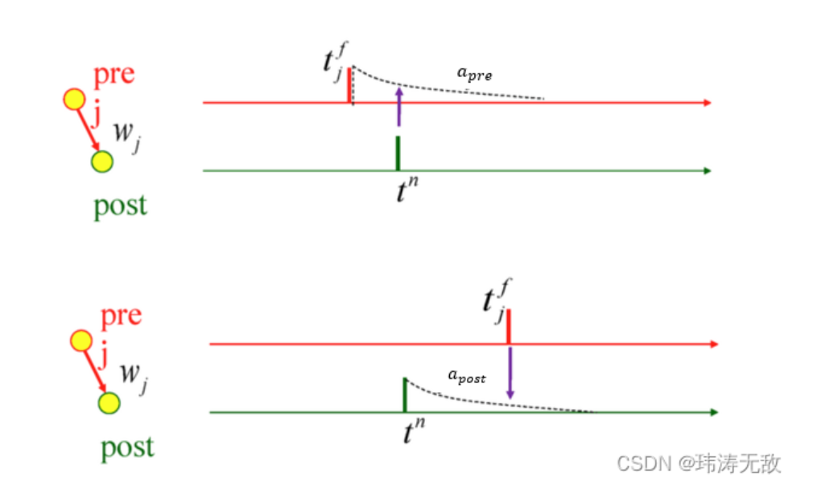

 痕迹变化由LIF模型控制：

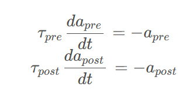

当发放突触前脉冲时，会更新突触前活动痕迹变量并根据规则修改权重w：

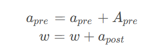

  同理当突触后脉冲发放时：

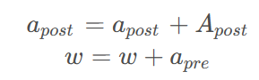

这更新公式可以理解为：当突触前脉冲到达了，突触后脉冲痕迹还未衰减到0，说明突触后脉冲是比突触前脉冲早到达的，所以权重应该削弱，削弱量为$a_{post}$， 需要说明的是通常$a_{post}$为**负数**(为负数的原因是在更新痕迹时，初始$a_{post}$=0，突触后脉冲发放时，$a_{post}$会加$A_{post}$，$A_{post}$通常是某个较小的负数常数)；同理当突触后脉冲发生时，突触前脉冲痕迹还未衰减到0时，说明突触前脉冲是比突触后脉冲早到达的，所以权重应该增强，增强量为$a_{pre}$，这里通常$a_{pre}$为正数。

&nbsp;

完全展开版本：

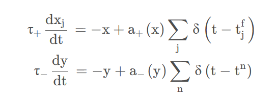

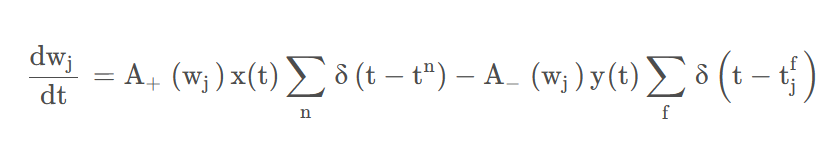

&nbsp;

*下面这个没看懂，没怎么做笔记

### 时空反向传播(STBP)

**LIF 模型**的迭代版本可以用下式表示：

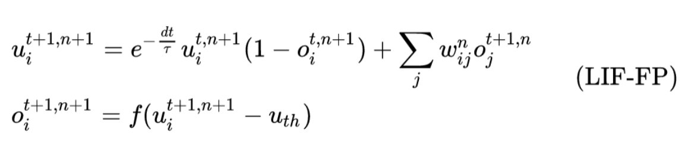

式中，o代表脉冲输出，t代表 time step，n代表 layer index。$e^{-\frac{dt}{\tau}}$代表膜电位的延迟效应。$f(\cdot)$是阶跃函数 (step function)。 这种迭代的 LIF 模型包含了原始神经元模型中的所有行为，包括集成 (integration)，触发 (fire) 和重置 (reset)。

&nbsp;

&nbsp;

# 脉冲神经网络数据集

## 基本数据

像 MNIST，CIFAR10 这类基于帧的静态图像，广泛应用于 ANN 中，我们称之为 ANN-oriented dataset，如下图的前2行所示。

**CIFAR-10**：32×32×3 RGB image，Training set：50000，Testing set：10000

**MNIST**：28×28×1 grayscale image，Training set：60000，Testing set：10000
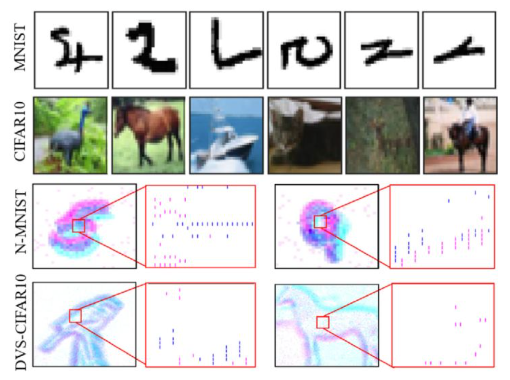

图的后2行 N-MNIST 和 DVS-CIFAR10 叫做 SNN-oriented dataset。这里的 DVS 叫做 dynamic vision sensor，代表使用了**动态视觉传感器**扫描每张 images 得到的 spike 数据。它除了具有与 ANN-oriented dataset 相似的空间信息外，还包含更多的动态时间信息，而且尖峰事件与神经网络中的信号格式自然兼容，因此我们称之为 SNN-oriented dataset。

**N-MNIST**：34×34×2×T spatio-temporal spike pattern，Training set：60000，Testing set：10000

**DVS-CIFAR-10**：128×128×2×T spatio-temporal spike pattern，Training set：9000，Testing set：1000

&nbsp;

例子：

DVS 产生**两个通道**的脉冲事件，命名为 On 和Off 事件 (分别如图2中红色和蓝色所示)。因此，DVS 将每个图像转换为 $row\times column\times 2\times T$的脉冲模式。

&nbsp;

## 信号转换

一般来说，ANN 接收**帧为基础的图像**，而 SNN 接收**事件驱动的脉冲信号**。因此，有时需要将相同的数据转换为另一个域中的不同形式来处理。下面以**视觉识别**任务为例，主要介绍两种图片信号转化为脉冲信号的转换方法。

### 方法一

在每一个时间步骤，采样的原始像素强度 (pixel intensity) 到一个二进制值 (通常归一化为[0,1])，其中的这个强度值就等于发射一个脉冲的概率。这个采样遵循一个特定的概率分布，例如**伯努利分布**或**泊松分布**。

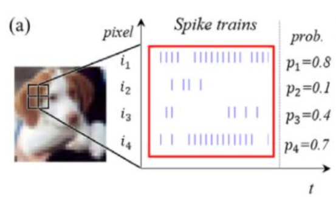

例如，图3(a) 中的$i_1$神经元，对应于标准化强度为 0.8 的 intensity，产生一个二进制尖峰序列，跟随着伯努利分布 B(0.8,T) 。这里 T 是取样的时间窗口。

再例如，图3(a) 中的$i_2$神经元，对应于标准化强度为 0.1 的 intensity，产生一个二进制尖峰序列，跟随着伯努利分布 B(0.1,T) 。这里 T是取样的时间窗口。

这种方法在取样的时间窗口T比较短时有一个较大的**精度损失**。

&nbsp;

### 方法二

使用一个**编码器**来产生全局的脉冲信号。这个编码器的每个神经元接受图片多个像素的强度值intensity 信号作为输入， 而产生脉冲作为输出。 虽然编码层是 ANN-SNN 混合层，而不是像网络中的其他层那样的完整 SNN 层，但它的权重是可训练的，因为我们的训练方法也是 BP 兼容的。由于神经元的数量可以灵活定制，参数也可以调整，因此它可以适应整体最佳化问题，从而获得更高的精确度。

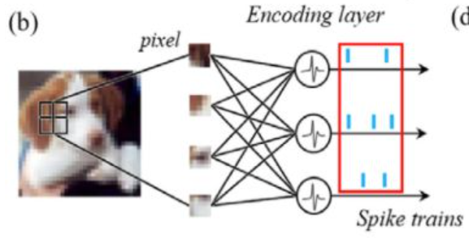

&nbsp;

## 脉冲化方式

### 泊松编码

将输入数据编码为发放次数分布符合**泊松过程**的脉冲序列

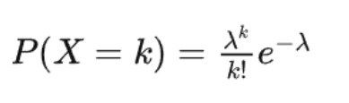

对于二维图像，每一个像素都能生成相互独立的泊松编码：

- 预先设定总时间 T；
- 每一个时间步，每一个像素产生脉冲的概率与该像素值成比例；
- 执行 T个时间步，分别得到各个像素对应的脉冲序列；
- 将每个像素产生的脉冲序列输入到对应神经元 / SNN输入层异步接收到各个像素的脉冲。

理解：

- 根据像素值设定每个时间步产生脉冲的概率，模拟一段时间，得到脉冲序列；
- 这段时间内可能产生的脉冲数量符合泊松分布 / 该脉冲产生过程是泊松过程；
- 这段时间平均脉冲发放数对应泊松分布公式中的$\lambda$；
- 通过将多个时间步的脉冲矩阵叠加，可以还原出原图像。

