# 脉冲神经网络研究进展综述

> 清华大学 类脑计算研究中心

## 1. 脉冲神经网络的基本要素

脉冲神经网络的构造：
1. 神经元模型：作为基本处理单元
2. 突触可塑性理论：作为学习与记忆基础
3. 神经元通信中脉冲序列的编码方式
4. 网络层面上各基本层的拓扑结构.

### 1.1 神经元模型

#### 1.1.1 H-H(Hodgkin-Huxley) 模型

在动作电位的产生及传播机制方面作出了奠基性贡献

H-H模型可表示为以下4个方程：

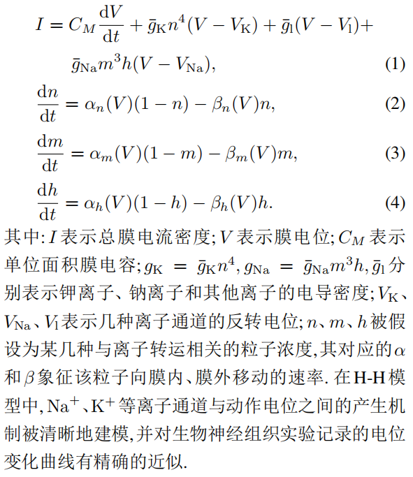

#### 1.1.2 LIF(Integrate-and-fire)模型

动作电位的过程被简化描述为:“当膜电位达到阈值*V*th 时神经元将激发脉冲,而膜电位回落至静息值*V*reset”.

模型则针对阈下电位的变化规律进行描述

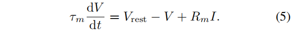

其中: *$τ_m$* 表示膜时间常数, *V*rest表示静息电位, *$R_m$*、*I*分别表示细胞膜的阻抗与输入电流.

LIF模型极大简化了动作电位过程,但保留了实际神经元膜电位的泄露、积累以及阈值激发这3个关键特征

#### 1.1.3 Izhikevich模型

Izhikevich模型希望能在具有生物合理性的H-H模型与计算高效的LIF模型之间得到折衷.

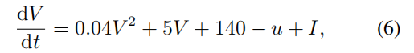

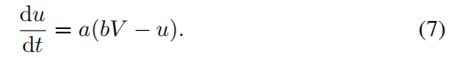

其中: *u*为一膜恢复变量,用于总体描述离子电流行为; *a*、*b*分别用于调整*u*的时间尺度和关于膜电位*V*的敏感度.

#### 1.1.4 SRM模型

脉冲响应模型是基于LIF模型提出的一种更具通用性的描述模型,它也采用了LIF模型中动作电位的简化描述,而与LIF模型相比, SRM模型包含了对于不应期(refractory period)的模拟,且采用了滤波器而非微分方程的形式描述电位变化

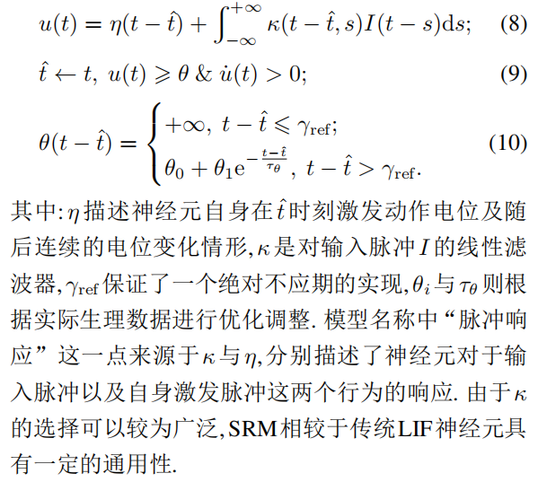

#### 1.1.5 ANN神经元模型

ANN神经元模型保留了生物神经元多输入单输出的信息处理功能,但对其阈值特性以及动作电位机制作了进一步的抽象简化,其建模如下

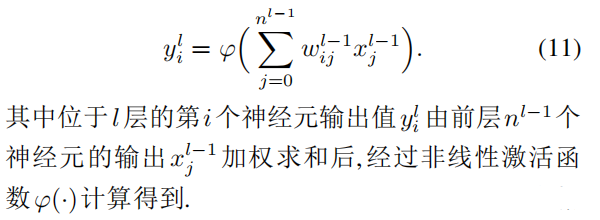

#### 1.1.6 ANN与SNN的比较

| 特征/属性        | SNN (脉冲神经网络) | ANN (人工神经网络) |
| ---------------- | ------------------ | ------------------ |
| 激活函数         | 连续激活函数       | 高精度连续激活函数 |
| 通信方式         | 离散脉冲序列       | 连续值             |
| 时间域运算       | 舍弃               | 存在               |
| 空间域结构       | 逐层计算           | 逐层计算           |
| 表达精度         | 较低               | 高                 |
| 神经元动态       | 丰富               | 有限               |
| 时空数据处理潜力 | 更强               | 有限               |
| 历史时刻影响     | 有                 | 无                 |
| 脉冲信号稀疏性   | 有                 | 无                 |
| 计算方式         | 事件驱动           | 连续计算           |
| 功耗特性         | 低                 | 高                 |
| 硬件应用         | 神经形态硬件       | 一般硬件           |

##### 1.1.7 总结

| 特征/属性           | 描述                                                         |
| ------------------- | ------------------------------------------------------------ |
| 建模抽象层次选择    | 生物神经元的建模可以在仿生度与计算代价之间选择不同的抽象层次，以满足不同建模需求。 |
| SNN与ANN基本差异    | SNN神经元采用脉冲通信方式与动力学特征，与ANN有基本差异，赋予其超低功耗计算和时序任务处理的潜力。 |
| 单个神经元模型      | 在大规模神经网络中，单个神经元的计算资源有限，复杂模型如H-H模型难以应用，因此需要简化模型以加速模拟仿真。 |
| 广泛使用的模型(LIF) | 目前脉冲神经网络中广泛使用LIF模型，因其简洁的数学表达可保证较低实现代价，但在生物可信度上有所欠缺。 |
| 模型发展方向        | 在保证大规模集成电路构建能力的基础上，仍需寻找兼具良好学习能力与高生物可信度的神经元模型，是当前需要研究的问题。 |

### 1.2 突触可塑性的生物学基础

**Hebb (赫布)的神经记忆与学习机制假设**: 当 A 细胞重复或持续地参与激活 B 细胞时, 两个细胞间会发生某种生长过程或代谢变化,使得A细胞激活B细胞的效率得到提高. 换言之,同时激活的细胞将彼此相连

**脉冲时间相关的突触可塑性(spike-timing dependent plasticity, STDP):突触前-突触后的神经元发放顺序会引起长时程增强作用(long term potentiation, LTP),而突触后-突触前的神经元发放顺序将导致长时程抑制作用(long term depression, LTD)“同时”不一定导致连接增强,时间上存在的逻辑将会决定突触改变的方向和幅度.** 

赫布学习与STDP规则成功揭示了突触结构内权重的修改过程,但它们不足以解释突触个体的改变如何协调以实现神经系统的整体目标

神经调质作为突触可塑性中的第三种影响因素，丰富了赫布规则。神经调质可以调整它们所到之处的突触可塑性，可能通过门控信号或调整STDP窗口的形状和极性来实现。此外，不同神经调质的组合也可以在不同大脑区域实现不同的神经元可塑性。

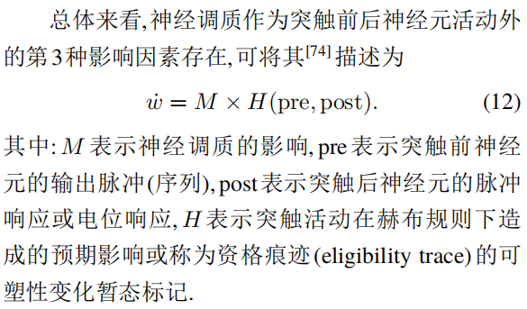

赫布规则与STDP规则具有局部学习的特征,是脉冲神经网络模型中无监督算法模拟的重要对象,而神经调质的引入为微观上的突触结构变化与宏观上生物体适应性行为间建立了联系的桥梁,突触可塑性的变化因而具有了目的和方向. 在整个神经网络功能优化的全局角度上,这样的三因子规则(three factor learning rule)相较于原始赫布规则引入了监督性学习的特点,有力地推动了大脑深层网络的高效学习.

### **1.3** 编码方式

目前较为常见的神经编码方式主要包括**频率编码(rate coding)、时间编码(temporal coding)、bursting编码和群编码(population coding)等(见图3)**. 具体的脉冲在<u>持续时间、振幅或形状上</u>都可能有所不同,但在神经编码研究中,它们通常被视为相同的定型事件

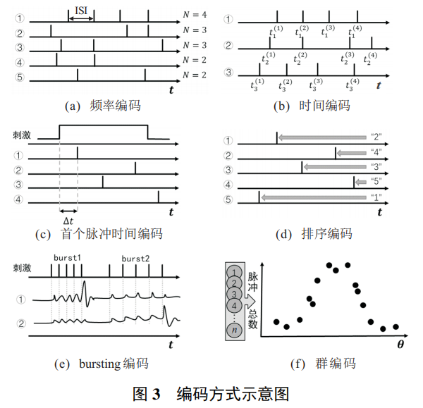

#### 1.3.1 频率编码(rate coding)

频率编码主要考察脉冲发放率(firing rate),即神经元发放的脉冲数量在其所对应记录时间上的平均值,刺激的强弱程度可由神经元发放脉冲的频率反映,强烈的刺激将导致更为高频的脉冲序列,而序列内部存在的时间结构,例如内部脉冲间隔(interspike interval,ISI)**不被考虑**.

#### 1.3.2 时间编码(temporal coding)

相对于频率编码,时间编码更加注重在时间结构上的差异,除了完整的脉冲时间模式(temporalpattern)之外,从接受刺激到发放首个脉冲的时间以及脉冲之间的时序逻辑都被认为存在编码重要信息的可能,其中前者被称为**首个脉冲时间编码**(time-to-first-spike coding),后者被称为**排序编码(**rank ordercoding).

#### 1.3.3 bursting编码

Bursting是广泛存在于大脑中的一种神经元活动模式,指神经元在某段时间内密集、快速地激发脉冲,随后进入较长时间静息的行为.突触后神经元存在的**阈下膜电位共振现象**,导致不同神经元针对bursting频率产生特异性选择,并可能为神经元间进行选择性通信提供了有效的编码机制.

#### 1.3.4 群编码(population coding)

群编码认为刺激产生的神经元信息是由多个神经元的联合活动表征的.

稀疏编码是群编码中较为特殊的一种,强调信息仅由较大群体中共同活跃的小部分神经元表达,且神经元数量可能远远大于输入信息的维度.   

### 1.4 拓扑结构

用于构建神经网络的基本层拓扑结构(见图4)主要包括全连接层、循环层以及卷积层. 它们对应形成的神经网络分别是多层感知机(multilayerperceptron, MLP)、 循环神经网络 (recurrent neural network, RNN)和卷积神经网络(convolutional neural network, CNN)

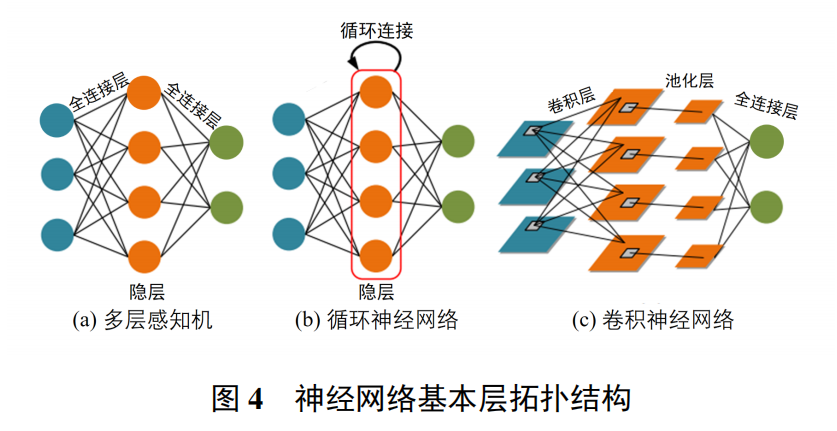

##2. 神经形态数据集

  动态传感器主要关注视野中的变化特征而自动忽略背景中静态无关的信息,这也使得该类传感器具有低延迟、异步、稀疏的相应特性,进而在诸多领域具有非常广阔的前景,例如光流估计、目标跟踪、动作识别等. 受此启发所产生的数据集被称为神经形态数据集,数据一般由四维向量组成(x; y; t; p). 其中: (x; y)记录成像的拓扑坐标, t记录脉冲产生的时间信息(精确到µs), p记录脉冲的极性(由正或负方向生成)

  神经形态数据集的**以下特征使其适合用于脉冲神经网络的基准测试**: 1)脉冲神经网络可以自然地处理异步、事件驱动信息,使其与神经形态数据集的数据特征非常契合; 2)神经形态数据集中内嵌的时序特征(比如精确的发放时间及帧之间的时序相关性)为展现脉冲神经元利用时空动力学特征处理信息的能力提供了很好的平台  

按照数据集构建方式的不同,目前神经形态数据集可分为以下3类.

**第1类是实地场景采集而得的数据集**,其主要通过神经形态传感器直接捕捉而生成无标签的数据. 例如可用于追踪和检测的数据集、用于光流估计的神经形态数据集[90-91]、用于3D场景重构的数据集[92-93]、用于手势识别的数据集**[**45] 等.

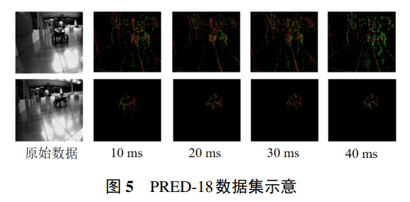

**第2类数据集是转换数据集**,它主要由带标签的静态图像数据集通过神经形态传感器实拍生成. 不同于第1类直接对实际场景采集而成的数据集,此类数据集主要由<u>已被广泛研究的、用于传统非脉冲任务的数据集</u>转换得到(见图6),如N-MNIST、 CIFAR10 -DVS. 为了生成此类数据集,研究者一般先固定一张静态的图片(如一张打印好的手写数字体图案),再用动态传感器沿指定方向平移产生相应数据的脉冲事件流版本. 由于转换原始图片的特征及标签是已知的,使得研究者可以较为轻松地得到该类数据集的标签信息. 转换数据集与原始广泛采用的数据集具有一定的特征相似性,此类转换数据集更易于使用和易于评估,因此,这类转换数据集也是目前脉冲神经网络领域使用最为广泛的数据集.  

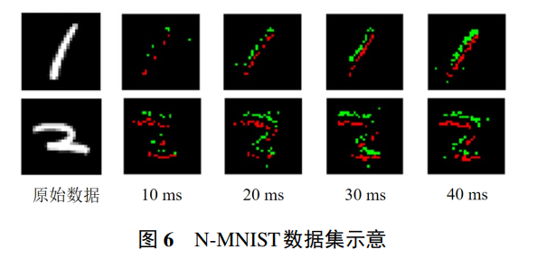

**第3类是生成数据集**,它主要利用带标签数据,<u>通过算法模拟动态视觉传感器特性</u>, 进而生成得到. 由于动态传感器主要捕捉视频流中的动态信息,这一过程可以间接地利用相邻帧的差分等信息得到. 因此,第3类数据集直接从已有的视频流(或者图片)信息中,**通过特定的差分算法[94]或基于相邻帧的生成算法**,生成神经形态数据集的版本[95-96]. 如Yang等[96] 训练一个用于数据生成的卷积神经网络,通过输入相邻帧和目标精确时刻的信息,生成脉冲事件流版本的特定帧信息. 这一做法可以避免数据采集所需要的大量工程实验,可以快速地生成研究所需要的含标签的特定场景信息. 然而，由于传统视频流帧数有限,模拟得到的数据集帧数无法达到实际生成的数据集要求,同时也无法高分辨地模拟数据的事件驱动特性  

尽管上述3类数据集的研究仍在持续发展中,但这3类数据集存在各自的局限性. **例如,由于使用者对第1类数据集的预处理方式不统一(时间分辨率、图片压缩尺度等),所报道的结果目前很难被公平地比较**;**第2、第3类数据集主要是由原始数据二次转换生成,其数据很难表达丰富的时序信息**,因此,无法充分利用脉冲神经网络的时空处理特性等. 可以说目前对神经形态数据集的研究还尚在起步阶段,脉冲神经网络领域仍缺乏公认的、基准性的测试集. 因此,发展规模更大、功能更契合(利用脉冲神经元时空处理能力和数据事件驱动特性)的数据集是今后的一大发展方向  

## 3 脉冲神经网络学习算法

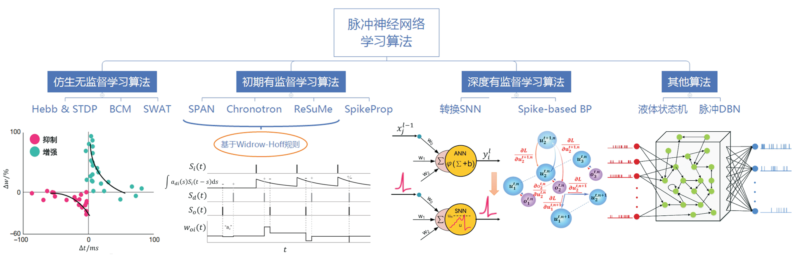

### 3.1 仿生无监督学习方法

STDP作为一种突触可塑性规则在脉冲神经网络训练中得到了广泛的应用,常见的描述公式[31]如下式所示:  

其中:$∆w_{ij}$表示权重改变量,$t_i$与$t_j$分别表示突触前后神经元的脉冲发放时间,$τ^+$与$τ^−$是影响STDP时间窗尺度的时间常数,$a^+$与$a^−$分别对应了LTP与LTD的两种权重变化方向。

在网络层级的建模时,$∆w_{ij}$随时间呈指数衰减的特性可能会得到进一步的简化,以实现计算开销与仿真程度的折中。

利用STDP规则设计了一个模仿大脑中腹侧视觉通路的前馈型脉冲神经网络,**当反复为网络呈现图像时,**神经元将逐渐形成对于同类图像中共同特征的选择性并逐渐缩短后层神经元激发所需的脉冲时延,**最终包含图像重要特征信息的脉冲将会快速发放并可用于分类任务**  

####3.1.1 BCM规则

原始的赫布规则由于并不包含突触连接的衰减机制或是增强阈值，所构建的模型并不具有稳定性。

BCM规则在原始赫布规则基础上假定神经元具有**决定突触权重改变方向的阈值**，且阈值动态适应于神经元的历史活动,使得连接权值最终能够达到稳态。其中神经元活动主要由脉冲发射率衡量，因而在BCM模型中多使用**频率编码**。

#### 3.1.2 SWAT方法

结合了BCM规则中可变阈值的特点,为STDP可塑性窗口的形状施加了**负反馈调节**,增强了脉冲神经网络训练过程中的稳定性.在利用STDP和BCM训练输出层的同时,利用网络中的隐藏层作为**频率滤波器**,从输入脉冲时间序列中提取特征用于分类任务.

### 3.2 初期有监督学习算法

有监督学习算法通常针对带有标签的数据,学习从输入到标签的映射函数关系.在脉冲神经网络中,这种标签被编码为**具有时序特征的目标脉冲序列**,算法需要学习网络中的连接权重以实现对不同输入的特异性识别,并转换输出目标脉冲序列.

#### 3.2.1 SpikeProp

——使用误差反向传播训练SNN学习目标脉冲的有监督算法

SpikeProp使用**时间编码和SRM模型**,通过<u>线性处理神经元</u>接收的输入和由此<u>产生的脉冲发放时间的关系</u>,绕过在阈值处产生的不连续性问题,最小化由目标脉冲与实际脉冲时间之差定义的误差函数,最终训练得到的网络表明能够对非线性可分数据集进行正确分类.

#### 3.2.2 ReSuMe

该算法使用**基于速率的神经元模型**,在不需要显式梯度计算的情况下，最小化输出与目标信号之间的差距。

ReSuMe结合了**赫布规则以及远程监控**两个概念,其中远程监控指目标信号并不直接传递给受训练的神经元,而是与突触前神经元共同决定突触权重的变化.

在Windrow-Hoff规则中针对输入$x_i$,期望输入$y_d$以及实际输出$y_o$,权重更新表达为：

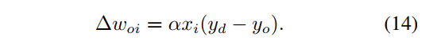

考虑引入时间维度以及脉冲形式后,ReSuMe的学习规则可重写为：

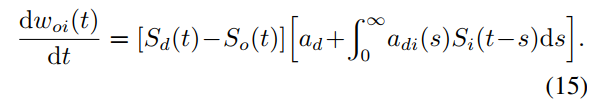

其中:$S_i(t)、S_o(t)、S_d(t)$分别表示输入、输出以及期望脉冲序列,$a_d$用于调节权重变化的平均强度,而起到实际精确调节脉冲时间功能的是包含$a_{di}(s)$的赫布规则项,s表示产生输出时相对输入的时间间隔.

该学习规则的作用机理可由下图直观表现：

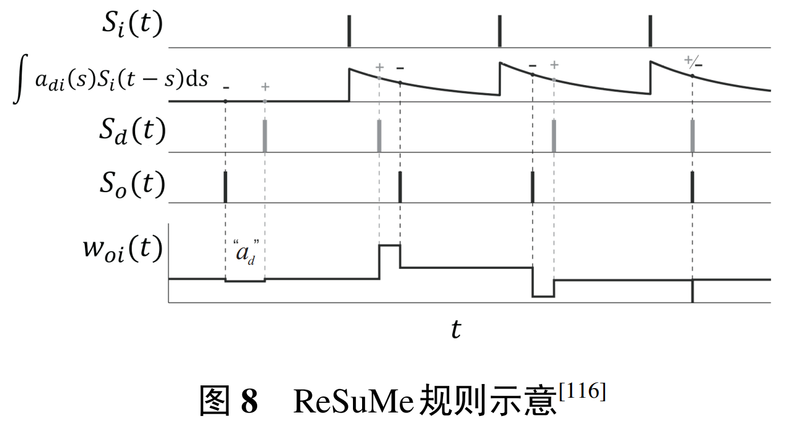

#### 3.2.3 chronotron

chronotron针对脉冲序列的差异,采用**VP距离**(victor-purpura distance)作为损失函数的构建依据,并提出了**E-learning以及I-learning**两种学习规则,其中前者基于梯度下降方法,后者则相对更具有生物合理性.

chronotron中损失函数定义如下：

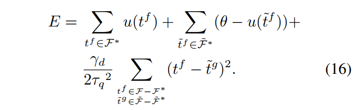

其中:$F$和$\tilde{F}$分别表示实际脉冲序列和目标脉冲序列,序列中第$f$个脉冲分别以时间$t^f、\tilde{t}^f$表示,$F^∗$和$\tilde{F}^∗$分别表示实际脉冲需要删除的以及目标脉冲需要加入的脉冲序列,u衡量膜电位,$γ_d$和$τ_q$为两个正参数.

E-learning权重更新规则如下：

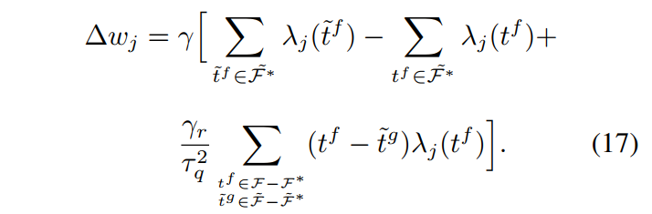

其中:$γ$表示学习率,$λ$表示由该突触输入导致的突触后电位变化.

由于脉冲的增删实际上仍为一个离散过程,E-learning采用**分段梯度下降**对损失函数进行最小化.

I-learning在此基础上参照ReSuMe,调整权重规则为局部可计算的突触电流形式,即：

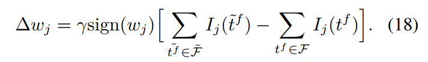

#### 3.2.4 SPAN

SPAN将**脉冲信号与特定的核函数进行卷积,转换为模拟信号**,使得Widrow-Hoff规则可以在转换后的信号上直接应用以调整突触权重.

文中采用的核函数如下所示:

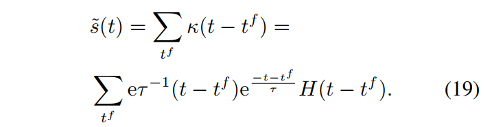

其形式多用于突触后电位变化的模拟,具有的效果实际上是藉由兴奋性突触后电位的连续变化替代单次脉冲进行计算。

修改后的Widrow-Hoff规则可写为：

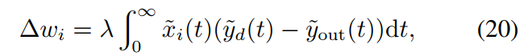

其中式中的各个变量转换为核函数下的连续信号$\tilde{x}_i、\tilde{y}_d、\tilde{y}_{out}$。

### 3.3 深度有监督脉冲神经网络  

主要包含以**转换SNN**为代表的**间接监督性学习算法**和以**时空反向传播**为代表的**直接监督性算法**.

其中“间接监督性”体现在有监督信号仅在向SNN转换前的原始模型中进行训练这一点上,直接监督性学习则指在SNN结构中直接适用的有监督学习算法.

#### 3.3.1 转换SNN(ANN-converted SNN)

转换SNN的基本理念是在使用ReLU函数的ANN网络中,连续的激活函数值可以由SNN中频率编码下的平均脉冲发放率近似,在**完成原始ANN训练后**,再通过特定手段将其转换为SNN.

为方便转换,多数工作对原始的ANN模型作出了一定的约束,例如**将偏置限制为零**、**无法使用批归一化方法**、**必须采用平均池化**(average pooling)而非最大池化(max pooling)等.这会造成原始模型性能的部分下降.

在转换方法中格外关键的一点是**增加I&F神经元的阈值项后,需要对阈值和权重进行重新平衡**.过低的阈值使得神经元易于激发而丧失特异性,反之则会使得脉冲较难激发,深层网络的仿真步数大幅增加.

#### 3.3.2 新颖SNN转换方式

在ANN网络中采用**有界ReLU函数**作为激活函数,在完成最初网络训练之后,逐层地进行有界ReLU函数向**阶跃函数**的**渐进式转换**,并在观察到一定性能下降时重启对网络的训练,完整训练流程结束后即可得到对应的SNN网络.

相比于针对完整网络进行单次转换,这种渐进的方式能够减缓转换带来的性能损失,但目前该方法得到的SNN仅使用**单步仿真时长**,在性能表现上相对不佳,且SNN本身在时域上可能的动态特性以及处理能力无法得到进一步的发掘与利用.

#### 3.3.3 转换SNN局限性

除了对原始ANN施加约束造成的性能下降外,转换SNN完成一次前向推理通常需要几百至几千时间步的长时间模拟,与SNN直接训练算法差距颇大,这导致了与原始目的相悖的额外延迟和能耗.

#### 3.3.4 转换与直接训练结合方法

转换SNN与直接训练算法,将转换SNN作为一种权重初始化手段并接受直接算法的后续训练,以期得到低时间步下的高性能表现 

#### 3.3.5 误差反向传播算法应用于SNN的尝试

反向连接**对前传权重的精确获取**,对于BP算法的有效实施可能**并非不可或缺**,通过将误差信号乘以随机权重实行的RBP(backpropagation)并不会显著地影响学习表现. 这对于误差信号在大脑中可能的利用形式提出了新的见解,适应脉冲形式的RBP也见诸报道  

另一个在BP过程中突出面临的问题仍是**脉冲函数可导性质的缺乏,**目前较为常见的解决方案是采用与之相近的连续函数对脉冲函数或其导数进行替代,进而产生基于脉冲的反向传播算法(spike-based BP)  在具体函数形式选择与算法实现上,

##### 3.3.5.1 围绕膜电势

在Lee等[131] 的工作中,梯度求导主要围绕膜电势展开,脉冲输入采用低通滤波下的形式对膜电势产生连续影响,而膜电势存在的突变被视为噪声忽略处理  

##### 3.3.5.2 HM2-BP算法

将SNN中的误差反向传播解构为微观上脉冲序列引起的突触后电位改变,以及宏观上由频率编码定义的损失函数反向传播这两个过程

##### 3.3.5.3 S4NN方法

采用首个脉冲时间编码,通过近似误差梯度得出了基于脉冲时延的BP算法, 但网络内神经元受限仅能进行单次脉冲发放  

##### 3.3.5.4 将LIF神经元的导数处理

Lee等[135]将LIF神经元的导数处理为两个部分,首先采用不包含电位泄露特性的IF神经元的近似导数,再添加相应的泄露校正进行补偿,实现了在VGG以及ResNet等结构上对SNN的直接训练.  

#### 3.3.6 直接训练算法局限性

一方面,当前编程框架下SNN额外的时间维度将造成数倍于同规模ANN的训练显存需要,并且由于阈值激发特性与脉冲的稀疏性,当SNN趋于深层时可以预见的是仿真周期的延长,这将进一步提升对显存的需求.

另一方面,深层网络训练的难点(例如梯度消失)在SNN结构中同样存在,而部分利于深度神经网络训练的技巧在SNN上进行简单移植时将破坏其保有的优势特征(例如批归一化手段可能造成SNN通信的脉冲形式无法得到保证).

#### 3.4 其他脉冲神经网络学习算法

##### 液体状态机(liquid state machine,LSM)

其结构和功能受到哺乳动物中枢神经系统中新皮质的启发.液体状态机主要包括3个部分:输入层、液体层和输出层.

- 输入层接受模拟输入或离散的脉冲输入,并与所有液体层的神经元相连.

- 液体层由大量**LIF神经元**构成的循环结构组成,连接的方向和权重均随机指定,它们接受输入并将其最终映射至该层所有神经元的放电状态.循环连接的存在使网络具有了记忆性质,放电状态包含了当前与历史输入的信息.

- 输出神经元经受训练,学习从循环网络的高维状态中提取关于当前与历史输入的信息并用于多种任务.

液体状态机的两个宏观性质构成了它具有实时计算能力的充要条件:**分离特性**(separation property,SP)与**逼近特性**(approximationproperty).

- 分离特性描述了两个不同输入流引起的系统内部状态轨迹之间距离的大小;

- 逼近特性描述输出机制的分辨和重编码能力,能够区分液体的不同内部状态并将其转换为给定的目标输出.

##### 深度信念网络(deep belief nets,DBN)

DBN由**多层受限玻尔兹曼机**(restricted Boltzmann ma-chine,RBM)堆叠组成,采用**对比散度算法**(contrastivedivergence,CD)高效地**近似最大似然法**(maximumlikelihood learning)进行**逐层无监督训练**.

在完成无监督预训练之后,可以在DBN上增加一层包含监督信号的网络,利用BP算法将误差信息自顶向下传播至每一层RBM,对无监督过程中初始化的权重进行进一步微调.
