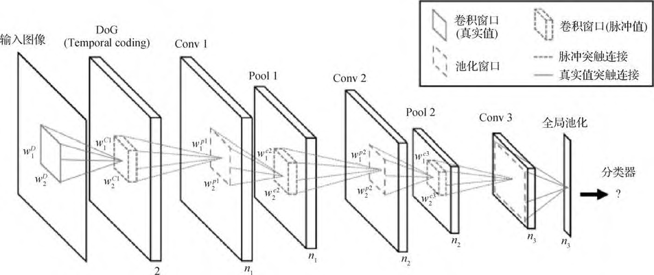
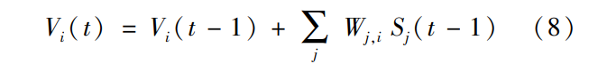
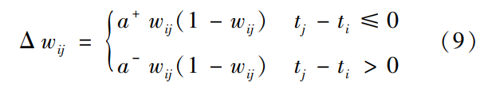
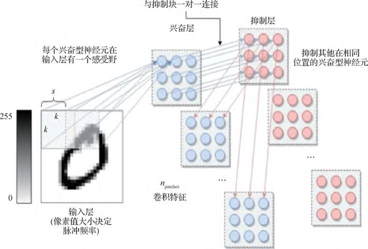

# 面向图像识别的多层脉冲神经网络学习算法综述

## 1 脉冲神经元 

## 3 脉冲神经网络的无监督学习算法  

无监督学习算法受生物神经网络中突触建立、增强和抑制的工作机制启发,在生物神经系统中,传递的是脉冲序列的时空信息,**根据突触前后的脉冲刺激来增强或者减弱突触连接**,利用这种生物学原理可以无监督地学习 SNN 的权值  

**突触可塑性的 Hebb 理论**,即突触前神经元对突触后神经元重复持续的刺激,可以增强它们之间的突触连接强度  

**STDP 规则**根据突触前神经元和突触后神经元动作电位的相对时间来更新突触权重。 如果突触前神经元发放脉冲的时刻比突触后神经元早,则称为长时程增强 LTP (long-term potentiation),突触权重应该变大;如果突触前神经元发放脉冲的时刻比突触后神经元晚,则称为长时程抑制 LTD(long-term depression),突触权重应该变小  

与一般的 STDP 不同的是,三脉冲 STDP 包括一个突触前脉冲和两个突触后脉冲。  

### 一种多层的基于 STDP 方法的 SDNN( spiking deep neural network)网络

主要用于目标识别,利用时间编码设计了一种层数更深的 SNN,包括若干个卷积层和池化层,且可以用 STDP 方法来训练  .

图 5  SDNN 网络结构图(Kheradpisheh 等,2018) 

采用的是 LIF 脉冲神经元模型,每个神经元接收上一层突触前神经元的脉冲,如果达到膜电位阈值则发放脉冲,用 Wj,i 表示第 j 个突触前神经元与第 i 个突触后神经元连接的突触权值,在每个时间步,脉冲神经元的电位可以表示为

如果突触前神经元在 t - 1 时间步发放了脉冲,则 Sj(t - 1) 为 1,反之为 0。 用简化的 STDP 算法更新权重

式中, tj , ti 是突触前神经元 j 和突触后神经元 i 脉冲发放时刻, a+ , a- 表示两种情况下的学习率。  

### C-SNN(convolutional spiking neural networks)  

图像的特征可以在神经元亚群中共享,或者独立地演化以获取不同区域的不同特征。该模型以一种无监督的方式学习格点数据,小块的神经元可以共享参数也可以独立学习特征。 模型采用的是一种改进的 LIF 神经元模型,利用内稳态的机制平衡整个网络,**包括兴奋性神经元和抑制性神经元**。 C-SNN 的结构如图 6 所示,k 是核大小,s 是步长,一个卷积块是一个兴奋性神经元的亚群和一个等大的抑制性神经元的亚群,输入空间的每个部分,与 STDP 可修改突触连接到兴奋性亚群的每个单个神经元,**兴奋性神经元和抑制性神经元亚群一对一连接**,如图 6 所示,即为提出的卷积 SNN 模型。其权值更新用的是 online STDP。  

图 6 C-SNN 的结构 (Saunders 等,2018)  

### 赢家通吃策略的层次网络

Guo 等人(2019)提出了一种赢家通吃( winner-take-all, WTA) 策略的层次网络,该网络基于脉冲的变分期望最大化算法。 该算法有两个步骤,首先是基于脉冲的变分 E 步,将**层次 WTA 动力学脉冲响应**作为平均场方程优化<u>先验概率和平均场分布</u>之间的 **KL( Kullback-Leibler) 散度**;然后是基于脉冲的变分 M 步,用 STDP 规则随机收敛到下界的极大值。 

### 时间连续的模型MPN

