## Git 笔记

> - https://zhuanlan.zhihu.com/p/30044692
>
> - https://help.gitee.com/enterprise
> - https://mp.weixin.qq.com/s?__biz=Mzg2OTg3MTU2OQ==&mid=2247506565&idx=1&sn=3a332a80999b45008d977fb6a10a2275&source=41#wechat_redirect
> - https://help.gitee.com/questions/GitHub%E4%BB%93%E5%BA%93%E5%BF%AB%E9%80%9F%E5%AF%BC%E5%85%A5Gitee%E5%8F%8A%E5%90%8C%E6%AD%A5%E6%9B%B4%E6%96%B0#article-header1

[TOC]

### 1.  Git 工作流程

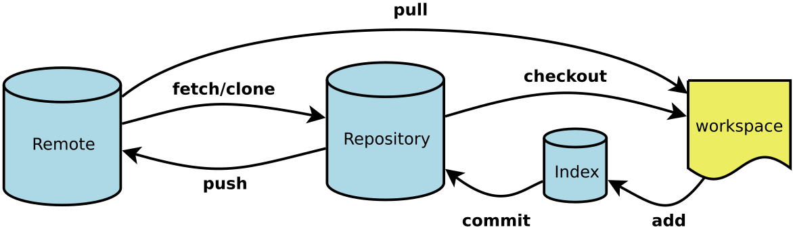

Workspace：工作区
Index / Stage：暂存区
Repository：仓库区（或本地仓库）
Remote：远程仓库

### 2. Git 分支操作

#### 2.1 分支基本操作

1. `git checkout -b dev` 创建并切换到"dev"分支上
2. `git branch`查看分支，会列出所有的分支，当前分支前面会添加一个星号
   1. 列出所有本地分支
      $ git branch
   2. 列出所有远程分支
      $ git branch -r
   3. 列出所有本地分支和远程分支
      $ git branch -a
3. `git checkout dev` 切换到"dev"分支上
4. `git merge dev ` 用于合并指定"dev"分支到当前分支上
5. `git branch –d dev` 删除"dev"分支

#### 2.2 主分支Master

- 所有提供给用户使用的正式版本，都在这个主分支上发布。

- Git主分支的名字，默认叫做Master。

#### 2.3 开发分支Develop

- 开发用的分支，叫做Develop。
- 这个分支可以用来生成代码的最新隔夜版本（nightly）。如果想正式对外发布，就**在Master分支上，对Develop分支进行"合并"（merge）**。

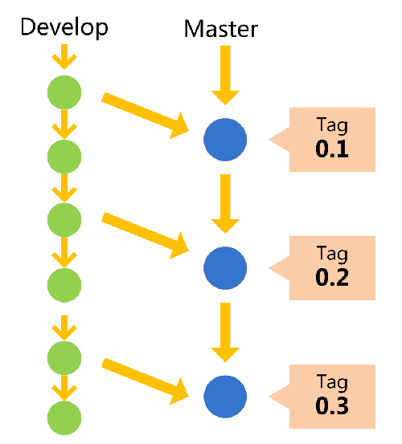

##### 2.3.1 操作

Git创建Develop分支的命令：

```git
  git checkout -b develop master
```

将Develop分支发布到Master分支的命令：

```git
  # 切换到Master分支
  git checkout master

  # 对Develop分支进行合并
  git merge --no-ff develop
```

命令的`--no-ff`参数是禁用快进式合并。默认情况下，Git执行"快进式合并"（fast-farward merge），会直接将Master分支指向Develop分支。

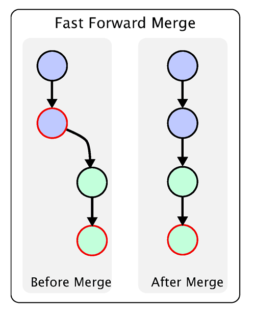

使用--no-ff参数后，会执行正常合并，在Master分支上生成一个新节点。为了保证版本演进的清晰，我们希望采用这种做法。

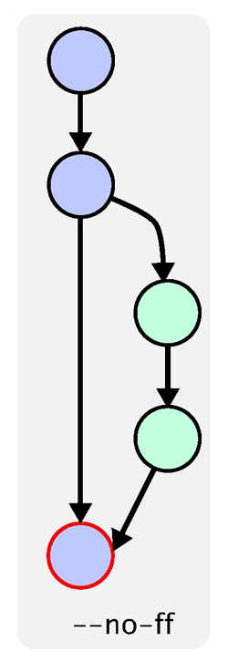

#### 2.4 临时性分支

- 临时性分支，用于应对一些特定目的的版本开发。使用完以后，应该合并后删除

- 临时性分支主要有三种：
  - 功能（feature）分支
  - 预发布（release）分支
  - 修补bug（fixbug）分支

##### 2.4.1 功能分支

- 它是为了开发某种特定功能，从Develop分支上面分出来的。
- 开发完成后，要再并入Develop。

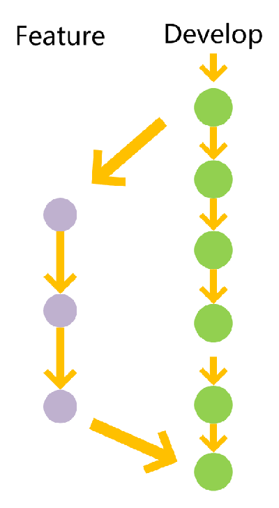


###### 2.4.1.1 操作

功能分支的名字，可以采用feature-*的形式命名。

创建一个功能分支：

```git
  git checkout -b feature-x develop
```

开发完成后，将功能分支合并到develop分支：

```git
  git checkout develop

  git merge --no-ff feature-x
```

删除feature分支：

```git
  git branch -d feature-x
```

##### 2.4.2 预发布分支

- 预发布分支是从Develop分支上面分出来的，发布正式版本之前（即合并到Master分支之前），我们可能需要有一个预发布的版本进行测试。
- 预发布结束以后，必须合并进Develop和Master分支

###### 2.4.2.1 操作

它的命名，可以采用release-*的形式。

创建一个预发布分支：

```git
  git checkout -b release-1.2 develop
```

确认没有问题后，合并到master分支：

```git
  git checkout master

  git merge --no-ff release-1.2

  # 对合并生成的新节点，做一个标签
  git tag -a 1.2
```

再合并到develop分支：

```git
  git checkout develop

  git merge --no-ff release-1.2
```

最后，删除预发布分支：

```git
  git branch -d release-1.2
```

##### 2.4.3 修补bug分支

- 修补bug分支是**从Master分支上面分出来的**。
- 修补结束以后，再合并进Master和Develop分支。

###### 2.4.3.1 操作

创建一个修补bug分支：

```git
  git checkout -b fixbug-0.1 master
```

修补结束后，合并到master分支：

```git
  git checkout master

  git merge --no-ff fixbug-0.1

  git tag -a 0.1.1
```

再合并到develop分支：

```git
  git checkout develop

  git merge --no-ff fixbug-0.1
```

最后，删除"修补bug分支"：

```git
  git branch -d fixbug-0.1
```

#### 2.5 保存当前工作创建新分支

比如我在开发中接到一个404 bug时候，我们可以创建一个404分支来修复它，但是，当前的"dev"分支上的工作还没有提交。Git提供了一个stash功能，可以把当前工作现场 ”隐藏起来”，等以后恢复现场后继续工作。

1. 将当前的工作现场隐藏起来

```git
git stash
```

2. 恢复工作现场

```
#恢复工作现场,恢复后，stash内容并不删除，你需要使用命令git stash drop来删除。
git stash apply

#恢复的同时把stash内容也删除了
git stash pop
```

3. 删除工作现场

```
git stash drop
```

#### 2.6 综合示例

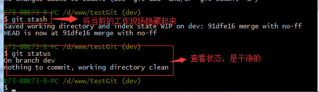

通过创建issue-404分支来修复bug了。

首先我们要确定在那个分支上修复bug，比如我现在是在主分支master上来修复的，现在我要在master分支上创建一个临时分支，演示如下：

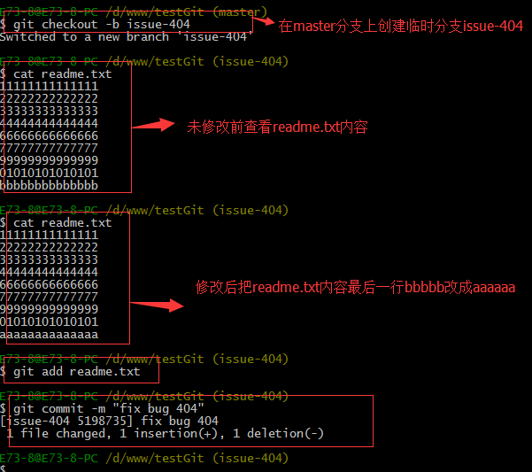


修复完成后，切换到master分支上，并完成合并，最后删除issue-404分支。演示如下：

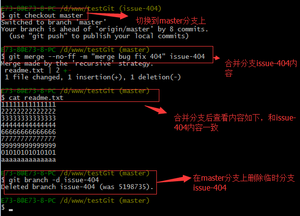

现在，我们回到dev分支上干活了。

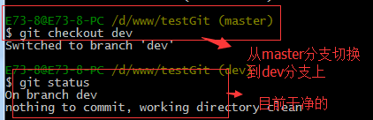


工作区是干净的，那么我们工作现场去哪里呢？我们可以使用命令 git stash list来查看下。如下：


工作现场还在，Git把stash内容存在某个地方了，但是需要恢复一下，可以使用如下2个方法：

1.git stash apply恢复，恢复后，stash内容并不删除，你需要使用命令git stash drop来删除。
2.另一种方式是使用git stash pop,恢复的同时把stash内容也删除了。
演示如下

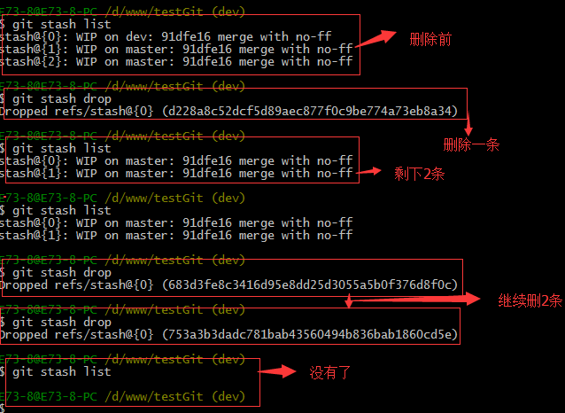

### 3. Git 基础操作

#### 3.1 Git配置

1. 显示当前的Git配置

```
git config --list
```

2. 编辑Git配置文件

```
git config -e [--global] # 设置提交代码时的用户信息
git config [--global] user.name "[name]"
git config [--global] user.email "[email address]"
```

#### 3.2 仓库基本管理

1. `git init` 把这个目录变成git可以管理的仓库
2. `git clone [url]` 下载一个项目
3. `git add readme.txt` 添加 `readme.txt` 到暂存区里面去
   1. `git add -A`或`git add .` 可以提交当前仓库的所有改动。
4. `git commit -m "提交信息"` 从Git的暂存区提交版本到仓库，参数-m后为当次提交的备注信息
5. `git status -s` 来查看是否还有文件未提交
6. `git diff readme.txt` 查看readme.txt文件到底改了什么内容
7. `git log`查看git提交的日志
   1. `git log --pretty=oneline` 简洁显示

#### 3.3 版本回退

1. `git reset --hard HEAD^` 回退到上个版本
2. 那么如果要回退到上上个版本只需把`HEAD^ `改成 `HEAD^^ `以此类推。
3. `git reset --hard HEAD~100` 回退到前100个版本
4. `git reset --hard 版本号` 版本号由`git reflog`获得
5. `git reset --hard origin/master` 回退到和远程版本一样,origin代表你远程仓库的名字，master代表分支名

#### 3.4 撤销修改和删除文件操作。

1. `git reset --hard HEAD^`直接恢复到上一个版本
2. `git checkout -- readme.txt`把readme.txt文件在工作区做的修改全部撤销.这里有2种情况，如下：
   1. readme.txt自动修改后，还没有放到暂存区，使用 撤销修改就回到和版本库一模一样的状态。
   2. 另外一种是readme.txt已经放入暂存区了，接着又作了修改，撤销修改就回到添加暂存区后的状态。
   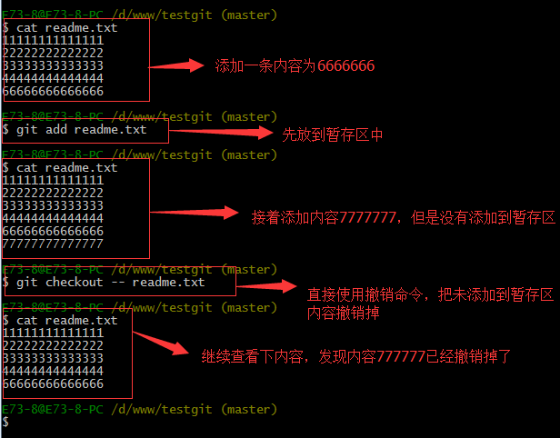
3. `rm b.txt` 可以直接在文件目录中把文件删了.如果我想彻底从版本库中删掉了此文件的话，可以再执行 commit命令 提交掉
4. `git rm [file1] [file2] ...` 停止追踪指定文件，但该文件会保留在工作区
5. `git checkout -- b.txt` 恢复b.txt文件(**没有commit之前**)

#### 3.5 查看修改记录

使用Git命令行，可以通过以下命令来查看某个文件的版本历史：

```
$ git log 文件路径
git log --follow filename
#查看单个文件的历史记录以及更改内容的完整详细信息
git log -p -- filename
```

例如，我们要查看文件index.html的版本历史，可以输入以下命令：

```
$ git log index.html
```

查看文件的修改详情要查看文件的修改详情，我们可以使用git diff命令。该命令可以列出两个版本之间的差异，包括修改、添加、删除等操作。我们可以指定文件名或者文件夹名称来查看相应的差异。如果没有指定文件名或者文件夹名称，则默认查看所有修改过的文件的差异。

```
#查看某个文件的修改详情
git diff filename
#查看某个目录下所有文件的修改详情
git diff directoryname/
#查看指定版本之间的差异，例如查看上一次提交和当前工作区之间的差异
git diff HEAD
```

如果想要查看某次提交的具体内容，可以使用以下命令：

```sql
git show 
```

通过这个命令，我们可以查看指定提交的详细信息，包括该次提交所包含的文件和文件的具体内容。

#### 3.6 标签

- 打标签

```
git tag -a v1.00 -m "注释"
```

git tag 打标签命令 -a 添加标签 -m 添加注释

- 切换标签

```
git checkout v1.00
```

就像切换分支一样

但你可以在这个标签上修改代码，但是不会影响其它分支的代码，如果保存在tag代码上修改，就要创建分支，如下：

```
git checkout -b branch_name
```

- 提交标签

```
git push origin -tags
```

等同于git push 只不过将master改成了-tags，说明是提交标签

- 删除标签

```
git tag -d v1.00
```

-d delete删除标签

- 查看标签

```
git tag
```


### 4. Git远程仓库管理

#### 4.1 修改仓库名

一般来讲，默认情况下，在执行clone或者其他操作时，仓库名都是 `origin` 如果说我们想给他改改名字，比如我不喜欢origin这个名字，想改为 oschina 那么就要在仓库目录下执行命令:

```shellscript
git remote rename origin oschina
```

这样 你的远程仓库名字就改成了oschina，同样，以后推送时执行的命令就不再是 `git push origin master` 而是 `git push oschina master` 拉取也是一样的

#### 4.2 添加一个仓库

在不执行克隆操作时，如果想将一个远程仓库添加到本地的仓库中，可以执行

```shellscript
git remote add origin  仓库地址
```

注意:

1. **origin是你的仓库的别名** 可以随便改，但请务必不要与已有的仓库别名冲突
2. 仓库地址一般来讲支持 http/https/ssh/git协议，其他协议地址请勿添加

#### 4.3 查看当前仓库对应的远程仓库地址

```shellscript
git remote -v
```

这条命令能显示你当前仓库中已经添加了的仓库名和对应的仓库地址，通常来讲，会有两条一模一样的记录，分别是fetch和push，其中fetch是用来从远程同步 push是用来推送到远程

#### 4.4 修改仓库对应的远程仓库地址

```shellscript
git remote set-url origin 仓库地址
```

#### 4.5 抓取分支

1. 现在要在dev分支上做开发，就必须把远程的origin的dev分支到本地来，于是可以使用命令创建本地dev分支：

```
#创建本地dev分支
git checkout –b dev origin/dev

#把现在的dev分支推送到远程去
git push origin dev
```

2. 当需要把最新的提交从origin/dev抓下来

```shellscript
git pull 远程库名 分支名
eg：git pull origin dev
```

- 一次性拉取该仓库的所有分支

  ```
  $ for b ingit branch -r | grep -v -- '->'; do git branch --track ${b##origin/} $b; done
  ```

  命令简单解释：

  - | 表示通道，即前面命令的输出是后面命令的输入。
  - for xxx in xxxs; do xxx; done 是 shell 的 for 循环语句。
  - 倒引号``表示里面的是命令。
  - git branch -r 列出远程分支。
  - grep -v – ‘->’ ，grep 查找命令，-v 参数表示 not grep，即查找输入中的不含’->’的行。
  - git branch -r | grep -v – ‘->’ ，合起来就是参看远程分支中除了含有’->’的分支。
  - $b 表示远程分支名，例如：origin/dev。
  - ${b##origin/} 表示截取远程分支名中 origin/后面的内容，例如：dev，以此当做本地分支。
  - `git branch --track ${b##origin/} $b`，类似于` git branch dev origin/dev`，–track 参数是默认的，不加亦可。

3. 指定本地dev分支与远程origin/dev分支的链接

   fatal: the '--set-upstream' option is no longer supported. Please use '--track' or '--set-upstream-to' instead.

```
# To push the current branch and set the remote as upstream, use
git push --set-upstream origin develop
```

#### 4.6 删除分支

1、利用`git branch --delete dev`或者`git branch -D release-0.1`命令删除本地分支；

2、利用`git push origin --delete branch`命令删除远程分支；

3、利用`git branch --delete --remotes`命令删除追踪分支。

### 5. 冲突解决

下面我们还是一步一步来，先新建一个新分支，比如名字叫fenzhi1，在readme.txt添加一行内容8888888，然后提交，如下所示：

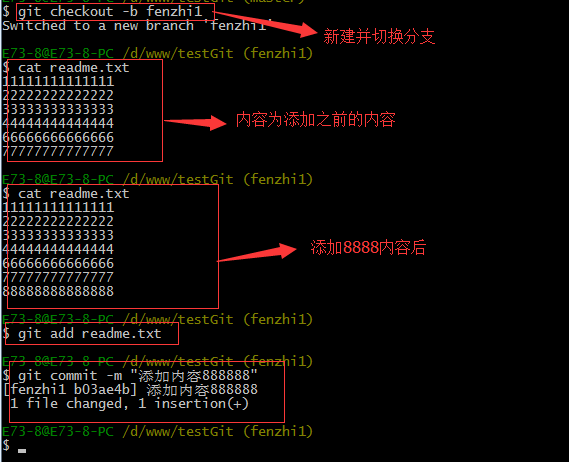

同样，我们现在切换到master分支上来，也在最后一行添加内容，内容为99999999，如下所示：

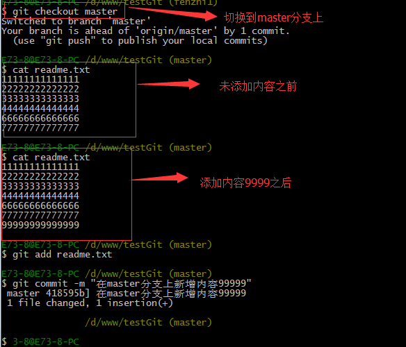

现在我们需要在master分支上来合并fenzhi1，如下操作：

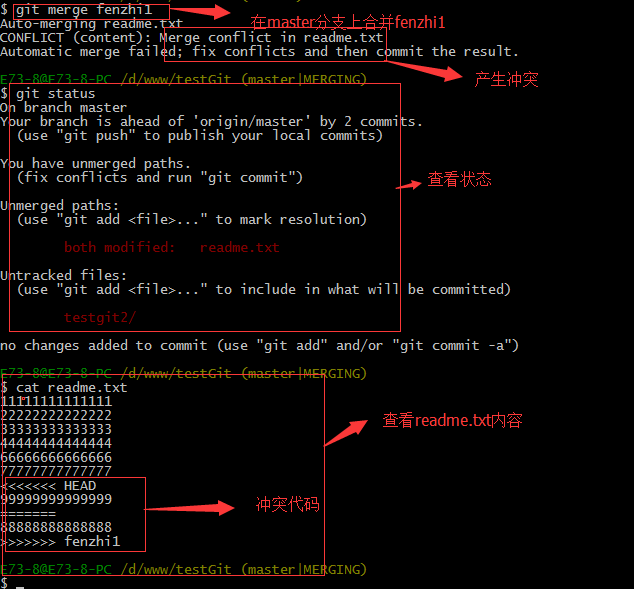


Git用<<<<<<<，=======，>>>>>>>标记出不同分支的内容，其中<<<HEAD是指主分支修改的内容，>>>>>fenzhi1 是指fenzhi1上修改的内容，我们可以修改下如下后保存：

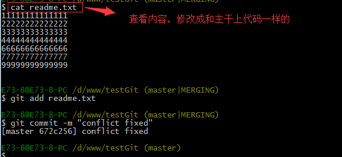

如果我想查看分支合并的情况的话，需要使用命令 git log.命令行演示如下：

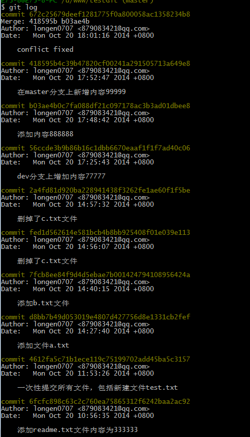


### 6. 常见报错

- 完美解决git报错 fatal: unable to access ‘https://github.com/.../.git‘:Recv failure Connection was reset

方法一

该方法也是最常见的方法，那就是在终端执行：

```bash
git config --global --unset http.proxy 
git config --global --unset https.proxy
```

方法二
本人之前在使用git时，有些时候使用方法一就能解决问题，有些时候还是会报错，下面这个方法，能够完美地解决报错。

系统设置搜索代理，然后点击编辑按钮：

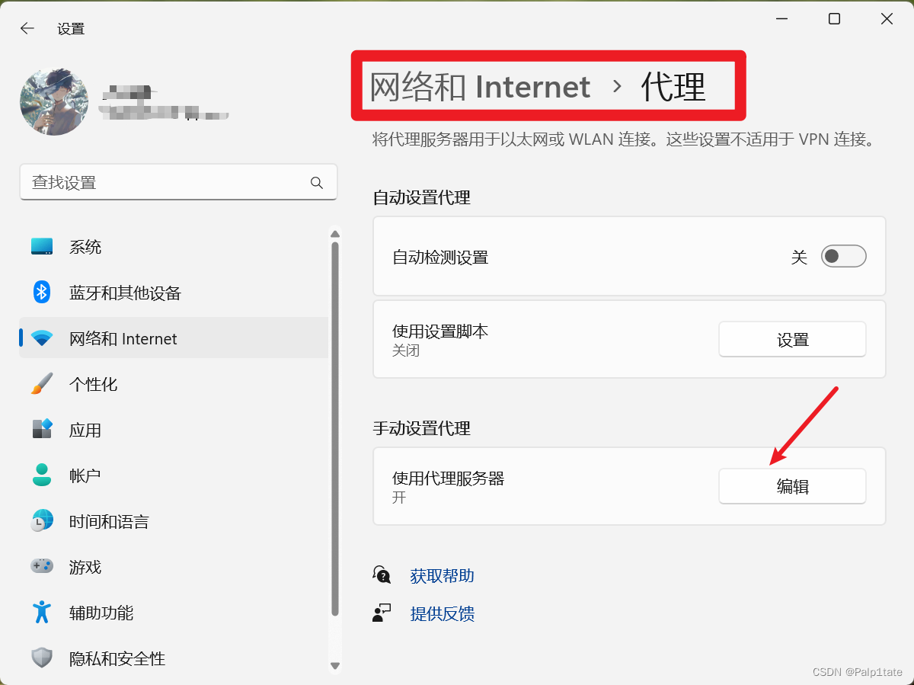

打开代理服务器，端口设置为7890，这个对你正常上网没有影响，可以放心设置。然后点击保存。

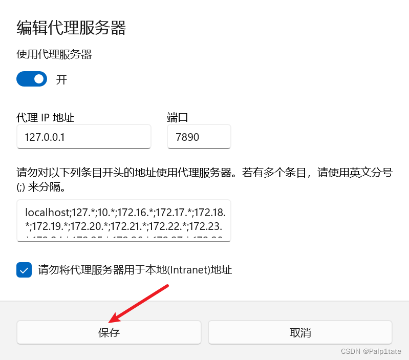

然后在终端输入命令：

git config --global http.proxy http://127.0.0.1:7890
这样就大功告成了。可以在终端输入git config --global -l加以检验是否设置成功：


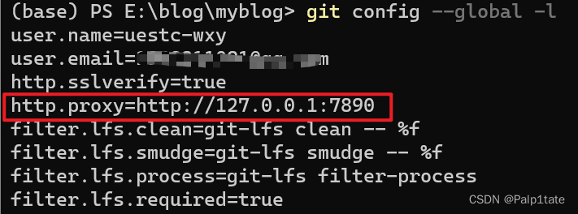
