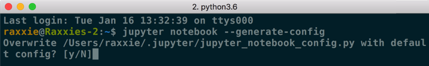

##  Jupyter notebook教程

> - https://zhuanlan.zhihu.com/p/32320214
> - https://zhuanlan.zhihu.com/p/33105153
> - https://zhuanlan.zhihu.com/p/158824489

### 1. 启动

#### 指定端口启动

如果你想自定义端口号来启动Jupyter Notebook，可以在终端中输入以下命令：

```text
jupyter notebook --port <port_number>
```

其中，“<port_number>”是自定义端口号，直接以数字的形式写在命令当中，数字两边不加尖括号“<>”。如：`jupyter notebook --port 9999`，即在端口号为“9999”的服务器启动Jupyter Notebook。

#### 启动服务器但不打开浏览器

如果你只是想启动Jupyter Notebook的服务器但不打算立刻进入到主页面，那么就无需立刻启动浏览器。在终端中输入：

```text
jupyter notebook --no-browser
```

此时，将会在终端显示启动的服务器信息，并在服务器启动之后，显示出打开浏览器页面的链接。当你需要启动浏览器页面时，只需要复制链接，并粘贴在浏览器的地址栏中，轻按回车变转到了你的Jupyter Notebook页面。

### 2. 配置文件路径

- 一个便捷获取配置文件所在路径的命令：

```text
jupyter notebook --generate-config
```

- 注意： 这条命令虽然可以用于查看配置文件所在的路径，但主要用途是是否将这个路径下的配置文件**替换**为**默认配置文件**。 如果你是第一次查询，那么**或许**不会出现下图的提示；若文件已经存在或被修改，使用这个命令之后会出现询问“Overwrite /Users/raxxie/.jupyter/jupyter_notebook_config.py with default config? [y/N]”，即“用默认配置文件覆盖此路径下的文件吗？”，如果按“y”，则完成覆盖，那么之前所做的修改都将失效；如果只是为了查询路径，那么一定要输入“N”。



配置文件所在路径

常规的情况下，Windows和Linux/macOS的配置文件所在路径和配置文件名如下所述：

- Windows系统的配置文件路径：`C:\Users\<user_name>\.jupyter\`
- Linux/macOS系统的配置文件路径：`/Users/<user_name>/.jupyter/` 或 `~/.jupyter/`
- 配置文件名：`jupyter_notebook_config.py`

注意：

① “<user_name>”为你的用户名。用户名两边不加尖括号“<>”。

② Windows和Linux/macOS系统的配置文件存放路径其实是相同的，只是系统不同，表现形式有所不同而已。

③ Windows和Linux/macOS系统的配置文件也是相同的。文件名以“.py”结尾，是Python的可执行文件。

④ 如果你不是通过一步到位的方式前往配置文件所在位置，而是一层一层进入文件夹/目录的，那么当你进入家目录后，用`ls`命令会发现找不到“.jupyter”文件夹/目录。这是因为凡是以“.”开头的目录都是隐藏文件，你可以通过`ls -a`命令查看当前位置下所有的隐藏文件。

#### 修改配置文件

- Windows系统的用户可以使用文档编辑工具或IDE打开“jupyter_notebook_config.py”文件并进行编辑。常用的文档编辑工具和IDE有记事本、Notepad++、vim、Sublime
  Text、PyCharm等。其中，vim是没有图形界面的，是一款学习曲线较为陡峭的编辑器，其他工具在此不做使用说明，因为上手相对简单。通过vim修改配置文件的方法请继续往下阅读。

### 3. 关联Jupyter Notebook和conda的环境和包

> 可能会失败，建议用安装插件和切换内核的方法代替

#### ① 安装

```text
conda install nb_conda
```

执行上述命令能够将你conda创建的环境与Jupyter Notebook相关联，便于你在Jupyter Notebook的使用中，在不同的环境下创建笔记本进行工作。

#### ② 使用

- 可以在Conda类目下对conda环境和包进行一系列操作。


Conda页面注解图

- 可以在笔记本内的“Kernel”类目里的“Change
  kernel”切换内核。


切换内核

#### ③ 卸载

```text
conda remove nb_conda
```

执行上述命令即可卸载nb_conda包。

### 4. 安装插件

```
# 安装
pip install jupyter_contrib_nbextensions
pip install jupyter_nbextensions_configurator

jupyter contrib nbextension install --user
```

- 问题1 ModuleNotFoundError: No module named ‘notebook.base‘

经过一番查询，是版本问题，将notebook更改为6.1.0版本后问题解决。

```
pip install jupyter notebook==6.1.0
```

### 5. 切换内核

#### **① 同时使用不同版本的Python**

##### **⑴ 在Python 3中创建Python 2内核**

###### **⒜ pip安装**

- 首先安装Python 2的ipykernel包。

```text
python2 -m pip install ipykernel
```

- 再为**当前用户**安装Python 2的内核（ipykernel）。

```text
python2 -m ipykernel install --user
```

- 注意：“--user”参数的意思是针对当前用户安装，而非系统范围内安装。

###### **⒝ conda安装**

- 首先创建Python版本为2.x且具有ipykernel的新环境，其中“<env_name>”为自定义环境名，环境名两边不加尖括号“<>”。

```text
conda create -n <env_name> python=2 ipykernel
```

- 然后切换至新创建的环境。

```text
Windows: activate <env_name>
Linux/macOS: source activate <env_name>
```

- 为**当前用户**安装Python 2的内核（ipykernel）。

```text
python2 -m ipykernel install --user
```

- 注意：“--user”参数的意思是针对当前用户安装，而非系统范围内安装。

##### **⑵ 在Python 2中创建Python 3内核**

###### **⒜ pip安装**

- 首先安装Python 3的ipykernel包。

```text
python3 -m pip install ipykernel
```

- 再为**当前用户**安装Python 2的内核（ipykernel）。

```text
python3 -m ipykernel install --user
```

- 注意：“--user”参数的意思是针对当前用户安装，而非系统范围内安装。

###### **⒝ conda安装**

- 首先创建Python版本为3.x且具有ipykernel的新环境，其中“<env_name>”为自定义环境名，环境名两边不加尖括号“<>”。

```text
conda create -n <env_name> python=3 ipykernel
```

- 然后切换至新创建的环境。

```text
Windows: activate <env_name>
Linux/macOS: source activate <env_name>
```

- 为**当前用户**安装Python 3的内核（ipykernel）。

```text
python3 -m ipykernel install --user
```

- 注意：“--user”参数的意思是针对当前用户安装，而非系统范围内安装。

#### **② 为不同环境创建内核**

##### **⑴ 切换至需安装内核的环境**

```text
Windows: activate <env_name>
Linux/macOS: source activate <env_name>
```

- 注意：“<env_name>”是需要安装内核的环境名称，环境名两边不加尖括号“<>”。

##### **⑵ 检查该环境是否安装了ipykernel包**

```text
conda list
```

执行上述命令查看当前环境下安装的包，若没有安装ipykernel包，则执行安装命令；否则进行下一步。

```text
conda install ipykernel
```

##### **⑶ 为当前环境下的当前用户安装Python内核**

- 若该环境的Python版本为2.x，则执行命令：

```text
python2 -m ipykernel install --user --name <env_name> --display-name "<notebook_name>"
```

- 若该环境的Python版本为3.x，则执行命令：

```text
python3 -m ipykernel install --user --name <env_name> --display-name "<notebook_name>"
```

- 注意:

\1. “<env_name>”为当前环境的环境名称。环境名两边不加尖括号“<>”。

\2. “<notebook_name>”为自定义显示在Jupyter Notebook中的名称。名称两边不加尖括号“<>”，但**双引号必须加**。

\3. “--name”参数的值，即“<env_name>”是Jupyter内部使用的，其目录的存放路径为`~/Library/Jupyter/kernels/`。如果定义的名称在该路径已经存在，那么将自动覆盖该名称目录的内容。

\4. “--display-name”参数的值是显示在Jupyter Notebook的菜单中的名称。

##### **⑷ 检验**

使用命令`jupyter notebook`启动Jupyter Notebook；在“Files”下的“New”下拉框中即可找到你在第⑶步中的自定义名称，此时，你便可以尽情地在Jupyter Notebook中切换环境，在不同的环境中创建笔记本进行工作和学习啦！

### 6. 魔法命令

- 加载指定网页源代码

执行以下命令:

```text
%load URL
```

其中，URL为指定网站的地址。

- 加载本地Python文件

执行以下命令：

```text
%load Python文件的绝对路径
```

注意

1. Python文件的后缀为“.py”。
2. “%load”后跟的是Python文件的**绝对路径**。
3. 输入命令后，可以按`CTRL 回车`来执行命令。第一次执行，是将本地的Python文件内容加载到单元格内。此时，Jupyter Notebook会自动将“%load”命令注释掉（即在前边加井号“#”），以便在执行已加载的文件代码时不重复执行该命令；第二次执行，则是执行已加载文件的代码

- 直接运行本地Python文件

执行命令：

```text
%run Python文件的绝对路径
```

或

```text
!python3 Python文件的绝对路径
```

或

```text
!python Python文件的绝对路径
```

注意

1. Python文件的后缀为“.py”。
2. “%run”后跟的是Python文件的**绝对路径**。
3. “!python3”用于执行Python
   3.x版本的代码。
4. “!python”用于执行Python
   2.x版本的代码。
5. “!python3”和“!python”属于 `!shell命令` 语法的使用，即在Jupyter Notebook中执行shell命令的语法。
6. 输入命令后，可以按 `control return` 来执行命令，执行过程中将不显示本地Python文件的内容，直接显示运行结果。

- 在Jupyter Notebook中获取当前位置

```text
%pwd
```

或

```text
!pwd
```

注意

1. 获取的位置是当前Jupyter Notebook中创建的笔记本所在位置，且该位置为**绝对路径**。
2. “!pwd”属于 `!shell命令` 语法的使用，即在Jupyter
   Notebook中执行shell命令的语法。

### 7. Markdown在文中设置链接并定位

在使用Markdown编辑文档时，难免会遇到需要在文中设定链接，定位在文档中的其他位置便于查看。因为Markdown可以完美的兼容html语法，因此这种功能可以通过html语法当中“a标签”的索引用法来实现。

语法格式如下：

```text
[添加链接的正文](#自定义索引词)
<a id=自定义索引词>跳转提示</a>
```

注意：

1. 语法格式当中所有的符号均是**英文半角**。
2. “自定义索引词”最好是英文，较长的词可以用下划线连接。
3. “a标签”出现在想要被跳转到的文章位置，html标签除了单标签外均要符合“有头（`<a>`）必有尾（`</a>`）”的原则。头尾之间的“跳转提示”是可有可无的。
4. “a标签”中的“id”值即是为正文中添加链接时设定的“自定义索引值”，这里通过“id”的值实现从正文的链接跳转至指定位置的功能。