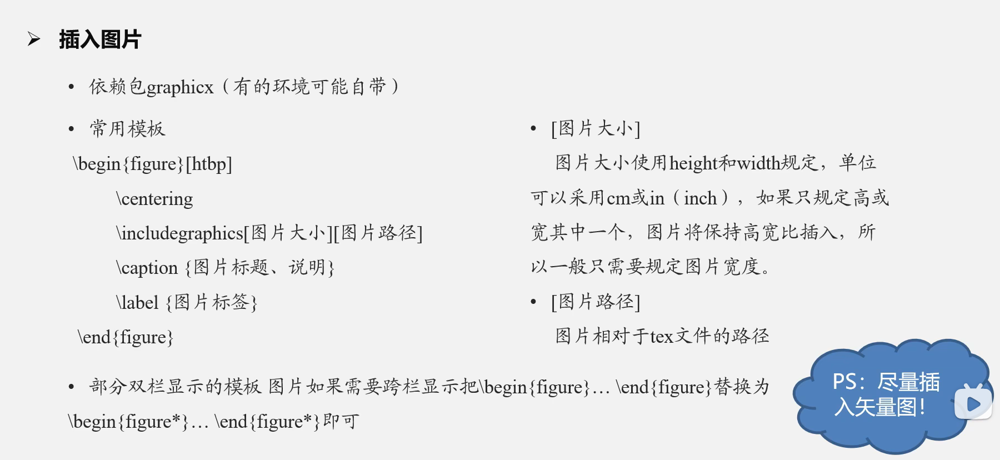

# Latex的使用

> - 入门视频：<https://www.bilibili.com/video/BV1Mc411S75c>
> - 视频：<https://www.bilibili.com/video/BV1no4y1U7At>
> - [latex中文教程-15集从入门到精通包含各种latex操作](https://www.bilibili.com/video/BV15x411j7k6)
> - [Latex公式快速文档](https://mp.weixin.qq.com/s?__biz=MzAwOTM2NjU3MQ==&mid=2652275142&idx=4&sn=396dc796bc318634bd51db491aa22467&chksm=80829c82b7f5159497c07b4dd23df862ae240512b374fe33885dc67beab5430a8829c436f1c8&scene=27)
> - [Markdown/LaTeX 数学公式和符号表](https://zhuanlan.zhihu.com/p/450465546)

## 数学公式

- [多行公式的处理](https://www.bilibili.com/video/BV15x411j7k6?p=12&vd_source=29520f96e7e37ed65f945d56966cc4db)

$$
\begin{gather*}\label{equa2}
	&\alpha+\beta = \theta \notag \\
	&a+b=c
\end{gather*}
$$

$$
\begin{equation}
	\begin{split}
		\alpha+\beta &= \theta \\
		a+b&=c \\
		a &= \text{THU}^\text{E-ACT} \times 5
	\end{split}
\end{equation}
$$

$$
\begin{equation}
	\begin{cases}
		0&,\text{if}\qquad\alpha+\beta = \theta \\
		x+1&,\text{if}\qquad a+b=c \\
		1&,\text{if}\qquad a = \text{THU}^\text{E-ACT} \times 5
	\end{cases}
\end{equation}
$$

对齐符号`&`

### 图片的插入



```
htbp是LaTX中用于控制浮动体位置的一个选项集。浮动体（如图片或表格）通常不会被直接放置在代码所在的位置，而是由LaTeX根据排版需要放置在页面的其他位置。htbp用于指定浮动体的偏好位置。这些选项的含义如下：
√ h（here):尽量将浮动体放置在代码所在的位置。然而，如果页面的顶部或底部能够更好地容纳浮动体，LaTeX可能会选择这样做。
√ t(op):将浮动体放置在页面的顶部。
√ b(bottom):将浮动体放置在页面的底部。
√ p（page):将浮动体放置在一个单独的页面上。
√ 这些选项可以组合使用，例如t表示首选放置在页面顶部，但如果不行就放置在代码所在的位置。
默认情况下，如果你不提供任何选项，LaTeX会使用tbp作为默认值。
√ 例如，begin{figure}[htbp]表示在尽量放在当前位置，如果不行就放在页面顶部，底部，或者单独一页。
```

