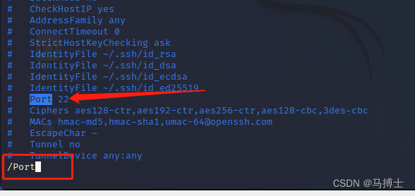
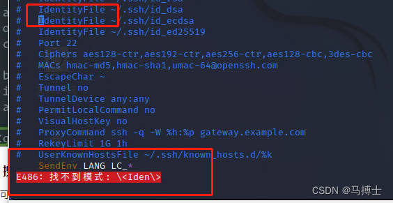
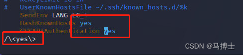

## Linux笔记

> - https://gitee.com/Harris-X/Course-Design-of-Operating-System
> - https://www.kancloud.cn/thinkphp/linux-command-line/39431

### Linux 命令行

#### 1. 终止暂停恢复命令行

ctrl+z暂停正在执行的进程，前台进程转为后台进程（暂停状态），同一shell进程下可使用bg命令恢复继续执行

```
[Ctrl+Z]         #暂停一个程序
jobs             #查看所有暂停的进程
fg [JOB ID]      #将一个后台暂停的进程恢复到前台
ctrl+c 强制中断程序，相应进程会被杀死，中断进程任务无法恢复执行
```


### Vim 工具操作

#### 1. vim编辑器下常用搜索技巧

方式一：快速搜索（字符串完全匹配，区分大小写）

格式： /  + 关键词  or   ？+ 关键词

```csharp
/Port     #按回车键搜索   从上到下查找

？Port     #按回车键搜索   从下到上查找
```

优点：快速定位到该关键字

回车之后，按 **`n `**来搜索下一个出现的匹配结果，按大写的 `N `反向搜索下一个出现的匹配结果。



方式二：整词搜索

格式：`/ + \< + 关键词 + \>`

```cobol
/\<Iden\>
```

回车后，按  `* `向前搜索，或者 `# `向后搜索。





默认下，搜索对大小写敏感。搜索"YES"不会匹配"yes”。

忽略大小写，在 Vim 命令行中输入:set ignorecase 或者 :set ic。你还可以在你的~/.vimrc文件中添加默认选项，来设置忽略大小写。

修改回大小写敏感，输入:set noignorecase或者:set noic。

另一个强制忽略大小写的方式就是在搜索样式后面添加\c。例如，/Linux\c将会在搜索时忽略大小写敏感。搜索样式后面添加大写的\C，会强制要求大小写敏感。

### Linux screen 工具

> - https://zhuanlan.zhihu.com/p/537007516?utm_id=0&wd=&eqid=939094b8000709bd0000000564642c13
> - https://blog.csdn.net/zhang_j_mail/article/details/127091772

#### 安装screen

Linux默认已经安装过

#### 常用screen参数

- screen -S yourname：新建一个叫yourname的session

- screen -d yourname：远程detach某个session，有其他事情的时候可以将这个screen分离，即使关闭终端，进程也还会运行，有时候当前的终端被占用，可以使用：Ctrl+a d组合键来退出

- screen -ls：列出当前所有的session，当重新连接时，需要知道这个screen的id号

- screen -r yourname：回到yourname这个session，重新进入这个screen

- screen -d -r yourname：结束当前session并回到yourname这个session

- exit：退出并关闭，此时talk会话关闭
  
