# 如何使用markdown

> - [Gitee站内](https://gitee.com/Harris-X/how-to-use-markdown)
>
> - <https://www.nowcoder.com/discuss/353147122247737344>

[TOC]


## 安装

将` winmm.dll`放到`C:\Program Files\Typora`中

## 教程

> https://zhuanlan.zhihu.com/p/441454622
>
> https://gitee.com/ClearStari99/markdown-tutorial

具体教程可见`教程`文件夹

### 标记

输入` - [ ]  ` 即会显示如下，可编辑

- [ ] 示例一
- [x] 示例二

### 公式

**MarkDown数学公式：使用`$`，将数学公式写在两个`$`之间。写在两个`$$`之间是把公式居中。**

#### 1、上下标

^ 表示上标， _ 表示下标，如果上标或下标内容多于一个字符，则使用 {} 括起来。

例 ： `$(x^2 + x^y )^{x^y}+ x_1^2= y_1 - y_2^{x_1-y_1^2}$`

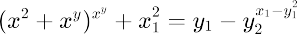

#### 2、分数形式

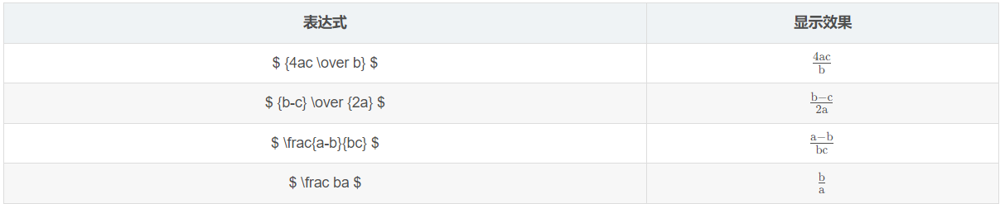

| ` $4ac\over b $` | `$ {b-c} \over {2a} $` | `$ \frac{a-b}{bc} $` | `$ \frac ba $` |

#### 3、开方

公式`\sqrt[n]{a}`

例 ：` $\sqrt[3]{4}$` 或 `$\sqrt{9}$`

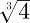

或

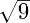

#### 4、括号

- () [] 直接写就行，而 {} 则需要转义。

例 ：` $f(x, y) = x^2 + y^2, x \epsilon [0, 100], y \epsilon \{1,2,3\}$`


- 大括号，需要括号前加\left和\right。

例：` $(\sqrt{1 \over 2})^2$` 加大括号后 `$\left(\sqrt{1 \over 2}\right)^2$`

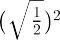

加大括号后

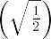

- \left 和 \right必须成对出现，对于不显示的一边可以使用 . 代替。

例： `$\frac{du}{dx} | _{x=0}$ `加大后` $\left. \frac{du}{dx} \right| _{x=0}$`

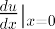

加大后

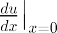

- 大括号

例 ： `$y :\begin{cases} x+y=1\\ x-y = 0 \end{cases}$`

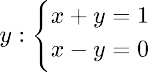

#### 5、向量

公式\vec{a}

例 ： `$\vec a \cdot \vec b = 1$`

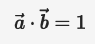

#### 7、极限

公式\lim_{n\rightarrow+\infty}

例： 符号：`$\lim_{n\rightarrow+\infty}$`，示例公式：`$\lim_{n\rightarrow+\infty}\frac{1}{n}$`

符号：

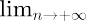

示例公式：

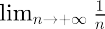

#### 8、累加/累乘

公式累加\sum_1^n, 累乘\prod_{i=0}^n

例： 累加`$\sum_1^n$`, 累乘`$\prod_{i=0}^n$`

累加

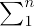

累乘

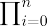

#### 9、省略号

公式\ldots 表示底线对其的省略号，\cdots 表示中线对其的省略号，\cdot点乘号。

例 ：` $f(x_1,x_2,\ldots,x_n) = \left({1 \over x_1}\right)^2+\left({1 \over x_2}\right)^2+\cdots+\left({1 \over x_n}\right)^2$`

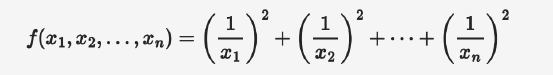

#### 10、符号

##### 10.1 数学符号

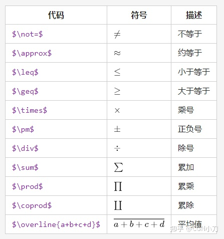

##### 10.2 三角函数

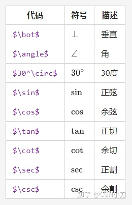

##### 10.3 定积分

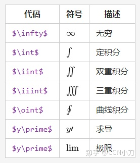

##### 10.4 集合

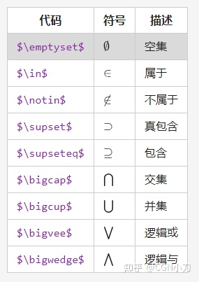

##### 10.5 对数符号


##### 10.6 希腊字母

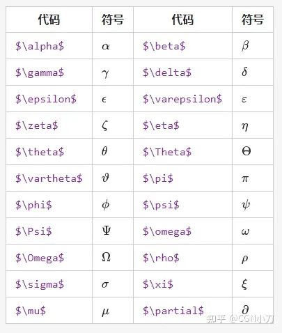

### 嵌入视频

<iframe src="//player.bilibili.com/player.html?aid=570688331&bvid=BV1tz4y1h7q1&cid=1117852414&page=1" scrolling="no" border="0" frameborder="no" framespacing="0" allowfullscreen="true" width="800px" height="600px" > </iframe>

### Markdown 跳转到本文章标题

一、只可以在Markdown文件中跳转
1、因为 Markdown 文件标题就是 Markdown 一种锚点
任何级别的标题可以直接作为锚点目标。如果标题比较固定（不是经常改来改去），可以直接使用标题作为锚点。

```
1、这是一个标题 1
[这个地方不错，如果想看可点击跳转文件](#标题1)

2、这是一个标题 2


### 标题1
123456


### 标题2
qwert

```

2、如果标题中有空格和特殊字符，按照下面的规则进行处理：

- 大写字母改成小写

- 特殊字符全删除，如某个标题为`2.1.1 简介` 变成 `211-简介`

  ```
  [这个地方不错，如果想看可点击跳转文件](#211-简介)
  ```

- 空格改成横线（-）

二、结合使用[HTML语言](https://so.csdn.net/so/search?q=HTML语言&spm=1001.2101.3001.7020)在Markdown文件中跳转

```
<a href="#lable">点击跳转到下面</a>
......
......
......
......
......
<span id="lable">到下面了</span>

```

或者另一种

语法格式如下：

```text
[添加链接的正文](#自定义索引词)
<a id=自定义索引词>跳转提示</a>
```

注意：

1. 语法格式当中所有的符号均是**英文半角**。
2. “自定义索引词”最好是英文，较长的词可以用下划线连接。
3. “a标签”出现在想要被跳转到的文章位置，html标签除了单标签外均要符合“有头（`<a>`）必有尾（`</a>`）”的原则。头尾之间的“跳转提示”是可有可无的。
4. “a标签”中的“id”值即是为正文中添加链接时设定的“自定义索引值”，这里通过“id”的值实现从正文的链接跳转至指定位置的功能。
