## 机器学习

> https://www.bilibili.com/video/BV1Wv411h7kN
>
> P1-P4, P6, P7

### 1. 什么是机器学习和深度学习？

​	即学会映射关系的函数表达式

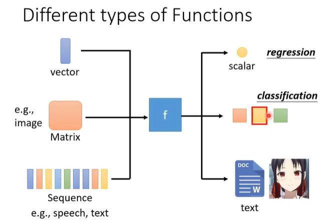

### 3. 监督学习

​	利用一组已知类别的样本调整分类器的参数，使其达到所要求性能的过程，也称为监督训练或有教师学习。

### 2. 自监督学习

​	自监督学习主要是利用辅助任务（pretext）从大规模的无监督数据中挖掘自身的监督信息，通过这种构造的监督信息对网络进行训练，从而可以学习到对下游任务有价值的表征。

​	自监督学习的优势，就是可以在无标签的数据上完成训练

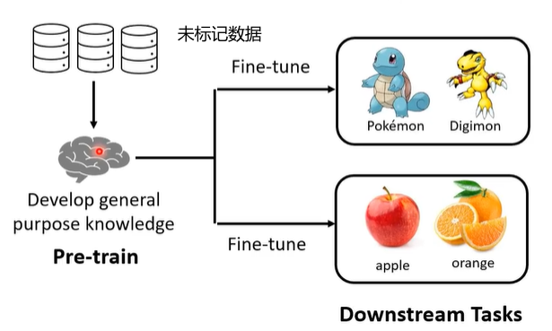

​	Pre-trained Model (Foundation Model 基础模型)：如Bert

### 3. 终生学习（Life-long Learning）

> https://blog.csdn.net/iuiloveyou0/article/details/127097736

终生学习的重点在于不遗忘，既能学习最终的模型，也不会忘记前面模型学习到的知识

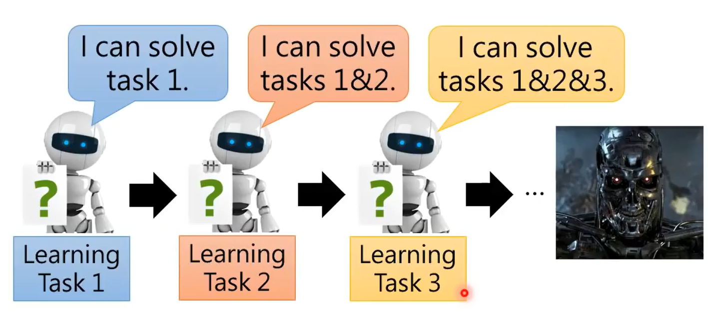

### 4. 线性模型到非线性模型

- 线性模型的函数构造相当于常数+若干个函数

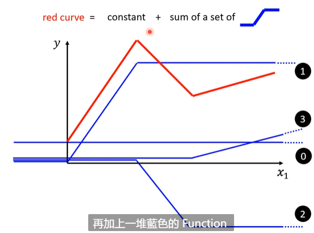

- 那么非线性模型可以用激活函数将线性转换至非线性函数

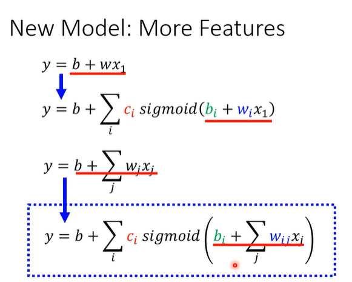

- 定义函数、损失、优化器。

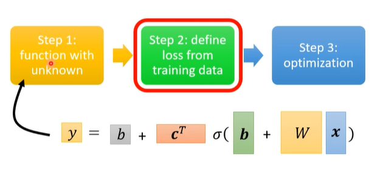

- 小批量的方法进行参数更新

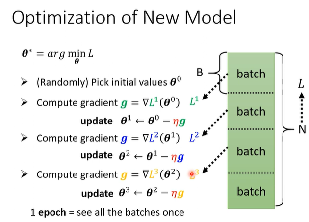

- 激活函数中sigmoid与relu的关系是，Sigmund等于俩个Relu相加

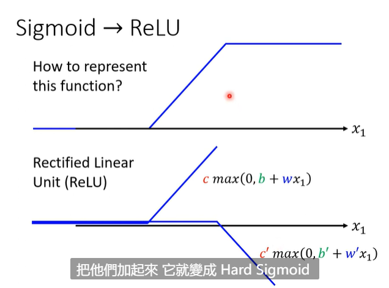

- 最后形成的模型如下，激活函数即为神经元

  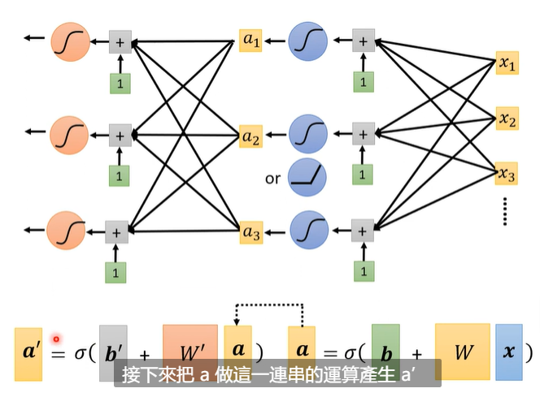

### 5. 浅谈机器学习原理

> https://blog.csdn.net/toro180/article/details/125485671

这一节内容主要阐述了模型理想（在所有数据中）和现实（仅有训练数据集）的差距和相关原理。

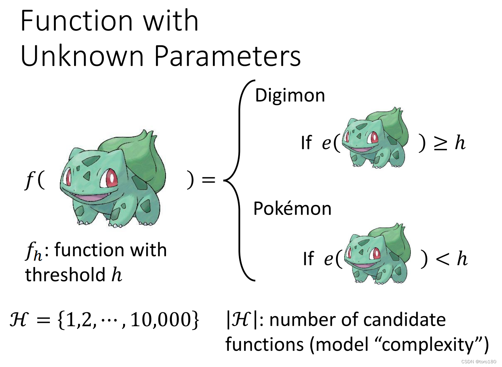

首先，为了简化内容，把模型函数写为一个threshold函数，且h仅能取【1，10000】，这个意思就是仅有10000个候选函数。

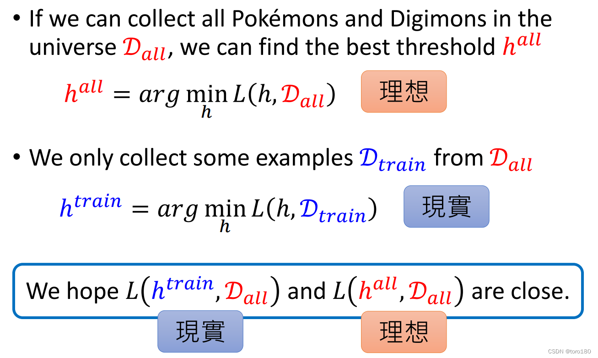

但我们只能从所有数据集中取出一部分作为训练集进行训练，毕竟绝大多数情况下，我们无法获得所有数据。
现在我们希望现实和理想的loss可以比较接近。

而这就需要训练的数据集尽量接近所有数据。
课程给出，满足上式公式的训练集是所有数据的好的代言。

- 取任一h，都能满足训练模型的loss和完美情况的loss的差值<=δ/2

通过Hoeffding’s Inequality公式，我们可以推导出训练集是坏的概率小于等于下式（此处省略了推导步骤）

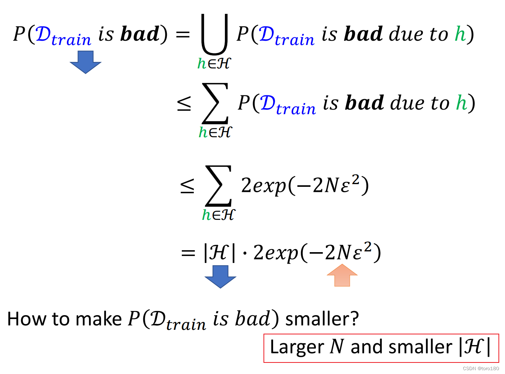

所以说，为了让训练集坏的概率尽量低，我们需要Larger N and smaller |H|，也就是说更大的数据集，更小的模型弹性（即模型的可选择项少）。

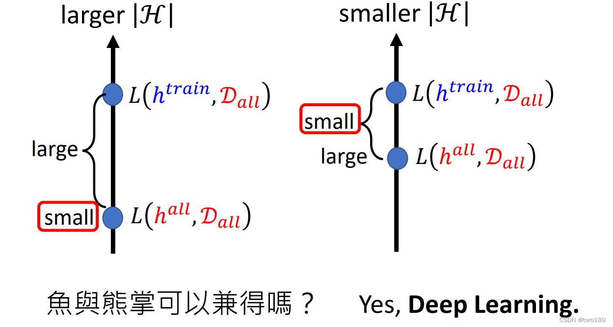

那如果我们选择Larger N and smaller |H|，其实仍然存在有问题。

- 如果我们选择了弹性大的模型，那么我们理想的loss会很低，但是理想和现实的差距会比较大
- 如果我们选择了弹性小的模型，那我们虽然理想和现实的差距小，但是理想的loss本来就不小

能不能鱼与熊掌兼得呢？
可以，使用Deep Learning！