## 深度学习

> https://www.bilibili.com/video/BV1Wv411h7kN?p=13

### 0. 流程

- 深度学习的计算步骤

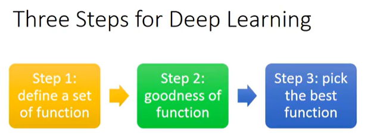

- 神经网络的计算流程，Hidden Layers做特征提取工程，神经网络最后一层神经元Output Layer作为Multi-class Classifier 加上一个softmax计算各个类别概率

  > https://zhuanlan.zhihu.com/p/597762584

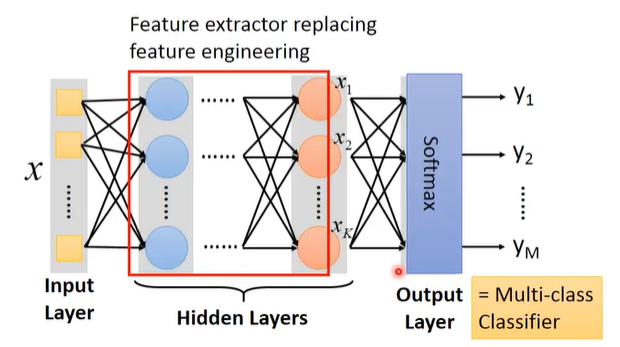

### 1. 全连接神经网络

- 在全连接网络中为矩阵操作计算，过程如下所示，黄色为weight矩阵参数，蓝色为输入输出，绿色为bias

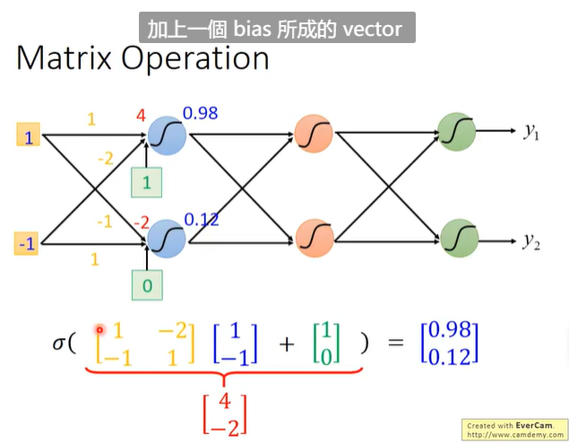

- 多个神经元嵌套计算即为神经网络，前一层神经元的输出即为后一层神经元的输入

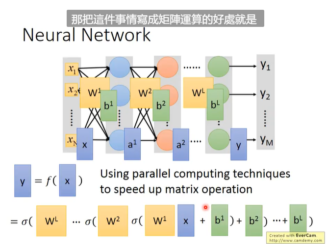

- Demo，输入的一张图片有256像素，将其由二维矩阵拉平以vector形式输入。

  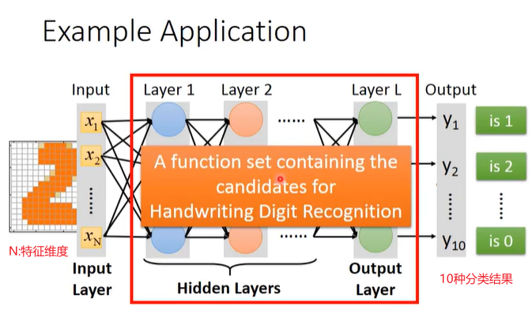

- LOSS 计算，每个样例计算得到的loss $C^n$聚合

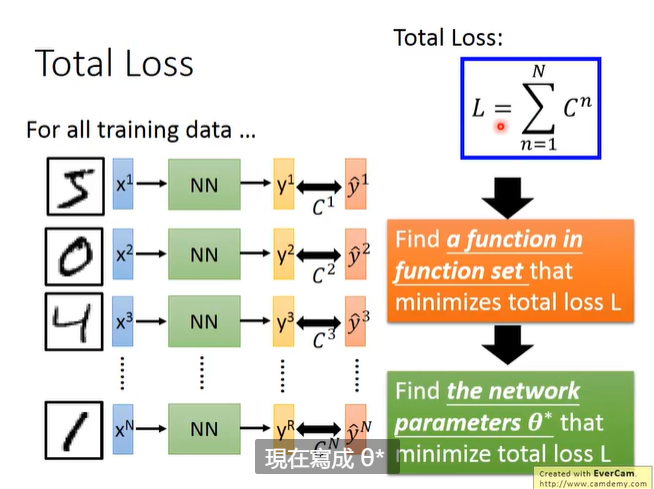

- 梯度计算，参数更新

  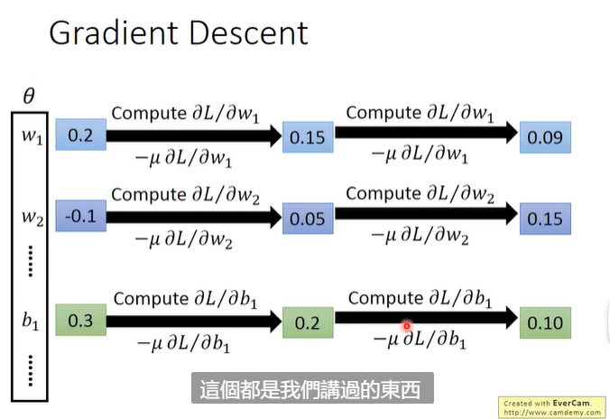

### 2. 梯度计算理论

#### 2.1 梯度计算

- 利用loss对每个参数进行偏微分求导后设置学习率进行参数更新

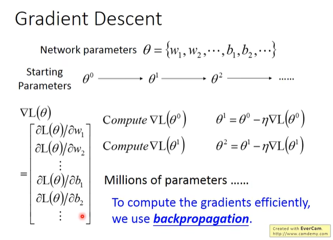

#### 2.2 链式法则

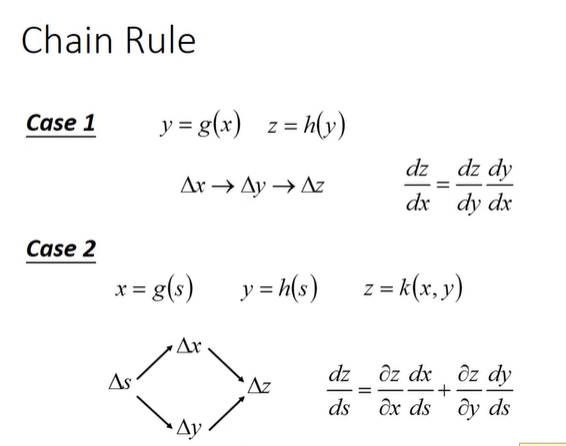

#### 2.3 反向传播

- 利用链式法则分解，分解成**前向过程（z对w的偏微分）和反向过程（C对z的偏微分）之积**

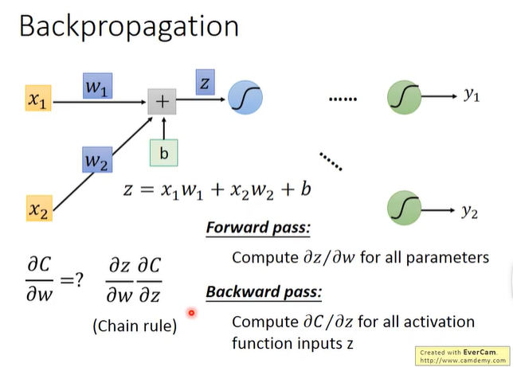

##### 2.3.1 前向计算过程

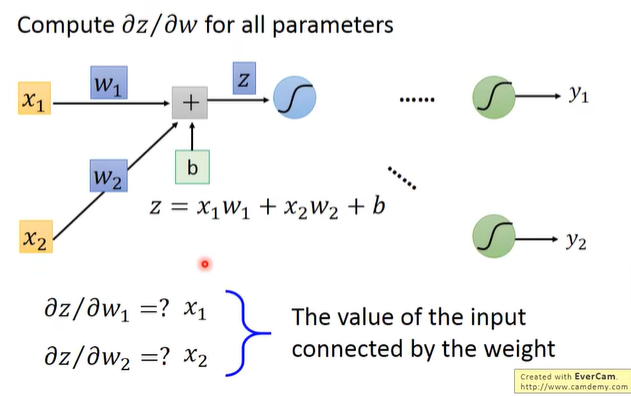

​	计算技巧：w2它前面的input是x2，所以微分之后就是x2.

##### 2.3.2 反向计算过程

- 计算C对z的偏微分

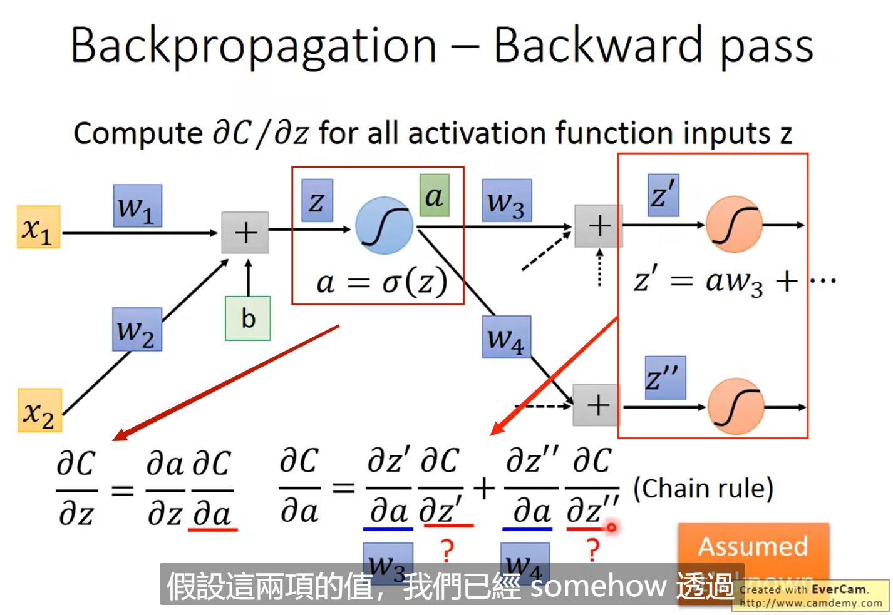

​	上图备注：C对a的偏微分表达式中的项数由这一层链接的神经元数量决定。

- 进一步，可以将方便计算的项计算出来，得到如下的表达式，唯一不知道的俩项为C对z'以及z''的偏微分

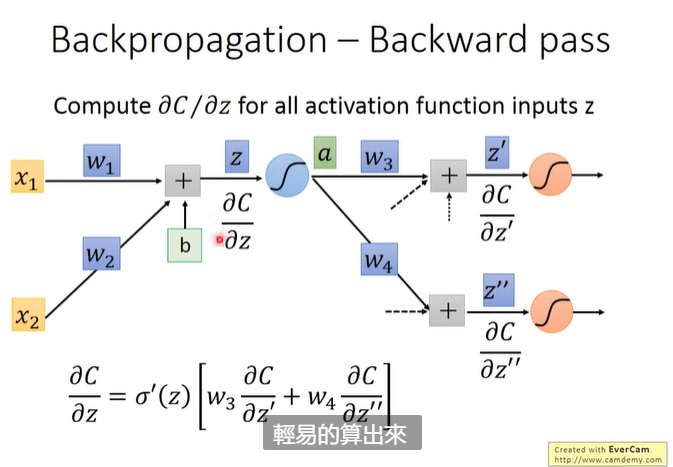

- 为了求解C对z的偏微分，可以假设C对z'以及z''的偏微分已经求解出来。

  而C对z的偏微分表达式可以换另一种神经元的形式进行绘图如下，其中σ‘（z）是一个常数，这是因为在前向计算时就已经决定了。

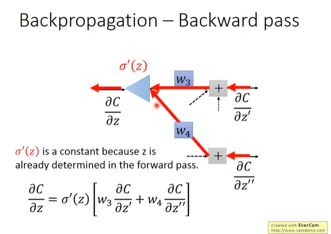

- 进一步求解，类似反证法思想，为了求解C对z'以及z''的偏微分，下面有俩种情况

  - 情况一，已经是最后一层神经元，可以直接将C对z'以及z''的偏微分，第一项即为神经元的导数，第二项C对y1、y2的偏微分即为损失函数的偏微分

	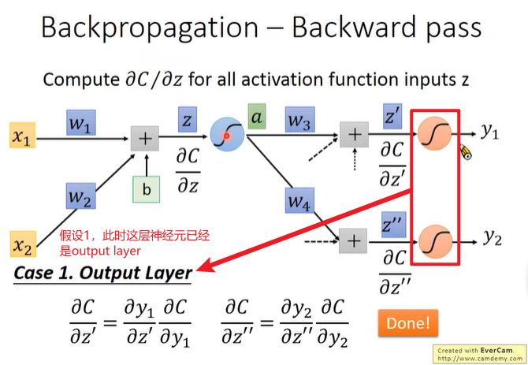

  - 情况二，不是最后一层神经元。就继续假设下一层的C对Za、Zb可以求出来，直到遇到情况一，即可全部求出。

	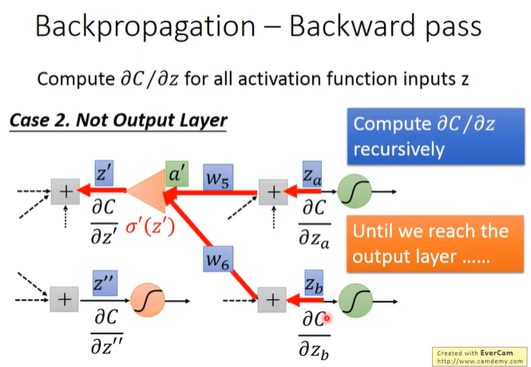

- 最后为了计算效率，可以从输出往输入计算，即为反向传播，如下图所示

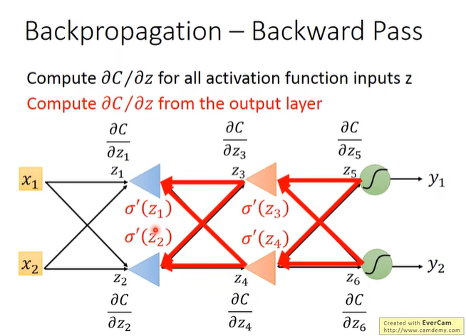

##### 2.3.3 总结

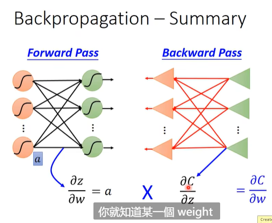
