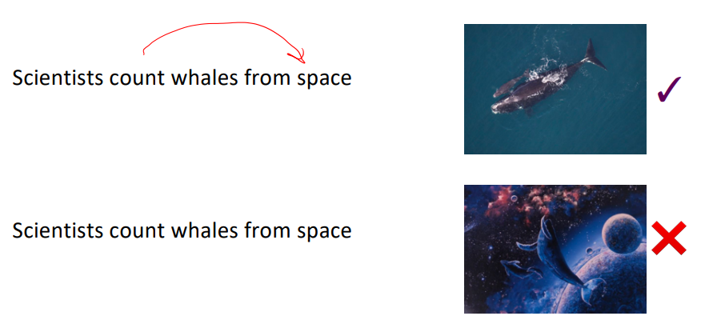
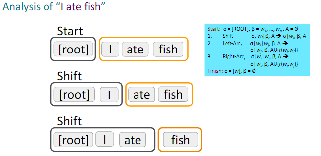

# Lecture1

## 分布式语义

分布式语义：一个单词的意思是由频繁出现在附近的单词给出的

&nbsp;

当单词w出现在文本中时，它的上下文是出现在其附近(在固定大小的窗口内)的单词的集合

我们使用w的许多上下文来构建w的表示：

这些上下文单词将代表“银行”

&nbsp;

## 词向量(Word vectors)

词向量(Word vectors)：为每个单词构建一个密集向量，选择使其与出现在相似上下文中的单词向量相似，以向量点(标量)积来度量相似性

*词向量也被称为(词)嵌入或(神经)词表示，它们是一种**分布式表示**

&nbsp;

## Word2vec

Word2vec是一个学习词向量的框架

### 概述

- 我们有一个大的文本语料库(“主体”)：一个很长的单词列表

- 固定词汇表中的每个单词都由一个**向量**表示

- 浏览文本中的每个位置$t$，其中有一个中心词$c$和上下文(“外部”)词$o$

- 使用$c$和$o$的词向量的相似性来计算给定$c$时$o$出现的概率(反之亦然)

- 不断调整词向量以最大化此概率

&nbsp;

### 目标函数

对于每个位置$t= 1,…,T$，在给定中心单词$𝑤_t$的固定大小m的窗口内预测上下文单词。数据的似然：

目标函数$J(\theta)$(有时被称为代价函数或损失函数)为(平均)负对数似然：

最大化预测精度$\Leftarrow\Rightarrow$最小化目标函数

&nbsp;

为每个单词w使用两个向量：

- $v_w$：当w是中心词时

- $u_w$：当w是上下文词时

对于中心词$c$和上下文词$o$：

&nbsp;

### 预测函数

&nbsp;

### 更多细节

- 为什么是两个向量?

——更容易优化。最后取两者的平均值。

&nbsp;

- 两种模型：
1. Skip-grams (SG)：基于中心词预测其周围的(即“外部”)单词(与位置无关)
2. 连续词袋(CBOW)：从(包含)上下文单词预测中心单词

&nbsp;

# Lecture4

## 语句歧义

介词短语附加歧义：

协调范围模糊：

形容词/副词修饰语歧义：

动词短语(VP)附加歧义：

&nbsp;

## 依存语法

依存语法假定句法结构由词汇项目之间的关系构成，通常是二元非对称关系(“箭头”)，称为**依存关系**。

箭头将头部(统治者、上级、摄政者)与从属(修饰语、下级、下属)连接起来。

通常，依赖关系形成一个**树**(一个连通的、无环的、单根的图)。

&nbsp;

我们通常会添加一个**假词根**，这样每个单词都依赖于另一个节点。

&nbsp;

## 通用依赖性树库

通用依赖：[http://universaldependencies.org/](http://universaldependencies.org/)

&nbsp;

## 依存分析的信息来源

- 依存关系：依赖性[discussion$\rightarrow$issue]是合理的

- 依赖距离：大多数依赖存在于邻近的单词之间

- 插入成分：依赖关系通常不会跨越插入动词或标点符号

- 头部化合价：一个头部的两侧通常有多少个依赖？

&nbsp;

## 依存语法分析

一个句子是由为每个单词选择其依存关系的其他单词(包括根节点)来解析的。

通常有一些约束：

- 只有一个单词依赖于ROOT

- 不要循环A→B、B→A

这使得依赖关系成为一个**树**

最后一个问题是箭头是否可以交叉(非投影)

&nbsp;

### 投影性

投影解析的定义:当单词按线性顺序排列时，没有交叉依赖弧线，所有弧线都在单词上方。

与CFG树相对应的依赖关系必须是**投影**的。

- 也就是说，通过将每个类别的1个子元素作为头部来形成依赖关系。

大多数语法结构都是像这样的投影结构，但依赖理论通常不允许非投影结构来解释移位的成分。

&nbsp;

## 依存分析方法

- 动态规划

Eisner给出了一个复杂度为$0(n^3)$的聪明算法，它生成的解析项的头位于末尾而不是中间。

- 图算法

你为一个句子创建一个最小生成树。

- 约束满足

不满足硬约束的边被剔除。

- “基于转换的解析”或“确定性依赖解析“

基于良好机器学习分类器的贪婪式附件选择

&nbsp;

### 基于贪婪转换的解析

解析器执行一系列**自底向上**的操作。

大致类似于shift-reduce解析器中的“shift”或“reduce”，但“reduce”操作专门用于创建头部朝左或朝右的依赖项。

解析器有：

- 一个堆栈$σ$，从上往右写——以ROOT符号开头

- 一个缓冲区$β$，顶部写在左边——以输入句子开头

- 一组依赖弧$A$——一开始是空的

- 一组操作

&nbsp;

### 基本的基于转换的依存句法分析器

基本过程：

&nbsp;

缺点：

- 以局部最优的加和代替全局最优，导致错误传递

- 不可处理**非投影现象**，准确率稍逊于全局最优算法

&nbsp;

### 基于arc标准转换的解析器

例子：

