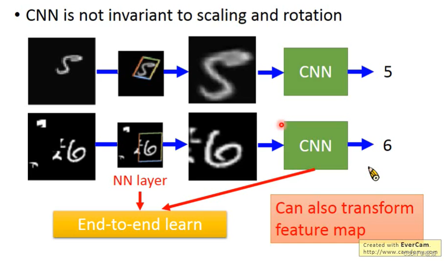

# 卷积神经网络

> - https://www.bilibili.com/video/BV1Wv411h7kN/?p=31
> - https://wskh0929.blog.csdn.net/article/details/128293129
> - p31、p34

## 1. 图片分类问题

图片分类：输入一张图片（假设输入图像大小相同，若不同就resize），输出该图片的类别（onehot编码）

实际上，一张彩色图片是由RGB三个通道（channels）叠加而成的，每个通道都是 100 × 100 的大小，所以彩色图片是 3维 的，如下图所示

我们可以很容易的想到，想要对图像进行分类，我们可以先将其展开、拉长为一条一维向量，如下图所示，再将展平的一维向量传给**全连接网络**进行训练。这是最简单最直觉的进行图像分类的方法。

## 2. 观察图片分类问题的特性

### 2.1 观察1

> 如图所示，假设我们想知道图片的类别是鸟，作为人类，我们要想分辨图中有没有鸟，我们会着重分别图中有没有鸟的某些明显的特征，比如我看到图中有鸟的头，我就认为图中有鸟，我看到图中有鸟的尖嘴，我也认为图中有鸟

> 下面给出了一个例子，我们可能第一眼看过去，看到了类似乌鸦头的特征，然后下意识地觉得这应该是鸟。但是仔细看才发现，噢原来还有猫头的信息，而且猫头的信息更大，所以最终我们会做出正确的判断，认为图像中的是猫

### 2.2 简化1：卷积

- 根据上面的叙述，我们知道，其实对于图像的识别，我们可能不需要用到图片上的所有信息，大多数情况，我们只需要看图片的一小部分就可以识别出图像的类别。

如下图所示，我们可能会对图片划分为一个一个的接受域（receptive field），然后不同的接受域传给不同的层去进行特征的提取和前向传播。

- 这个特征域是可以根据你要求解的图像分类问题的特性任意设定的，比如你要求解的图像分类问题的图像中的特征位于图片的左上角和右上角，那接受域你也大可不用设置为正方形，可以设置成两个正方形分开的一种特殊接受域。

尽管接受域的设计有很多种方法，但实际上，大部分图片的特征都是紧挨着的，比如识别猫的头，那猫头的特征就是一片长方形像素所代表的。所以，在大部分情况下，我们的接受域都是设计一个长方形或者正方形。

下图就展示了最常用的接受域设计方法（正方形）：接受域大小为3×3，对所有channels生效，每次移动步长为2，接受域超出图片的部分就用0填充（padding）

### 2.3 观察2

如下图所示。在不同图片中，鸟嘴的位置可能是不一样的，但是他们都代表了同一个特征，如果用不同的NetWork去侦测相同的特征，他们干的都是侦测鸟嘴，这样就会有点冗余

### 2.4 简化2：共享参数 - 卷积核

- 可以让两个NetWork共享参数，两个网络参数相同，**但是由于侦测的地方不同，输入不同，也会使得输出不同**，这样不会导致特征识别不到，还可以减少参数，减少模型冗余 
  - 具有相同感受野的两个神经元不会共享参数。
    

  - 每个感受野都有一组神经元（例如64个神经元）。每个感受野都有具有相同参数集的神经元。
    

    filter 颜色相同就参数相同。

  - 另一种解释方式

    - 每个filter 识别不同的模式

    

    - 如下，一个filter就识别图像中一个模式

    

    - 多层卷积时，filter channel数量会根据上一层的filter数量而定

    

    - network够深，感受野越大，能够侦测到大的模式

    

    - 一个filter扫描整张图片

      

  - 俩种理解方式的对比

    

- 优势

  针对影像有的特有的特性，虽然CNN的model bias大 但是是合适的，但如果是其它的不具备影像特有的特性的事情就不适合。

  

### 2.5 观察3

- 一张图片，进行适当的缩小之后，我们还是可以进行较为准确的识别。所以是不是意味着，我们可以对图片进行缩小，从而降低网络的学习难度，并达到比较好的预测效果呢？

### 2.6 简化3：池化

- 池化不会改变模型的channel数量

#### 2.6.1 Max Pooling

最大池化指的是，在指定池化范围内，只保留最大值的像素点

- 下面就是只保留了最大像素点的示意图。可见，图像数据得到了压缩

#### 2.6.2 Mean Pooling

> 平均池化：就是在指定池化范围内，保留该范围内像素点的平均值

> 通常地，一般会在卷积层后接一个Pooling层，如此循环，构成CNN

- Pooling 做完要flatten

### 2.7 小结

- 全连接网络用来求解图像分类问题时，可以获取图片的所有信息，但是这样模型参数太大，很难Train起来，就算Train起来了，由于用到了图片上的所有信息，所以很可能出现过拟合现象。比如，同样的一只猫，可能因为背景的不同，网络就识别不好了，全连接网络不能较好地提取图像特征

- 卷积神经网络采用接受域和参数共享策略，降低了模型地参数，使得模型过拟合的风险大大降低，且具有较好的图像特征提取能力

## 3. CNN的其他应用 

### 3.1 Playing Go

> 除了图像分类，CNN还可以用在下围棋上，把黑子作为1，白子作为-1，无子作为0，这样就可以构成一张Image，传入CNN，做一个19×19的分类问题，预测下一步要落子的位置

> 为什么CNN可以用在下围棋上呢？

> 因为围棋和图片一样，我们有时候可以只看一部分区域的局势，就可以推测出下一步要怎么下，所以可以用CNN

## 4. CNN 问题

下图展示了CNN存在的问题。即它不能很好地处理图像的放大和缩小问题。

假设它能很好的识别上方的狗狗图片，但是将图片放大后，狗狗的特征范围发生了变化，这时候CNN就不一定能识别出狗狗了！有一个网络结构可以解决这个问题：Spatial Transformer Layer

## 5. Spatial Transformer

> https://blog.csdn.net/guai7guai11/article/details/125396167

### 5.1 不变性

不变性意味着即使目标的外观发生了某种变化，但是依然可以把它识别出来。这对图像分类来说是一种很好的特性，因为我们希望图像中目标无论是被平移，被旋转，还是被缩放，甚至是不同的光照条件、视角，都可以被成功地识别出来。

所以上面的描述就对应着各种不变性：

- 平移不变性：Translation Invariance
- 旋转/视角不变性：Ratation/Viewpoint Invariance
- 尺度不变性：Size Invariance
- 光照不变性：Illumination Invariance

### 5.2 为什么CNN有一点点transition invariant?

局部平移不变性是一个很有用的性质，尤其是当我们关心某个特征是否出现而不关心它出现的具体位置时。

> 在神经网络中，卷积被定义为不同位置的特征检测器，也就意味着，无论目标出现在图像中的哪个位置，它都会检测到同样的这些特征，输出同样的响应。(一般认为)

简单地说，卷积+最大池化约等于平移不变性。即为参数共享和池化使卷积神经网络具有一定的平移不变性。比如说当图像中的物体移动一点点，由于maxpooling的作用，在CNN看来是一样的。但是比如物体从左上角被移动到了右下角，那么对于CNN来说还是不一样。（本视频认为）

#### 5.2.1 具体解释

##### 5.2.1.1 卷积

简单地说，**图像经过平移，相应的特征图上的表达也是平移的**。下图只是一个为了说明这个问题的例子。

输入图像的左下角有一个人脸，经过卷积，人脸的特征（眼睛，鼻子）也位于特征图的左下角。

假如人脸特征在图像的左上角，那么卷积后对应的特征也在特征图的左上角。

##### 5.2.1.2 池化

比如最大池化，它返回感受野中的最大值，如果最大值被移动了，但是仍然在这个感受野中，那么池化层也仍然会输出相同的最大值。这就有点平移不变的意思了。

##### 5.2.1.3 CNN并不是完全transition invariant

当目标小范围移动时，CNN才具有transition invariant，如果目标从左上角移动到了右下角，CNN没有平移不变性。

**CNN 有不完全 transition invariant 无scaling invariant 无rotation invariant**
CNN的机理使得CNN在处理图像时可以做到部分平移不变性（transition invariant）**，却没法做到尺度不变性（scaling invariant）和旋转不变性（rotation invariant）**。即使是现在火热的transformer搭建的图像模型(swin transformer, vision transformer)，也没办法做到这两点。因为这些模型在处理时都会参考图像中物体的相对大小和位置方向。不同大小和不同方向的物体，对网络来说是不同的东西。这个问题在STL论文中统称为spatially invariant问题。甚至不同方向的物体，本身就真的是不同的东西，比如文字。

平移不变性（transition invariant）：

> 例如：
> 尺度：模型可以预测大狗和小狗，不是因为模型尺度不变性，而是因为数据集中有大狗图片也有小狗图片。
> 旋转：数字3经过旋转可能被识别为m。

关于平移不变性 ，对于CNN来说，如果移动一张图片中的物体，那应该是不太一样的。假设物体在图像的左上角，做卷积操作，采样都不会改变特征的位置，糟糕的是若把特征平滑后后接入了全连接层，而全连接层本身并不具备 **平移不变性** 的特征。但是 CNN 有一个采样层，假设某个物体移动了很小的范围，经过采样后，它的输出可能和没有移动的时候是一样的，这是 CNN 可以有小范围的平移不变性 的原因。

其实pooling layer有一定程度上解决了这个问题，因为在做max pooling或者average pooling的时候，只要这个特征在，就可以提取出来，在什么位置，pooling layer是不关心的。但是pooling的kernel size通常都比较小，需要做到大物体的spatially invariant是很难的，除非网络特别深。

**普通的CNN能够显示的学习平移不变性，以及隐式的学习旋转不变性，但 attention model 告诉我们，与其让网络隐式的学习到某种能力，不如为网络设计一个显式的处理模块，专门处理以上的各种变换。**因此，DeepMind就设计了Spatial Transformer Layer，简称STL来完成这样的功能。

STN(spatial transformer network)的提出，就是为了解决spatially invariant问题。**它的主要思想很简单，就是训练一个可以把物体线性变换到模型正常的大小和方向的前置网络。**这个网络可以前置于任何的图像网络中，即插即用。同时也可以和整个网络一起训练。

### 5.3 Spatial Transformer Layer STL 概览

如图所示，如果是手写数字识别，图中只有一小块是数字，其他大部分地区都是黑色的，或者是小噪音。假如要识别，用Transformer Layer层来对图片数据进行旋转缩放，只取其中的一部分，放大之后然后经过CNN就能识别了。

STL 其实也是一个layer，放在了CNN前面，用来转换输入的图片数据，其实也可以转换feature map（一张特征图也可以看做一张图片），所以Transformer layer也可以放到CNN里面。

再说的直白一点，就是一个可以根据输入图片输出仿射变换参数的网络。

上图是STN网络的一个结果示意图，(a) 是输入图片，(b) 是STN中的localisation网络检测到的物体区域，(c) 是STN对检测到的区域进行线性变换后输出，(d) 是有STN的分类网络的最终输出。

### 5.4 STN如何实现Transform an image/feature map？

- 引例：平移变换

如下图所示，平移功能，这其实就是Spatial Transformer Networks要做一个工作。

假设左边是 Layer l−1 的输出，也就是当前要做Transform的输入，最右边为Transform后的结果。这个过程是怎么得到的呢？

假设是一个全连接层，n,m代表输出的值在输出矩阵中的下标，输入的值通过权值w，做一个组合，完成这样的变换。简单而言，就是将左边的往下移动一格到颜色对应的位置。

举个例子，假如要生成$a_{11}^l$那就是将左边矩阵的九个输入元素，全部乘以一个权值，加权相加：
这仅仅是$a_{11}^l$ 的值，其他的结果也是这样算出来的，用公式表示称如下这样：

通过调整这些权值，达到缩放，平移的目的，其实这就是Transformer的思想。

#### 5.4.1 如何找到变换权重值？

将Layer l-1的输出值输入到NN中，NN输出Layer l-1 到 Layer1的权重。

#### 5.4.2 图像转换

例子

#### 5.4.3 为什么小数坐标不可微？- 微分为0无法梯度下降

前面举的例子中，权值都是整数，那得到的也必定是整数，如果不是整数呢？

假如权值是小数，拿得到的值也一定是小数，1.6，2.4，但是没有元素的下标索引是小数呀。

有一种错误的思路：四舍五入，若结果为1.6，2.4，取2，2，也就是与$a_{22}^{l-1}$对应了。这种四舍五入的做法可能导致梯度不能更新。上例中：[2,2]计算结果为[1.6,2.4]，对结果四舍五入后为[2,2]。
梯度下降是一步一步调整的，而且调整的数值都比较小，哪怕权值参数有小范围的变化，虽然最后的输出也会有小范围的变化，比如一步迭代后，结果有：1.6→1.64，2.4→2.38。但是即使有这样的改变，结果依然是$a_{22}^{l-1}→a_{22}^{l}$的对应关系，图像没有一点变化，所以output依然没有变，微分为0，也就是梯度为0，梯度为0就没有可学习的空间。

当6个参数 [ a , b , c , d , e , f ] 发生微小的变化之后，下一层的特征也发生变化，这样才可以保证可以梯度下降。所以需要做一个小小的调整，**即插值Interpolation**

#### 5.4.4 Sampler 如何插值？

这种梯度不能更新的问题，其实在推导SVM的时候，也遇到过相同的问题，如果只是记录那些出界的点的个数，好像也是不能求梯度的，当时是用了hing loss，来计算一下出界点到边界的距离，来优化那个距离的，这里也类似，可以计算一下到输出[1.6,2.4]附近的主要元素，如下所示，计算一下输出的结果与他们的下标的距离，可得：

然后做如下更改：

采用了插值的方法来进行采样。比如当坐标为[1.6 , 2.4]时，就用$[a_{12}^{l-1}, a_{13}^{l-1}, a_{22}^{l-1}, a_{23}^{l-1}]$这几个值进行插值。这样一来[ a , b , c , d , e , f ]发生微小的变化之后，[ x , y ] 位置采样得到的值也会有变化了，就可以使用梯度下降优化网络。（之前四舍五入的方案不会产生变化所以不能使用梯度下降优化网络）。这也使得spatial transformer可以放到任何层，跟整个网络一起训练。

对应的权值都是与结果对应的距离相关的，当6个参数发生变化时，这个式子也是可以捕捉到这样的变化的，就可以算出非0梯度，这样就能用梯度下降法来优化了。
