# 机器学习和深度学习训练问题

> - https://www.bilibili.com/video/BV1Wv411h7kN/?p=18
> - p18-p27+p48+p32
> - https://zhuanlan.zhihu.com/p/511226733
> - https://blog.csdn.net/toro180/article/details/125485671

## 1. 总体架构

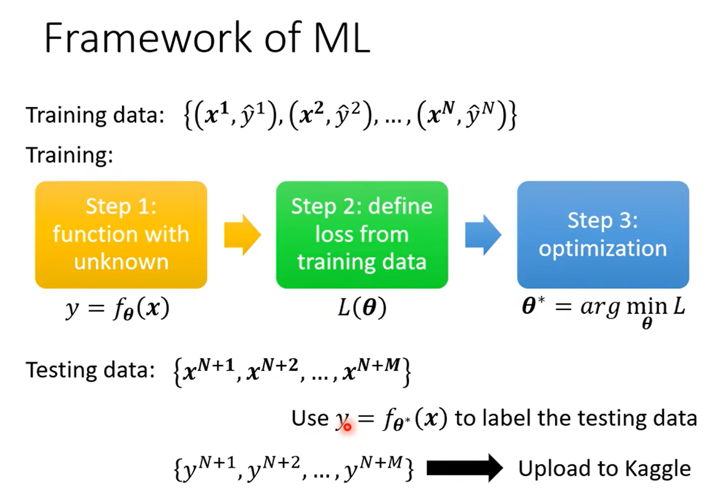

## 2. 总体引导

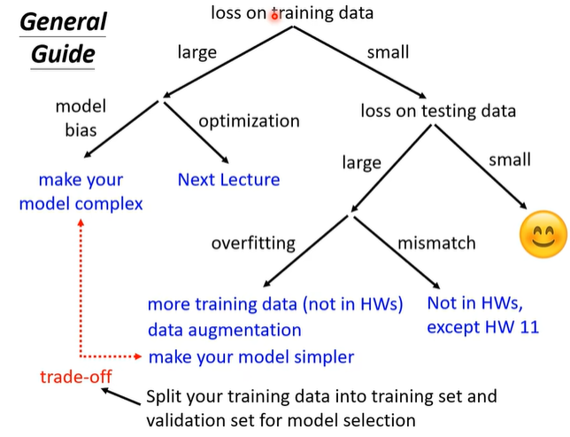

### 1. 训练损失偏大

#### 1.1 model bias 问题

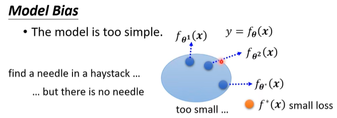

- 设计的function组合不包括预期的function，即为设计的模型太简单

- 解决方案：重新设计模型，增加更多的输入特征来增加模型的弹性

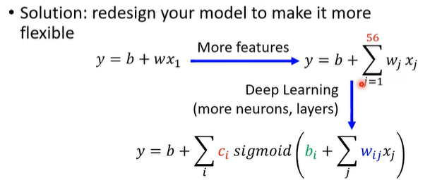

#### 1.2 optimization 问题

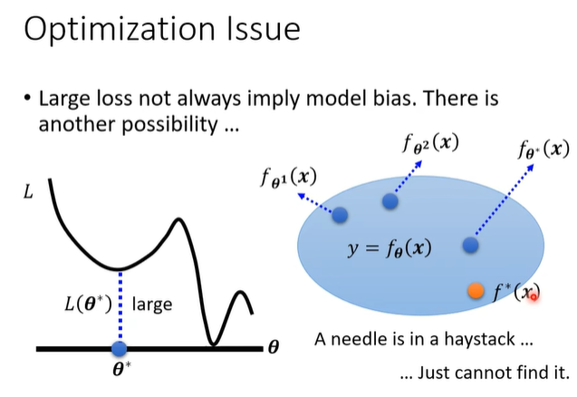

- 设计的function组合包括预期的function，但gradient descent不合适无法找到那个最符合的function

#### 1.3 鉴别方法

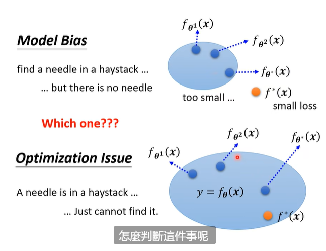

如下所示的resnet网络，56层损失比20层的大主要是因为优化器没有做好

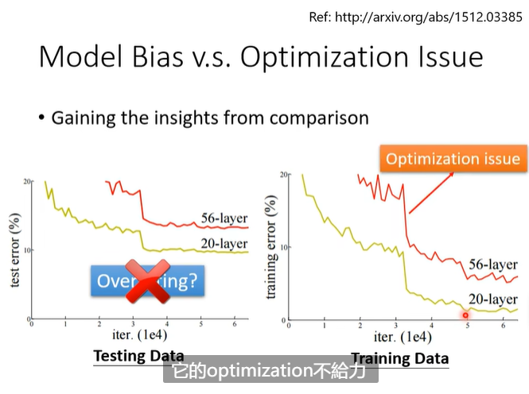

- 从比较中获得见解: 从较浅的网络(或其他模型)开始，这更容易优化。
- 接下来如果深层网络不能获得较小的训练数据损失（对比前面浅层的网络效果），则存在优化问题。

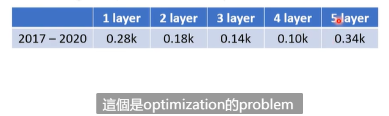

### 2. 测试损失偏大（同时训练损失小）

- 过拟合：training loss 小，testing loss 大

#### 2.1 Overfitting 问题

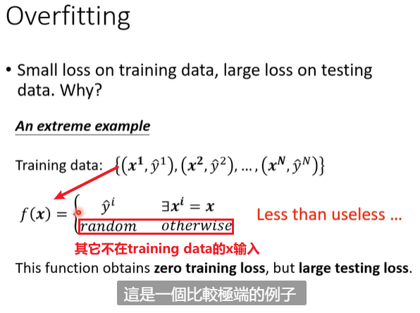

模型很好的模拟了训练数据，但是不在训练数据集上的其它数据因模型自由度很大而损失很大

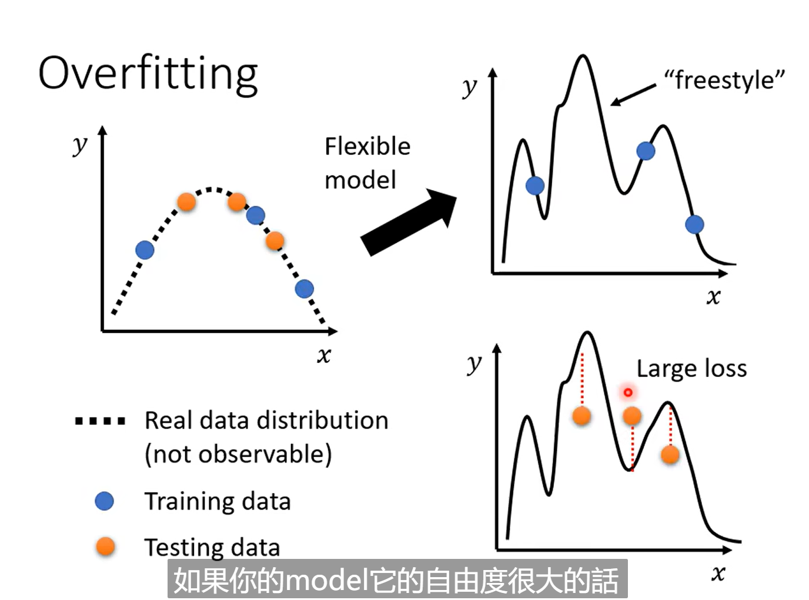

##### 2.1.1 解决方案

- 增加训练资料，使用数据增强时要合适，要考虑到现实的场景

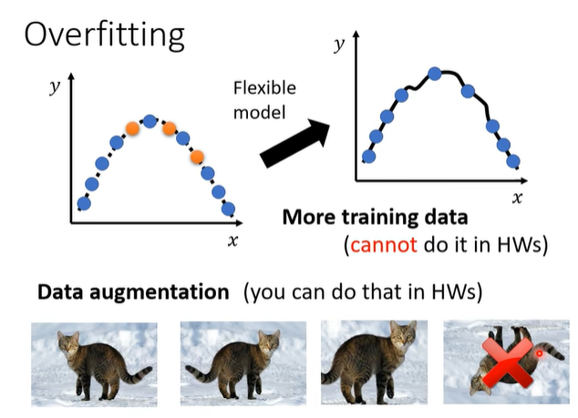

- 限制模型弹性，可以通过减少参数（减少神经元，共用参数），用比较少的特征，Early stopping，Regularization，Dropout

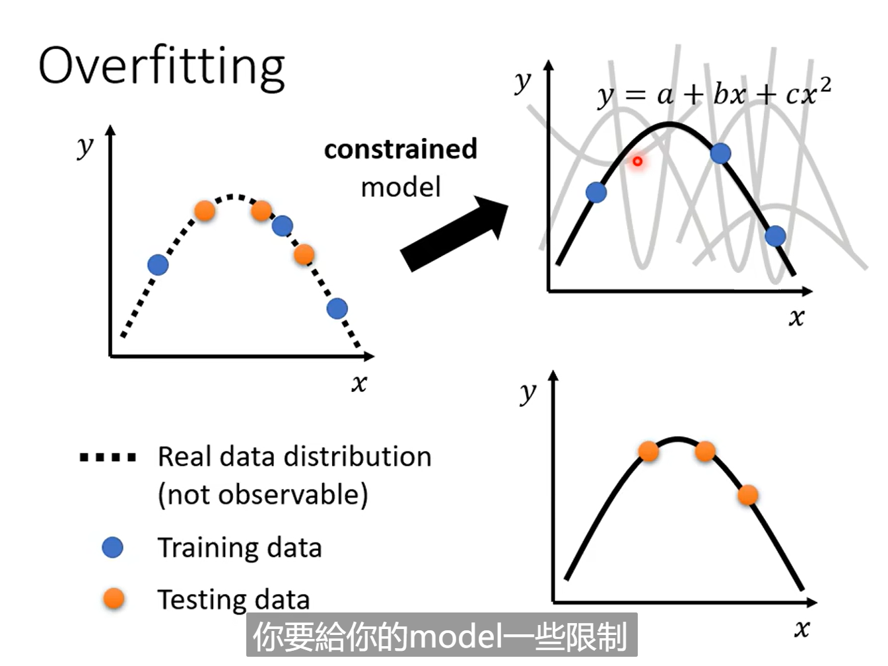

但是不能给过多的限制，否则就会回到model bias 问题

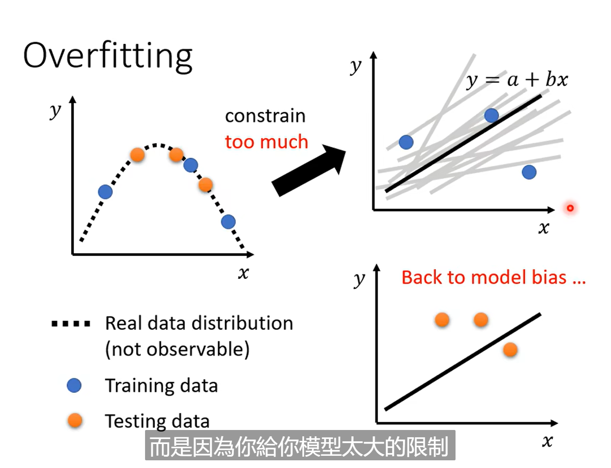

##### 2.1.2 如何选择

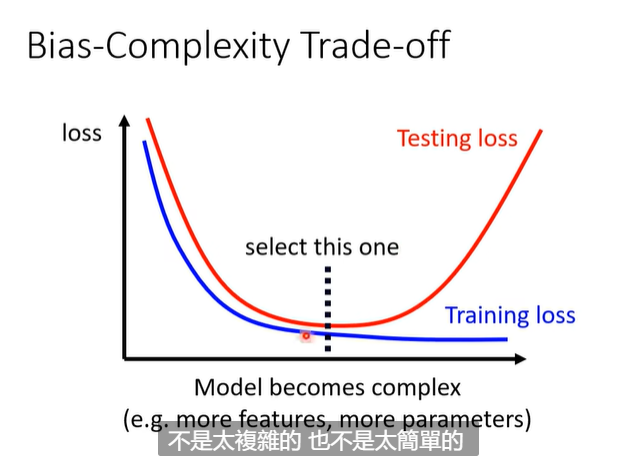

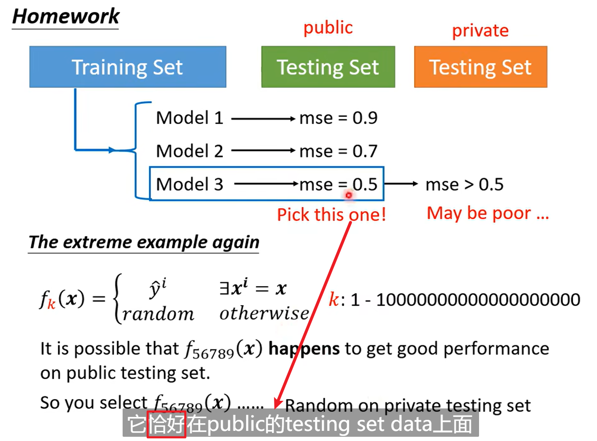

解决方案是在训练集上分出验证集，最后主要看验证集的loss

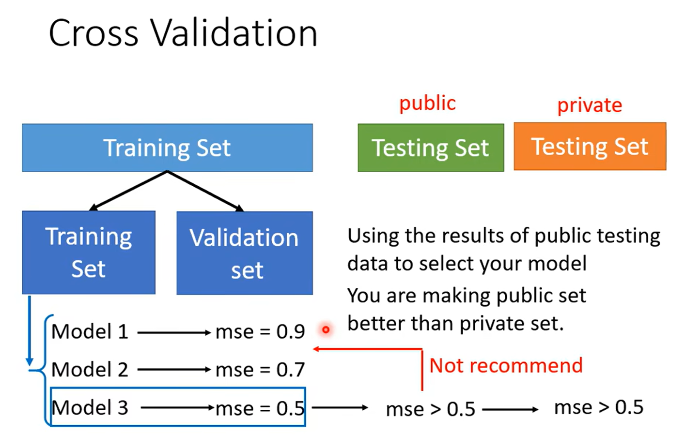

如何分训练集呢，可以采用N-fold Cross Validation

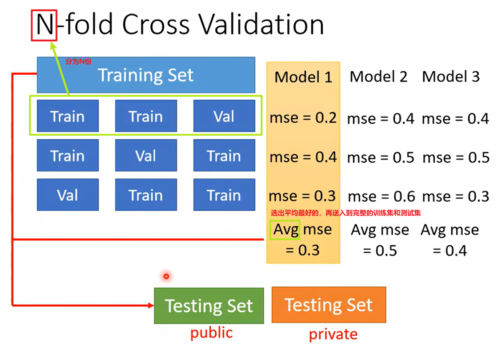

把 training data 再划分为 training set 和 validation set，用 validation set 来挑选模型。然后在挑选的模型上运行，把结果上传到 public leaderboard。这样，public leaderboard 的结果就会和 private leaderboard 更为接近。重要的一点是，尽量不要根据 public leaderboard 的结果去调整模型。

万一没划分好，validation set 不好，会影响模型选择啊，怎么办？

采用 N-fold Cross Validation：把数据集划分成 N 份，每次用 N-1 份做 training set，1 份做 validation set。依次做 N 次训练，这样每份数据都有一次作为 validation set。最后取 N 次训练的均值作为模型训练结果，这下不用担心数据集没划分好了。

#### 2.2 为什么用了验证集还是过拟合了呢？

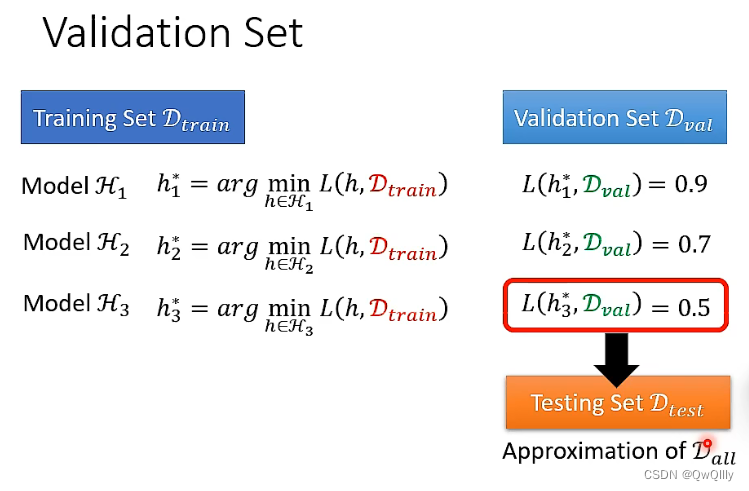

上整个挑选模型的过程也可以想象为一种训练。

把三个模型导出的最小损失公式看成一个集合，现在要做的就是在这个集合中找到某个h（此处可以视为训练），使得在验证集上的损失最低

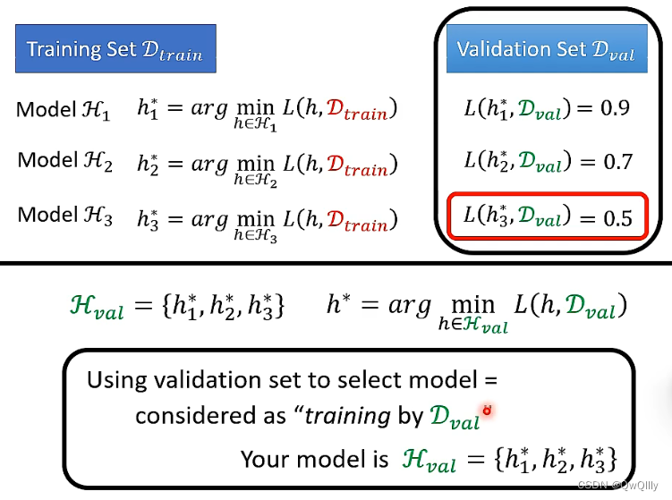

当抽到不好的训练数据时，理想和现实会有差距。

- 这个差距主要由模型复杂度|H|和数据集大小影响

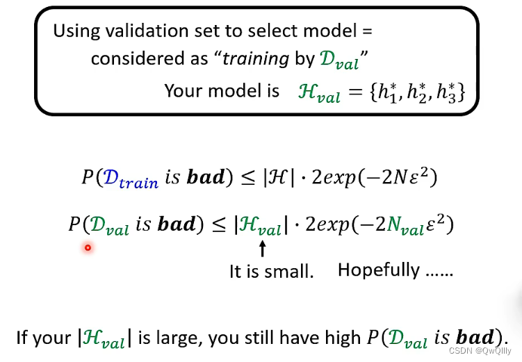

- 训练数据不好的原因：

  - 训练资料的大小

  - 模型的复杂程度（越复杂，结果越糟的可能性越大）

当拿到的验证集不好时，理想和现实会有差距。

- 拿到的验证集不好的原因：

  - 验证集的大小

  - 这个模型的复杂程度（一般不会太大，比如说这里只有3个，取决于如何设计实验）

#### 2.3 mismatch 问题

- 训练和测试数据有不同的分布。

## 3. 局部最小值和鞍点

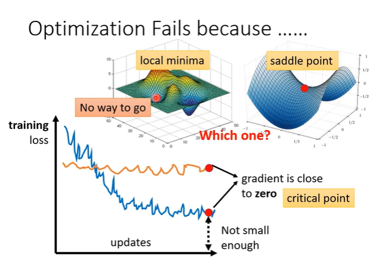

其次，為什麼我们想要知道到底是卡在local minima,还是卡在saddle point呢？（这两种 gradient is close to 0 的情况统称为 critical point）

- 因為如果是卡在local minima,那可能就没有路可以走了,因為四周都比较高,你现在所在的位置已经是最低的点,loss最低的点了,往四周走loss都会比较高,你会不知道怎麼走到其他的地方去
- 但saddle point就比较没有这个问题,如果你今天是卡在saddle point的话,saddle point旁边还是有路可以走的,还是有路可以让你的loss更低的,你只要逃离saddle point,你就有可能让你的loss更低

判断是local mimima还是saddle point呢？（这里省略一大推数学推导，直接记录结论）（其实最直接的方法就是得到loss function的形状）

- 你只要算出一个东西,这个东西的名字叫做 hessian,它是一个矩阵,这个矩阵如果它所有的eigen value（特征值）,都是正的,那就代表我们现在在local minima,如果它有正有负,就代表在saddle point。
- 最后，其实判断并不重要。
- loacl minima为假问题。由于深度学习的参数很多，维度很高，从低维的空间来看,是没有路可以走的东西,在高维的空间中是有路可以走的，所以一般在DP中不会出现local minima的问题
- saddle point有许多方法可以逃离，且运算量比算Hessian更小。（比如small batch、momentum）

### 3.1 数学推导

把 L(θ) 用泰勒级数展开，如下图所示，Gradient 是一阶导数，Hessian 是二阶导数 。

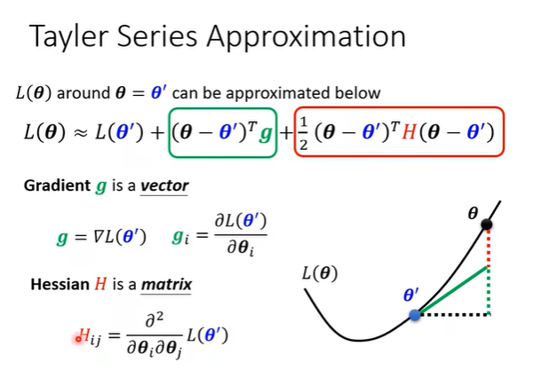

critical point 一阶导数为0

当 Gradient 接近 0 时，一阶导数项为 0， L(θ)  可简化为下图所示的表达式，只需看 Hessian 项。可以通过 H 矩阵的 eigen value（特征值），来判断当前的 critical point 属于哪种情况。

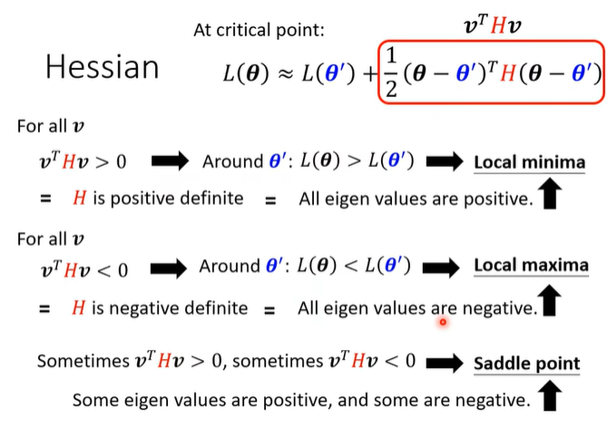

### 3.2 计算例子

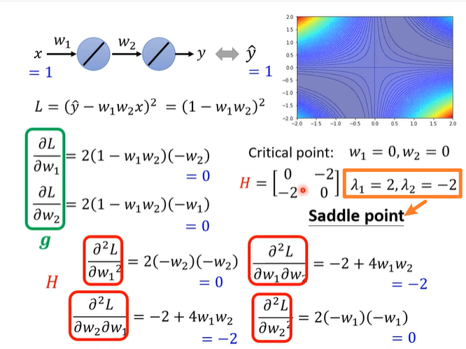

### 3.3 在鞍点进行参数更新

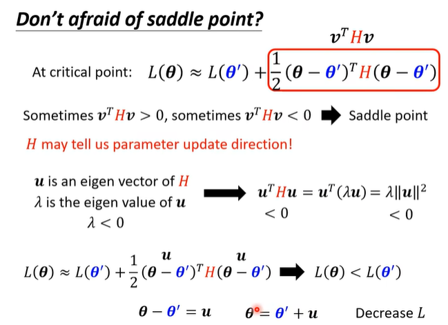

u是特征向量λ是其特征值，可以推导出θ和θ‘之间的关系，接着利用此关系进行参数更新

### 3.4 维度越高可以逃避critical point为0的情况

如下图中左边两幅图所示，在低维看： local minima （高维的一个截面），在高维看：saddle point。低维看觉得无路而走，高维看发现还有路，还可以下降。当模型有很多参数时，维数高，critical point 是 saddle point 的可能性远大于 local minima。因此，很多时候，遇到 critical point，我们以为到了 local minima，其实不然，换条路，loss 还可以继续下降。

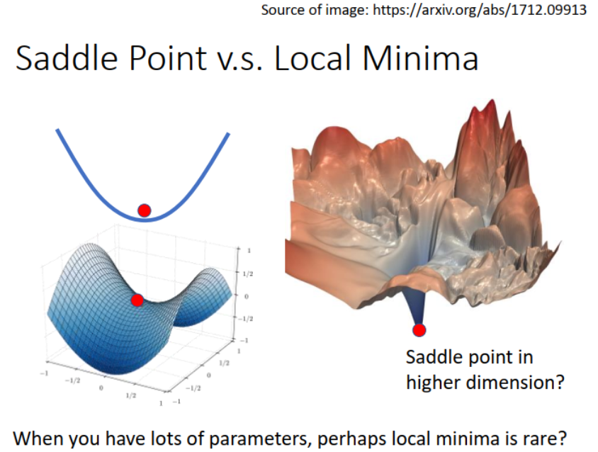

以下研究也表明，其确实维度越高可以逃避critical point为0的情况

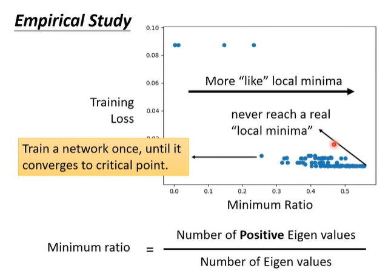

## 4. 批次（batch）与动量（momentum）

### 4.1 batch

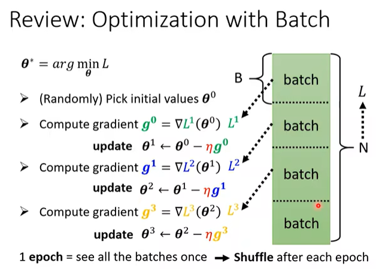

#### Small Batch v.s.Large Batch

- 由于并行计算，batch size 大训练速度快，一次性看得多，但也不能太大，否则显存会限制速度

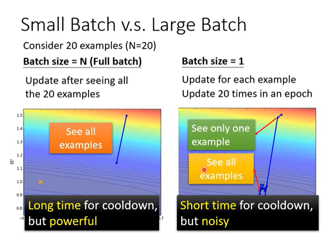

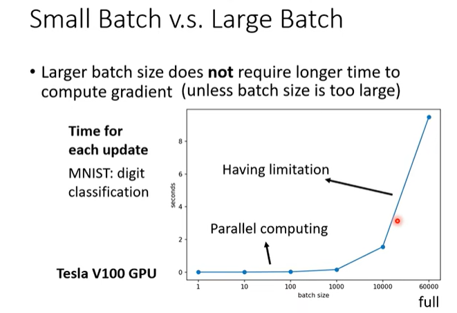

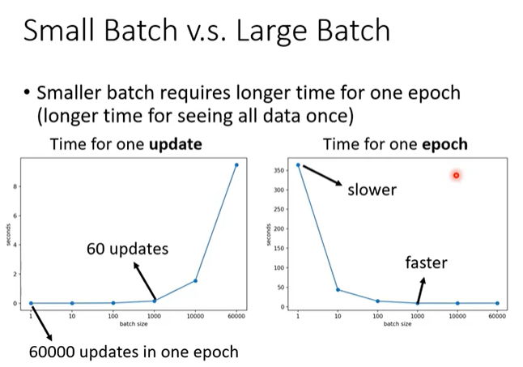

- batch size 小的noisy会帮助训练，效果可能会比大的batch size要好

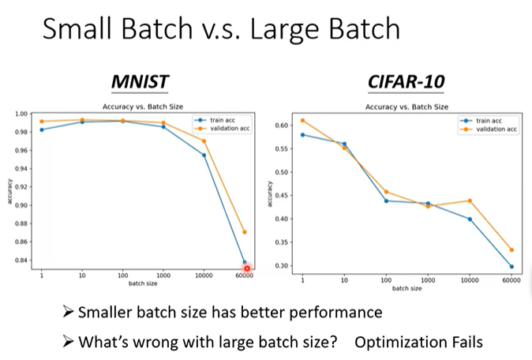

解释是说，不同batch 的loss不一样，可以跳过critical point。

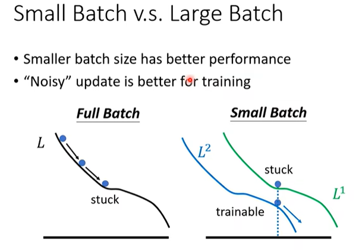

- 此外，small batch 在 testing set 上的表现更好

**一种解释是 small batch 的 local minima 容易是“盆地”形状，而 large batch 的 local minima 容易是“峡谷”形状**。如下图所示，当 testing loss 曲线较 training loss 曲线稍有偏移时，采用 small batch 训练得到的模型能够应对，loss 变化不大，而采用 large batch 训练得到的模型，loss 可能就一下子从谷值到峰值，波动很大。

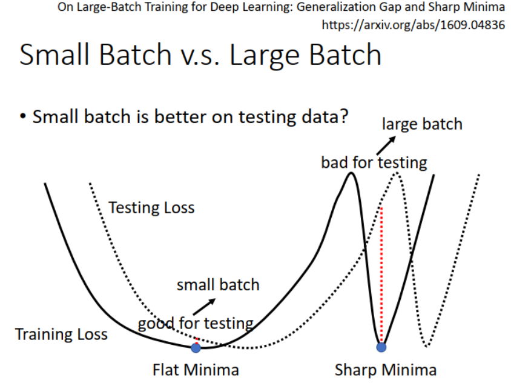

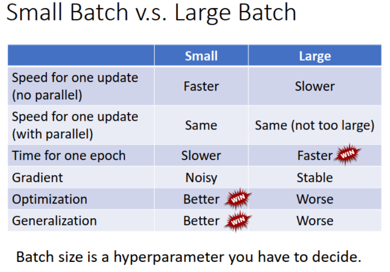

### 4.2 momentum

momentum 的思想来源于物理的动量，比如一个小球在斜坡上滚动，遇到小坑（类比：gradient 接近 0 的时候），不会立即停下，而是靠惯性继续前进，从而走出小坑。momentum 综合考虑前一次 update 的 movement 和本次 update 的 gradient。遇到 gradient 接近 0 时，可以凭借之前的动量继续前进，训练不会卡住。

应用 momentum，每一次参数的变化 ( movement ) 不仅与 gradient 有关，还与上一次的变化 ( movement of last step ) 有关，也就是与之前的变化有关。如下图所示：

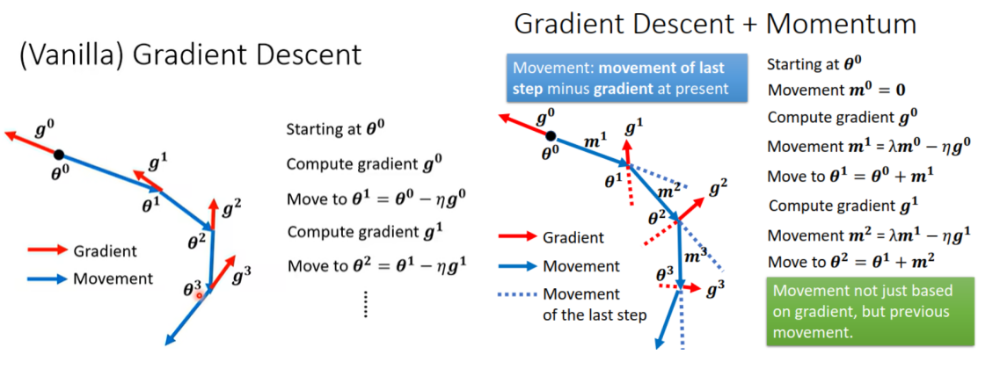

## 5. adaptive learning rate

训练卡住，loss 不下降，就是到了 critical point 吗？

不一定。可能此时 gradient 并不小。如下图中红色圆圈所示，loss 不再下降，然而 gradient 却一直在波动。

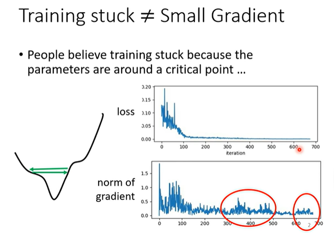

是什么原因？来看一个具体的例子。下图所示为有两个参数模型的 convex error surface，是理想的 error surface，存在 loss 最小值（图中打叉点所示）。参数 w（纵轴）的 loss 曲线陡峭，而参数 b （横轴）的 loss 曲线平缓。假设参数优化的起始点在下图 1 中黑点所示位置，如果 learning rate 设大一些，纵轴方向调整时，在“山谷两侧陡峭的崖壁”来回震荡，如下图 2 所示；如果 learning rate 设小一些，横轴方向调整时，在“平缓的盆地”进展缓慢，如下图 3 所示。可见一个 learning rate 难以满足不同参数的调整步子 ( step ) 要求。

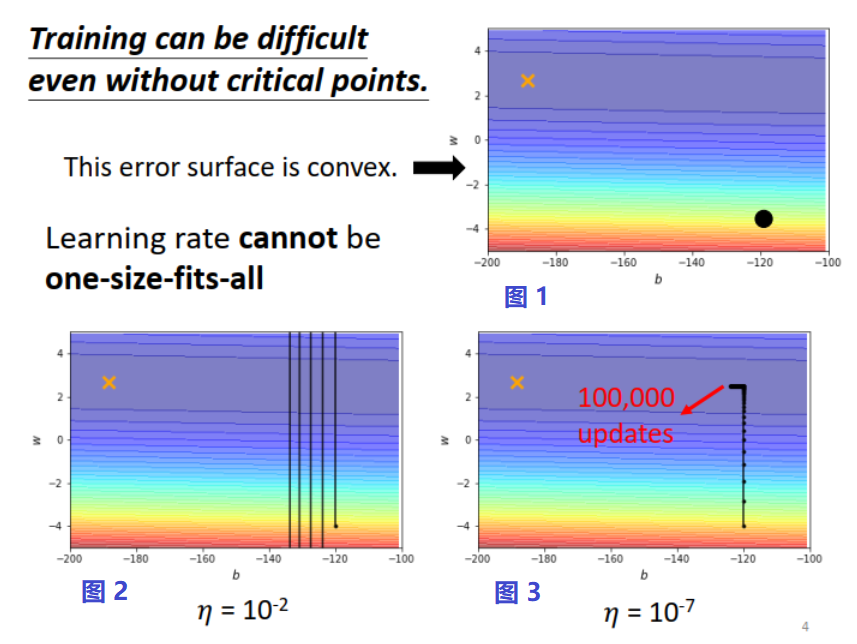

解决办法：引入 $\sigma^t_i$ ，与参数$θ_i$ 和更新次数t 都有关，让不同的参数有不同的 learning rate。以下是针对一个参数进行的分析，一个式子是一般的计算方法，第二个式子是解决方案

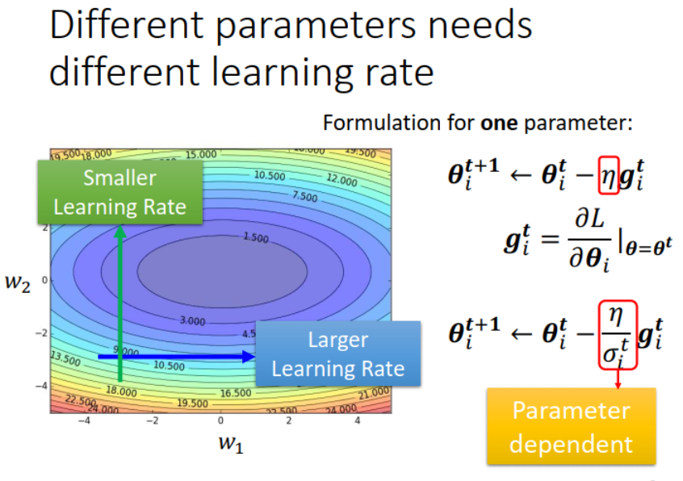

### 5.1 Adagrad

Adagrad： $\sigma^t_i$ 取本次和以前的 gradients 的 Root Mean square。如下图所示，某个参数 $\theta_1$ 的 gradient 小，loss 曲线平缓，那么  $\sigma^t_1$ 小，step 大；反之，某个参数 $\theta_2$的 gradient 大，loss 曲线陡峭，那么  $\sigma^t_2$ 大，step 小。

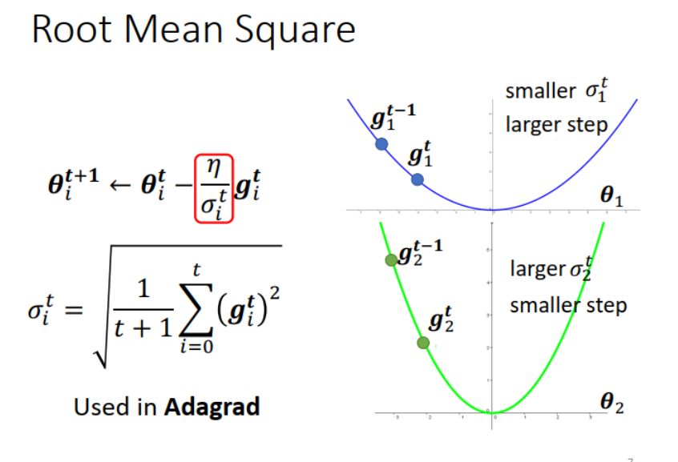

Adagrad 存在的问题： $\sigma^t_i$ 是 gradient 的累积平均，对 gradient 的变化反应不够快。如下图中的参数 $ω_1$，绿色箭头处 loss 曲线陡峭，gradient 大，需要 smaller step；而到了红色箭头处 loss 曲线平缓，gradient 小，要 larger step。怎么才能更快地应对 gradient 变化呢？

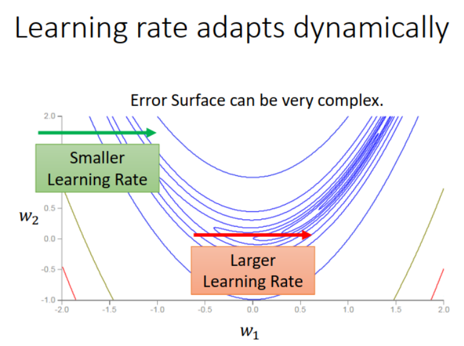

解决办法：引入 weight，加大本次 gradient 的权重。这就是 RMSProp。

### 5.2 RMSProp

RMSProp:  $\sigma^t_i$ 取本次和以前 gradients 的 weighted Root Mean Square。通过调整 α，可以决定当前 gradient 的影响力，从而对 gradient 的变化反应更快。例如遇到下图所示的 loss 曲线先平缓、再陡峭、又平缓的情况，如果用 Adagrad，因为计算的是本次和历史 gradients 的平均，反应慢，很容易在中间陡峭段因为 step 大“飞出去”。而用 RMSProp，可以给 α设置一个较小的值，从而使当前 gradient 的作用大，在陡峭段 $\sigma^t_i$ 会快速变大，从而调小 step。到了下一个平缓段， $\sigma^t_i$ 又会快速变小，从而调大 step。

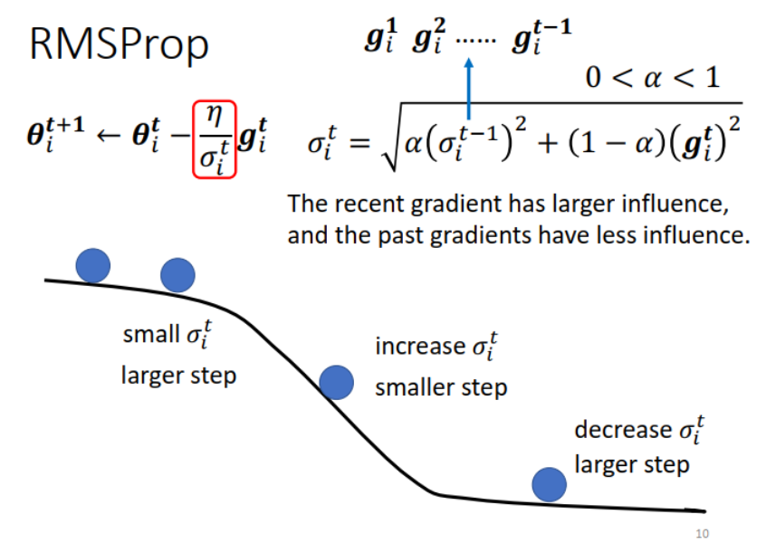

### 5.3 Adam

Adam：RMSProp+Momentum

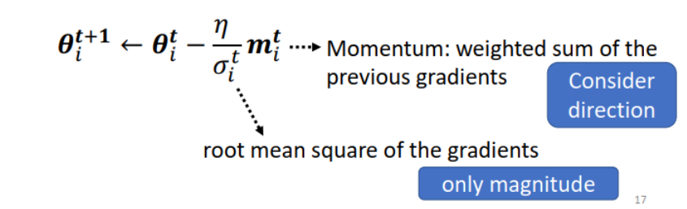

疑问：分子分母都是计算的累积 gradients，会不会抵消呢？

不会。momentum 是向量，既有大小、又有方向。RMSProp 是标量，只是计算大小。

### 5.4 Learning Rate Scheduling

前面例子的两参数模型，应用 Adagrad 之后，优化过程如下图所示，接近终点处为什么会在纵轴来回摆动呢？

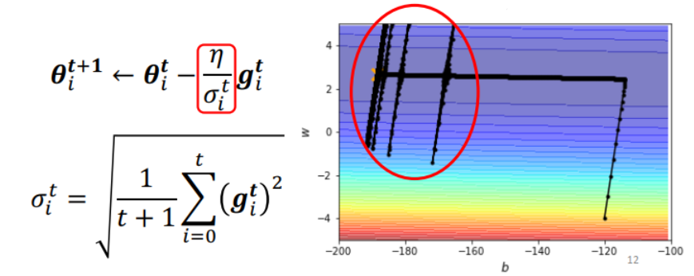

原因：此时，纵轴方向 ( $\omega$ ) 的 gradient 很小，经过一段时间累积平均，  $\sigma^t_\omega$ 就变得很小，于是 step 变大，  $\omega$这一步的变化就“飞出来”了，到纵轴方向 gradient 大的地方。同时由于 step 大，和前面介绍的 learning rate 大的情况一样，在“山谷两侧的崖壁”来回震荡。但是，过一段时间，$\sigma^t_\omega$ 也会逐渐变大，因此 step 变小，  $\omega$又会变化调整回到中心。

看来，应该让 learning rate 本身也变化，开始大一点，到训练后期（接近 loss 低值），就要小。这就是 Learning Rate Scheduling，如下图所示。应用这一方法后， $\omega$  的变化就不会“飞出”，而是顺利到达最优点。

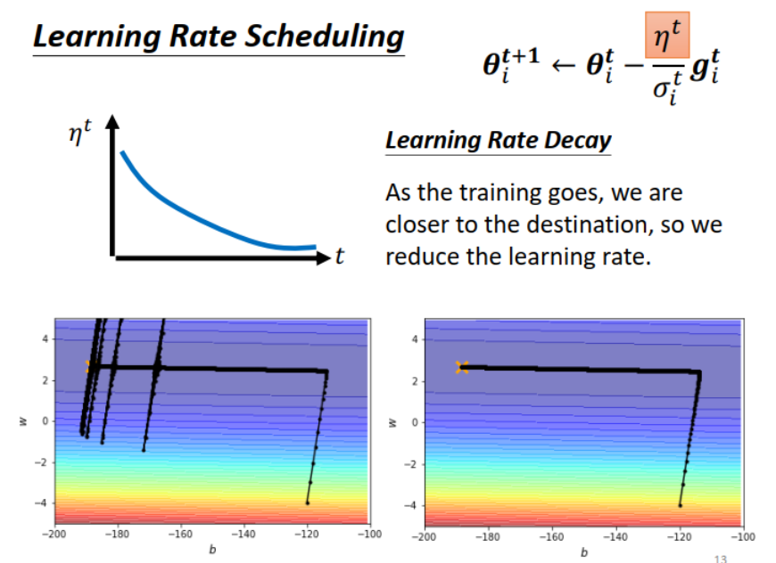

有两种 Learning Rate Scheduling:

- learning rate decay：learning rate 的变化： 大–>小

- warm up：learning rate 的变化：小–>大–>小。这个名字取得很有意思，好像 learning rate 也要热身，哈哈。warm up 是许多知名模型（例如 ResNet，Transformer）都会使用的一个训练技巧。为什么初始 learning rate 先不设大？一个解释是 $\sigma^t_i$是历史 gradients 的统计值，一开始时计算的次数少，可能并不准确，所以一开始步子不宜迈大，先小步探索。

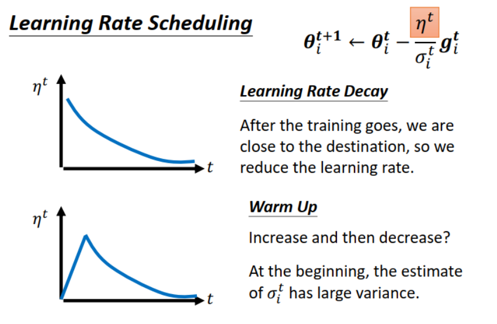

结合 2 和 3，综合应用 momentum 和 adaptive learning rate:

### 5.5 总结

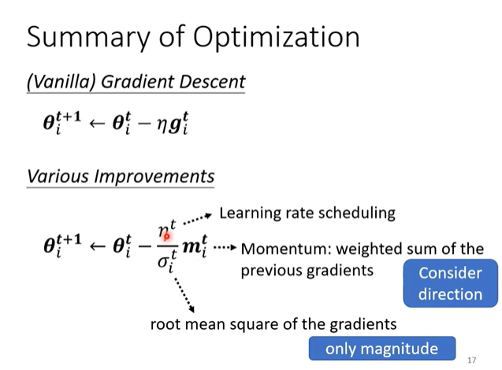

## 6. 改变 error surface

从分类问题说起：

如何做分类 ( classification ) ?

首先想到的方法是把类别用数字表示，例如，输出按类别表示为 1，2，3，……，这样转化为一个回归问题 ( regression ) 。

- 但是这样做有一个问题：不同类别并不一定有大小、顺序关系，比如颜色红、黄、蓝，如果按数字来定类别，就人为设置了相邻的两个类别更接近，这不符合事实，容易造成误判。

- 解决办法：使用 one-hot vector，如下图右上角所示，对应类别处值为 1 ，其余地方值为 0。这样，原来 1 个输出变成多个输出。在神经网络中的实现也简单，如下图所示，在输出部分增加几个线性单元即可。

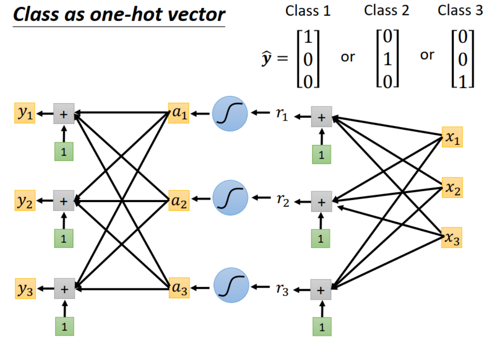

进一步地，因为 one-hot vector 的值都是 0 或者 1，用 softmax 把输出值限制到 [0,1] 之间，好和 one-hot vector 计算相似度。

- 对于两分类问题，用 sigmoid 与 softmax 等效。

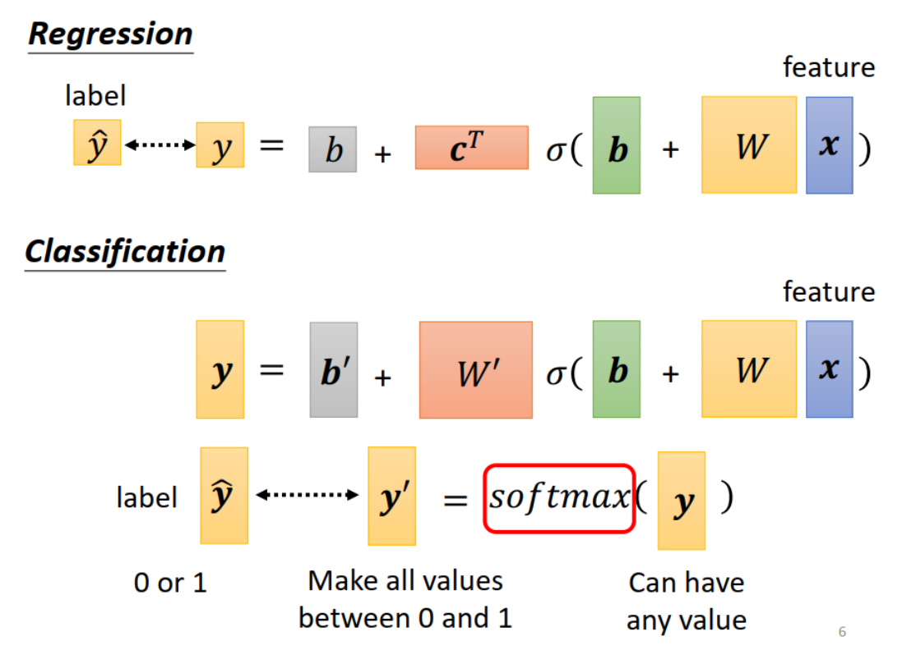

loss function 还是和 regression 一样，用 MSE 吗？

不是，用 cross entropy 比 MSE 更好。why?

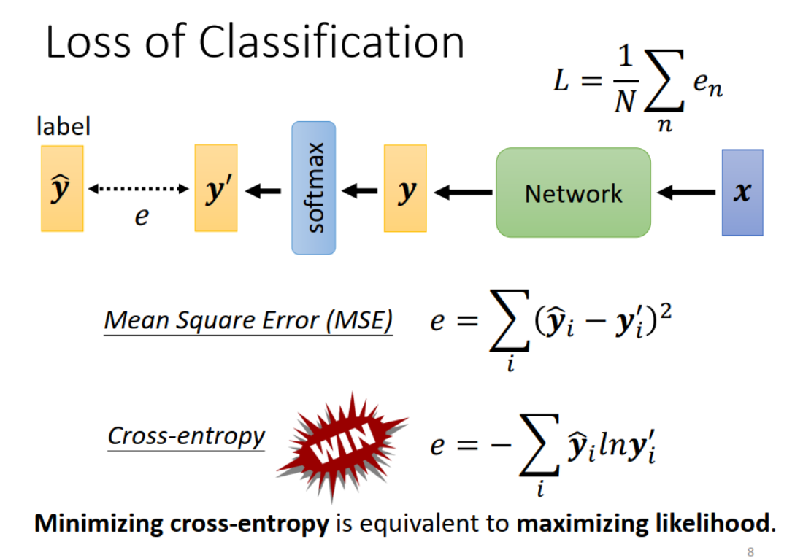

原因：error surface。用一个直观例子解释，假设有一个三分类的模型，其中 y1 和 y2 这两类起主要作用，由 y1和 y2 绘制（是参数吗？）的 error surface 如下图所示。可以看到，不论用 MSE 还是 Cross Entropy，都是左上角区域 loss 大，右下角区域 loss 小，假设训练开始时位于图中左上角蓝色点所示位置。如果 loss function 用 MSE，因为这一区域 loss 变化平缓，训练容易卡住。如果 loss function 用 Cross Entropy，因为这一区域 loss 变化陡峭，可以变化到 loss 更低的点。

这也就是说，改变 loss function，可以改变 error surface（平缓或是陡峭），因此改变训练的难易程度。

## 7. Batch Normalization

Batch Normalization 是另一种把error surface弄平缓的方式。如下左图到右图的变化

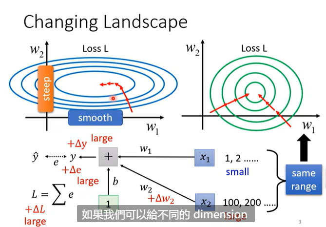

### 7.1 Feature normalization

假设x1到xr ,是我们所有的训练资料的 feature vector。

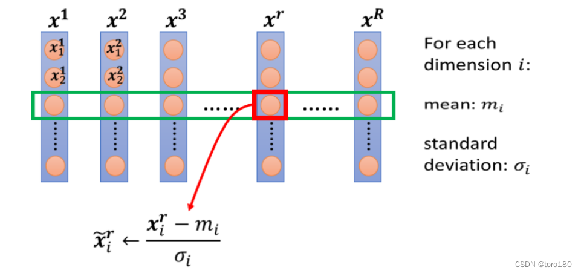

这里取的是不同训练资料中同一维度的数据归一化。
好处：

- 做完 normalize 以后啊,这个 dimension 上面的数值就会平均是 0,然后它的 variance就会是 1,所以这一排数值的分布就都会在 0 上下
- 对每一个 dimension都做一样的 normalization,就会发现所有 feature 不同 dimension 的数值都在 0 上下,那你可能就可以製造一个,比较好的 error surface
- 一般来说，特征标准化可以加快梯度下降法的收敛速度

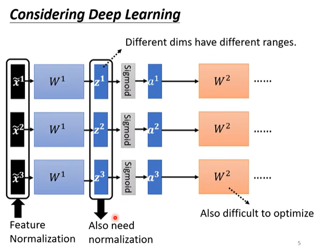

- sigmoid 对z做normalization会合适点，因为Sigmoid在0附近斜率比较大。实际操作上normalization放在激活函数前或者后差别不大

### 7.2 Batch normalization

考虑到hidden layer中的输出同样有不同的范围，那么是不是对hidden layer的输出也进行归一化会有好处呢？

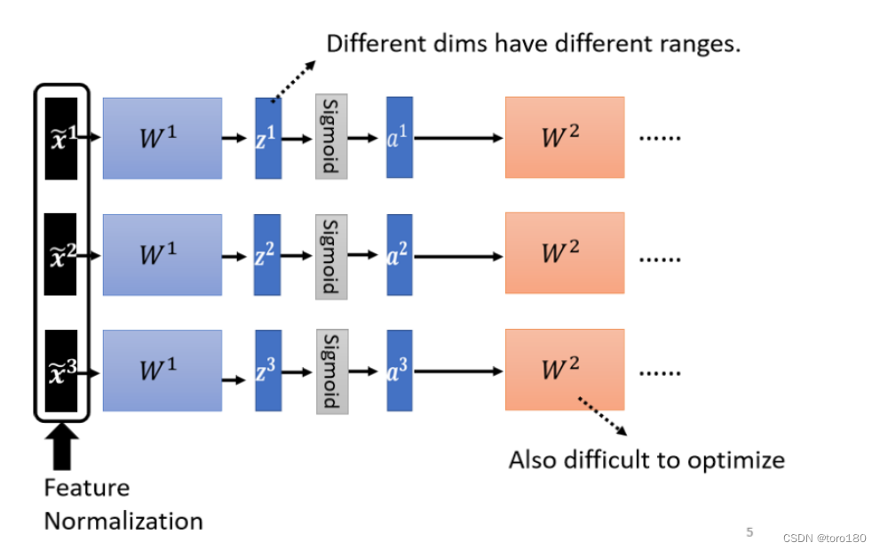

所以就有了Batch normalization。**取一个batch中的中间层数据计算均值和方差。**（一般如果激活函数是sigmoid的话，在激活函数之前做归一化有利于梯度下降，因为sigmoid在0附近斜率大）

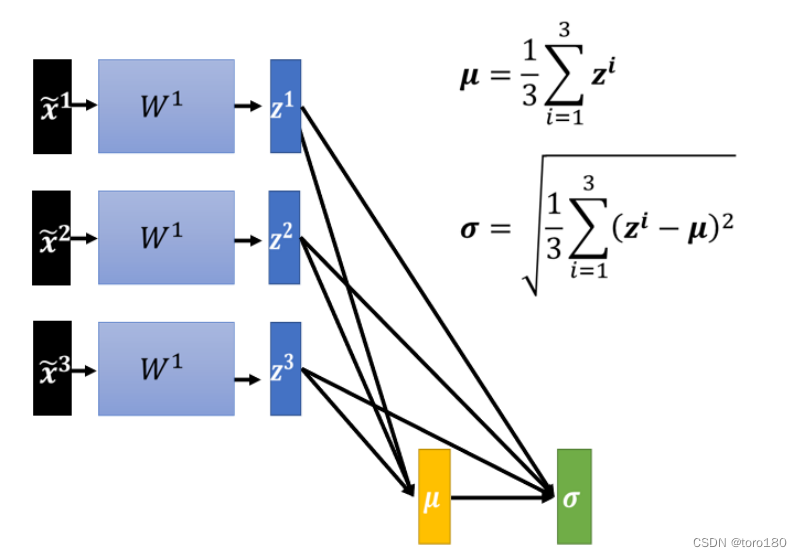

在实作的时候,你不会让这一个 network 考虑整个 training data 裡面的所有 example,你只会考虑一个batch 裡面的 example,举例来说,你 batch 设 64,那你这个巨大的 network,就是把 64 笔 data 读进去,算这 64 笔 data 的 ,算这 64 笔 data 的 ,对这 64 笔 data 都去做 normalization。
因為我们在实作的时候,我们只对一个 batch 裡面的 data,做 normalization,所以这招叫做 Batch Normalization。

另外在实际上操作上，Batch normalization做完后会再乘上γ和β俩个参数，这俩个参数是可学习的，γ初始是全部是1的向量，而β是0的向量，目的是当它经找到一個比較好的error surface时再把γ跟β慢慢地加进去

### 7.3 Batch normalization Testing

不能等一批batch进来后才来做运算，解决方法是在训练阶段去计算测试时所需要的$\bar \mu$和$\bar \sigma$

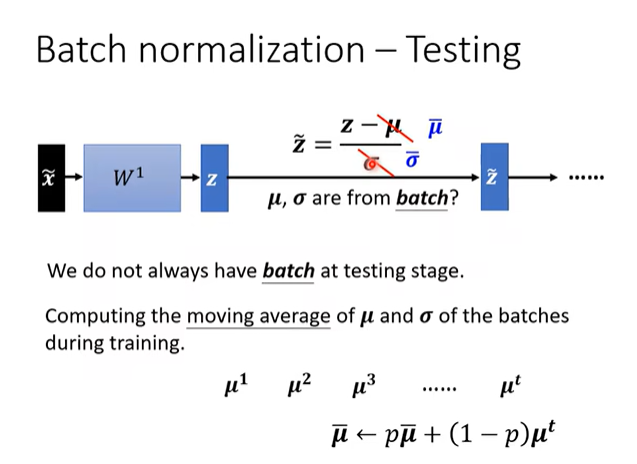
