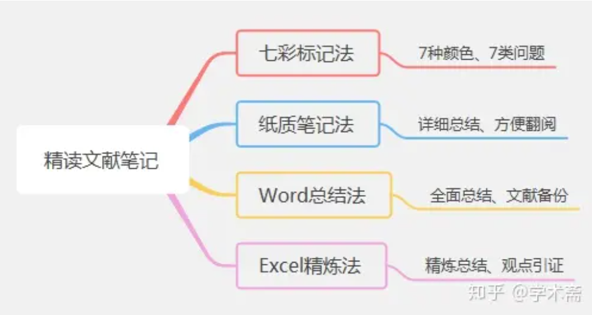
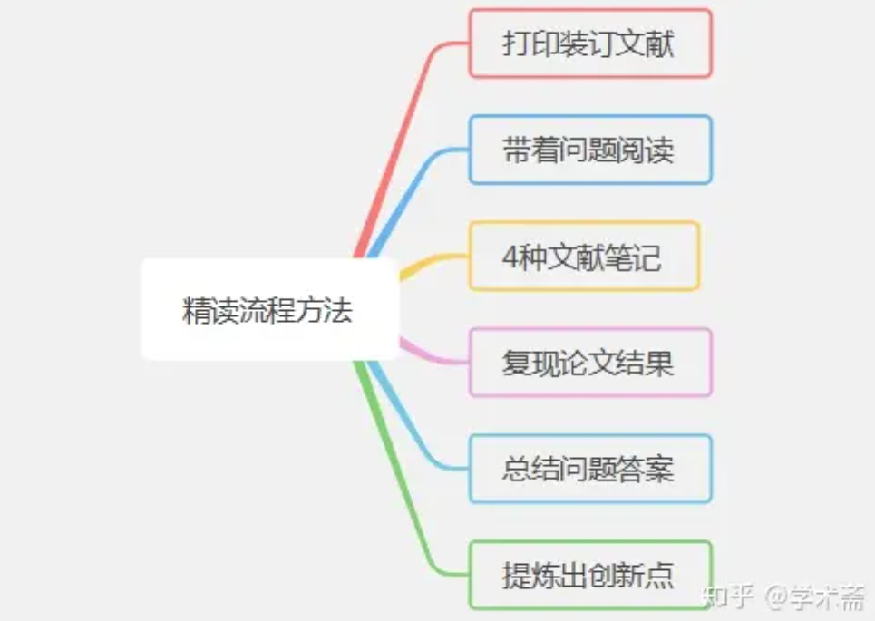
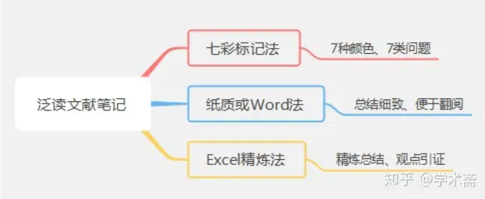
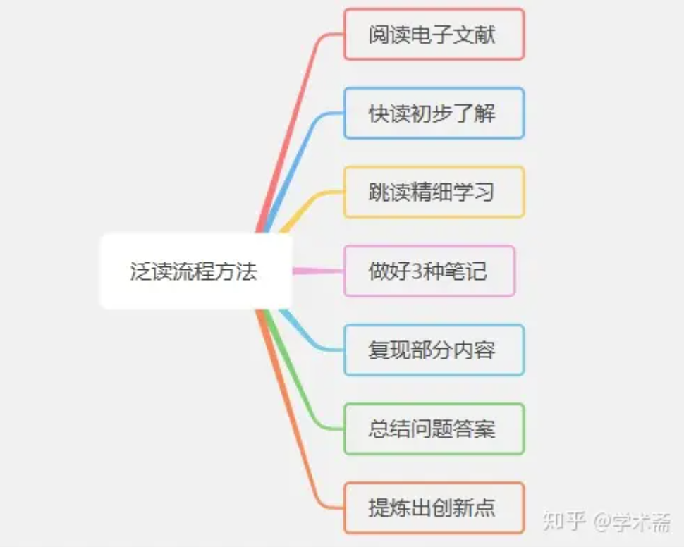

# 精读文献方法

## 精读文献目标：

- 能利用一句话准确概况出论文的创新点、并分析指出论文的有点和不足。

- 学习掌握论文所提研究方法/模型/实验设计等核心内容，内化吸收、为己所用。

&nbsp;

## 精读文献时需要明确下列问题：

- 研究背景：论文研究领域/背景是什么？

- 研究目的：论文解决了什么问题？一句话概括创新点？

- 研究模型：场景模型？/数学模型/实验设计等？

- 研究方法适用范围：论文假设条件？/忽略因素？

- 研究结果：结果/结论？/理论意义及实用价值？

- 主动思考：有哪些值得学习借鉴的地方？存在哪些不足或为解决的问题？/进一步可展望的地方？/为什么这篇论文能发表？且能发表在该期刊上？

&nbsp;

## 精读文献笔记做法：

&nbsp;

## 精读文献流程：

&nbsp;

# 泛读文献方法

## 泛读文献意义/目标：

泛读文献与自身研究相关，通过泛读帮助我们了解现有研究的进展、新方法/新模型/新实验等，并获取一定的知识学习，据此，有目的性的丰富研究方法/思路。

&nbsp;

## 泛读文献方法：

- 带着问题，通过快读初步了解文献研究背景、目的、方法、结果结论；

- 跳读到对研究有价值的地方、详细学习研究、可选择性复现论文内容（研究方法/算法/模型等）；

- 最后做好学习笔记，及时总结。

&nbsp;

## 泛读文献笔记做法：

&nbsp;

## 泛读文献流程：

&nbsp;

# 泛读与精读的区别：

精度文献与研究极其相关、往往需要反复阅读、仔细拆解学习、甚至复现论文结果数据，即通过吃透文献拓展我们对研究问题的认知及研究方法。

泛读文献与研究相关，需要我们大体了解研究背景、研究方法等，如果确实需要，可以定位学习并复现研究模型方法。

&nbsp;

# 论文阅读过程：

1.title；2.abstract；3.introduction；4.method；5.experiment；6.conclusion

Pass1(跳读)：1、2、*4(看一些关键的图和表)、*5(看一些关键的图和表)、6

Pass2(泛读)：1、2、3、4、5、6——不需要注意很多细节，尤其是一些公式和证明，但需要搞清楚重要的图和表都在做什么 ，作者的方法和别人的方法是怎么对比的、差距有多大，*圈出一些重要的引用文献。

Pass3(精读)：1、2、3、4、5、6——了解论文的整个细节 
