# Transformer

> - https://www.bilibili.com/video/BV1Wv411h7kN?p=49
> - https://blog.csdn.net/iwill323/article/details/127424895

## 1. seq2seq

### 1.1 seq2seq的含义

Seq2seq 模型输入一个序列，机器输出另一个序列，输出长度由机器决定。例子有：文本翻译：文本至文本；语音识别：语音至文本；语音合成：文本至语音；聊天机器人：语音至语音。

### 1.2 seq2seq的应用

大多数自然语言处理（NLP问题）可以看作是question answering的问题，可以通过seq2seq模型解决，但在某个特定的语音或文本处理任务上，它的表现不如专门为任务设计的模型好。

- 应用于文法剖析Syntactic Parsing

产生文法剖析树parsing tree，是一个树状的结构，可以硬是把他看作是一个Sequence。NP名词，ADJV形容词，VP动词

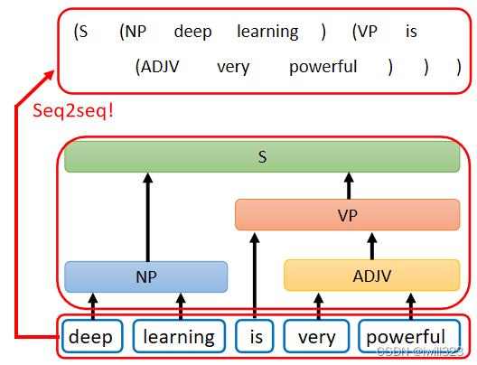

- multi-label classification多标签分类问题

Multi-label classification：一个输入可以输出多个类别。区分于multi-class classfication：一个输入只输出一个类别。Multi-label Classification 任务中输出 labels 个数是不确定的，因此可以应用 Seq2seq 模型。

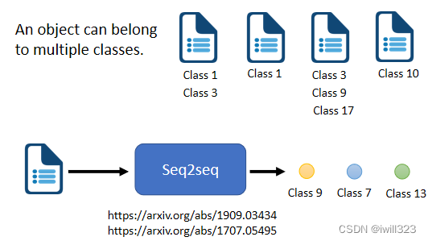

- Object Detection

object detection就是给机器一张图片，然后它把图片裡面的物件框出来，可以用seq2seq硬做

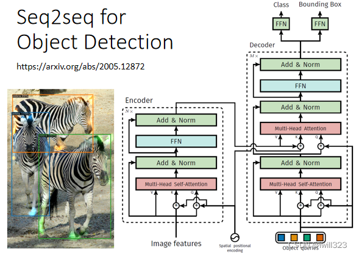

### 1.3 seq2seq的实现

seq2seq由encoder（编码器）和decoder（解码器）组成 。这两部分可以分别使用RNN或transformer实现。

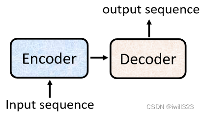

encoder：将输入（文字、语音、视频等）编码为单个向量，这个向量可以看成是全部输入的抽象表示。

decoder**：**接受encoder输出的向量，逐步解码，一次输出一个结果，每次输出会影响下一次的输出，开头加入<BOS>表示开始解码，<EOS>表示输出结束。

## 2. encoder的实现

Encoder要做的事情就是给一排向量，输出另外一排长度相同的向量。本节课以 Self-attention 为例讲解，但其实 Encoder 的单元用 RNN 或 CNN 也可以。

**在 Transformer 的 Encoder 部分，有 n 个 Block，每一个block又包括self-attention和fully connect等网络结构。**

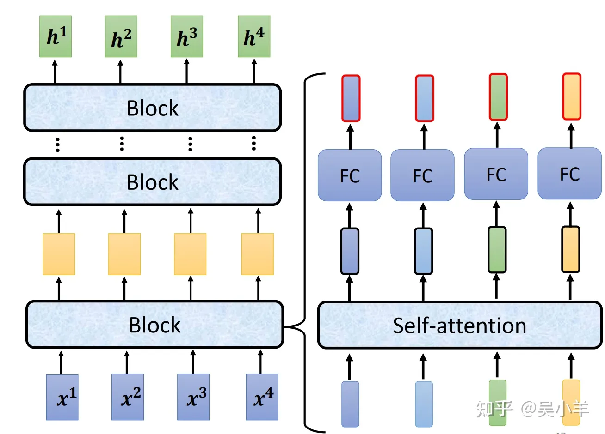

### 2.1 残差连接和layer normalization

transformer加入了一个设计，把self-attention输出的向量a加上它原来的输入b，得到输出a+b，这个架构叫做残差连接residual connection。然后再对其进行normalization，送到完全连接神经网络，再经过残差连接和normalization后得到输出。

residual connection将self-attention输入输出相加，所以输入输出向量的维度应保持一致，transformer 论文中把每一层输出 vector 的维度都设为 512。标准化是layer norm而不是batch norm。batch normalization：对不同的样本，不同feature的相同维度去计算平均值和标准差。layer normalization：对同一个样本的不同维度去计算平均值和标准差。

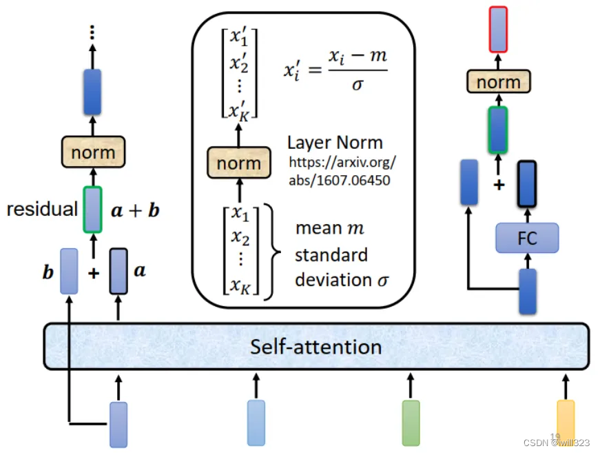

### 2.2 为什么用 Layer Normalization 而不是 Batch Normalization

**Batch Normalization 是对一个 batch 的 sequences操作。对于 self-attention， 不同的输入 sequences 长度不同。当输入 sequence 长度变化大时，不同 batch 求得的均值方差抖动大。**此外，如果测试时遇到一个很长的 sequence（超过训练集中的任何 sequence 长度），使用训练时得到的均值方差可能效果不好。而 Layer Normalization 是在每个样本上做，不受 sequence 长度变化的影响，所以这里用的是 Layer Normalization。

BERT 使用的是和 Transformer encoder 相同的网络结构。self-attention给input加上positional encoding，加入位置的资讯，Multi-Head Attention是self-attention的block，Feed Forward单元是Fully Connected Layer。

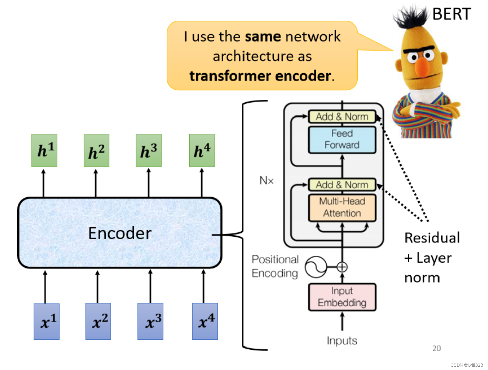


### 2.3 transformer的encoder的改进

上面是按照原始的论文讲。原始的transformer 的架构并不是一个最optimal的设计，可以改变layer norm的使用位置，或者采用power normalization.以下(a)图是原始的

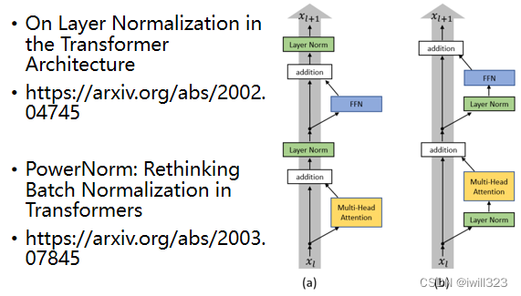

## 3. decoder的实现

decoder主要有两种：AT（autoregressive）与NAT（non-autoregressive），区别在于输入的不同

### 3.1 autoregressive（AT）

**Autoregressive 指前一时刻的输出，作为下一时刻的输入。**Decoder 看到 Encoder 的输入，看到之前自己的输出，决定接下来输出的一个向量

以语音辨识为例，每一个Token用one-hot向量的方式表示，起始时要输入一个特别的 Token（图中的“Start”，Begin Of Sentence，缩写是 BOS），告诉 decoder一个新的sequence 开始了，再加上encoder输出的向量，经过解码器和softmax之后得到一个向量，这个向量和已知字体库的大小是一样的，分数最高的就是输出的字体。再把自己的输出当做下一个的输入。


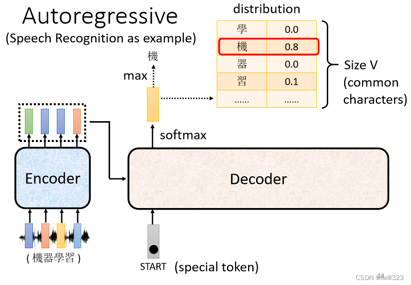

现在Decoder的输入有 BEGIN 和“机”，根据这两个输入，输出一个蓝色的向量，根据这个蓝色的向量给决定第二个输出，再作为输入，继续输出后续的文字，以此类推……

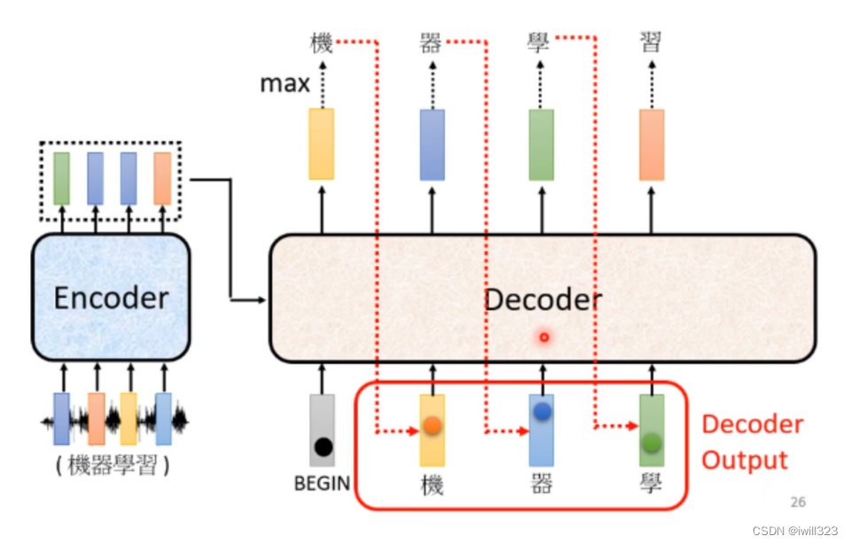

### 3.2 什麼时候应该停下来

Decoder 必须自己决定输出的长度。解决方式：在已知的字体库中加入一个结束的标志END，输入最后一个字符时，输出 “END”（它的机率必须要是最大的），此时机器就知道输出 sequence 完成了

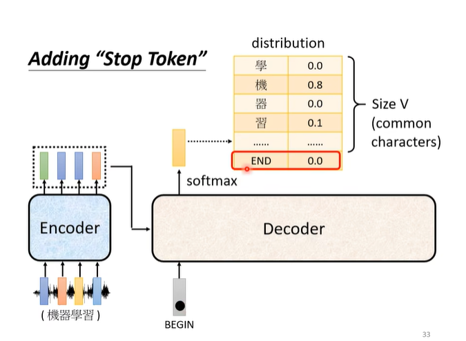

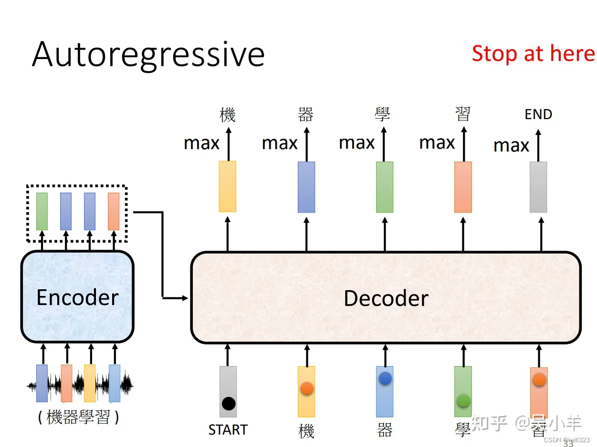

### 3.3 NAT

**NAT不是依次产生，而是一次吃的是一整排的 BEGIN 的 Token，把整个句子一次性都產生出来。**

问题：如何确定启动向量（BOS）的个数？

- **方法一是另外训练一个 Classifier，吃 Encoder 的 Output，预测输出长度**
- **方法二是放很多个BOS，输出很长的序列，看看什麼地方输出 END，在end之后的字体就忽略掉。**

好处

- 并行化。AT 一次输出一个向量（因为上一个输出又作为下一个输入），**无法并行处理；NAT不管句子的长度如何，一个步骤就產生出完整的句子，比AT更加快**
- 输出长度可控，比AT更加稳定。比如在语音合成 (TTS) 任务中，按前面提到的方法一，把 encoder 的输出送入一个 Classifier，预测 decoder 输出 sequence 长度。通过改变这个 Classifier 预测的长度，可以调整生成语音的语速。例如，设置输出 sequence 长度 x2，语速就可以慢一倍。

NAT的效果比AT差，因为multi-modality（多通道）https://youtu.be/jvyKmU4OM3c

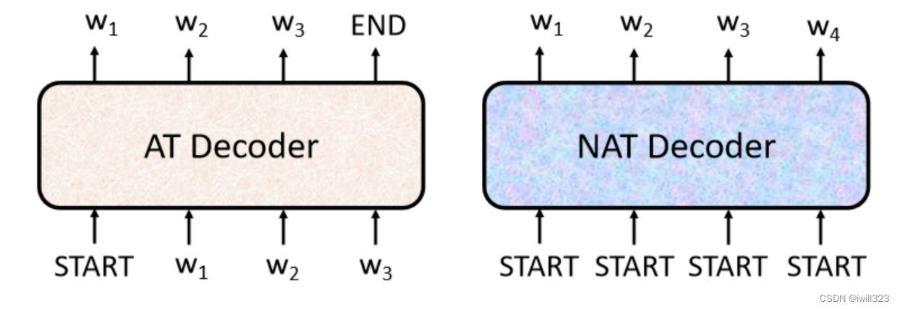

### 3.4 decoder 的内部结构

除了中间的部分，Encoder 跟 Decoder并没有那麼大的差别，最后我们可能会再做一个 Softmax，使得它的输出变成一个概率分布。

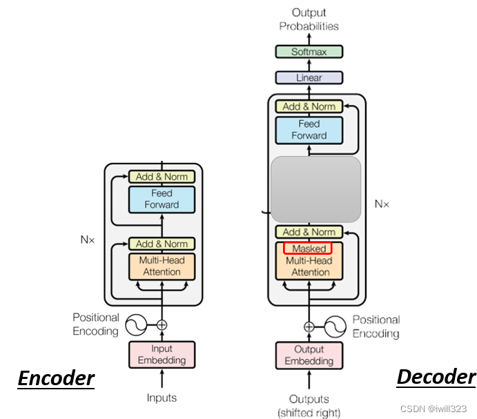

### 3.5 masked self-attention

encoder是采用self-attention，而decoder是采用masked self-attention。

self-attention中的b1、b2、b3、b4分别都接受a1，a2，a3，a4所有的资讯；**而masked self-attention中的b1只接受a1的资讯，b2只接受a1、a2的资讯，b3只接受a1、a2、a3的资讯，b4接受a1，a2，a3，a4的资讯**。所以在decoder里面使用masked self-attention的原因是向量一个接一个输入，输出是一个一个產生的，所以每个只能考虑它左边的东西，没有办法考虑它右边的东西


左图是self-attention，右图是masked self-attention。

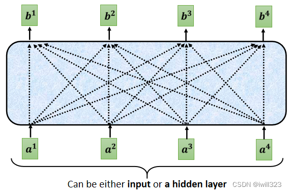

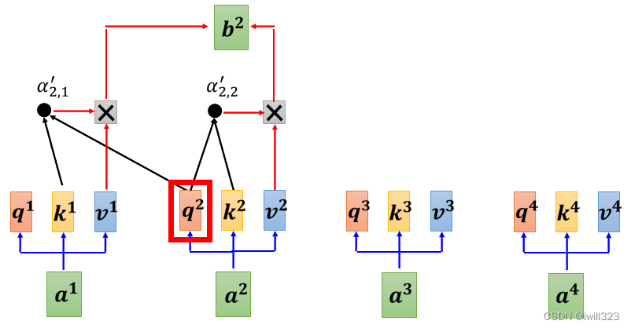

### 3.6 Encoder-Decoder之间的信息传递：cross attention

下图中红色方框部分，**计算的是 encoder 的输出与当前向量的 cross attention。**有**两个输入来自Encoder（Encoder 提供两个箭头）， Decoder 提供了一个箭头**

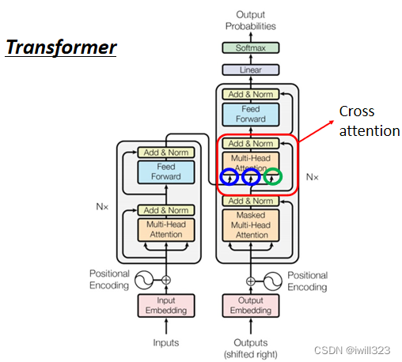

具体操作为：用 decoder 中 self attention 层的输出向量生成q，与由 encoder 最后一层输出 sequence （a1，a2，a3）产生的k做运算，生成的α可能会做 Softmax，所以写成α' ，α‘向量和v向量做加权求和得到v，v当做下一个fc的输入，做接下来的任务
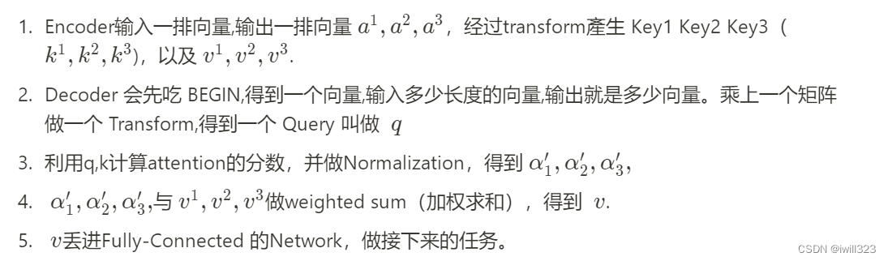

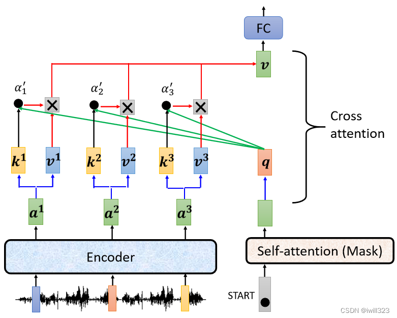

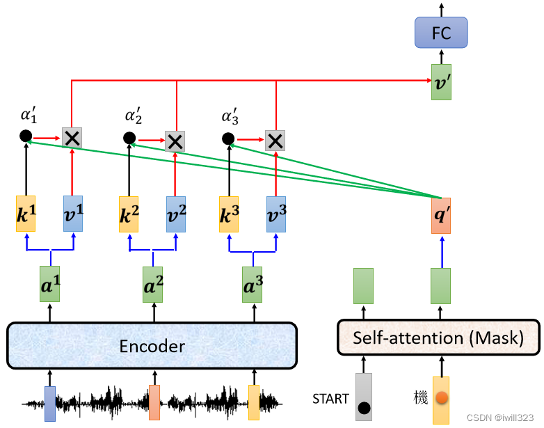

早期 Seq2seq 模型的 encoder 和 decoder 是用 RNN ，attention 用在 cross attention 单元。Transformer 架构干脆把 encoder 和 decoder 也全部用 attention 来做 (Self-attention)，正如论文标题所言 “Attention is all you need”。本来 decoder 只能利用 encoder RNN 最后一个时刻的 hidden state，encoder用了 cross attention 之后，之前时刻的 hidden state 也可以看，哪个时刻的 hidden state 对当前 decoder 输出最相关 (attention)，重点看这个 hidden state，这样模型的性能更好。

- cross attention的输入

decoder 有很多层 self-attention，每一层 self-attention 的输出都是与 encoder 最后的输出 sequence 做 cross attention 吗？可以有不同的设计吗？Transformer 论文中是这样设计，但是也可以用不同的设计，比如Decoder可以看Encoder中的许多层而不一定只是最后一层。

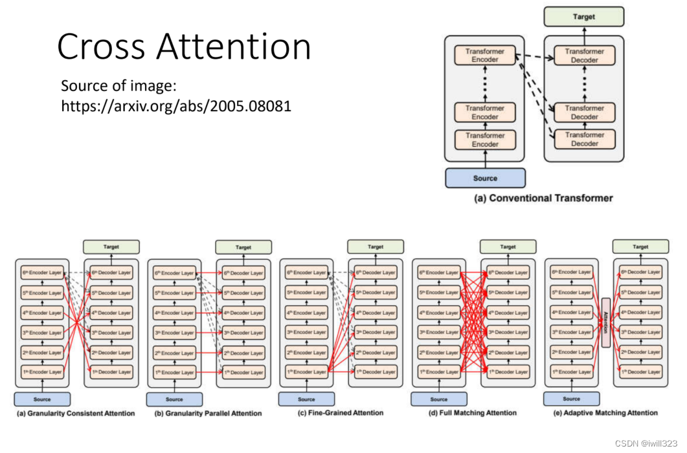


## 4. 训练

> 4.3-4.5为seq2seq模型的训练TIPS

### 4.1 Training Process

decoder 的输出是一个概率分布，label 是 one-hot vector，优化的目标就是使 label 与 decoder output 之间的 cross entropy 最小。中文字假设有四千个，每一次Decoder 在產生一个中文字的时候，就是做有四千个类别的分类的问题。
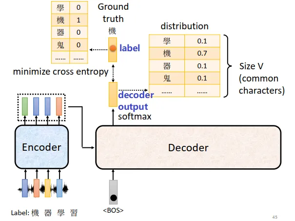

在训练的时候，每一个输出跟它对应的正确答案都有一个 Cross Entropy，我们要希望所有的 Cross Entropy 的总和最小，所以这边做了四次分类的问题。希望这些分类的问题总合 Cross Entropy 越小越好。还要输出END 这个符号，它和END的one-hot vector也有一个Cross Entropy，要包含在内。

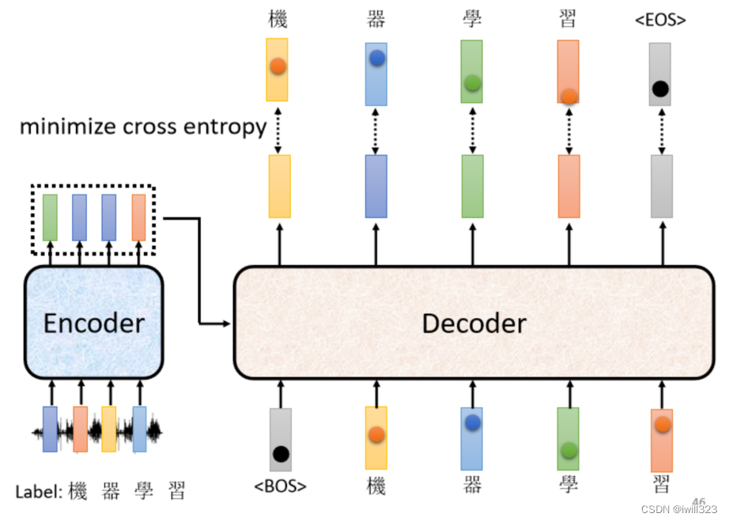

decoder 在训练的输入的时候给它正确的答案，具体如4.2 节

### 4.2 Teacher Forcing

在训练的时候，**decoder 输入用的是正确答案 ground truth，而不是自己产生的答案，这件事情叫做 Teacher Forcing**

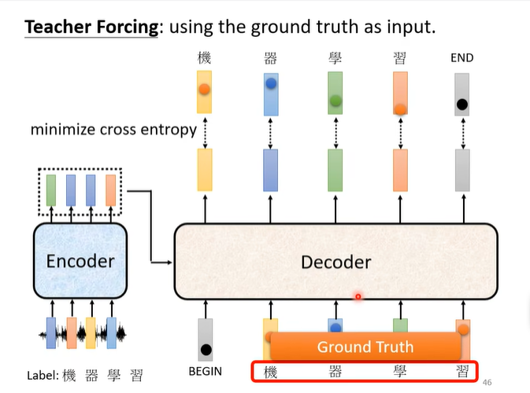

### 4.3 Copy Mechanism

**有时候不需要对输入做改动，比如翻译人名地名，聊天机器人(chat-bot)，摘要 (summarization) 等，可以直接复制一部分输入内容作为输出**

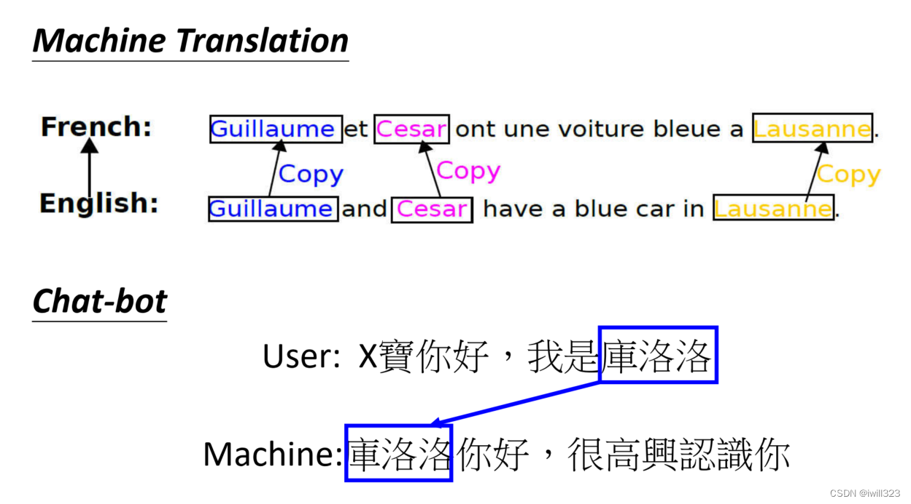

库洛洛对机器来说一定会是一个非常怪异的词汇，在训练资料裡面可能一次也没有出现过，所以它不太可能正确地產生这段词汇出来，也没有必要创造库洛洛这个词汇。假设机器在学的时候，它学到的是看到输入的时候说我是某某某，就直接把某某某复製出来说某某某你好，这样子机器的训练显然会比较容易，有可能得到正确的结果，所以复製对於对话来说，可能是一个需要的能力

在做摘要的时候，可能更需要 Copy 这样子的技能。训练一个模型,然后这个模型去读一篇文章,然后產生这篇文章的摘要。对摘要这个任务而言，从文章裡面直接复製一些资讯出来,可能是一个很关键的能力

具体的方法：Pointer Network , copy network


### 4.4 Guided Attention

在处理语音识别 (speech recognition) 或语音合成 (TTS)等任务时，不希望漏掉其中的任何一段内容，Guided Attention 正是要满足这个要求。而 chat-bot, summary 一类的应用在这方面的要求就宽松得多。

**Guided Attention 是让 attention 的计算按照一定顺序来进行。比如在做语音合成时，attention 的计算应该从左向右推进，机器应该先看最左边输入的词汇產生声音，再看中间的词汇產生声音，再看右边的词汇產生声音，**如下图中前三幅图所示。如果 attention 的计算时顺序错乱，如下图中后三幅图所示，那就说明出了错误。具体方法：Monotonic Attention, Location-aware attention。


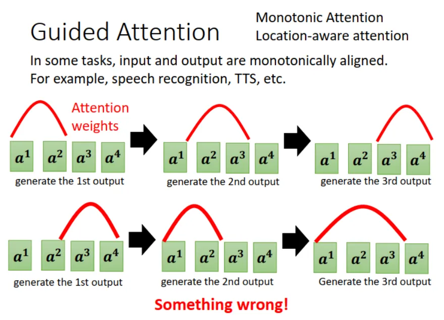

### 4.5 beam search（集束搜索）

假设输出词汇库只有 A, B 两个词汇。decoder 每次输出一个变量，每一次都选择最大概率的作为输出，如下图中红色路径所示，这就是贪心算法 Greedy Decoding。如果我们从整个 sequence 的角度考虑，可能第一次不选最大概率，后面的输出概率（把握）都很大，整体更佳，如下图中绿色路径所示。
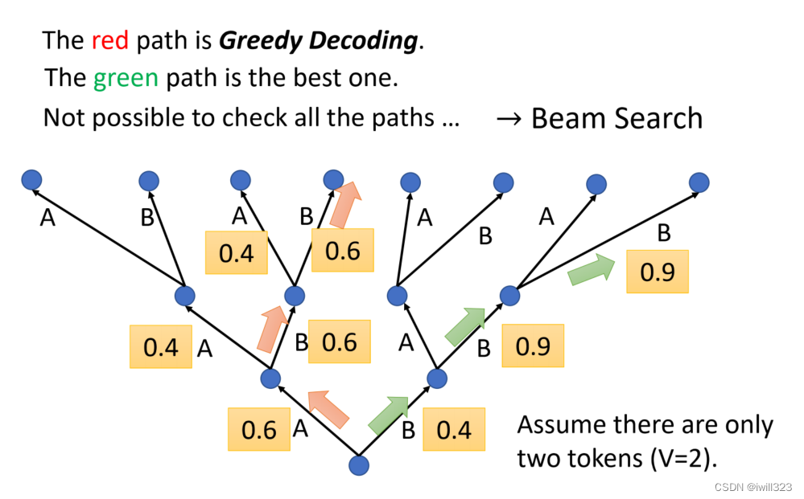

怎么找到最好的路径（图中绿色路径）？**一个优化方法就是 Beam Search，比如每次存前两个概率大的输出，下一步把这两种输出各走一遍，依此类推，一直到最后。**

但是，用 Beam Search 找到分数最高的路径，就一定是最好的吗？比如下图所示文本生成的例子，给机器一则新闻或者是一个故事的前半部，机器发挥它的想像创造力，把后半部写完。使用 Beam Search，后面一直在重复同一个句子。而 Pure Sampling 生成的文本至少看起来还正常。

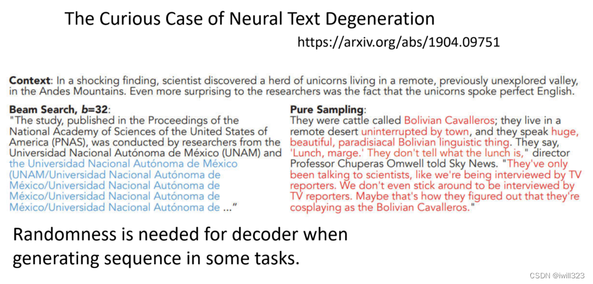

**束搜索适用于答案比较明确的问题，例如语音辨识等，不适用于需要机器有创造性的问题，例如根据前文编写故事、语音合成。**对于有些创造型任务，decoder 是需要一些随机性 (randomness) ，加入noise之后结果更好。对于语言合成或文本生成而言，decoder 用 Beam Search 找到的最好结果，不见得是人类认为的最好结果（不自然）。没加噪时，decoder 产生的声音就像机关枪一样；加噪（加入随机性）之后，产生的声音就接近人声。正如西谚所言："Accept that nothing is perfect. True beauty lies in the cracks of imperfection."

### 4.6 评测标准Optimizing Evaluation Metrics: BLEU score

训练时对每一个生成的token进行优化，使用的指标是交叉熵。**而评估模型用的是 BLEU score，產生一个完整的句子以后跟正确的答案一整句做比较，**如下图所示。因此，validation 挑选模型时也用 BLEU score 作为衡量标准。


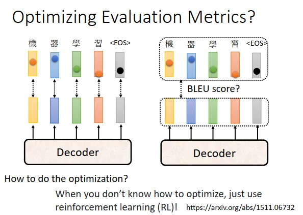

Minimize Cross Entropy真的可以 Maximize BLEU Score 吗？不一定，因為它们可能有一点点的关联，但它们又没有那麼直接相关，根本就是两个不同的数值，所以我们 Minimize Cross Entropy不见得可以让 BLEU Score 比较大

**train 直接就用 BLEU score 做 criterion 岂不更好？ 问题就在于BLEU score 没办法微分，不知道要怎么做 gradient descent。**训练之所以採用 Cross Entropy，而且是每一个中文的字分开来算，就是因為这样我们才有办法处理。实在要做，秘诀：”When you don’t know how to optimize, just use reinforcement learning(RL).” 遇到在 optimization 无法解决的问题，用 RL “硬 train 一发”。遇到你无法 Optimize 的 Loss Function，把它当做是 RL 的 Reward，把你的 Decoder 当做是 Agent，它当作是Reinforcement Learning 的问题硬做

### 4.7 Scheduled Sampling

训练时 Decoder 看的都是正确的输入值（Ground Truth），测试时看到的是自己的输出，这个不一致的现象叫做Exposure Bias。

测试时如果Decoder看到自己產生出来的错误的输入，再被 Decoder 自己吃进去，可能造成 Error Propagation，有一个输出有错误，可能导致后面都出错。

解决办法：**训练时 decoder 加入一些错误的输入，让机器“见识” 错误的情况，这就是 Scheduled Sampling。**

问题：会损害平行化的能力。


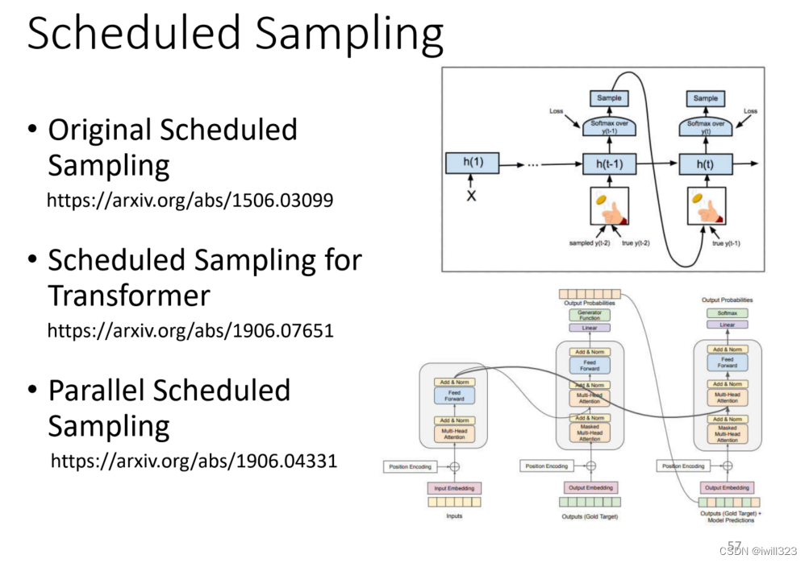

### 4.8 代码示例

从作业里抄过来。TransformerEncoder使用3层TransformerEncoderLayer，dropout=0.2

```python
import torch
import torch.nn as nn
import torch.nn.functional as F
 
 
class Classifier(nn.Module):
	def __init__(self, d_model=224, n_spks=600, dropout=0.2):
		super().__init__()
		# Project the dimension of features from that of input into d_model.
		self.prenet = nn.Linear(40, d_model)
		self.encoder_layer = nn.TransformerEncoderLayer(
            d_model=d_model, dim_feedforward=d_model*2, nhead=2, dropout=dropout)
		self.encoder = nn.TransformerEncoder(self.encoder_layer, num_layers=3)
 
		# Project the the dimension of features from d_model into speaker nums.
		self.pred_layer = nn.Sequential(
			nn.BatchNorm1d(d_model),
			#nn.Linear(d_model, d_model),
			#nn.ReLU(),
			nn.Linear(d_model, n_spks),
		)
 
	def forward(self, mels):
		"""
		args:
			mels: (batch size, length, 40)
		return:
			out: (batch size, n_spks)
		"""
		# out: (batch size, length, d_model)
		out = self.prenet(mels)
		# out: (length, batch size, d_model)
		out = out.permute(1, 0, 2)
		# The encoder layer expect features in the shape of (length, batch size, d_model).
		out = self.encoder(out)
		# out: (batch size, length, d_model)
		out = out.transpose(0, 1) 
		# mean pooling
		stats = out.mean(dim=1)
 
		# out: (batch, n_spks)
		out = self.pred_layer(stats)
		return out
```

