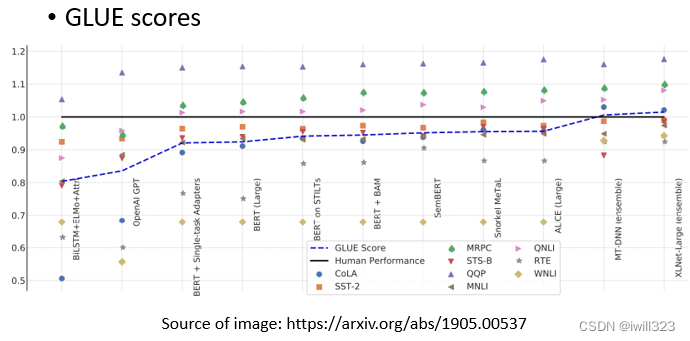

# 自监督学习

> https://blog.csdn.net/iwill323/article/details/127523035

## 1. Self-Supervised Learning

**supervised learning是需要有标签的资料的，而self-supervised learning不需要外界提供有标签的资料**，“带标签”的资料源于自身。x分两部分，x'和x''，**一部分用作模型的输入，另一部分作为模型的标注**（y要学习的label资料）。为什么不叫无监督学习呢？因为无监督学习是一个比较大的家族，里面有很多不同的方法，Self-supervised Learning就是其中之一。

用这些不用标注资料的任务学完一个模型以后，它本身没有什麽用，BERT只能做填空题，GPT 只能够把一句话补完，可以把 Self-Supervised Learning 的 Model做微微的调整，把它用在其他下游的任务裡面

## 2. BERT

BERT是一个transformer的Encoder，BERT可以输入一行向量，然后输出另一行向量，输出的长度与输入的长度相同。BERT不仅用于NLP，或者用于文本，它也可以用于语音和视频。

作为transformer，理论上BERT的输入长度没有限制。但是为了避免过大的计算代价，在实践中并不能输入太长的序列。 事实上，在训练中，会将输入截成片段输入BERT进行训练，避免距离过长的问题。

### 2.1 BERT训练

 当我们训练时，我们要求BERT学习两个任务，masking input 和next sentence prediction这两个操作。

#### 2.1.1 masking input（随机遮盖一些输入单位）

当BERT进行训练时，向BERT输入一个句子，先随机决定哪一些token将被mask。随机遮盖的方法有两种：

- 使用特殊单位来代替原单位，这个特殊单位完全是一个新词，它不在你的字典里，这意味着mask了原文
- 随机使用其他的字来代替原字。

两种方法都可以使用，使用哪种方法也是随机决定的。台□大学就是x'（作为模型的输入），台湾大学等字体就是x''(作为输出要学习的label资料)。

训练方法：

1. 向BERT输入一个序列，先随机决定哪一部分将被mask。
2. 把BERT的相应输出看作是另一个序列，寻找mask部分的相应输出向量，将这个向量通过一个Linear transform（矩阵相乘），并做Softmax得到一个分布。
3. 用一个one-hot vector来表示MASK的字符，并使输出和one-hot vector之间的交叉熵损失最小。

这与Seq2Seq模型中提到的使用transformer进行翻译时的输出分布相同：输出是一个很长的向量，每一个token都有一个分数对应。**本质上是在解决一个分类问题，BERT要做的是预测什么被盖住。**

#### 2.1.2 next sentence prediction（预测前后两个句子是否相接）

从数据库中拿出两个句子，在句子的开头添加一个特殊标记[cls]，两个句子之间添加一个特殊标记[SEP]，这样BERT就可以知道，这两个句子是不同的句子。

> [cls] 用于判断被[SEP]分开的俩句话是不是相接的，输出只有yes/no

把两个句子（包括SEP标记和CLS标记）传给BERT，只看CLS的输出，CLS的输出经过和masking input一样的操作，目的是预测第二句是否是第一句的后续句。这是一个二分类问题，有两个可能的输出：是或不是。

很多文献说这个方法对于预训练的效果并不是很大，没有学到什么太有用的东西，原因之一可能是，Next Sentence Prediction 太简单了，通常，当我们随机选择一个句子时，它看起来与前一个句子有很大不同，因此对于BERT来说，预测两个句子是否相连并不是太难。

有另外一招叫做Sentence order prediction，**SOP**，预测两个句子谁在前谁在后。也许因为这个任务更难，它似乎更有效

### 2.2 BERT的fine-tune应用

#### 2.2.1 BERT框架

> - 产生BERT的过程就是Pre-train
> - 对于下游任务的训练则需要微调

**产生BERT的过程就是Pre-train**，它只会做填空题，做过fine-tune（微调）之后才能做各式各样的下游任务Downstream Tasks。**微调的过程中，对于下游任务的训练，仍然需要少量的标记数据**。

生成BERT的过程就是Self-supervised学习（资料来源于自身），fine-tune过程是supervised learning（有标注的资料），所以整个过程是semi-supervised。所谓的 "半监督 "是指有大量的无标签数据和少量的有标签数据。

#### 2.2.2 对比预训练与随机初始化

"fine-tune"是指模型被用于预训练，该部分的参数是由学习到的BERT的参数来初始化的。
scratch表示整个模型，包括BERT和Encoder部分都是随机初始化的。
横轴是训练周期，纵轴是训练损失。在训练网络时，scratch与用学习填空的BERT初始化的网络相比，损失下降得比较慢，最后，用随机初始化参数的网络的损失高于用学习填空的BERT初始化的参数。

#### 2.2.3 GLUE（测试BERT的能力）

为了测试Self-supervised学习的能力，通常会在多个任务上测试它。**GLUE是自然语言处理任务，总共有九个任务**。BERT分别微调之后做这9个任务，将9个测试分数做平均后代表BERT的能力高低。

人类的准确度是1，如果他们比人类好，这些点的值就会大于1。9个任务的平均得分逐年增加。**每个任务使用的评价指标是不同的，可能<u>不是准确度</u>。如果我们只是比较它们的值，可能是没有意义的。**所以，这里我们看的是人类之间的差异。这只是这些数据集的结果，并不意味着机器真的在总体上超过了人类。

在这里展示的例子属于自然语言处理。语音、文本和图像都可以表示为一排向量，可以把这些例子改成其他任务，例如，把它们改成语音任务，或者改成计算机视觉任务。

#### 2.2.4 case 1-语句分类

输入句子，输出类别。比如说Sentiment analysis情感分析，就是给机器一个句子，让它判断这个句子是正面的还是负面的。
把CLS标记放在这个句子的前面，只看CLS的输出向量，对它进行Linear transform+Softmax，得到类别。需要向BERT提供大量的句子，以及它们的正负标签，来训练这个BERT模型。
Linear transform的参数是随机初始化的，而BERT的参数是由学会填空的BERT初始化的，**训练就是利用梯度下降更新BERT和linear这两个模型里的参数。**

#### 2.2.5 case 2-词性标注

**输入一个序列，然后输出另一个序列，而输入和输出的长度是一样的。**例如，**POS tagging词性标记，给机器一个句子，**它必须告诉你这个句子中每个词的词性。

对于这个句子中的每一个标记，有一个代表这个单词的相应向量。然后，这些向量会依次通过Linear transform和Softmax层。最后，网络会预测给定单词的词性。

#### 2.2.6 case 3-句意立场分析

**输入两个句子，输出类别。**输出的类别是三个中的一个：contradiction（对立的）、entailment（同边）、neutral（中立的）。最常见的是Natural Language Inference，机器要做的是判断是否有可能从前提中推断出假设，前提与假设相矛盾吗？例如，舆情分析。给定一篇文章，下面有一个评论，这个消息是同意这篇文章，还是反对这篇文章

**给BERT两个句子，在这两个句子之间放一个特殊的标记SEP，并在最开始放CLS标记**。把CLS标记作为Linear transform的输入。它决定这两个输入句子的类别

#### 2.2.7 case 4-问答系统

针对回答在文中找到的答案，假设答案必须出现在文章中。输入问题和文章，文章和问题都是一个序列，**输出两个正整数s，e，表示第s个字到第e个字之间的字就是答案。**

在问题和文章之间的一个特殊标记，然后在开头放一个CLS标记。**随机初始化两个向量，分别对应与答案的开始与结束，用橙色向量和蓝色向量来表示，这两个向量的长度与BERT的输出向量的长度一致，**因为要做内积。内积之后的向量经过softmax后得到分数，分数最高的位置就是起或止位置。 **橙色向量代表答案的起始位置，蓝色向量代表答案的结束位置，随机初始化，从头开始学习**

#### 2.2.8 Pre-training a seq2seq model

前面讲的BERT都没有涉及seq2seq，BERT只是一个预训练Encoder，有没有办法预训练Seq2Seq模型的Decoder？

**在一个transformer的模型中，将输入的序列损坏，然后Decoder输出句子被破坏前的结果，训练这个模型实际上是预训练一个Seq2Seq模型。**

可以采用**mass或BART手段**损坏输入数据，mass是盖住某些数据（类似于masking），BART是综合了右边所有的方法（盖住数据、删除数据、打乱数据顺序、旋转词的顺序等等），BART的效果要比mass好。

### 2.3 Training BERT is challenging

目前要训练BERT难度很大，一方面是数据量庞大，处理起来很艰难；另一方面是训练的过程需要很长的时间。

谷歌最早的BERT，它使用的数据规模已经很大了，包含了30亿个词汇。BERT有一个base版本和一个
large版本。对于大版本，我们很难自己训练它，所以我们尝试用最小的版本来训练，看它是否与谷歌的结果相同。横轴是训练过程，参数更新多少次，大约一百万次的更新，用TPU运行8天，如果你在Colab上做，这个至少要运行200天。在Colab上微调BERT只需要半小时到一小时

我们自己训练BERT后，可以观察到BERT什么时候学会填什么词汇，它是如何提高填空能力的？ 论文的链接https://arxiv.org/abs/2010.02480

### 2.4 为什么做填空题的BERT有用

pre-train的BERT会做填空题，那为什么微调一下就能用作其他的应用呢？

输入一串文本，每个文本都有一个对应的输出向量，这个向量称之为embedding，代表了输入词的含义。意思越相近的字产生的向量越接近，如图右部分。同时，BERT会根据上下文，不同语义的同一个字产生不同的向量（例如“果”字）。

**下图中，根据 "苹果 "一词的不同语境，得到的向量会有所不同。**计算这些结果之间的cosine similarity，即计算它们的相似度。计算每一对之间的相似度，得到一个10×10的矩阵。相似度越高，这个颜色就越浅。前五个 "苹果 "和后五个 "苹果 "之间的相似度相对较低。BERT知道，前五个 "苹果 "是指可食用的苹果，所以它们比较接近。最后五个 "苹果 "指的是苹果公司，所以它们比较接近。所以BERT知道，上下两堆 "苹果 "的含义不同

为什么不同呢，因为训练填空题BERT时，就是从上下文抽取资讯来填空的，学会了每个汉字的意思，也许它真的理解了中文，既然它理解了中文，它就可以在接下来的任务中做得更好。

#### 2.4.1 Contextualized embedding

为什么BERT能输出代表输入词含义的向量？一位60年代的语言学家，约翰-鲁伯特-弗斯，提出了一个假说：要知道一个词的意思，需要看它的 "Company"，也就是经常和它一起出现的词汇，也就是它的上下文。

当我们训练BERT时，给它w1、w2、w3和w4，覆盖w2，并告诉它预测w2，这就是从上下文中提取信息来预测w2。所以输出向量是其上下文信息的精华，可以用来预测w2是什么。可以根据不同的语境，从同一个词汇产生不同的embedding。因为BERT是一个考虑到语境的高级版本的词
embedding，所以这些由BERT提取的向量或embedding被称为Contextualized embedding

> CBOW做的是BERT一样的事情，采用的是俩个linear ，BERT是deep版本的CBOW

#### 2.4.2 使用BERT分类蛋白质、DNA链和音乐

DNA是一系列的脱氧核糖核酸，有四种，分别用A、T、C和G表示。用BERT来对DNA进行分类，将ATCG对应到一串文字中以方便BERT进行分类。例如，"A "是 "we"，"T "是 "you"，"C "是 "he"，"G "是 "she"。例如，"AGAC "变成了 "we she we he"，不知道它在说什么。和以前一样，Linear transform使用随机初始化，而BERT是通过预训练模型初始化的，它已经学会了英语填空。

蛋白质是由氨基酸组成的，有十种氨基酸，给每个氨基酸一个随机的词汇，音乐也是一组音符，每个音符一个词汇，然后，把它作为一个文章分类问题来做。
如果不使用BERT，你得到的结果是蓝色部分，如果你使用BERT，你得到的结果是红色部
分，竟然会比较好。所以，即使你给BERT一个无意义的句子，它仍然可以很好地对句子进行分类。可能BERT的初始化参数就比较好，而与语义没有关系（一种推测，BERT内部结构还有很多问题尚待研究）。

#### 2.4.3 Multi-lingual BERT（多语言BERT）

Multi-lingual BERT是用许多不同的语言预训练的BERT。如果把一个Multi-lingual的BERT用英文问答数据进行微调，它就会自动学习如何做中文问答，有78%的正确率。fine-tune是训练时输入的语言，test是测试时输入问题和文章的语言。

它从未接受过中文和英文之间的翻译训练，也从未阅读过中文Q&A的数据收集，在预训练中，学习的目标是填空，它用中文只能填空。有了这些知识，再加上做英文问答的能力，不知不觉中，它就自动学会了做中文问答。

#### 2.4.4 为什么可以做到Multi-lingual BERT：Cross-lingual Alignment

**一个简单的解释是：也许对于多语言的BERT来说，不同的语言并没有那么大的差异。无论你用中文还是英文显示，对于具有相同含义的单词，它们的embedding都很接近。**汉语中的 "跳 "与英语中的 "jump "接近，汉语中的 "鱼 "与英语中的 "fish "接近，汉语中的"游 "与英语中的 "swim "接近，也许在学习过程中它已经自动学会了。

可以用Mean Reciprocal Rank验证，缩写为MRR。MRR的值越高，不同embedding之间的Alignment就越好。更好的Alignment意味着，具有相同含义但来自不同语言的词将被转化为更接近的向量。

这条深蓝色的线是谷歌发布的104种语言的Multi-lingual BERT的MRR，它的值非常高，这说明不同语言之间没有太大的差别。Multi-lingual BERT只看意思，不同语言对它没有太大的差别。

数据量增加了五倍，才达到Alignment的效果。数据量是一个非常关键的因素，关系到能否成功地将不同的语言排列在一起。

当训练Multi-lingual BERT时，如果给它英语，它用英语填空，如果给它中文，它用中文填空。那么，如果不同语言之间没有区别，怎么可能只用英语标记来填英语句子呢？为什么它不会用中文符号填空呢？说明它知道语言的信息也是不同的，并没有完全抹去语言信息

将所有中文的embbeding平均一下，英文的embbeding平均一下，发现两者之间存在着差距，这个差距用一个蓝色向量来表示。对一个Multi-lingual BERT输入英文问题和文章，他会输出一堆embedding，在embedding中加上这个蓝色的向量，这就是英语和汉语之间的差距。（所以同义的不同字代表的向量之间可能存在一个小小的偏差，改变偏差就能保证同义下改变字。）

## 3. GPT

### 3.1 GPT的框架概念

BERT模型能够做填空题，GPT模型则能预测下一个token（单位）。

例如有笔训练资料是“台湾大学”，那么输入BOS后训练输出是台，再将BOS和"台"作为输入训练输出是湾，给它BOS "台"和"湾"，然后它应该要预测"大"，以此类推。模型输出embedding h，h再经过linear transform和softmax后，计算输出分布与正确答案之间的cross entropy，希望它越小越好（与一般的分类问题是一样的）。

GPT模型像是一个transformer的decoder，不过做mask的attention。给BOS预测台的时候，不会看到接下来出现的词汇，给它台要预测湾的时候，不会看到接下来要输入的词汇，以此类推

GPT最知名的就是，GPT不断地预测下一个token，甚至可以写一篇文章。GPT系列最知名的一个例子，就是用GPT写了一篇跟独角兽有关的新闻,

### 3.2 如何使用GPT

GPT模型真的太大了，大到连fine tune可能都有困难。应用的时候，给模型问题描绘和解答例子，模型就能自己开始做题了。

举例来说假设要GPT这个模型做翻译

- 先输入Translate English to French，这个句子代表问题的描述
- 然后给它几个范例，跟它说sea otter然后=>，后面就应该长这个样子，或者是plush girafe，plush girafe后面就应该长这个样子等等
- 然后接下来,你问它说cheese=>。叫它把后面的补完。希望它就可以產生翻译的结果

和普通的学习不一样，它不需要用到gradient descent（梯度下降），完全没有要去调GPT那个模型参数的意思，所以在GPT的文献裡面把这种训练给了一个特殊的名字，叫做**In-context Learning**，代表说它不是一般的learning，它连gradient descent都没有做。但是它的准确率不是太高。

## 4. Self-supervesed Learning Beyond Text

在语音跟影像的应用上也都可以用self-supervised learning的技术。self-supervised learning 有很多种模型，类型包括data centric（以数据为中心）、prediction（预测）、contrastive（对比），BERT和GPT都属于预测型。

### 4.1 Image - SimCLR

### 4.2 Image - BYOL

https://arxiv.org/abs/2006.07733

### 4.3 Speech

把一段声音讯号盖起来,叫机器去猜盖起来的部分是什麼嘛,语音也可以预测接下来会出现的内容

## 5. auto-encoder（自编码器）

### 5.1 auto-encoder的运作机制

#### 5.1.1 Encoder和Decoder

Auto-Encoder 裡面有两个 Network，一个叫做 Encoder，一个叫做Decoder。输入一个高维向量（图片），经过encoder转变成低维向量（这个低维向量又称为embedding、representation、code；这些是用于下游任务的新特征），再将低维向量输入decoder转变成高维向量。训练的目标是希望Encoder 的输入跟 Decoder 的输出越接近越好，这个过程也叫reconstruction（重建）。

Auto-Encoder 的概念跟 Cycle GAN 其实是一模一样的，都是希望所有的图片经过两次转换以后，要跟原来的输出越接近越好，而这个训练的过程完全不需要任何的标注资料，只需要蒐集到大量的图片就可以做这个训练。

#### 5.1.2 动机：“降维”（Dimension Reduction）

图片可以看作是一个很长的向量，比如说输入是 100×100 的图片，就是 1 万维的向量，如果是 RGB 那就是 3 万维的向量，这个向量太长了不好处理。把图片丢到 Encoder 以后输出一个低维度的向量，比如说只有 10 维、100 维，拿这个低维度的向量来做接下来的任务。

Encoder 的输出有时候又叫做 Bottleneck，因为输入是很宽的，输出也是很宽的 ，中间特别窄，所以这一段就叫做 Bottleneck。

Encoder 做的事情是dimension reduction（维度下降），是整个auto-encoder中最关键的部分。

#### 5.1.3 为什么可以实现维度下降

高维度向量的变化其实是有限的，所以可能只需要很少的几维就能够表示各种变化情况。因此维度下降并没有使表示的特征内容发生改变，可以通过维度下降来减小向量，使后面的计算更简单，并且下游的任务只需要比较少的训练资料，就可以让机器学到我们本来要它学的事情。

假设本来图片是 3×3，你要用 9 个数值来描述一张 3×3 的图片。但是从训练中观测到，只有2种情况会出现，因此一个Encoder只用两个维度就可以描述一张图片，它把 9 个数值变成 2 个数值，又由decoder还原回 9 个数值

BERT 也可以看作一个De-Noising 的 Auto-Encoder，输入的那些 Masking 其实就是Noise，BERT 的模型就是 Encoder，它的输出就是Embedding，Linear 的模型就是 Decoder，把填空题被盖住的地方还原回来，所以可以说BERT 其实就是一个De-Noising 的 Auto-Encoder

### 5.2 auto-encoder应用

#### 5.2.1 feature disentangle（低维向量的功能区分）

Disentangle 的意思就是把一堆本来纠缠在一起的东西解开。因为Embedding向量能够还原回原来的数据，这说明Auto-encoder能够让Embedding中包含原数据中的所有信息。Feature Disentangle 想要做到的事情就是，希望在训练一个 Aauto-Encoder 的时候，有办法知道这个 Embedding哪些维度代表了哪些资讯

例如输入语音的时候，embedding里面包含语音内容、说话者等资讯。经过auto-encoder之后，我们可以知道哪些维度代表什么资讯，例如embedding的前50个维度表示语音内容，后50个维度表示说话者。

#### 5.2.2 feature disentangle的应用：语者转换

假设你要把A 的声音转成 B 的声音，把 A 跟 B 都找来，唸一模一样的句子，有成对的资料，这是Supervised Learning 的问题。

现在A 跟 B 不需要唸同样的句子也行，由于我们预先知道向量中哪些维度代表语音的内容、哪些维度代表说话者特征，只要把其中一人说话的内容的部分取出来，把另一人说话的声音特徵的部分取出来，拼起来，丢到 Decoder 裡面就可以实现变声。还可以实现不同语言的语者转换

将李宏毅的embedding的前50维和新垣结衣的embedding的后50维结合在一起组成新的embbeding，再将其输入decoder，输出的语音就是新垣结衣在说how are you

#### 5.2.3 **discrete representation（离散表示法）—**控制Embedding的形式，便于充分利用

向量的表示有很多种方法：

1. 实数数字
2. 二元向量：整个向量只有1或0，每一个维度表示某种特徵的有或者是没有。例如输入图片，如果是女生，可能第一维就是 1，男生第一维就是 0，如果有戴眼镜，就是第三维 1，没有戴眼镜，就是第三维是 0
3. One-Hot向量：整个向量只有一维是 1，其他都是 0，表示类别；总共多少维就有多少类。普通分类问题是需要有标注的资料，强迫中间的Code 是 One-Hot Vector，可以用无标注的资料实现分类。

#### 5.2.4 discrete representation的应用：VQVAE

Vector Quantized Variational Aauto-Encoder，可训练出离散向量。用到codebook，它是一个离散向量集。该模型中的encoder、decoder和codebook都是通过训练学出来的。

encoder输出向量是一般的连续向量，计算codebook与连续向量的相似度，找出codebook中与连续向量最相似的离散向量，将其作为decoder的输入向量，然后要它输出一张图片，让输入跟输出越接近越好。

好处：Decoder 的输入一定是Codebook裡面的向量的其中一个，假设 Codebook 裡面有 32 个向量，那么 Decoder 的输入就只有 32种可能，等于让你的Embedding是离散的，它没有无穷无尽的可能。

对于语音，向量集代表基本发音单位。

#### 5.2.5 文字作为embedding

embedding不一定是向量，也可以是文字。一篇文章丢进Encoder，产生一个向量，把这个向量丢到 Decoder还原文章，现在把 Embedding 变成一串文字，也许这串文字就是文章的摘要，因为这
段文字是这篇文章的精华，这篇文章最关键的内容。

Encoder 跟 Decoder显然都必须要是一个 Seq2seq 的Model，只需要无标注的文章，就可以训练出获取文献摘要的模型，但是下面这个模型得出的summary是人类看不懂的。Encoder 跟Decoder 之间发明自己的暗号，Decoder能还原原来的文章，Decoder 可以看得懂，但是人看不懂。

只需要在上面的模型里加入discriminator，Discriminator 看过人写的句子，所以知道人写的句子长什么样子，但这些句子不需要是这些文章的摘要性。Encoder 要想办法产生一段句子，这段句子不只可以透过 Decoder还原回原来的文章，还要是 Discriminator 觉得像是人写的句子，于是可以获取人类能懂的文献摘要
这个思想就是cycle GAN的思想，只是从 Aauto-Encoder 的角度来看待 CycleGAN 这个想法而已。遇到不能train的，直接用RL（强化学习）硬train就完了。

### 5.3 auto-encoder的其他应用

#### 5.3.1 Generator

Decoder 吃一个向量产生一张图片，所以 Decoder可以当做一个 Generator 来使用。可以从一个已知的 Distribution，比如说 Gaussian Distribution，Sample 一个向量丢给 Decoder，看看它能不能够输出一张图。VAE就是把 Aauto-Encoder 的 Decoder 拿出来当做 Generator 来用

#### 5.3.2 图片压缩

一张图片是一个非常高维的向量，而一般Encoder 的输出是一个非常低维的向量，可以把那个向量看作是一个压缩的结果。encoder负责压缩，decoder负责解压，但是最后解压出来的图片是失真的，非常不可取。

#### 5.3.3 异常检测

**异常检测的概念：**给一系列的正常数据，训练出模型，这个模型能够判断输入的x是正常数据还是异常数据。

- 给它一笔新的资料，如果这笔新的资料，看起来像是训练资料裡面的 Data，就说它是正常的
- 如果看起来不像是训练资料裡面的 Data，就说它是异常的

**难点：收集资料——One Class**

通常有办法收集到正常的资料，比较不容易收集到异常的资料。往往假设有一大堆正常的资料，但几乎没有异常的资料，所以它不是一个一般的分类的问题，这种分类的问题又叫做 One Class分类问题。这个时候就是 Aauto-Encoder可以派得上用场的时候。

**auto-encoder实现异常检测的过程**
根据reconstruction的好坏来判断训练时是否有看过同类型照片。

假设我们现在想要做一个系统，侦测一张图片是不是真人的人脸。在测试时，计算一张照片通过 Encoder，再通过 Decoder 以后的差异有多大，如果差异很小，Decoder 可以顺利地还原原来的照片，代表这样类型的照片在训练的时候有看过，表示图片正常；反过来说，假设有一张照片是训练的时候没有看过的，计算输入跟输出的差异，发现差异非常地大，那就代表说现在输入给 Encoder 的这张照片可能是一个异常的状况

