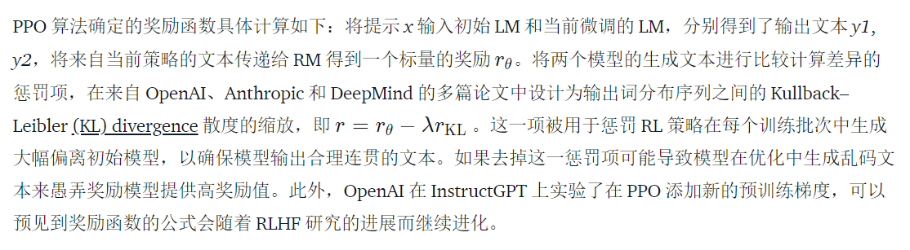
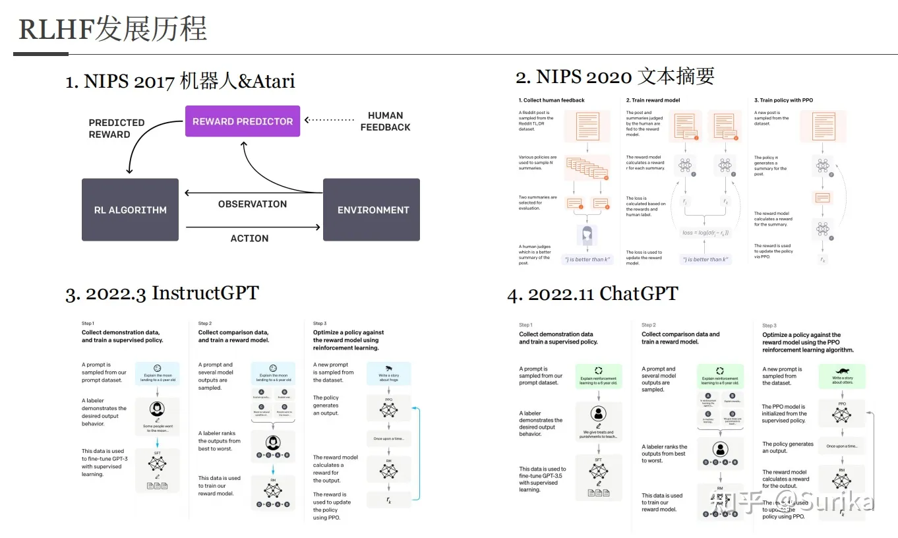
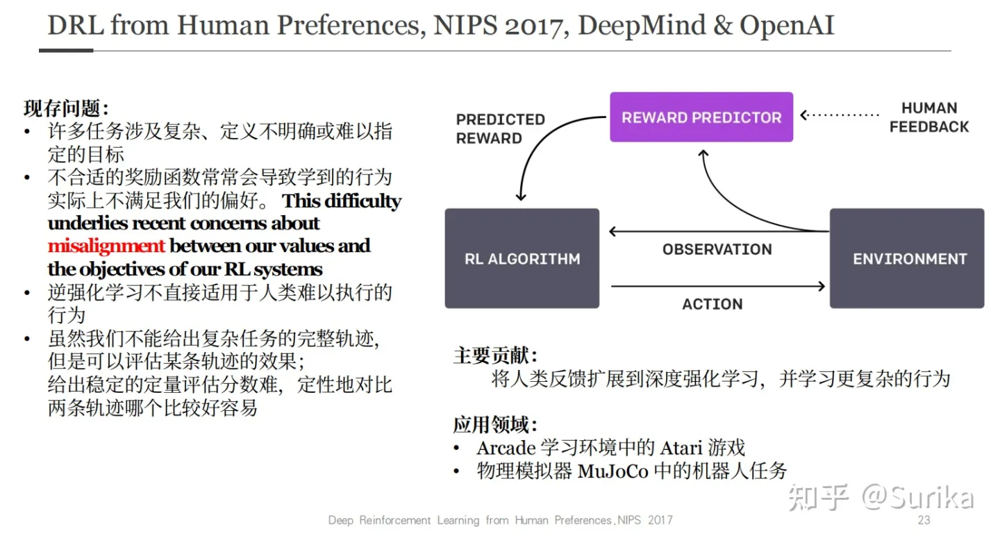
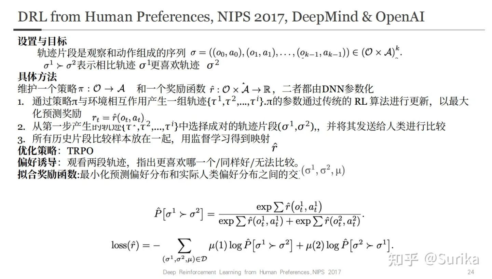
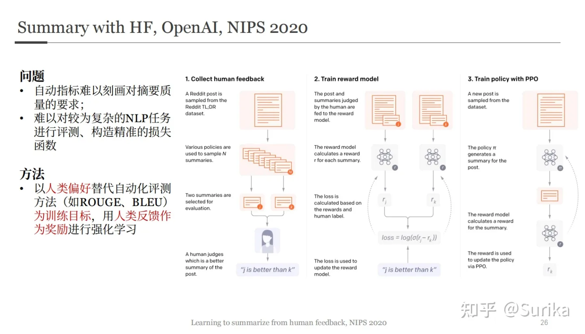
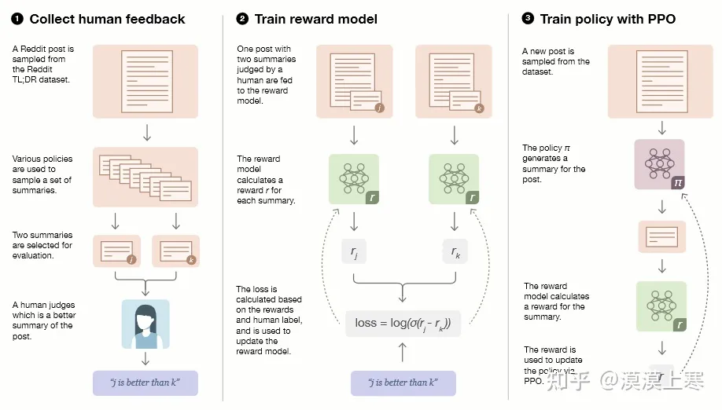

# 【Huggingface分享】RLHF ChatGPT是怎样炼成的

> https://www.bilibili.com/video/BV1Ae4y1K7FY
>
> https://zhuanlan.zhihu.com/p/616708590
>
> https://mp.weixin.qq.com/s?__biz=MzI4MDYzNzg4Mw==&mid=2247554744&idx=3&sn=58d27263f499a939cba817522840a9cb&chksm=ebb72e6cdcc0a77a135c55c297c3c8c5ee106780c92f072bbf821ea0f8a1e143a47034e69680&scene=27

RLHF (Reinforcement Learning from Human Feedback) ，即以强化学习方式依据人类反馈优化语言模型。

> https://huggingface.co/blog/zh/rlhf

下图是ChatGPT的训练过程，本文要介绍的RLHF技术主要是第二步和第三步的内容：

（1） 利用gpt自回归式的语言模型在大规模的语料上进行无监督的预训练，得到生成模型

（2） 然后人工对用户提示文本后，GPT生成句子的结果进行打分。产生形式为（提示文本，GPT生成句子，得分）的数据集，训练打分模型

（3） 最后利用强化学习的方式 让打分模型去优化生成模型的效果。

## RLHF 技术分解

RLHF 是一项涉及多个模型和不同训练阶段的复杂概念，这里我们按三个步骤分解：

1. 预训练一个语言模型 (LM) ；
2. 聚合问答数据并训练一个奖励模型 (Reward Model，RM) ；
3. 用强化学习 (RL) 方式微调 LM。

### Step 1. 预训练语言模型

1. 首先，我们使用**经典的预训练目标训练一个语言模型**。这里**可以用额外的文本或者条件对这个 LM 进行微调**，这里或许使用了昂贵的增强数据，但并不是 RLHF 必须的一步。（由于 RLHF 还是一个尚待探索的领域，对于” 哪种模型” 适合作为 RLHF 的起点并没有明确的答案。）

2. 接下来，我们会**基于 LM 来生成训练奖励模型 (RM，也叫偏好模型) 的数据，并在这一步引入人类的偏好信息**。

> 此处可参考李宏毅【生成式AI】ChatGPT原理割析.md

### Step 2. 训练奖励模型

**RM 的训练是 RLHF 区别于旧范式的开端**。

一个奖励模型（RM）的目标是刻画模型的输出是否在人类看来表现不错。即，**输入 [提示(prompt)，模型生成的文本] ，输出一个刻画文本质量的标量数字。**

整体流程如图所示：

奖励模型可以看做一个判别式的语言模型，因此我们可以用一个预训练语言模型热启，而后在 [x=[prompt，模型回答], y=人类满意度] 构成的标注语料上去微调，也可以直接随机初始化，在语料上直接训练。

如上图所示，标注人员的任务则是对初始语言模型生成的文本进行排序。有人可能会奇怪，为啥不直接让标注人员对文本进行打分呢？

这是因为研究人员发现不同的标注员，打分的偏好会有很大的差异（比如同样一段精彩的文本，有人认为可以打1.0，但有人认为只能打0.8），而这种差异就会导致出现大量的噪声样本。若改成标注排序，则发现不同的标注员的打分一致性就大大提升了。

那具体怎么操作呢？一种比较有效的做法是“pair-wise”，即给定同一个prompt，让两个语言模型同时生成文本，然后比较这两段文本哪个好。最终，这些不同的排序结果会通过某种归一化的方式变成标量信号（即point-wise）丢给模型训练。

一个比较有趣的观测是，奖励模型的大小最好是跟生成模型的大小相近，这样效果会比较好。一种比较直观的解释就是，要理解生成模型的输出内容，这份理解能力所需要的模型参数规模就得恰好是跟生成模型相近才能做到（当然，如果奖励模型规模更大那应该更没问题，但理论上没必要）。

至此，我们有了一个初始的语言模型来生成文本，以及一个奖励模型（RM）来判断模型生成的文本是否优质（迎合人类偏好）。

2.1 这一模型可以用端到端的方式**用 LM 建模，或者用模块化的系统建模** (比如对输出进行排名，再将排名转换为奖励) ，**接收一系列文本并返回一个标量奖励，数值上对应人的偏好**。这一奖励数值将对后续无缝接入现有的 RL 算法至关重要。

2.2 **关于模型选择方面，RM 可以是另一个经过微调的 LM，也可以是根据偏好数据从头开始训练的 LM。**

2.3 **关于训练文本方面，RM 的提示 - 生成对文本**是从<u>预定义数据集</u>中采样生成的，并<u>用初始的 LM</u> 给这些提示**生成文本**。

Anthropic 的数据主要是通过 Amazon Mechanical Turk 上的聊天工具生成的，并在 Hub 上 [可用](https://huggingface.co/datasets/Anthropic/hh-rlhf)，而 OpenAI 使用了用户提交给 GPT API 的 prompt。

2.4 **关于训练奖励数值方面，这里需要人工对 LM 生成的回答进行排名**。对具体的排名方式，一种成功的方式是对不同 LM 在相同提示下的输出进行比较，然后使用 [Elo](https://en.wikipedia.org/wiki/Elo_rating_system) 系统建立一个完整的排名。这些不同的排名结果将被归一化为用于训练的标量奖励值。

> **Elo等级分制度**（英语：Elo rating system）是基于[统计学](https://zh.wikipedia.org/wiki/统计学)的一个评估棋手水平的方法。
>
> 

### Step 3. 用强化学习微调

**我们将初始语言模型的微调任务建模为强化学习（RL）问题，因此需要定义策略（policy）、动作空间（action space）和奖励函数（reward function）等基本要素。**

显然，**策略**就是基于该语言模型，接收prompt作为输入，然后输出一系列文本（或文本的概率分布）；而**动作空间**就是词表所有token在所有输出位置的排列组合（单个位置通常有50k左右的token候选）；**观察空间**则是可能的输入token序列（即prompt），显然也相当大，为词表所有token在所有输入位置的排列组合；而**奖励函数**则是基于上一章节我们训好的RM模型，配合一些策略层面的约束进行的奖励计算。

然后我们来看一下具体怎么计算得到奖励（reward）。

首先，基于前面提到的预先富集的数据，从里面采样prompt输入，同时丢给初始的语言模型和我们当前训练中的语言模型（policy），得到俩模型的输出文本y1，y2。然后用奖励模型RM对y1、y2打分，判断谁更优秀。显然，打分的差值便可以作为训练策略模型参数的信号，这个信号一般通过KL散度来计算“奖励/惩罚”的大小。显然，y2文本的打分比y1高的越多，奖励就越大，反之惩罚则越大。这个reward信号就反映了文本整体的生成质量。

有了这个reward，便可以根据 Proximal Policy Optimization (PPO) 算法来更新模型参数了。

PPO 算法确定的奖励函数具体计算如下

通过以上过程不难想到，完全可以迭代式的更新奖励模型（RM）和策略模型（policy），让奖励模型对模型输出质量的刻画愈加精确，策略模型的输出则愈能与初始模型拉开差距，使得输出文本变得越来越符合人的认知。

## Reinforcement learning

### 基本概念

有一个**agent（代理）与环境交互**，代理通过采取行动与环境交互，然后**环境返回两个东西，称为状态和奖励**，奖励是我们想要的目标优化，状态只是当前时间索引中世界的一种表示，**代理使用称为策略的东西从该状态映射到动作**，其优点在于它是非常开放的学习，因此代理只是看到这些奖励信号并学习如何随着时间的推移优化它们，而不管奖励的实际信号来源如何，所以这实际上就是模型中以对这些值进行编码或将这些值编码到模型中。实际上我们想直接与人类。一起学习这些值，而不是试图将其分配给所有人类，并且有点错误地标记实际值是什么。因此加强对人类反馈的学习是许多方法中的一种，也是非常及时和成功的方法之一

#### 特点

我们可以通过与熟悉的监督学习比较，来说明强化学习的一些特点。

（1）强化学习处理的大多数是序列数据，其很难像监督学习的样本一样满足独立同分布。

在强化学习的训练过程中，时间非常重要。因为我们得到的是有时间关联的数据（sequential data），而不是独立同分布的数据。在机器学习中，如果观测数据有非常强的关联，会使得训练非常不稳定。这也是为什么在监督学习中，我们希望数据尽量满足独立同分布，这样就可以消除数据之间的相关性。

（2）在强化学习过程中，没有非常强的监督者（supervisor），只有奖励信号（reward signal）。并且奖励信号是延迟的.

（3）强化学习智能体会从环境中获得延迟的奖励，即环境会在很久以后才告诉我们之前所采取的动作到底是不是有效的。

因为我们没有得到即时反馈，所以智能体使用强化学习来学习就非常困难。当我们采取一个动作后，如果使用监督学习，就可以立刻获得一个指导，比如，我们现在采取了一个错误的动作，正确的动作应该是什么。而<u>在强化学习中，环境可能会告诉我们这个动作是错误的，但是它并不会告诉我们正确的动作是什么</u>。而且更困难的是，它可能是在一两分钟过后才告诉我们这个动作是错误的。所以这也是强化学习和监督学习不同的地方。

（4）强化学习会试错探索，它通过探索环境来获取对环境的理解。

学习器并没有告诉我们每一步正确的动作应该是什么，学习器需要自己去发现哪些动作可以带来最多的奖励，只能通过不停地尝试来发现最有利的动作。智能体获得自己能力的过程，其实是不断地试错探索（trial-and-error exploration）的过程。探索（exploration）和利用（exploitation）是强化学习中非常核心的问题。其中，探索指尝试一些新的动作，这些新的动作有可能会使我们得到更多的奖励，也有可能使我们“一无所有”；利用指采取已知的可以获得最多奖励的动作，重复执行这个动作，因为我们知道这样做可以获得一定的奖励。 因此，<u>我们需要在探索和利用之间进行权衡，这也是在监督学习中没有的情况。</u>

（5）最后一点，智能体的动作会影响它随后得到的数据，这一点是非常重要的。在训练智能体的过程中，很多时候我们也是通过正在学习的智能体与环境交互来得到数据的。**所以如果在训练过程中，智能体不能保持稳定，就会使我们采集到的数据非常糟糕**。

我们通过数据来训练智能体，如果数据有问题，整个训练过程就会失败。所以在强化学习中一个非常重要的问题就是，怎么让智能体的动作一直稳定地提升。用下棋来举个形象的例子，在监督学习中，棋手的上限往往取决于老师的上限，也就是俗话说的”和臭棋篓子下棋，越下越臭“；而在强化学习的设置下，即使有着资质平平甚至有些笨的起点，也有自己和自己下，有朝一日悟道飞升的可能性。

#### 总结

可以总结说，监督学习是从外部监督者提供的带标注训练集中进行学习，也就是由任务驱动型；

非监督学习是一个典型的寻找未标注数据中隐含结构的过程，也就是数据驱动型；

强化学习则更偏重于智能体与环境的交互， 这带来了一个独有的挑战 ——“试错（exploration）”与“开发（exploitation）”之间的折中权衡，智能体必须开发已有的经验来获取收益，同时也要进行试探，使得未来可以获得更好的动作选择空间，也就是说可以从错误中学习。

### 文本生成中的强化学习

让我们落到文本生成的实际场景中。如图所示，文本生成的问题，可以建模为一个token空间上的序列决策问题（选择一个token后继续选择另一个token）

- State：对话上下文
- Action：回复的token space上的token
- Reward：生成的质量判别
- Episode：一次完整的解码生成回复的过程

### 强化学习的分类

最后，我们来看强化学习下算法的分类法。

根据一种比较通行的分类法，**强化学习可以分为基于值的方法、基于策略的方法和actor-critic方法这三类。**

#### 基于值函数的学习方法

**基于值函数的学习方法**要学习一个价值函数, **去计算每个动作在<u>当前环境</u>下的价值，目标就是获取最大的动作价值**，即**每一步采取回报最大的动作和环境进行互动**。Value-Based的方法输出的是动作的价值，选择价值最高的动作。**适用于非连续的动作**。常见的方法有Q-learning、Deep Q Network和Sarsa。其基础网络结构如下图所示，在编码网络之后，直接用一个全连接层来为每个状态输出一个分数。

#### 基于策略梯度的学习方法

**基于策略梯度的学习方法**去学习策略函数，去计算当前环境下每个动作的概率，**目标是获取最大的状态价值**，**即该<u>动作发生后</u>期望回报越大越好。**

Policy-Based的方法**直接输出下一步动作的概率，根据概率来选取动作。但不一定概率最高就会选择该动作，还是会从整体进行考虑**。适用于**非连续和连续的动作**。常见的方法有Policy gradients。从图中可以看出来，在全连接层之后还有一个softmax层，从而将打分转化成概率。

#### Actor-Critic

Actor-Critic 融合了上述两种方法，**价值函数和策略函数一起进行优化**。**价值函数负责在环境学习并提升自己的价值判断能力，而策略函数则接受价值函数的评价**，尽量采取在价值函数那可以得到高分的策略。

## RLHF发展历程

上面的图是前面出现过的基本强化学习的概念，下面是RLHF的示意图。可见其中的元素和概念基本是共享的，而不同的也就是红框中的部分，在agent和environment之前，出现了第三个可以参与交互的对象：人类，并由其衍生了一系列步骤。

实际上，RLHF并不是突然出现的事物，最早在2017年的NIPS就出现了这一思想。而在2020年的NIPS上，OpenAI已经尝试将其用于文本摘要任务，并取得了很好的效果。图中可见，RLHF的步骤框架从2020年这篇工作开始，就基本确定了。

### NIPS 2017

这篇工作针对的是奖励函数设计的问题。奖励函数设计是强化学习中的一个难题。从本质上讲，奖励函数是对任务目标的一种抽象，也是我们向 agent 传达任务目标的桥梁。当任务非常复杂时，很难将目标转化为奖励函数这种形式化、数字化的表征。试想一下，如何为煎鸡蛋这个任务设计奖励函数？虽然将煎鸡蛋这个任务数字化抽象为奖励函数很困难，但是我们人类执行这个任务则没什么难度，也就是说，我们可以以相对低的成本获取很多完成这个任务的专家轨迹，这样我们就可以做模仿学习（IL），比如我们可以先用逆强化学习（IRL）方法从专家轨迹中恢复奖励函数，再用这个奖励函数做 RL。

> IL通常分为BC和IRL两类。这两个类别通过结合不同的技术来繁荣发展，并扩展到不同的领域。一般而言，BC和IRL方法使用不同的方法来复现专家行为。**BC通常使用从状态到行动的直接映射，而IRL则试图从示范中恢复奖励函数。**这种差异可能是为什么BC方法通常应用于现实世界问题，而大多数IRL方法仍然在具有较少发明的环境（作者想说的应该是仿真环境）中进行模拟的原因。
>
> 逆强化学习首次由Russell提出[58]。与基于规则的控制（BC）不同，逆强化学习代理通过迭代从专家演示中恢复和评估奖励函数，而不是建立从状态到动作的映射。选择使用BC或IRL取决于问题设置。当问题设置更加注重系统动态和未来预测时，选择IRL方法更有可能通过迭代评估给定上下文并提供更准确的预测。另一方面，当需要准确的控制器时，BC可能是更好的选择。
>
> 

这种方法虽然有效，但是仍存在限制，假如任务太难了，以至于普通人很难完成呢？比如遥控玩具飞机做特技，或者控制一个虚拟机器人后空翻，这些特殊任务需要训练有素的专业人士提供专家轨迹，成本就又上去了。注意到从提供奖励函数到提供任务轨迹，我们降低了对人能力的要求，从而降低成本。按这个思路继续下去，虽然我们不能给出复杂任务的完整轨迹，但是评估某条轨迹的效果还是比较容易的。比如后空翻任务，我们一眼就能看出某段轨迹是不是后空翻，并且能对完成质量给出大概的评估。显然，可以把这个评估作为这一段轨迹的 return，执行 MC 类的 RL 方法。这看起来好像不错，但我们普通人不是专业裁判，且通常没有一个详尽的评价标准，难以给出稳定的定量评估分数。于是我们再次降低要求，只要人类定性地对比两条轨迹哪个比较好就行了。

本文提出的就是一种利用上述 “人类偏好” 进行 DRL 的方法，非正式地说， agent 的目标是通过向人类发出尽量少的偏好比较请求，生成人类喜欢的轨迹。

考虑通过一系列步骤与环境交互的代理：在每个时刻t，代理从环境中接收到一个观测o，然后向环境发送一个动作a，轨迹片段是观察和动作组成的序列。 σ1 >  σ2 表示相比 σ1更喜欢 σ2。（论文中使用的是偏序关系的符号大于，这里为了打字方便直接用>代替了）这里 σ1> σ2代表的意思是，o1 a1获得的reward要大于o2 a2获得的reward。

在之前的RL工作中,r是有定量的评估公式的。但像在上一页里介绍的，我们现在没有定量评估所需的奖励函数r，就只能定性评估agent满足人类偏好的程度。此外还有一个问题，因为系统很难每次重置成同样的状态，因此用于比较的轨迹片段通常从不同的状态开始，这增加了人类比较评估的难度，也使得人类的比较结果更难解释，但是本方法克服了此困难。

优化策略使用偏好诱导，人类的判断记录在一个三元组( σ1, σ2,μ) ，其中 σ1和 σ2是两段轨迹片段， μ 是{1,2}上的分布，表示用户首选的轨迹片段。

如果人类选择一个轨迹片段作为首选，则 μ 将其所有权重放在该选择上；如果人类将片段标记为同样好的选择，则 μ 是均匀分布；如果人类将片段标记为不可比较，则数据库中不包含此比较。

最后是拟合奖励函数，我们将奖励函数的估计值解释为偏好预测器，最小化预测偏好分布和实际人类偏好分布之间的交叉熵损失。

### 文本摘要+RLHF， NIPS 2020

这篇工作是OpenAI早于ChatGPT两年发表在NeurIPS 2020，在这篇文章中ChatGPT的框架雏形已经显现。文章专注于英文摘要任务，所用的方法和ChatGPT基本一致，包括了ChatGPT的核心方法，RLHF。

这篇工作解决的问题聚焦在不合理的评价指标上，在文本生成领域这同样是一个棘手的问题。随着语言模型变得越来越强大，训练和评估越来越受到用于特定任务的数据和指标的限制。例如，摘要任务训练模型使用ROUGE等一些自动化指标进行评估，但这些指标都不能完全刻画我们对摘要质量的需求。传统的通过监督学习和最大化对数似然并不是一个好的方法。因为在摘要、翻译等任务中，可能同时有几个相差很大的输出文本都是高质量的输出，而最大化对数似然只会迫使模型输出去接近训练集reference里的那个版本的文本。这篇文章专注于英文摘要任务，不采用极大化词的对数似然损失，**而是利用收集到的human feedback数据通过监督学习专门训练一个打分模型来直接捕获人类的偏好，然后再使用这个模型通过强化学习来训练生成模型。**

本研究使用来自 Reddit 的 TL;DR 摘要数据集，该数据集包含 3M 的帖子文本以及相应的摘要信息。通过一系列数据预处理，我们仅保留了包含 24 到 48 个 token 的人工编写摘要的帖子，并将摘要长度最大化以减少长度对质量的潜在影响。最终，我们获得了一个包含 123,169 个帖子的数据集。选择 CNN/DM 数据集的原因是该数据集的基线非常强，可以通过简单的提取方法实现。

**本研究的目标是生成质量尽可能好、长度不超过 48 个 token 的摘要。摘要的质量标准是能够准确地传达原文的内容，以满足只读摘要不读原文的读者的需求。**

前一项研究报告了“我们希望我们的模型学习的质量概念和人工标注人员实际评估的质量概念之间的不匹配”，导致模型生成的摘要在标注员看来是高质量的，但在研究人员看来却是相当低质量的。

与前一项研究相比，本研究采取了两个措施来提高人工标注数据的质量。首先，我们完全过渡到离线设置，向人工标注人员发送大批次的比较数据，并在累积的数据上重新训练模型。其次，我们与标注员保持密切联系，为他们提供详细的指导，回答他们在共享聊天室中的问题，并定期向他们提供反馈。我们对所有标注员进行了培训，以确保他们的标注结果与我们的标准高度一致，并在项目过程中不断监测标注员和研究人员之间的一致性。

1. **首先，对LM进行自回归预训练是第一步。**这包括对**两个模型**进行LM的token预测自回归预训练，并在构建的摘要数据集上**对模型进行有监督的fine-tune，以获得监督模型**。使用这些**监督模型对初始摘要进行抽样，以进行比较**，并将其用作baseline来**收集多个候选的原文-摘要对数据**。这些数据基于当前策略、初始策略、原文摘要和其他不同的baseline生成，并**成对发送给标注人员来选择最佳的那一个**。

2. 其次，**利用第一步标注好的数据来训练一个奖励模型，以模拟人类偏好**。在**监督模型的基础上进行奖励模型（RM）的训练，是通过在其上增加一个输出标量的线性head来实现的**。训练结束后将reward模型输出归一化，以便参考文章数据的摘要达到0的平均分。上图loss公式里x是post，y0和y1是两个summary, reward model要预测哪个是人类认为更好地。如果人类认为yi更好，RM loss写成这个公式。

3. **第三步是利用第二步训练得到的奖励模型输出的logit来引导强化学习过程，从而训练摘要生成模型。**这是通过使用强化学习来实现的，并且**用于生成最终结果的模型（策略模型）是另一个进行fine-tune的模型**。通过将奖励模型的输出作为使用PPO算法最大化的整个摘要的奖励，在每个时间步骤都是一个BPE token。只有在整个摘要生成完之后，才会有可用于监督信号的reward。在生成单个单词时，没有监督信号可用。

作者在奖励中加入了一个KL散度惩罚项，具有以下两个好处。首先，它可以作为熵奖励，鼓励策略进行探索，从而防止其坍塌为单一模式。其次，它确保策略不会学习产生与奖励模型在训练期间看到的结果有太大不同的输出，从而防止模型训飞了。