# 【生成式AI】ChatGPT原理割析

> https://www.bilibili.com/video/BV1TD4y137mP?p=2

## 1. 常见误解

- 非从集合中寻找咨询的答案，而是生成式
- chatgpt没有联网，所给的网址是生成的，也就是假的
- chatgpt 做的是文字的生成，输出一个机率的分布，根据这个分布去取样生成词汇

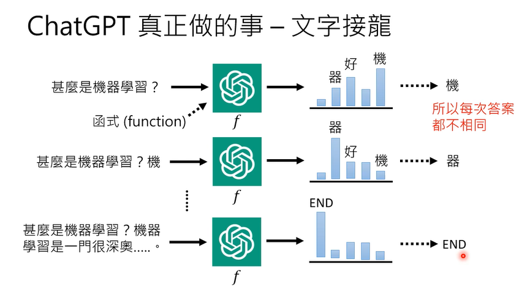

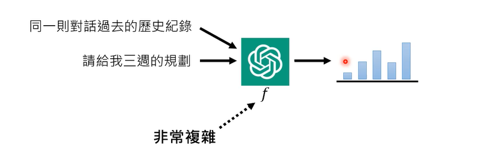

- 而chatgpt训练采用的是网络上的所有数据

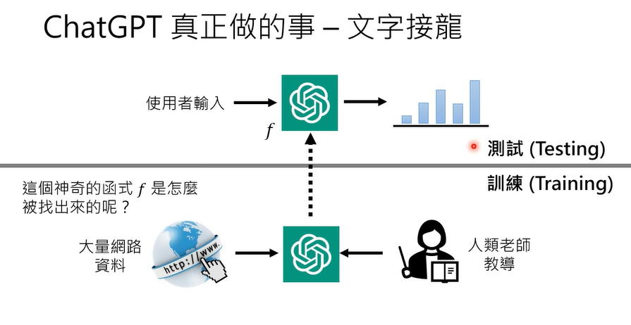

## 2. 预训练

GPT=>Generative Pre-trained Transformer

### 2.1 一般的机器学习如何学习

采用监督学习，成对的资料

### 2.2 将监督学习用到ChatGPT上

给定成对的资料用于训练

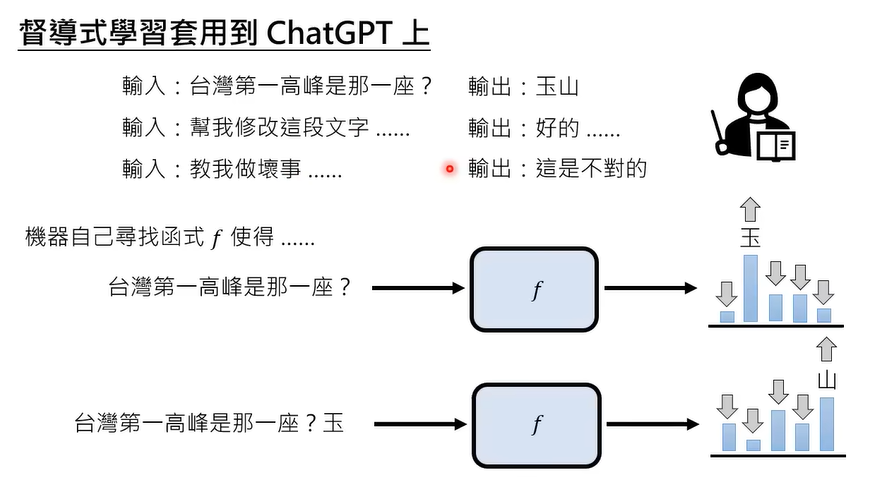

> 假設機器真的根據老師的教導找出函式f·他的能力可能還是非常有限人類老師可以提供的成對資料是有限的

比如说要用于输出一个从未学习过的词语，那么很可能输出不了

解决方案是利用网络上所有的文本资料进行分切，前一句用于输入，后一句用于输出，如下所示

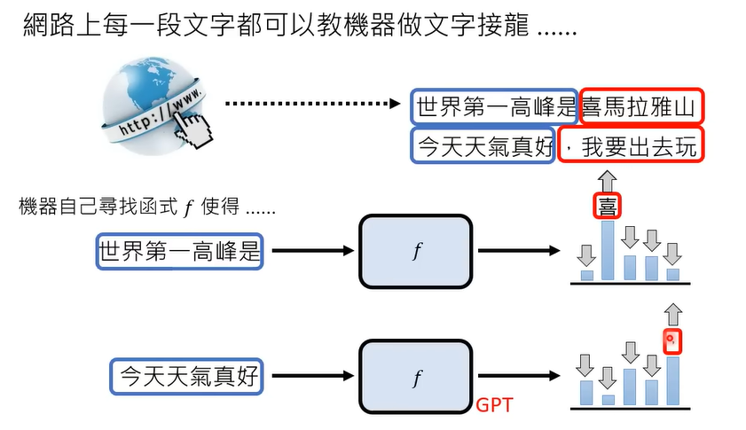

### 2.3 GPT的缺点

- GPT3 不受控制，不一定能明确给出你提问想要的答案

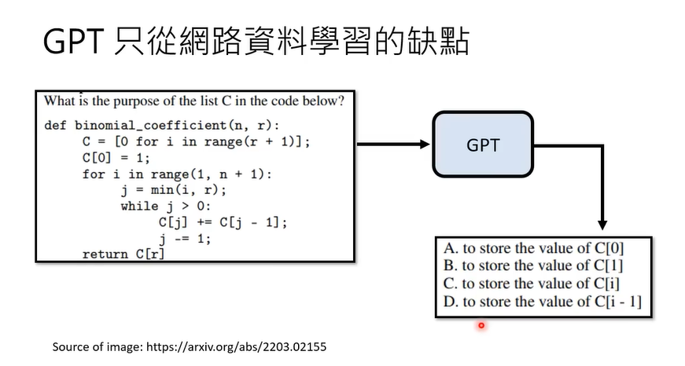

若需要改进这个缺点，那么就需要人类老师做专门做微调

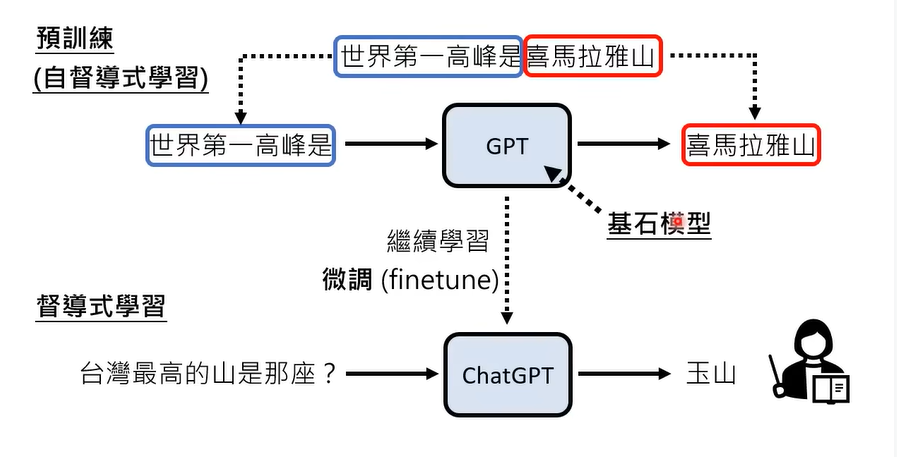

### 2.4 預訓練多有幫助呢？

在多種語言上做預訓練後，只要教某一個語言的某一個任務，自動學會其他語言的同樣任務，实验结果如下所示

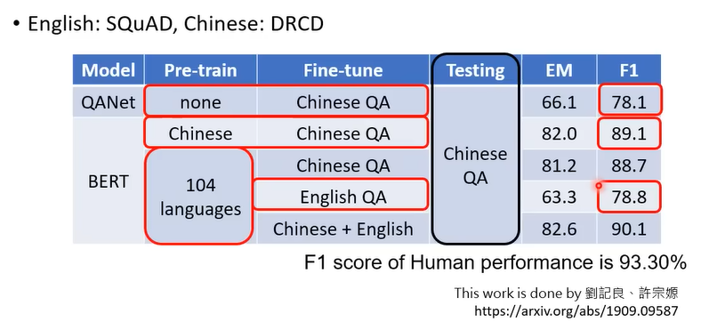

### 2.5 强化学习用于训练

强化学习可在有成对的数据集不多，帮助人工省力的情况下进行

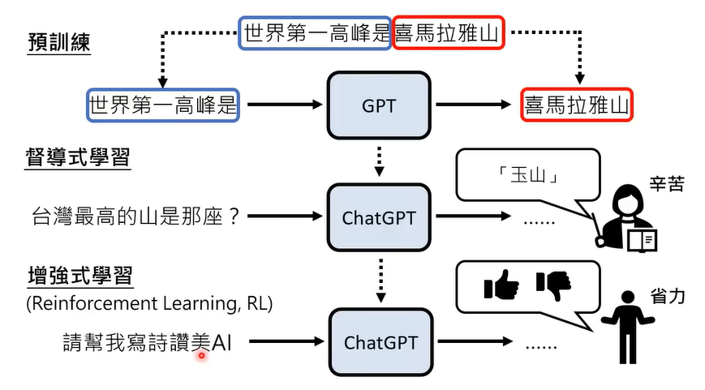

## 3. chatgpt带来的研究问题

### 3.1 如何精确的提出需求

> - https://gitee.com/yunwei37/Prompt-Engineering-Guide-zh-CN
> - https://gitee.com/GoGPTAI/ChatGPT-Prompt

- 對ChatGPT進行「催眠」·在學術界叫做Prompting

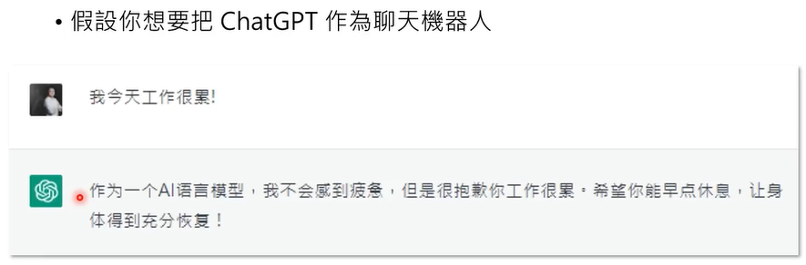

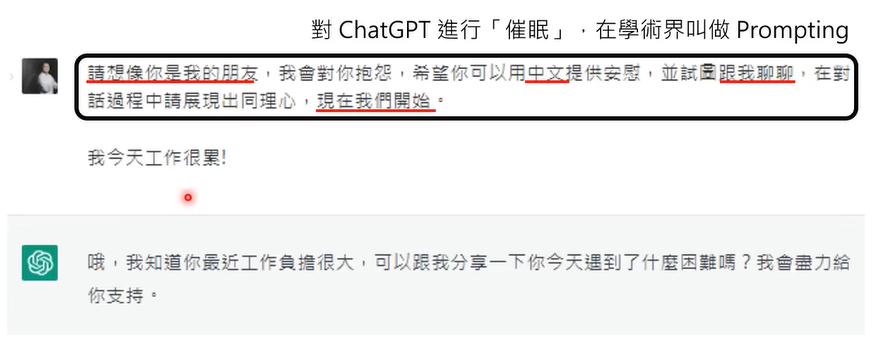

### 3.2 如何更正错误

人类老师去反馈纠正错误

- ChatGPT的預訓l練資料只有到2021年，更改一个错误会使得模型可能会弄错更多的答案

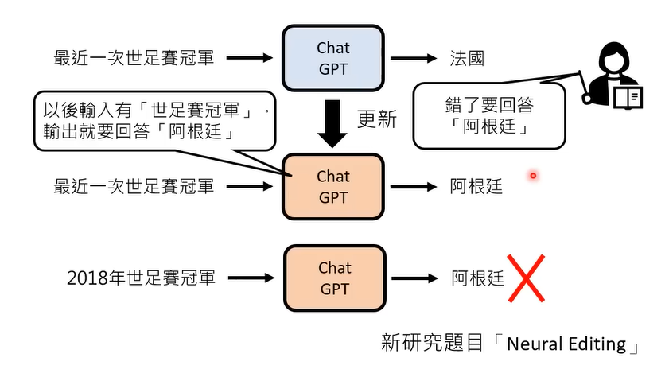

### 3.3 如何判断AI生成的物件

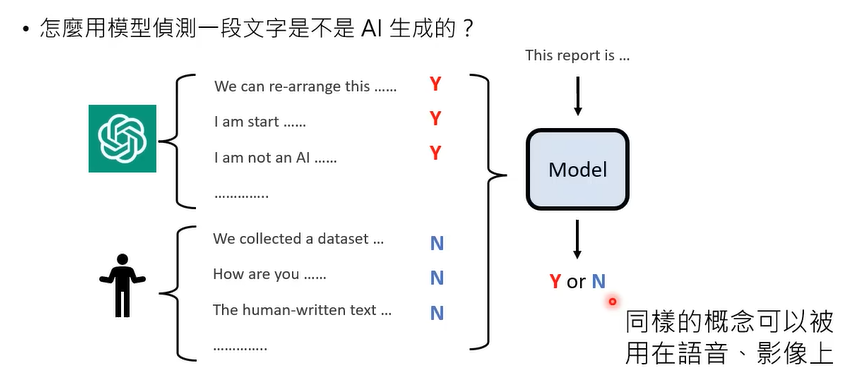

### 3.4 如何保护隐私让模型遗忘

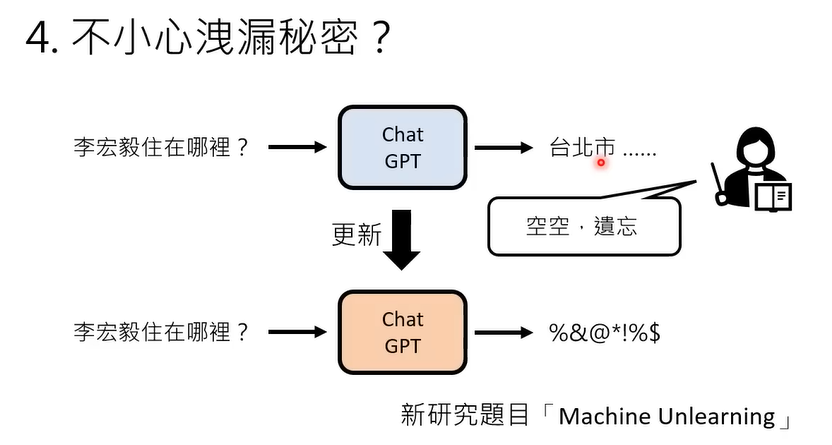

## 4. chatgpt是如何生成的

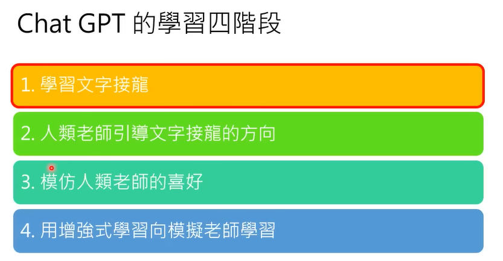

### 4.1 學習文字接龍

文字接龙不需要人类标注，GPT从网络上学习大量文段就可以完成学习

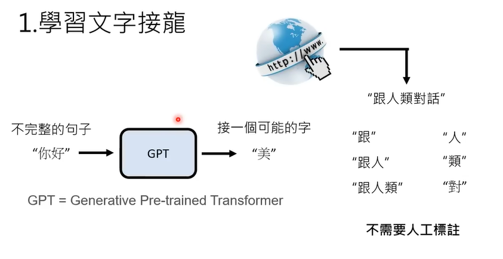

GPT 补出来的文字每一次都是不一样的，概率大的字容易被sample

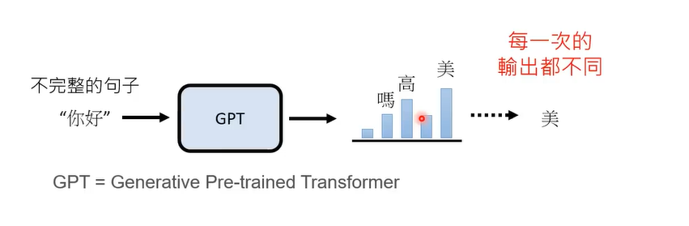

- GPT 文字接龙可以回答问题

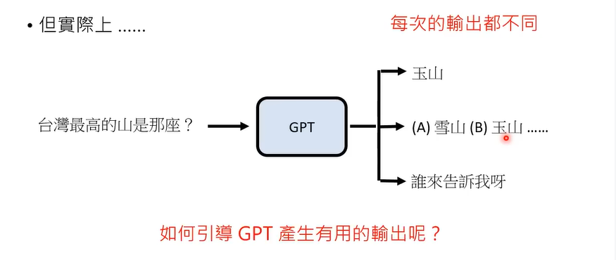

### 4.2 人類老師引導文字接龍的方向

- 找人來思考想問GPT的問題，並人工提供正確答案

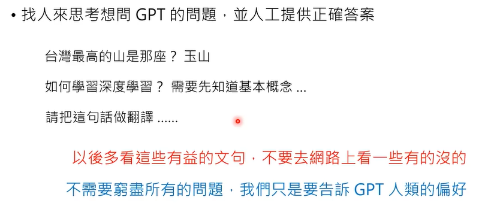

### 4.3 模仿人類老師的喜好

记录人类对GPT产生的答案的偏好去训练一个教师模型用于学习人类偏好，分数高说明人类更加偏向这个答案

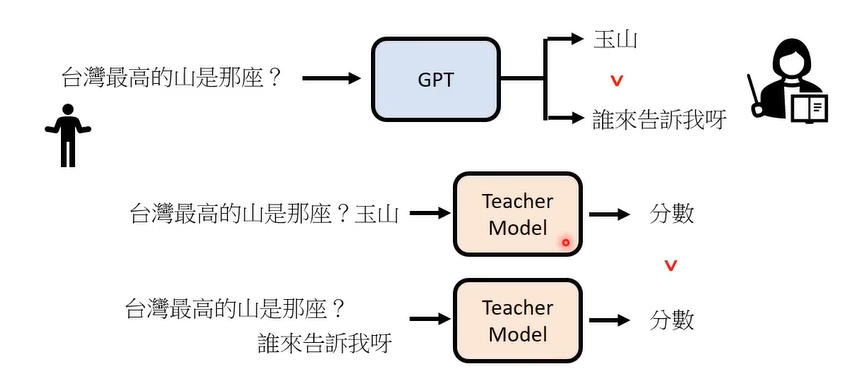

### 4.4 用增強式學習向模擬老師學習

将GPT生成的答案输入教师模型进行评分，所得到的分数即为强化学习的reward

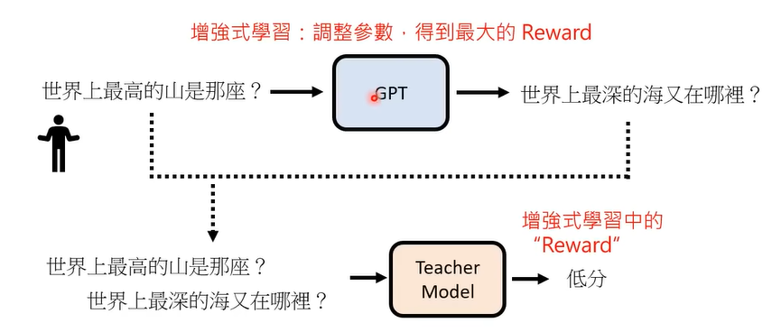

后面根据强化学习后进行训练

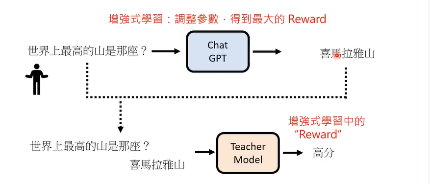