# 【生成式AI】机器学习的原理

> - https://www.bilibili.com/video/BV1TD4y137mP?p=13
> - https://blog.csdn.net/Transfattyacids/article/details/130306827

基础部分可参考前

- [week1](../../week1/李宏毅视频笔记)

### 快速了解機器學習基本原理

**寻找函数的三步骤**
【前置作业】决定要找什么样的函数？（无关技术，取决于要做的应用）
(先放总结)
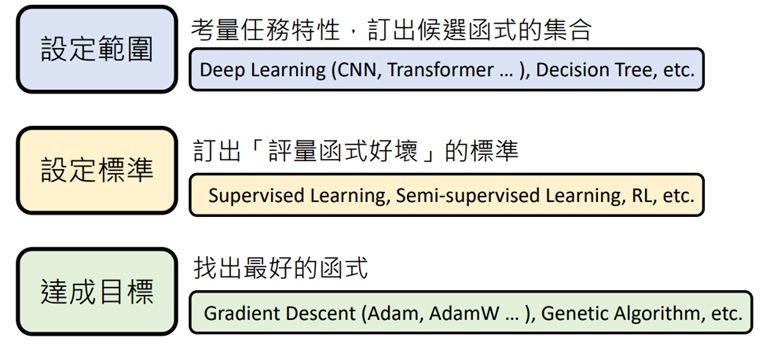

展开来讲：

- **Step1：选定候选函数的集合Model**

深度学习中类神经网络的结构（如：[CNN](https://so.csdn.net/so/search?q=CNN&spm=1001.2101.3001.7020)、RNN、Transformer等等）指的就是不同的候选函数集合，函数集合表示为H

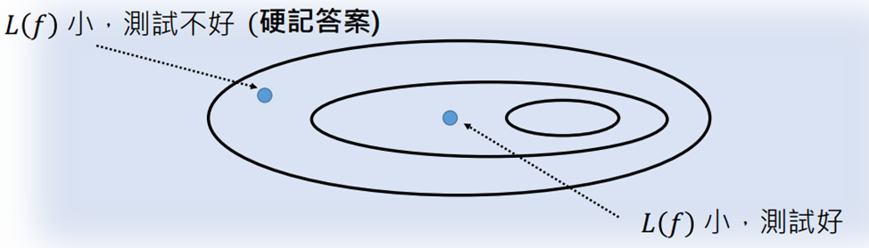

目的：缩小选择的范围；技巧性强
训练资料少时，L(f)小但测试差的函数就会多，这个时候画出集合范围要保守（小）；反之测试数据多时，上述L(f)小但测试差的函数就会少
涉及的拓展知识：Convolutional Neural Network，CNN、Self-attention……

- **Step2：订出评价函数优劣的标准**

使用函数Loss函数，将f做出输入，输入L函数：L(f)，根据输出的大小，评价函数（越大越差）

L的计算过程取决于training data

常用方法：supervised Learning（全部都有标准答案），semi-supervised Learning（没有标准答案，要定义评量标准），RL(reinforcement Learning)等等

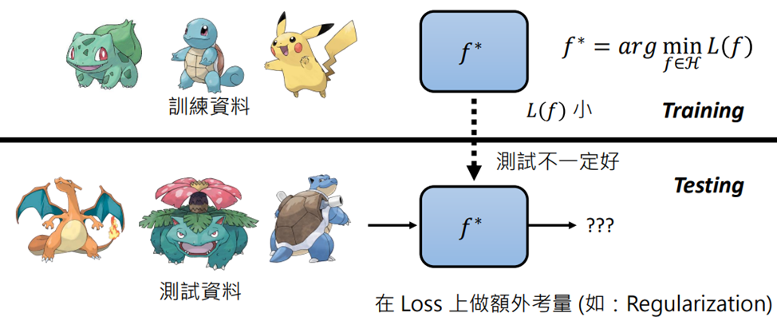

- **Step3：找出最好的函数，最佳化Optimization**

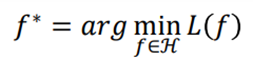

将集合H中的所有函数带入L中，寻找Loss最小值
常用方法：Gradient Descent（Adam，AdamW…），Genetic Algorithm等等
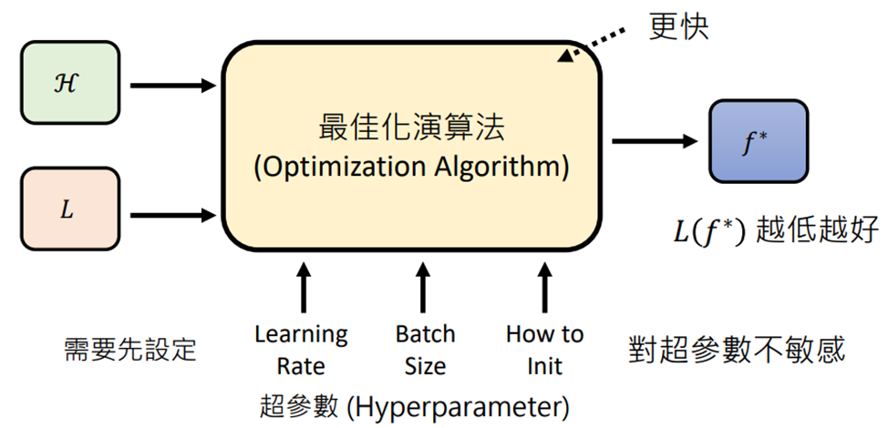
超参数：手调参数

【注意】有时候每一步在选择方法时并不会选择所谓的“最优解”，原因是因为选择的方法的好是 能支援其他步骤
例如：在“设定范围“时，选择Residual Connection，虽然框选出的范围较大，但能在“达成目标”这步时选出真正最好的函数
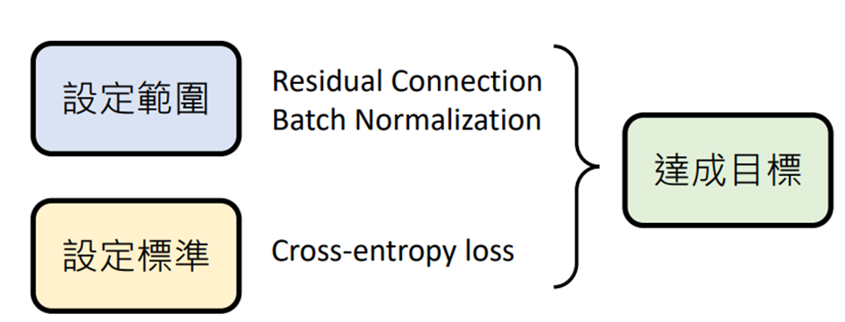

### 生成式學習的兩種策略：要各個擊破，還是要一次到位

生成式学习：生成有结构的复杂物件
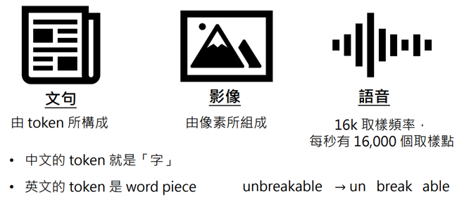

**策略一：各个击破AR（Autoregressive Model）**
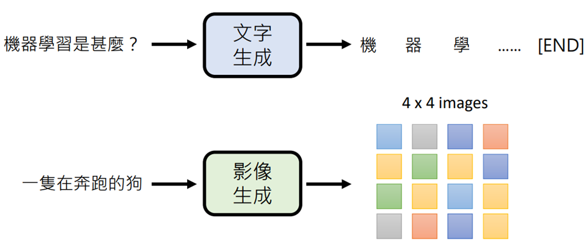

**策略二：一次到位NAR（Non-autoregressive Model）**
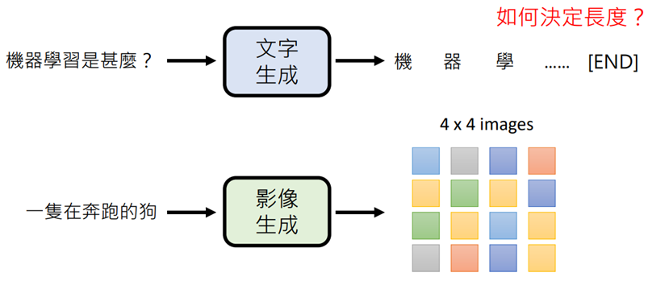

怎么保证生成固定长度的文字？
法一：若100个字前没出现终止符，直接截断
法二：先决定输出100个字，再输出
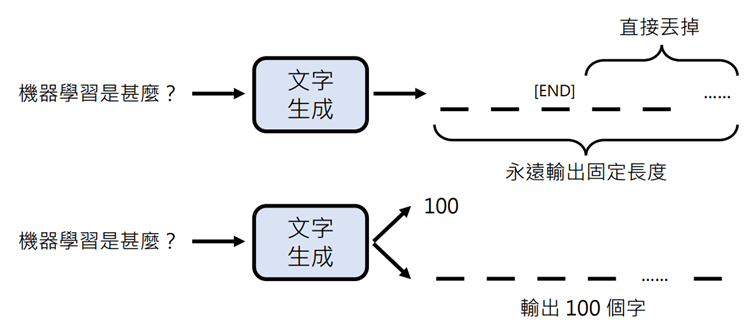
**两个方式比较**

- AR：速度慢，答案质量好，适合生成文字
- NAR：速度快，答案质量较差，适合生成图像

质量比较的解释如下：

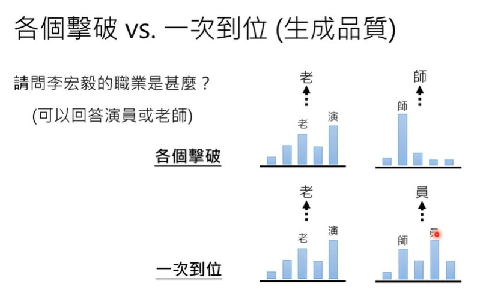

各个击破：在模型输出上进行sample，第一个sample到老后，第二个由于第一个输入了，第二个sample 师的机率就高

一次到位：一次把所有的分布都产生出来，第一个字sample 老、演的机率都很高，而第二个师、员的机率都很高，接下去就开始sample，第一个sample老，搞不好第二个sample员，变成老员不知道说什么，因此效果差

**结合两个方法（取长补短）**

- 以语音合成为例：生成分为两个阶段，AR决定大方向，NAR生成最后产物
  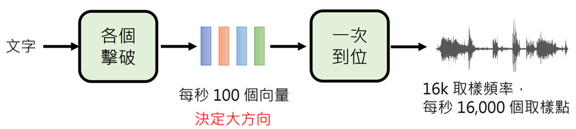
- 将“一次到位”改为“N此到位”（类似Diffusion Model）

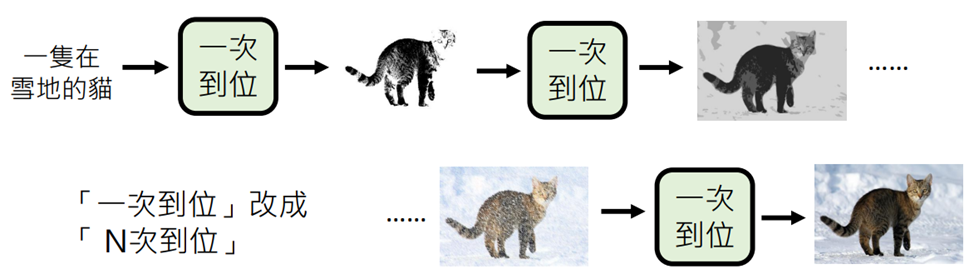

一次到位会比较模糊（因为比如下棋向左向右都可以），在第二次到位的时候，前面大方向已经确定

### 能夠使用工具的AI：New Bing, WebGPT, Toolformer

New Bing是有搜寻网络的，但什么时候进行搜寻是由机器自己决定的，并且也有可能会犯错

没有相关论文，但有类似的WebGPT，论文地址： https://arxiv.org/abs/2112.09332

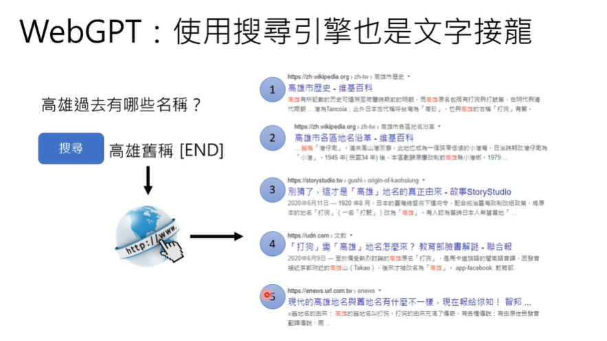

首先这个输入语言可以决定产生一个特别的符号，这个特别的符号代表搜寻，接着搜寻这个文字，搜寻到的相关的文章会有编号，按照搜寻到的结果排序。

有了这样的搜寻结果，webGPT会把这些搜寻结果当作webgpt已经生成的文字。然后接下来就是继续做文字接龙

还有个特别的符号，这个符号代表点选，点选一旦出现就会产生一个数字，这个数字就代表点刚刚搜寻到的第几篇文章然后，把这篇文章全文包含进来作为已经产生的部分（简化的版本，实际上是会选择一个段落包含进来）

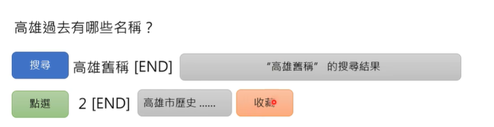

然后根据已经产生的结果再去做文字接龙，在文字接龙里面还有个符号叫做收藏，点了收藏以后，刚才找到的内容就会被收藏下来

接下来webgpt还可以自主决定要不要继续搜寻，也就是说可以搜寻多次

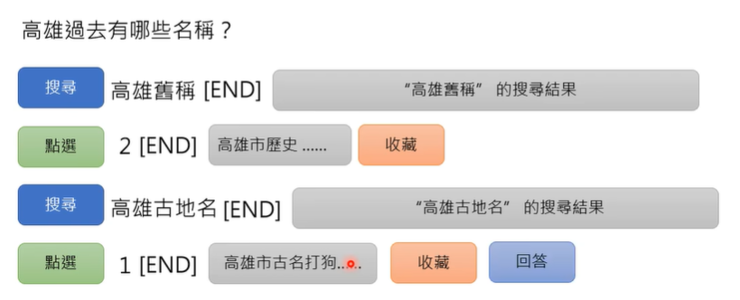

然后当webgpt觉得差不多了就会出现回答，没有点收藏的内容都会消失，就当没产生过

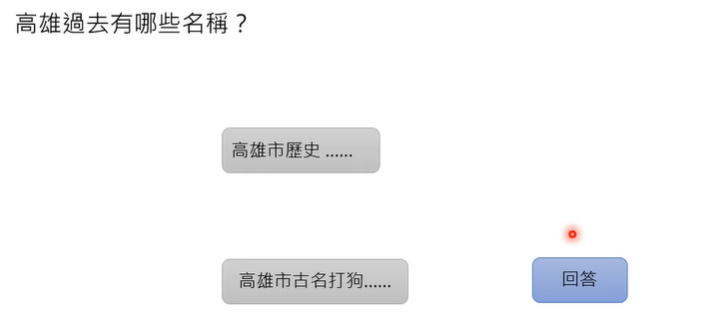

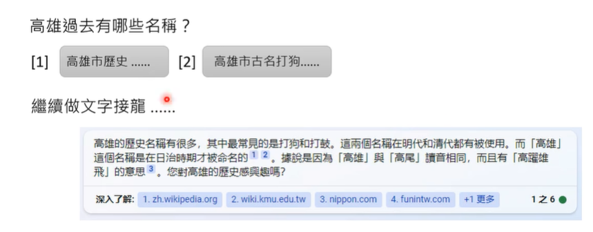

期待继续做文字接龙

WebGPT回答生成过程：

1. 输入”Which river is longer, the Nile or the Yangtze?”（翻译：拿一条河比较长，尼罗河还是扬子江？）
2. WebGPT：提取关键字（如：”Nile vs Yangtze”、”nile length”、”Yangtze length”）
3. 对关键字经行网络搜索，根据算法对搜索网页资料的部分段落进行收藏（注意只收藏文字段落，而不是整个网页）
4. 整理生成答案（答案后会附上引用的网址）

如何训练webgpt？

请老师示范

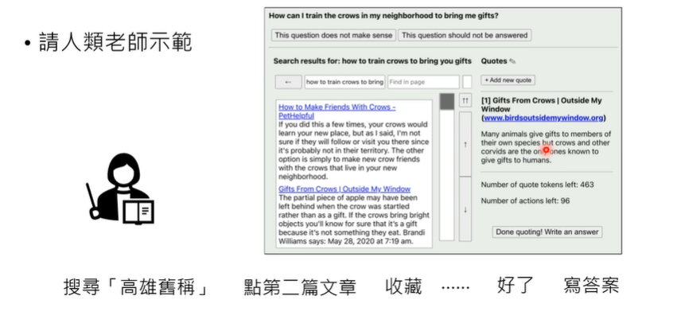

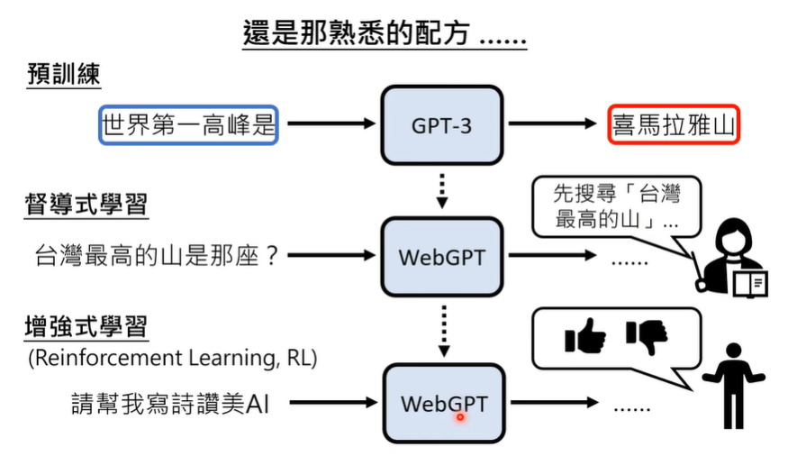

**Toolformer：學習使用工具的 AI**，可以使用多種不同的工具（如搜索网络、计算机、翻译等）
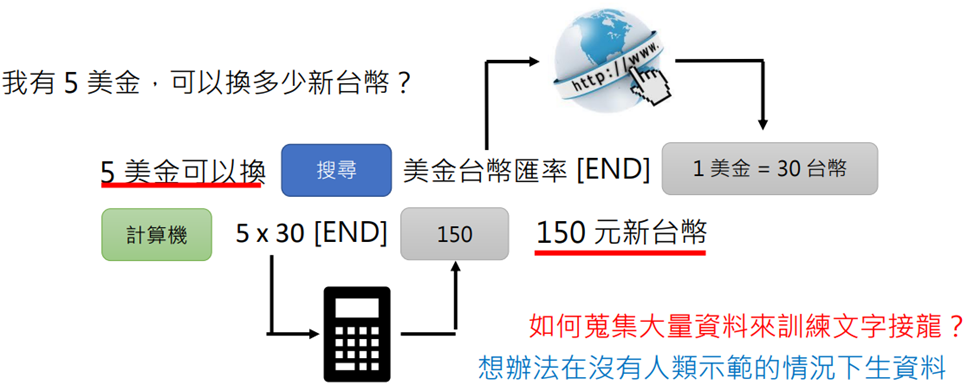

如何在没有人类示范的情况下生成大量资料？

方法一：用另一个语言模型产生资料；

需要给出案例指导GPT3生成案例

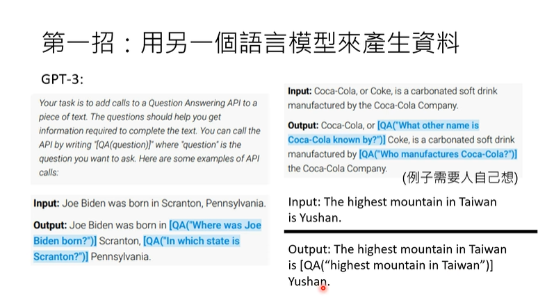

方法二：用第一招产生data去检查塞API指令位置的地方是不是合理的

先把塞入的API指令拿掉，然后把文字丢到现成的文字生成模型里面，然后看看接下来产生正确答案的预算是多少，接下来，有给这个API指令的结果，看这个正确答案的机率是否提高。如果这个API对生成正确答案有帮助就保留该语句

接下来就拿这些句子进行训练，期待在适当的时间产生这些“[ ]”，就可以呼唤API

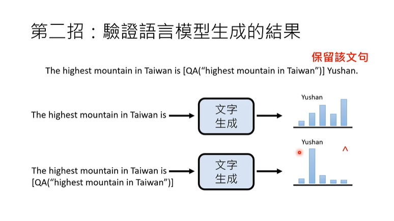

> Q&A:这个呼唤API的时候需不需要产生"[]"里文字

