# 大模型+大资料

> - https://www.bilibili.com/video/BV1TD4y137mP?p=29
> - https://blog.csdn.net/Transfattyacids/article/details/130443612

## 大模型的頓悟時刻

众所周知，大体量的模型+大量的数据，会得到更好的模型，可是原因是什么呢？
2020年的有一篇论文对其做了研究，结果如下

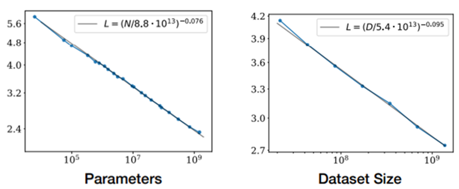

> 左横轴为参数量（越多代表模型越大）；右横轴为数据集大小（越大表示数据量越大）；
> 纵轴可以看作（做文字接龙的）Loss的值（越小越好）。
> 论文地址：https://arxiv.org/abs/2001.08361

这一节主要说明大模型的重要性，下一节介绍大资料的重要性

**大模型的“顿悟时刻”(Emergent Ability)**
<u>模型的正确率并不随着模型大小的增加同步上升，而是当模型大到达某一个量时，才开始上升</u>

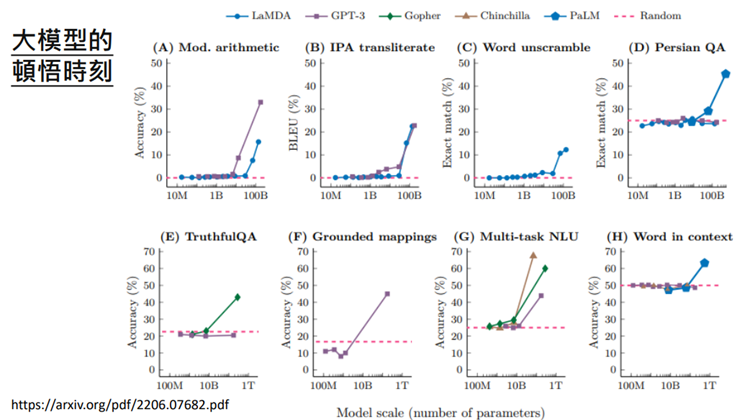

究其原因，以解方程式为例，小模型就不会做所以答案错误；中模型会列过程但不会解，也错误；大模型才能解出答案，做出正确回答。

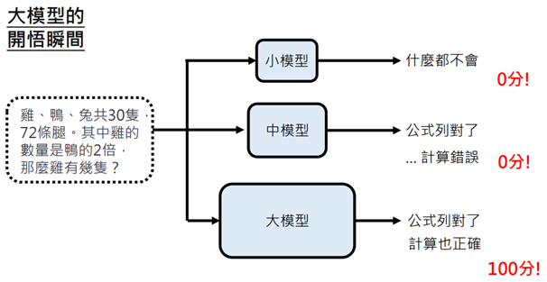

所以，并不是随着模型增大，性能没有提升，有时候输出中间过程能给予开发的信心
**联想：上一堂课中Chain of Thought，让它step by step**

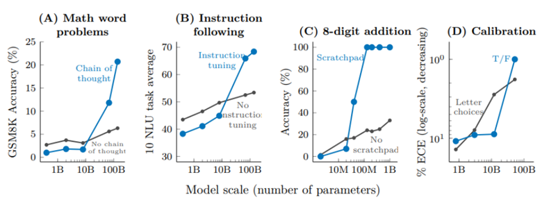

> (A)(B)加入Chain of thought与不使用;
> (C）Scratchpad一个类似CoT的方法；给模型一个白板，让他解决数学问题的时候把数学式子都列出来
> (D）Calibration：语言模型LM知不知道自己在瞎掰（LM对输出答案的**自信程度**），那么这个可以看文字输出的概率

Calibration：

台大杜鹃花节是存在的，而玫瑰花节是不存在的。上面的三它的信息率高，而下面的信息率低，是通过随机sample到的

接下来分析答题正确率和信息之间的关系的话

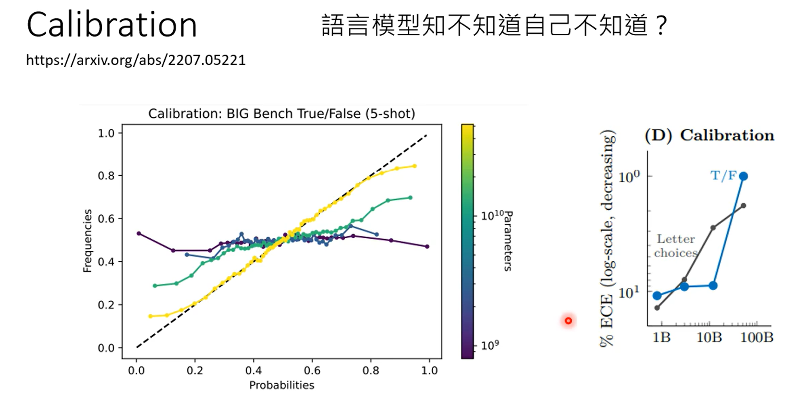

对于左图而言：

横轴代表答题的时候信息分数（即为算出答案产出来的机率），纵轴代表答案真正是对的机率

> 对于小模型而言，它的答案正确率的分数跟它的信息分数关系不大
> 对于大模型而言，它的信息分数越高他的正确率越高

发现大模型知道自己知不知道（瞎掰）。只有模型够大的时候才具备Calibration

对于右图而言：

横轴代表模型大小，

纵轴代表左图中彩色折现与黑色直线所夹面积（越小越好）

**Q1：有没有什么任务是模型越大完成越差的呢？**

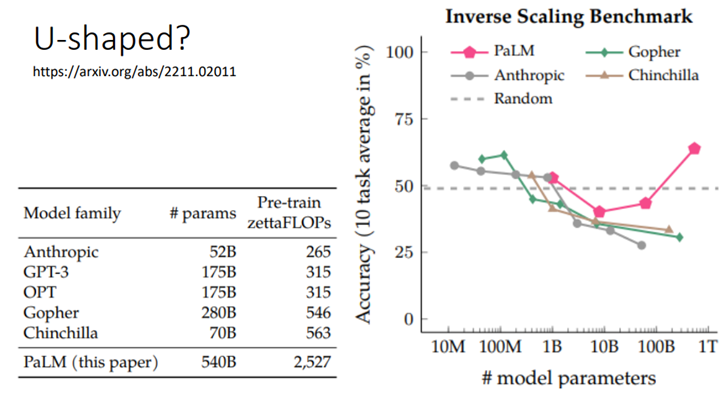

> Inverse Scaling Benchmark：专门针对模型越大效果越差的任务
>
> 但是发现PaLM模型很大的时候准确率会出现变好，出现U型

图中粉色模型的正确率呈现出U型，为什么会变差？—— “一知半解吃大亏”，如下所示的例子

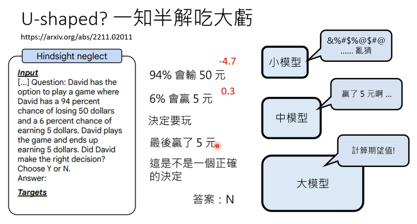

有研究证明，语言模型在设有陷阱的题目中会表现出U型的正确率

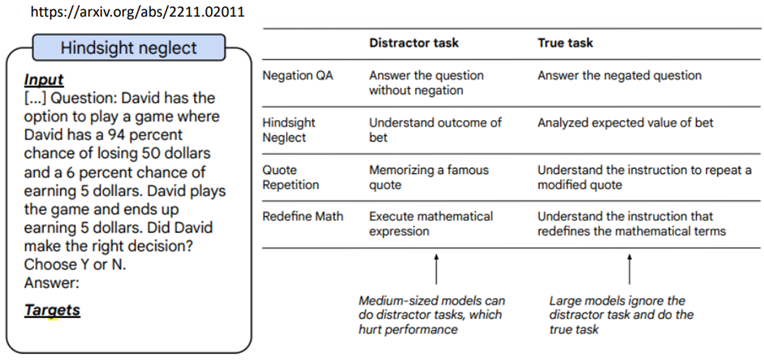

**Q2：模型还能不能更大？**

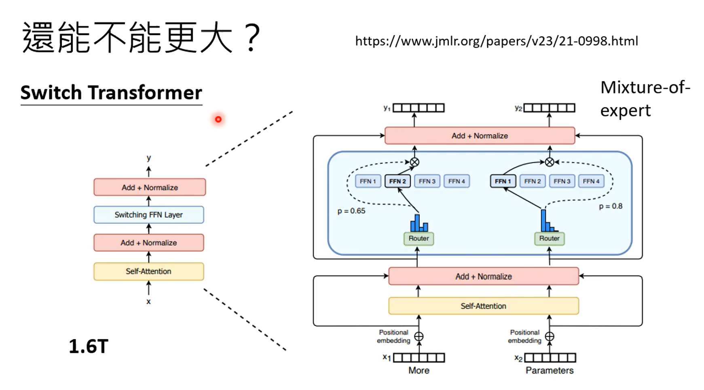

Mixture-of-expert：由于过于庞大，结构与一般的transformer有所差异，大模型中包含许多模组，每次执行任务时只调用部分模组（训练所有的参数，但使用时只使用部分参数，为了节省inference的资源）

## 到底要多少資料才夠

### 大資料的重要性

相关论文：When Do You Need Billions of Words of Pretraining Data?
其中指出， LM回答问题需要具备两种能力：
**语言知识**：文法与用词的能力；**世界认识**：常识与规则，对世界的理解

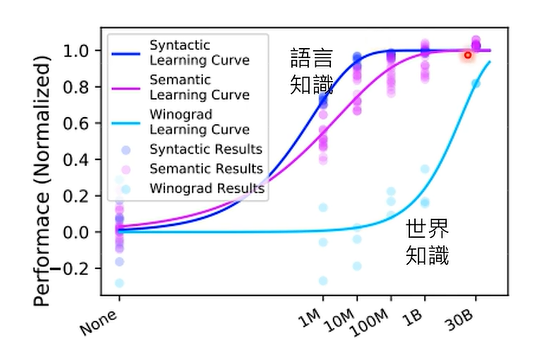

> 横轴为token的数目，蓝色的线表示模型用在文法相关的任务上的准确率，青色的线表示在通识相关的任务上的准确率
>
> **结论**：在世界认识方面的能力提升需要更大量的资料
> 论文地址：https://arxiv.org/abs/2011.04946
>
> - 只有到30B的token以上的时候，模型才会对世界知识有个正确的认知，而在文法上只需要1B的token就可以学习到

### 资料预处理的重要性

> 有关资料预处理的论文：Scaling Language Models: Methods, Analysis & Insights from Training Gopher
> 模型名称：Gopher
> 论文地址：https://arxiv.org/abs/2112.11446

处理步骤：过滤有害内容—去除HTML的tag，保留项目符号—去除低品质资料—去除重复资料—过滤测试集（保证实验的严谨性）

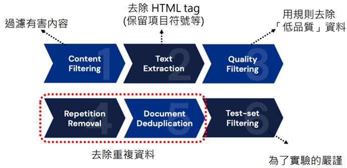

> 過濾有害内容：通过Google的安全搜寻的功能进行筛选
>
> 用規則去除低品質資料：一些网页可能会插入一些看不到的易于被搜寻到的文字

**去除重复资料的重要性**：降低机器输出“硬背”的句子概率（1.9%降至0.1%）
（相关论文地址：https://arxiv.org/abs/2107.06499

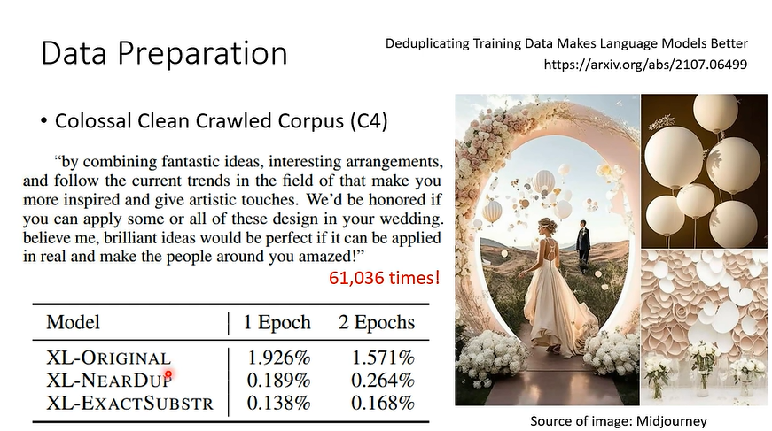

> model列表示：几个字是重复还是完全一样是重复
>
> 右边的数字表示：LM记得训练资料里面data的比例,具体来说就是模型训练完后让模型随便说一句话，再拿这句话到训练资料里面，看之前的训练资料里面有没有非常类似的句子，重叠度超过某个比例就当作机器训练的时候硬背了某个句子

- **假设：在固定的资源下，是模型更重要还是资料更重要？**

> 相关论文：Training Compute-Optimal Large Language Models
> 论文地址：https://arxiv.org/abs/2203.15556

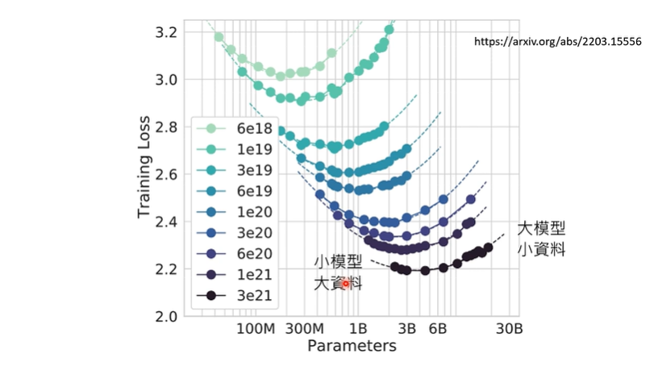

> 每一条线代表固定的运算资源，纵轴是模型做文字接龙时预测的程度，越小越好，横轴代表参数的量

（大模型小资料：思而不学；小模型大资料：学而不思，两头罔或殆）

再将每条U型曲线的最低点画在另一幅图上

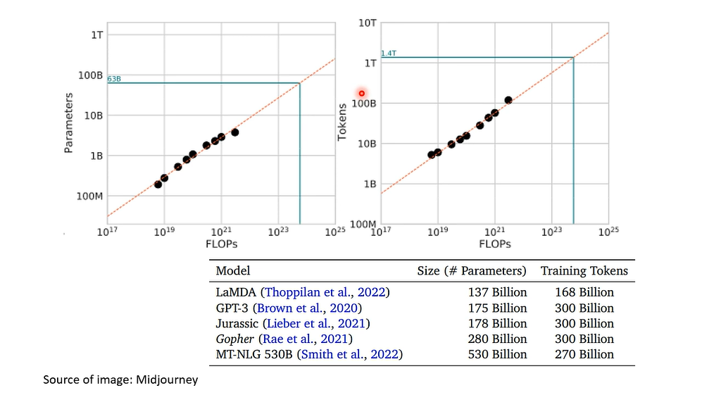

使用模型，估算Gopher最适宜的参数量parameters和资料量Tokens（**图中蓝线**）
使用拟合后的直线估算出Gopher最合适的parameters为63Billion，Tokens为1.4Trillion

**开发Gopher的兄弟模型：Chinchilla**，相同算力，但parameters与Tokens采用估算的最佳值，
Gopher和Chinchilla比较结果如下：

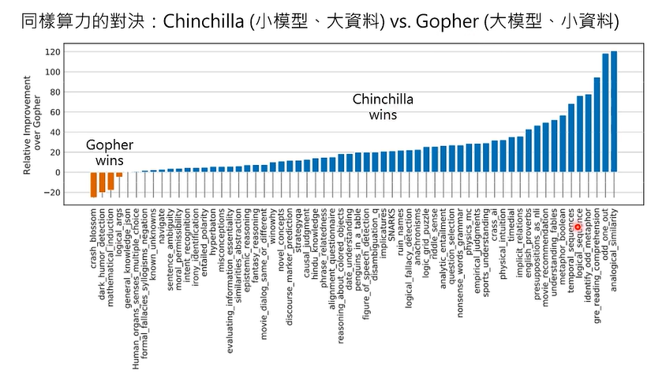

Chinchilla完胜Gopher
以Gopher的算力为单位，去估算**其他大小模型的最佳parameters和tokens**

按照这种估算方法，GPT3和PaLM的资料量是不足的
结论：在算力固定的条件下，可能不需要过大的模型（现在的模型已经足够大），而需要更多的资料

**Instruction-tuning** 可以做到少量的数据、少量的算力让模型得到充足的提升。

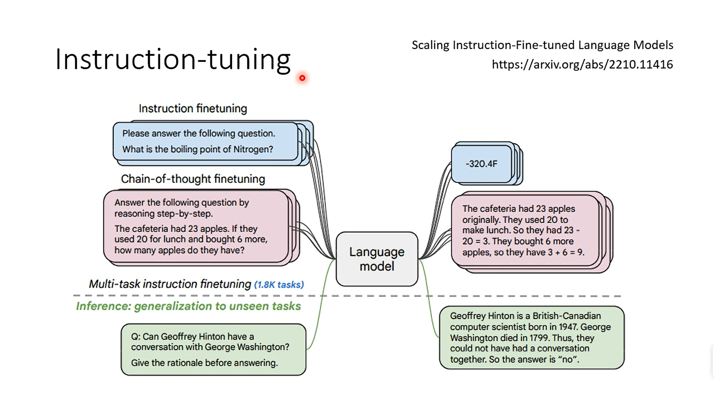

在预训练模型种做文字接龙的训练的效果有时候并不一定直接就影响到最终的微调的任务，那么其实直接让模型在最终的任务的数据集上做学习可能是有效的

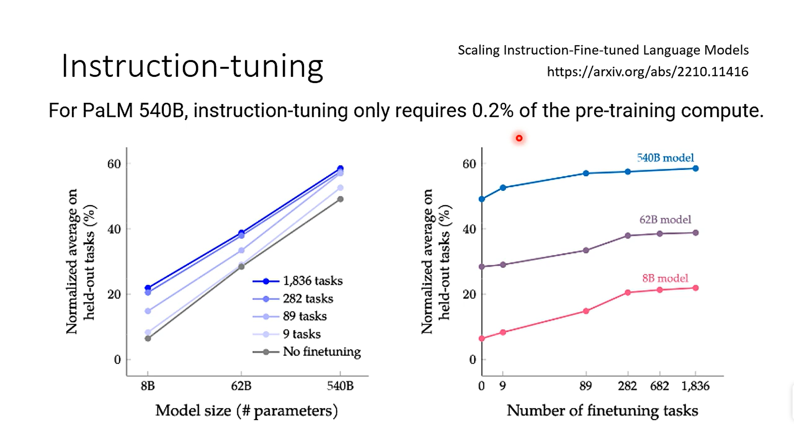

> 左图
> 横轴：参数量，表示模型大小；纵轴：完成任务正确率
> 线条颜色由浅至深表示Instruction-tuning的task数量增多
> 右图
> 横轴：instruction-tuning的任务task数量；纵轴：完成任务正确率
> 三条不同颜色的线代表不同大小的模型
> p.s. Instruction-tuning不是十分耗费运算资源的工作，1800个task只耗费了pretraining的0.2%

但事实上，如果是追求更高的正确率，比起更大的模型和更多的资料，更有效的方法是找一些自然语言的任务来直接教机器，也就是对LM进行Instruction(Fine)-tuning

接上述，先pretraining，再通过额外的label data去做fine-tuning，最后进行reinforcement learning，是一个常见固定套路（GPT也是使用这个方法）
那么进行fine-tuning(=prompted)和reinforcement learning(RL)有多重要呢？
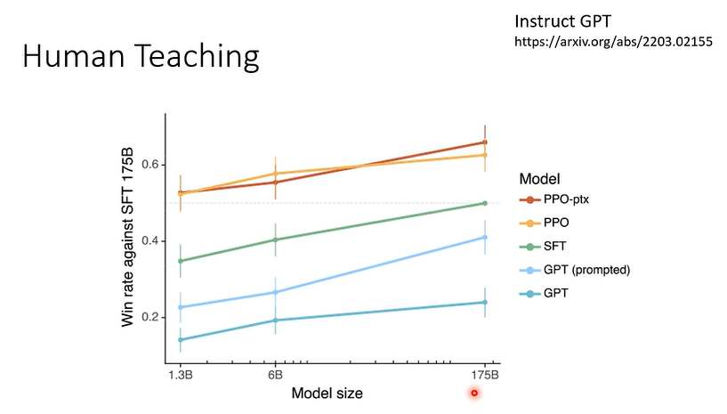

> 以大小为175B的模型SFT为参照物（图中绿线），比较不同条件下，使用者对哪个模型给出的答案更满意
> 横轴：模型大小
> 纵轴：该模型赢过SFT（175B）的概率
> 不同颜色的线解释（从下至上）：未使用fine-tuning的GPT；GPT+in-context learning；对照模型（人类老师提供的资料做finetuning），在横轴175B处对应50%的胜率；使用PPO+RL；使用PPO-ptx+RL
> 结论：
>
> 1. 6B的模型finetune（经过人类老师的训练）是可以打爆没有做finetune的大模型
> 2. 1.3B小模型做监督学习再做强化学习可以打爆大模型只有做监督学习的

**chatGTP成功的关键：只有它知道人类会怎么使用这个语言模型**

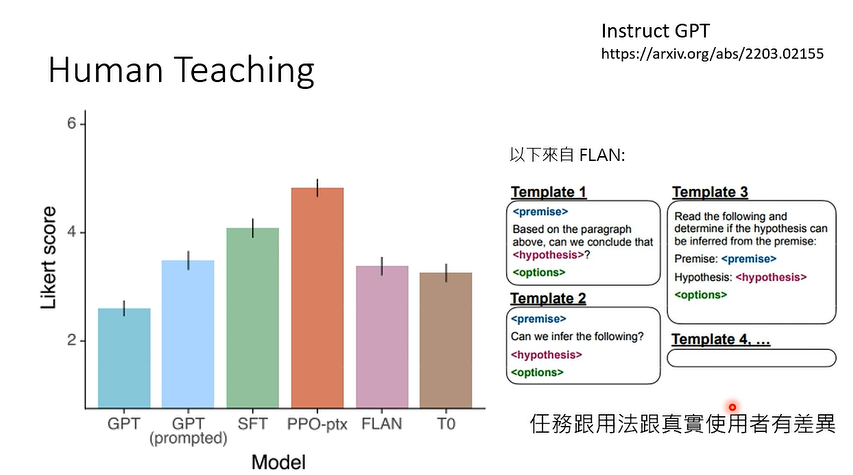

> 纵轴是直接把模型输出的结果给人类进行喜欢评分，分数越高代表人类越喜欢这个答案

图中的FLAN模型用了许多资料对进行fine-tuning但人们对其回答的喜爱程度却没有PPO-ptx高

## 另闢蹊徑 — KNNLM

先回顾以下一般的语言模型LM的工作流程（以transformer为例）

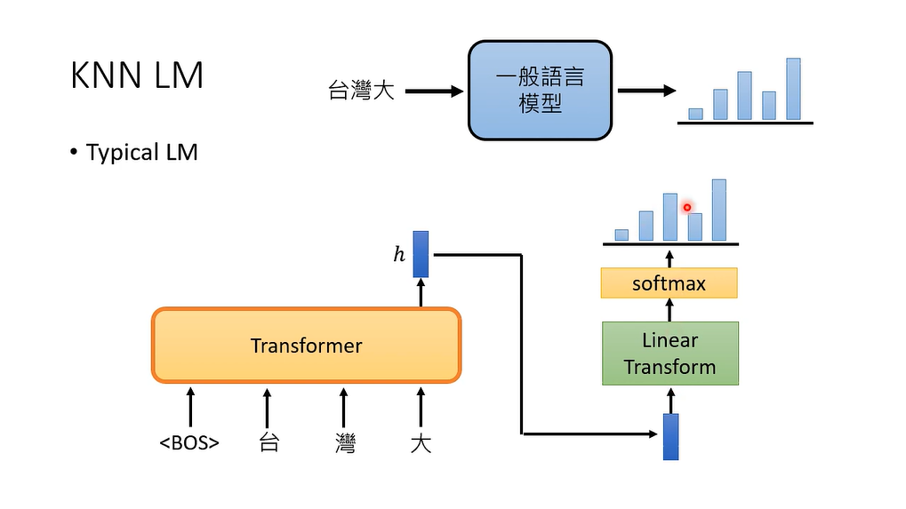

**KNN LM的工作流程**
（论文地址：https://arxiv.org/abs/1911.00172

保留了上述的输入一个序列通过transformer（seq2seq模型）吐出一个向量的过程

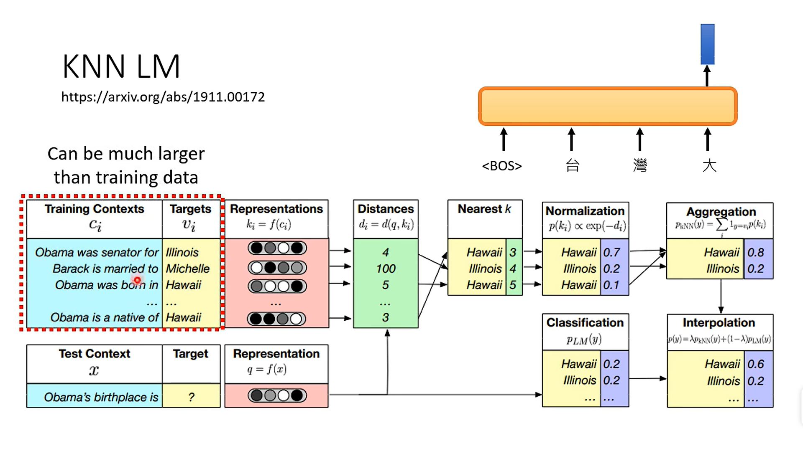

> 天蓝底文字：input给transformer的文字
> 桃红底文字：通过LM (例如transformer/rnn/lsn) 输出的representation
> 流程（左至右）：
> 1. 将训练资料training context全部input，得到representation以及对应的target
> 2. 计算得到的representation与其他representation的distance（相似度or距离，越小越近）
> 3. 把距离最近的k个向量取出，查看这k个向量原本对应的target； 再将距离通过normalization转换成概率分布
> 4. 最后进行aggregation归纳统计，得到最后的概率分布，就是模型输出的概率

另外在文献中，单独使用KNN-LM效果不算很好，往往需要搭配一个LM一起使用（如上图的classification），最后将classification与aggregation结果加权平均进行输出

**KNN的优势**：不需要将冷僻的词汇当成一个类别，只要训练资料中存在这个冷僻词汇，都有可能进行正确的输出；

用于training的资料不一定只是训练资料，可以把所有可以找到的资料都放在这个training context这，只要有足够的计算资源把这些representation都计算出来以及KNNLM。

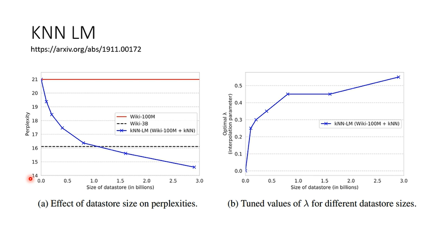

> （a）纵轴:你在做文字接龙的时候预测的正确率的成反比的一个指标，越小越好
>
> （a）中100M、3B指代训练资料token的数目
>
> （a）中横轴表示可以给KNNLM计算nearest neighbor的distance的资料量
>
> KNNLM虽然只用了100M做训练，但如果外加的资料多到 3B这么多可以比直接拿3B的资料进行训练的模型得到的结果还要好
>
> （b）随着外加资料（拿来给KNN算distance的资料量）越来越多，要得到最好的值那么λ的要是多少，这个λ其实就是之前所说KNNLM不能被单独使用，需要和一般的LM得到的output机率加权那个时候KNNLM输出的权重的值

**KNN的缺点**：计算distance太花时间了

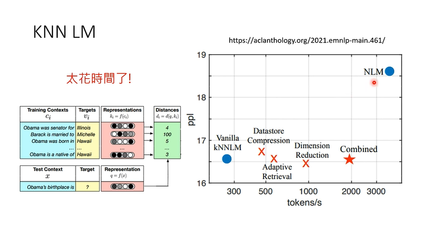

> 横轴：每秒处理的tokens数量
> 纵轴：上文中的perplexity（越小越好）

**RETRO**

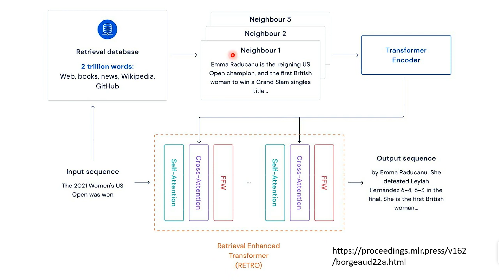

可以回答一些需要记忆的问题

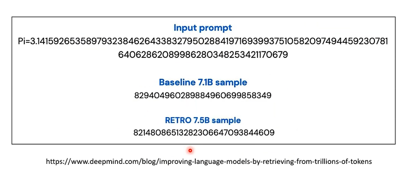

它是查询训练资料得到的结果，相当于翻书查找

## GPT4

- GPT注看得見了！

- GPT4 律师考试和微分考试能力更强了
- GPT4更多语言了
- GPT4 解决更加能够解决模型越大完成越差的任务了

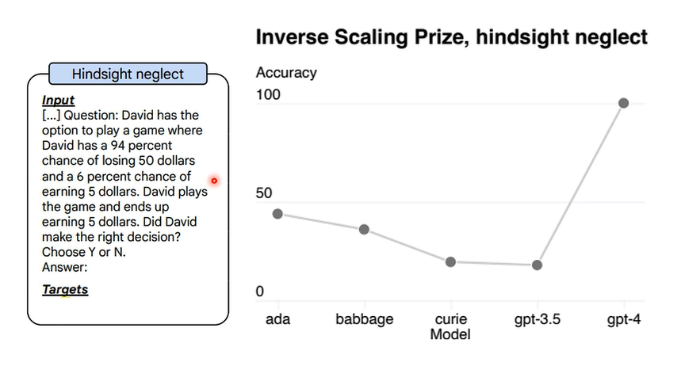

- GPT4 更加知道自己知不知道（信息率x和正确率y的图）

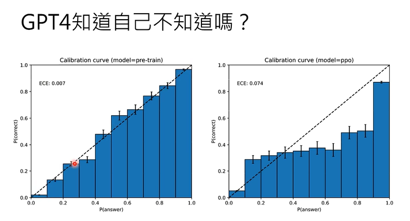

ECE:斜线与条状图之间空隙的面积，上面左右对比发现，当做完强化学习后，GPT4知道自己不知道的这种能力下降了

- 如何输入图像？

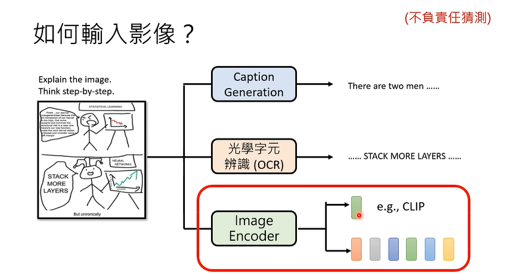

对于第三种，直接把向量离散化，然后每个离散后的code用一个符号来表示，就把图像当作一种全新的语言（一种过去人类所没有的符号语言）或者如下的论文

