# 词的分布式表示

> - https://zhuanlan.zhihu.com/p/449657906
>
> - https://blog.csdn.net/weixin_44388679/article/details/101221873

## 1. 文本表示方法分类

### **离散表示**

1. one-hot表示
2. multi-hot表示

### **分布式表示**

(1) 基于矩阵

1. 基于降维的方法
2. 基于聚类的方法

(2) 基于神经网络

1. CBOW
2. Skip-gram
3. NNLM
4. C&W

## 2.文本离散表示：词袋模型与TF-IDF

### 1. 文本表示：词袋模型

文本可以看作是一句话，或者几句话组成的短文本。文本表示就是将一段短文本表示为向量。

词袋模型是一种非常经典的文本表示。顾名思义，它就是将字符串视为一个 “装满字符（词）的袋子” ，袋子里的 词语是随便摆放的。而两个词袋子的相似程度就以它们重合的词及其相关分布进行判断。

举个例子，对于句子：

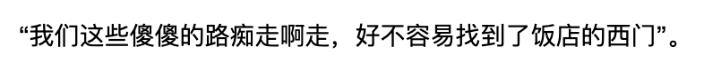

我们先对语料库进行分词，去重，排序，将所有出现的词储存为一个词典。假设词典为：

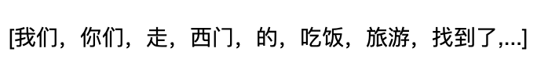

**然后依据 “词语是否出现在词典中” 可以将这句话变为这样的向量：**

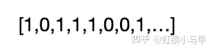

其中向量的每个维度唯一对应着词典中的一个词。比如第一个维度对应词典中的'我们',而该句子中出现了我们这个词，所以该维度取值为1。可见这个向量的大部分位置是0值，这种情况叫作“稀疏”。为了减少存储空间，我们也可以只储存非零值的位置。

在实际应用中，这种方法还是比较常用的。

**词袋模型的优点**

> \1. 简单，方便，快捷
> \2. 在语料充足的情况下，对于简单的自然语言处理任务效果不错。如文本分类。

**词袋模型的缺点**

> \1. 其准确率往往比较低。凡是出现在文本中的词**一视同仁**，不能体现不同词在一句话中重要性的不同。
> \2. 无法关注词语之间的**顺序关系**，这是词袋模型最大的缺点。如“武松打老虎”跟“老虎打武松”在词袋模型中被认为是一样的。

### 2. 文本表示：TF-IDF

文本可以看作是一句话，或者几句话组成的短文本。文本表示就是将一段短文本表示为向量。TF-IDF是对词袋模型的改进。

不仅考虑词语是否出现，还考虑其出现的次数或频率(TF)。

还是上例中的句子："我们这些傻傻的路痴走啊走，好不容易找到了饭店的西门"。

假设词典是：[我们，你们，走，西门，的，吃饭，旅游，找到了,...]，则该句的TF表示为：[1,0,2,1,2,0,0,1,…]。比如，'走'这个词在词典的第三个位置，在该句子中出现过，并且出现了2次，所以该句向量的第三个位置的值是2。与之前不同的是，不仅仅考虑其是否出现0/1，还考虑出现了几次。当然该值可以是词在句子中出现的次数，也可以是词在句子中出现的频率(更常用，该词在句子中出现的次数比上句子中所有词出现的次数之和。)。

但是仅仅考虑词在文本中出现的次数或频率(TF)有一个问题：比如“的”这个词占了词频的很大的比重(一般在文本中会多次出现)，而它**对确定文本信息几乎没什么用**。所以我们应该忽略掉这些词，取消掉它们的影响。像这类词，我们称之为**停用词**。一种方法是**维护一个停用词表**，对文本(以及语料库，词典)做一个预处理，过滤掉其中的停用词。但这种方式太粗暴。

改进方式：**一个词预测主题的能力越强（与主题的关联程度），权重越大，反之，权重越小**。在网页中看到“原子能”这个词，或多或少能够了解网页的主题，而看到“应用”一词，则对主题基本上还是一无所知。因此，“原子能”的权重应该比应用大。 容易发现，如果一个关键词只在很少的网页出现，通过它就容易锁定搜索目标，它的权重也就应该比较大。反之，如果一个词在大量的网页中出现，看到它仍然不清楚要找什么内容，因此它的权重应该小。（比如你在搜索“python gensim”，“python”这个关键词会在很多的网页中出现，内容可能是python入门介绍，python官网，python应用，而“gensim”却只会在相对比较少的网页中出现，一般为gensim的官网，gensim的安装教程，gensim的学习笔记等，而后者是我们更倾向于看到的内容）。这就是接下来要介绍的IDF。

不仅考虑这个词在当下文本/文档中出现的频率，还考虑出现该词语的文档数占总文档数的比例（DF）。其基本假设是**如果一个词语在不同的文档中反复出现，那么它对于识别该文本并不重要**。如高频词“我们”、“那么”，“的”之类。

#### 公式部分

逆文档频率(IDF)的公式：

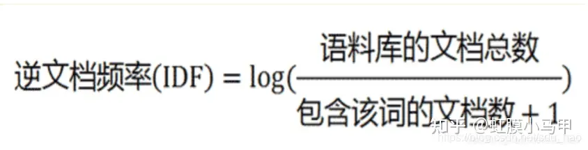

**TF-IDF = TF*IDF**

TF-IDF的概念被公认为信息检索中最重要的发明。在搜索，文献分类，与其他相关领域有广泛的应用。

所以，我们可以使用TF-IDF来进行文本表示：

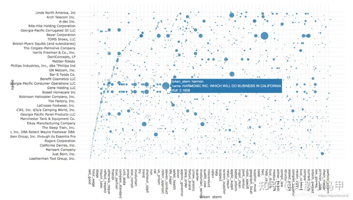

上图的纵轴表示**各个文档/文本**，横轴表示**词典**(综合所有文档/文本构成一个巨大的语料库，对语料库进行分词(中文需要分词，英文按照空格切分就好)、去重，排序，得到词典)中的单词。**每一行对应一个文档/文本的向量表示，维度与词典的大小相同，对于文本中的某个词，计算它的TF-IDF值，然后填入向量的相应位置(对应该词在词典中的索引)。**

单纯使用TF表示时，需要对文本进行预处理如去除停用词；综合使用TF-IDF表示时，可以不用去除停用词(虽然停用词的出现频率TF很大，但IDF很小，TF-IDF也很小)，当然也可以去掉。

## 3. 文本分布式表示：word2vec

> 还可参考 [笔记](../LLM/清华NLP/word2vec.md)

### 1. 基于SVD 降维的表示方法

这是一种构造词散入（即词向量)的方法，我们首先会遍历所有的文本数据集，然后统计词出现的次数，接着用一个矩阵X来表示所有的次数情况，紧接着对X进行奇异值分解得到一个$USV^T$的分解。然后用U的行（rows)作为所有词表中词的词向量。对于矩阵X,我们有几种选择，自们一起来比较一下

1.1 词·文档矩阵

最初的想法是。我们猜测相互关联的河组同时出现在相同的文件中的概率很高。例如，“银行”、“债券”、“股票”、“钱“等都可能出现在一起。但是，“银行”、“章鱼”、“香蕉”和”曲棍球“可能不会一直一起出现。基于这个想法，我们建立一个词组文档矩阵X,具体是这么做的：遍历海量的文件，每次词组i出现在文件j中时，将Xij的值加1。不过大家可想而知，这会是个很大的矩阵$R^{|V|*W}$,而且矩阵大小还和文档个数M有关系。所以咱们最好想办法处理和优化一下。

1.2 基于的窗口的共现矩阵X

我们还是用一样的逻辑，不过换一种统计方式，把矩阵X记录的词频变成一个相关性矩阵。我们先规定一个固定大小的窗口，然后统计每个词出现在窗口中次数，这个计数是针对整个语料集做的。可能说得有点含糊，我们一起来看个例子，假定我们有如下的3个句子，同时我们的窗口大小设定为1（把原始的句子分拆成一个一个的词)：

1.I enjoy flying.
2.I like NLP.
3.I like deep learning.由此产生的计数矩阵如下：

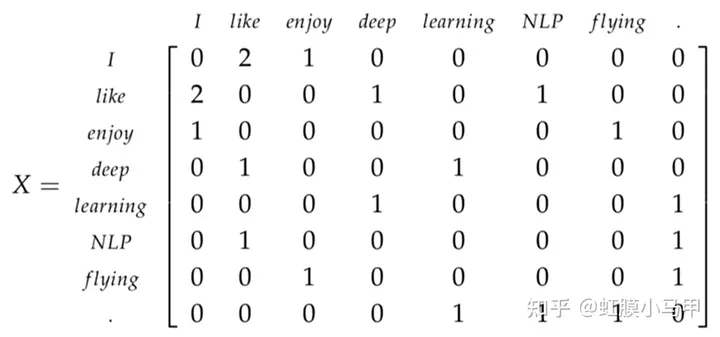

然后我们对X做奇异值分解，观察观察奇异值（矩阵的对角元素），并根据我们期待保留的百分比来进行截断（只保留前k个组度）：

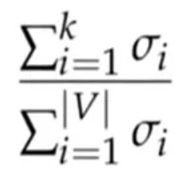

然后我们把子矩阵$U_{1:|V|,1:k}$视作我们的词嵌入矩阵。也就是说，对于词表中的每一个词，我们都用一个k雄的向量来表达了。

对X采用奇异值分解

通过选择前K个奇异向量来进行降维：

这两种方法都能产生词向量，它们能够充分地编码语义和句法的信息，但同时也带来了其他的问题：

- 矩阵的维度会经常变化（新的词语经常会增加，语料库的大小也会随时变化）。
- 矩阵是非常稀疏的。因为大多数词并不同时出现。
- 矩阵的维度通常非常高（≈$10^6×10^6$）
- 训练需要$O(n^2)$的复杂度（比如SVD)
- 需要专门对矩阵X进行特殊处理，以应对词组频率的极度不平衡的状况

当然，有一些办法可以缓解一下上述提到的问题：

- 忽视诸如he”、“the”、"has"等功能词。
- 应用"倾斜窗口”(ramp window),即：根据文件中词组之间的距离给它们的共现次数增加相应的权重
- 使用皮尔森的相关性(Pearson correlation),将0记为负数，而不是它原来的数值。

### 2. 神经网络的表示方法

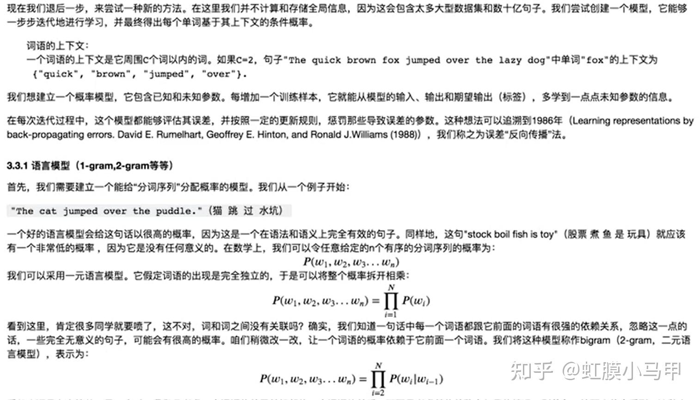

#### 1. 连续词袋模型(CBOW)

有种模型是以'The',"cat”,'over',"the',"puddle)为上下文，能够预测或产生它们中心的词语'jumped',叫做连续词袋模型。
上面是最粗粒度的描述，咱们来深入一点点，看点细节。
首先，我门要建立模型的一些已知参数。它们就是将句子表示为一些one-hoti向量，作为模型的输入，咱们记为x(c)吧。模型的输出记为y(c)吧。因为连续词袋模型只有一个输出，所以其实我们只需记录它为y。在我们上面举的例子中，y就是我们已经知道的（有标签的）中心词（如本例中的'jumped')。

好了，已知参数有了，现在我们一起来定义模型中的未知参数。我们建立两矩阵，V∈$R^{n*|V|}$和U∈$R^{|V|*n}$。其中的n是可以任意指定的，它用来定义我们嵌入空间”(embedding space)的推度。V是输入词矩阵。当词语${w_i}$(译注：${w_i}$是只有第i维是1其他维是0的one-hot向量)作为模型的一个输入的时候，V的第i列就是它的n维"嵌入向量”(embedded vector)。我们将V的这一列表示为$v_i$。类似的，U是输出矩阵。当$w_j$作为模型输出的时候，U的第j行就是它的n维"嵌入向量”。我们将U的这一行表示为${u_j}$。要注意我们实际上对于每个词语$w_i$学习了两个向量（作为输入词的向量$v_i$和作为输出词的向量$u_j$）。

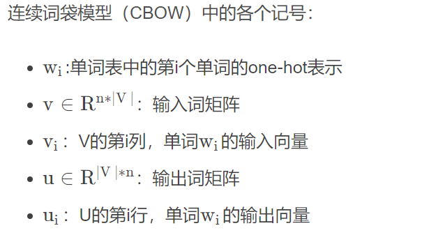

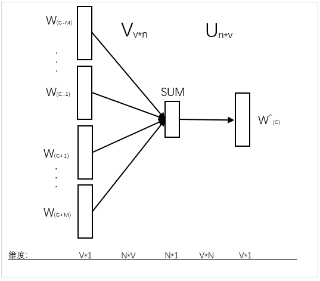

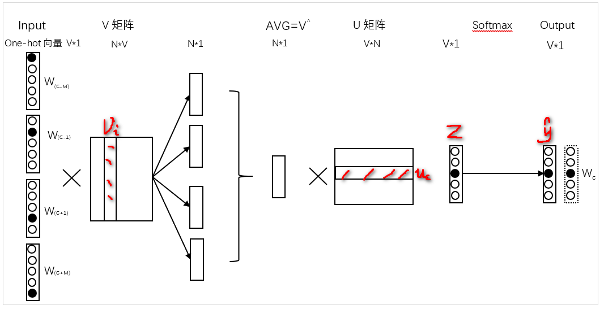

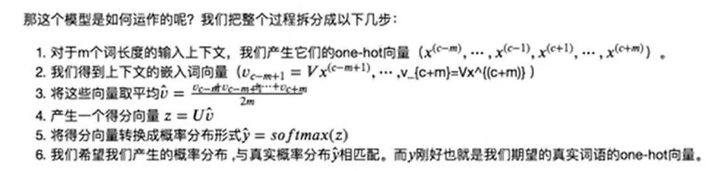

通过上面说的种种步骤，我们知道有了矩阵U、V整个过程是如何运作的，那我们怎样找U和呢？一一我们需要有一个目标函数。通常来说，当我们试图从已知概率学习一个新的概率时，最常见的是从信息论的角度寻找方法来评估两个概率分布的差距。其中广受好评又广泛应用的一个评估差异/损失的函数是交叉熵：

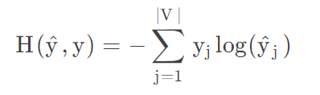

结合我们当下的例子，y只是一个one-hot向量，于是上面的损失函数就可以简化为：

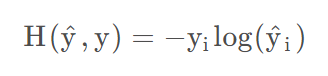

我们用c表示y这个one-hot向量取值为1的那个维度的下标。所以在我们预测为准确值的情况下$\hat y_c=1$。于是损失为-1log(1)=0。所以对于一个理想的预测值，因为预测得到的概率分布和真实概率分布完全一样，因此损失为0。现在让我们看一个相反的情况，也就是我们的预测结果非常不理想，此时$\hat y_c=0.01$。计算得到的损失为-1 log(0.01)=4.605,损失非常大，原本这才是标准结果，可是你给了一个非常低的概率，因此会拿到一个非常大的0ss。可见交叉熵为我们提供了一个很好的衡量两个概率分布的差异的方法。于是我们最终的优化函数为：

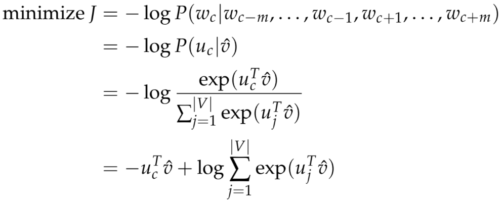

#### 2. Skip-Gram 模型

很上面提到的模型对应的另一种思路，是以中心的词语"jumped"为输入，能够预测威产生它周国的词语"The","cat",'over',"the”,"puddle"等。这里我门叫"jumped"为上下文。我们把它叫做Skip-Gram模型。这个模型的建立与连续词袋模型(CBOM)非常相似，但本质上是交换了输入和输出的位置。我们令输入的one-hot向量（中心词）为x（因为它只有一个），输出向量为$y_j$。U和V的定义与连续词袋模型一样。

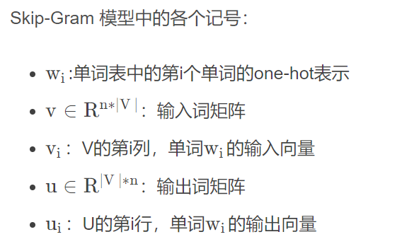

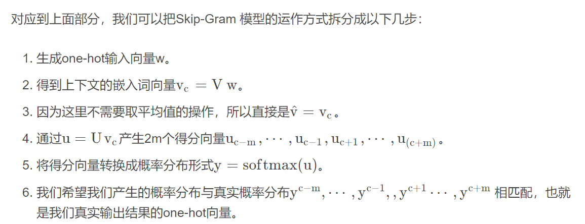

(注意：输入向量w也可表示为x,只是个符号而已)

用一幅图来表示这个过程如下：

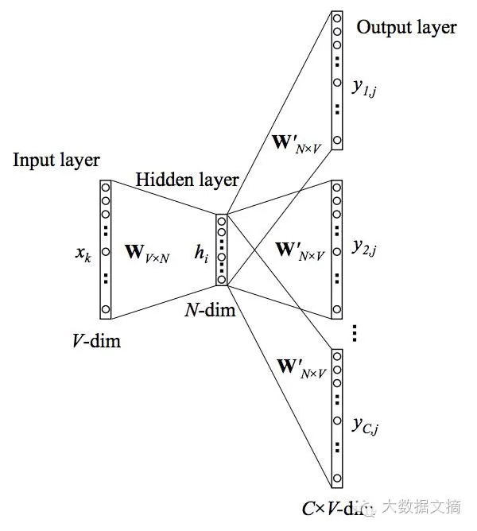

  与CBOW不同在于Skip-gram引入朴素贝叶斯假设，将联合概率拆分成独立概率相乘。即在条件独立的情况下，只要给出了中心词，所有的输出词是完全独立的。

#### 3. 负例采样（Negative Sampling）

对整个单词表|V|求和的计算量是非常巨大的，任何一个对目标函数的更新和求值操作都会有O(|V|)的时间复杂度。需要一个思路去简化一下。
对于每一步训练，不去循环整个单词表，而只是抽象一些负面例子就够了！我们可以从一个噪声分布$(P_n(w))$中抽样，其概率分布与单词表中的频率相匹配。为了将描述问题的公式与负例采样相结合，只需要更新：

- 目标函数
- 梯度
- 更新规则

  虽然负例采样是基于Skip-Gram 模型，它实际上是对一个不同的目标函数进行最优化。考虑一个“词-上下文”对（w,c），令P(D = 1|w, c)为(w, c)来自于语料库的概率。相应的，P(D = 0|w, c) 则是不来自于语料库的概率。我们首先对P(D = 1|w, c)用sigmoid函数建模：
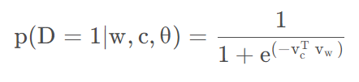

现在建立一个新的目标函数。如果(w, c)真是来自于语料库，目标函数能够最大化P(D = 1|w, c)。反之亦然。对这两个概率采用一个简单的最大似然法。（这里令θ为模型的参数，在例子中，就是对应的U和V。）

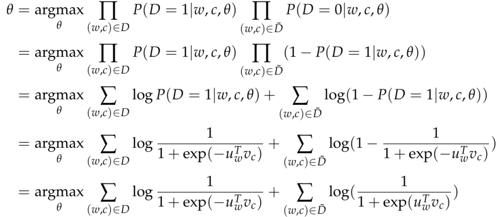

注意这里的$\widetilde D$表示“错误的”或者“负面的”语料库，像句子"stock boil fish is toy"就是从这样的语料库来的。不自然的句子应该有比较低的发生概率，我们可以从词库中随机采样来产生这样的“负面的”语料库。我们的新目标函数就变成了：
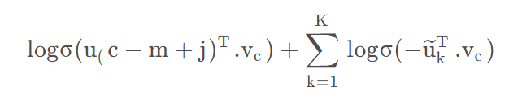

在这里${\{\widetilde u_k|k=1,\cdots,K\}}$是从(Pn(w))中抽样取到的。需要多说一句的是，虽然关于怎么样最好地近似有许多讨论和研究，但是工作效果最好的似乎是指数为3/4的一元语言模型。至于为什么是3/4，下面有几个例子来帮助大家感性地理解一下：
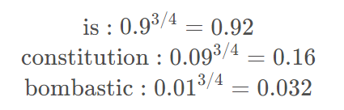

经过3/4这样一个指数处理，“Bombastic”(少见)被采样的概率是之前的3倍，而“is”这个词(多见)被采样的概率只是稍微增长了一点点。