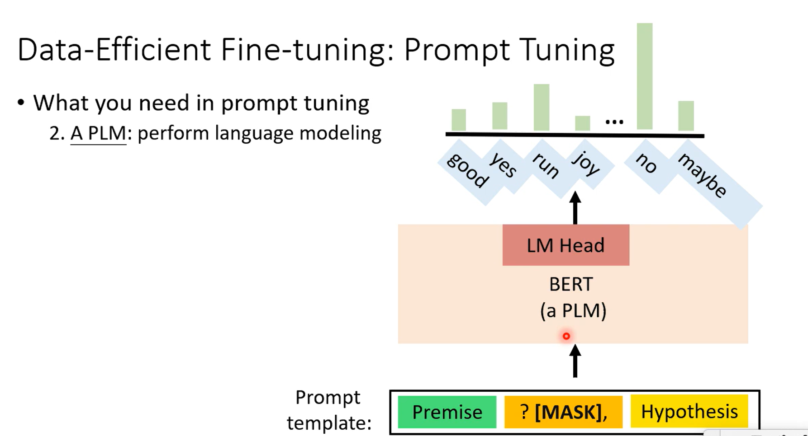
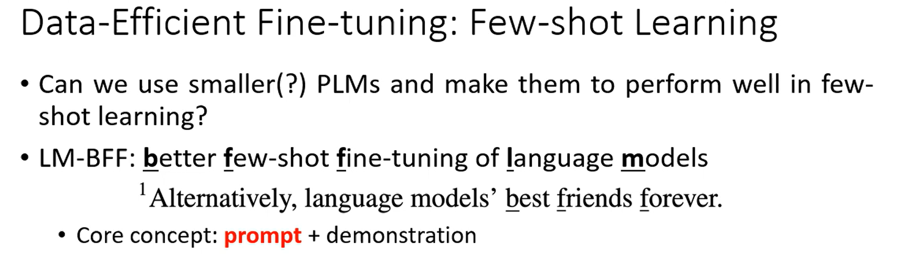
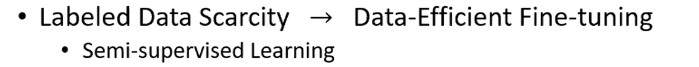
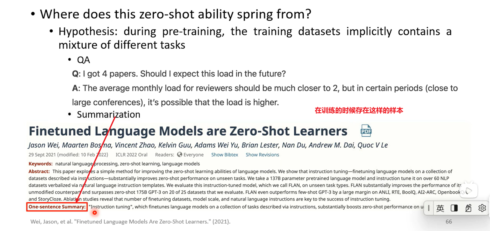
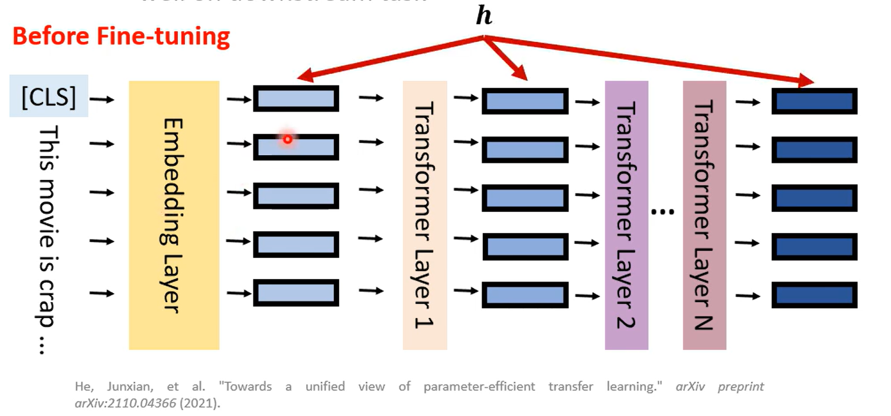
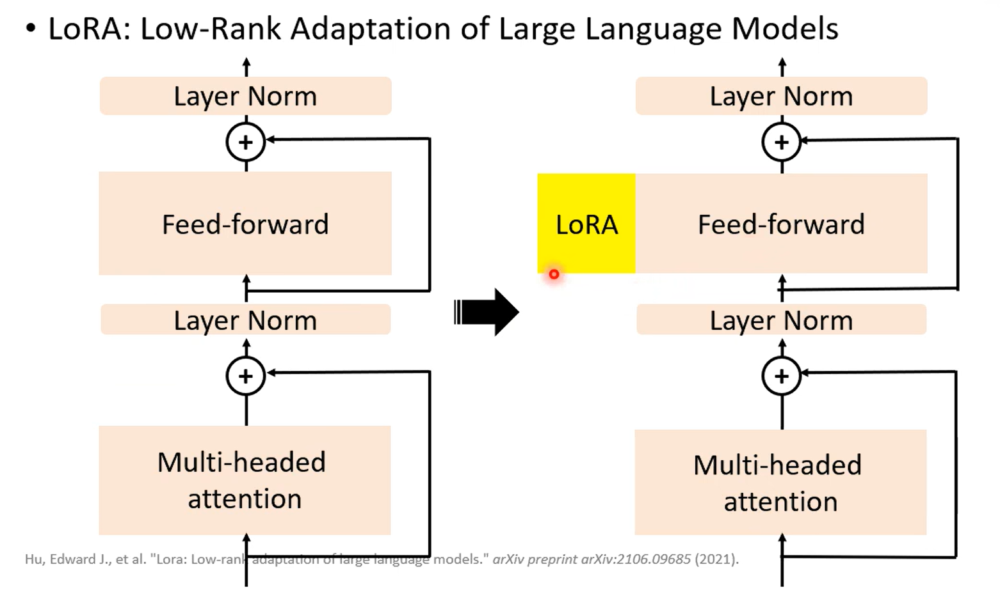
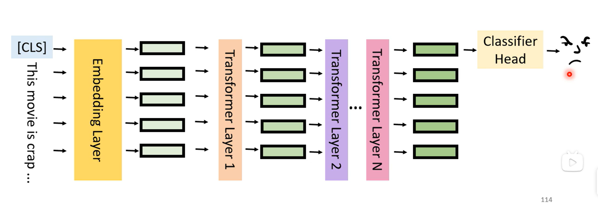

# 如何有效的使用自监督模型-Data-Efficient &Parameter-Efficient Tuning

> - [视频](https://www.bilibili.com/video/BV1Wv411h7kN/?p=75):从21、44分钟开始
> - [pdf](https://speech.ee.ntu.edu.tw/~hylee/ml/ml2022-course-data/PLM.pdf)
> - [博客](https://blog.csdn.net/weixin_43154149/article/details/124370319)

## Prompt Tuning

该技术需要的三个关键组件

1. A prompt template：将数据点转换为自然语言提示

根据模板通过让模型填充一个词将Premise、Hypothesis接起来

[MASK]代表让自然语言模型去填充一个词，这个词即为要推理的词

2. A PLM：执行语言建模

   

   语言模型会输出所有词语的概率，但是这个任务中只在乎label中的三个词

3. A verbalizer：标签和词汇之间的映射

哪个词汇应该代表“蕴涵”这个类别，也就是将label的词和模型需要输出的词形成了映射关系

在finetune的时候整个PLM将进行微调

### 1.Prompt tuning vs Standard fine-tuning

Standard fine-tuning:会删除额外的language model head，并且会增加一个Classifier Head

而Prompt tuning就是要微调这个模型的能力

### 2.效果

横坐标代表训练数据数量多少，从中可以看出在训练数据数量少的时候，Prompt tuning 明显强于 Standard fine-tuning

出现这种效果的原因在于：

1. prompt template相当于告诉了模型每一维度text是什么
2. 另外一个原因在于没有新增模块，Standard fine-tuning 多了Classifier Head这个模块，其参数量大，那么在数据少的时候很难会train起来，而Prompt tuning的language model head保留了原来的知识

让我们看看在不同程度的数据稀缺情况下，提示是如何帮助我们的

### 3.Few-shot Learning

- 说明数据量

- Few-shot：除了任务描述之外，模型还会看到一些任务的示例。不执行梯度更新。

  

- 我们能否使用较小的 PLM，并使其在少量学习（Few-shot）中表现出色？

  

#### 3.1.LM-BFF

- 核心在于它也要做Prompt Tuning，并且加入了demonstration（示范）

  - Prompt Tuning

    

  - demonstration：就是让模型看到如上的input+template后知道怎么做，所以在原来的template后面加了俩个demonstration

  

- 效果

  

  此处 Fine-tuning：Standard fine-tuning

### 4.Semi-supervised Learning

半监督学习：我们有一些标记的培训数据和大量未标记的数据

#### 【PET】It's Not Just Size That Matters:Small Language Models Are Also Few-ShotLearners

- 步骤1：使用不同的提示(prompts)和语言器(verbalizer)在标记的数据集上prompt-tune**不同的PLM**

- 步骤2: 预测未标记的数据集，并将不同模型的预测结合起来

- 步骤3：使用带有分类器头的PLM在软标签数据集上进行训练

这里的软标签就是第二步得到的最右侧的标签结果

### 5.Zero-shot

- 零样本推理：在没有任何训练数据的情况下对下游任务进行推理
- 如果您没有训练数据，那么我们需要一个能够对下游任务进行零样本推理的模型

- 这种零样本能力是从哪里来的？在training data中存在各种不同任务的痕迹

- 假设：多任务训练可以实现零样本泛化。为什么不在一组数据集上训练具有多任务学习的模型？

- 

  - 使用PLM进行多任务微调：将任务转换为自然语言提示
  - 示例：自然语言推理，任务、数据集转换，丢下去直接train

  - 

  - 对某些类型的任务进行微调，对其他类型的任务进行零推理。把任务分成俩类，黄色的任务表示finetune的时候看过，另外一些任务在fintuning就不会看过（只有在zero-shot才会看到）
  - 
  - 有时仅使用11B参数就可以获得比GPT-3（175B参数）更好的性能

## Parameter-Efficient Fine-tuning

> 引言
>
> PLM太大（在参数数量、模型大小和存储模型所需的存储方面）
>
> - 可以有俩种方法：
>
> 
>
> - 另外有一种方法就是参数共享
>   - 
>     - 右侧的模型transformer每一层参数都是一样

- 为每个下游任务使用少量参数，那么下图中间的bert就可以用一样的

- 标准微调的真正作用是什么？

  - 修改PLM的隐藏表示（hidden representations，h），而不影响模型其它的参数，使其能够很好地执行下游任务，隐藏表示可以被Classifier Head很好的利用

  - 
  - 
  - 微调 = 修改基于 PLM 的隐藏表示
  - 
  - 可以使用adapter改变
  - 

### Adapter（适配器）

- 插入transformers的小型可训练子模块

adapter将输入的隐藏层向量降维后通过非线性层后升维

finetune只需要finetune Classifier Head和adapters

### LoRA

- 使用特殊的子模块来修改隐藏的表示！

- LoRA:Low-Rank Adaptation of Large Language Models（大型语言模型的低阶自适应）

LoRA平行的插到Feed-forward，Feed-forward先将低纬向量升维后，通过非线性层，然后再升维

如下图所示，LoRA插到最右图所示的地方，

Feed-forward up-project：将低纬向量升维

而对于LoRA:则是先降为再升维，增加Δh的改变

- LoRA：所有下游任务共享PLM；每一层中的LoRA和分类器头是特定于任务的模块。

  

每个transformer的FFN都要插入LoRA，在微调的时候只更新Classifier Head和LoRA的参数

### Prefix Tuning

前缀调整：使用特殊的子模型修改隐藏表示形式！

前缀调整：在每个层中插入可训练的前缀，放在self-attention 前面

初始的self-attention 如下

插入Prefix如下，可自行决定插入多少个，这里示例插入3个

那么这每个prefix都有自己的key和value，没有query，只有别人query它们

注意下，prefix的MLP和右边输入的x所用的MLP是完全不一样的

在加入prefix后，右边的x除了自己互相做query还要跟prefix做query，做的方法跟自己互相做一样

以上是在train的情况下，当在inference的时候黄色阴影区的蓝色Prefix会被丢掉，只保留其相应k和v

- 前缀调整：在微调过程中，只有前缀（键和值）会更新

transformer每一层的都有对应的prefix的k和v

### Soft Prompting

在输入层预置前缀，插在input前面，如下黄色部分所示，只有input会插，其它层不会插入，finetune也只会finetune这个前缀

- （硬）提示：在输入句子中添加单词（在修复提示的同时微调模型）

- 软提示可以被视为提示的软化版本

- 所以

软提示：矢量（可以通过一些单词嵌入进行初始化）

硬提示：单词（最初在词汇表中）

### 总结

- 好处1：大幅降低特定任务的参数

L代表有L层，这个Percent Trainable是相对整个LLM而言

前三个不要求model很大，第四个要求model大效果才可以

- 好处2：训练数据不太容易过度填充；更好的域外性能

- 优点3：可微调的参数更少；在使用小数据集进行训练时是一个很好的候选者

## PLM 是巨大的→减少参数数量: Early Exit

### 方法

认为通过很多层transformer才能计算结果，比较浪费时间。

因为用整个model会花很多时间，所以作者认为就不要用整个model，动态的降低所需要的层数

传统的方式是利用最后一层向量去训练Classifier Head

- 更简单的数据可能需要更少的努力才能得到答案

因此不一定要到最后一层才来训练Classifier Head，可以到前面几层的即可

- 减少推理过程中使用的层数

用前面一点层数的prediction来当作最后一层的prediction

- - 在每一层添加一个分类器，如果在前面的Classifier Head得到答案了，就不用后面的Classifier Head

- 我们如何知道使用哪个分类器？

额外增加一个Confidence predictor来判断Classifier Head是否可信

在第二个Classifier Head发现可行的话，后面的都会不用

### 效果

