# Finetuning vs. Prompting

> - https://www.bilibili.com/video/BV1TD4y137mP/?p=23
> - p23-25

### 语言模型

GPT 做文字接龙，而bert做文字填空

### 大模型的俩种期待

- 俩种期待

期待一是作为专才；期待二是作为通才

- 优势

成为专才的好处：专才在单一任务上有机会赢过通才

成為通才的好處：只要重新設計prompt就可以快速開發新功能不用寫程式

- 对于bert而言主要是属于期待一，作为专才

#### 期待一：专才

> https://leemeng.tw/attack_on_bert_transfer_learning_in_nlp.html#top

加外挂：

> - 对于问答任务，橙色向量代表答案的起始位置，蓝色向量代表答案的结束位置，它们随机初始化，从头开始学习，与bert的输出做相似度计算，经过softmax后取最大值所在的索引即为开始/结尾的字母所在索引

微调：

需要额外的训练的资料进行训练

Adapter（也叫efficient finetuning）：

插入额外的插件，而不调整原来语言模型的参数

有以下几种插件：

- bitfit：把模型上所有bias都当作插件，微调时只微调bias，weight不变
- Houlsby：插入到如上图所示的encoder结构里，微调只微调这个插件

- AdapterBias：与feed-forward平行，会对feed-forward的输出做平移修改

- Preflx-tuning：对attention做修改
- LORA：对attention的 weight做修改，在NLP上效果好，但是在语音上效果很差

因此针对任务类型选择合适的插件，只需要存储对应不同任务的adapter参数

#### 期待二：通才

機器要學會讀題目敘述或題目範例

提供任务的叙述、题目的范例，就要能够回答相应的答案

- 提供任务的叙述：Instruction Learning
- 提供题目的范例：In-context Learning

##### In-context Learning 根据范例来学习

模型在不微调的情况下，学习给出的范例（相当于学习潜在任务，例如情感分析） 用于预估接下来的问题

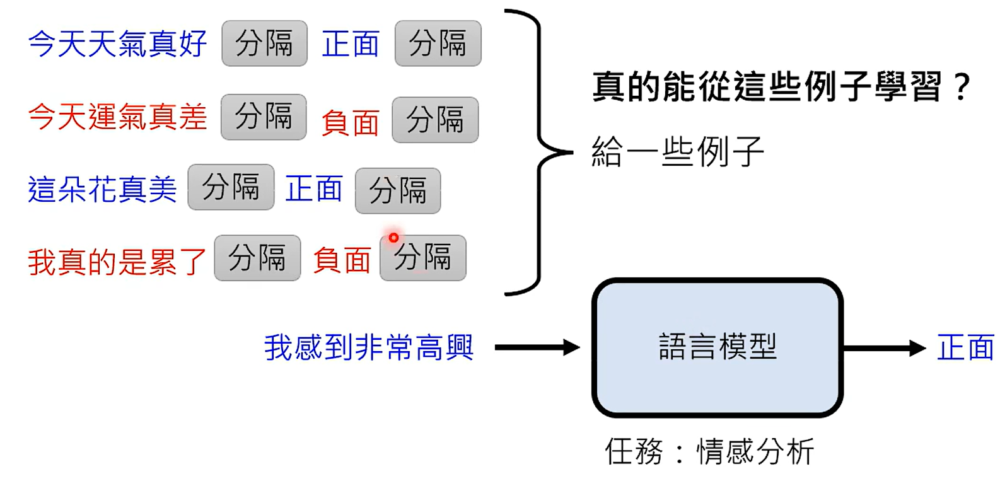

为了判断是否模型真的具备这种能力，所以在给出的案例中会给出错误的标注，看模型是否在学习

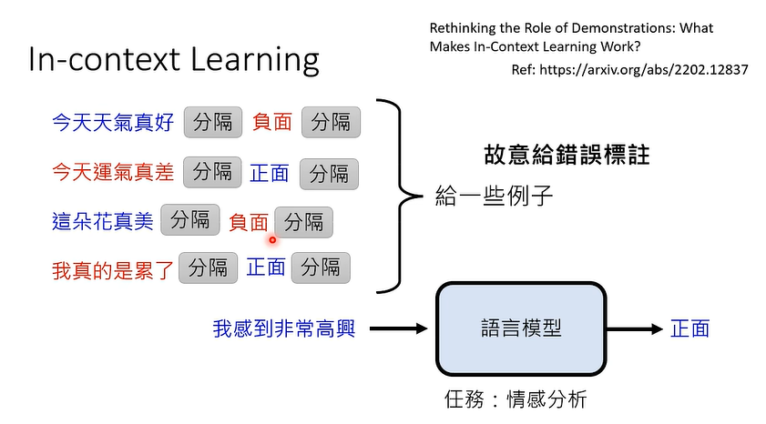

实验结果如下：

从上图可知模型在给出错误标注的范例的情况下准确率基本持平正确标注的范例，这说明模型从范例中并未做真正的学习。

接下来做另一种实验，采用不同域的数据范例去测试模型，

以下的实验结果表明，相同域这个条件非常关键

因此分析其给出的案例是用于告诉模型要做什么任务，而模型本身就具备做这种任务的能力

也有论文分析In-context Learning这种方式能够让模型进行学习，具体可参考如下的俩篇论文

而最近的论文表示，当模型很大的时候，能够从这种范例中学到东西，其实验结果如下图所示

（每个图横轴从左至右表示给出错误标注的范例越来越多）

###### 做分类任务

输入少量的特征和结果作为范例，让模型去学习做分类，效果如下。说明其可以做分类

具体的实验结果如下所示，也说明其具备这种从范例中学习的能力

##### Instruction Learning 根据题目叙述学习

如果直接让模型接到问题描述就做对应的事情，其实直接使用预训练的模型是不够的，文字接龙的模型还是需要一些微调，即为Instruction-tuning

###### Instruction-tuning

概念即为，期待在测试的时候给出前所未有的指令，自动知道这个指令是什么意思，给出合理的回应

以下的模型做的工作即为Instruction-tuning

###### T0

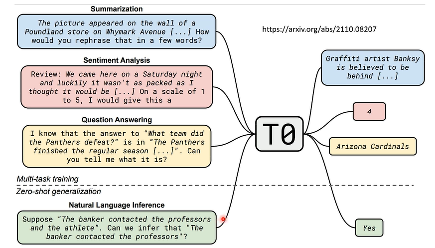

**收集各式各样自然语言的任务以及标注的资料集合**

**接下来把这些任务改写成指令**

假设现在要做的任务是推论，在推论这个任务中机器要给它一个前提、假设然后看有没有矛盾，在一般的模型中（非instruction based的模型），期待给它俩个句子，它给出正确的结果。但是现在要做的事情是看懂人类所给的指令，所以这边遇到的问题是，当人类想要做natural language inference 时，你会怎么跟机器说话。那么就会有各种不同的说法。

###### FLAN

在FLAN中每个NLP任务都想了十个不同描述的方式

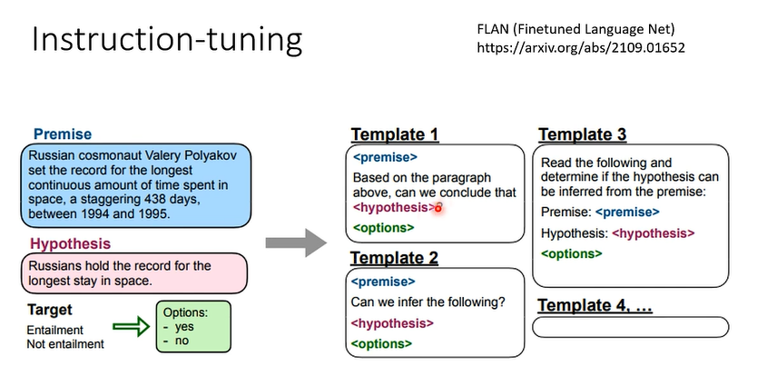

总而言之，就是想办法将natural language inference 任务用人类的语言把他描述出来变成dataset去教模型，看模型有做他该做的事情没

以下结果表明，模型能够从人类指令中去生成处理没有看过人类指令的问题

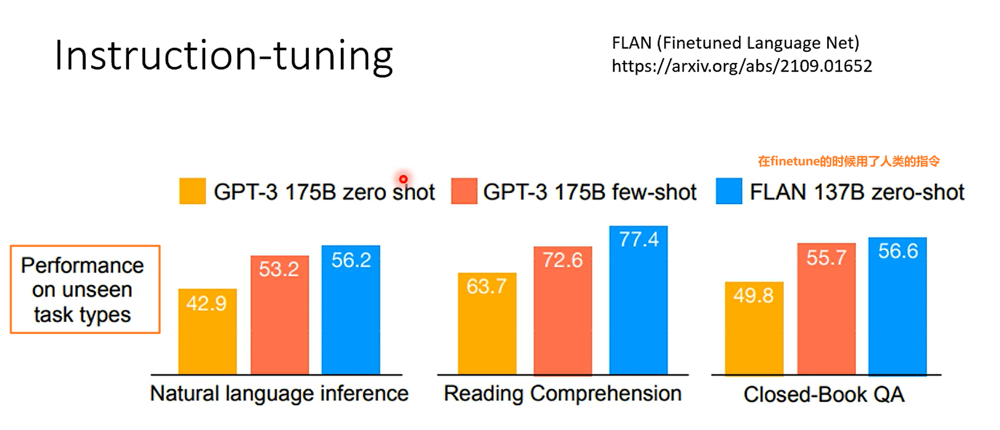

##### Chain of Thought (CoT)Prompting

###### in-context 方式

面对数学题的时候，给它案例时，标准是给它描述以及结果，但是当新的问题描述给它之后往往结果是不正确的，**那么Chain of Thought (CoT)Prompting 是在给它的案例的过程中还给它描述解决问题的过程,期待它面对一个新的问题时给出推论过程及其答案**，这种往往输出结果会好于标准的提示

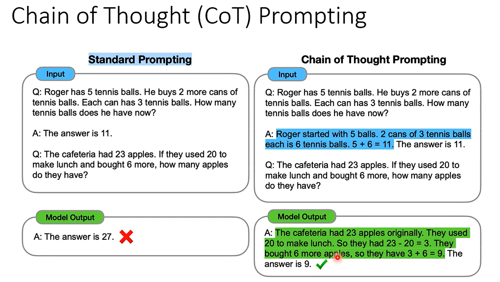

从文献上分析来看，表示是有效的

但是会存在一些问题没有解题的过程，那么还有种方式，就是在回答问题之前多加一句话“Let's think step by step.”如下（d）

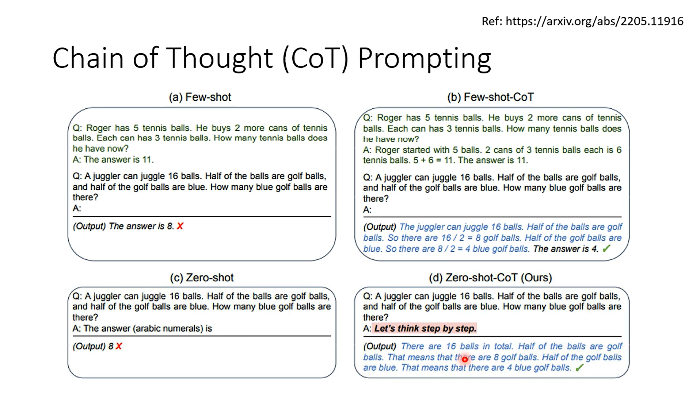

###### self-consistency

不同的推论都得到同一个答案，那么这个答案的可行度就比较高，那么self-consistency就是这样的， 

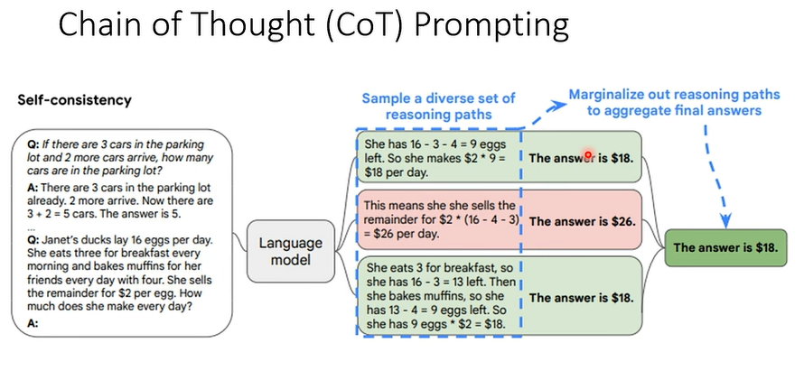

让语言模型产生好几次不同的结果，不同的推论不同的答案，在看看哪种答案出现最多次，那就是正确答案。

另外有个tips，这个语言模型会给每个答案去算一下信息分数，这个模型会给这个答案去算一下产生这个答案的机率，把这个机率想象成信息分数，它可以说不同答案根据这个信息分数来给它一个权重，那这个信息分数高的，那这个答案就比较可靠，但在论文种发现这种方式没什么帮助，可以直接根据投票的方式就可以了

chatgpt通常会有chain of thought，如果不用这个chain of thought，那么self-consistency就意义不大，因为它的diversity 不大，答案总是一致的，因此**这个self-consistency通常是搭配chain of thought一起使用**

###### Least to most prompting

有些困难的数学问题太难了，因此直接将其拆解成简单的数学问题

想让模型自己自己拆解这个数学问题，然后再把拆解的数学问题拼接到原来的问题上给模型自己去求解，然后每次把模型输出的结果拼接到输入，如下图所示来解决这个数学问题。

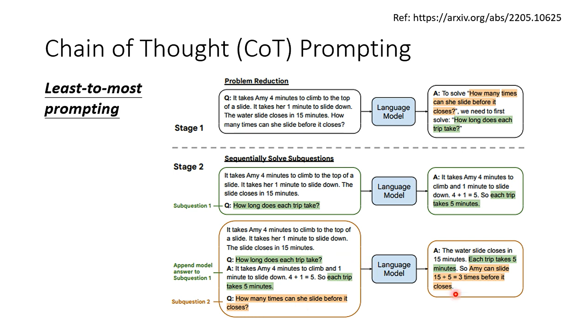

那么难点在于机器如何知道将这个难的数学问题做拆解呢（stage1 ），所以还是需要做in-context learning。

只有做in-context learning 机器才会做简化问题的事情

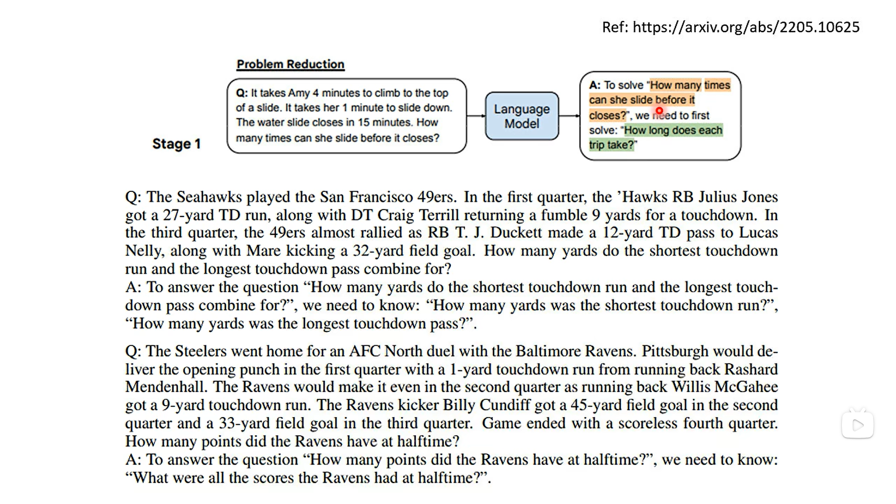

#### 用机器生成prompt

- hard prompt：就是人类的语言

- soft prompt：就是给机器额外的指令，给机器一个指令并不是人类看得懂的语言描述的，而是一堆连续的向量，这堆向量是可以train的，可以把这堆向量想象成模型参数的一部分，它们可以根据label data 进行调整，也可以这么想 就是将 adapter 放到input 。因此这种soft prompt 跟专才是比较相似的，可以把他当作专才的一种特例

以下是寻找prompt的方法

##### Using reinforcement learning

在原本上加入一个生成器，生成prompt，将其和input连接输入GPT3得到结果，看这个结果是不是想要的，送入奖励函数，以此迭代更新	

##### Using an LM to find prompt

给出输入输出的案例，让机器自己去想这个问题的描述，如下所示

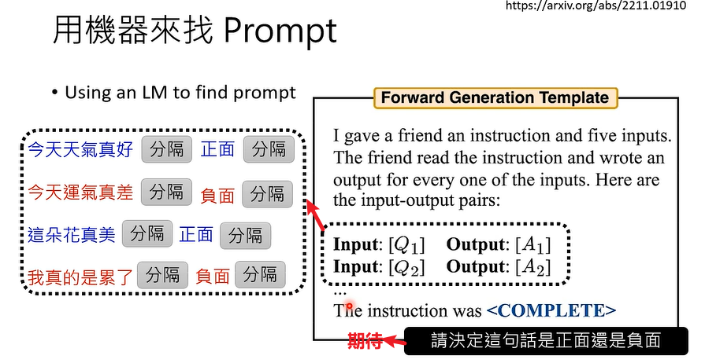

进一步，他将这些prompt描述选择一个最好的，让后让机器用最好的去生成相似的问题，再去评估选择一个最好的prompt，但这一步提升效果较差，没必要去做这一步

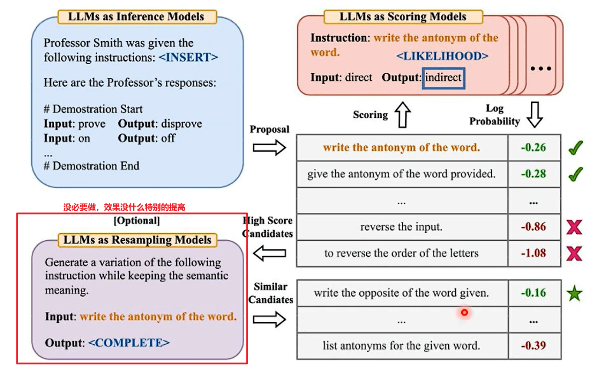
