# 自注意力机制

> - https://www.bilibili.com/video/BV1Wv411h7kN?p=38
> - https://blog.csdn.net/iwill323/article/details/127424895
> - https://blog.csdn.net/SofiaT/article/details/130322459
> - https://www.bilibili.com/read/cv24484121/?jump_opus=1&wd=&eqid=8ab5525b00001ee3000000026498094c

## 1. self-attention**的输入**

自注意力机制的输入是一个向量集，而且向量的大小、数目都是可变的。

### 1.1 文字处理领域

方法一：one-hot 编码，one-hot vector 的维度就是所有单词的数量，每个单词都是一样长度的向量，只是不同单词在不同位置用 1 表示。这个方法不可取，因为单词很多，每一个vector 的维度就会很长，并且产生的向量是稀疏高维向量，需要的空间太大了，而且看不到单词之间的关联。

方法二：word embedding，加入了语义信息，每个词汇对应的向量不一定一样长，而且类型接近的单词，向量会更接近，考虑到了单词之间的关联。https://youtu.be/X7PH3NuYW0Q

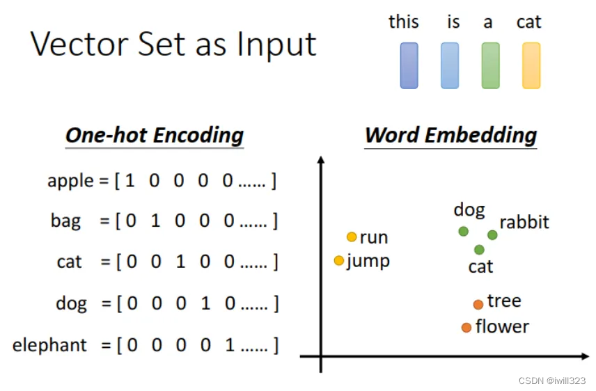

### 1.2 语音领域

把一段声音讯号取一个范围，这个范围叫做一个Window，把这个Window裡面的资讯描述成一个向量，这个向量就叫做一个Frame，通常这个Window的长度是25ms。将窗口移动 10ms，窗口内的语音生成一个新的frame。所以 1s 可以生成 100 个向量。

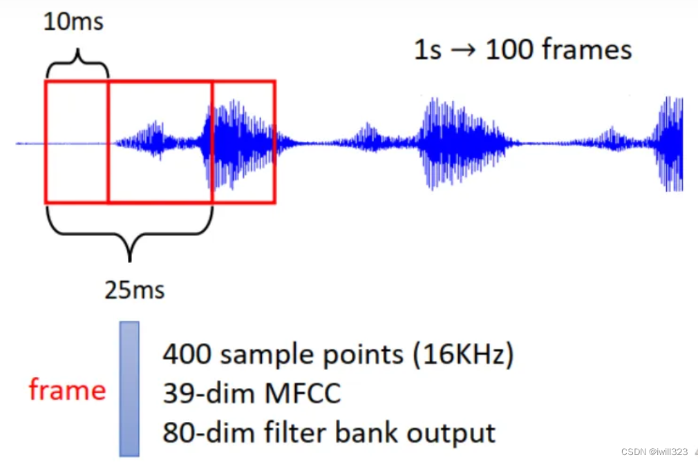

### 1.3 图

社交网络就是一个 Graph（图网络），其中的每一个节点（用户）都可以用向量来表示属性，这个 Graph 就是 vector set。

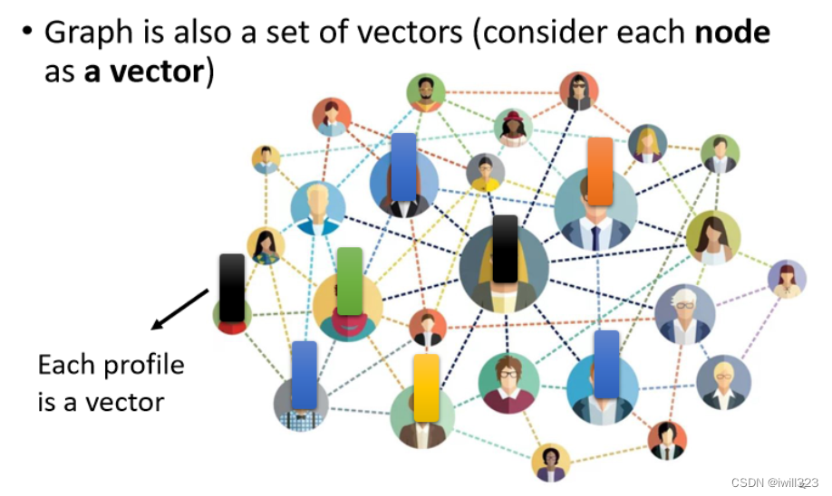

- 一个分子就是一个graph，其中一个原子就是一个向量

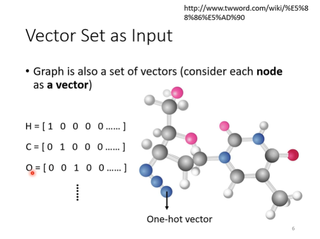

## 2. 自注意力机制的输出

### 2.1 输出序列长度与输入序列相同

每个输入向量都对应一个输出标签，输入与输出长度是一样的**。**例如预测每个单词的词性，预测每段语音的音标，预测某个人会不会购买商品。

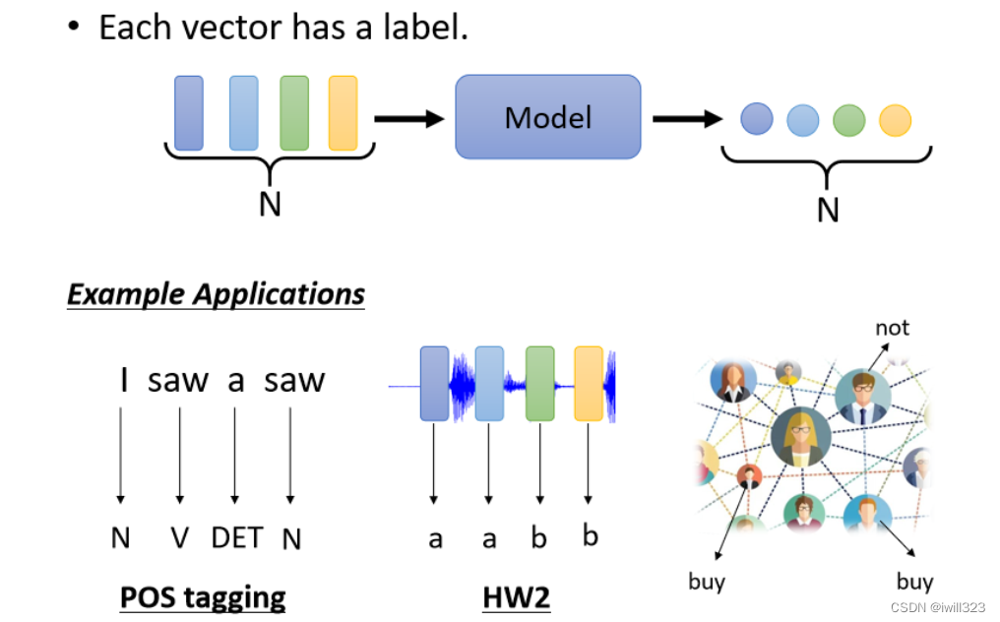

### 2.2 输出序列长度为1

输入若干个向量，结果只输出一个标签。例如句子情感分析，预测一段语音的语者，预测一个分子的性质。

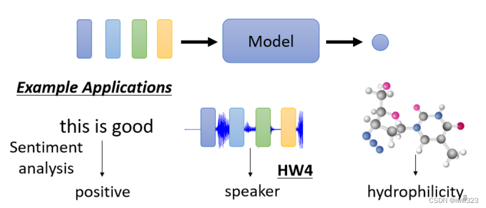

### 2.3 模型决定输出序列长度

不知道输出的数量，全部由机器自己决定输出的数量，翻译和语音辨识就是seq2seq任务

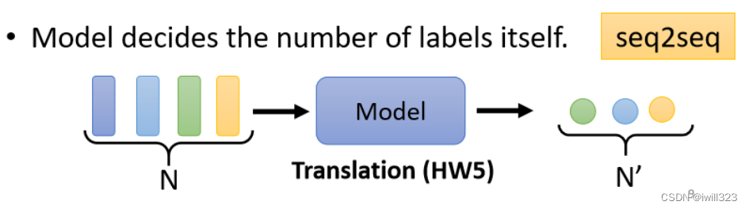

## 3. Self-attention 原理

输入和输出序列长度的情况也叫 Sequence Labeling，要给Sequence里面的每一个向量输出一个Label。

对每一个向量，如果用FC网络进行处理：模型需要考虑Sequence中每个向量的上下文，才能给出正确的label。如果每次输入一个window，这样就可以让模型考虑window 内的上下文资讯。有时候某一个任务不是考虑一个window就可以解决的，而是要考虑一整个Sequence才能够解决，FC网络只能考虑固定个输入，就要把Window开大一点，那么window就会有长有短，可能就要考虑到最长的window，不仅会导致FC的参数过多，还可能导致over-fitting。

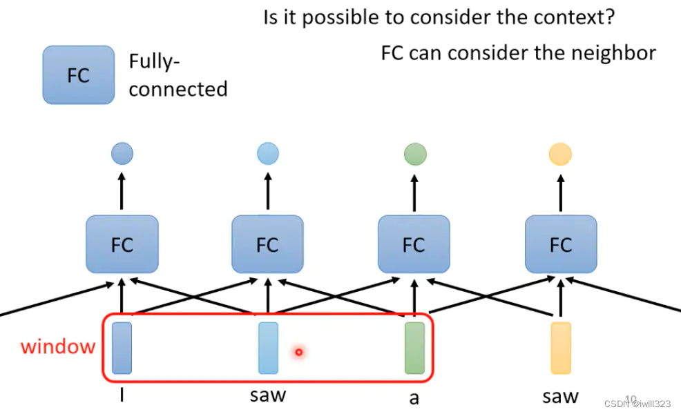

Self-Attention（下面浅蓝色矩形框）会输入一整个Sequence的所有向量，有几个向量输入就得到几个向量输出，他们都是考虑一整个Sequence以后才得到的，输出的向量再通过全连接层，FC可以专注于处理这一个位置的向量，得到对应结果。

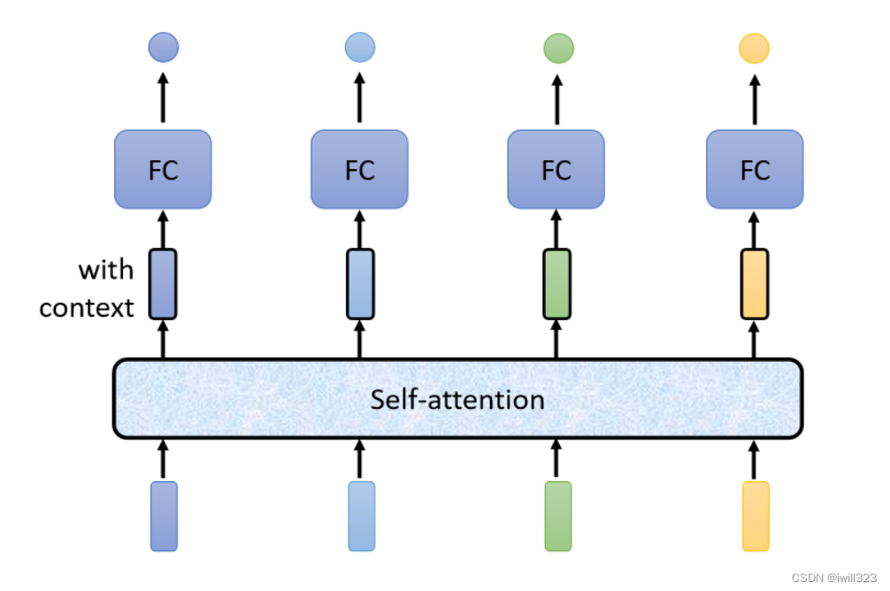

可以把fc网络和Self-Attention交替使用。其中 self-attention 的功能是处理整个 sequence 的资讯，而FC 则是处理某一个位置的资讯，在fc后使用Self-Attention，能够把整个Sequence资讯再处理一次。

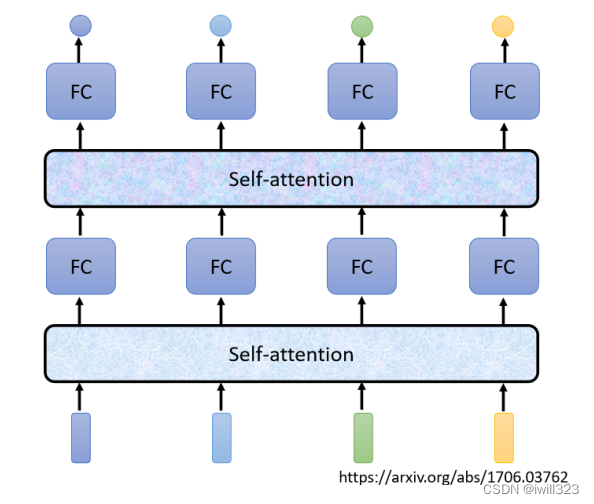

有关Self-Attention，最知名的相关的文章,就是《Attention is all you need》 

## 4. self-attention模型的内部实现

输出b1，考虑了 a1~a4 的资讯，也就是整个输入的sequence才产生出来的。

那么 b1 是如何考虑 a1~a4 的资讯的呢？寻找 每个 a 与 a1 之间的相关性 α，也就是算出 a （包括a1自己）对处理 a1 的影响程度，影响程度大的就多考虑点资讯。

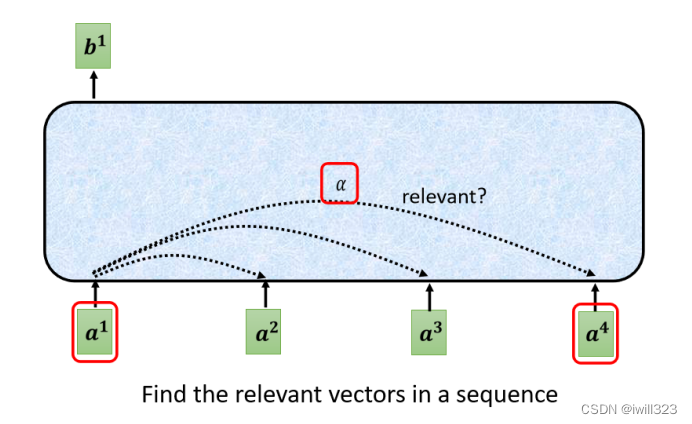

### 4.1 相关性计算

计算相关性有点积和 additive两种方法，主要讨论点积这个方法。

方法一 dot product:输入的这两个向量分别乘上两个不同的矩阵，左边这个向量乘上矩阵 W^q 得到矩阵 q，右边这个向量乘上矩阵 W^k得到矩阵 k，再把 q 跟 k做dot product 就是α

方法二 Additive：得到 q 跟 k 后,先串接起来，再过一个Activation Function（Normalization），再通过一个Transform，然后得到 α.

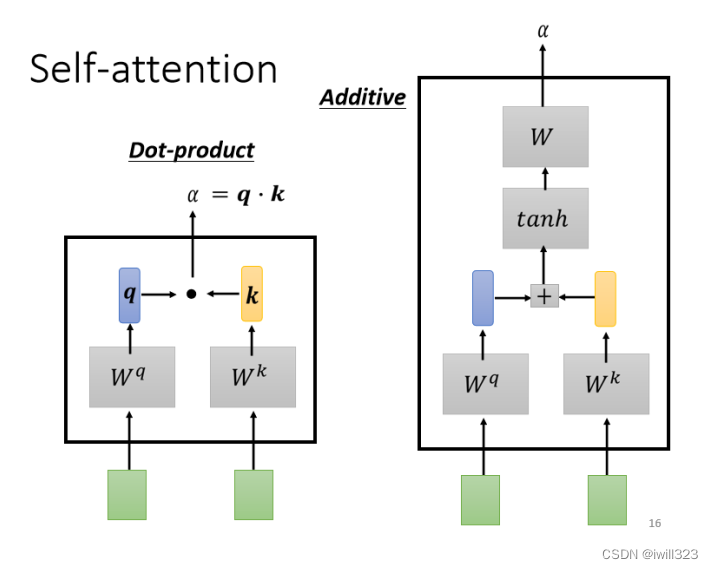

点积：通过输入 ai 求出 qi (query) 和 ki (key)，qi 与 sequence 中所有的 ki 做点积，得到 α ，如下图所示。query是查询的意思，查找其他 a 对 a1的相关性。 α 也被称为 attention score。注意： q1 也和自己的 k1 相乘，不仅要计算a1与其他 a 的相关性，还要计算自己与自己的相关性。 
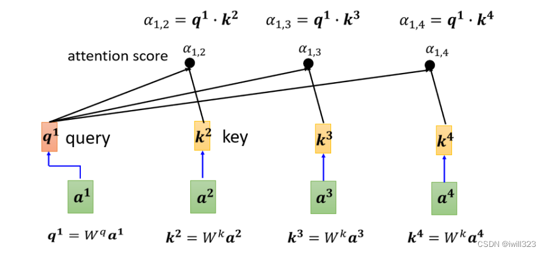

 α 再经过 softmax ，得到归一化的结果 α′ 。softmax也可以换成其他的 activation function

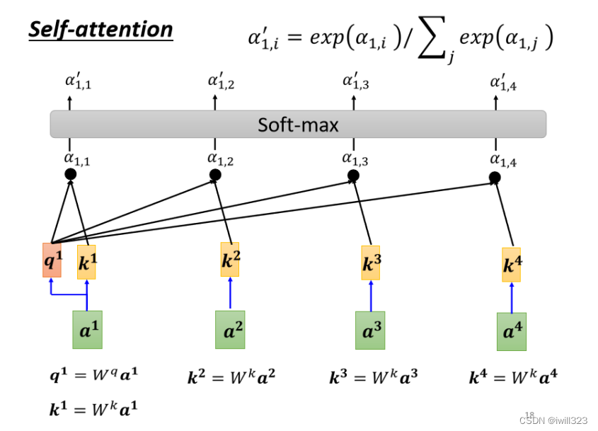

### 4.2 计算**self-attention**输出

每个 a 乘以W 矩阵形成向量 v，然后让各个 v 乘对应的 α′ ，再把结果加和起来就是 b1 了。

某一个向量得到的attention score越高，比如说如果a1跟a2的关联性很强，得到的α′值很大，那么在做加权平均以后，得到的b1的值,就可能会比较接近v2。self-attention计算过程就是基于 α′ 提取资讯，谁的 α′ 越大，谁的 v 就对输出 b1 的影响更大。
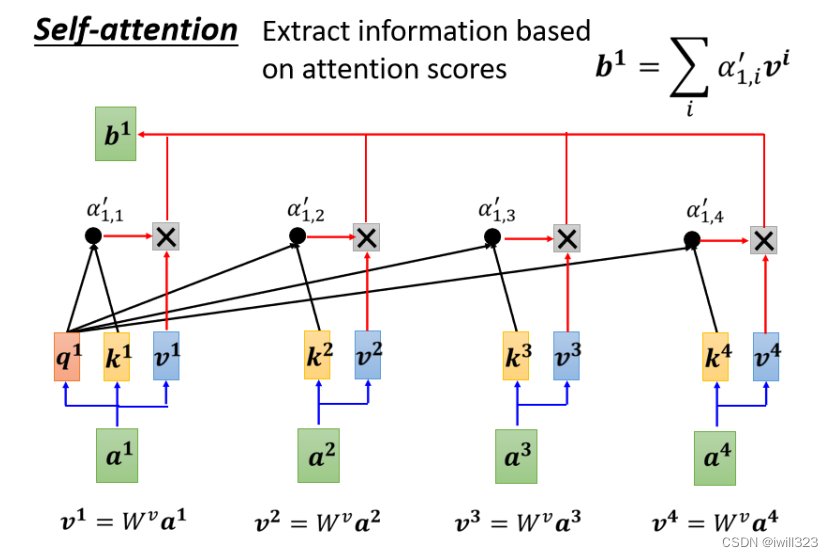

这还仅仅只是输出一个 b 的过程。输出 b2 的过程和输出 b1 是一样的，只不过改变了 query而已。**b虽然考虑的整个sequence的资讯，但是不同 b 的计算没有先后顺序，可以平行计算输出。**

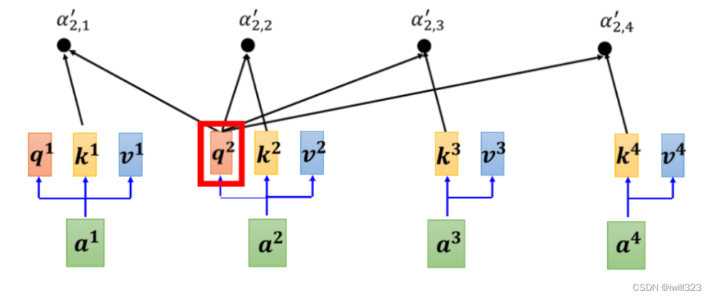

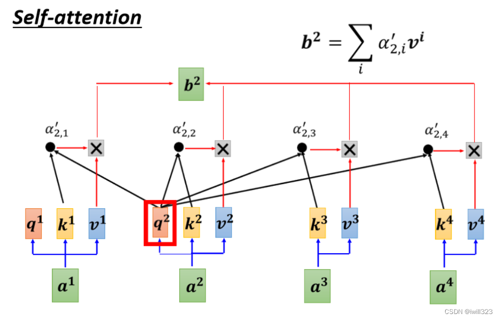

### 4.3 矩阵实现

上面都是针对单个 b 输出是怎么计算的，针对多个 b 输出，在实际中如何存储、如何平行计算呢？

前面有讲到三个 W 矩阵，**这三个矩阵是共享参数，需要被学出来的。**将输入向量组合在一起形成 I 矩阵，I 矩阵与不同的 W 矩阵相乘后，得到Q、K、V三个矩阵。

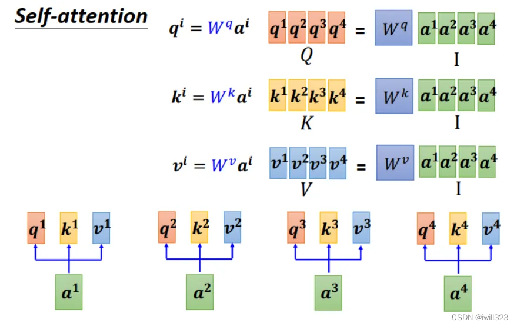

将 k向量转置一下，再去和 q向量做点积，这样得出的 α 才会是一个数值，而不是向量。

先看左边四个式子，转置后的 k向量：1x n；q向量：n x1，所以两者相乘后的 α ：1x1。

再看右边四个式子，转置后的 K矩阵：4x n；q向量：n x1，所以两者相乘后的 α 组成矩阵：4x1。

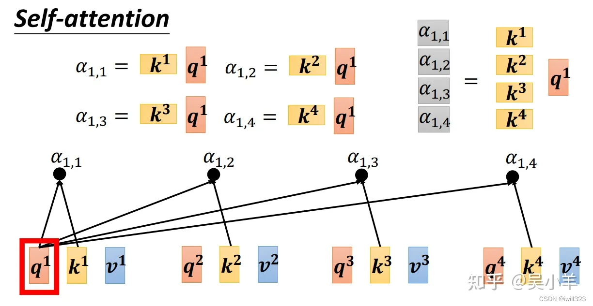

上面只涉及 q1，而没有q2~q3，现在把这三个 q 加进来，变成下图的式子。
求attention 的分数可以看作是两个矩阵的相乘。用转置后的 K矩阵，去乘以 Q矩阵，得到一个布满 α 的 A矩阵。A矩阵经过softmax得到 A‘ 矩阵，对每一个column 做 softmax，让每一个 column 裡面的值相加是 1。这边做 softmax不是唯一的选项，完全可以选择其他的操作，比如说 ReLU 之类的，得到的结果也不会比较差
转置后的 K矩阵：4x n；Q矩阵：n x4；所以得到的 A矩阵：4x4。
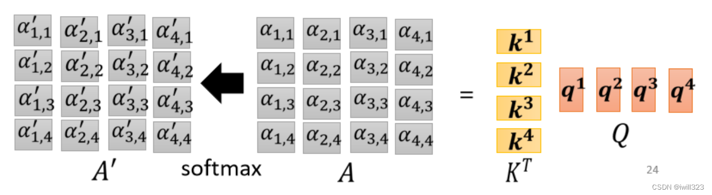

然后用 A’ 矩阵乘以 V矩阵，得到最后的输出 O矩阵。

V矩阵：n x4；A‘ 矩阵：4x4；所以得到的 O矩阵：n x4

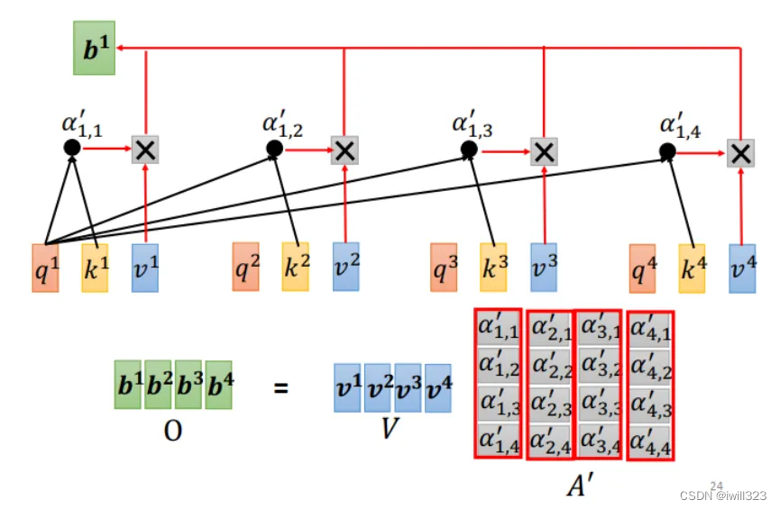

### 4.4 小结

将上面几张图总结下，就是下图这样的就是过程

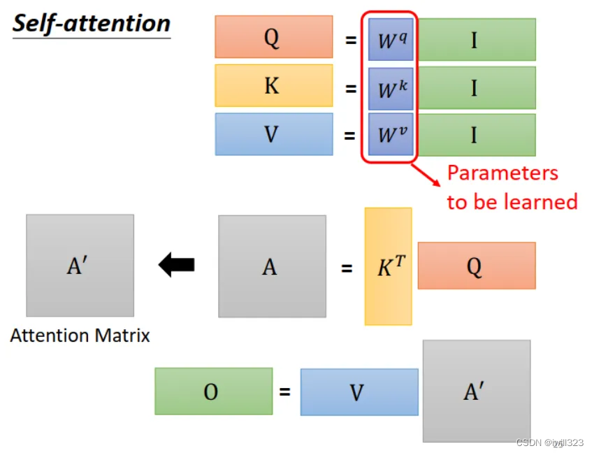

需要注意的是：

（1）I 是 Self-attention 的 input一排vector，每个vector当作矩阵的 column

（2） Wq , Wk , Wv 是要学习的参数，其他的操作都是我们人為设定好的，不需要透过 training data 找出来，从 I 到 O 就是做了 Self-attention

（3）A' 叫做 Attention Matrix，计算它是运算量最大的部分，假设 sequence 长度为 L，其中的 vector 维度为 d，那么需要计算 L x d x L 次。

## 5. Multi-head Self-attention

有时候要考虑多种相关性，要有多组 q,k,v，不同的 q,k,v 负责查找不同种类的相关性。下图为 2 heads 的情况， (q,k,v) 由一组变成多组，第一类的放在一起算，第二类的放在一起算。相关性变多了，所以参数也增加了，原来只需要三个 W矩阵，现在需要六个 W矩阵。下图是算第一种相关性的过程

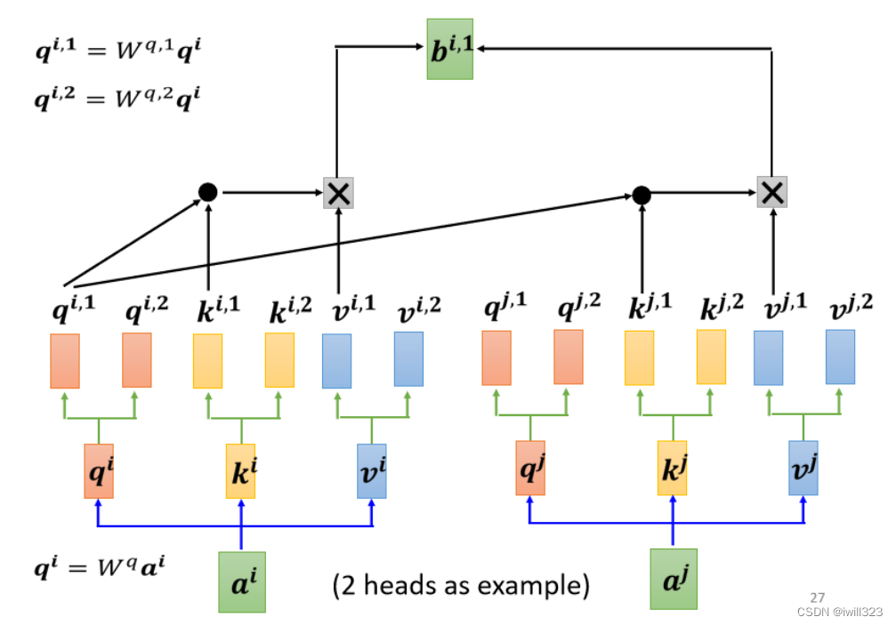

下图是计算第二种相关性的过程

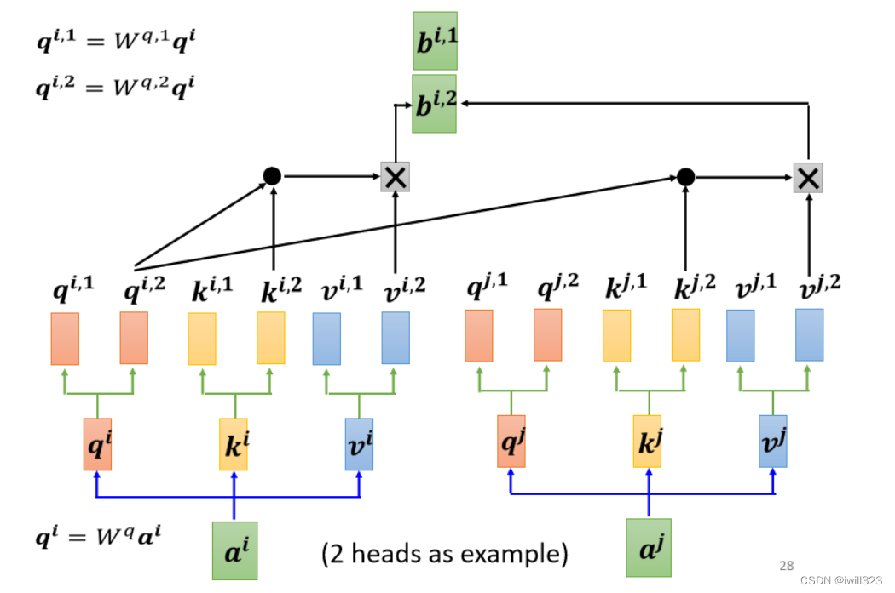

与单个的 self attention 相比，Multi-head Self-attention 最后多了一步：由多个输出组合得到一个输出。将刚刚得到的所有 b组成一个向量，再乘以矩阵，输出一个 bi，目的就是将不同种类的相关性整合在一起，成为一个整体，作为 a1 的输出 b1。

The Illustrated Transformer – Jay Alammar – Visualizing machine learning one concept at a time.一文中举了一个 2 heads 的例子，展示了应用 Multi-head Self-attention 时考虑的多种相关性
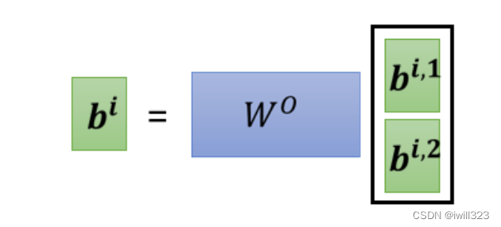

### 6. 位置编码Positional Encoding

self-attention 没有考虑位置信息，只计算互相关性。比如某个字词，不管它在句首、句中、句尾， self-attention 的计算结果都是一样的。但是，有时 Sequence 中的位置信息还是挺重要的。

- 解决方法：给每一个位置设定一个位置向量 ei，把位置信息 ei 加入到输入 ai 中，这个 ei 可以是认为设定的向量，也可以是通过学习生成的。如下图中的黑色竖方框，每一个 column 就代表一个 e 。

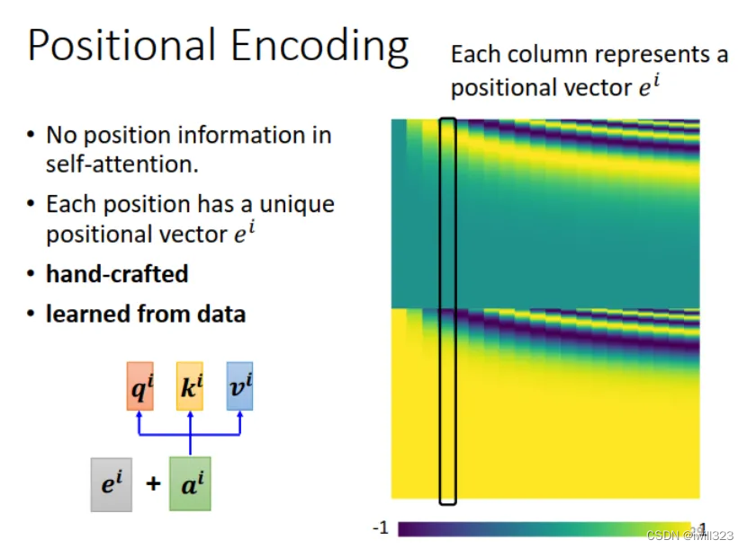

## 6. Self-attention 的应用

### 6.1 NLP

Self-attention 在 NLP 中广泛应用，如鼎鼎有名的 Transformer, BERT 的模型架构中都使用了 Self-attention。

### 6.2 语音识别

Self-attention做一些小小的改动，因为要把一整句话表示成一排向量的话，这排向量可能会非常长。每一个向量代表了 10 ms 的长度，1 秒鐘的声音讯号就有 100个向量，5 秒鐘的声音讯号就 500 个向量了。假如输入的向量集有 L个向量，那么attention matrix大小将是L*L，计算这个 attention matrix需要做 L 乘以 L 次的内积，不易于训练。

改进：Truncated Self-attention，考虑资讯的时候，不看一整句话，只看一个小的范围，计算限制范围内的相关性。如图所示，不在全部 sequence 上计算 attention score，限制在相邻一定范围内计算。这个范围应该要多大是人设定的。有点类似CNN中感受域的思想
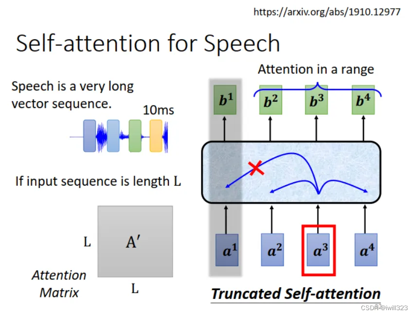

### 6.3 图像处理

图片也可以看成由不同向量组成的向量集。如图所示，把每一个位置的像素（W,H,D）当成一个三维的向量，一幅图像就是 vector set，可以用 Self-attention 来处理一张图片

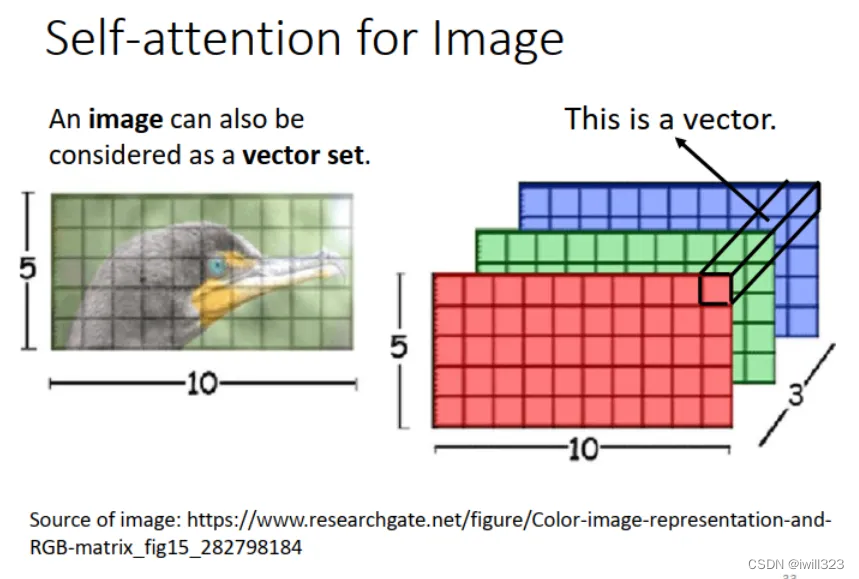

### 6.3 graph

Graph 往往是人為根据某些 domain knowledge 建出来的，线段即表示节点之间的相关性，知道哪些 node 之间是有相连的，所以graph已经知道向量之间的相关性，使用self-attention 时不需要再去学相关性，在做Attention Matrix 计算的时候,只计算有 edge 相连的 node 就好。Self-attention用在 Graph 上面的时候,其实就是一种 Graph Neural Network，也就是一种 GNN
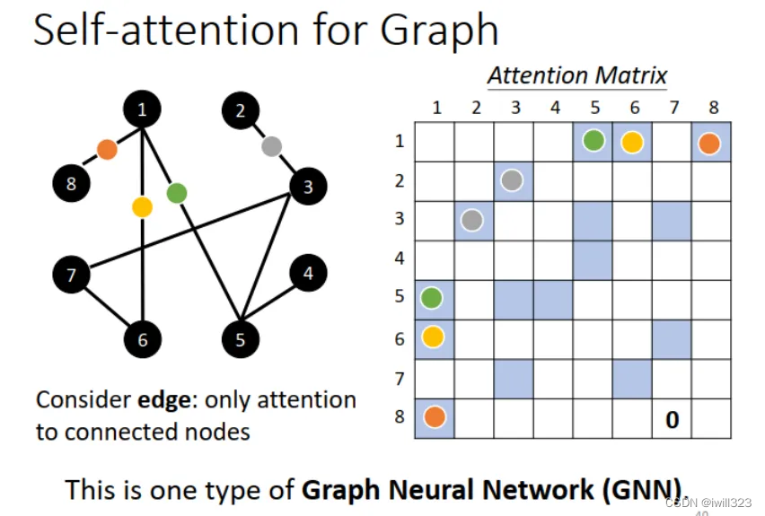

## 7. Self-attention 和其他网络的对比

### 7.1 self-attention 和 CNN

CNN 可以看成简化版的 self-attention。CNN 就是只计算感受野中的相关性的self-attention。

**CNN 只计算感受野范围内的相关性，把一个像素点当作一个向量，可以理解成中心向量只关心其相邻的向量，感受野的大小由人为设定，**如下图所示。

Self-attention 求解 attention score 的过程，考虑的不是一个感受野的信息，而是整张图片的信息，网络自己决定以这个 pixel 為中心，哪些像素是相关的，相当于机器自己学习并确定感受野的范围大小。

从 Self-attention 的角度来看，CNN是在感受野而不是整个 sequence 的 Self-attention。因此， CNN 模型是简化版的 Self-attention。
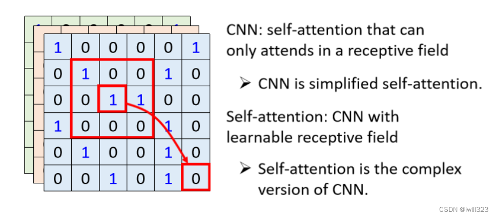

下面的文章证明，只要设定合适的参数，self-attention 可以做到跟 CNN 一模一样的事情。Self-attention 只要透过某些设计，它就会变成 CNN。

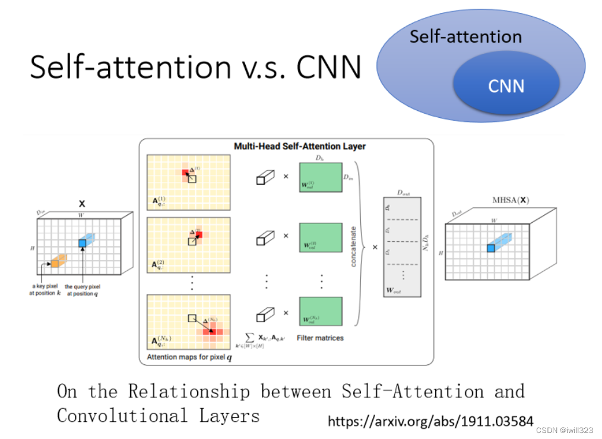

所以 self attention是更 flexible 的 CNN，而 CNN 是有受限制的 Self-attention。下图用不同的 data 量来训练 CNN 跟 Self-attention，横轴是训练资料多少，纵轴是准确率。可以看出在资料量少时，CNN的表现比 self-attention好；而在资料量多时，效果则相反。为什么呢？因为 self-attention 的弹性更大，当资料增多时，性能提升空间比较大，而在资料量少时容易overfitting。
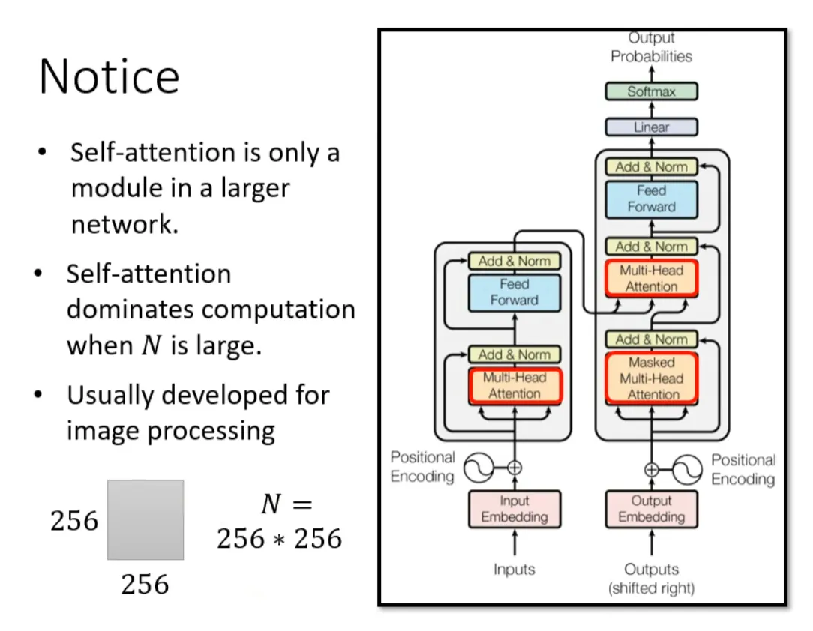

### 7.2 self-attention 和 RNN

Recurrent Neural Network跟 Self-attention 做的事情其实也非常像，它们的输入都是一个 vector sequence
**区别：**

- 如下图所示，如果RNN 最后一个向量要联系第一个向量，比较难，需要把第一个向量的输出一直保存在 memory 中。而这对 self-attention 来说，整个 Sequence 上任意位置的向量都可以联系，距离不是问题。
- RNN 前面的输出又作为后面的输入，因此要依次计算，无法并行处理。 self-attention 输出是平行產生的，并不需要等谁先运算完才把其他运算出来，可以并行计算，运算速度更快。

**现在RNN已经慢慢淘汰了，许多公司将RNN网络改成了self-attention架构。**

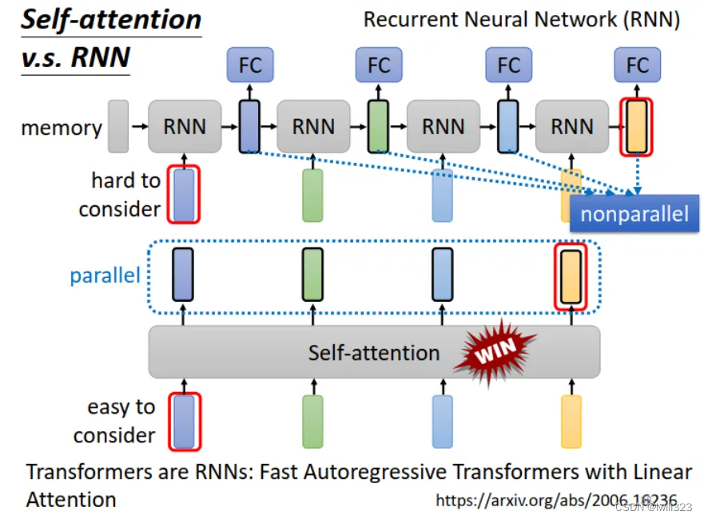

### 7.3 self-attention 和 Graph

GNN 只计算一个节点与已连接的节点之间的attention

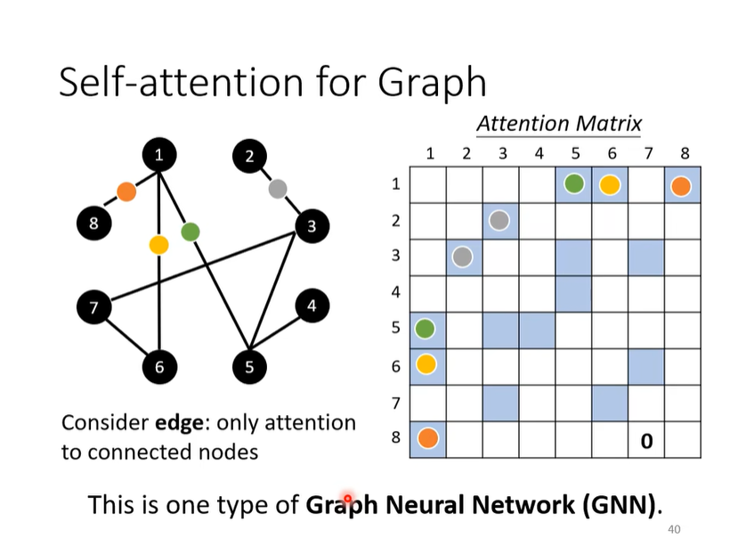

## 8. self-attention 变形

Self-attention 最大的问题就是运算量非常地大，所以如何平衡performance 和 speed 是个重要的问题。往右代表它运算的速度，所以有很多各式各样新的 xxformer，速度会比原来的Transformer 快，但是 performance 变差；纵轴代表是 performance。它们往往比原来的 Transformer的performance 差一点,但是速度会比较快。可以看一下Efficient Transformers: A Survey 这篇 paper
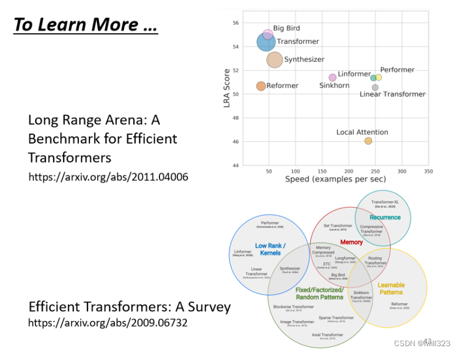

### 8.1 Self-attention运算存在的问题

在self-attention中，假设输入序列（query）长度是N，为了捕捉每个value或者token之间的关系，需要对应产生N个key与之对应，并将query与key之间做dot-product，就可以产生一个Attention Matrix（注意力矩阵），维度N*N。这种方式最大的问题就是当序列长度太长的时候，对应的Attention Matrix维度太大，计算量太大。
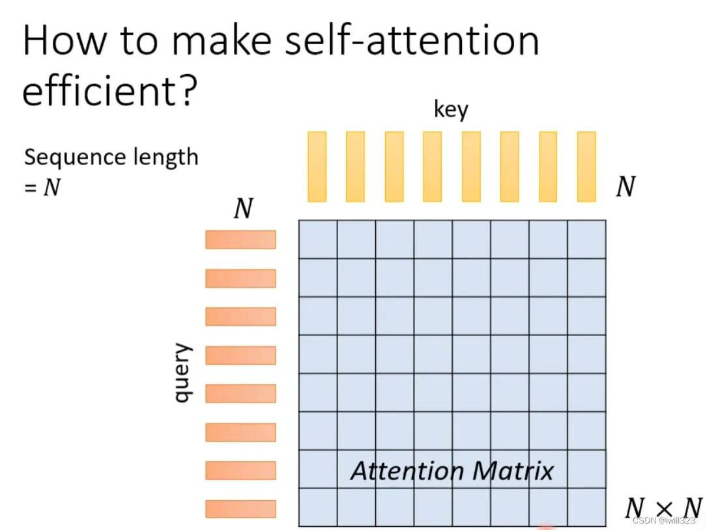

对于transformer来说，self-attention只是大的网络架构中的一个module。由上述分析我们知道，对于self-attention的运算量是跟N的平方成正比的。当**N很小**的时候，单纯增加self-attention的运算效率可能并不会对整个网络的计算效率有太大的影响。因此，提高self-attention的计算效率从而大幅度提高整个网络的效率的前提是N特别大的时候，比如做图像识别（影像辨识、image processing）。比如图片像素是256\*256，每个像素当成一个单位，输入长度是256\*256，self-attention的运算量正比于256*256的平方。

### 8.2 各种变形：加快self-attention的求解速度

如果根据一些的知识或经验，选择性的计算Attention Matrix中的某些数值或者某些数值不需要计算就可以知道数值，理论上可以减小计算量，提高计算效率。

#### 8.2.1 local attention

举个例子，比如在做文本翻译的时候，有时候在翻译当前的token时不需要给出整个sequence，其实只需要知道这个token左右的邻居，把较远处attention的数值设为0，就可以翻译的很准，也就是做局部的attention（local attention）。这样可以大大提升运算效率，但是缺点就是只关注周围局部的值，这样做法其实跟CNN就没有太大的区别了，结果不一定非常好。
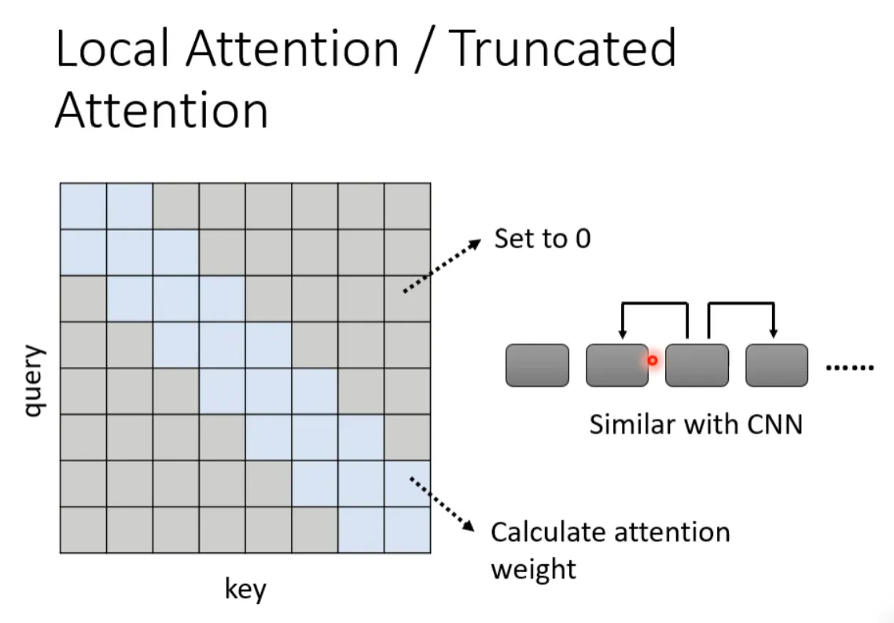

#### 8.2.2 Stride Attention

在翻译当前token的时候，让他看空一定间隔（stride）的左右邻居的信息，从而捕获当前与过去和未来的关系。当然stride的数值可以自己确定。

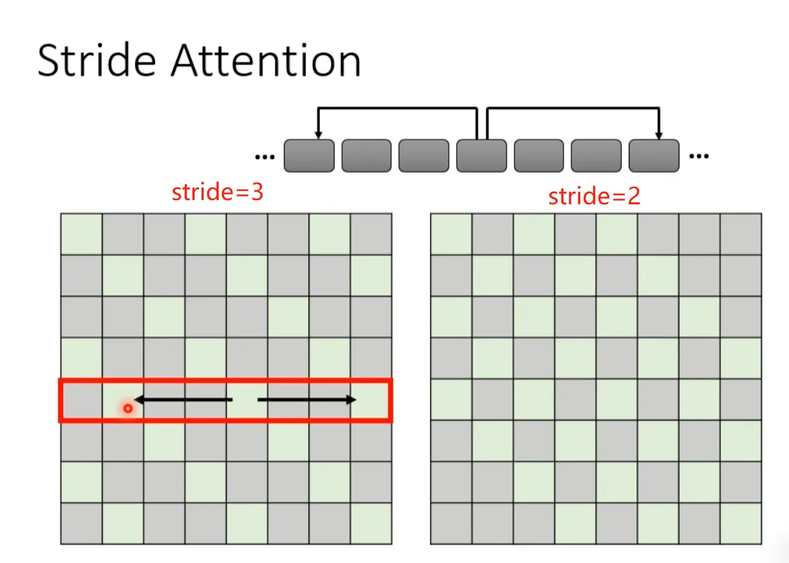

#### 8.2.3 global attention

选择sequence中的某些token作为special token（比如开头的token，标点符号），或者在原始的sequence中增加special token，分别代表下面右侧两行。**让special token与sequence里每一个token产生关系**（Attend to every token和Attended by every token），但其他不是special token的token之间没有attention。以在原始sequence头两个位置增加两个special token为例，只有前两行和前两列做attend计算。
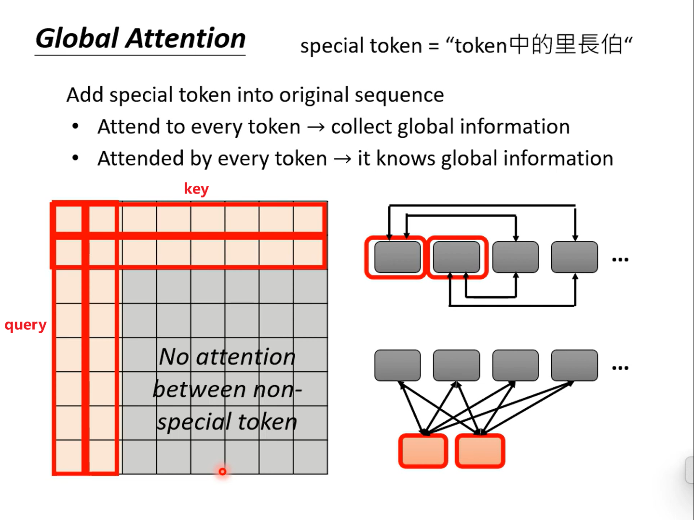

#### 8.2.4 Big Bird：综合运用

对于一个网络，有的head可以做local attention，有的head可以做stride attention，有的head可以做global attention。看下面几个例子：

Longformer就是组合了上面的三种attention

Big Bird就是在Longformer基础上随机选择attention赋值，进一步提高计算效率

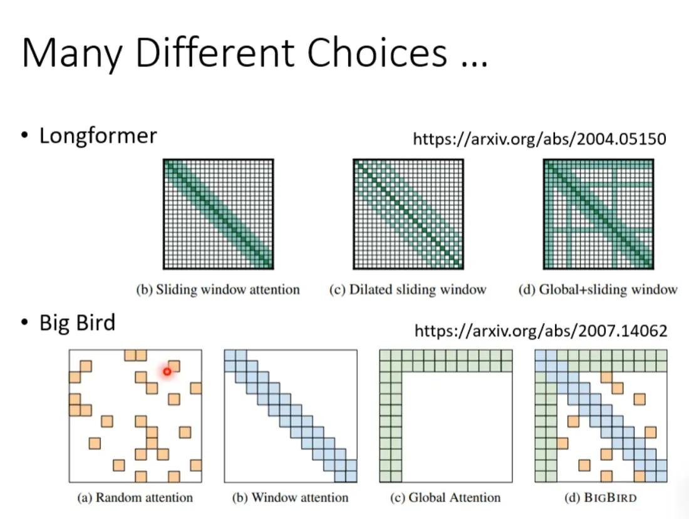

#### 8.2.5 Reformer：Clustering

上面集中方法都是人为设定的哪些地方需要算attention，哪些地方不需要算attention，但是这样算是最好的方法吗？并不一定。对于**Attention Matrix来说，如果某些位置值非常小，可以直接把这些位置置0，这样对实际预测的结果也不会有太大的影响**。也就是说我们只需要找出Attention Matrix中attention的值相对较大的值。但是如何找出哪些位置的值非常小/非常大呢？

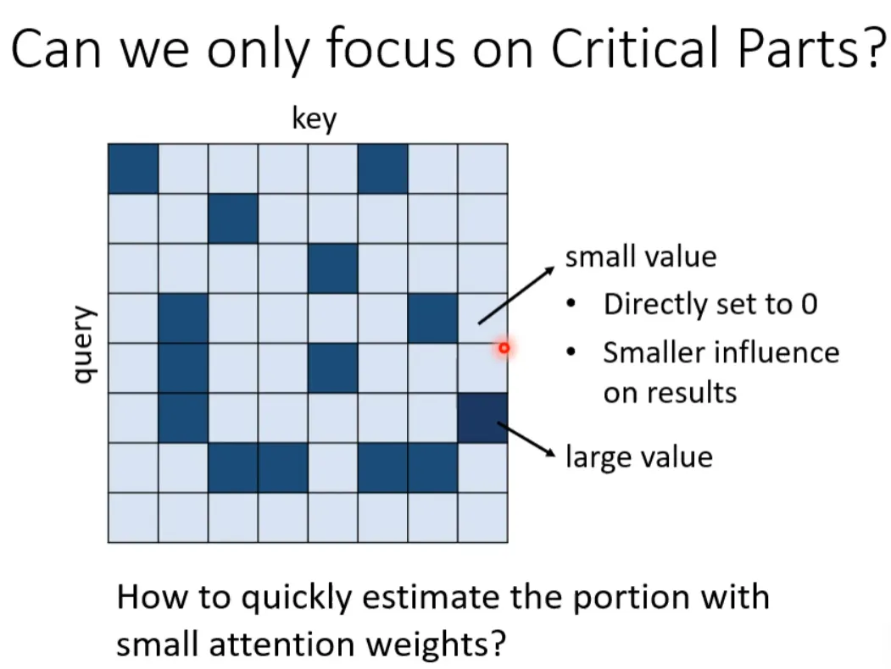

下面这两个文献中给出一种Clustering（聚类）的方案，即对query和key进行**聚类**，属于同一类的query和key来计算attention，不属于同一类的就不参与计算，这样就可以加快Attention Matrix的计算。比如下面这个例子中，分为4类：1（红框）、2（紫框）、3（绿框）、4（黄框）。在下面两个文献中介绍了可以快速粗略聚类的方法。
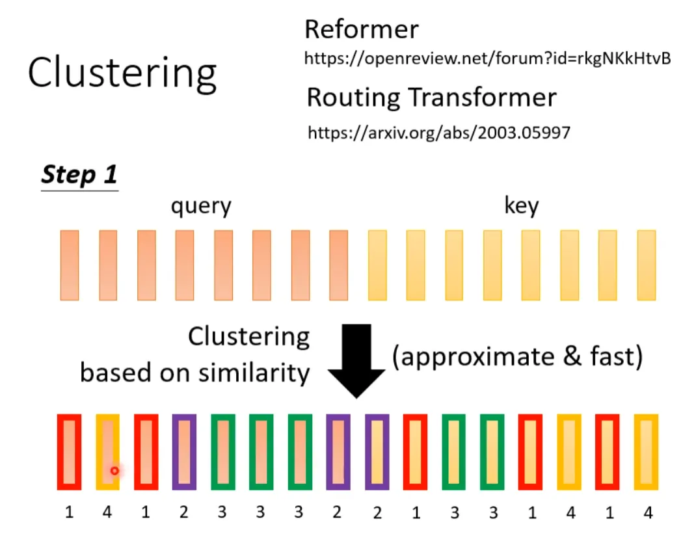

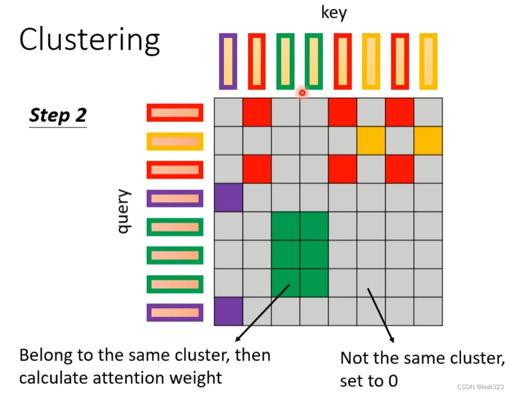

#### 8.2.6 sinkhorn：Learnable Patterns

那些地方要不要算attention，用学习来决定。再训练一个网络，输入是input sequence，输出是相同长度的weight sequence（N*N），将所有weight sequence拼接起来，再经过转换，就可以得到一个矩阵，值只有1和0，指明哪些地方需要算attention，哪些地方不需要算attention。该网络和其他网络一起被学出来。有一个细节是：某些不同的sequence可能经过NN输出后共用同一个weight sequence，这样可以大大减小计算量。

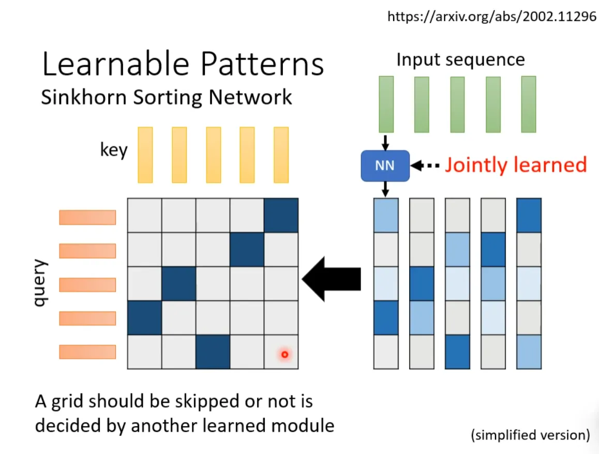

#### 8.2.7 Linformer：减少key数目

上述我们所讲的都是N\*N的Matrix，但是实际来说，这样的Matrix通常来说并不是满秩的，一些列是其他列的线性组合，也就是说我们可以对原始N\*N的矩阵降维，将重复的column去掉，得到一个比较小的Matrix。

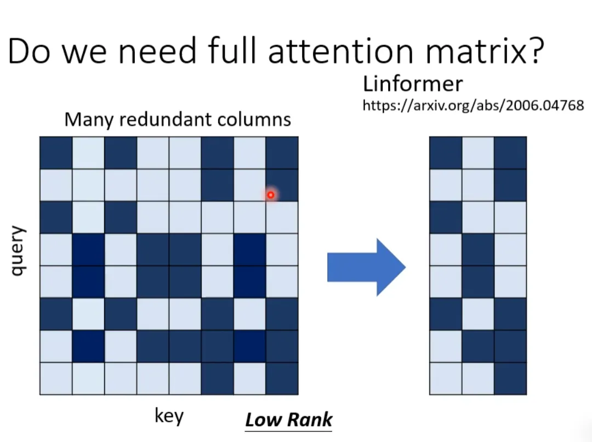

具体来说，**从N个key中选出K个具有代表的key，跟query做点乘，得到Attention Matrix。从N个value vector中选出K个具有代表的value，Attention Matrix的每一行对这K个value做weighted sum，得到self-attention模型的输出。**

为什么选有代表性的key不选有代表性的query呢？因为query跟output是对应的，这样会output就会缩短从而损失信息。
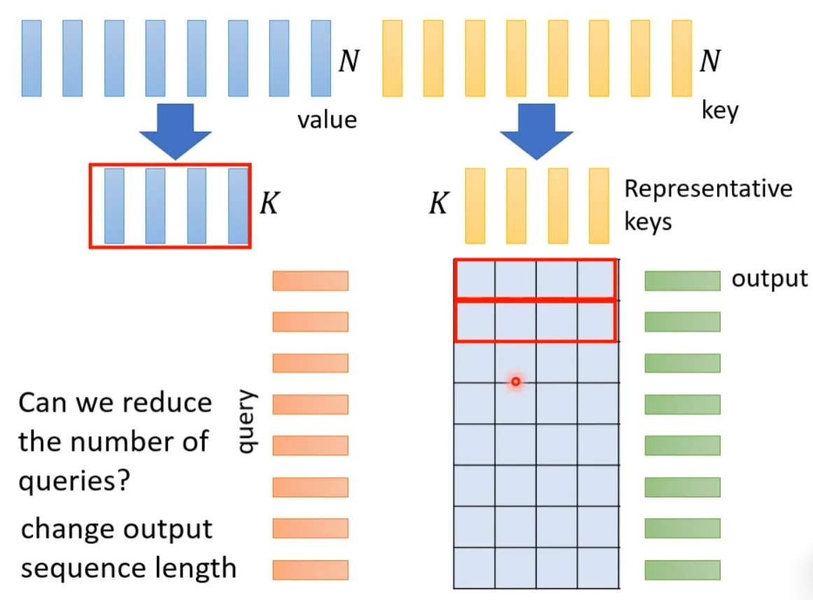

怎么选出有代表性的key呢？这里介绍两种方法，一种是直接对key做卷积（conv），一种是对key跟一个矩阵做矩阵乘法，就是将key矩阵的列做不同的线性组合。

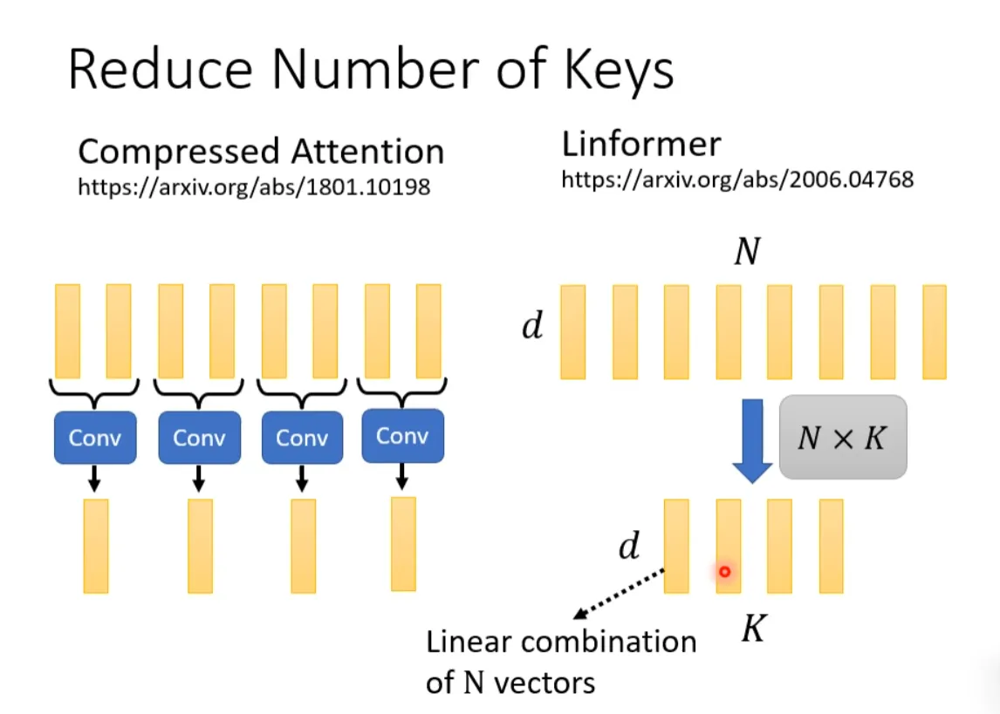

#### 8.2.7 Linear Transformer和Performer：另一种方式计算

回顾一下注意力机制的计算过程，其中I为输入矩阵，O为输出矩阵。

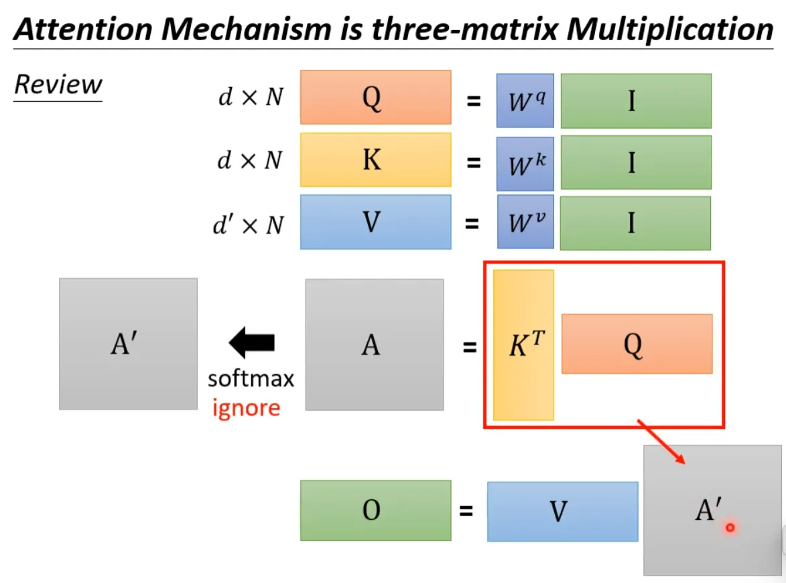

先忽略softmax，那么可以化成如下表示形式：

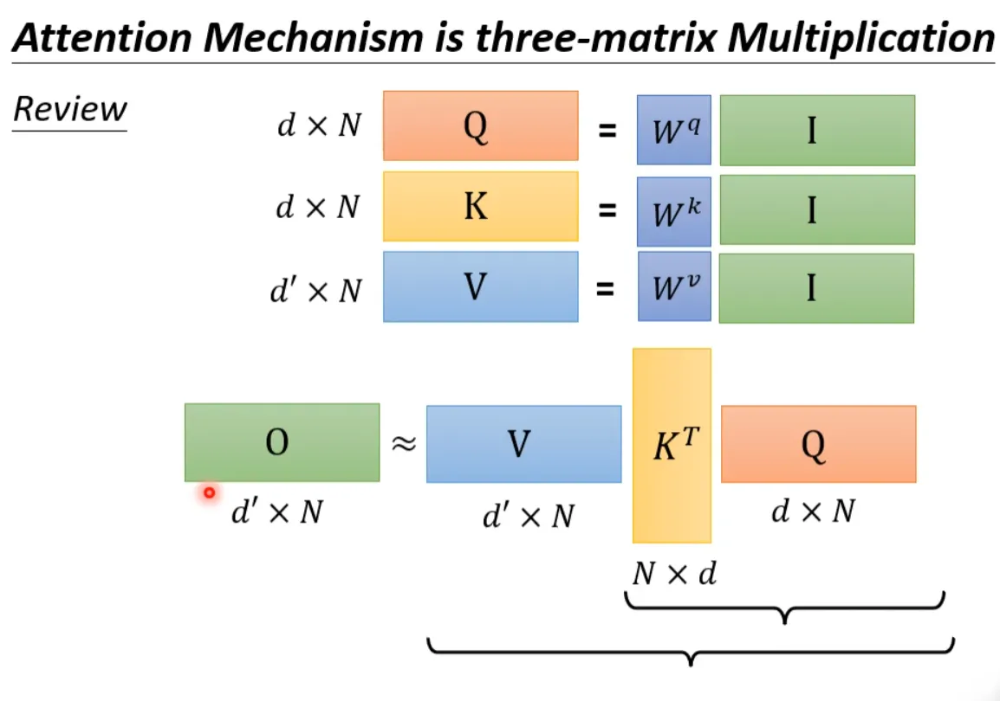

上述过程是可以加速的。如果先V\*K\^T，再乘Q的话，相比于K\^T\*Q，再乘V结果是相同的，但是计算量会大幅度减少。

附：线性代数关于这部分的说明

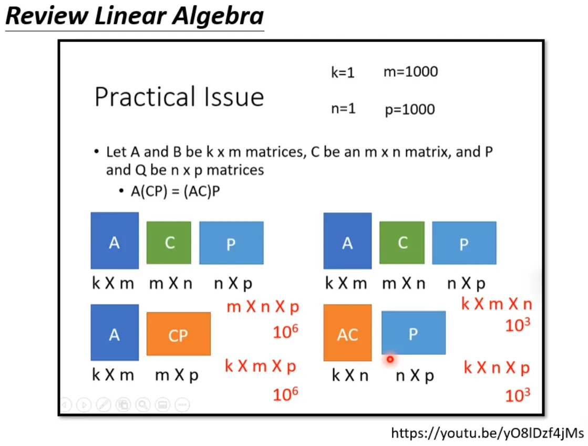

还是对上面的例子进行说明。K^T\*Q 会执行N\*d\*N次乘法，V\*A会再执行d'\*N\*N次乘法，那么一共需要执行的计算量是（d+d'）N^2。


V\*K^T会执行d'\*N\*d次乘法，再乘以Q会执行d'\*d\*N次乘法，所以总共需要执行的计算量是2\*d'\*d\*N。


而（d+d'）N^2>>2\*d'\*d\*N，所以通过改变运算顺序就可以大幅度提升运算效率。

现在我们把softmax拿回来。原来的self-attention是这个样子，以计算b1为例：


可以将exp(q*k)转换成两个映射相乘的形式，对上式进行进一步简化：

- 分母化简


- 分子化简


将括号里面的东西当做一个向量，M个向量组成M维的矩阵，在乘以φ(q1)，得到分子。


用图形化表示如下：


由上面可以看出蓝色的vector和黄色的vector其实跟b1中的1是没有关系的。也就是说，当我们算b2、b3...时，蓝色的vector和黄色的vector不需要再重复计算。


先找到一个转换的方式φ()对k进行转换得到M维向量φ(k)，然后φ(k)跟v做weighted sum得到M vectors。再对q做转换，φ(q)每个元素跟M vectors做weighted sum，得到一个向量，即是b的分子。


b1计算如下：


**对于不同b，M vectors只需要计算一次。**这种方式运算量会大幅度减少，计算结果一样的计算方法。b2计算如下：


可以这样去理解，sequence每一个位置都产生v，对这些v做线性组合得到M个template，然后通过φ(q)去寻找哪个template是最重要的，并进行矩阵的运算，得到输出b。

那么φ到底如何选择呢？不同的文献有不同的做法：


#### 8.2.8 Synthesizer：attention matrix通过学习得到

**attention matrix不是通过q和k计算得到的，而是作为网络参数学习得到。虽然不同的input sequence对应的attention weight是一样的，但是performance不会变差太多。**其实这也引发一个思考，attention的价值到底是什么？


#### 8.2.9 使用其他网络：不用attention

用mlp的方法用于代替attention来处理sequence。


### 8.3 总结

下图中，纵轴的LRA score数值越大，网络表现越好；横轴表示每秒可以处理多少sequence，越往右速度越快；圈圈越大，代表用到的memory越多（计算量越大）。

