# 对抗生成网络GAN

> https://blog.csdn.net/iwill323/article/details/127487363

## 1. 基本概念介绍

### 1.1 生成器（generator）

区别于给定x输出y的神经网络，现在给神经网络的输入添加一个从简单分布（Simple Distribution）中随机采样的变量，生成一个复杂的满足特定分布规律的输出（Complex Distribution）

> 随着z的不同，y的输出不同，由于z是个分布，因此y是个复杂的分布

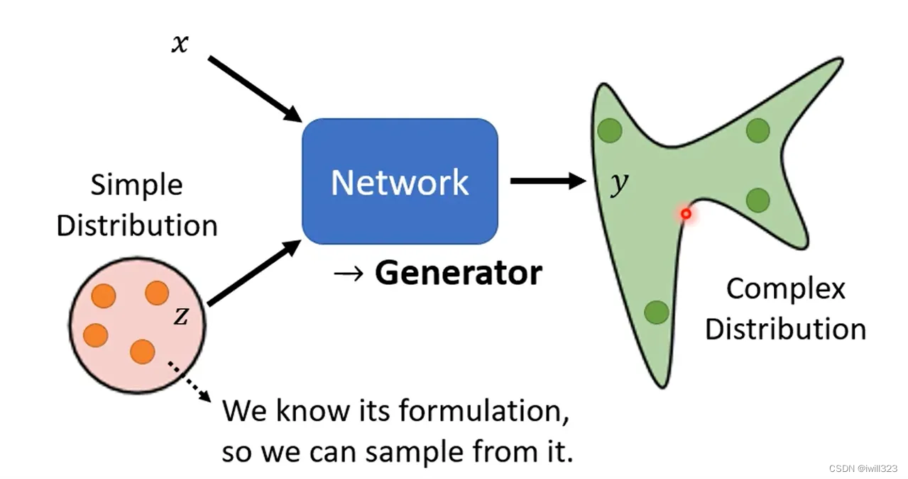

**分布：高斯分布、均一分布**

z所选择的不同的distribution之间的差异并没有真的非常大，generator会想办法把这个简单的distribution对应到一个复杂的distribution。所以可以简单地选择“正态分布”

方法：

- X，Z两个向量直接接起来，变成一个比较长的向量，作为network的input
- X跟Z正好长度一样，相加以后当做network的input 

#### 1.1.1 什么时候**需要输出一个分布**

video prediction 做的是输入过去的游戏画面（切成很多块），输出下一秒的游戏画面

当我们的任务**需要一点创造力的时候**，**一个输入有多种可能的输出**，这些不同的输出都是对的，但又只需要输出一个对象，这时就需要使用generator，在网络中加入随机输入，让网络在复杂分布中随机选择一个对象输出（输出有几率的分布）。

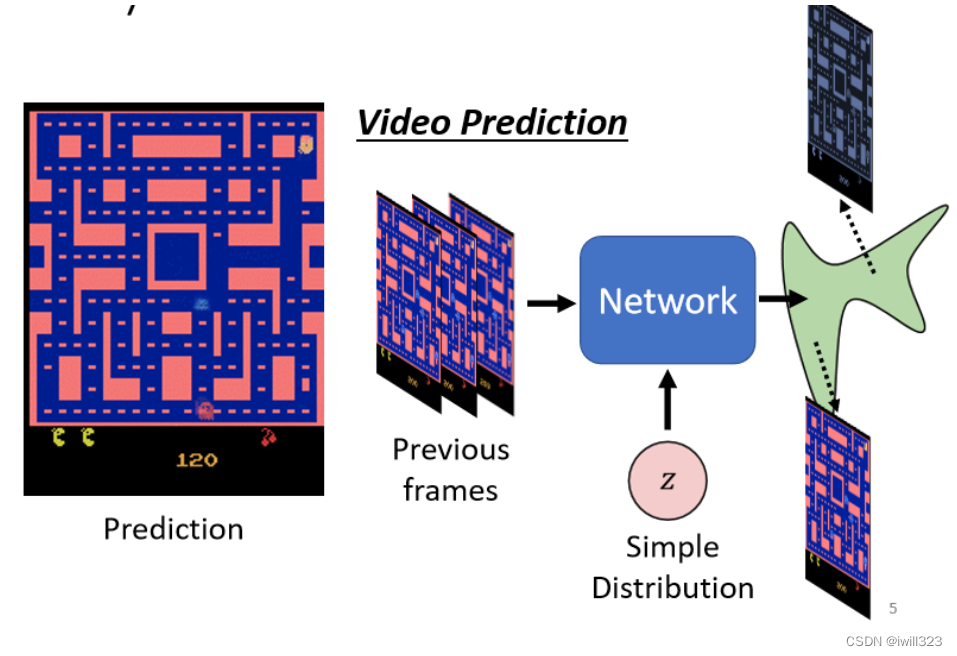

#### 1.1.2 Generative Adversarial Network (GAN)

GAN是众多generator中比较有代表性的一个，而GAN的种类也非常多，常常会出现重名的GAN和奇奇怪怪的GAN名字。

以unconditional generation（不考虑x，只考虑z）为例，**假设Z是从一个normal distribution里采样出来的向量，通常会是一个low dimensional的向量，维度是你自己决定的，丢到generator裡面**，输出一个非常高维的向量，希望是一个二次元人物的脸

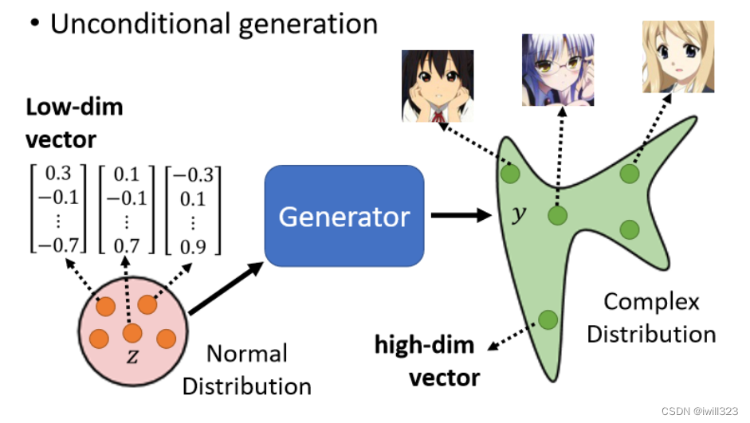

### 1.2 discriminator（鉴别器）

> Discriminator为了判别generator生成图像是否逼真，做动态博弈

Discriminator也是一个神经网络（可以考虑使用CNN、transformer等），可以将generator输出的图像转换成数字，越接近于1，说明图像越真实，品质越高。

### 1.3 GAN的基本思想和算法

generator和discriminator是对抗关系，discriminator通过真实的图像来监督generator的图形生成，两者不断相互进化。

1、随机初始化generator和discriminator。

2、固定generator不变，更新discriminator。

将generator产生的图像和数据库样本比较，让discriminator分辨二者之间的差异，从而把二者区分开。具体地说，就是 real ones 经 0过 D，输出值大（接近 1），generator 产生的数据 (generated ones) 经过 D，输出值小（接近 0）。

该训练可以当作分类的问题来做（把样本当作类别1，Generator產生的图片当作类别2），然后训练一个classifier；也可以当作regression的问题来做（样本对应输出1，generator產生的图形对应输出0）

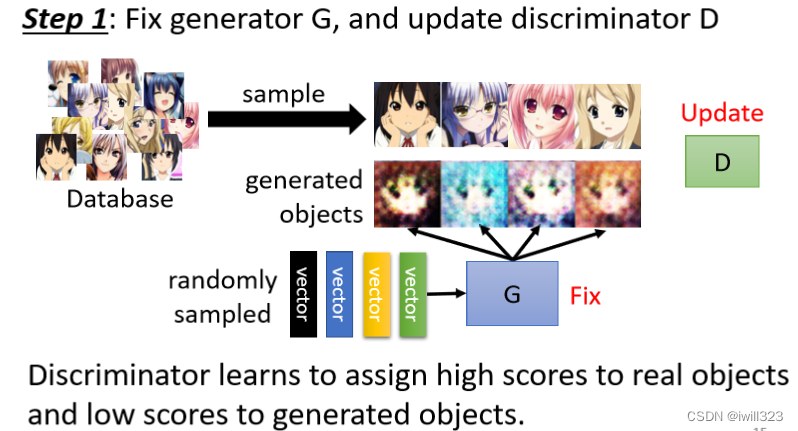

3、固定discriminator不变，更新generator。

从gaussian distribution采样作為generator输入，產生一个图片，把这个图片丢到Discriminator裡面，Discriminator会给这个图片一个分数，Generator训练的目标是要Discriminator的输出值越大越好，说明它产生的数据可以以假乱真

4、不断循环上述过程，直至产生很好的图像

实际中可以把 generator 和 discriminator 组成一个大的网络结构，如下图所示，前几层为 generator，后几层为 discriminator，**中间 hidden Layer 的输出就是 generator 的输出**，**即其为图像展开的向量**，更新generator的时候就只更改前面几层，而更新discriminator的时候就只更改后面几层。

理解：

Generator 或 Discriminator每次只有一个在训练。训练时，所掌握的是对方上一轮训练的信息。其实这就像是双方每一次交手后，知道对方最新的技术水平，然后回去提升自己。精妙，但是对训练过程提出了更高要求：如果其中一个训练过程中某几步loss上升，就会对另一个的训练会产生负面影响，后者又可能会对前者产生负面影响，恶性循环，导致训练“坏掉”。

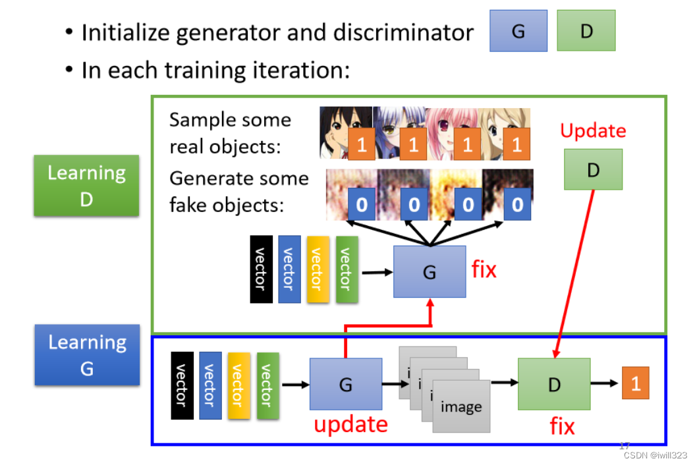

### 1.4 输入的向量做内插做interpolation

可以看到俩张图片连续的变化，往左边、右边看的人脸中间机器会学习到正面看的人脸

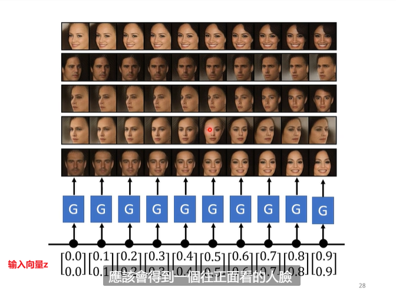

## 2. 应用实例

### 2.1 Anime Face Generation（动画人脸生成）

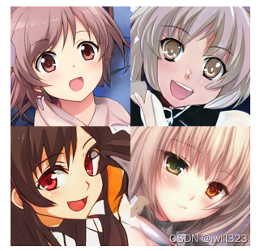

#### 2.1.1 Progressive GAN——真实人脸生成

生成“没有看过的\连续变化的”人脸。generator输入一个向量 输出一张图片。把输入的向量,做内插interpolation，看到两张图片之间连续的变化。

### 2.2 The first GAN

### 2.3 BigGAN

## 3. 设定目标与训练

### 3.1 GAN 的训练目标：让生成器产生的与真实数据之间的分布接近

从给定简单的 Normal Distribution 采样数据，经过 Generator，得到的输出分布PG，使其接近目标分布Pdata。于是要计算PG与Pdata这两个分布之间的距离，用Divergence表征，找一个genenrator尽量使Divergence小。

> Divergence用以衡量两个分布，其越大说明俩分布之间越不相似。越小则越相似

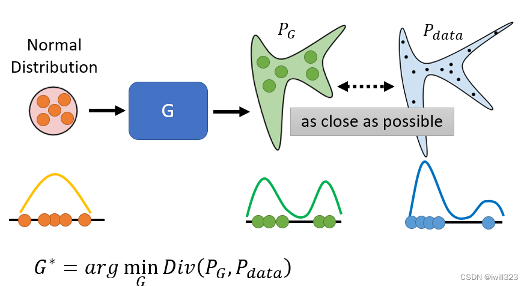

问题在于我们无法知道PG和Pdata的分布。GAN 告诉我们，不需要知道 PG 跟Pdata的分布具体长什麼样子，只要能从 PG 和 Pdata这两个分布中采样，就有办法算 Divergence。

关于采样：从数据库裡面随机采样一些图片出来，就得到 Pdata；从 Normal Distribution 裡面采样向量丢给 Generator，让 Generator 產生一堆图片出来，那这些图片就是从 PG采样出来的结果

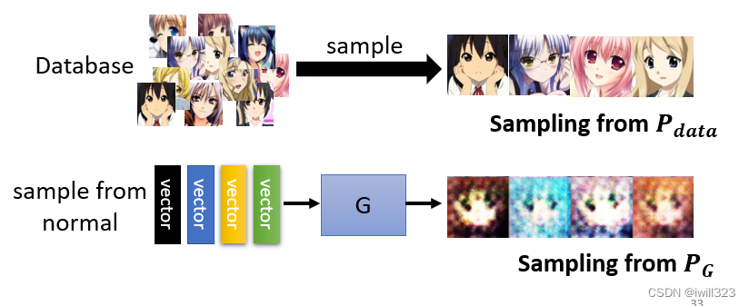

### 3.2 **借助Discriminator 的力量计算 Divergence**

**Discriminator训练目标是看到Pdata给一个较高的分数，看到PG给一个比较低的分数。**这个 Optimization 的问题如下（要Maximize 的东西叫 Objective Function，如果 Minimize 就叫它 Loss Function）：

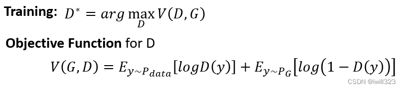

之所以写成这个样子，是因为在最开始设计时，希望在训练Discriminator时能够**按照分类问题的方式考虑**，事实上这个 Objective Function 就是 **Cross Entropy 乘一个负号**。Discriminator可以当做是一个分类器，它做的事情就是把从 Pdata 采样出来的真实 Image当作 Class 1，把从 PG 采样出来的假 Image当作 Class 2，训练过程等价于训练一个二元分类器。
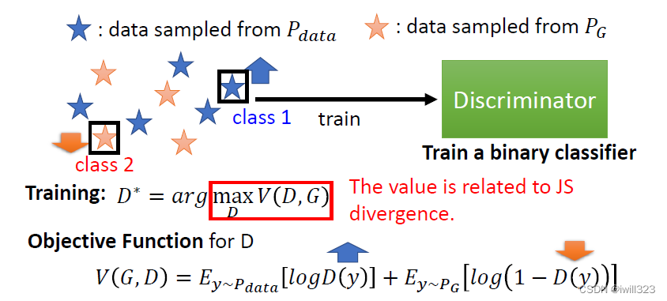

### 3.3 从Objective Function到JS divergence

经过推导可以发现，𝑉(𝐷,𝐺)的最大值和JS divergence相关，详细的证明请参见 GAN 原始的 Paper。直观上也可以理解：如果Discriminator 很难分辨 PG 和 Pdata，没办法准确打分，那么Objective Function的最大值就比较小，所以**小的 Divergence对应小的Max 𝑉(𝐷,𝐺)**，**反之假如PG 和 Pdata 很不像，divergence大，Discriminator 很容易就把两者分开了，得到的Max 𝑉(𝐷,𝐺)大**。

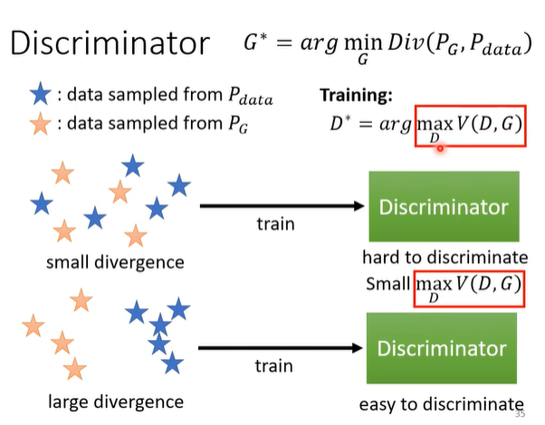

**Generator的目标是使PG 和 Pdata的 JS divergence 尽量小**（因此在max的外面需要加上一个max）

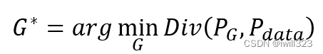

卡在不知道怎麼计算 Divergence。现在**因为maxV(D, G)与divergence有关，所以可以用maxV(D, G)代替Div(PG, Pdata)，这样就实现了不用了解PG和Pdata具体样貌即可计算divergence。**
于是Generator的目标函数写成如下。

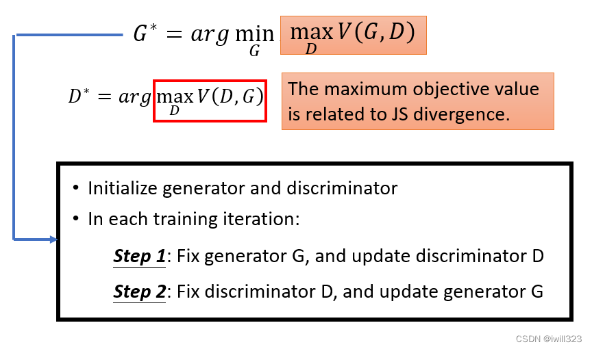

### 3.4 使用其他的divergence

改变objective function即V(D, G)就可以计算其他类型的divergence。这里有一篇文章https://arxiv.org/abs/1606.00709，会告诉你不同的divergence要怎样设计Objective Function
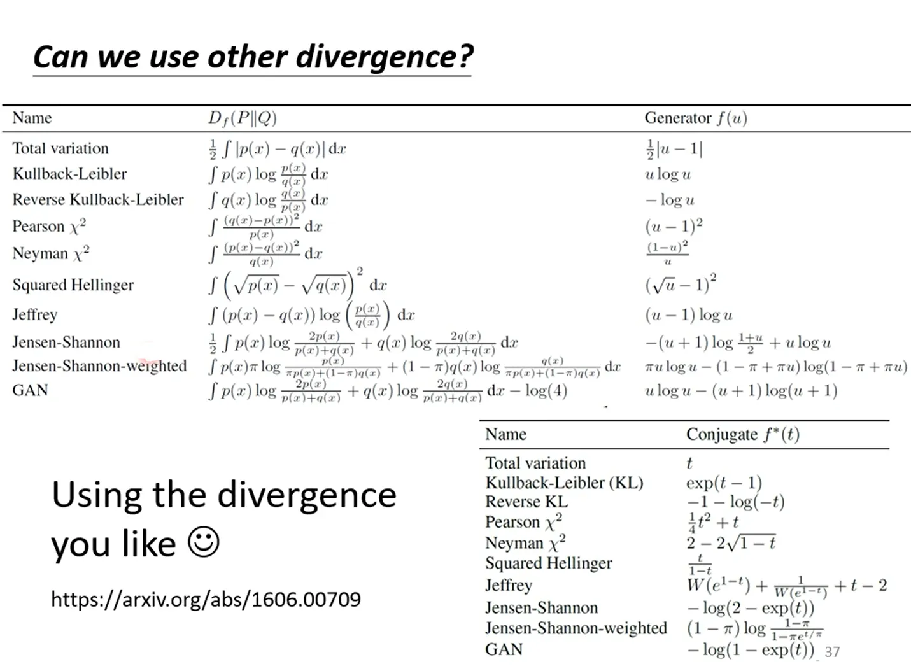

### 3.5 JS divergence存在的问题

#### 3.5.1 PG和Pdata重叠的范围很小

大多数情况下，PG和Pdata重叠的范围很小。理由如下：

**1、PG和Pdata在高维空间中时低维的形态**

图片是高维空间裡面的一个非常狭窄的低维的 Manifold（流形）。在高维空间裡面随便采样一个点，它通常都没有办法构成一个二次元人物的头像，只有非常小的范围Sample 出来会是图片，所以二次元人物的头像的分布，**在高维的空间中其实是非常狭窄的，除非PG 跟 Pdata 刚好重合，不然它们相交的范围几乎是可以忽略的**
**2、采样的数量可能不够多**

也许 PG 跟 Pdata有非常大的 Overlap 的范围，但是在计算 PG和Pdata的 Divergence 的时候，从 Pdata和PG 裡面分布采样一些点出来，如果采样的点不够多、不够密，那么就算是这两个Distribution 实际上有重叠，对 Discriminator 来说，它也是没有重叠的

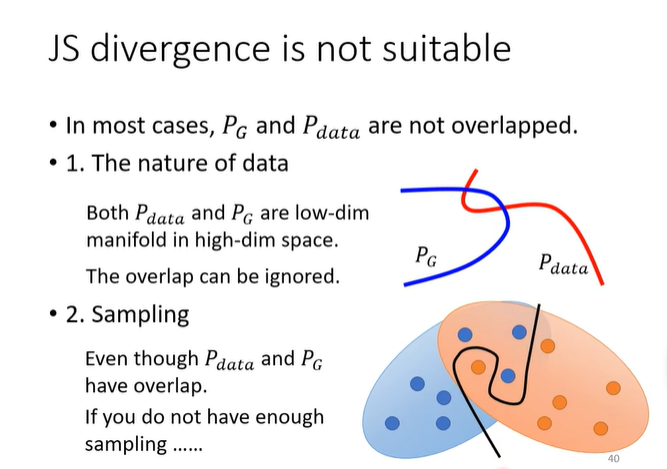

#### 3.5.2 重叠部分少导致的问题

**如果两个分布不重合，那么计算出来的JS divergence永远都是log2，所以改变了generator之后，根本看不出generator有没有更好，永远无法进化generator。**用 Binary Classifier当作 Discriminator，训练 GAN 的时候会发现，几乎每次训练完Discriminator 以后，正确率都是 100%。两组 Image 都是采样出来的，它硬背都可以得到100% 的正确率,

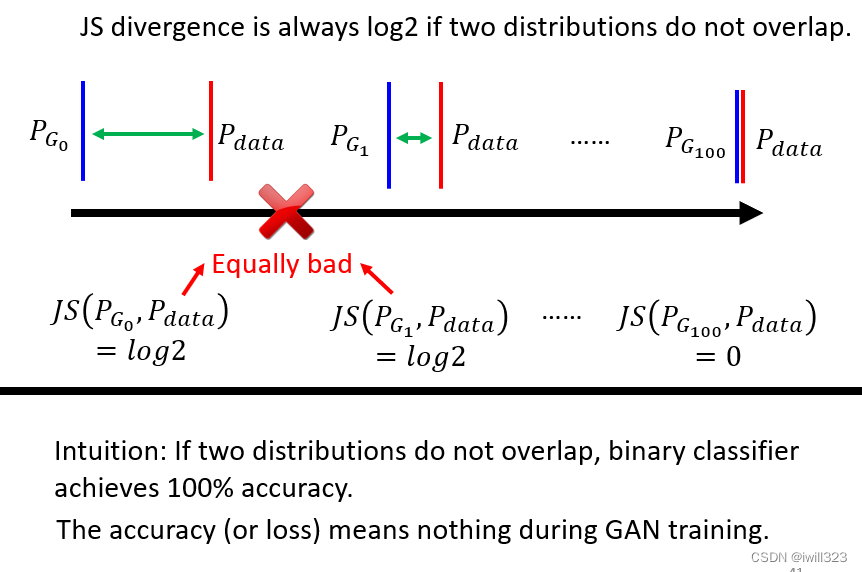

### 3.6 Wasserstein distance

#### 3.6.1 Wasserstein distance概念：另一种计算divergence的方法

把分布想象成一个小土堆，从土堆P 变换到土堆Q有很多种变换的方式，最小的平均移动距离(smallest average distance)就是Wasserstein distance。用将（假设一堆土）P移到Q的位置的**距离衡量两个分布P与Q之间的差异。**

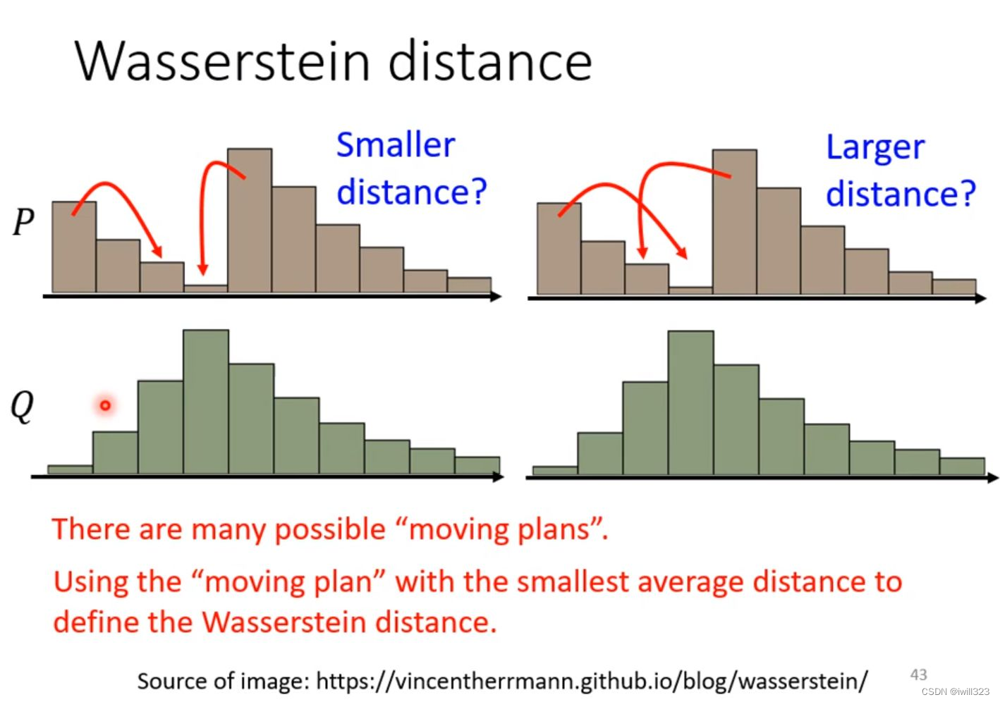

#### 3.6.2 Wasserstein distance**好处**

假如我们能算出Wasserstein distance，与JS divergence相比，能看出改进之后的generator是否更好。这样，Generator 就可以根据结果来一点点提高。

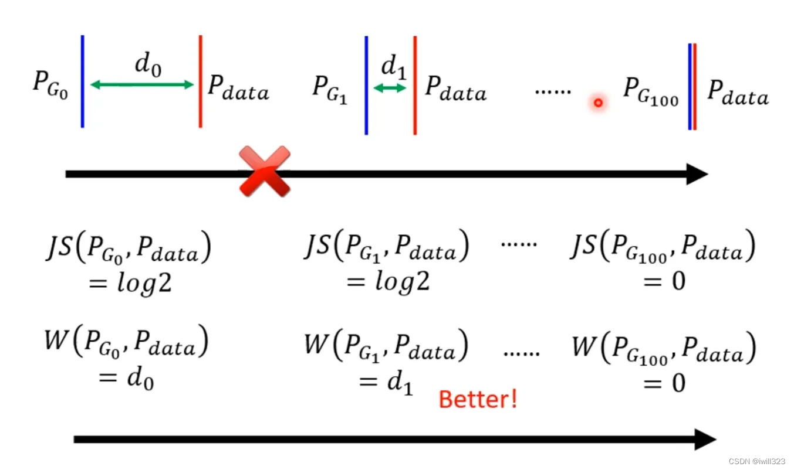

#### 3.6.3 计算方法和WGAN

**WGAN就是用W distance取代JS distance的GAN**

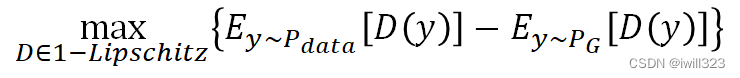

其中的D有限制条件：D必须要是一个 1-Lipschitz 的 Function，即D 不可以是变动很剧烈的 Function，必须要是一个足够平滑的 Function。

原因：W distance计算公式要求Pdata的 D(y) 越大越好，PG 的 D(y) 越小越好，所以在Pdata分布和PG分布没有任何重叠的地方，对于Pdata采样，Discriminator 会让D(y) = +∞，对于PG采样， Discriminator 会让D(y) = -∞，算出来的Maximum 值都是无限大，训练中学不到东西。**1-Lipschitz限制条件让曲线要连续而不能剧烈变化，保证真实与生成之间的差异不太大**，于是它们不会都跑到无限大。
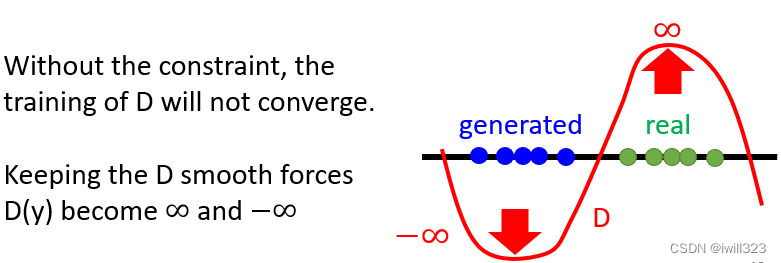

其中的1-lipschitz是怎么实现的呢？有以下三种主要方式：	

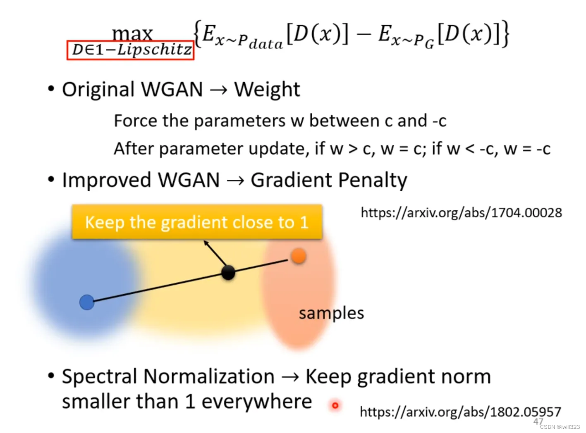

- Train Network 的时候，参数要求在 C跟 -C 之间，用 Gradient Descent Update 后，如果超过 C，设為 C，小於 -C，就直接设為 -C。这个方法并不一定真的能够让 Discriminator变成 1-Lipschitz Function
- Improved WGAN是指，从PG中取一个点，从Pdata中取一个点，两个点连线中间取一个点，让这个点的梯度为1，具体为什么这么做，见原始论文。
- 还有一种是谱归一化（Spectral Normalization）的方式，具体也是见原始论文

### 3.7 GAN is still challenging

虽然说已经有 WGAN，但GAN 的训练仍然不是一件容易的事情。Generator 跟 Discriminator是互相砥砺才能互相成长的，只要其中一者发生什麼问题停止训练，另外一者就会跟著停下训练，跟著变差。需要保证二者的loss在这一过程中不断下降。

**假设在训练Discriminator 的时候一下子没有训练好，Discriminator 没有办法分辨真的跟產生出来的图片的差异，那么 Generator就失去了可以进步的目标，没有办法再进步了。如果 Generator 没有办法再进步，它没有办法再產生更真实的图片，那么 Discriminator 就没有办法再跟著进步了。**

训练过程中没有办法保证 Loss 就一定会下降，如果有一次没有下降，就会出现连锁反应，整个结构都不再改进。要让 Network训练起来，往往需要调一下 Hyperparameter

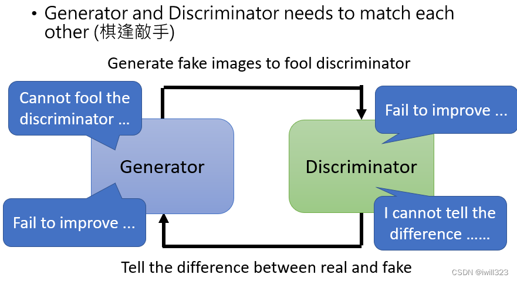

Train GAN 的诀窍有关的文献：

• Tips from Soumith
• https://github.com/soumith/ganhacks
• Tips in DCGAN: Guideline for network architecture design for image generation
• https://arxiv.org/abs/1511.06434
• Improved techniques for training GANs
• https://arxiv.org/abs/1606.03498
• Tips from BigGAN
• https://arxiv.org/abs/1809.11096

### 3.8 GAN for Sequence Generation

最难的是拿 GAN 来生成文字。如果要生成一段文字，可以把 Transformer 的 Decoder 部分看成是 GAN 的 Generator，生成的 sequence 送入 Discriminator 中判断是不是真的文字
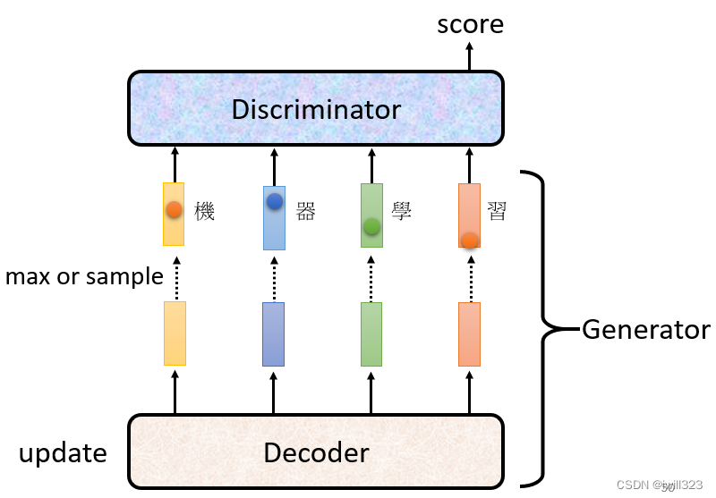

真正的的难点在於，如果要用 Gradient Descent去训练Decoder，会发现loss 没办法做微分。

**如果Decoder 的参数有一点小小的变化，那么它现在输出的这个 Distribution也会有小小的变化，Generator 的输出是取概率最大的那个Token（Token是產生一个句子的单位）， 会发现概率最大的那个 Token没有改变，那对 Discriminator 来说，它输出的就没有改变，所以没有办法算微分，也就没有办法做 Gradient Descent。**
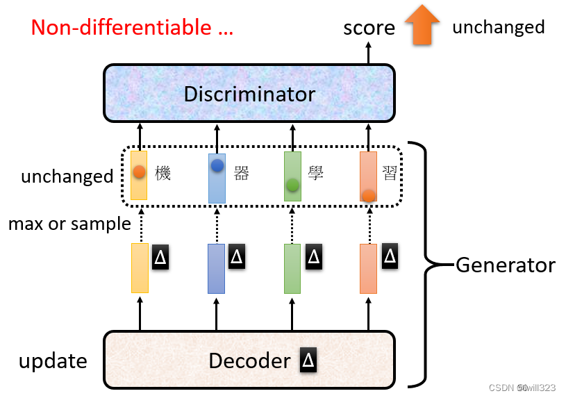

一篇 Paper 叫做 ScrachGAN，可以直接从随机的初始化参数开始Train 它的 Generator，然后让 Generator 產生文字，最关键的就是爆调 Hyperparameter,跟一大堆的 Tips

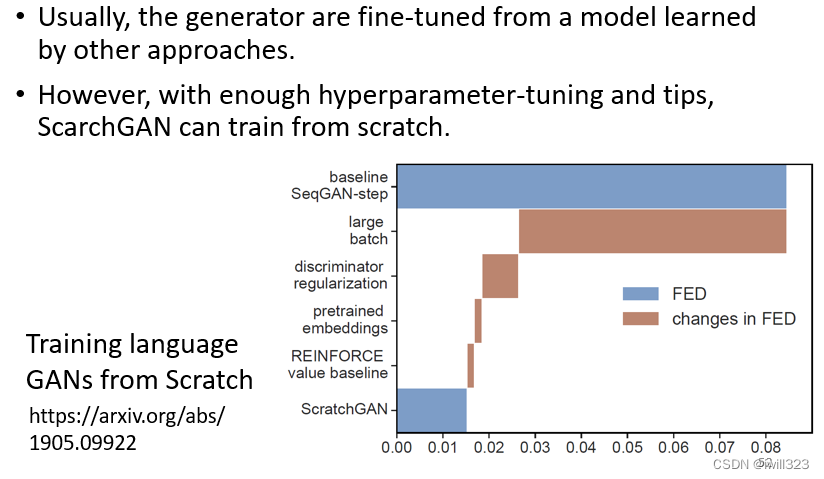

- 如果generator是序列生成模型，要取max，但经过discriminator对generator参数的梯度下降对token的生成影响很小，但cnn中有max pooling为什么还可以做梯度下降的更新呢？

argmax是不可导的，因为argmax(x1，x2)的取值是0ifx1>x2，1ifx2>x1，并且只要x1和x2不相等，那么对x1和x2进行一个很微小的变化，argmax的值是不发生变化的。

argmax是一种函数，是对函数求参数(集合)的函数。

#### 采用监督学习的另一种解决方案

即随机采样高斯分布作为x,将其人为配对到图像y上，从而可以采用监督学习的方法，如下所示

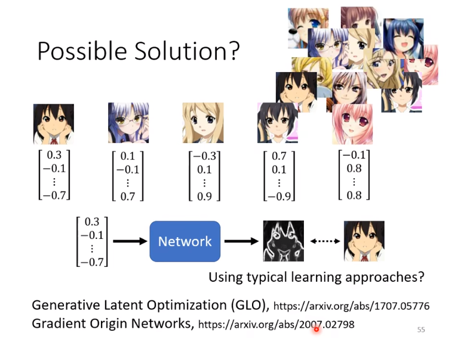

## 4. Conditional Generation(CGAN)

unconditional generation 产生的图片天马行空，可能不是我们想要的，所以要加入一些限制条件x，操控 Generator 的输出。

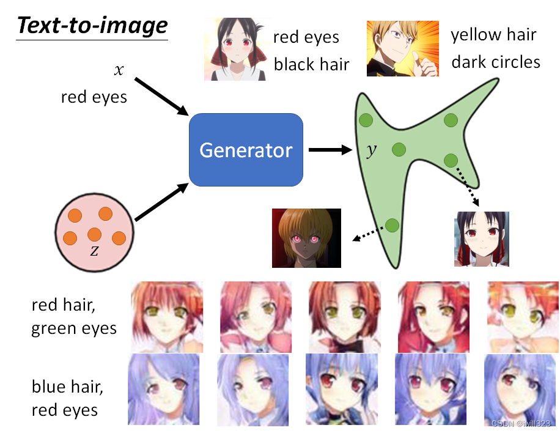

unconditional generation 是不需要标注的，这里的 conditional GAN 则需要一些标注，也就是说引入了有监督学习。这也好理解，既然对机器产生的数据有一定要求，肯定要有示例告诉机器应该怎么做。一方面图片要好，另外一方面图片跟文字的叙述必须要是相配的，Discriminator 才会给高分。
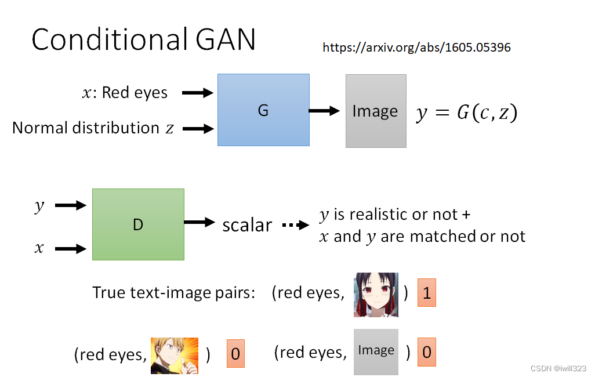

以文字生成图片 (Text-to-image) 为例，Discriminator 的输入为带有标签的图片（paired image）。标签要有多样性，这样条件式生成器的效果才好。**Discriminator 的训练目标是：输入为（文字，对应的训练图片）时，输出为 1；输入为（文字，生成的图片）时，输出为 0。除此之外，还需要一种 negative sample：（文字，好但不对应的训练图片），输出为 0。如下图所示：**
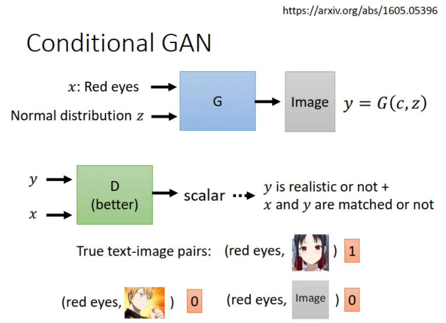

更多应用例子：

#### 4.1 Image translation (pix2pix)

- 给它房屋的设计图,然后让你的 Generator 直接把房屋產生出来
- 给它黑白的图片,然后让它把顏色著上
- 给它这个素描的图,让它把它变成实景 实物
- 那给它这个白天的图片,让它变成晚上的图片
- 有时候你会给它,比如说起雾的图片,让它变成没有雾的图片,把雾去掉

**例如：从建筑结构图到房屋照片的转换效果如下图所示，如果用 supervised learning，得到的图片很模糊，为什么？因为一个建筑结构图对应有多种房屋外形，Generator学到的就是把不同的可能平均起来，结果变成一个模糊的结果。**如果用 GAN，机器有点自由发挥了，房屋左上角有一个烟囱或窗户的东西。而用 GAN+supervised，也就是 conditional GAN，生成的图片效果就很好。
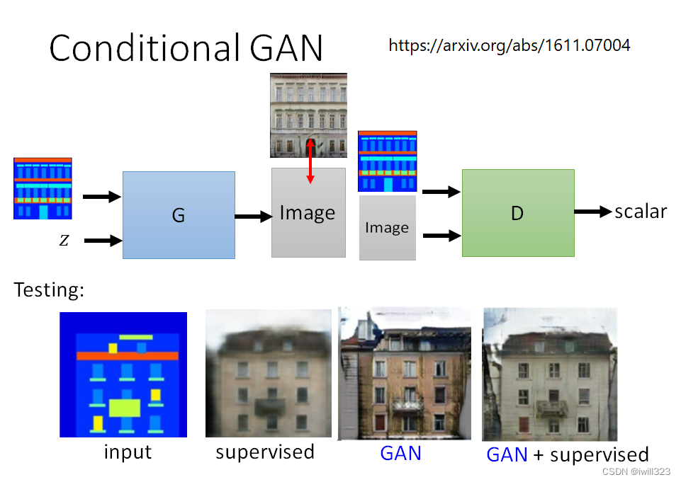

#### 4.2 sound-to image：从声音生成相应的图片，比如输入水声，生成溪流图片。

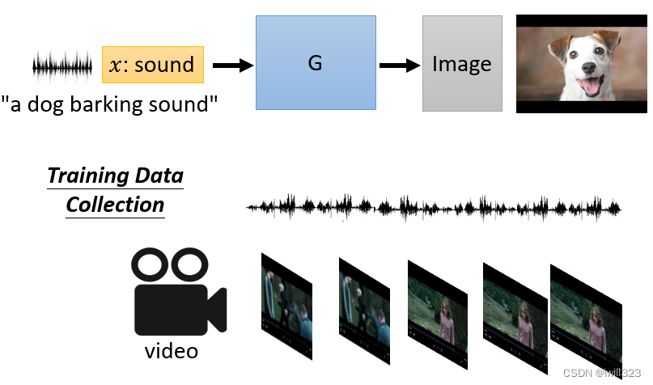

影片裡面有影像有画面,也有声音讯号，这一帧的画面,对应到这一小段声音

#### 4.3 talking head generation：静态图转动态，让照片里的人物动起来。

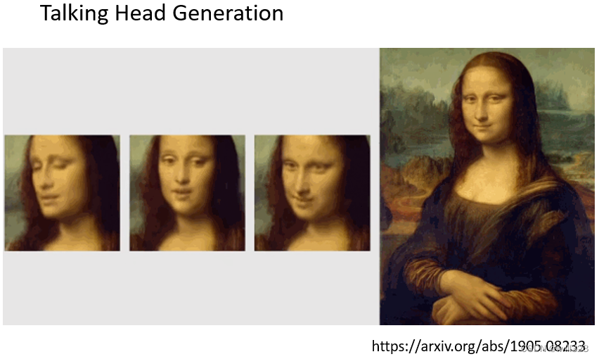

## 5. cycle GAN

实际中，常常有一堆X，有一堆Y，但X跟Y是不成对的，就叫做unlabeled的资料。怎么利用上这部分数据呢？有一个方法是 semi-supervised learning，只需要少量标注数据，未标注数据可以用模型标注 (pseudo label)。但是尽管是少量，还是要用标注数据来训练模型，否则模型效果不好，标注也不好。

有的时候连一点标注数据都没有，例如图像风格转换，假设我们有一些人脸图片，另外有一些动漫头像，两者没有对应关系，也就是 unpaired data，如下图所示。Cycle GAN 就是为了解决这个问题。

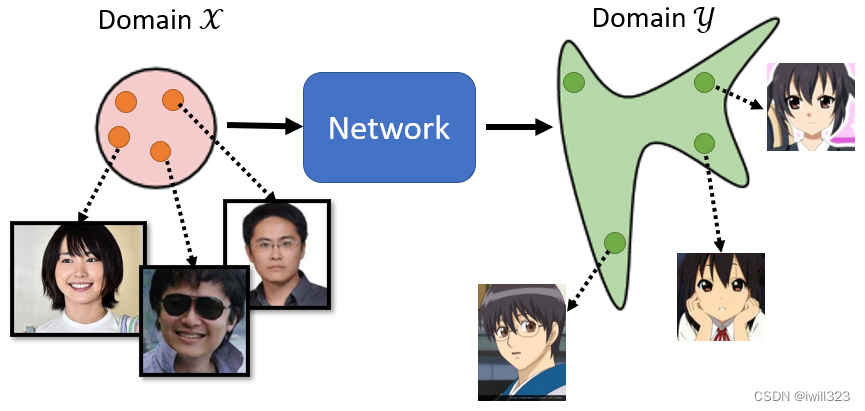

### 5.1 实现方式

与前面介绍的 GAN 不同，Cycle GAN 的输入不是从 Gaussian Distribution 采样，而是从 original data 采样，生成动漫头像图片，如下图所示：

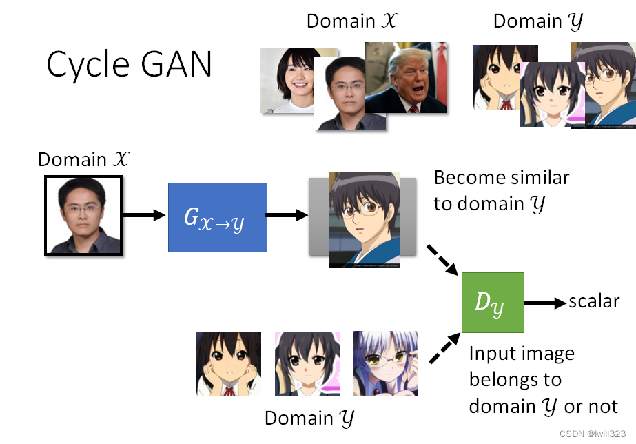

思路1：只套用一般的GAN的做法，显然是不够的，因為discriminator只会鉴别y是不是二次元图片，训练出来的generator可以產生二次元人物的头像，**但是跟输入的真实的照片没有什麼特别的关係。**

思路2：又不能用 conditional GAN 来做，**因為在conditional GAN裡面是有成对的资料**
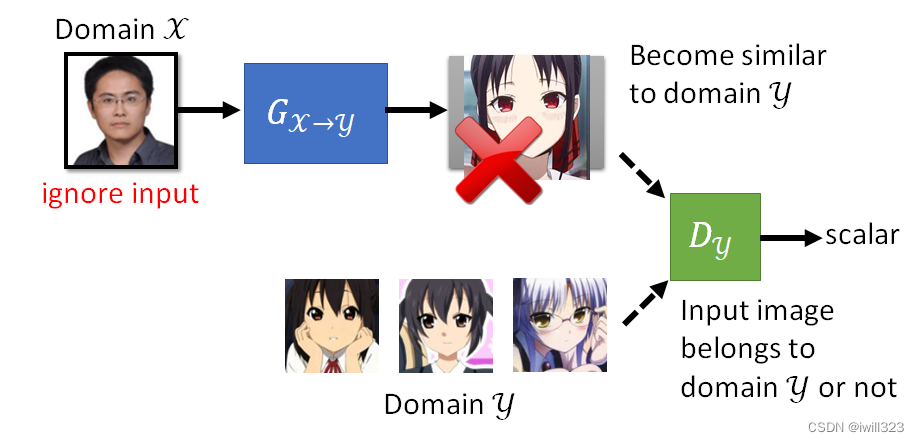

思路3：**Cycle GAN 增加了一个generator，把生成的动漫图片再变换到人物图片，训练使生成的人物图片与原图尽量接近，以此强迫generator输出的Y domain的图片跟输入的X domain的图片有一些关係。**怎麼让两张图片越接近越好呢？两张图片就是两个向量，这两个向量之间的距离越接近，两张图片就越像，叫做Cycle consistency

所以现在这边我们有三个Network

1. 第一个generator，它的工作是把X domain的图变成Y domain的图
2. 第二个generator，它的工作是把Y domain的图还原回X domain的图
3. discriminator，它的工作仍然是要看蓝色的generator的输出像不像是Y domain的图

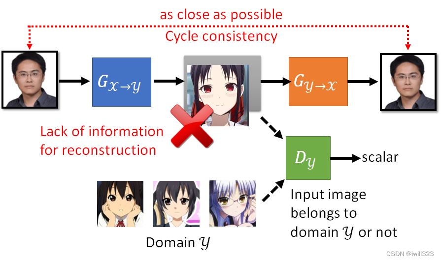

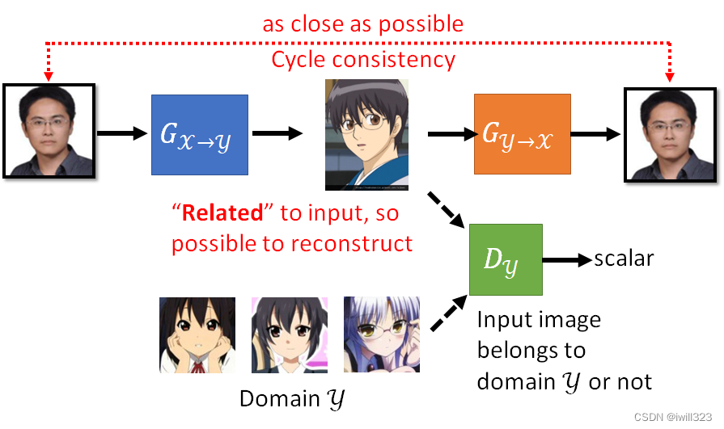

可能会有的一个问题就是，Cycle GAN只保证有一些关係，也许机器会学到很奇怪的转换（比如将图像左右翻转），反正只要第二个generator可以转得回来就好了，怎么确保这个关係是我们要的呢。目前没有什麼特别好的解法。**但是在真实的实作上，即使没有用cycle的普通GAN，训练出来的结果也还是不错，输入跟输出往往非常像，因为模型很懒，不想改动太多。**

此外，还可以反向训练，从动漫图片到人物图片，再到动漫图片，依然要让输入跟输出越接近越好。要训练一个discriminator，看一张图片像不像是真实人脸。**训练 Cycle GAN 时可以两个方向同时训练。**
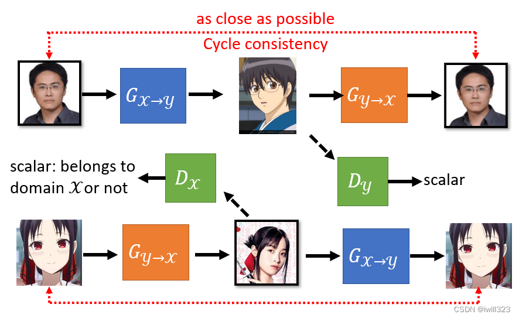

### 5.2 More style-transfer GAN

Cycle GAN、Disco GAN、Dual GAN是一样的，不同研究团队在同一时间提出，因此有不同命名。

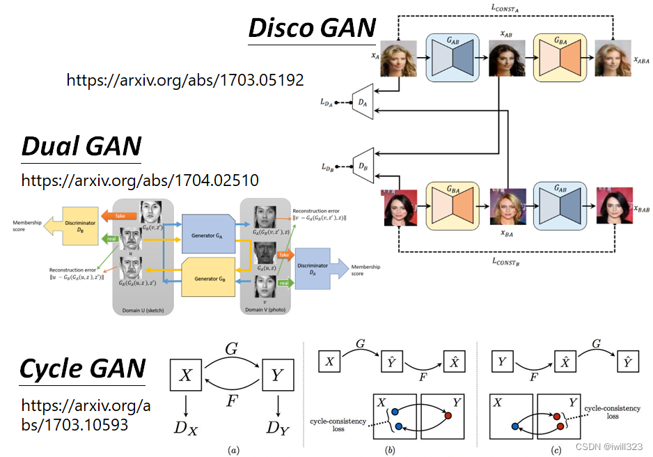

#### 5.2.1 StarGAN

可以做影像风格转换的版本，可以在多种风格间做转换

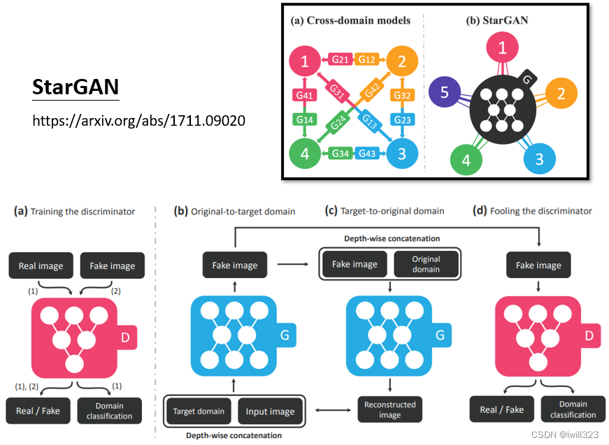

#### 5.2.2 Text Style Transfer

输入一个句子,输出另外一个风格的句子，主要利用Transformer的架构。比如把消极的文字都转换为积极的文字。训练过程跟Cycle GAN是一模一样的,首先你要有训练资料,收集一大堆负面的句子,收集一大堆正面的句子。完全套用Cycle GAN的方法,完全没有任何不同。

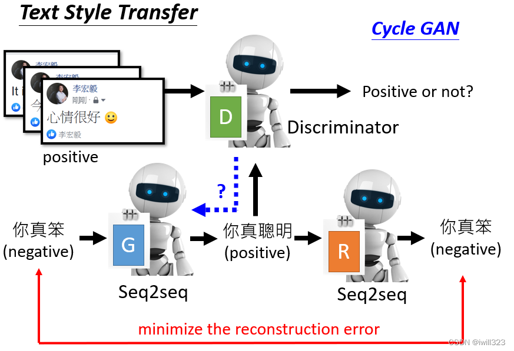

#### 5.2.3 文本摘要

有很多长的文章和另外一堆摘要，这些摘要不是这些长的文章的摘要，是不同的来源，让机器学习文字风格的转换，可以让机器学会把长的文章变成简短的摘要，让它学会怎麼精简的写作，把长的文章变成短的句子

#### 5.2.4 无监督翻译

unsupervised的翻译，收集一堆英文的句子，一堆中文的句子，没有任何成对的资料，用Cycle GAN做，机器学会把中文翻成英文

#### 5.2.5 无监督语音辨识

非督导式的语音辨识，机器只听了一堆声音，这些声音没有对应的文字，机器上网爬一堆文字,这些文字没有对应的声音，用Cycle GAN做，看看机器有没有办法把声音转成文字

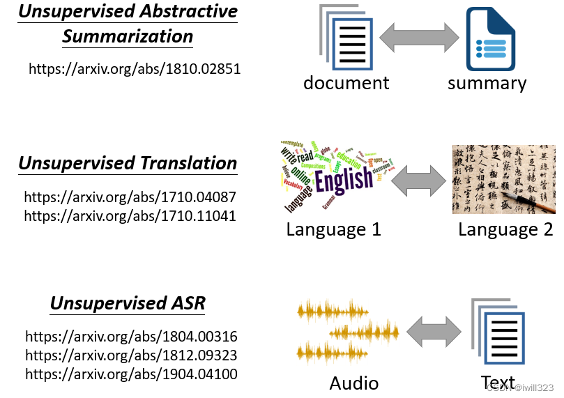

## 6. 生成器效能评估

对于监督学习，模型输出可以和 label 比对，而 Generator 生成的图片与原来的图片相似但不相同，怎么去判断呢

### 6.1 图片质量：对一张图片

输入图片y，**经过图片分类系统Classifier，得出一个概率分布P(c|y)，虽然我们不知道產生的图片裡面有什麼东西，但是如果概率分布集中在某个类别，说明 Classifier 对于输出的类别很确定，也许是比较接近真实的图片，所以Classifier才辨识得出来，也就是这张图片质量好**。如果概率分布平均，说明Classifier 不太确定看到的图片属于哪个类别，Generator 生成的图片可能是一个四不像，质量不佳，故而Classifier 都认不出这是什么。

### 6.2 图像的多样性：对所有（一批）图片

#### 6.2.1 模型崩溃Mode Collapse

只采用P(c|y)评估方法则**会产生Mode Collapse问题，即生成的分布局限在真实分布的很小一部分**。当 Generator 產生可以骗过Discriminator图片以后，它就可以反复地生成这种图片来骗过Discriminator，最后发现生成的图片里面有很多同一张脸，只是有头发等细节的微小变化而已，造成了多样性的降低。
解决：在训练Generator的时候，一路上都会把Model的checkpoint 存下来，在 Mode Collapse 之前把训练停下来，然后就把之前的 Model 拿出来用

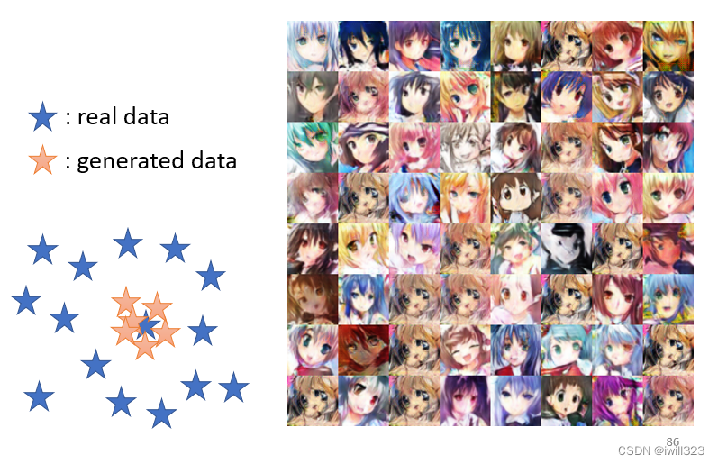

#### 6.2.2 Mode Dropping

训练输出的分布范围较大，单纯看產生出来的资料，可能会觉得还不错，而且它的多样性也够，但也只是真实资料的一部分，没有完全覆盖真实数据分布（多样性减小）。比如下图，**人的多样性也有，但还是远小于实际上人的多样性，因为产生的人脸总是这么几十个人，每一个训练轮次之间只是有肤色等整体细节的细微差别而已**。
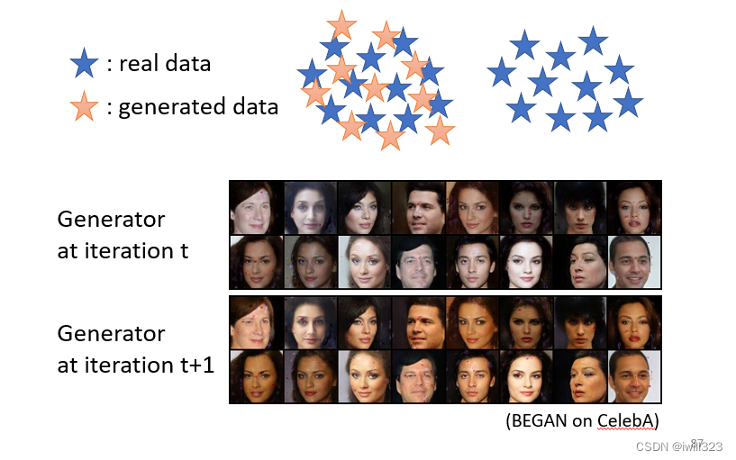

#### 6.2.3 Mode Collapse与Mode Dropping的区别

前者是针对一张图片而言的，generator针对一张真实图片反复生成能骗过discriminator的图片；后者是针对一堆图片而言，generator针对几十张真实图片反复生成能骗过discriminator的图片。但两者都是多样性问题。

#### 6.2.4 如何衡量生成图片的多样性

每一张照片经过图片辨识系统后Classifier，会产生概率分布，也就是图片是属于哪一类。把一组 generated data 输入Classifier，将这些几率分布做平均，用P(y)表示。如果P(y)非常集中，就代表现在多样性不够，如果平均之后的分布平坦，表明图片的多样性足够了。

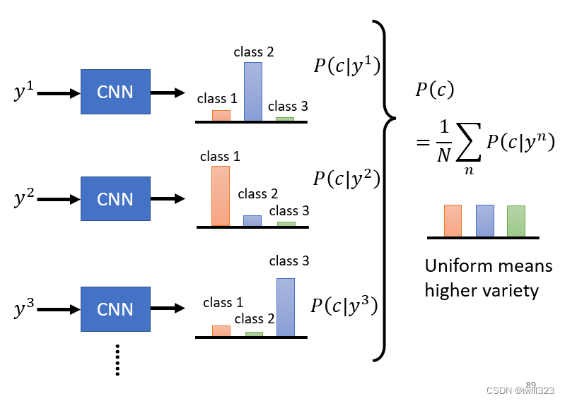

疑问：为什么前面 Quality of Image 说要概率分布集中在某个类别好，这里 Diversity 又说要概率分布均匀好，这不是互相矛盾吗？

**看 Quality of Image 时，Classifier 的输入是一张图片。看 Diversity 时，Classifier 的输入是 Generater 生成的所有图片，对所有的输出取平均来衡量。**

### 6.3 量化指标

#### 6.3.1 Inception Score (IS)

基于CNN的Inception网络，结合了 Quality of Image 和 Diversity。Quality 高，Diversity 大，对应的 IS 就大。

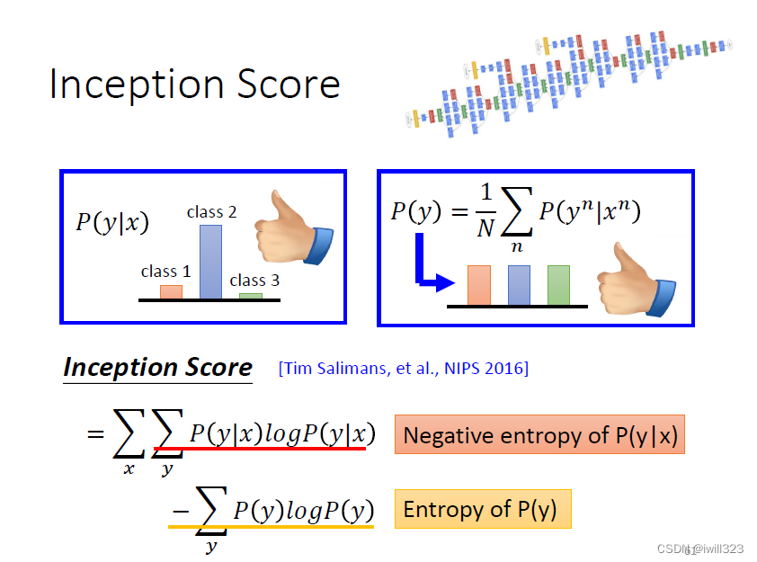

#### 6.3.2 Frechet Inception Distance (FID)

一些情况下，生成的图像是同一类别的，看分布并不合适。

用 Frechet Inception Distance (FID)。FID与IS的区别是，IS是采用图片分类的分布情况来评估，**而FID不取最后的类别，而是取softmax 之前的 Hidden Layer 输出的向量，来代表这张图片，利用这个向量来衡量两个分布之间的关系。下图中的红点代表：真实图片的Hidden Layer输出，蓝点代表：生成图片的Hidden Layer输出。假设这两个分布都是高斯分布，计算出两者之间的Frechet Distance，越小代表分布越接近，图片品质越高**

问题：

- 将任意分布都视为“高斯分布”会有问题
- 计算FID需要大量采样，计算量大。

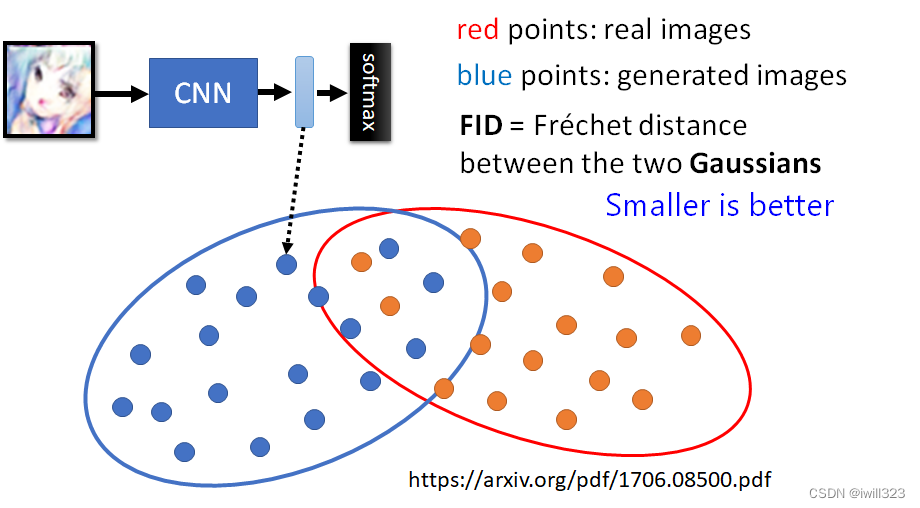

 利用FID衡量不同GAN的性能。不同的 Random Seed 去跑不同的方法，得到FID的分布。

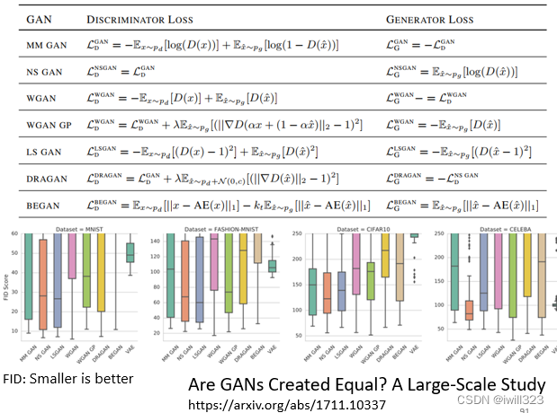

- VAE 的方法显然是比较稳定的
- GAN可以產生远比 VAE 更好的结果
- 不知道是不是有某些 Network 架构,特别 Favor 某些种类的 GAN

### 6.4 We don’t want memory GAN

有时生成图片的 Quality 和 FID 都不错，可是你看图片总觉得哪里不对，比如下图中第二行的图片：

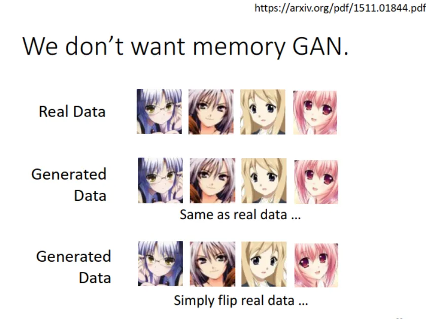

和训练图片 (real data) 一对比，发现机器学到的是和训练图片一模一样。

应对方法：把 generated data 和 real data 计算相似度，看是不是一样。

新的问题：机器可能会学到把训练图片左右反转一下，如图中第三行图片所示，计算相似度是不同，其实还是原图片。

### 6.5 其他的评估办法

所以说，衡量 Generative Model 的好坏挺难的。https://arxiv.org/abs/1802.03446裡面列举了
二十几种GAN Generator 的评估的方式

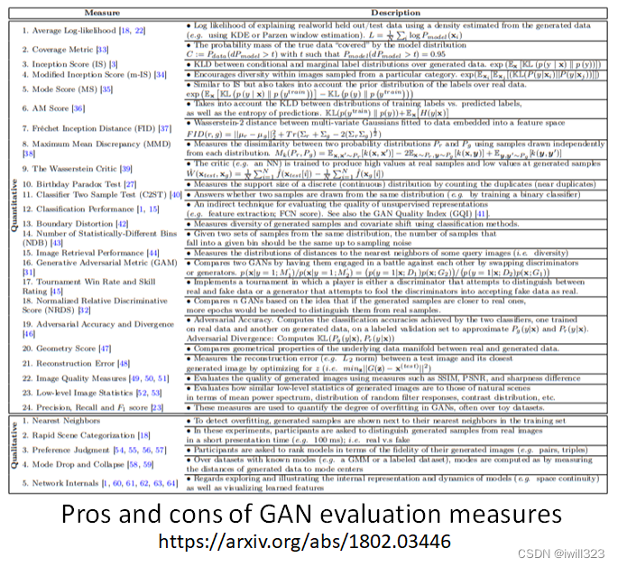

## 7. 总结

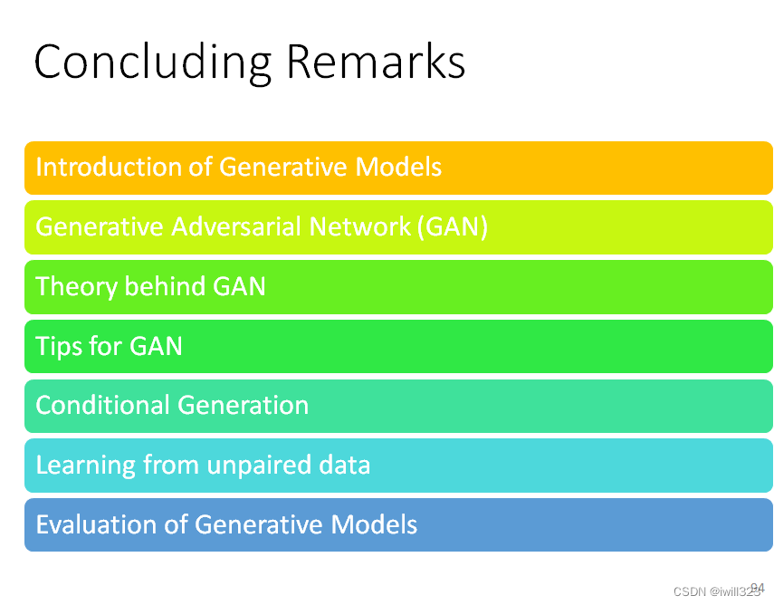