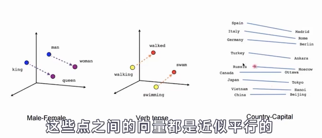
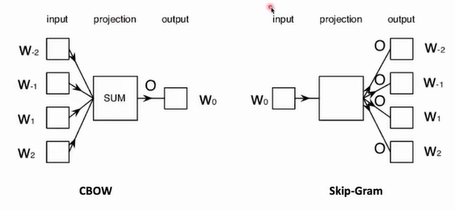
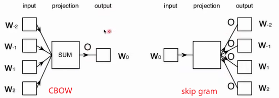
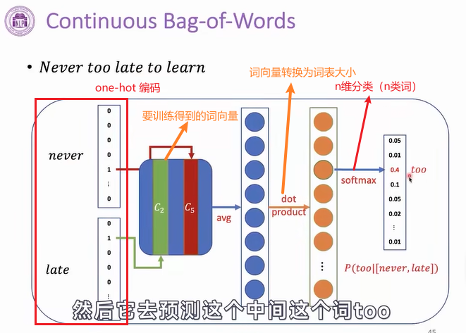
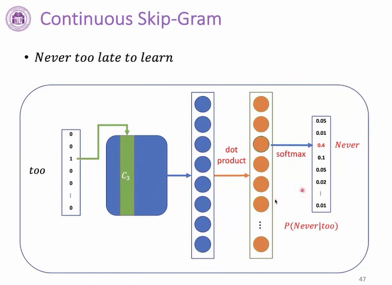
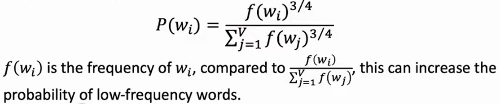
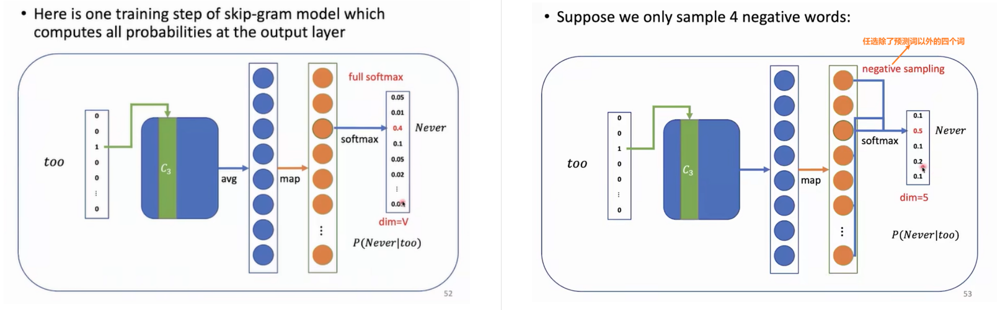
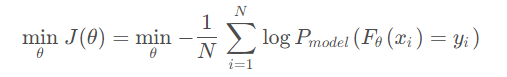

## word2vec

> https://www.bilibili.com/video/BV1UG411p7zv?p=14

### 1. 模型效果

Word2vec使用浅层神经网络，将单词与分布式表示相关联（word embedding）

它可以捕捉许多语言规律，例如：

### 2. 模型分类

- Continuous bag-of-words (CBOW)

- Continuous skip-gram

### 3. 模型构造

#### 3.1 滑动窗口

Word2vec 使用一个固定大小的滑动窗口沿着一个句子移动，在每个窗口中，中间词是目标词，其他词是上下文词。

区别俩种模型：

- 给定上下文单词，CBOW预测目标单词的概率

- 当给定一个目标单词时，skip gram预测上下文单词的概率

#### 3.2 CBOW模型细节

给定上下文单词，CBOW预测目标单词的概率

模型采用Bag-of-Words（词袋模型），根据词袋假设，上下文单词的顺序不会影响预测，即同一段词在文段不同位置，预测的结果一致。

#### 3.3 skip gram模型细节

当给定一个目标单词时，skip gram预测上下文单词的概率

skip gram每一步都可以预测一个上下文单词，培训样本是：

P(too Never),P(late Never),P(Never too),P(late too),P(to too),…

#### 3.4 计算效率

所有单词的Softmax每一步都取决于大量的模型参数，这在计算上是不切实际的

word2vec主要有两种改进方法：

- 负采样

- 分层softmax

##### 3.4.1 负采样方法

在此主要介绍**负采样方法**，将不要predict的词视为所谓的这个负例的话，不需要把整个vocabulary作为所谓的负例，只采样一小部分作为所谓的负例。

采样方法： Word2Vec是按照这个词的频率来进行负例采样，词频越高被采样的慨率就越大

因为我们有词汇并且知道上下文单词，我们可以通过概率来选择一些不在上下文单词列表中的单词:

把它这个频次去做了一个四分之三次方，这是一个经验值，这使得低频的词被采的概率稍微提高一些。

以下左侧是正常计算的word2vec，右侧是采用了负采样的方法

#### 3.5 学习单词嵌入的其他技巧

- Sub-Sampling（次抽样）。罕见的单词更有可能带有不同的信息，根据这一点，次抽样丢弃单词 w 的概率是:

- Soft sliding window（软滑窗）。一个不固定大小的滑动窗口。将滑动窗口的最大大小定义为 Smax，每个训练样本的实际窗口大小是在1和 Smax 之间随机抽样的。因此，那些接近目标单词的单词更有可能出现在窗口中

#### 3.6 损失

模型采用交叉熵损失

给定N段文本，我们希望模型去预测情感标签：正面、中性、负面。此时，合理的训练目标是交叉熵(Cross Entropy)：

#### 3.7 比较问题

问题：cBoW和Skip-Gram哪个更好？
不一定，但一般Skip-Gram效果好于CBOW:

1. Data size(window size):例如在w1,w2,w3,w4,w5中，window size=1,CBOW中有3个样本，Skip-Gram中有8个样本。
2. 难易度：CBOW由多个上下文问预测中心词相对简单，Skp-Gram由单个中心词预测上下文词相对困难。
3. Smoothing effect:在CBOW中，对于出现次数少的词效果不好，对于出现次数多的词效果很好。上下文单词中有词频多与少的词被Average Pooling(平均值)过程综合了部分单词特征：平均值减弱了词频数少的单词的表示效果。