# 常见神经网络

> https://helloai.blog.csdn.net/article/details/126393663
>
> 注：由于本科阶段学习过，因此此处学习主要参考链接，而非清华NLP视频，视频链接如下
>
> https://www.bilibili.com/video/BV1UG411p7zv

## 循环神经网络

### RNN

循环神经网络(RNN)的关键点在于处理序列数据时会有一个顺序的记忆。

> 所谓顺序记忆就是我们看到熟悉顺序的内容时能更顺畅的阅读，比较浅显的例子是阅读中文文章和英文文章的体验。虽然有时你发现英文单词都认识，但是读起来就是很吃力。

RNN通过递归更新顺序记忆来为序列数据建模。

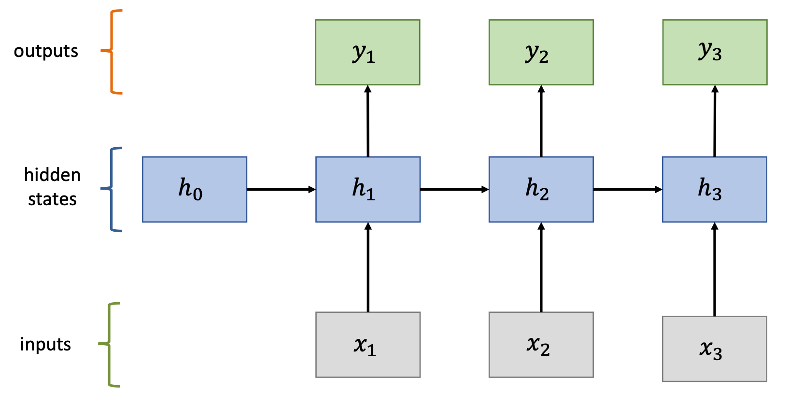

#### RNN细节

这是一个典型的RNN例子。这里画出了输入序列长度为3，对应会生成三个隐藏状态，和三个输出。

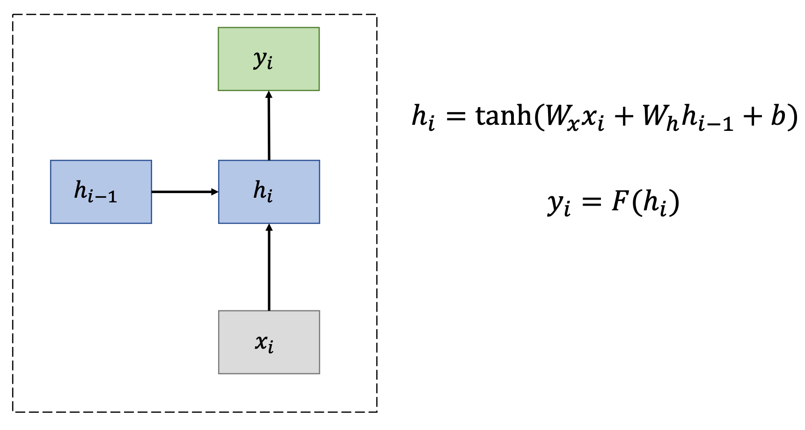

根据上图中的公式。给定某时刻的输入和上一时刻的隐藏状态，计算隐藏状态和输出

RNN能处理时间序列的这种性质，特别适用于NLP任务，尤其是作为语言模型。

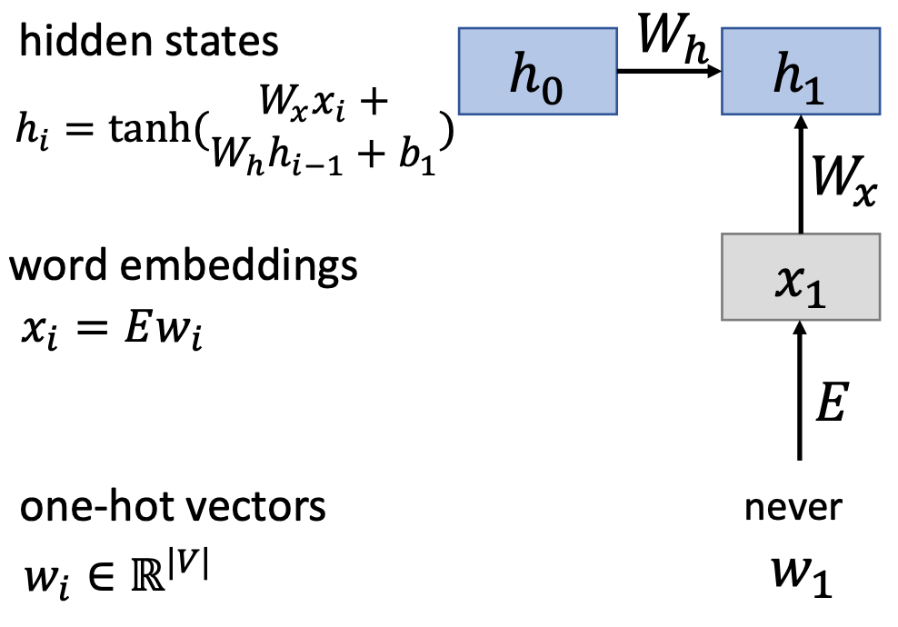

上图是一个例子，首先在时刻1有输入$w_1$ ，它是一个one-hot向量，那么经过词嵌入矩阵得到对应的词嵌入向量$x_1$，作为RNN的输入。然后根据$x_1$和上一时刻的隐藏状态$h_0$来计算当前时刻的隐藏状态，由于这里是第一个时刻，因此$h_0$需要我们自己先初始化，一般初始化为零向量。	

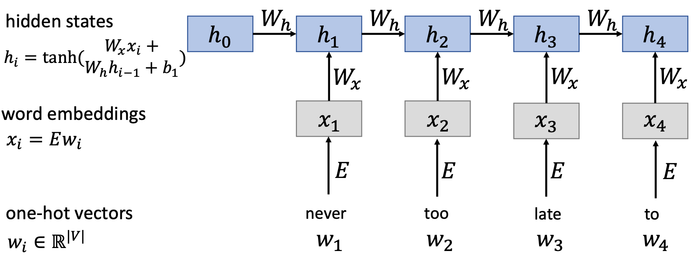

以此类推，将"never too late to"依次输入到RNN网络中，我们知道语言模型需要预测下一个单词是什么。

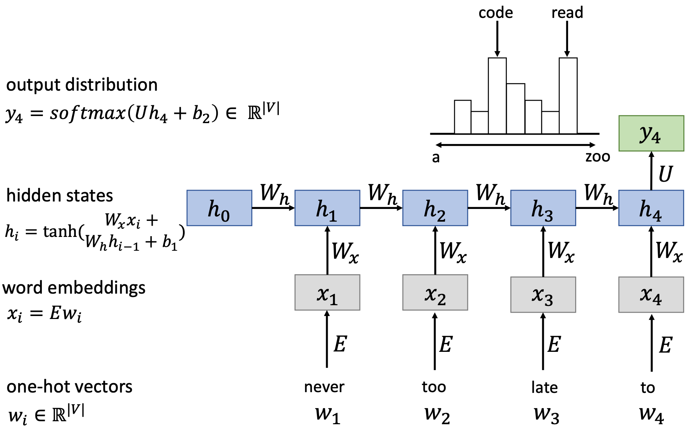

这时候，我们需要用到最后时刻"to"计算出来的隐藏状态$h_4$，因为该隐藏状态包含了前面四个词的所有信息。同理，我们这里也会经过线性层，把它的维度转换为词表大小，然后经过Softmax计算词表中每个单词作为下一个词的概率。
从图中也可以发现，每个时刻的$W_x$和$W_h$都是一样的，因为每个时刻其实都是同一个RNN单元的不断复制，可以很好地实现参数共享，这样有助于模型处理不同长度的样本，也助于模型更好地学习，节省参数量。

#### RNN的应用场景

- 序列标注
- 序列预测
- 图片描述
- 文本分类

#### RNN的优缺点

综上RNN的优点如下：

- 能处理任意长度的输入
- 模型大小不随输入长度增加
- 权重在每个时间步共享
- 计算当前时间步信息**理论上**会用到前面很多时间步的信息

但也有一些缺点：

- 循环计算缓慢
- **实际上**，很难获得过远的历史时间步信息。
- 梯度消失/梯度爆炸

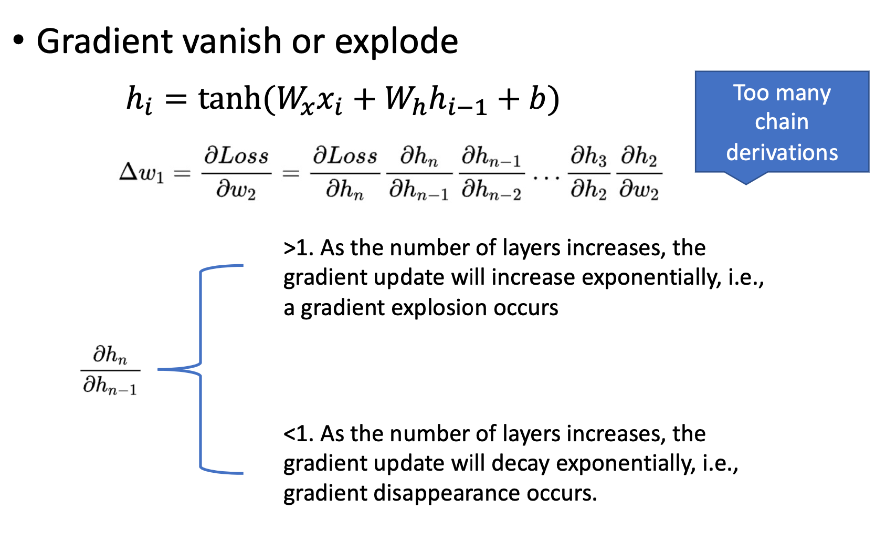

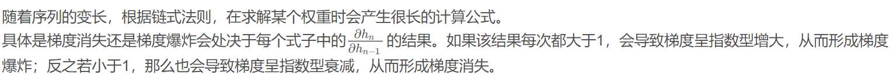

有几个RNN的变体专门来解决这个问题，比较有名的变体是GRU和LSTM。

### GRU

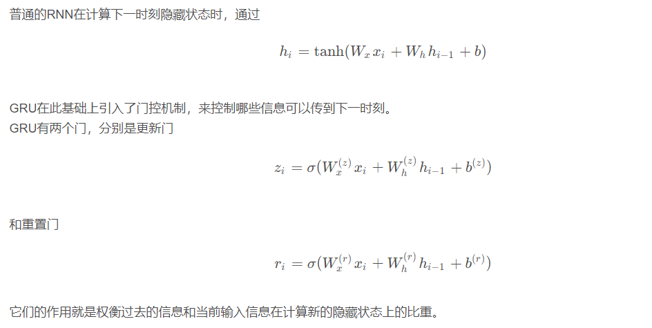

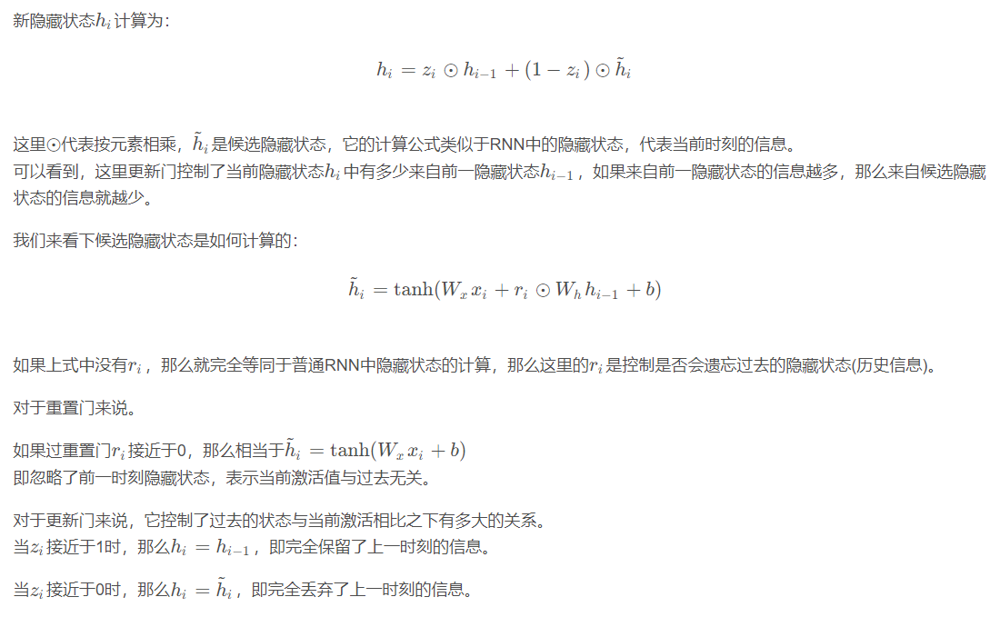

### LSTM

相比于GRU只有两个门，LSTM有三个门，它更加复杂一点。

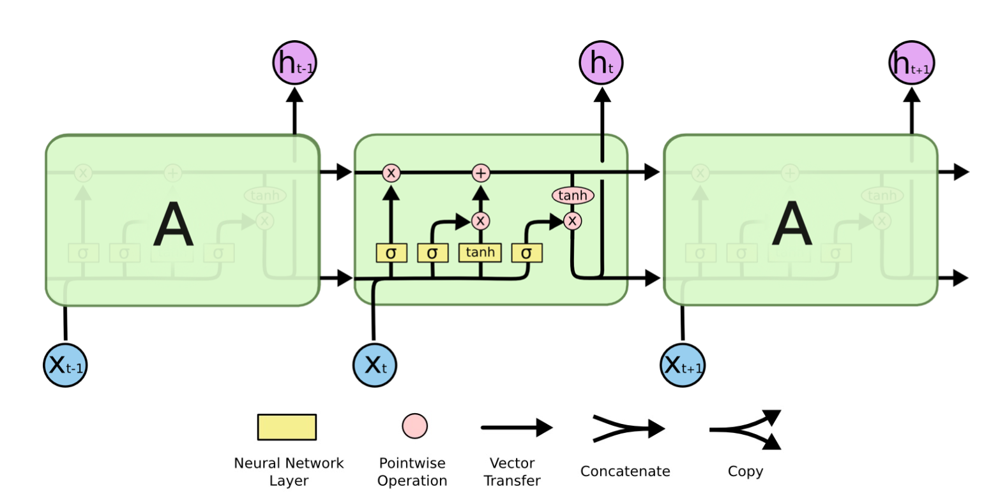

LSTM也是RNN的变体，它比GRU多了一个门。LSTM关键之处在于它增加了一个新的状态$C_t$(单元状态)。

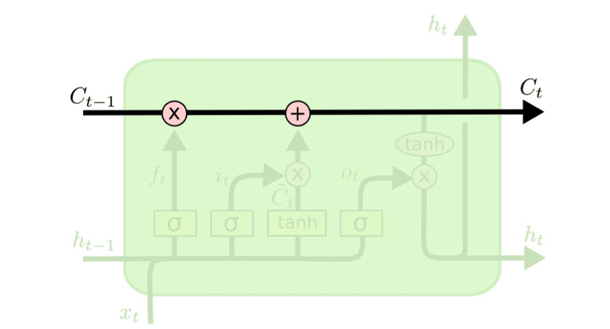

它的作用有：

- 能够捕获长期依赖
- $C_t$的更新只有微小的线性变换
- 易于移除或增加信息到$C_t$

具体地，LSTM也是通过一系列门进行操作的。我们分别来看下。

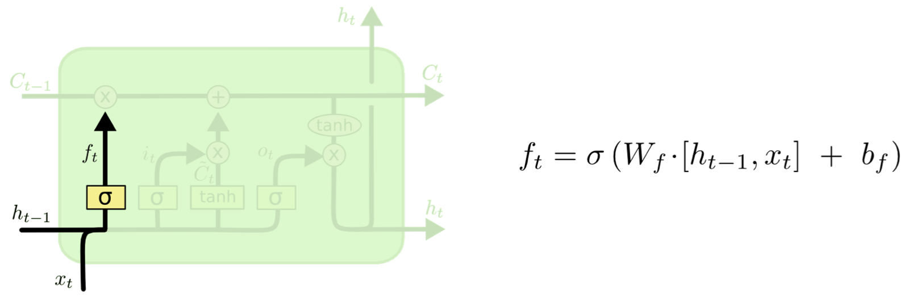

首先是遗忘门，决定上一个状态有哪些信息可以从单元状态中移除。
这里$[h_{t-1},x_t]$是上一时刻隐藏状态和当前时刻输入的拼接，代表同时考虑了这两者。

如果$ f_t=0$，则表示直接丢弃信息。
下面来看输入门。

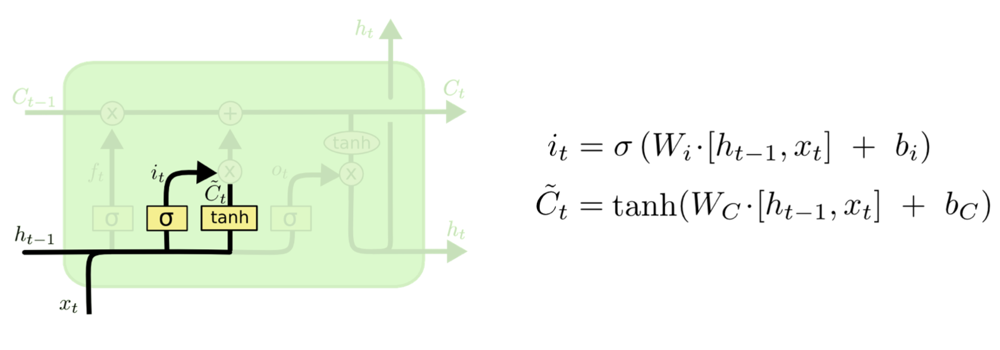

以及候选单元状态 $\tilde C_t $
输入门决定哪些候选单元状态信息可以存储到单元状态。

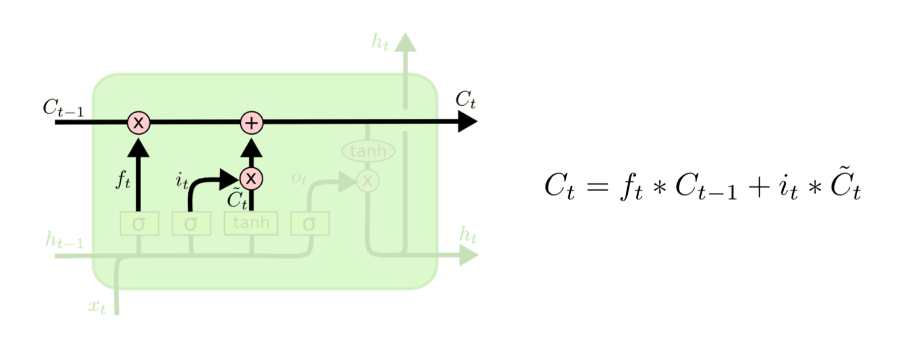

有了上面计算的结果，就可以来更新单元状态。计算公式如上图。

它通过遗忘门来控制遗忘多少旧(上一时刻)单元状态信息，以及保留多少新的候选单元状态信息。

有了当前时刻的单元状态，就可以来计算新的隐藏状态。

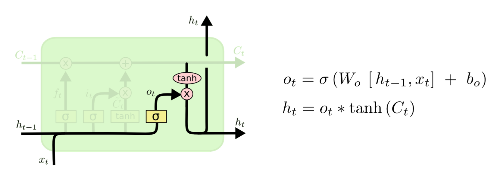

在计算隐藏状态时，有一个输出门，它控制单元状态中的哪些信息可以输出到隐藏状态。

### 双向RNN

前面我们介绍的RNN(包括简单RNN、GRU和LSTM)中，只能沿着一个方向从左到右读取输入。但有时候，如果能双向地读取输入，那么问题就解决得更好。比如在命名实体识别任务中。

