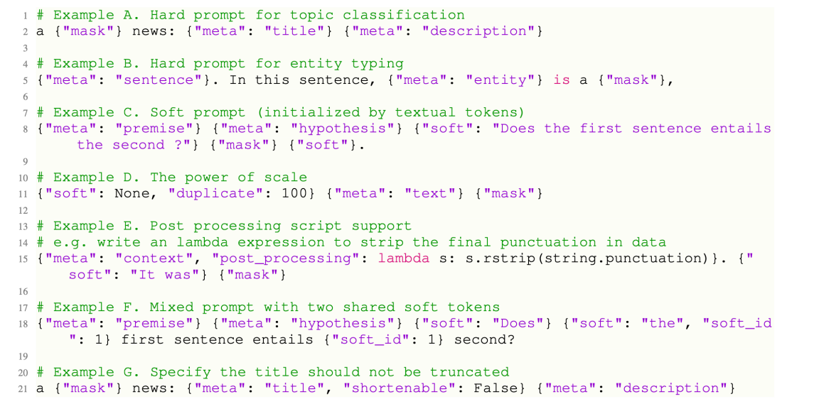

# Prompt-learning & Delta Tuning

> - https://blog.csdn.net/yjw123456/article/details/126734956
> - https://www.bilibili.com/video/BV1UG411p7zv/?p=42

## 概述

我们现在已经有各种各样的预训练语言模型，这些模型的种类和训练方法特别多，用到的数据和领域可能也不同，那我们该如何使用它们呢？


我们的NLP任务也特别多，上面是一些有代表性的任务。
一个预训练好的模型，尽管已经有了一些通用的知识，但我们如何把它具体地应用到下游任务，我们很有可能要对每个任务考虑不同策略，这样看起来我们的工作量还是很繁重。因为我们似乎也需要对每个任务设定独特的训练策略，尽管我们可以用预训练模型来达到很好的初始化，但并没有实现NLP大一统的场景。


以BERT为例，BERT不管输入是单句还是两句，它实际上会对每一个token产生一个表征，这些表征可以进行分类。
如果做的是token级别的分类任务，比如NER，那么这些token的表征会送到一个分类层中，来对每个token进行分类。
如果做的是句子级别的分类任务，那么一般会把这个`[CLS]` token，代表句子级别语义，送到分类层中。
也就是时候，BERT对于不同的任务，会将不同的表征送到分类层中去，比从零学习的神经网络效果会好很多。

这里用关系抽取来举一个例子。


关系抽取任务：根据句子以及句子中的两个实体，推测出两个实体之间的关系。比如上图中的就是“清华大学”位于“北京”。
那么用BERT来实现的话，种类例举了六种做法。

- 比如第一种(a)的做法就是，不引入实体位置信息，直接取句子向量进行分类(实体的关系)。
- 对于第二种（b）的做法就是可以用mention pooling把Entity 1 Entity 2这两个实体之间的所有的这些token给聚合到一块，concat到一块然后再送入分类层
- 对于第三种（c）还是使用mention pooling，但是想要区分哪个是Entity 1，哪个是Entity 2。这样的话加一个token time embedding，除了第一个实体标为1，第二个实体标为2，上下文其余所有的字符都标为零。然后一块加起来再和这个hidden resentation加起来，再进行分类。这样就可以考虑位置信息
- 对于第四种（d）entity marks，就是对于俩个entity外面包两个特殊的字符，这俩个特殊字符可能本来词表中没有，要新申请两个词。比如说{E1]和这个[/E1]，去注意到这两个东西是特殊的.然后可以再送进去CLS
- 对于第五种（e）ENTITY MARKERS-MENTION POOL.不只是可以送入CLS，也可以把这个中间的entity representation给送进去。
- 对于第六种（f）ENTITY MARKERS-ENTITY START.不只是可以送入CLS，也可以把e1和e2这两个本身的marker给送进去。

可以看到这些做法是非常经验性的，并且没有那么直观，最后我们都需要去训练一个分类器，即需要随机初始化一个分类层。将得到的表征喂给它，再和模型一起微调训练。

这种方式越来不不适应于我们现在的时代。

再以GPT为例。


GPT是一个生成模型，生成第n个token取决于前n−1个token的概率。那么它是如何微调的呢。


它用最后一层的表征$h^m_l$接上分类层进行微调。尽管当时一般的显卡也可以去微调这些模型，但是随着研究的深入，这个趋势发生了改变。


这个改变是从T5开始的，T5训练了一个110亿参数的模型，此时我们首先开始有了大模型，它的策略发生了一些变化。

首先它把所有的任务映射成为一个seq2seq的形式，即并不是训练一个分类器，而是去训练一个编码器-解码器模型。
假如要做情感分类任务，此时并不是输出0或1这种没有含义的表示。而是直接输出一个可以代表情感的单词，比如positive，来代替分类。

这种做法的好处就是，把所有任务的范式统一成一个训练的框架，即seq2seq。

为了区分不同的任务，T5增加了简单的demonstration。


比如上图示一个QNLI的数据，它由一个question和一个sentence组成。将它们喂给T5的时候，会进行一些处理，比如会说qnli question是什么，sentence是什么。然后原来的target是0，现在改成了具体的单词entailment。

即解码器被训练来输出我们需要的单词，而并不是我们所需要的那个类。我们通过这些简单的demonstration以及设置标签就把这些任务映射成了seq2seq之后，T5模型就可以训练了，我们不再需要额外的分类层让它重新训练了。

这种做法表明了一种趋势。

然后我们来到了GPT-3,首个千亿(1750亿)级别的大模型。那训练了这么一个庞然大物，要如何使用它、微调它呢？GPT-3的研究者们提出了自己的一套方法。


首先，微调这样一个如此大的模型是不现实的。那么要如何适配到下游任务中去呢。

在下游任务中不会再去更新任何参数了，在zero-shot中，会加上一个任务的描述。


比如上图中的把英语翻译成法语，然后给出一些prompt，即这里的cheese =>。

而在few-shot中会在zero-shot的基础上给出一些翻译样例，然后也加上prompt。

注意在整个过程中，是没有任何参数被微调过的。这种做法称为in-context learning。即让大模型先看几个样例，尽管它没有被微调过，但是它通过前面看到的这些样例，它可以找出这样一种范式来输出后面应该输出的东西。

具体这种in-context learning为什么可以用呢，至今还无法完全地解释清楚。

此时我们就可以发现一个趋势，即更大的模型通常会有更好的表现。


同时由于它的容量足够大，它甚至可以学习一些新的知识，来完成以前我们在机器学习中从未定义过的复杂任务。比如最近的WebGPT可以用来模拟人类上网的操作，让它去检索来生成之前很多模型回答不了的答案。

除了模型越来越大的趋势外，我们还可以看到模型越来越难微调。因为微调要更新所有的参数，这在110亿参数量中的模型都是不现实的。

更不现实的是，为每个任务都微调一个模型，因为这样我们需要为每个任务/每个数据集存储一个微调好的模型。

这就引出了我们的主题，高效地微调大模型。

这里所述的高效分为两个层面，分别从任务和优化的角度。这里所要介绍的技术就是prompt-learning。实际上就是给模型增加一些额外的上下文，然后来触发出我们想要的一些token。我们再用这些token进行后续的处理。比如分类或生成等。


主要的核心就是重新组织输入，给它加入prompt。
T5会加入很简单的一些demonstration。而GPT-3虽然也会加入一些prompt，但是它们都没有对这个prompt的性质，以及后续我们生成的这个token怎么进行处理来进行更加深入的研究。这也是最近一年最火的议题，即prompt-learning。

现在已经有一些较为成熟的方法，能让我们用prompt去驱动大模型。

从优化的角度出发，我们要了解的是delta tuning。实际上我们发现，当模型特别大的时候，我们可以用小参数的优化去驱动大模型，即我们不需要去优化100亿或1000亿的参数，我们可能只需要优化其中千分之一或万分之一的参数，也能达到和全参数微调差不多的效果。

## Prompt-learning

### 基本组成


我们回顾下微调的基本范式，即在预训练中比如有一个Mask预训练任务，对于一些数据我们会mask掉，然后用MLM Head来预测被遮盖的单词是什么。

而对于微调来说，我们把该句子输入到预训练好的模型中，然后通过一个额外的随机初始化的分类器，去训练它让它输出为Positive类别。

从中我们可以看出，预训练和微调之间有一些Gap(差异)，因为它们做的并不是同一件事。比如在预训练过程中我们并不知道在后面还要做一个分类，其实预训练做的只是去预测这个mask位置的单词而已。

在微调过程中，我们没有去预测任务mask的单词，然后我们给它接一个新的分类层，让模型去预测。

这种gap我们可以很显然地用prompt去弥补它。具体的做法是


<span id="verbalizer映射理解"> </span>**对于一个输入的实例，我们给它加一句话叫"it was [mask]"，即一个prompt，同时我们也给它保证成一个和预训练任务一样的形式。比如预训练中的MLM任务，这里我们也用mask的形式，让模型去预测该mask位置的单词。这里会预测出和预训练中一样的东西，即单词的概率分布。然后我们根据它子在整个词表上的分布，只去抽取其中我们想要的词。**

比如说是一个情感分类任务，那么可能会有一个正类(positive)和负类(negative)。那么对于正类，就有good或wonderful等这种词来代表正类；而bad或terrible这种词来代表负类。

这样我们得到了整个词表上的概率分布，此时只需要比较正类单词的概率和负类单词的概率，其他的单词我们都不需要考虑，我们就可以知道该样本被分成了哪一类。

**这里我们额外增加的这个上下文(“it wat [mask]”)我们称之为模板(template)；**

**把标签映射到标签单词的映射器称为verbalizer；**

此时我们可以很明确地看到，在直觉上，它似乎把预训练和微调之间的gap给弥补起来了。

因为，用了prompt-learning之后，在下游任务上，我们也是做MLM。而这是在预训练中所做的。

**实际上，这种做法还有一个好处是，我们不再需要考虑各种任务之间的区别。同样一套数据，根据prompt设置的不同，或者verbalizer选择的不同，那么可以把不同的任务看成是不同的分类。**

**这样就可以把所有的分类，甚至是生成任务都可以通过prompt重新组织成同样一个范式。**

比如之前说的BERT，它是一个双向注意力。不是用来做生成的，但我们可以用这种范式，让它一个单词一个单词地去生成。

或者说GPT是做生成的，不太适合做理解任务。我们也是可以根据它生成的那个mask单词之后的处理，即verbalizer如何取处理该单词，来让它达到一个可以去理解的目的。


### 流程

①通过模板进行prompt


prompt-learning的流程如上图所示，首先我们有一个输入x = 'I love this moive'。然后我们给它包一个prompt，变成 [x] Overall, it was a [z] movie。这里[z]就是要预测的答案。最终经过prompt之后的数据变成了x'='I love this moive. Overall it was a [z] movie.'。

②预测答案
然后我们把新输入喂给模型。


此时模型会输出一个词表上的概率分布，但我们只选择需要的概率最大的标签单词，假设这里时fantastic。

③通过Verbalizer将标签单词映射为标签。
比如我们认为fantastic是一个positive的类。

这样我们就通过prompt-learning完成情感分类的pipeline。


可以看到，整个过程我们要考虑很多东西。

比如首先，我们要考虑选择什么样的训练模型。我们可以根据这些模型预训练的范式来选，比如像GPT系列和最近的OPT都是自回归的范式。即训练一个解码器，接受输入然后一个单词一个单词地产生输出，这样去生成标签单词。

而像BERT、RoBERTa这种训练的编码器用的是双向的注意力，它可以去生成序列中间mask的单词，会同时根据前面和后面的上下文来进行生成。
直觉地来看，像自回归的方式有更好的生成能力，而像BERT这种有更好的理解能力。
而最近比较新的像T5、BART这种编码器-解码器模型，在编码器阶段先用双向注意力把所有的上下文注意到一起，然后再用解码器去自回归地生成。

除了预训练语言的目标，我们同时还要考虑模型使用了什么样的数据去预训练的，比如像融入了很多知识图谱的预训练模型，它好像似乎更适合去租那种下游的关系抽取或实体分类这种带有世界知识的任务。

比如在金融领域或生物医学领域去训练的模型，好像更适用于去做这种特定领域的下游任务。

所以在选择预训练语言模型来做任务的是比较关键的。

其次模板也有很多种方式，可以人工地构造，也可以自动地去生成，甚至还可以对形式进行一些改进。

对于Verbalizer来说，就是我们所说的一个标签映射到一个单词的过程，实际上能做的事也很多。可以人工地去设计它， 也可以用额外的知识(外部的知识)去扩充它。

### 预训练模型选取

#### Auto-regressive

如果选择的是自回归的这种模型，比如GPT系列和OPT等。

这时的prompt模板，一般会把mask词放到最后：


这样的话，它可能不一定适用于特别长的文本。但是现在几乎超大级别的模型，都是用这种自回归的方式去训练的。这种训练方式非常适用于超大模型。
而且我们用生成范式所能做的东西，它的潜力是非常大的，现在这种生成式自回归的模型慢慢的成为了主流。
假设你要用这样的模型，那么mask位置应该放到最后。

#### MLM

如果你要做理解任务或简单的分类任务，可能更好的办法用一个BERT或RoBERTa。


这类模型比较适用于自然语言理解，此时mask的位置可以在中间，然后前后的上下文都给attention掉。
这样我们设计模板的方式就不用拘泥于mask具体的位置。

#### Encoder-Decoder

然后像T5模型，实际上在训练的时候，它已经有了一些所谓的比较简单的prompt。

但没有做的事情是，详细地指明这个prompt可以长什么样。也没有说如果我们最后生成了那些单词之后，还可不可以做进一步地处理。

T5模型有一个好处是比较通用，没有说像自回归模型那样那么不擅长做理解，又不像BERT模型那样不擅长做生成。


### Template构造

我们刚才说的那些模板(template)好像都是认为构造的。确实，我们可以去认为构造模板，而且事实证明，人为构造的模板效果一般都挺好。


这时我们要考虑任务的特性是什么，比如关系抽取、文本分类、对话等等，我们要考虑任务的特性来构造不同的模板，此时可能需要个人的先验知识。

除了人工地构造，我们还可以选择自动生成。可以用生成或搜索算法来生成这些模板。也可以去优化一些伪template,然后让它来表达合适的语义.
我们还可以在模板的形式上做出改变，即模板不一定是文本的，它甚至可以是一堆没有意义的字符。这堆没有意义的字符.它有一个embedding嵌入向量，然后我们通过训练这个嵌入来使得它有比较大的意义。比如说it is a 什么什么,it是一个代词,is是一个be动词,a是一个冠词.然后我们给它加3个soft token,比如说S1,S2,S3,这时候这3个token它没有任何意义,但是可能在训练的过程中呢,第一个token在训练过程中就变成了类似于代词的意思,第二个在训练的过程中就慢慢变成了这个类似于be动词的意思,当然了这个做法其实是比较玄学的,但是事实上证明它也是Work的

我们甚至还可以把模板带有结构信息，或者带有人类的逻辑知识。下面是各种任务和模板的例子。


#### 人为定义

可以看到，对于不同的任务，我们确实可以利用人类的先验知识来设定不同的模板。

比如像文本分类任务(Text CLS)中的Topic(主题分类)，我们的模板可以说"The text is about [Z]"。

文本生成任务中,TL;LD:too long don't read,太长不看的意思,加入这样的prompt让它去完成后面的生成

这些模板都是人类根据不同类型的任务来构建的。

实际上现在模板的玩法已经特别多了。


比如对于关系分类的任务，假设输入是"London is one of the biggest cities in the world."
假设要加一个模板，我们可以把"London"复制到模板中去，然后接上"is a [mask]"，来问模型"London"是什么类别。

这样对于每个输入，该模板开头的单词都不一样，表示不同的实体。这样来完成实体分类，从而达到抽取世界知识的效果。

通过这种做法，在少样本/零样本任务上表现特别好。

#### 关系抽取

也可以让模板变得非常复杂，这个例子中要抽取"Mark Twain"和"Langdon"的关系。


这里设计prompt的时候加入了一些人为定制的规则，如果要保证实体之间关系的类别，首先要保证它们实体本身类别的正确性。这样会带来额外一些制约，从而提升最终关系抽取分类的准确度。比如上图中的"x’s parent was y"，必须要保证x和y都是person。

还可以进一步地改进，把它变成一个结构化的数据。以问答任务为例，其实问答任务本身有很多的形式。有些是从文本中抽出一段话，有些是给定多个选项，还有些是摘要式的。


此时我们可以把这些prompt重新组织，这里给它增加一些键值对。首先定义一个[Format]表示格式是怎样的，然后定义一个[Task]表示数据集是怎么的，接着是[Domain]表示领域；然后是[Question]和[Passage]。
这样所有的输入都是键值对的形式，这么做的好处是，Format提醒模型应该做什么。通过这种体现，然后加上微调，,可以更好地让模型内部对不同的任务做一个区分，从而产生更具区别性的答案。虽然是统一的范式,去训练很多任务,但是我们通过这些给出的提示的不同.可以让模型内部去对它们做成一个区分,而且是不同维度上的区分.


刚才我们了解的都只是一个模板，实际上对同一个输入，可以聚合很多个模板。然后最这些模板的`[MASK]`整合起来，整合的方式有平均和加权平均。


#### 自动搜索的prompt

至此为止，我们了解的prompt都是人工定义的。那么自动搜索的prompt是怎样的呢。


这里给定输入后，定义了一些触发单词，然后定义一个prompt模板，其中每个单词都是由mask来初始化，通过最大化后验标签的概率来优化这些prompt的嵌入，然后从这些触发单词中找到和优化后的嵌入所对应的单词当成prompt。这会导致最后生成的模板看起来没有什么具体含义(语义不通)，但是它就是有效的，甚至比人类定义的prompt更加有效。

这带给我们一些启示，我们通过prompt的目的是触发我们想要的单词，实际上这并不一定需要人类的直觉来定义。也就是说，对人类来说是最好的，对模型不一定是最好的。

#### 利用额外的模型来生成prompt

还有一种做法是利用额外的模型来生成prompt，比如对于一些情感分析类数据直接喂给T5，然后看哪些prompt加上这些数据后得到的准确度最高。选择最高的作为最终的模板。


#### 特殊的字符来产生prompt

除了上面所说的prompt都是文本，我们也可以通过特殊的字符来产生prompt。


我们知道词典中每个单词都有一个ID，这时我们申请一些新的ID，这些新ID对于的嵌入可以用旧ID的去初始化，并且可以随着训练而更新，从而让它有一个更加模糊的含义，来完成prompt learning。

### Verbalizer构造

Verbalizer就是把标签词映射成标签单词的过程。

比如说<a href="#verbalizer映射理解">positive可以对应一个词great,也可以对应很多词</a>.


如果把标签定义为多个词的话， 那么就求这些词概率的(加权)平均值。然后比较类别之间的概率。

答案的类别可以是一个词，也可以是多个词。还可以是chunk:由多个词组成的一个字符串。甚至可以是任意长度的句子(生成模型)。

构建Verbalizer的方式也有两种：人工和自动生成。

#### 人工构造

那么人工构造还是需要一些先验知识。

- 首先从一个标签词开始，然后通过同义词去扩充它，使它变成一个大的表，表越大容错率就更大，但可能带来更多的噪音。
- 也是从一个标签词开始，然后需要一个额外的知识库去扩充它。
- 也可以把一个标签分成多个单词。
- 还可以使用可以优化标签嵌入的虚拟单词。


Verbalizer的本质是解决如何使用模型预测分布的问题，来完成分类或生成任务。


还是刚才那个例子，这里我们关注生成的答案。对于分类任务(Text CLS)，这些答案单词都是非常直观的。对于生成任务，其实这些答案就是它生成的文本。


除了认为的定义，我们还可以用外部的知识去扩充它。
比如有一个问题：速度与加速度之间的关系是什么？ 然后加一个模板，xx question。这个MASK会预测一些人为定义的label word，比如数学定义为mathematics、运动定义为相对应的同义词。

接着定义一个verbalizer，先给定标签，比如这里是科学(SCIENCE)。然后用一个知识库(可能是个语言模型,直接利用它的输出,也可能是同义词等等)去充分扩充它，接着去掉噪音词，再去选择最终需要的单词。

除了用有意义的文本来构建verbalizer之外，还可以用无意义的虚拟token来表示标签单词。比如对于每个类别对应MASK的隐藏状态进行聚类，让不同的类别学到不同的簇，用这些簇中间的嵌入来表示最终的标签词。

- 虚拟令牌作为标签词
- 将[MASk]令牌的隐藏状态投影到嵌入空间并学习原型
- 学习的原型构成了描述器，并将PLM输出映射到相应的标签。


### 训练的新范式

prompt-learning究竟给我们的训练范式带来了怎样的改变呢？


我们先来看下训练范式的演化过程：

1. 传统的： 随机初始化后从零训练
2. BERT之后： 预训练-微调
3. T5： 基于文本-文本格式的预训练-微调
4. GPT： 预训练然后使用prompt&in-context实现零/少样本学习

那有了prompt-learning之后，我们可以如何做呢

- 预训练，用prompt组织数据，微调所有参数(适用于中小型模型、少样本场景)
- 预训练，增加soft prompt，固定模型参数优化propmt嵌入(delta tuning角度)
- 和prompt数据一起预训练，做零样本的推理

下面来看下prompt-tuning的图示：

- 我们注入一些soft prompt嵌入到输入层，比如上图的`a1`,`a2`这些token；
- 然后将不同任务的批数据混合起来，喂给预训练的11B参数模型。
- 只训练这些soft prompt嵌入。


它在10B参数($10^{10}$)模型上效果和全参数微调一样。从而实现了小参数驱动大模型。

但在中小型模型上效果不如全参数微调。
要注意的是，上面说的prompt-tuing更多的是一种delta tuning的方法,因为它冻结了模型,只去训练prompt.。而prompt的直觉是弥补预训练和下游任务之间的差异，通过额外的上下文提示模型。而把模型冻结住，只训练prompt的话，实际上在这方面上的效果会稍弱了一些。

其实这种soft prompt 可以加到预训练中.但是Prompt-Tuning容易训不起来,因为优化空间小(参数少),最优解或者次优解比较少.如果微调的模型参数大(如11B),优化空间大,最优解或者次优解比较多,容易找到..


又回到文本级别的prompt，也可以把它们加到预训练中。在1300亿的模型上去训练60个任务，为每个任务收集一些prompt，然后可以在未见过的任务上进行推理。有个神奇的现象,在八十亿参数或者更小的模型之前都是在伤害这个模型的表现,80亿之后会有飞跃式的提升.所以给了我们启发,量变会引起质变,模型增大确实有意义,似乎有个节点,使得跨越这个节点就可以去做这些任务.那么为什么说80亿之前不行?可能的一个原因是80亿或者更小参数之前,让它去训练60个task, 实际在训练的过程中就把它的容量(capacity)给填满了,这样的话就没有多余空间去在新的没见过的任务上去推理.


它的同期工作——T0的做法是，在35个任务上训练人工设定的prompt(五花八门,丰富的)，然后在未见的任务上做推理。


### 应用

prompt-learning的应用：

- 大多数 NLP任务上：NLU、生成、信息抽取、QA、翻译等
- 但像NER这种需要位置相关性的任务无法应用特别好

那能否应用到多模态或信息生物医学领域呢?


我们可以把输入加一些soft token，然后加上人工定义的医学领域的prompt，这样哪怕是小模型也可以在生物医学领域表现得特别好。

还可以应用到多模态上，本质上是训练图片和文本之间的理解。如何做呢

首先给图片中对象画个框，然后给定颜色，然后在文本中问，比如这个女人被框到了什么颜色里。让模型预测颜色是什么样的，从而让模型建立颜色和文字的理解。

### 总结

- 一个非常综合的框架，考虑了PLM、下有任务和人类先验知识
- 定义模板和Verbalizer非常重要
- 在少样本场景中表现特别好，但随着模板的选择会带来高方差
- 实际上可以应用到各种各样的场景

## Delta Tuning

和prompt-learning不同，delta tuning是从另一个角度来高效地微调模型。
思想是模型绝大部分参数不变，只微调一小部分模型，就能驱动大模型。


### 背景与介绍

比如之前对于每个任务，我们可能需要微调一个不同的模型。如果模型很大的话，那么保持这些模型的参数也会是一个问题。

而delta tuning，对于每个任务只优化小部分参数，称之为delta objects(对象)，它们可能有各种各样的结构。这些delta对象代表解决任务能力的参数化表示。实际上这些参数所占空间很小，那么就没有资源压力。

实际上要考虑的地方也有很多，比如模型的选择、delta对象如何设计等等。


类似我们对一个BERT，进行微小的改动，可以适用于各种各样的任务。

**首先我们要明白为什么参数高效的微调是有用的?**

实际上在过去是不可能实现的，因为过去所有的网络参数都是随机初始化的。因为我们有了预训练之后，有了大模型之后，才能用delta tuning的范式。
因为大模型通过无监督的方式学习了统一知识(Universal Knowledge)，很多人认为在下游任务的微调中，只是把这个统一知识激发出来。即在下游微调任务中，并没有学习更多的知识，而是激发已经学到的知识。

delta tuing中的delta长什么样呢


- Addition-based 增量式的方法新插入模型原来不存在的参数，然后只训练这些额外插入的参数。
- Specification-based 指定式的方法指定模型哪些参数可以训练，哪些固定。
- Reparameterization-based 重参数化式方法用低维子空间参数来重参数化原来存在的参数。

### 增量式tuning


这里主要介绍Adapter。
adapter-tuning

- 为Transformer层增加小的adapter(上图右边的网络模块)
- 实际上是一个简单的双层神经网络，先缩小再非线性，再还原$h←f(hW_d)W_u+h$(还有残差连接)
- 固定其他参数，只微调这些adapter
- 可训练参数只有整个模型的0.5%~8%

这样可以达到和全参数模型几乎相同的效果。

另外有一项工作将adapter移到主干模型外面

- 将适配器移出主干
- 在主干模型之外架设一个梯子
- 节省反向传播的计算
- 通过缩小hidden size来节省内存


增量式的方法还有一种，叫做prefix-tuning，它和prompt有些联系。

adapter 是直接加线性层在这个feed forward Layer后边,layer norm前面.

prefix-tuning 是直接在每一层hidden states的前面加一些soft token,然后我们就只优化这些soft token来完成训练.


Prompt-Tuning相比prefix-tuning,它不是在每一层都加了,只是茌输入层加一些soft embedding,然后来进行优化,所以效果上Prompt-Tuning不如prefix-tuning


### 指定式tuning

这里介绍一种名为BitFit的方法，它只是去微调所有偏置(bias)，也能达到和全参数微调差不多的效果(简单任务)。


### 重参数化tuning


重参数方法认为优化过程可以在低维的空间完成，将120个任务的优化压缩到低维的子空间里。比如在一个五维的空间中训练，然后还原到原来的参数里。此时可以发现在低维空间找到的解，可以在120个任务上表现的很好。这里实际上要训练的参数不多，因此也把它认为是一种delta tuning的方法

#### LoRA

还有一种方法LoRA认为要优化的矩阵本质上是低秩的，虽然实际上并不是低秩的，但我们可以强行做低秩分解，比如1000 × 1000分解为1000×2和$2 \times 1000$的，这样可以减少很多计算量。


#### 总结

我们可以看到这些重参数化的方法本质上是有一些联系的，都是基于一个假设模型的优化可以用很少代价来完成。我们可以把它映射到一个低维或低秩的过程，用一个很简单的过程去完成这个模型的优化。


### 统一tuing


这种联系我们可以扩展到更多的方法，最近有人建立了一种统一框架，把这三种方式联系起来。


认为它们本质上可能在做同一件事情。只是函数不同，修改位置不同而已.


实际上它们都是固定大模型参数，只微调很小部分的delta对象。


因此我们可以推导出更加通用的delta tuning变体。

对delta tuning做理论分析.


从优化的角度来说,本质上可能都是在一个低维子空间中去寻找一个低维的表示或者是说在一个低维的函数空间中去寻找一个低维的表示.当它满足一定的下界之后,一定的误差界之后,我们就去找到这种表示.实际上绝大多数的参数都是不变的

从最优控制的角度来说,可以把所有的delta tuning的方法都去推导成一种在离散时间的状态下寻找最优控制器的过程


在100多个NLP任务上进行了实验表明，delta tuning确实效果比较好，比如LoRA(LR)在100多个任务上只微调了0.38%的参数就能达到平均和全参数微调(FT)差不多的效果。


由图(f)知道,着当模型特别大的时候它的结构可能就没有那么重要,随便选一些参数,只调整这些参数,它可能效果都会特别好

接着考虑delta tuning插到不同位置,他们的组合会不会有不同用呢?

实际上效果确实会有提升,不同任务有不同的提升.意味着最优结构的存在，而不是手工定义的


然后还可以发现不同的任务适用于不同的结构，那么是否存在一个最优结构呢。

比如可以用自动机器学习的方法来搜索这个结构，在每个位置设定一个开关，表示使用哪种delta tuning方式。这样我们就能找到一个比较稀疏的解，能让模型的效果特别好。


上图横轴表示参数量的稀疏程度(由多变少)，纵轴代表准确率。当参数量变少到万分之一的时候，其他的delta tuning方法都有显著的下降，而通过自动搜索方法得到的解它的效果和全参数微调还是保持相差不大。

通过自动搜索的方法用更少的参数去探索一种极限。

同时delta tuning还具备非常好的可迁移性，这几种delta tuning在不同的任务上得到的图像差不多。


### 总结


- delta tuning在超大规模的模型上非常高效
- 它的结构随着模型的增加变得越发不重要

下面我们来了解下分别为prompt learning和delta tuning设计的工具。


## OpenPrompt介绍


Prompt其实可以自定义很多不同的模板/verbalizer，比如一个普通的情感分类任务，模板可能是it was__。
模板可能不同，mask位置可能不同，verbalizer也可能不同。

之前通常将模板写死到代码中，不方便我们尝试不同的模板，也无法灵活地找到mask的位置。
OpenPrompt工具包的目的是解决上面所说的问题，定义统一的prompt tuning范式，使用不同的模板，定义不同的verbalizer，去实现不同的任务。


上图是API交互。PromptDataset的输出是一个Tempate，包裹上输入之后，被PromptTokenizer分词成可以输入模型的数据。PromptModel把该输入中的soft token转换成TemplateEmbeddings，再输入预训练模型(PLM)，最后把mask的位置的输出抽出来，送给Verbalizer进行预测。
除此之外，通过PromptTrainer类提供了不同的训练方式。

下面简单看一下如何使用OpenPrompt。

1. 定义一个任务
2. 选择预训练模型
3. 定义一个Template
4. 定义一个Verbalizer
5. 定义一个PromptModel
6. 训练并推理

一些Template的例子：


下面用一个实例来进行演示。

首先安装需要的包

```py
!pip install transformers --quiet
!pip install datasets==2.0 --quiet
!pip install openprompt --quiet
!pip install torch --quiet
```

加载数据集

```py
from datasets import load_dataset
raw_dataset = load_dataset('super_glue', 'cb', cache_dir="../datasets/.cache/huggingface_datasets")
raw_dataset['train'][0]
```

```
{'premise': 'It was a complex language. Not written down but handed down. One might say it was peeled down.',
 'hypothesis': 'the language was peeled down',
 'idx': 0,
 'label': 0}
```

并查看样本。

下面加载模型和分词器：

```py
from openprompt.plms import load_plm
plm, tokenizer, model_config, WrapperClass = load_plm("t5", "t5-base")
```

构建输入，将袁术数据集处理成OpenPrompt可以使用的格式：

```py
from openprompt.data_utils import InputExample

dataset = {}
for split in ['train', 'validation', 'test']:
    dataset[split] = []
    for data in raw_dataset[split]:
        input_example = InputExample(text_a = data['premise'], text_b = data['hypothesis'], label=int(data['label']), guid=data['idx'])
        dataset[split].append(input_example)
print(dataset['train'][0])
```

```
{
  "guid": 0,
  "label": 0,
  "meta": {},
  "text_a": "It was a complex language. Not written down but handed down. One might say it was peeled down.",
  "text_b": "the language was peeled down",
  "tgt_text": null
}
```

可以看到，有一部分叫`text_a`，另一部分输入叫`text_b`。还有刚才提到的`meta`信息。
下面我们可以定义模板文本：

```py
from openprompt.prompts import ManualTemplate
template_text = '{"placeholder":"text_a"} Deduction: {"placeholder":"text_b"}. Is it correct? {"mask"}.'
mytemplate = ManualTemplate(tokenizer=tokenizer, text=template_text)
```

我们的模板定义如上所示，在mask位置输出我们想要的答案。

为了更好地理解模板包裹了什么，我们看一个例子

```py
wrapped_example = mytemplate.wrap_one_example(dataset['train'][0])
wrapped_example
```

```
[[{'text': 'It was a complex language. Not written down but handed down. One might say it was peeled down.',
   'loss_ids': 0,
   'shortenable_ids': 1},
  {'text': ' Deduction:', 'loss_ids': 0, 'shortenable_ids': 0},
  {'text': ' the language was peeled down',
   'loss_ids': 0,
   'shortenable_ids': 1},
  {'text': '. Is it correct?', 'loss_ids': 0, 'shortenable_ids': 0},
  {'text': '<mask>', 'loss_ids': 1, 'shortenable_ids': 0},
  {'text': '.', 'loss_ids': 0, 'shortenable_ids': 0}],
 {'guid': 0, 'label': 0}]
```

`shortenable_ids`表示是否可压缩，`loss_ids`表示是否需要计算损失。

接下来处理这样的输出：

```py
wrapped_t5tokenizer = WrapperClass(max_seq_length=128, decoder_max_length=3, tokenizer=tokenizer,truncate_method="head")
# or
from openprompt.plms import T5TokenizerWrapper
wrapped_t5tokenizer= T5TokenizerWrapper(max_seq_length=128, decoder_max_length=3, tokenizer=tokenizer,truncate_method="head")

# You can see what a tokenized example looks like by
tokenized_example = wrapped_t5tokenizer.tokenize_one_example(wrapped_example, teacher_forcing=False)
print(tokenized_example)
print(tokenizer.convert_ids_to_tokens(tokenized_example['input_ids']))
print(tokenizer.convert_ids_to_tokens(tokenized_example['decoder_input_ids']))
```

```
{'input_ids': [94, 47, 3, 9, 1561, 1612, 5, 933, 1545, 323, 68, 14014, 323, 5, 555, 429, 497, 34, 47, 158, 400, 26, 323, 5, 374, 8291, 10, 8, 1612, 47, 158, 400, 26, 323, 3, 5, 27, 7, 34, 2024, 58, 32099, 3, 5, 1, 0, 0, 0, 0, 0, 0, 0, 0, 0, 0, 0, 0, 0, 0, 0, 0, 0, 0, 0, 0, 0, 0, 0, 0, 0, 0, 0, 0, 0, 0, 0, 0, 0, 0, 0, 0, 0, 0, 0, 0, 0, 0, 0, 0, 0, 0, 0, 0, 0, 0, 0, 0, 0, 0, 0, 0, 0, 0, 0, 0, 0, 0, 0, 0, 0, 0, 0, 0, 0, 0, 0, 0, 0, 0, 0, 0, 0, 0, 0, 0, 0, 0, 0], 'attention_mask': [1, 1, 1, 1, 1, 1, 1, 1, 1, 1, 1, 1, 1, 1, 1, 1, 1, 1, 1, 1, 1, 1, 1, 1, 1, 1, 1, 1, 1, 1, 1, 1, 1, 1, 1, 1, 1, 1, 1, 1, 1, 1, 1, 1, 1, 0, 0, 0, 0, 0, 0, 0, 0, 0, 0, 0, 0, 0, 0, 0, 0, 0, 0, 0, 0, 0, 0, 0, 0, 0, 0, 0, 0, 0, 0, 0, 0, 0, 0, 0, 0, 0, 0, 0, 0, 0, 0, 0, 0, 0, 0, 0, 0, 0, 0, 0, 0, 0, 0, 0, 0, 0, 0, 0, 0, 0, 0, 0, 0, 0, 0, 0, 0, 0, 0, 0, 0, 0, 0, 0, 0, 0, 0, 0, 0, 0, 0, 0], 'decoder_input_ids': [0, 32099, 0], 'loss_ids': [0, 1, 0]}
['▁It', '▁was', '▁', 'a', '▁complex', '▁language', '.', '▁Not', '▁written', '▁down', '▁but', '▁handed', '▁down', '.', '▁One', '▁might', '▁say', '▁it', '▁was', '▁pe', 'ele', 'd', '▁down', '.', '▁De', 'duction', ':', '▁the', '▁language', '▁was', '▁pe', 'ele', 'd', '▁down', '▁', '.', '▁I', 's', '▁it', '▁correct', '?', '<extra_id_0>', '▁', '.', '</s>', '<pad>', '<pad>', '<pad>', '<pad>', '<pad>', '<pad>', '<pad>', '<pad>', '<pad>', '<pad>', '<pad>', '<pad>', '<pad>', '<pad>', '<pad>', '<pad>', '<pad>', '<pad>', '<pad>', '<pad>', '<pad>', '<pad>', '<pad>', '<pad>', '<pad>', '<pad>', '<pad>', '<pad>', '<pad>', '<pad>', '<pad>', '<pad>', '<pad>', '<pad>', '<pad>', '<pad>', '<pad>', '<pad>', '<pad>', '<pad>', '<pad>', '<pad>', '<pad>', '<pad>', '<pad>', '<pad>', '<pad>', '<pad>', '<pad>', '<pad>', '<pad>', '<pad>', '<pad>', '<pad>', '<pad>', '<pad>', '<pad>', '<pad>', '<pad>', '<pad>', '<pad>', '<pad>', '<pad>', '<pad>', '<pad>', '<pad>', '<pad>', '<pad>', '<pad>', '<pad>', '<pad>', '<pad>', '<pad>', '<pad>', '<pad>', '<pad>', '<pad>', '<pad>', '<pad>', '<pad>', '<pad>', '<pad>', '<pad>']
['<pad>', '<extra_id_0>', '<pad>']
```

这样我们对整个数据集进行处理：

```py
model_inputs = {}
for split in ['train', 'validation', 'test']:
    model_inputs[split] = []
    for sample in dataset[split]:
        tokenized_example = wrapped_t5tokenizer.tokenize_one_example(mytemplate.wrap_one_example(sample), teacher_forcing=False)
        model_inputs[split].append(tokenized_example)
```

下面构建数据加载器：

```py
from openprompt import PromptDataLoader
train_dataloader = PromptDataLoader(dataset=dataset["train"], template=mytemplate, tokenizer=tokenizer,
    tokenizer_wrapper_class=WrapperClass, max_seq_length=256, decoder_max_length=3,
    batch_size=4,shuffle=True, teacher_forcing=False, predict_eos_token=False,
    truncate_method="head")

```

除了模板之外，我们还要构建Verbalizer:

```py

from openprompt.prompts import ManualVerbalizer
import torch

# for example the verbalizer contains multiple label words in each class
myverbalizer = ManualVerbalizer(tokenizer, num_classes=3,
                        label_words=[["yes"], ["no"], ["maybe"]])

print(myverbalizer.label_words_ids)
logits = torch.randn(2,len(tokenizer)) # creating a pseudo output from the plm, and
print(myverbalizer.process_logits(logits))

```

这里指定了三个标签单词，分别对应三种类别。下面看verbalizer加工后的形状：

```
Parameter containing:
tensor([[[4273]],

        [[ 150]],

        [[2087]]])
tensor([[-2.6867, -0.1306, -2.9124],
        [-0.6579, -0.8735, -2.7400]])

```

下面定义一个分类Pipeline。

```py
from openprompt import PromptForClassification

use_cuda = torch.cuda.is_available()
print("GPU enabled? {}".format(use_cuda))
prompt_model = PromptForClassification(plm=plm,template=mytemplate, verbalizer=myverbalizer, freeze_plm=False)
if use_cuda:
    prompt_model=  prompt_model.cuda()
```

把模型移到GPU上。在GPU上进行训练：

```py

# Now the training is standard
from transformers import  AdamW, get_linear_schedule_with_warmup
loss_func = torch.nn.CrossEntropyLoss()
no_decay = ['bias', 'LayerNorm.weight']
# it's always good practice to set no decay to biase and LayerNorm parameters
optimizer_grouped_parameters = [
    {'params': [p for n, p in prompt_model.named_parameters() if not any(nd in n for nd in no_decay)], 'weight_decay': 0.01},
    {'params': [p for n, p in prompt_model.named_parameters() if any(nd in n for nd in no_decay)], 'weight_decay': 0.0}
]

optimizer = AdamW(optimizer_grouped_parameters, lr=1e-4)

for epoch in range(5):
    tot_loss = 0
    for step, inputs in enumerate(train_dataloader):
        if use_cuda:
            inputs = inputs.cuda()
        logits = prompt_model(inputs)
        labels = inputs['label']
        loss = loss_func(logits, labels)
        loss.backward()
        tot_loss += loss.item()
        optimizer.step()
        optimizer.zero_grad()
        if step %100 ==1:
            print("Epoch {}, average loss: {}".format(epoch, tot_loss/(step+1)), flush=True)


```

```
Epoch 0, average loss: 0.6918223202228546
Epoch 1, average loss: 0.21019931323826313
Epoch 2, average loss: 0.0998007245361805
Epoch 3, average loss: 0.0021352323819883168
Epoch 4, average loss: 0.00015113733388716355
```

最后我们评估一下模型效果：

```py
validation_dataloader = PromptDataLoader(dataset=dataset["validation"], template=mytemplate, tokenizer=tokenizer,
    tokenizer_wrapper_class=WrapperClass, max_seq_length=256, decoder_max_length=3,
    batch_size=4,shuffle=False, teacher_forcing=False, predict_eos_token=False,
    truncate_method="head")

allpreds = []
alllabels = []
for step, inputs in enumerate(validation_dataloader):
    if use_cuda:
        inputs = inputs.cuda()
    logits = prompt_model(inputs)
    labels = inputs['label']
    alllabels.extend(labels.cpu().tolist())
    allpreds.extend(torch.argmax(logits, dim=-1).cpu().tolist())

acc = sum([int(i==j) for i,j in zip(allpreds, alllabels)])/len(allpreds)
print(acc)

```

```
0.9107142857142857
```

## OpenDelta介绍

下面介绍OpenDelta工具，用于delta tuning，它的特点有：

- 干净
- 简单
- 可持续
- 可扩展
- 灵活


支持非常多的模型。

还是来看一个实例吧。

首先安装需要的包。

```
!pip install transformers --quiet
!pip install datasets==2.0 --quiet
!pip install opendelta==0.2.2 --quiet
```

在开头载入需要用到的包：

```py
from dataclasses import dataclass, field
from typing import Optional, List
from transformers import Seq2SeqTrainingArguments, TrainerCallback 
from datasets import load_dataset, load_metric, concatenate_datasets
import transformers
from transformers import (
    AutoConfig,
    AutoModelForSeq2SeqLM,
    AutoTokenizer,
    HfArgumentParser,
    MBartTokenizer,
    default_data_collator,
    set_seed,
)
from datasets import load_dataset
import torch
import numpy as np
import random
```

定义模型的参数：

```py
@dataclass
class ModelArguments:
    """
    Arguments pertaining to which model/config/tokenizer we are going to fine-tune from.
    """
    model_name_or_path: str = field(
        metadata={"help": "Path to pretrained model or model identifier from huggingface.co/models"}
    )
    config_name: Optional[str] = field(
        default=None, metadata={"help": "Pretrained config name or path if not the same as model_name"}
    )
    tokenizer_name: Optional[str] = field(
        default=None, metadata={"help": "Pretrained tokenizer name or path if not the same as model_name"}
    )
    cache_dir: Optional[str] = field(
        default=None,
        metadata={"help": "Where to store the pretrained models downloaded from huggingface.co"},
    )
    use_fast_tokenizer: bool = field(
        default=True,
        metadata={"help": "Whether to use one of the fast tokenizer (backed by the tokenizers library) or not."},
    )
    model_revision: str = field(
        default="main",
        metadata={"help": "The specific model version to use (can be a branch name, tag name or commit id)."},
    )
    use_auth_token: bool = field(
        default=False,
        metadata={
            "help": "Will use the token generated when running `transformers-cli login` (necessary to use this script "
            "with private models)."
        },
    )

model_args = ModelArguments(model_name_or_path="t5-large", )
```

使用传统的方式加载模型：

```py
config = AutoConfig.from_pretrained(
    model_args.config_name if model_args.config_name else model_args.model_name_or_path,
    cache_dir=model_args.cache_dir,
    revision=model_args.model_revision,
    use_auth_token=True if model_args.use_auth_token else None,
)
config.dropout_rate = 0.0
tokenizer = AutoTokenizer.from_pretrained(
    model_args.tokenizer_name if model_args.tokenizer_name else model_args.model_name_or_path,
    cache_dir=model_args.cache_dir,
    use_fast=model_args.use_fast_tokenizer,
    revision=model_args.model_revision,
    use_auth_token=True if model_args.use_auth_token else None,
)
model = AutoModelForSeq2SeqLM.from_pretrained(
    model_args.model_name_or_path,
    from_tf=bool(".ckpt" in model_args.model_name_or_path),
    config=config,
    cache_dir=model_args.cache_dir,
    revision=model_args.model_revision,
    use_auth_token=True if model_args.use_auth_token else None,
)
model.resize_token_embeddings(len(tokenizer))
```

下面演示一下opendelta提供的可视化功能：

```py
from opendelta import Visualization
Visualization(model).structure_graph();
```


```
root
├── shared(Embedding),lm_head(Linear) weight:[32100, 1024]
├── encoder (T5Stack)
│   ├── embed_tokens (Embedding) weight:[32100, 1024]
│   ├── block (ModuleList)
│   │   ├── 0 (T5Block)
│   │   │   └── layer (ModuleList)
│   │   │       ├── 0 (T5LayerSelfAttention)
│   │   │       │   ├── SelfAttention (T5Attention)
│   │   │       │   │   ├── q,k,v,o(Linear) weight:[1024, 1024]
│   │   │       │   │   └── relative_attention_bias (Embedding) weight:[32, 16]
│   │   │       │   └── layer_norm (T5LayerNorm) weight:[1024]
│   │   │       └── 1 (T5LayerFF)
│   │   │           ├── DenseReluDense (T5DenseActDense)
│   │   │           │   ├── wi (Linear) weight:[4096, 1024]
│   │   │           │   └── wo (Linear) weight:[1024, 4096]
│   │   │           └── layer_norm (T5LayerNorm) weight:[1024]
│   │   └── 1-23(T5Block)
│   │       └── layer (ModuleList)
│   │           ├── 0 (T5LayerSelfAttention)
│   │           │   ├── SelfAttention (T5Attention)
│   │           │   │   └── q,k,v,o(Linear) weight:[1024, 1024]
│   │           │   └── layer_norm (T5LayerNorm) weight:[1024]
│   │           └── 1 (T5LayerFF)
│   │               ├── DenseReluDense (T5DenseActDense)
│   │               │   ├── wi (Linear) weight:[4096, 1024]
│   │               │   └── wo (Linear) weight:[1024, 4096]
│   │               └── layer_norm (T5LayerNorm) weight:[1024]
│   └── final_layer_norm (T5LayerNorm) weight:[1024]
└── decoder (T5Stack)
    ├── embed_tokens (Embedding) weight:[32100, 1024]
    ├── block (ModuleList)
    │   ├── 0 (T5Block)
    │   │   └── layer (ModuleList)
    │   │       ├── 0 (T5LayerSelfAttention)
    │   │       │   ├── SelfAttention (T5Attention)
    │   │       │   │   ├── q,k,v,o(Linear) weight:[1024, 1024]
    │   │       │   │   └── relative_attention_bias (Embedding) weight:[32, 16]
    │   │       │   └── layer_norm (T5LayerNorm) weight:[1024]
    │   │       ├── 1 (T5LayerCrossAttention)
    │   │       │   ├── EncDecAttention (T5Attention)
    │   │       │   │   └── q,k,v,o(Linear) weight:[1024, 1024]
    │   │       │   └── layer_norm (T5LayerNorm) weight:[1024]
    │   │       └── 2 (T5LayerFF)
    │   │           ├── DenseReluDense (T5DenseActDense)
    │   │           │   ├── wi (Linear) weight:[4096, 1024]
    │   │           │   └── wo (Linear) weight:[1024, 4096]
    │   │           └── layer_norm (T5LayerNorm) weight:[1024]
    │   └── 1-23(T5Block)
    │       └── layer (ModuleList)
    │           ├── 0 (T5LayerSelfAttention)
    │           │   ├── SelfAttention (T5Attention)
    │           │   │   └── q,k,v,o(Linear) weight:[1024, 1024]
    │           │   └── layer_norm (T5LayerNorm) weight:[1024]
    │           ├── 1 (T5LayerCrossAttention)
    │           │   ├── EncDecAttention (T5Attention)
    │           │   │   └── q,k,v,o(Linear) weight:[1024, 1024]
    │           │   └── layer_norm (T5LayerNorm) weight:[1024]
    │           └── 2 (T5LayerFF)
    │               ├── DenseReluDense (T5DenseActDense)
    │               │   ├── wi (Linear) weight:[4096, 1024]
    │               │   └── wo (Linear) weight:[1024, 4096]
    │               └── layer_norm (T5LayerNorm) weight:[1024]
    └── final_layer_norm (T5LayerNorm) weight:[1024]

```

下面演示同一个backbone(T5)加上不同delta：

```py
from opendelta import AutoDeltaConfig, AutoDeltaModel

delta_model_spelling = AutoDeltaModel.from_finetuned("thunlp/Spelling_Correction_T5_LRAdapter_demo", backbone_model=model)
delta_model_spelling.detach()

delta_model_topic = AutoDeltaModel.from_finetuned("thunlp/Question_Topic_T5-large_Compacter", backbone_model=model)
delta_model_topic.detach()

delta_model_fact = AutoDeltaModel.from_finetuned("thunlp/FactQA_T5-large_Adapter", backbone_model=model)
delta_model_fact.detach()
```

下面定义多任务服务函数：

```py
def multitask_serving(input_text):
	# 首先进行拼写改错
    input_ids = tokenizer(input_text, return_tensors="pt").input_ids#.cuda()
    delta_model_spelling.attach()
    answers_ids =model.generate(input_ids=input_ids, max_length=20, num_beams=4)
    input_text = tokenizer.decode(answers_ids[0], skip_special_tokens=True)
    print("Correct Spelling: {}".format(input_text))
    delta_model_spelling.detach()
	# 然后传入主题分类模型
    delta_model_topic.attach()
    input_ids = tokenizer(input_text, return_tensors="pt").input_ids#.cuda()
    answers_ids =model.generate(input_ids=input_ids, max_length=20, num_beams=4)
    topic = tokenizer.decode(answers_ids[0], skip_special_tokens=True)
    delta_model_topic.detach()
    print("Question Topic: {}".format(topic))
	# 最后做问答
    delta_model_fact.attach()
    input_ids = tokenizer(input_text, return_tensors="pt").input_ids#.cuda()
    answers_ids =model.generate(input_ids=input_ids, max_length=20, num_beams=4)
    input_text = tokenizer.decode(answers_ids[0], skip_special_tokens=True)
    delta_model_fact.detach()
    print("Question Answer: {}".format(input_text))

```

多个任务的切换通过先attach再detach。

这里展示两个例子：

```py
multitask_serving("When was Beiiing olymp#ic heldd ?")
multitask_serving("What the commmon career of Newton ad eintesin?")

```

```
Correct Spelling: When was Beijing Olympic held?
Question Topic: The question's topic is sports.
Question Answer: 2008
Correct Spelling: What was the common career of Newton and Einstein?
Question Topic: The question's topic is science.
Question Answer: Physicists
```

可以看到拼写模型把修正后的输入给了主题模型和问答模型。

如果我们想把这个预训练模型回退到没有加delta模型的模型，只要执行detach即可：

```py
delta_model_spelling.detach()
delta_model_topic.detach()
delta_model_fact.detach()
```

