# 高效训练&模型压缩

> - https://blog.csdn.net/yjw123456/article/details/127059596
>
> - https://www.bilibili.com/video/BV1UG411p7zv?p=59

## 背景介绍

我们希望让训练过程变得更加简单，训练变得更高效，并且训练更加廉价。所以需要通过理解在多张显卡之间的合作模式是怎样的来了解如何加快训练

1. CPU：少量的大核心。适合复杂的逻辑运算

2. GPU：大量的小内核。适合大量的重复的数值运算，矩阵乘法，向量加法等

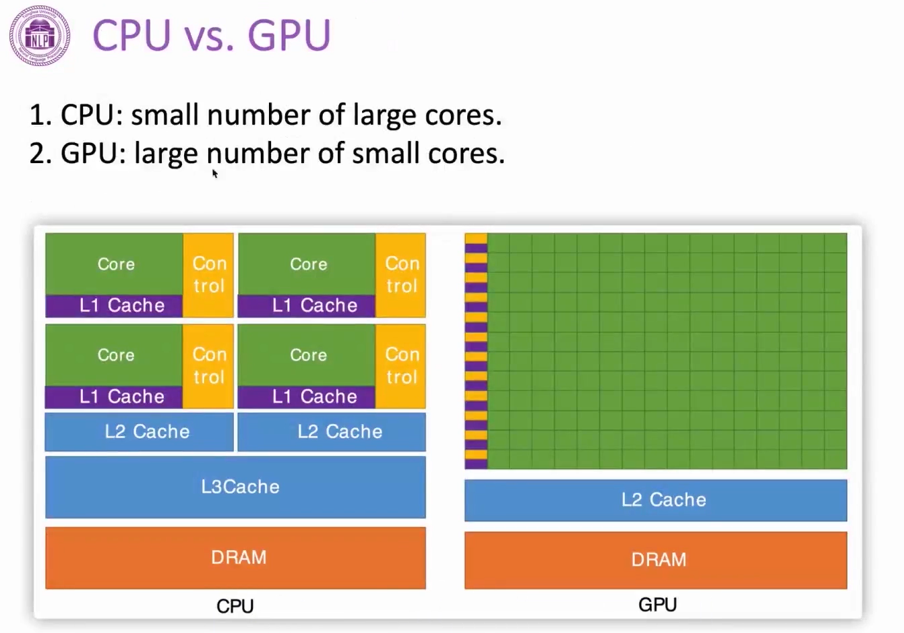

CPU和GPU的合作方式是CPU通过给GPU发一些控制的信号去控制GPU进行计算

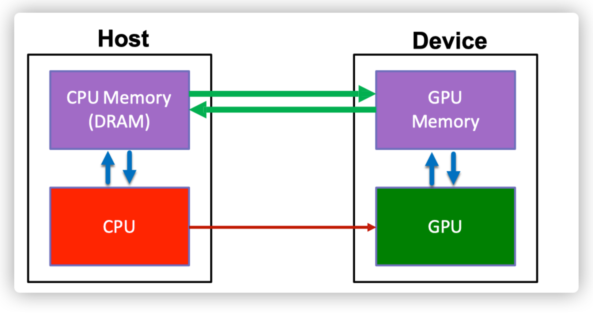

如果我们想把模型的向量加法或矩阵乘法放到GPU中计算的话，我们需要把这些数据通过绿箭头从我们的CPU上拷贝到GPU上(`.cuda`)。

### Memory Components

- 为了加速模型的前向传播，我们需要把模型所有的参数都放到显卡中。

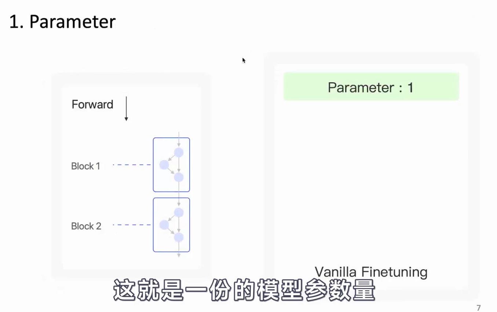

- 在反向传播过程中，我们计算得到的梯度也保存到显卡中。梯度的参数量和模型的参数量是一个数量级的

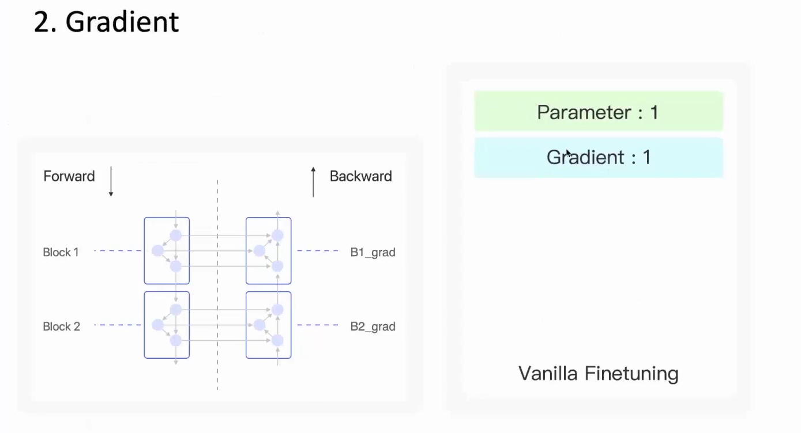

- 模型的中间计算结果，比如线性层y=Wx，为了计算反向传播，我们需要在前向传播时在显卡中保存模型的输入x(中间结果)。x的大小为[Batch,SeqLen,Dim]

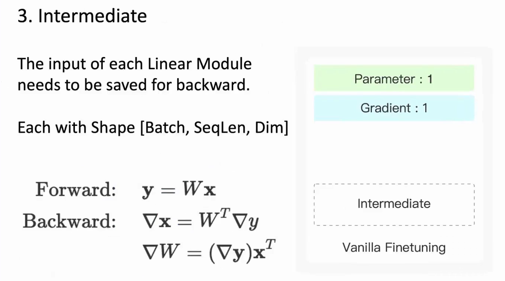

- 第四部分，在显存中占大头的一部分，就是我们的优化器，比如Adam，我们需要保存模型的梯度，和模型梯度二次项相关的历史信息$(m_t,v_t)$。

  为了完成这样的参数优化，需要把m,v,g都放入显卡当中，其中g就是之前已经保存在显卡中的梯度，为了支持Adam优化器我们显卡还需要额外的保存m和v这两个参数，那它们的参数量都是和梯度等数量级的，那么m,v加起来就是一个至少两倍模型参数量

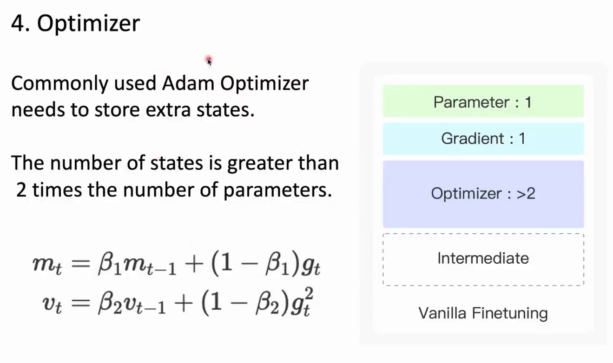

这四部分是我们预训练模型在显卡中主要的四个组成部分。

### 举一个例子

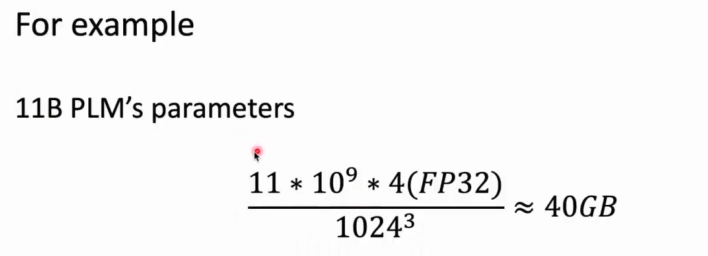

一个11B参数的预训练语言模型，每个需要用float类型(FP32)来存储，即1个参数需要4字节存储

光模型参数就占用了40GB的显存。

我们现在知道显存都去了哪里，下面来看一下多GPU之间的合作模式是怎样的。

我们下面看几种模型训练的优化方式。

## 数据并行

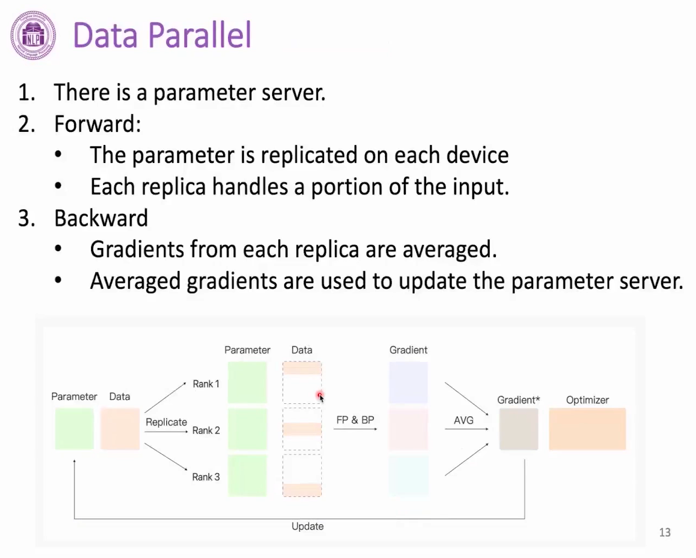

数据并行的核心思路是：
在数据并行过程中，我们有一个参数服务器（有4张显卡，0号显卡作为参数服务器，用于聚合计算，其余三个显卡用于训练数据计算），它保持了模型的参数，以及完整的数据。前向传播过程中，参数服务器上的参数会被复制到所有的显卡上，这样每张显卡上都得到了和参数服务器一样的参数。然后把数据分成三份，每张显卡用这部分数据进行前向传播&反向传播，得到各自的梯度，为了让模型学到这份数据的所有知识，我们需要把这些梯度信息进行聚合。这里用了一个取平均操作，然后让聚合好的参数去更新模型。就能学到这三部分数据合起来完整的知识。

> 1.有一个参数服务器。
>
> 2.前向计算：
>
> 该参数在每个设备上都复制，每个副本都处理输入的一部分。
>
> 3.向后计算：
>
> 平均每个副本的梯度。
>
> 平均梯度用于更新参数服务器。

我们的参数服务器可以在0号显卡上，我们从0号显卡把模型的参数复制到1,2,3号显卡。这就像一个广播过程；而从1,2,3号显卡上对模型的梯度进行聚合(或规约)，我们把规约的结果放到服务器0号显卡上。

### Broadcast(广播)

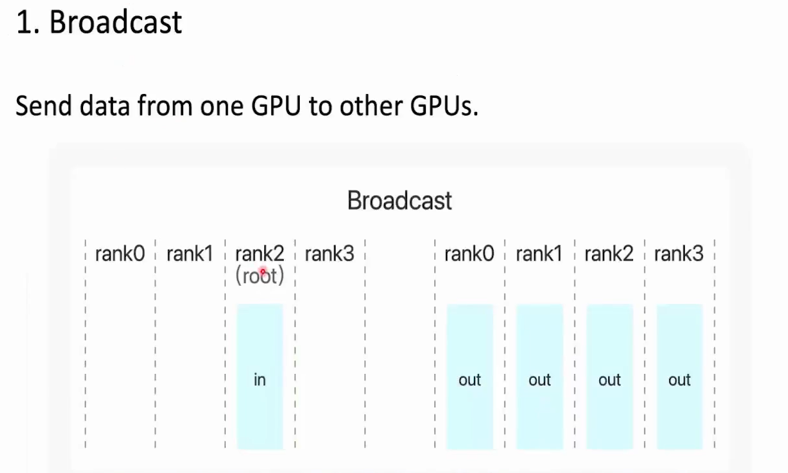

我们先来看第一个多张显卡的合作模式，广播算子。
广播算子做的事情就是把**数据**从其中的一张显卡上传到其他所有的显卡上。可以看到通过广播之后，在原本第二张显卡上的`in`这个向量广播到所有显卡上变成了`out`向量。

### Reduce(规约)

减少所有GPU的数据（求和/求平均），发送到一个GPU。

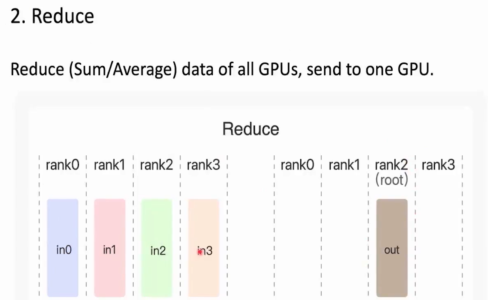

规约有很多种种类，可以是求和、平均、最值等。我们会把**各张显卡上的数据**进行一个规约，然后把规约得到的结果**放到一张指定的显卡**里面。比如这里把规约的结果放到2号显卡里面。**假设规约操作是求和，那么2号显卡最终得到的`out=int0+in1+in2+in3`**。

#### All Reduce

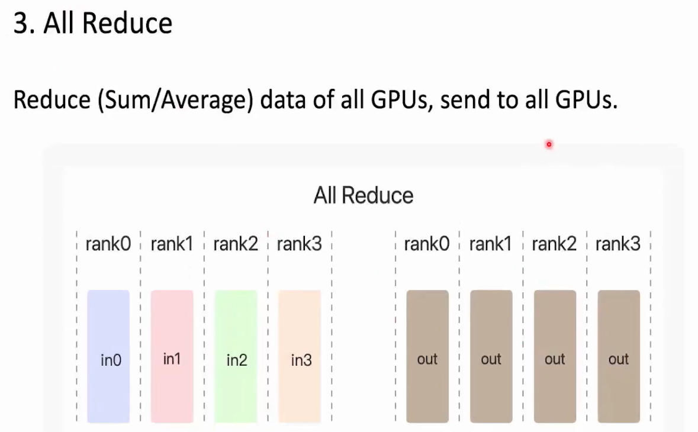

第三个操作算法是All Reduce。**比规约多了一个All**。什么意思，就是在规约的基础上，把规约得到的结果告诉所有的显卡(All)。
也就是说，最后得到的结果里面，**每张显卡上都会得到完全一样的`out=in0+in1+in2+in3`**。

#### Reduce Scatter

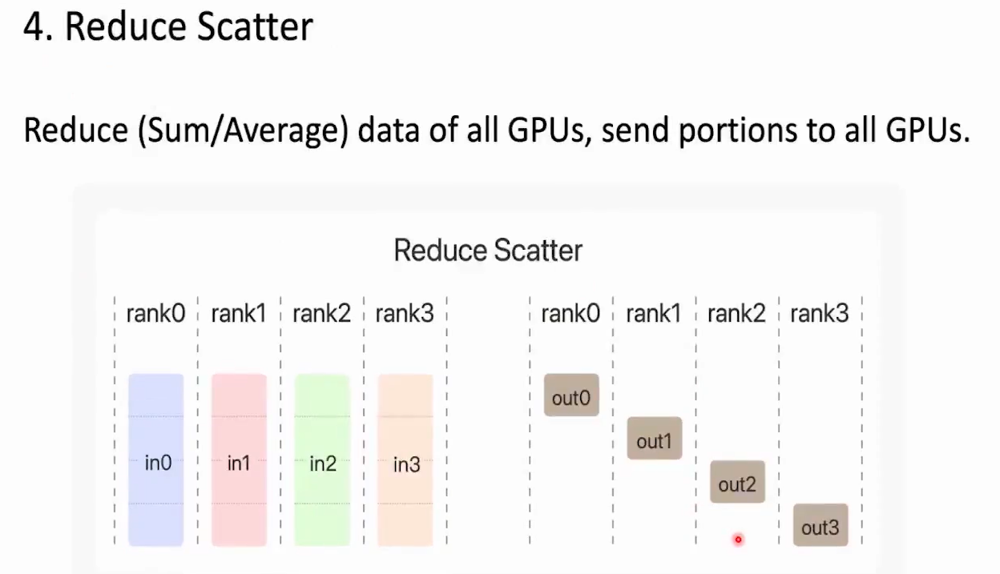

第四个合作方式是Reduce Scatter。**它和All Reduce的相同之处在于，都会把规约得到的结果发送给所有的显卡。**不同之处在于，Reduce Scatter最后每张显卡上**只得到了一部分的规约结果**。比如0号显卡就会得到我们`in0`的前`1/4`的参数＋`in1`的前`1/4`参数＋`in2`的前`1/4`参数＋`in3`的前`1/4`参数。而3号显卡会得到我们`in0`的最后`1/4`的参数＋`in1`的最后`1/4`参数＋`in2`的最后`1/4`参数＋`in3`的最后`1/4`参数。

### 收集(All Gather)

最后一个合作方式是收集(All Gather)，收集的意思是收集最后的结果再告诉所有的显卡。拼接每张显卡上的结果，比如`in0`拼接`in1`拼接`in2`拼接`in3`得到0号显卡的`out`，然后广播到所有显卡上。

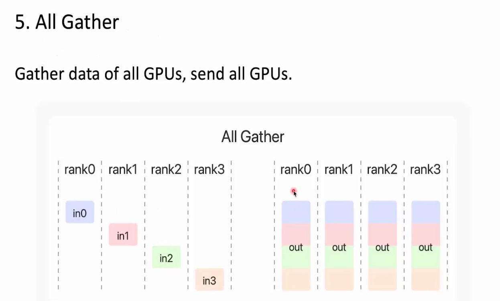

可以看到数据并行有两个核心点。一，我们通过把数据分成很多份，让每张显卡计算得到各自梯度之后，为了得到所有数据的知识，我们需要把这些梯度进行一个规约操作。二，通过使用参数服务器,让规约后的梯度去更新参数服务器上的参数。然后通过广播的操作，让每张显卡上**同步**得到更新之后的参数。

### Distributed Data Parallel

而分布式参数并行对此进行了优化，舍弃了专门的参数服务器，让每张显卡各自去完成参数的更新，保证它们参数更新之后的结果一致。

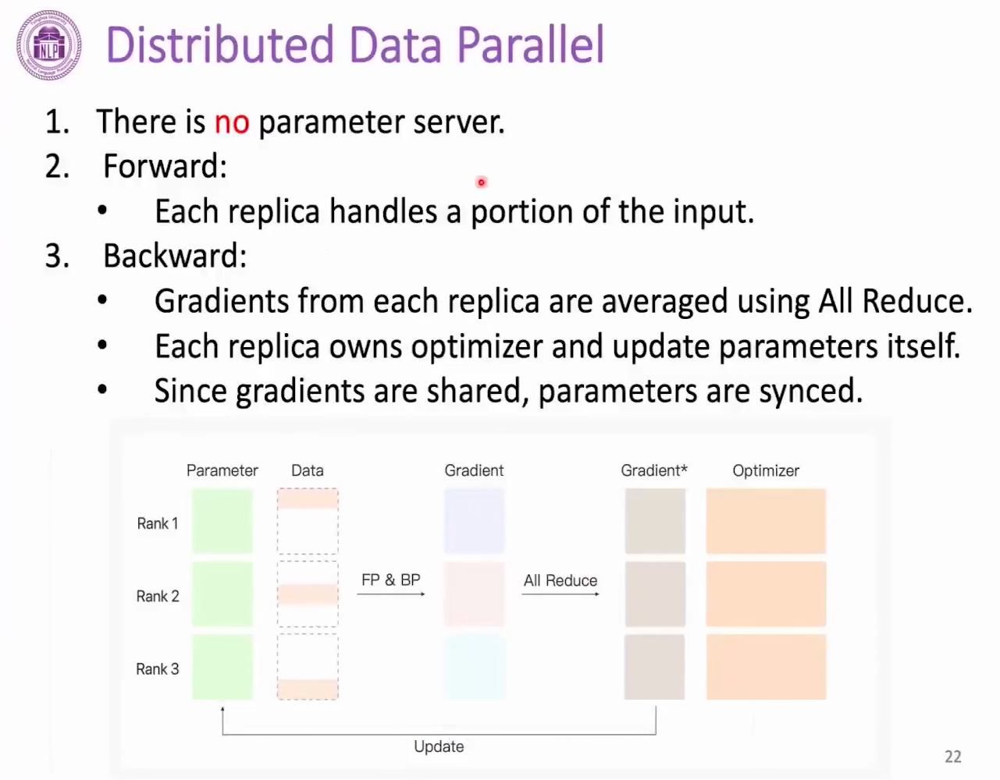

具体来说，初始时，每张显卡上都有一个相同的模型参数，得到了一部分数据。通过前向传播&反向传播得到各自的梯度信息，然后对梯度信息进行一个规约。为了让每张显卡都得到相同的梯度信息，使用All Reduce，它会把规约结果告诉所有的显卡。这样，我们每一张显卡上都能得到完整的规约之后的梯度，每张显卡都有一样的参数，就可以分别通过模型的优化器进行更新。每轮更新之后，既然参数一样，梯度一样，优化器之前的历史信息一样，那么更新之后，各张显卡上的参数也会保持一致。

> 1.没有参数服务器。
>
> 2.向前：
>
> 每个副本都处理输入的一部分。
>
> 3.向后：
>
> 每个复制品的梯度都使用所有降低进行平均。
>
> 每个副本都拥有优化器并更新参数本身。
>
> 由于共享梯度，因此同步参数。

我们来分析一样数据并存的方法所带来的显存上的优化，我们前面知道中间结果是一个和batch乘以句子长度和模型维度相关的显存占用。我们在使用数据并存的时候，我们把一批数据分成了很多份，让每张显卡只处理其中的一部分数据。等效的来看，我们每张显卡上所处理的batch大小就降低到了原来的显卡数量(n)分之一。通过把输入的维度进行了降低，那么模型整体的中间结果量也会进行降低。

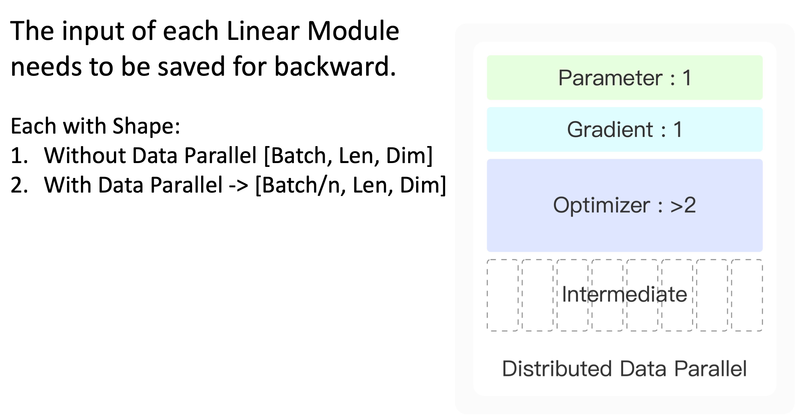

## 模型并行 

既然一张显卡上无法存放模型的所有参数，那么我们就想办法把一个模型分成很多个小的部分。

- 将矩阵参数划分为子矩阵。
- 子矩阵被分成不同的GPU。
- 每个GPU处理样本输入。

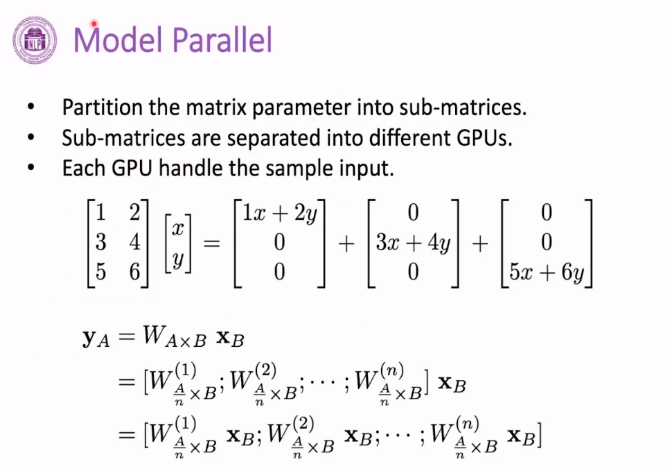

模型并行的思路是，比如针对线性层矩阵乘法的例子，假设我们有一个3 × 2的矩阵。它乘上一个2 × 1的向量，那么本质上我们可以把它的结果分成三部分。如上图所示。

这里的3 × 2的矩阵就是线性层中的参数W，向量就是线性层的输入。我们可以通过矩阵乘法的性质，把模型的参数横向切成很多份(n)，最后得到线性层的结果就是很多个这样小的矩阵乘上线性层的输入，最后把结果进行拼接。

通过这样的方式，我们线性层的参数就可以划分到多张显卡上。同时我们需要保证多张显卡上模型的输入是一样的。那么我们就不能使用数据并行的方式对数据进行划分。

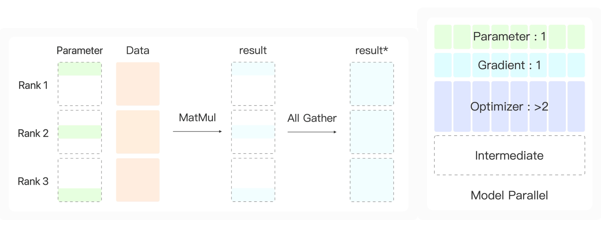

我们需要保证每张显卡上的输入是一样的，所以它们是同样一批数据，我们这里对线性层参数进行划分。每张显卡上得到线性层参数矩阵的一小部分，通过这一小部分参数和数据进行矩阵乘法，就得到了很多个子结果。这里我们通过All Gather收集算子进行拼接，然后广播给所有的显卡。

这样，每张显卡上只需要保存原来的N分之一的模型参数，N是显卡数量。由于只保留了这么一小部分参数，梯度也只需要保留这么多，同时优化器也只需要保持同样级别的参数量。但模型计算的中间结果没有减少，这也是该方法的一个弊端。当batch size很大的时候，仍然会出现显存溢出的问题。

下面我们来介绍另一种方法。

## ZERO(Zero Redundancy Optimizer)

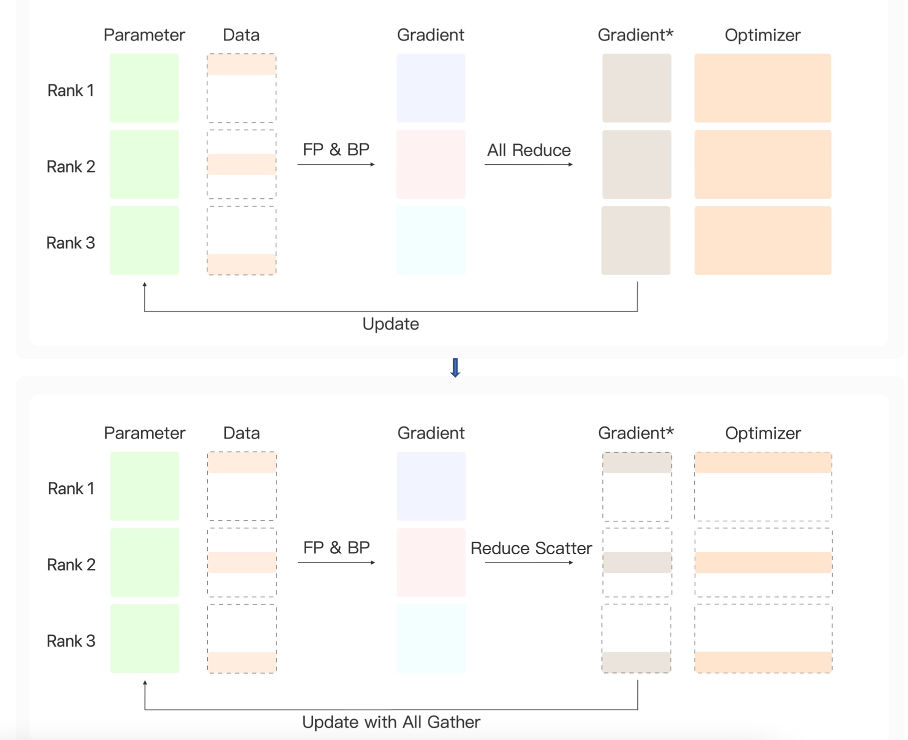

Zero Redundancy优化器是基于数据并行建立的一套框架，在数据并行中我们需要对模型的梯度进行规约。**为了保证每轮迭代之后每张显卡上的参数仍然是一致的。我们就让每张显卡都得到了规约后的参数。然后每张显卡各自进行更新。**

我们可以发现每张显卡用的是同样的一批数据，和同样的一批梯度去进行参数更新。那么它们各自去进行参数优化，是不是就带来了计算上的重复和冗余。

为了消除这样的冗余，那么本小节介绍的方法是**每张显卡只获得一部分的梯度，然后只更新一部分参数**。这样多张显卡通过合作的方式来更新模型的完整参数。

### ZeRO-Stage 1

1.每个复制副本处理一部分输入。

2.前进。

3.后退。

4.**使用“Reduce Scatter”对所有梯度求平均值**。

5.每个副本都拥有优化器的一部分，**更新params的一部分**。

6.使用All Gather同步更新的参数。

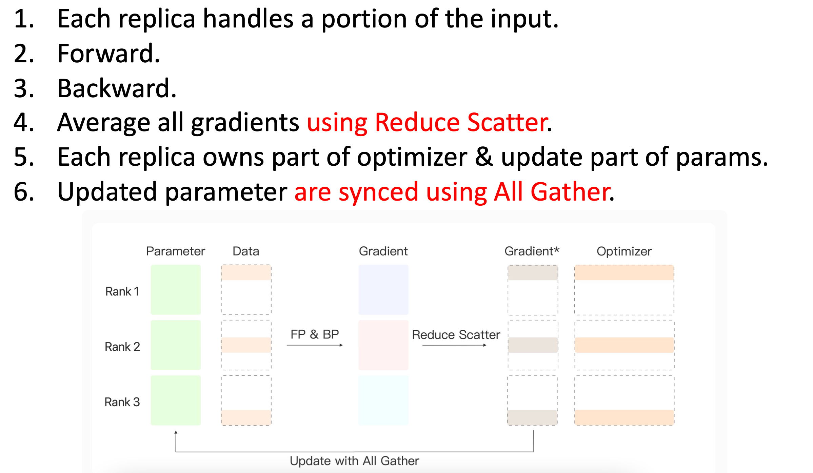

具体来说，由于它也是基于数据并行的架构，因此它每张显卡上保存了完整的模型参数。有一部分数据，通过前向传播&反向传播得到各自的梯度。**之后在规约的时候，不是使用All Reduce的方式，而是使用Reduce Scatter让每张显卡得到一部分reduce的结果。这样让每张显卡上得到的部分梯度去更新对应的部分模型参数，最后通过收集的操作All Gather将每张显卡分工合作之后的结果告诉所有的显卡。**这样，每张显卡上得到了完全一样的参数和一致的结果。

### ZeRO-Stage 2

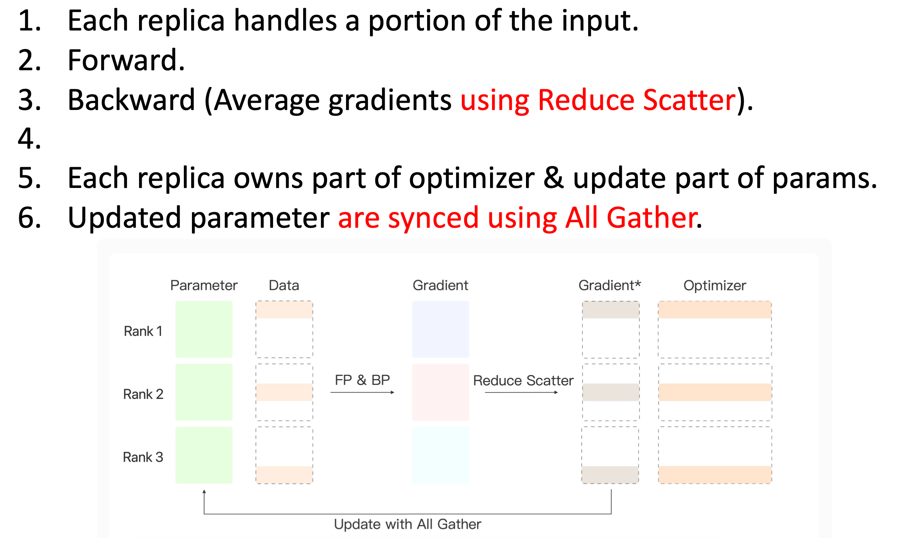

在第二个阶段中，进行了一个优化。

在第一阶段中，需要在反向传播得到所有梯度之后，对梯度进行Reduce Scatter，然后让每张显卡上各得到一部分规约后的梯度`Gradient*`。 原来的梯度就不需要保存在显卡上了。**在第一阶段，在反向传播结束之后，才把这个梯度移除。**

那可以在反向传播的过程中先把`Gradient*`算出来，然后把之前一步的`Gradient`删掉。**具体来说**，假如我们有-个24层的transformer，在反向传播结束第24层的时候，我们就用第24层的各卡上的梯度，进行一个Reduce Scatter，Reduce Scatter之后，第24层的梯度就可以不要了，到第23层的时候，计算第23层各卡上的模型梯度，我们进行一个Reduce Scatter，得到那一层的gradient\*，这个时候我们又可以只保存第23层的gradient\*到显卡上，然后把第23层的gradient进行一个从显卡上的移除。通过这样的操作，我们把这个gradient\*从显卡上移除，这样的操作提前了。这样我们就可以进一步的节省显存上的空间

### ZeRO-Stage 3

在第3个阶段，对模型的参数进一步划分。因为每张显卡上只保留了一部分梯度去进行参数更新，参数更新也只更新一部分的模型参数。

> 这里注意一点，虽然参数更新只更新一部分，但是模型前面的参数梯度需要后面参数梯度才能计算，同理后面的参数梯度需要前面的前向传播才能计算？
>
> 所以在前向、反向传播中，我们需接把模型的参数进行一个All gather的操作，在用到模型的所有参数时候，我们去临时的把每张显卡上的那一部分的参数进行一个收集拼接，每当我们用完的时候，我们就把这个参数给从显卡中释放
>
> 具体而言，在transformer的过程中，我们遇到了一个线性层，这个线性层的参数，可能被分到了三张显卡上，这个时候我们需要计算这个线性层的时候，我们临时的把跟这个线性层有关的那一部分参数从各张显卡上收集起来，进行一个线性层的计算，进行完这一层线性层计算之后，我们的模型参数就不需要放在显卡里了又可以释放掉，又恢复成每张显卡只保留一部分线性层参数的这样一个模式
>
> 我们在反向传播计算模型梯度的时候，实际上也需要用到模型的完整的参数，那在反应传播的时候也需要gather一下

第三个阶段比第二个阶段多增加了一次All gather通信,用时间换空间

### 三个阶段的比较

然后我们比较一下这三个阶段的显存占比：

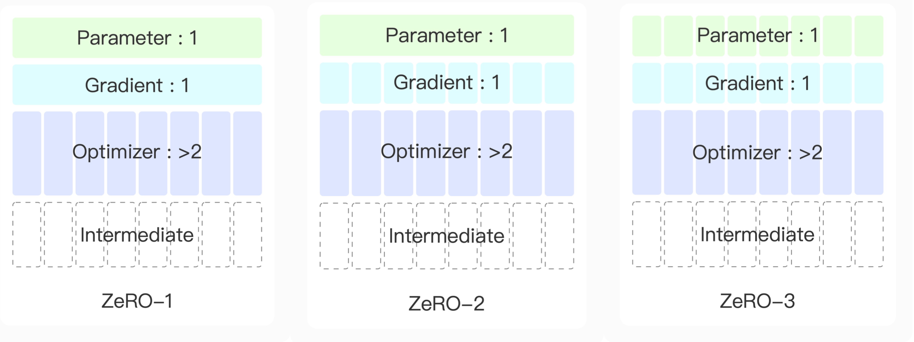

在第1个阶段中，每张显卡只需要处理一部分的模型梯度，优化器降低到了原来的显卡数分之一，同时把中间结果的量也降低到原来的卡数分之一；
第2个阶段中，进一步地把模型的梯度划分提前，把Reduce Scatter提前到了反向传播的过程中，实际上不需要保留完整的梯度。
第3个阶段中，进一步地划分参数。

通过这三部分的优化，显卡上的四大组成部分：参数、梯度、优化器和中间结果都得到了划分，每张显卡只需要保持自己的那部分参数。

## Pipeline并行

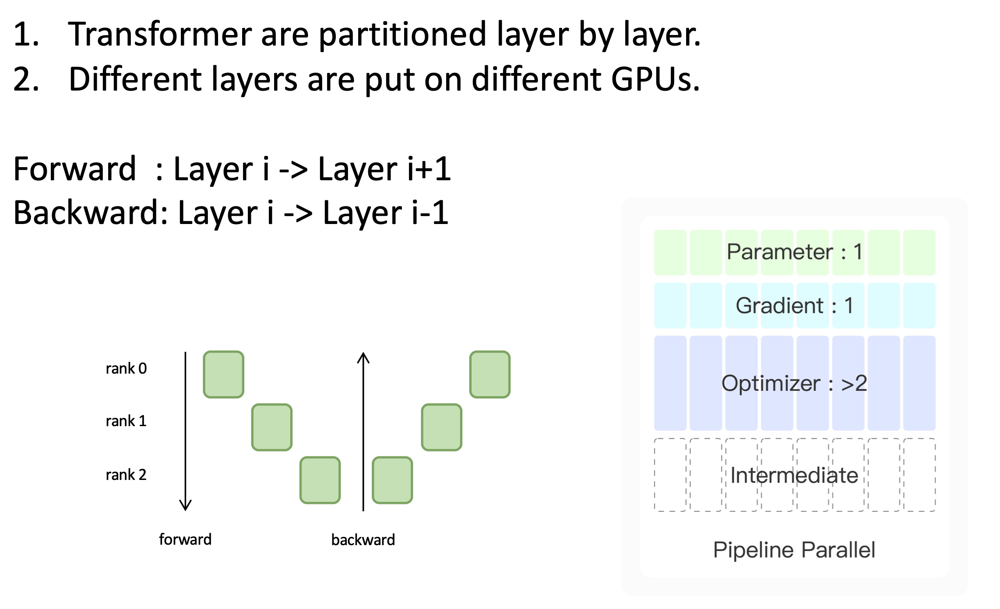

- 它与模型的并行方法有类似之处，模型并行的方法通过把线性层分成很多个小的矩阵，然后把这些小的矩阵分到各张显卡上。

- 而对流水线的并行方法，把模型的不同层分给不同的显卡。比如我们有一个三层的Transformer，我们可以把Transformer的第一层分到第一张显卡上；第二层分到第二张显卡上，等等。进行前向传播的过程中，我们需要在第一张显卡上完成第一层的模型计算，然  后把计算结果告诉第二张显卡，第二章显卡进行计算，再把计算结果传给下一张显卡。
- 可以看到，这样的方法，显存占比都得到了划分，因为每张显卡上只保留了某些层的参数，也只用保留对应的梯度。虽然没有使用数据并行的方法，但模型层数变少了，这样中间结果也得到了减少。
- 但这种方法存在的弊端在于，0号显卡计算的时候，1号和2号显卡实际上处于空闲的状态。

下面我们介绍一些技术的优化细节。

## 技术细节

### 混合精度

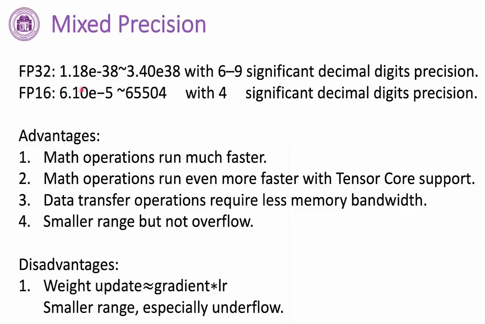

比如C语言中有float类型、double类型和long double类型。数值表示范围依次增大。

比如double类型比float类型有更大的表示范围和更高的有效位精度，但是double类型的计算会更慢。
同理FP16和FP32是一样的，前者的数值表示范围和有效位数更小，同时计算会更快。
在一般模型的训练中，我们可能使用FP32作为默认训练参数的表示。实际上，模型的参数一般不会超过千这个数量级，那么完全可以使用FP16。

那我们能否从FP32转到FP16得到运行速度上的提升呢？其实会面临一个问题，在参数更新的时候，一般学习率是比较小的：1e-5、1e-3等。而FP16能表示的最小值，是1e-5数量级的数，假如我们的梯度乘上学习率低于FP16的表示范围，那么参数更新量就会产生丢失(下溢)。

那么既然FP32能达到出更高的表示范围，我们可以把FP16的梯度乘上学习率得到的参数更新量表示为FP32，但模型的参数是更低精度的FP16。那我们无法直接把参数更新量加到模型参数上，此时需要在优化器上额外保留单精度(FP32)的一个参数。

如上图左边是一般的计算优化方法，右边是混合精度的优化方法

在一般的模型训练中，模型会有FP32的参数和FP32的梯度，然后优化器会使用FP32的梯度进行参数优化。

而在混合精度训练中，为了加速模型的前向传播&反向传播，模型中会使用半精度(FP16)的参数，和半精度的梯度，把梯度传到优化器里进行优化器的更新。同时把优化器的更新量保存为FP32类型，把这个FP32类型通过优化器里**临时创建的FP32参数进行累积**，之后转回到FP16的参数来与模型进行计算。

### Offloading

以Adam为例，优化器的参数量会是模型参数量两倍的关系，显然它是一个显存占用的大头。我们能否把它从显卡中移除呢？

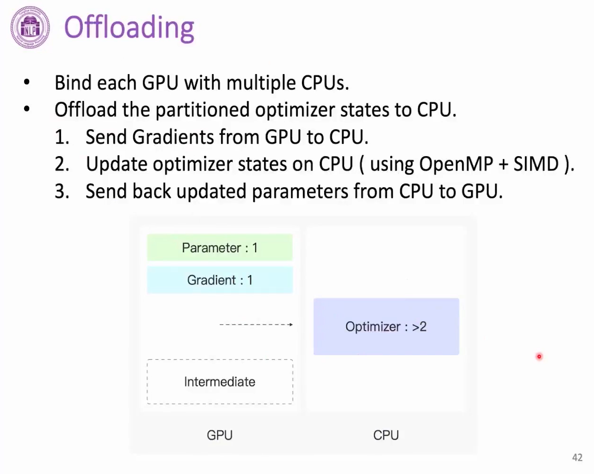

其实是可以的，我们可以把它从显卡上移到CPU上。
这样需要我们先把模型参数的梯度从显卡中传给CPU，在CPU上进行优化器的优化，将优化的结果传回显卡上。在使用了ZeRO3梯度优化之后，参数划分为显卡数分之一，通过把一张显卡绑定到多张CPU上，就可以让每张CPU上的计算量足够低，能让CPU不成为模型训练的瓶颈。

> 将每个GPU与多个CPU绑定。
>
> 将分区优化器状态卸载到CPU。
>
> 1.将GPU的梯度发送到CPU。
>
> 2.更新CPU上的优化器状态（使用OpenMP+SIMD）。
>
> 3.将更新后的参数从CPU发送回GPU。

### Overlapping

> 1.内存操作是异步的。
>
> 2.因此，我们可以将内存操作与计算重叠。

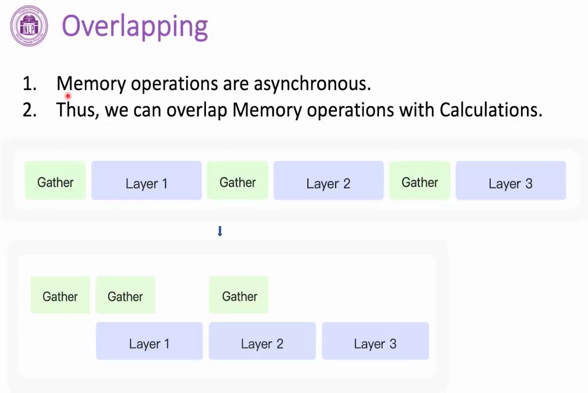

本节介绍的技巧是通信的计算的重叠。在GPU中的内存操作一般是异步的，我们可以提前给内存发送一个请求，可以去进行其他的计算，其他计算完成之后，对那个内存请求进行接收。

在模型前向传播过程中，我们需要把Layer1的参数通过Gather操作，然后计算Layer1，然后再依次对Layer2的参数进行优化。在获得完Layer1参数之后，在Layer1前向传播计算过程中，异步地把Layer2参数的获得进行提前。在Layer1前向传播计算完之后，Layer2的参数也已经获得，那么就可以马上进行Layer2前向传播计算。

### Checkpointing

> 前向计算：
>
> 保留了一些隐藏状态（检查点）。
>
> 所有其他中间结果将立即释放。
>
> 后向计算：
>
> 重新计算释放的中间结果。
>
> 并在获得梯度态后再次释放。

Checkpointing就是检查点，就像单机游戏中的存档。

为了支持模型的反向传播，我们需要把模型计算的所有中间结果保持在显卡中，我们是否可以通过存档的方式进行优化。

即我们不把所有结果都保持到显卡中，而只保持一定的存档点。

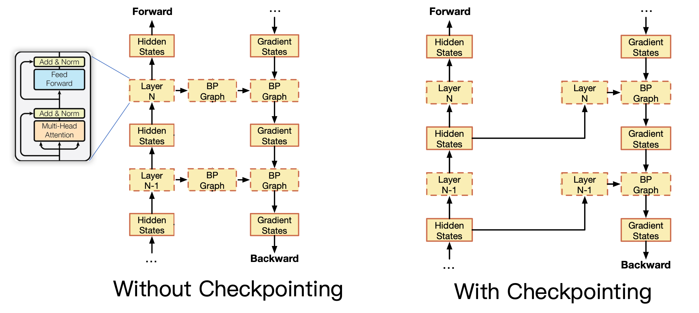

以Transformer为例，我们只保留Transformer大层的输入作为检查点，在反向传播过程中，那么如何为大层中的线性层梯度进行计算？此时可以通过重计算，就是说我们通过Transformer每个大层的输入，在反向传播过程中，重新对它进行一个前向的传播。临时得到每个大层里面所有线性层的输入，那么得到了中间结果，就可以进行反向传播。

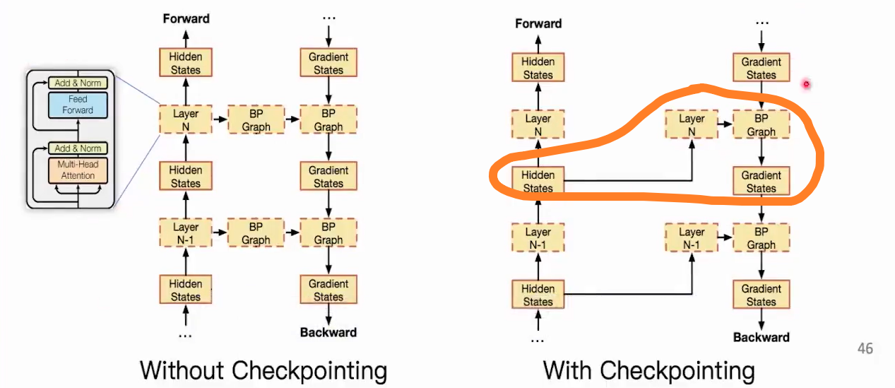

> 右上图标记中的Hidden States是检查点，Layer N是由左上图的block线形层计算的中间结果

完成了这一层的反向传播之后，我们就可以把检查点和临时重计算的中间结果从显存中清理掉。这样我们就不需要保存那么多中间结果。

## BMTrain——使用介绍

本小节介绍BMTrain性能上的提升。

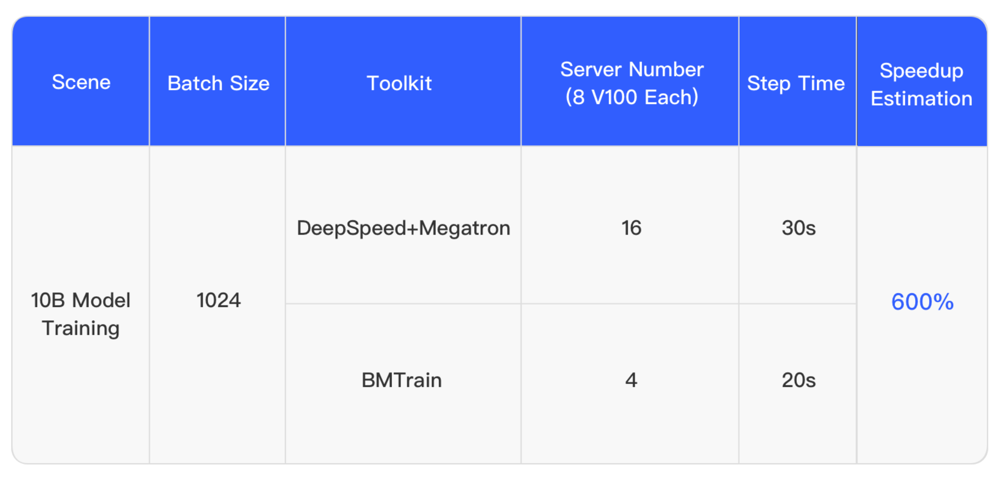

据说可以使用更少的机器，达到更快的速度。

使用上也简单，替换一些包名前缀。就可以用到前面提到的一些技术。 

下面介绍大规模预训练模型压缩的一些技术，主要介绍他们的工具包BMCook。

## 大规模预训练模型压缩

### 模型压缩 

背景就是大模型的规模增长非常快。

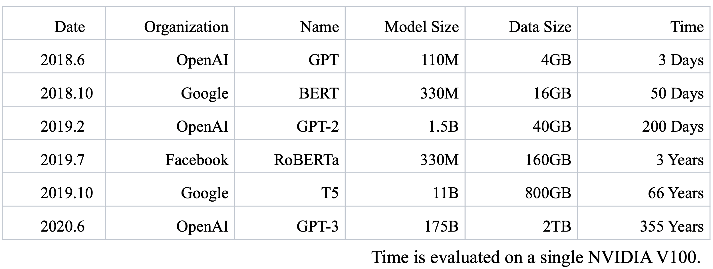

接下来介绍模型压缩的一些技术，目的是希望把大规模的模型压缩成更小规模。模型压缩几个典型的方法，包括知识蒸馏、模型剪枝、模型量化

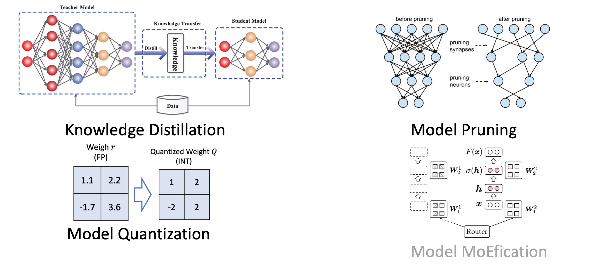

### 知识蒸馏

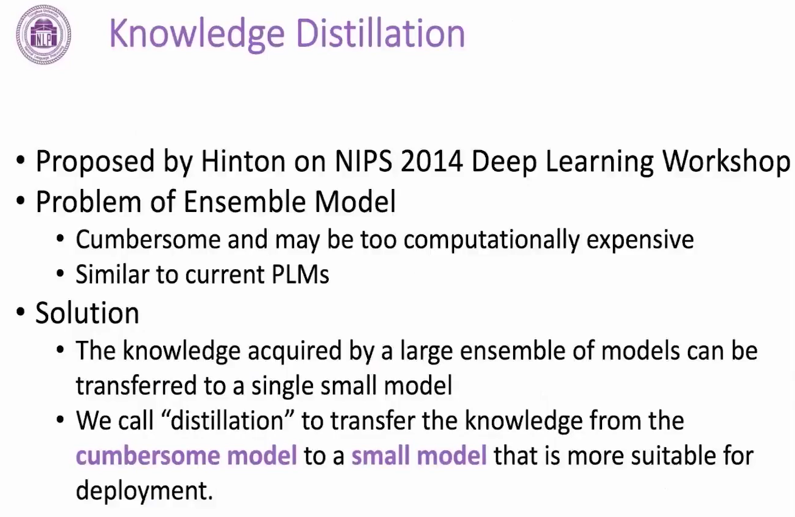

Hinton在2014年NIPS深度学习研讨会上提出：集成模型问题：繁琐且计算成本过高

•类似于当前的PLM：解决方案：由大型模型集合获得的知识可以转移到单个小型模型

•我们称之为“蒸馏”，将知识从繁琐的模型转移到更适合部署的小型模型。

什么是知识

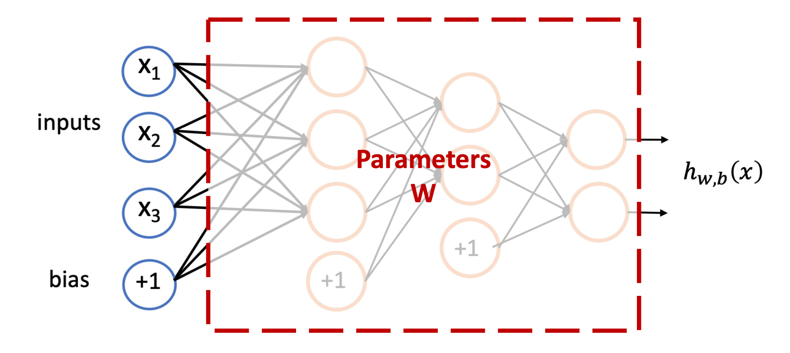

从更抽象的角度来看，知识是从输入向量到输出向量的学习映射

这里知识指的是模型的参数本身，本质是把模型从输入映射到输出的过程。知识蒸馏就是想把这种映射能力从大模型迁移到小模型上。

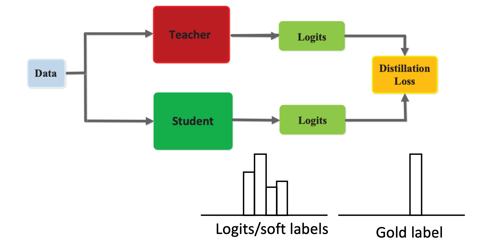

对于输入数据，会有大模型作为Teacher，它会算出当前数据的预测结果，logits/soft labels。
同时，该数据也可以输入给一个小得多的Student模型，该模型对于数据也能给出logits，知识蒸馏想做的事情是让这两个logits尽可能地接近。对于logits可以有不同的处理，比如可以用softmax转换成概率分布，然后利用KL散度去让这俩个概率分布尽可能接近，又或者可以直接去计算俩个logits的MSE距离

以分类问题为例，相比较标准的监督学习，会有个标注数据，然后要做的事情是让Student模型的logits去尽力拟合标准数据分布，但其实就是个单点的0 1分布，但这个分布可能并不是对于当前的一个数据的信息一个比较好的刻画，对应蒸馏学习，有一个教师模型可以提供soft labels或者logits，那么它就可以是一个在多个标签上它都有一个概率分布，那这样可能能够让这个Student模型学得更好

•关键研究问题：如何建立更多的软目标。以前的方法只使用最后一层的输出

#### PKD

第一篇关于预训练模型的知识蒸馏工作称为PKD，它是面向BERT做的知识蒸馏。

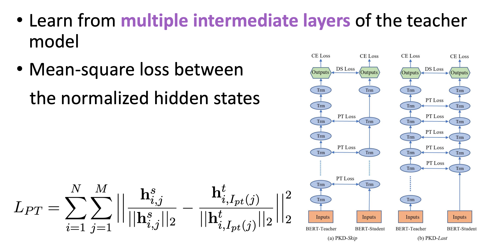

它针对传统的知识蒸馏进行改进，让student模型可以从teacher模型中间层进行学习。
PKD针对模型中间层的输出，或者说隐藏状态。它想做的事情是让student模型的隐藏状态和教师的尽可能接近。而不是仅拟合最终的输出。

具体来说就是用了MFE loss 去约束这个学生模型和教师模型的hidden state

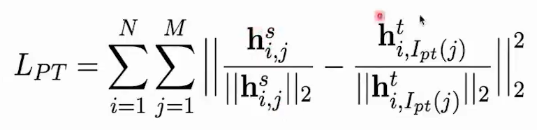

这个公式就首先是HS就代表是丛student model里拿的这个hidden state，然后HT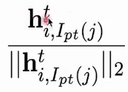就从这个teacher model里拿的这个hidden state，然后i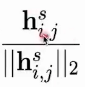呢就是因为文本输入总是会有一个序列，i就是相当于说在这个序列当中的第i个token，然后j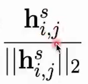的意思就是说Student model里的第j层，然后相当于说就让每一个这个token的中间的这个表示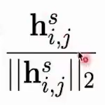,和它对应的这个Teacher model当中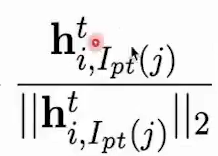hidden表示尽可能做一个匹配，然后这里的话其实就入了这个第二个问题就是说他需要有个匹配关系，这也是它自己这个IPT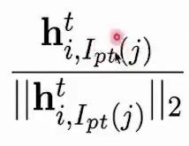想做的事情，就是说我Student模型的这个第j层那应该对应到这个Teacher models第几层呢，为了解决这个问题提出了两种方案，一种方案就是说每俩层取一个进行一个对应，比如教师网络第二层就对应学生网络第一层，第四层对应第二层...

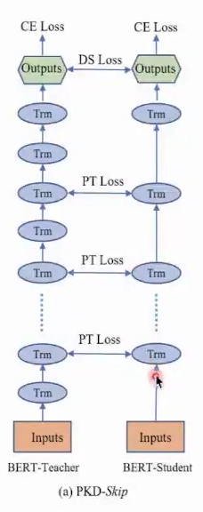

第二种解决方案就是就对这个教师网络最后的六层就对应到这个Student model它所有的6层

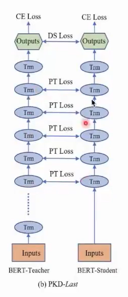

#### TinyBERT

还有一个非常有代表性的工作是，TinyBERT。它进一步地推广了能学习的信号。从Teacher模型中找到了更多的可用于知识蒸馏的中间表示。

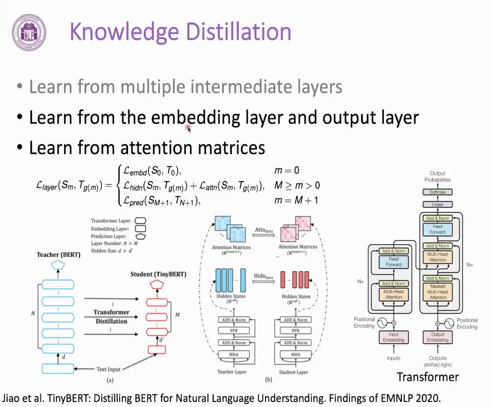

•从多个中间层学习

•学习嵌入层和输出层：输入向量就是这个Student model和Teacher model输入向量也是不太一样，它也通过去加一个类似于相似度的一个约束，希望学生网络它的这个输入词向量也会和教师网络的京可能相似，对应loss就是第一项

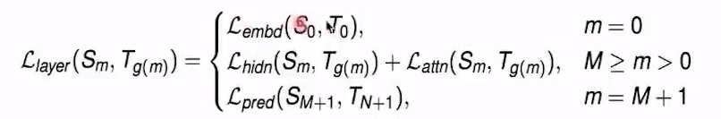

分别对应教师和学生的第0层的这个输入

•从注意力矩阵中学习：对应transformer而言有大量注意力的计算，相当于刻画俩个token之间的关系，然后基于这个关系，然后用注意力去做加权求和来更新每个token的一个表示

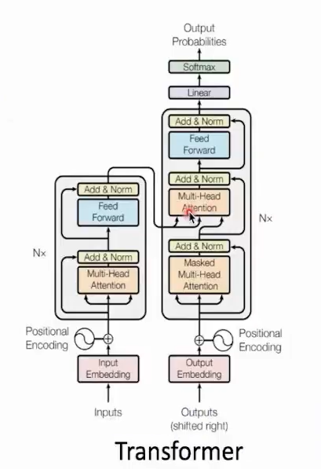

，对应过来就是Teacher model的attention matrices尽量去和这个Student matrices也有一个这个对应关系，相当于进一步的拟合这个teacher model的一个计算过程，

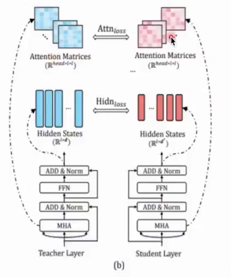

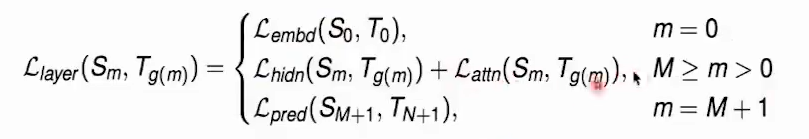然后对应的其实是中间的这个loss的后边这个Lattn这部分的一个计算，然后这个也是简单的可以通过一个MSE的这个约束去实现。

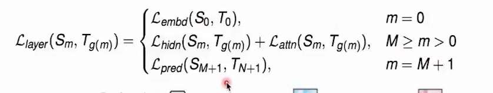

然后最后的这个第三行是我们最早提到的是知识蒸馏可以用这个每一个模型最后的一个输出然后去做一个概率分布的一个约束

### 模型剪枝

- 根据参数矩阵的重要分数，删除参数矩阵中多余的部分
- 非结构化修剪和结构化修剪

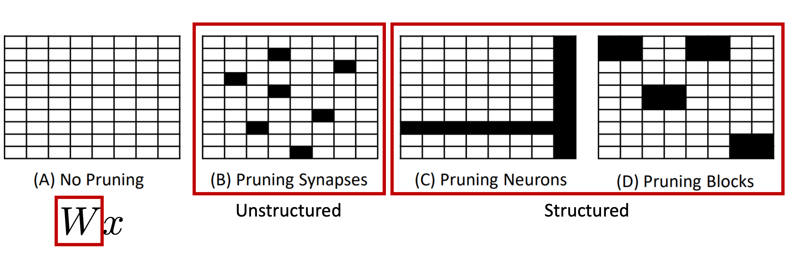

这里剪枝做的事情，比如对于参数矩阵W，可能有很多元素非常接近于0。那么是否可以把这些参数丢掉。
核心是去除参数冗余部分，去除的依据是根据重要性，重要性最直观的依据是看元素绝对值大小，如果非常接近于0，那么就认为它不重要。

剪枝分为结构化剪枝和非结构化剪枝。

非结构化如上图（B）所示，直接去掉黑色的元素，去掉的元素其实就很多时候就直接被考虑成普通的无素就直接进行处理了，它其实对于整个计算加速的收益是非常有限的。

现在比较有用的是结构化剪枝，它考虑一次性删除矩阵中的一行/一列/一块。这样删掉之后矩阵还是一个比较规整的形状，从而比较利于并行化计算。

接下来就是介绍基于预训练模型的剪枝的一些观察和工作

#### 首先是unstructured的权重剪枝应用到BERT

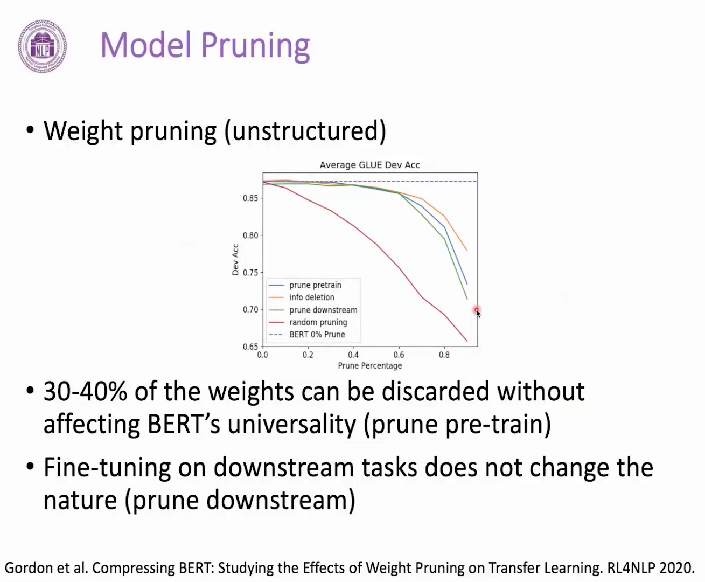

上图中x轴是剪枝的一个比例，x越大剪枝比例越高，模型就越稀疏；y轴是它在这项任务上的性能，y越大它这个模型的效果越好

prune pretrain:对于一个预训练完的模型做剪枝，然后再对于这个剪完的模型在不同的任务上面进行Fine-tuning测试

- 30-40%的权重可以丢弃，而不会影响BERT的通用性（修剪预训练），就说明它其实存在一些这个参数的冗余度，但不高；对应有一个可以参照数据，对于像CNN那些一开始提出被用于做剪枝那些模型，比如说99%参数都给它删了，但是模型的性能基本不变。但是这个方法没办法很好的迁移到现在这种基于transformer的模型
- 在下游任务上进行微调不会改变性质（下游的修剪）。先拿一个完整的模型到下游进行训练再对这份训完的这个下游任务做一个剪枝，就是这个prune downstream

#### 对于注意力层的剪枝

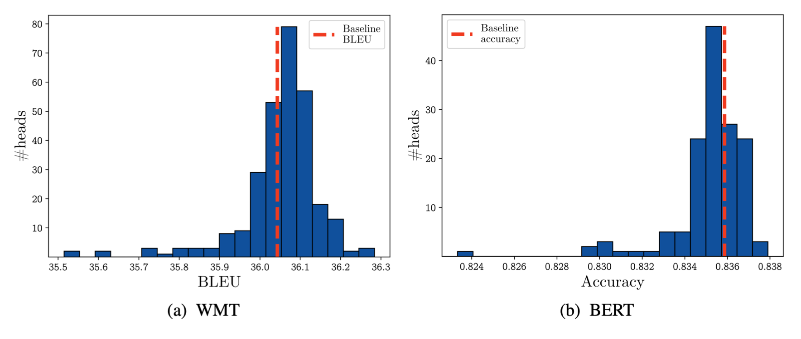

关于预训练模型结构化剪枝的工作。这些multi-head attention当中会存在一些冗余。如果把某个注意力head丢掉，观察对与机器翻译（图a）和语言理解任务（图b）上的影响，从上图可以看到，这种做法不一定会对模型造成负面的影响，甚至很多时候还带来结果的提升。

进一步来说，它想要来尝试的是把Attention head pruning (structured)给实现到这些transformer模型.

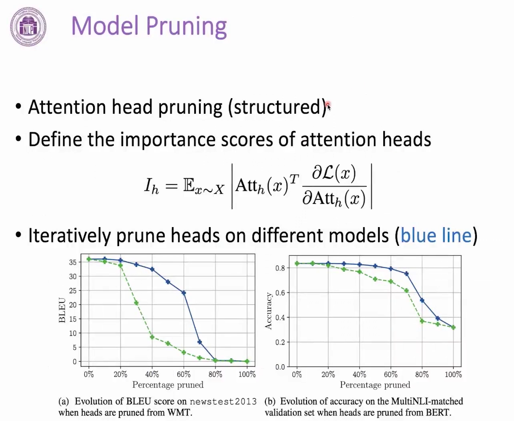

对应来说他其实定了一个attention的head的一个重要性的评测指标

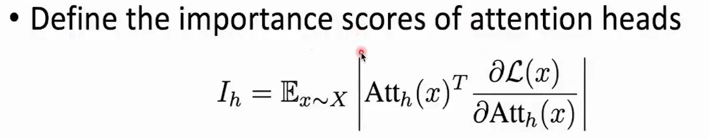

这个式子它的这个相当于在每个attention head上就加了一个系数，而对于这个系数进行一个求导，如果这个系数它很重要的话就是说这个数它不能太小的话，那就说明这个attention head的比较重要。那如果这个系数，它最后求导出来的梯度其实比较小的话就说明这个attention head对这个整个计算过程不太重要，然后最后得到一个在不同数据上都做这个梯度的测算，最后就能眵得到这attention head这种重要性的得分。

之后就是他在实验里就尝试用他这个attention head这个important score即上面这个式子去对这个模型进伺剪枝，对应上图的蓝线。绿线是根据网刚上边那个图Population one head对于性能的那影响，然后来去做剪枝，也做一种分数的度量。从上图可见其剪枝效果好。在基本上可能在机器翻译（图a）剪过20-40%，在语言理解任务（图b）剪过40-60%都能够基本一维持这原始模型的性能。

#### 对于每一层做结构化剪枝（层剪枝）

- 分层修剪（结构化）
- 将丢弃从权重扩展到层
- 训练：随机删除层
- 测试：选择具有任何所需深度的子网络

比如说一个12层的东西就把其中的几层如第一层给丢弃，只剩下11层。这个地方提出了一个训练方法，希望让这个模型它能够自适应的训练一个模型，并自适应的去转换成不同层的一个配置。比如训练一个12层的模型，既可以转换成9层也可转换6层等（如下图右边所示）。

为实现这种技术，提出dropout的扩展版本。dropout其实就是把神经网络计算当中一个中间结果的hidden state的一些维度给随机的置换成0。本身提出是为减少这个网络的过拟合的一个程度。在此处就是dropout的扩展版本，每一次随机的把那个中间的一些层被给dropout掉,层数是随机变化的，但是它希望drop layer学到一种就是自适应的适配不同层次的一个能力。只是训练过一次，然后就能够适配多层不同配置的需求如下右图所示。

训完模型之后进行测试，可以根据目标开销所需，可选择该网络中的子网络去测试，选择策略较为简单。比如说从12层选6层，可按照每俩层的第一层来选择得到新模型，此模型无需再去训练就可直接参与推理

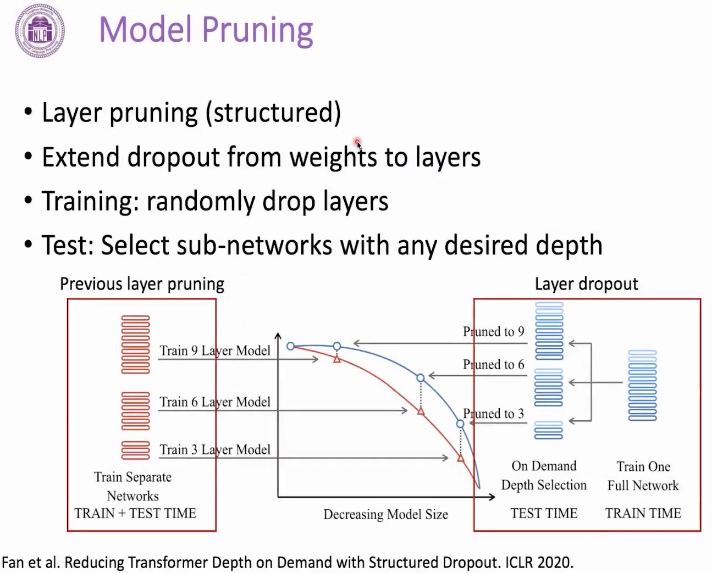

### 模型量化

标准的神经网络数值计算是浮点计算，那么表示的位数相对多一些。单精度32位，double就是64位。观察发现，神经网络其实不需要这么高的精度，所以可以把浮点的表示转换成定精度的表示。

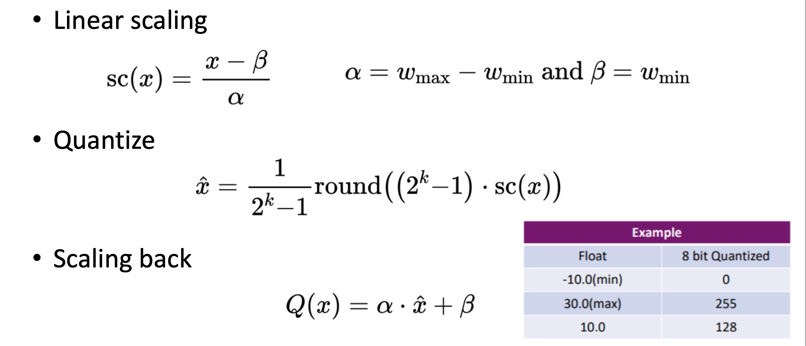

首先我有一个系数，然后我就存一个int值，每次用的时候就把这个系数和这个int值乘起来，然后把它还原成浮点型来用。这样的话，这个表示的位数就会减少很多，同时在计算时把这个计算的位数也给相对降下来。之后那个在推理部分会对量化的一些部分进行具体介绍

#### 量化的挑战

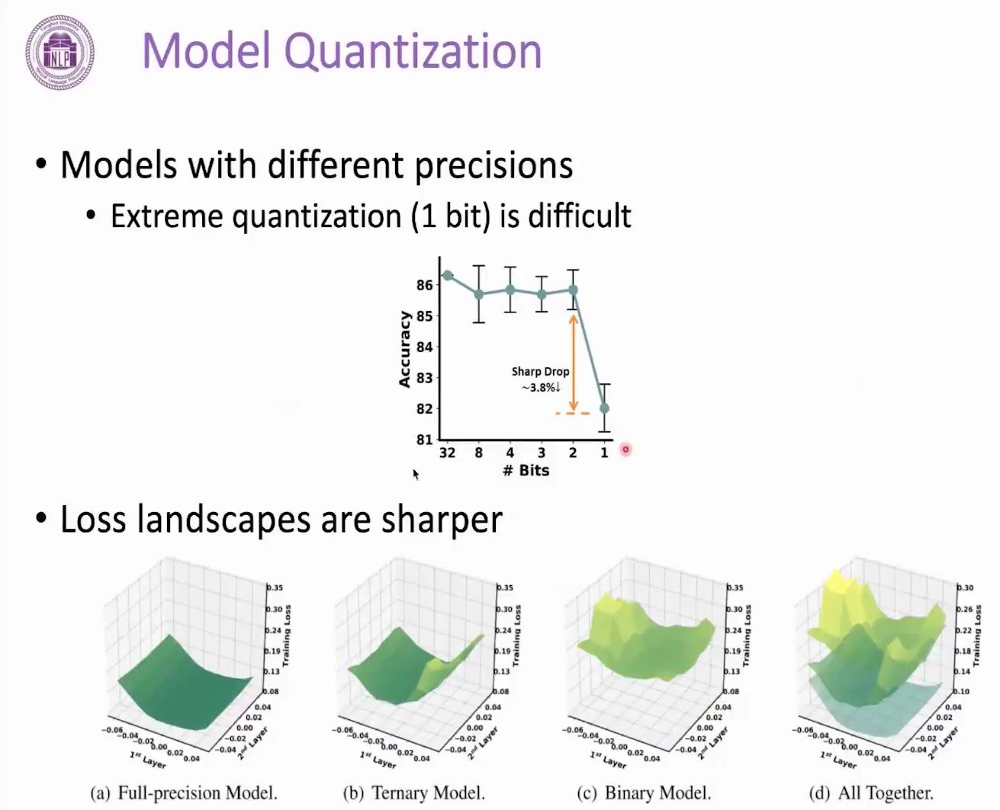

上面第一个图是不同精度表示对模型性能的影响，从32位到1位，可以看到在2Bits的这个定精的表示之前模型性能相对来说还是比较稳定的。但是到1位的精度来表示的时候，这个参数要么是0要么是1，这个量化过于的提高了，导致模型的性能有一个非常严重的下降，这就是现在研究者就希望想出一些方法，然后去能够更好的去优化出1比特的这种比较极端的这种明显变化

下面这个图就是量化模型的这个Loss landscapes有一个可视化的，然后可以看到就是说，精度它越低，就从Full-precision到Ternary就是2bits(Binary是1bit).首先它Loss是不断提高的,就它应该就相当于更底下一点然后越来越往上，同时的话曲面也是更加地曲折，就相当手更不平滑更难优化一些，所以自然带来这种低精度量化严重的优化的问题

#### BinaryBERT

针对以上的问题，BinaryBERT对于这个优化问题进行些设计，希望训练更好的Binary模型，即为1bit模型

- 训练半尺寸的三元模型
- 通过权重分割用三元模型初始化二元模型
- 微调二进制模型

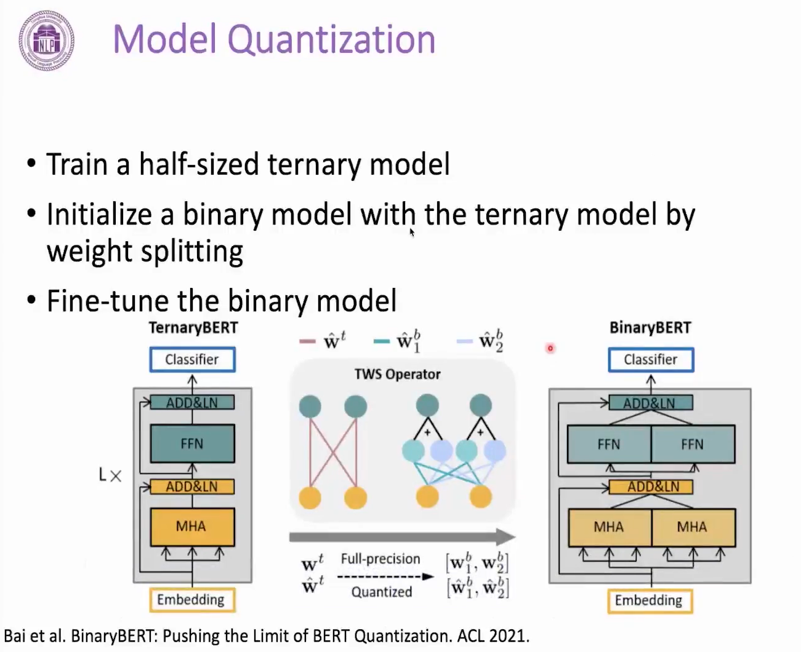

BinaryBERT观察到训练一个高比特模型相对于是更好优化点，所以他就希望用一个高比特的模型来初始化Binary模型，然后给这种binary模型提供一个更好的初始点，然后使得它能够更好的在优化空间里进行学习，具体而言呢，他其实是先训了一个ternary model，ternary就是说它的表示方法是-1，0，1，有三个不同的表示的位置，然后它先训练一个一半大小ternary model,这个是相对好优化,然后它再进一步以一种等价变换的方式把原来的一个ternary 的一个元素转换成两个对应的binary元素。在这个转化过程当中可以是完全等价的，其实可以解一些类似于线性方程，即完成这个weight splitting的过程，就能够初始化出个更好的binary model。然后它再进一步这个Fine-tune这个binary model，取得了比这个从头训一个binary model更好的效果

## 其它模型压缩方法

### Weight Sharing

Weight Sharing就是说不同层就用同样的参数进行计算，这样的话它这个参数量就能降下来，就比如说原来是个12层，那我现在可能每一层的参数都一样，之后我都要存这个一层的参数，于是参数就变成原来的1/12。

那么其中一个代表的就是ALBERT

- 将大词汇嵌入矩阵分解为两个小矩阵
- 跨层参数共享：于上所说的一致，迭代使用同一层参数的思想

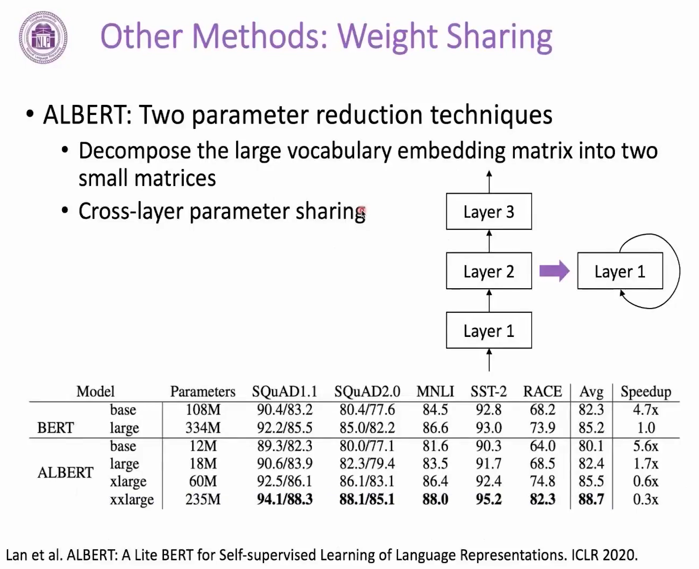

### Low-rank Approximation

DRONE

还有一种方式就是对矩阵做低秩分解,从直觉上来看一个N*N的矩阵，如果中间的这个特征值存在一些特别小的对角线元素，那么丢弃他们，矩阵计算的维度就可以减少。然而transformer里面的矩阵计算不慢，如下图（a）所示，如果特征值存在冗余的话是适合的，但是这些特征值与效果呈线性，所以说不适合。

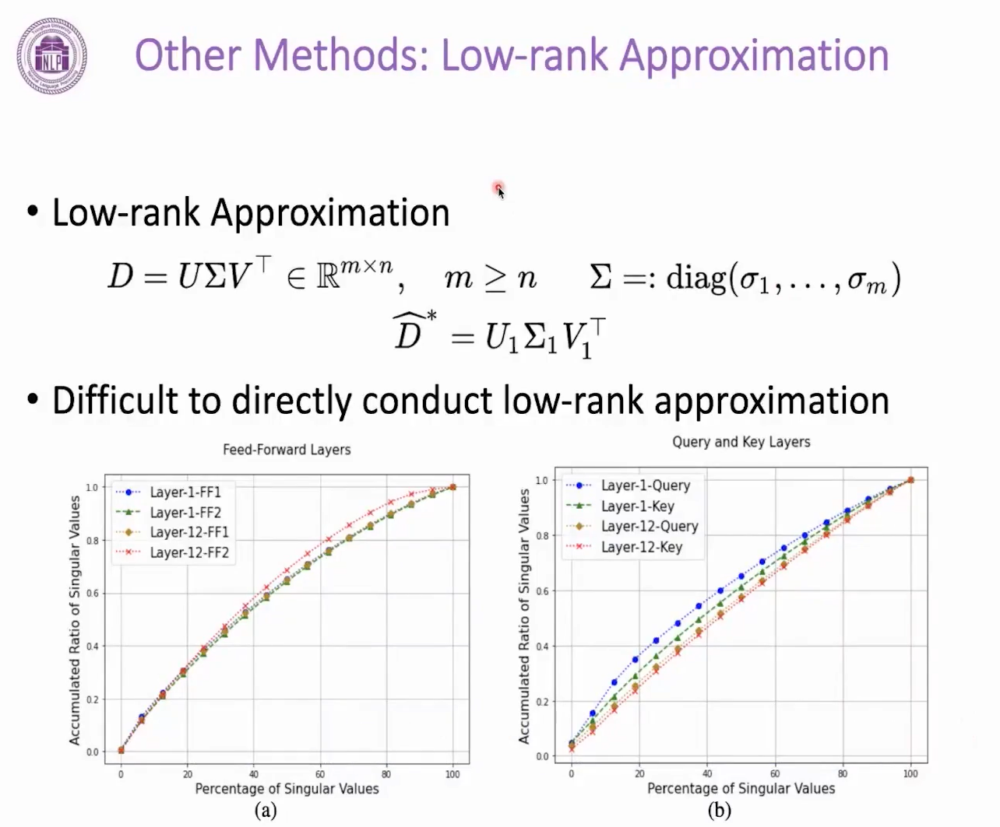

后面发现对于模型而言不适合做这种Low-rank Approximation方法，但是对于特定任务的输入数据是符合低秩的特点，对应提出一个方法如下，对输入数据进行低秩分解，下面U,V先把x映射到低维，比如从d-》d/2-》d维度，接着可以做矩阵结合律，然后把W,U维度降到d/2，能够减少中间的计算量

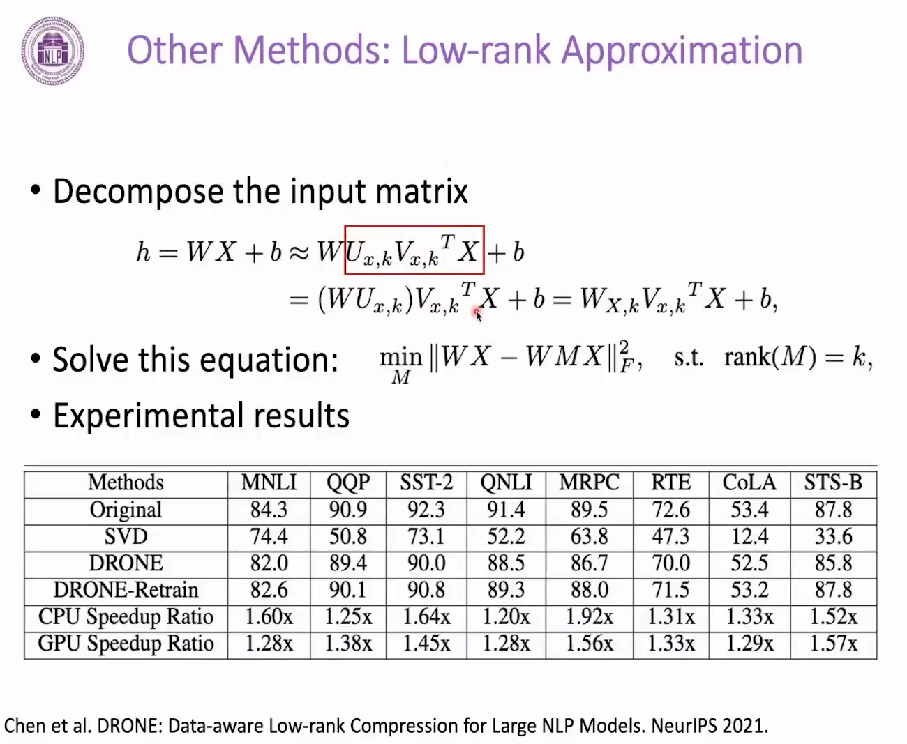

### Architecture Search(结构搜索)

神经网络结构搜索的方法，就是通过去做一个配置，神经网络的参数，非线性层函数是什么，这个网络维度是什么等。通过实验和算法迭代出了一个比较好的神经网络架构，能够在同等效果下具有更高的计算效率和更好的结构。该方法对Transformer模型进行了改进，结合了卷积层和激活函数等操作，获得了比标准Transformer模型更好的效果。同时，该方法在较少的训练时间下能够学习到比较好的效果，具有更高效的能力。

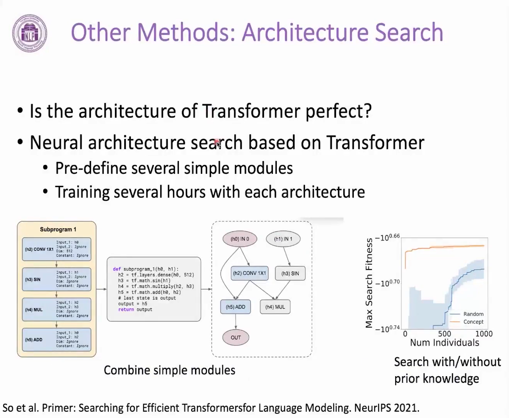

神经网络架构通过搜索发现在transformer中，在QKV后面增加卷积操作，在RELU后面增加一个平方操作效果会好

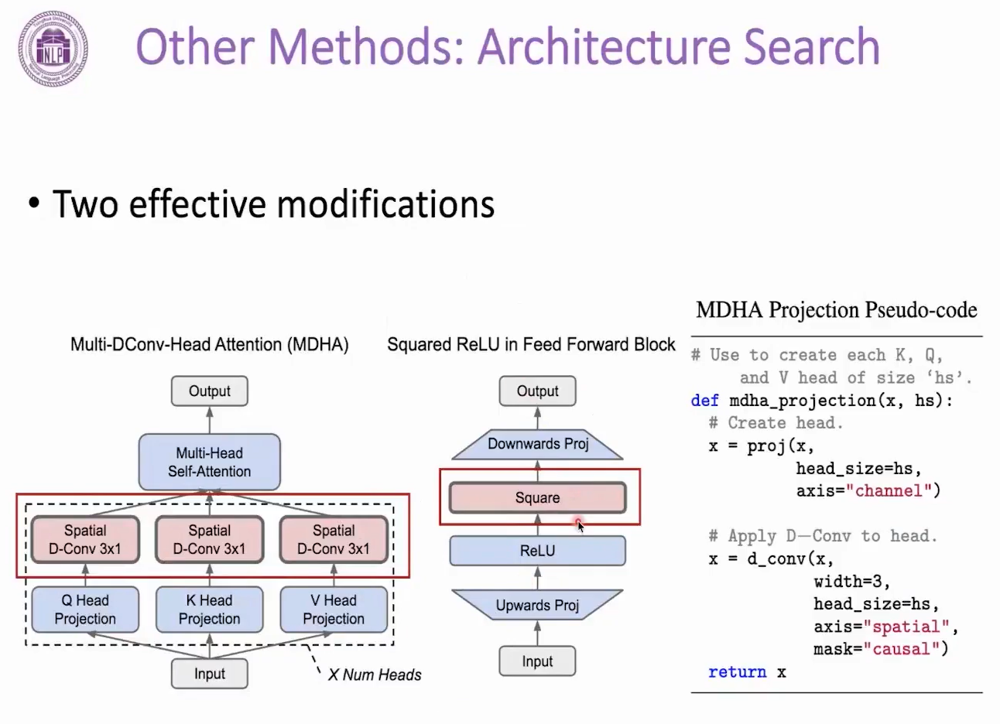

## BMCook

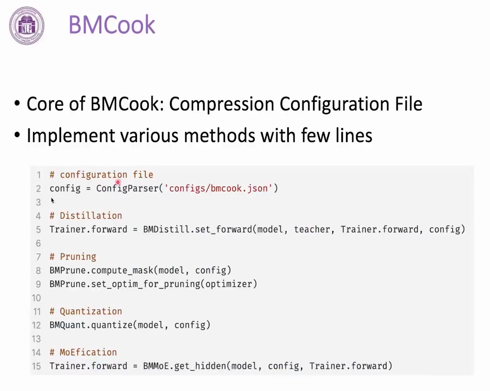

配置文件编写

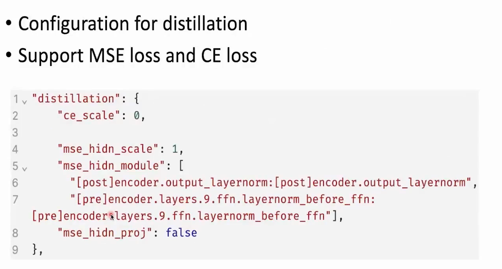

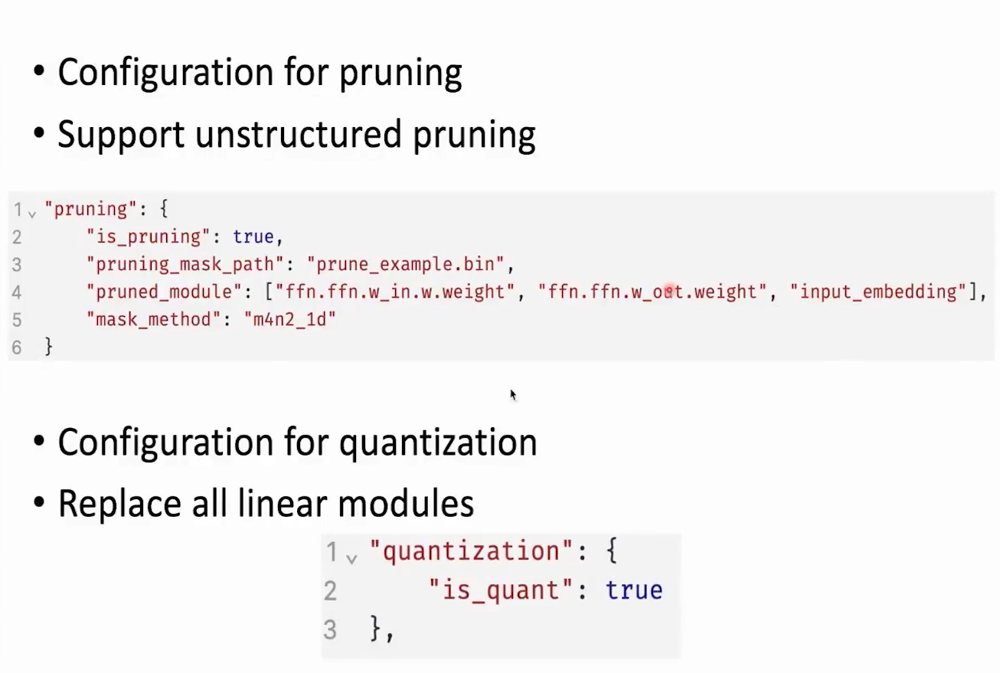

## BMInf

BMInf是OpenBMB发布的第一个工具包。

主要的目的是能让你在便宜的GPU，比如GTX 1060上，也能运行起来大模型。

### 深入理解Transformer

我们来深入分析模型，看如何优化模型。

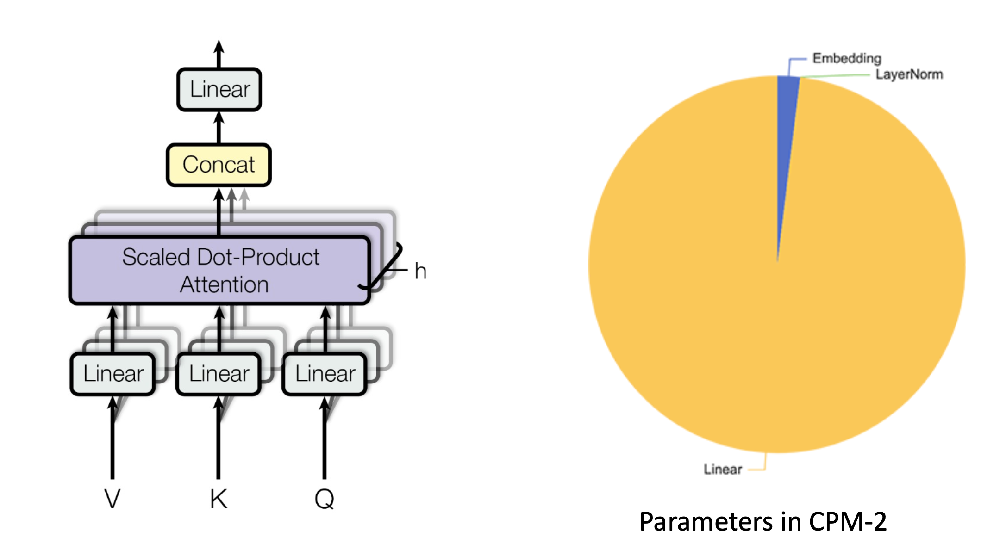

Transformer模型中主要的就是**线性层**，比如对于CMP-2中90%的参数都是在线性层中。线性层实际上是矩阵乘法的。

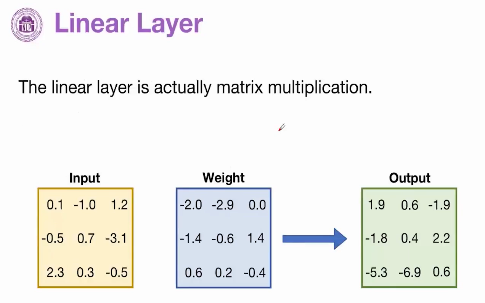

所以我们先来针对线性层。由于目前矩阵计算已经在工程中优化差不多了。所以我们在允许一些精度损失的前提下，来优化线性层的运算效率。

目前有三种常见的浮点数的运算精度

- 64位的FP64 double
- FP32 单精度
- FP16 半精度

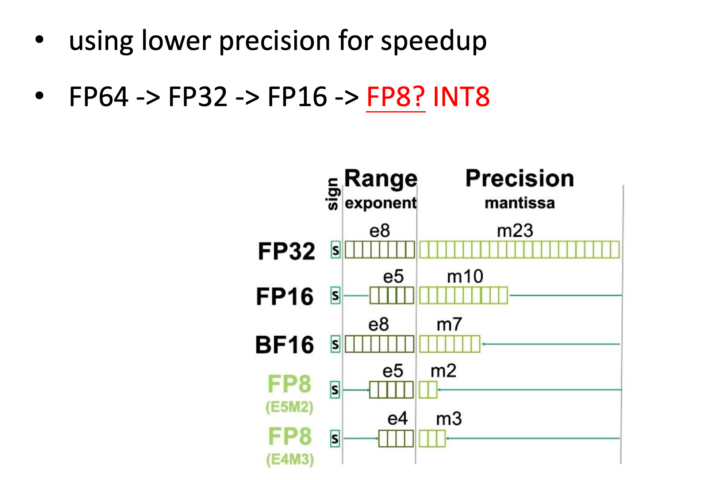

目前常用的是FP32，但目前模型比较大，为了降低开销，逐渐在训练过程中引入FP16。如果进一步采用FP8，基本上只有一位有效数字，大概就是说能表示比如1.0 1.25 1.5 1.75

为了进一步降低开销，有没有可能使用INT8来表示参数。

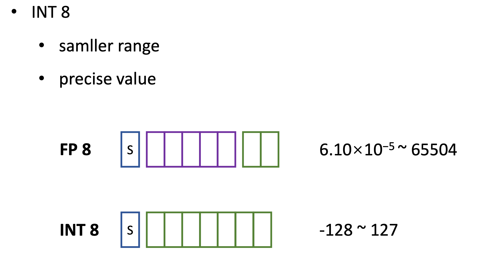

INT8比FP8表示范围小很多，但是它表示的值是绝对精确的，整数之间互相运算不会存在小的误差。

### 量化

- 使用整数模拟浮点矩阵乘法
- 找到矩阵中的最大值，缩放到127进行量化
- 乘以去量化的缩放因子

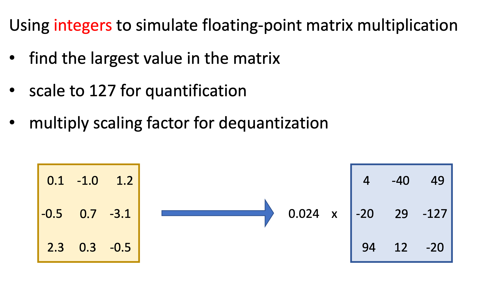

使用整数来模拟浮点矩阵运算。

首先找到矩阵里面绝对值最大的那个数，然后缩放到127/-127，得到缩放系数(相当于直接除以127)。然后把浮点矩阵中所有元素除以该缩放系数，每个元素值经过四舍五入就能得到新的整数。这样可以把浮点数矩阵拆成缩放系数和一个整数矩阵。

就让能让矩阵中值从FP16变成了INT8。

在完成了矩阵量化之后，如果用INT8来模拟矩阵乘法呢？

针对线性层来说，分别对它的输入和权重进行量化，就可以得到两个INT8的矩阵和对应的缩放系数。接着在这两个INT8的矩阵中进行矩阵乘法。这会得到一个整数结果，但该结果INT8是存不下来的，此时会用INT32来存储。同时针对缩放系数进行一个标量惩罚，得到一个新的缩放系数，然后把整数结果乘上这个新缩放系数还原成浮点数。它通常在一些尺寸比较小的时候会表现得比较好

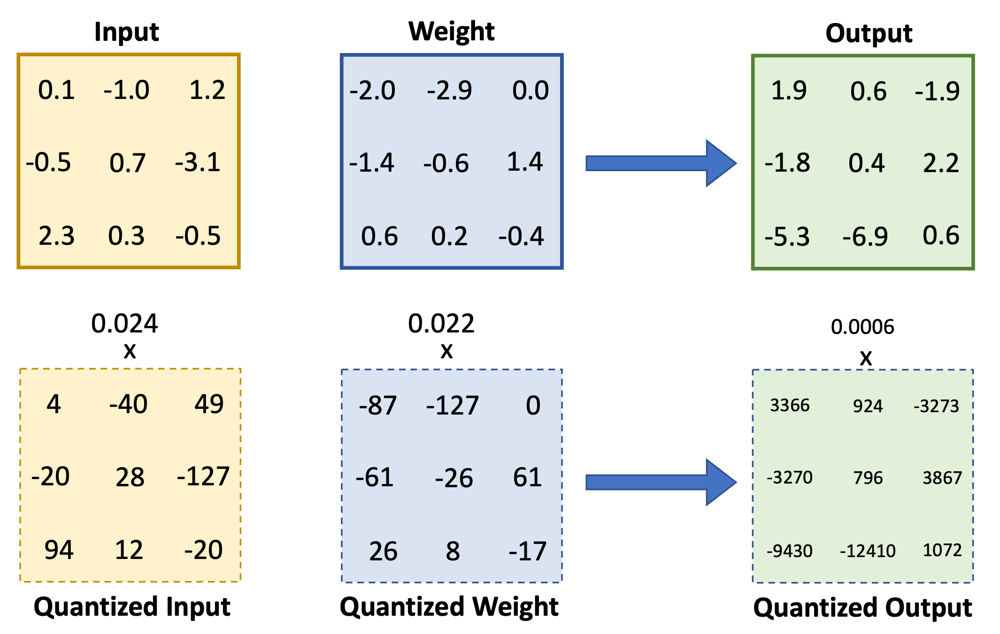

但是该方法直接应用在Transformer上效果不理想。因为里面的矩阵比较大，如果对整个矩阵只使用一个缩放因子，相当于原本矩阵中有好几百万的值现在就变成了只有256个值（-127~127），这样的话整个矩阵的表达能为就会有一个直线的下降。所以这种量化方法不行

#### 行矩阵量化

此时我们需要更加精细的量化方法。我们可以将量化的粒度从原来的整个矩阵变成一行或一列，计算单行/列的缩放系数。这种方法能在Transformer上达到不错的效果。

- 计算每行/列的缩放因子
- 将每行/每列缩放到-127~127

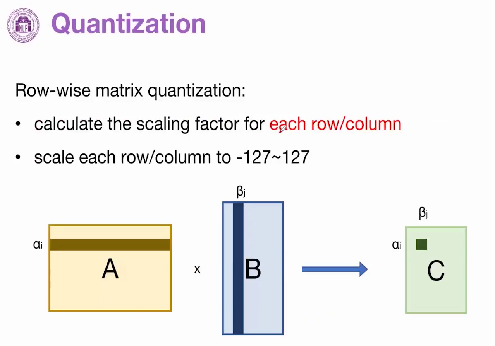

因为是做矩阵乘法，所以是对A的行做行矩阵量化，对B的列做矩阵量化。那么在计算出C，刚好那个元素对应A的行的缩放因子与B的列的缩放因子，再与结果中的int值。刚好能够还原回来。

通过行列矩阵缩放因子的方法，发现这个在transformer中效果不错。如果矩阵更大，可以采用矩阵分解成子矩阵的方式乘法

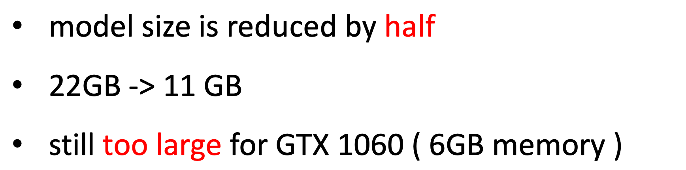

使用这种方法可以使模型大小优化一半(11G)，但还是不能放到GTX 1060(6G)上。

### 内存分配

借鉴操作系统中虚拟内存机制。

> 并非所有参数都需要放置在GPU上。
>
> - 将短时间内不会使用的参数移动到CPU。
> - 使用前从CPU加载参数。
> - 计算和加载并行进行。

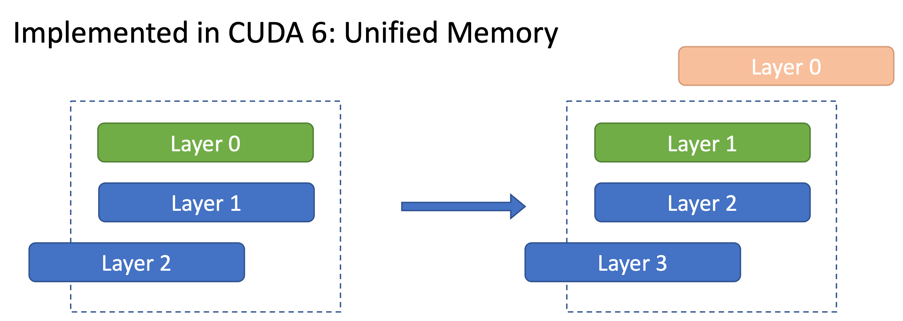

我们在进行一个百亿模型推理的时候，实际上并不会同时用到这11G的参数，每次只用一部分。比如每次只计算一层，实际上只用到了这一层的参数。那些暂时不用计算的层没必要一直放到GPU上。

这种方法在CUD6中被实现了。

如果我们能在计算一层的同时去加载另一层参数，那么理论上只需要两层，就可以让整个模型完美地运行起来。比如我们在计算第0层的时候，同时加载第1层。这样第0层计算完之后，就可以释放第0层所占的空间，去加载第1层的参数进行计算，同时加载第2层参数。

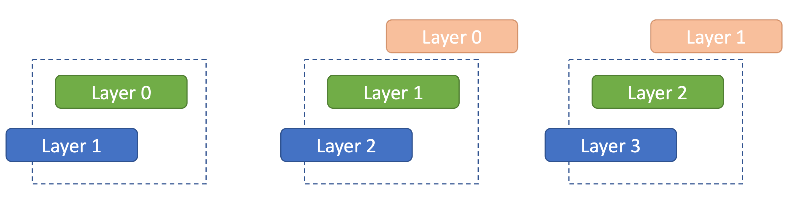

但实际操作上遇到了一些问题，

> 事实上，加载要比计算慢得多。
>
> - 如果我们只在GPU上放置两层，这需要很长时间。
> - 在GPU上放置尽可能多的层。
>
> 假设GPU上最多可以放置n个层。
>
> - n-2层固定在GPU上，不会移动到CPU。
> - 2层用于调度。一层用于计算，一层用于读取新的一层参数

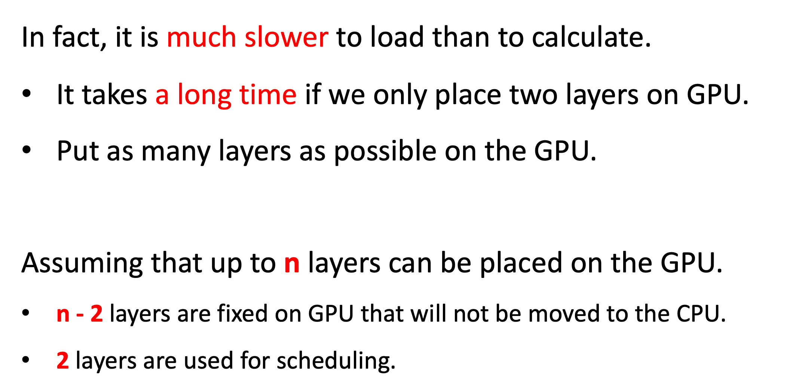

实际上传输一层参数的时间远远超过了计算该层参数所用的时间。如果只放两层参数的话，虽然占用空间小，但花费的时间反而特别长。那我们是否可以多放几层，来减少加载参数所用的开销。 假设一块GPU上能放n层参数，那么我们可以固定n-2层在GPU上，多余的2层空间用于调度。 那现在的问题是，哪些层固定？

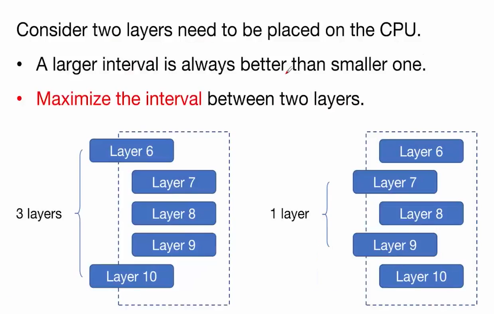

假如我们两层需要从CPU加载（也就是不固定），左边的方案是固定7,8,9，调度6和10。 右边是固定6,8,10，调度7个9。 这两种方法的区别在于，要加载的层之间的间隔，左边是间隔了3层，右边是间隔1层。 那么左边的方案肯定不会差于右边的，因为我们在加载完第6层之后，中间留下第7、8、9层计算的时间来加载第10层。即留给加载第10层的时间更长。 所以我们要尽量扩大需要加载的两层之间的间隔。

### 使用介绍 

在实现了上面的技术(BMInf包)之后，我们终于可以把百亿参数模型放到GTX1060上运行起来。

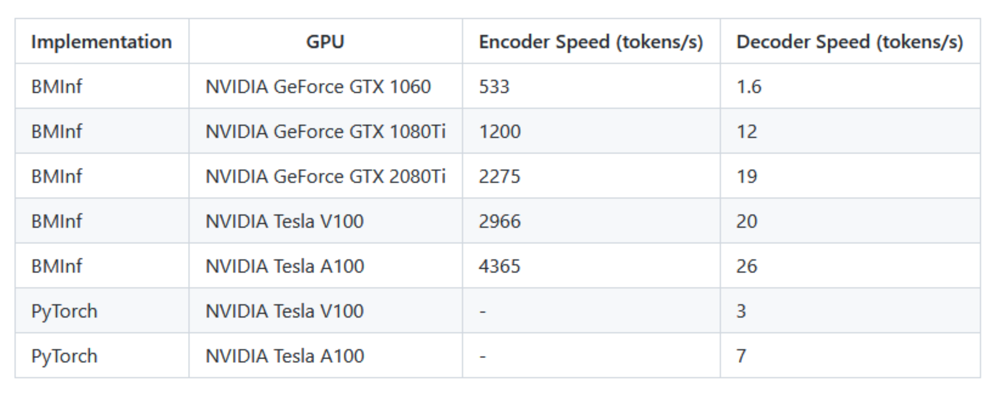

那么这么好的工具包怎么使用呢？

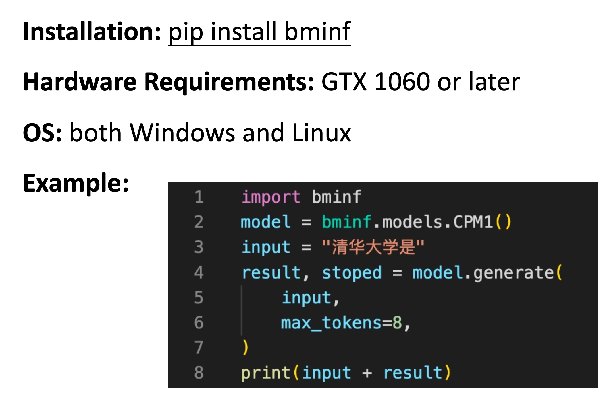
