# Multi-grained Spatio-Temporal Features Perceived Network for Event-based Lip-Reading

> 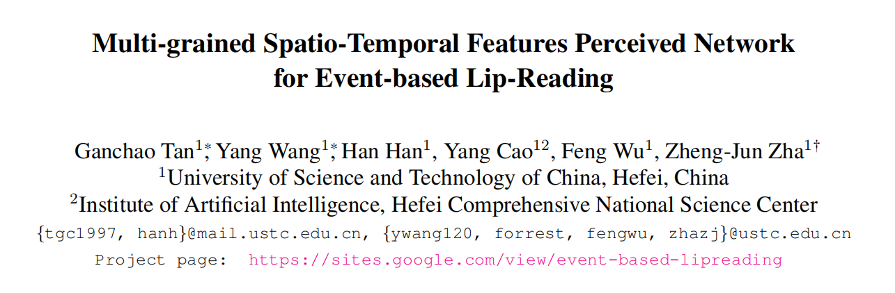
>
> 自动唇读(ALR)是一种利用说话人唇动的视觉信息来识别单词的技术。在本工作中，我们介绍了一种新型的传感装置，即事件摄像机，来完成ALR的任务。事件摄像机具有更高的时间分辨率、较少的冗余视觉信息和更低的功耗，在ALR任务中具有比传统摄像机更大的技术和应用优势。为了从事件数据中识别单词，我们提出了一种新的多粒度时空特征感知网络(MSTP)，从微秒级时间分辨事件数据中识别细粒度的时空特征。**具体来说，设计了一种多分支网络结构，通过不同的帧速率学习不同粒度的时空特征。低帧率下的分支可以感知空间完整但时间粗糙的特征。而高帧率下的分支可以感知空间粗化和时间细化的特征。并设计了消息流模块，对不同分支的特征进行整合，使其感知到更具有判别性的时空特征。**此外，我们提出了第一个由事件相机捕获的基于事件的唇读数据集(DVS-Lip)。实验结果表明，与基于事件的动作识别模型和基于视频的唇读模型相比，该模型具有一定的优越性。

## 1. 简介

本文介绍了一种新型的光学传感器——事件相机[18]，以解决自动读唇问题。活动摄像机是受生物启发的光学传感器。与以固定速率捕捉图像的传统相机不同，事件相机在微秒级异步捕捉每像素亮度变化。对于需要细粒度时空特征感知的ALR任务，事件相机在技术和应用方面具有显著的优势:1)事件相机的高时间分辨率使其能够记录更细粒度的运动;2)由于只记录了场景的亮度变化，它们的输出不包含太多多余的视觉信息;3)它们是低功耗的，并且可以在具有挑战性的照明条件下工作，这在现实世界的应用中是必不可少的。

要正确地从事件流中识别单词，必须从事件流中感知细粒度的时空特征。目前已有一些基于事件的动作识别方法[3,6,38,42-44]。基于点云的[42]方法和基于图的方法[6,44]分别将事件数据视为点云和图节点。但是，在从原始事件数据到点云或图节点的转换过程中，将丢弃事件数据中包含的细粒度时空信息。基于snn的方法[3,38]使用尖峰神经网络对输入事件流进行异步处理，但由于没有有效的反向传播算法，这些方法难以训练。现有的基于cnn的方法[19,43]将异步事件数据转换为固定速率的类帧表示，并将其输入标准的深度神经网络。根据事件框架的时间分辨率，它们还会丢失不同程度的空间或时间信息。综上所述，现有的基于事件的动作识别方法并不适用于ALR任务，需要从事件数据中感知细粒度的时空特征。

在这项工作中，我们选择将事件数据转换为多粒度的事件帧。如图1所示，低速率的事件帧包含完整的空间特征，但由于时间压缩程度较高，时间特征较为粗糙;而高速率的事件帧包含精细的时间特征，但由于每个事件帧由少量事件组成，空间特征较为不完整。**为了充分利用事件数据中丰富的时空信息，提出了一种以多粒度事件帧为输入的多粒度时空特征感知网络(MSTP)。该模型包含两个分支，其中第一个分支以低速率的事件帧作为输入，使得模型能够感知完整的空间结构信息;第二分支采用高速率的事件帧作为输入，使得模型能够感知到精细的时间特征。此外，我们设计了消息流模块(message flow module, MFM)来合并不同分支学习到的多粒度时空特征，从而感知到更有区别的时空特征。**

在这项工作中，我们选择将事件数据转换为多粒度的事件帧。如图1所示，低速率的事件帧包含完整的空间特征，但由于时间压缩程度较高，时间特征较为粗糙;而高速率的事件帧包含精细的时间特征，但由于每个事件帧由少量事件组成，空间特征较为不完整。为了充分利用事件数据中丰富的时空信息，提出了一种以多粒度事件帧为输入的多粒度时空特征感知网络(MSTP)。该模型包含两个分支，其中第一个分支以低速率的事件帧作为输入，使得模型能够感知完整的空间结构信息;第二分支采用高速率的事件帧作为输入，使得模型能够感知到精细的时间特征。此外，我们设计了消息流模块(message flow module, MFM)来合并不同分支学习到的多粒度时空特征，从而感知到更有区别的时空特征。

> 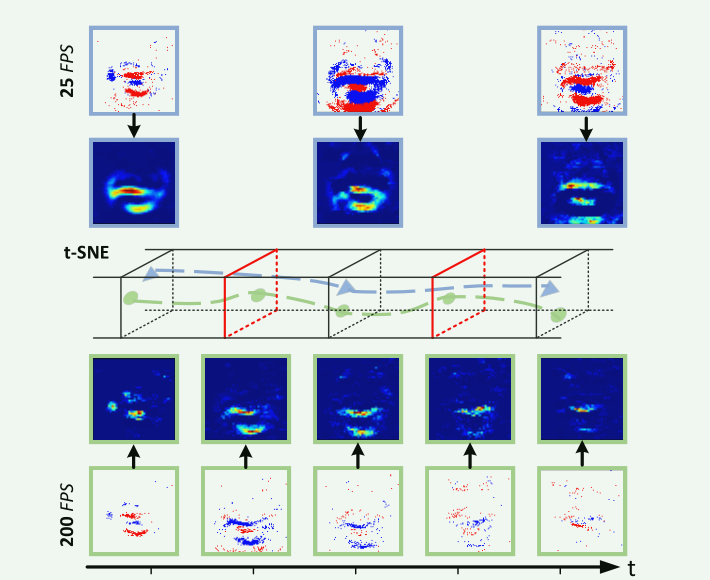
>
> 图1。对不同时间分辨率(分别为25FPS和200FPS)的事件帧及其通过t-SNE[41]降维后的特征图和特征点进行可视化。低速率事件帧包含完整的空间特征但粗糙的时间特征，而高速率事件帧包含精细的时间特征但不完整的空间特征。

由于缺乏可用的基于事件的唇读数据集，我们使用事件相机DAVIS346收集了第一个基于事件的唇读数据集(称为DVS-Lip)。DVS-Lip总共包含19,871个样本，如图3所示。为了探索事件相机在捕捉细粒度运动演化信息方面的优势，我们将DVS-Lip数据集的词汇分为两部分。第一部分由25对从LRW数据集[11]中选择的视觉上相似的单词组成，第二部分由另外50个从LRW数据集词汇表中随机选择的单词组成。更多细节可以在4.1节中找到。

通过在DVS-Lip数据集上进行大量实验，验证了所提出的MSTP算法的有效性。定量结果表明:1)MSTP在常见词汇和视觉相似词汇的识别上均优于现有的基于事件的动作识别模型和基于视频的唇读模型;2)所提出的消息流模块在视觉相似词识别上有更显著的改进，有利于细粒度时空特征的感知。

我们工作的主要贡献可以概括为以下四个方面:

•据我们所知，这是第一个基于事件的自动读唇的研究。在此基础上，提出了一种基于事件的自动读唇框架MSTP。

•我们设计了一个消息流模块来合并多粒度时空特征，以便更有区别地感知特征。

•考虑到缺乏相关的基准，我们收集了第一个基于事件的唇读数据集(DVSLip)，将向社区提供。

•在DVS-Lip数据集上进行的大量实验表明，该方法优于目前最先进的基于事件和视频的方法。

## 2. 相关工作

在本节中，我们首先研究现有的唇读数据集和相关的唇读方法。然后介绍了事件摄像机和现有的基于事件的动作识别方法。

**唇读数据集。**根据识别对象的不同，现有的唇读数据集可以分为字母识别数据集[13,27]、数字识别数据集[4,28,31]、单词识别数据集[11,14,48]和句子识别数据集[1,10,12,37]。所有这些数据集都是由传统相机记录的。在这篇论文中，我们主要研究如何利用事件相机记录的数据集进行文字识别。

**唇读法**。最先进的唇读方法是基于深度学习技术[5,8,10,11,23,26,36,37]。他们利用端到端深度神经网络来提取视觉特征，然后进行单词分类。[11]提出了一个多塔架构，他们首先用2D卷积提取每帧的浅层视觉特征，然后连接所有特征。最后，利用几个三维卷积层提取视频的全局视觉特征。[17,26]采用卷积神经网络(CNN)作为视觉特征提取器，然后利用循环神经网络(RNN)[17]或时间卷积网络(TCN)[26]来建模长期依赖关系。

**活动摄像机。**事件相机是受神经形态学启发的动态视觉传感器(DVS)[18]，不同于传统相机以固定速率捕捉图像，事件相机在微秒级异步捕捉每像素亮度变化。与传统相机相比，事件相机具有具有吸引力的优点:高时间分辨率(µs级)、低功耗(10mW级)、高动态范围(140 dB)和高像素带宽(kHz级)。我们用来采集数据的事件相机类型是DAVIS346，它可以同时输出事件流和强度图像。

**基于事件的动作识别方法。**事件相机的应用范围非常广泛[3,21,30,33,39,43]，其中与我们最相关的是手势识别[3]和步态识别[43]。与唇读一样，它们也是一种动作识别[7,24,45,47]任务。基于点云的方法[42]将事件视为时空事件云，然后利用PointNet++[32]作为特征提取器提取事件特征。基于图的方法[6,44]将事件转化为一组连通节点，然后利用gnn提取事件的时空特征。基于snn的方法[3,38]使用尖峰神经网络对输入事件流进行异步处理，但由于没有有效的反向传播算法，这些方法难以训练。基于cnn的方法[19,43]将异步事件转换成固定速率的帧，并将其送入标准的深度神经网络。

## 3.方法

在本节中，我们首先简要描述3.1节中事件相机的输出格式。然后，我们在第3.2节中引入了提出的多粒度时空特征感知网络(MSTP)。

### 3.1.事件数据

事件相机在每个像素独立输出异步事件数据，当(x, y)处的日志亮度变化达到对比度阈值时，在特定像素u = (x, y)处触发一个事件，即:

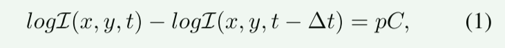

式中，I为场景亮度，p∈{−1,1}为亮度变化的极性，C为对比度阈值，∆t为自(x, y)处上次触发事件以来经过的时间。在给定时间[T0, T1]内，事件相机的输出可以表示为:

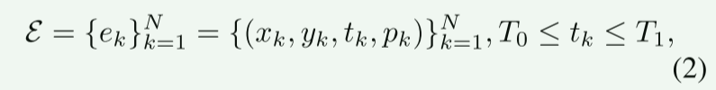

它们是时空维度上的分散点。

### 3.2.框架

如图2所示，我们提出了一种新的基于事件的唇读框架MSTP。我们的框架包含三个组件:1)原始事件流和类帧表示之间的投影;2)具有不同分支之间消息流模块(MFM)的多分支网络;3)将视觉特征解码为文字的序列模型。

#### 3.2.1事件表示

基于事件的任务最具挑战性的问题之一是如何设计有效的事件表示。如第1节所分析的，将事件数据处理为点云或图节点，或直接使用SNN对ALR进行处理，都不是最优的。在本文中，我们选择将异步事件数据转换为同步类帧表示。

在这里，我们采用体素网格[49]来表示事件数据，即每个事件将其极性 p 分布到两个最近的时空体素上。给定一组 N 个输入事件 $E = \{(x_k, y_k, t_k, p_k)\}^N_{k=1}$ 和时间分区 T，体素网格方法首先将时间戳缩放到 [0, T-1] 范围内，然后生成维数为 T ×H ×W 的事件帧 V，如下所示：

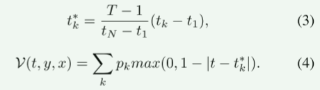

与之前的研究[33, 49]在体素网格表示中使用一个固定的时间分区不同，我们使用多个时间分区来更好地保留事件流的时空信息。根据公式 3 和公式 4，我们将输入事件  $E = \{(x_k, y_k, t_k, p_k)\}^N_{k=1}$ 转换为低速率事件帧 $V^{low}$ 和高速率事件帧 $V^{high}$，前者的时间分区设置为  $V^{low}$ ，后者的时间分区设置为  $V^{high}$。

#### 3.2.2多分支网络

> 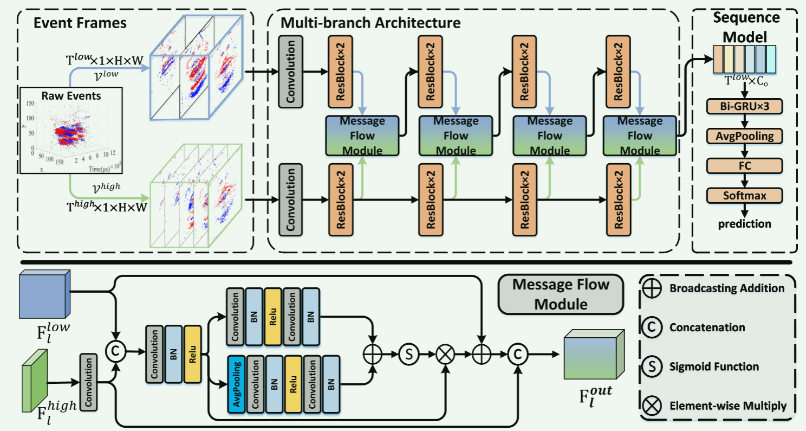
>
> 图2。(上)我们提出的多粒度时空特征感知网络(MSTP)的架构。MSTP由三个组件组成:1)从异步原始事件到多粒度同步事件帧的投影;2)具有不同分支间消息流模块的多分支网络，能够从事件数据中感知完整的空间特征和精细的时间特征;3)将视觉特征解码为文字的序列模型。(下)消息流模块(MFM)。MFM利用不同分支学习到的特征获得一个注意权值图来合并多粒度时空特征。

不同时间分辨率的事件帧属于同一模态，但包含不同粒度的时空信息。高速率事件帧包含精细的时间信息但不完全的空间信息，而低速率事件帧则相反，如图1所示。为了充分利用事件数据中丰富的时空信息，提出了一个具有不同时间分辨率的事件帧作为输入的多分支网络，该网络具有不同分支之间的消息流模块。这种网络结构允许模型同时感知完整的空间特征和细粒度的时间特征。

> 

其中，模型的**每个分支由一个3D卷积层和几个残差块[20]组成**。为了维护细粒度的时间特性，我们保留了每个分支的时间维度。**它们的不同之处在于卷积层中的信道数量是不同的**。由于高时间维会导致计算量的显著增加，我们**在高速率分支中使用较小的通道来减少计算量**。如[15]所研究的，**信道容量较低的卷积层可以削弱空间建模能力，同时增强时间建模能力，显著减少计算量**。在我们的实现中，低速率分支的卷积层中的信道数是高速率分支的4倍。

该模型的不同分支侧重于学习不同粒度的时空特征。为了感知唇读更有区别的时空特征，我们设计了一个消息流模块来实现不同分支之间的消息流，如图2底部所示。设$\{F^{low}_l∈R^{T^{low}×C^{low}_l ×H_l×W_l}\}^L_{l=1}$和$\{F^{high}_l∈R^{T^{high}×C^{high}_l ×H_l×W_l}\}^L_{l=1}$分别为低速率分支和高速率分支的输出特征，其中l为获得特征的层，L为总层数，$T^{low}$和$T^{high}$分别表示各分支的时间桶，$C^{low}_l$和$C^{high}_l$表示每个分支第l层的通道数，$H_l$和$W_l$表示第l层输出特征的高度和宽度。在第l层，我们首先通过一个时间卷积层沿着时间维向下采样$F^{high}_l$。然后将两个分支的特征串接，使用卷积层进行融合，融合后的特征$F^{fuse}_l$由以下方法得到:

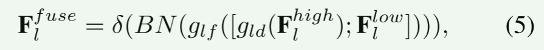

其中，$g_∗$ 为卷积层和the same blow，δ 为 Relu 函数，BN 为批量归一化层，[；] 表示连接操作。

来自高速率分支的特征包含更精细的时间信息，可以引导低速率分支的学习重点关注特征的关键部分。为了合并不同分支学习到的特征，我们使用融合特征 $F^{fuse}_l $来计算两个注意力上下文。第一个注意力上下文是局部的：

其中，$A^{tchw}_l ∈ R^{T^{low}×C^f_l×H_l×W_l} $是局部注意力上下文，$C^f_l $是$ F^{fuse}_l $的通道数。

第二种注意力上下文是按时间通道计算的，即在计算注意力上下文之前，先在$F^{fuse}_l $中沿空间维度进行全局平均池化：

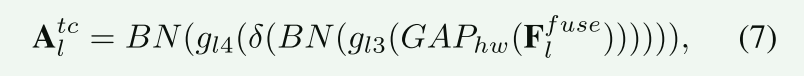

其中$A^{tc}_l∈R^{T^{low}×C^f_l ×1×1}$为全局注意力上下文，$GAP_{hw}$为沿空间维度的全局平均池化。

那么注意力图的计算方法是:

σ为Sigmoid函数，$ \bigoplus$为广播加法。

基于注意的增强特征$ \tilde F_l$的计算方法为:

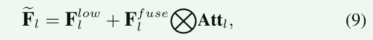

其中$\bigotimes$表示逐元素乘法。

为了保持原始信息不来自高速率分支，将$F^{high}_l$的下采样特征与$ \tilde F_l$连接作为消息流模块的输出特征:

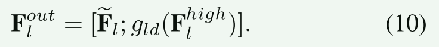

#### 3.2.3序列模型

与以前的多分支网络不同[15,16]，我们采用序列模型作为框架的后端。我们使用的序列模型是双向门循环单元[9]，它以多支路网络的输出，即$F^{out}_L∈R^{T^{low}×C_o}$为输入。$F^{out} _L$被视为一个长度为$T^{low}$的序列，特征在每个时间步的维数为$C_o$。设$P∈R^{voc\_size}$为词汇表中每个单词的输出概率，其中voc_size为词汇表的大小。P是由

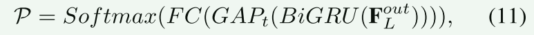

其中BiGRU为三层双向门循环单元，$GAP_t$为BiGRU输出特征沿时间维的全局平均池化，FC为将最终视觉特征转换为概率logit的全连接层。最后，由Softmax函数计算P。

## 4. Experiments

### 4.1.数据集

由于缺乏可用的基于事件的唇读数据集，我们利用事件相机收集了第一个基于事件的唇读数据集DVS-Lip。我们使用的事件相机类型是DAVIS346，它可以同时输出事件流和强度图像，空间分辨率为346×260，没有视点差异。为了探索事件相机在捕捉细粒度运动演化信息方面的优势，我们将DVS-Lip数据集的词汇分为两部分，第一部分由视觉上相似的词对组成，第二部分由常见的词组成。词汇表的第一部分包含从LRW数据集[11]的词汇表(总共500个单词)中选择的25个最容易混淆的单词对。有关词汇第一部分中包含的更详细的词汇选择，请参阅补充材料。对于词汇表的第二部分，我们从LRW数据集的词汇表中随机选择另外50个单词。结合这两部分，DVS-Lip数据集的词汇表总共包含100个单词。我们已经在补充材料中列出了词汇表中包含的所有单词

我们招募了 40 名志愿者参与室内场景的数据集记录，男女各 20 人。我们首先构建了 5 个序列，每个序列包含词汇表中的所有单词。为了避免志愿者对同一单词的朗读过于相似，每个序列都被随机打乱。因此，每个词在每个序列中的前后词都是不同的。然后，志愿者被要求坐在事件摄像机前，将五个单词序列各读一遍。如果某个单词发音错误，我们会要求志愿者重读该序列，直到没有错误为止。我们同时录制与这些单词相对应的音频，用于将每个序列的数据分割成单词级样本。我们使用蒙特利尔强制对齐器*，根据相应的音频获取每个单词的开始和结束时间。为了与基于视频的方法进行比较，我们保留了事件流和事件摄像机输出的强度图像（25FPS）。我们使用人脸检测工具† 来获取人脸和嘴巴的位置，然后提取以嘴巴为中心的 128×128 像素裁剪。

共记录了40名志愿者的200个单词序列，每个序列包含100个单词。但是，由于一小部分事件数据文件损坏，我们最终获得了19871个有效单词样本，如图3所示。我们使用30名志愿者(包括15名男性和15名女性的14896个样本)的数据进行培训，其余的(包括5名男性和5名女性的4975个样本)进行评估。因此，训练集和测试集对应的说话人不重叠。训练集和测试集也可以根据单词的词汇来源分为两部分。因此，有7,441个样本属于第一部分，7,455个样本属于训练集的第二部分，有2,493个样本属于第一部分，有2,482个样本属于测试集的第二部分。表1显示了我们的数据集和之前的单词级唇读数据集的比较。此外，我们计算单词的持续时间和每个单词中包含的事件数量，如图4所示。

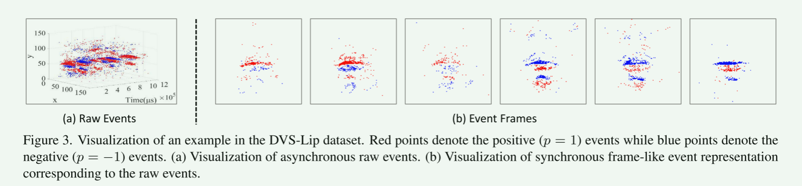

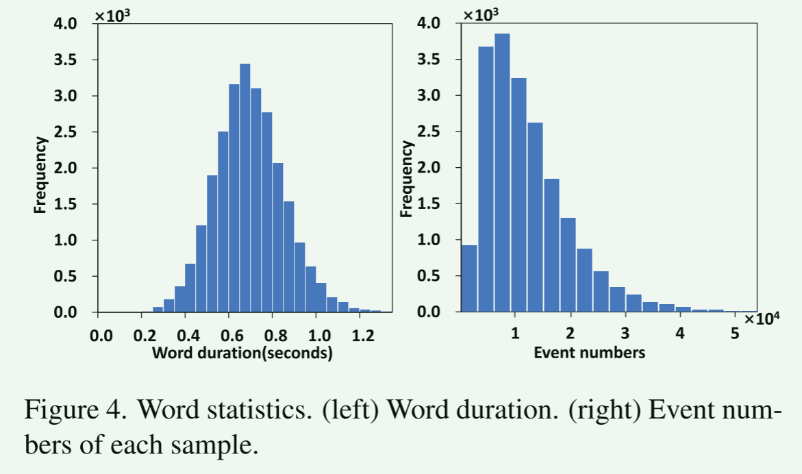

本工作的所有实验都是在我们的DVS-Lip数据集上进行的。我们提出的模型的输入空间维数为88×88，所以我们首先对原始数据进行尺寸96×96的中心裁剪。然后，我们将事件帧随机裁剪到88×88，并以0.5的概率水平随机翻转它们，以便在训练阶段进行数据辩论。而对于测试，我们将测试数据集中裁剪到88×88。对于基于视频的方法的训练和评估，**如果每个视频剪辑包含的帧数大于30帧，我们将其中的30帧线性采样。否则，我们使用零操作将它们填充为30的长度。**根据图4，我们将每个视频的最大帧数设置为30，因为大多数视频都小于1.20秒，所有视频的帧率都是25FPS。为了与视频帧数保持一致，我们将低速率分支的输入事件帧的时间bin设置为30。因此，我们的模型的低速率分支输入具有与基于视频的方法相同的时间分辨率。

我们使用 PyTorch‡ 框架来实现本研究中使用的所有方法。我们的模型由 Adam Optimizer [22] 以标准设置进行优化。我们使用余弦退火调度器[25]来控制训练过程中的学习率，其中初始学习率设置为 3e-4，最小学习率设置为 5e-6。我们将批量大小设为 32，并对模型进行了 80 次训练。

### 4.3.实验结果

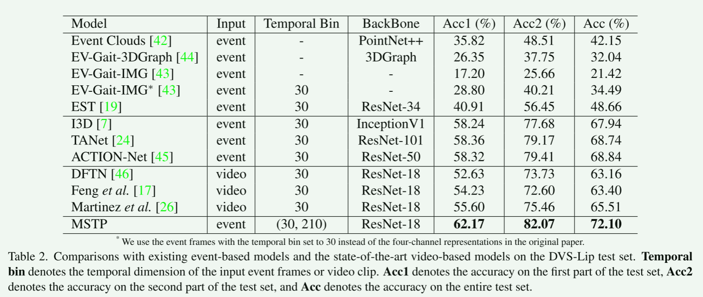

#### 4.3.2消融研究

为了验证所提模型各部分的有效性，并研究时间仓对所提模型的影响，我们进行了以下两组实验。

如表 3 所示，我们将我们的 MSTP 与一组不同设置的消融模型进行了比较： 1) 低速率分支：仅使用建议模型中的低速率分支；2) 高速率分支：仅使用建议模型中的高速率分支；3) MSTP（w/o MFM）：摒弃信息流模块，使用不同分支之间的横向连接，如之前的研究[15, 16]。

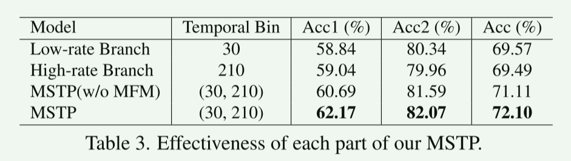

根据表 3 的结果，我们得出以下结论。首先，多分支模型优于单分支模型。这是因为多分支模型将不同时间分辨率的事件帧作为输入，从而同时学习完整的空间特征和细粒度的时间特征。其次，我们的全 MSTP 优于 MSTP（w/o MFM），这表明通过我们设计的信息流模块整合来自不同分支的特征，可以帮助模型感知更具区分性的时空特征。第三，与第二部分相比，第一部分测试集的相对改进更为显著。例如，将低速率分支与 MSTP 比较，第一部分的准确率从 58.84 提高到 62.17，提高了 3.33；而第二部分的准确率从 80.34 提高到 82.07，仅提高了 1.73。这表明我们提出的 MSTP 和信息流模块在感知细粒度时空特征方面是有效的。

此外，我们还研究了高速分支和 MSTP 的时间分段效果，如图 5 所示。我们可以观察到，随着时间分段的增加，高速分支的性能先变好后变差。这是因为当时间分隔较低时，由于时间压缩较高，事件帧会丢弃细粒度的时间信息。当时间分隔较高时，由于每个事件帧都由少量事件组成，因此事件帧的空间结构会被破坏。而当时间分区为 90 时，完整的空间信息和精细的时间信息之间的折衷效果最好。对于我们的 MSTP，当高速率分支的时间分区为 210 时，性能最佳。MSTP 的低速率分支可以提供完整的空间特征，这样随着高速率分支的时隙增加，MSTP 就能感知更精细的时空特征。图 5 的结果表明，我们的 MSTP 可以从多粒度事件帧的输入中获益，从而使我们的模型既能学习完整的空间特征，又能学习精细的时间特征。

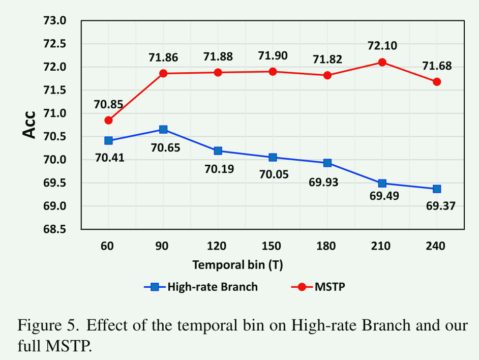

#### 4.3.3定性分析

为了进行定性分析，我们使用 DVS-Lip 测试集中的样本对 MSTP 应用了 Grad-CAM [35]。Grad-CAM 结果通过计算相对于一个独特类别的梯度，清晰地显示了视觉突出区域。图 6 显示了两个例子。在每个例子中，第一行显示的是低速率分支输入的显著性图，第二行显示的是高速率分支输入的显著性图。低速分支的时间分区为 30，高速分支的时间分区为 210。由于空间有限，我们对高速率分支的显著性地图进行了 7 倍的降采样。 同时，降采样操作可以使两个分支的显著性地图在时间上保持一致。

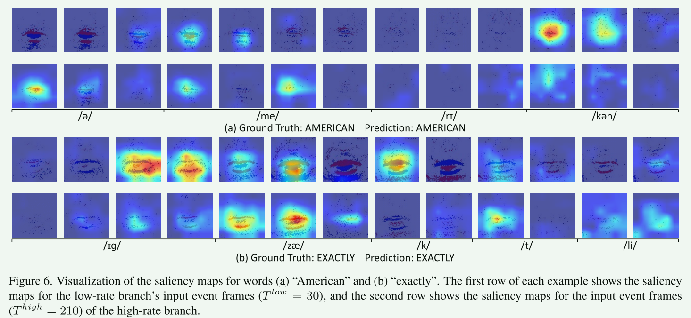

在图 6 中，我们可以看到模型已经正确地学会了关注事件帧中语音学上的重要区域，而且来自不同分支的显著性映射也相互补充。这表明我们的 MSTP 可以从不同粒度的事件帧输入中自动选择重要的时空区域进行单词识别。因此，该模型既能学习完整的空间特征，也能学习精细的时间特征。
