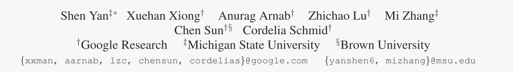
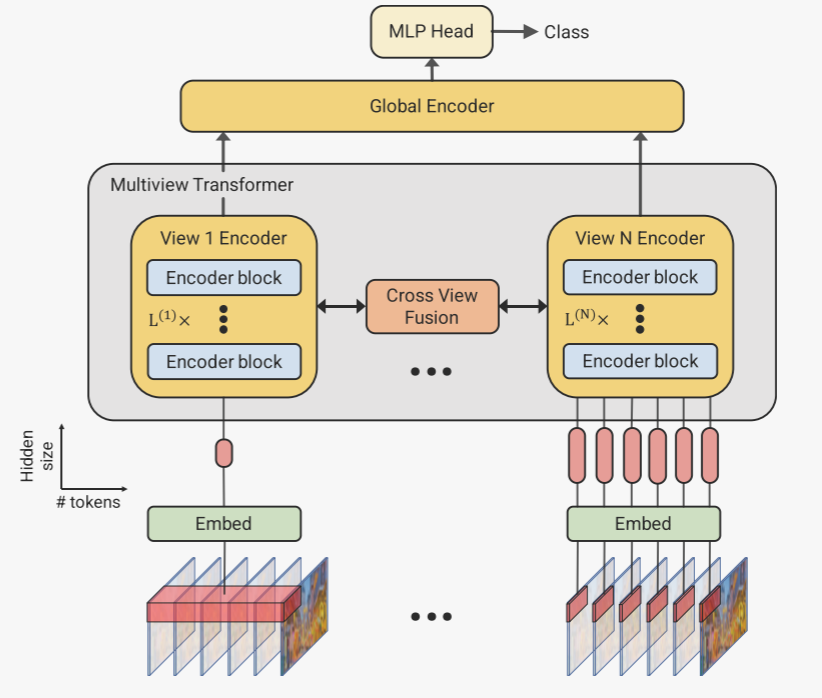
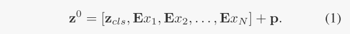
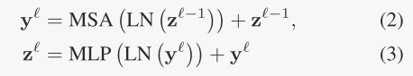
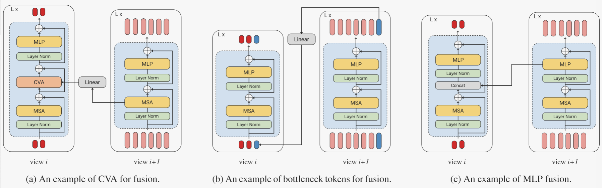
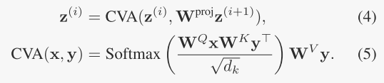
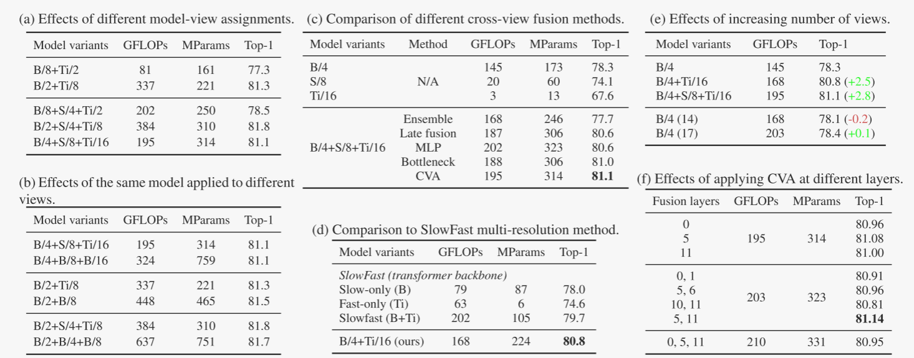

# Multiview Transformers for Video Recognition

> 视频理解需要在多个时空分辨率下进行推理——从短的细粒度运动到长时间发生的事件。尽管变压器架构最近发展了最先进的技术，但它们并没有明确地模拟不同的时空分辨率。为此，我们提出了用于视频识别(MTV)的多视图变形器。我们的模型由独立的编码器组成，以表示输入视频的不同视图，并通过横向连接融合视图间的信息。我们对我们的模型进行了彻底的消融研究，并表明MTV在各种模型尺寸的精度和计算成本方面始终优于单视图对应物。此外，我们在六个标准数据集上获得了最先进的结果，并通过大规模预训练进一步改进。代码和检查点可从https://github.com/google-research/scenic获得。

## 简介

在图像领域，多尺度处理通常使用金字塔，因为自然图像的统计数据是各向同性的（所有方向的可能性相同），并且是位移不变的[30, 66]。**为了给视频中的多尺度时间信息建模，以前的方法（如 SlowFast [23]）使用两个流处理视频，一个 "快 "流在高帧频下运行，另一个 "慢 "流在低帧频下运行，**或者使用图神经网络为长距离交互建模 [4，76]。

在创建金字塔结构时，由于池化或子采样操作，会丢失部分时空信息。例如，在构建 "慢 "流时，SlowFast [23] 对帧进行了子采样，从而丢失了时间信息。在这项工作中，我们提出了一种基于转换器（Transformers ）的简单模型，无需依赖金字塔结构或对输入进行子采样，即可捕捉多分辨率的时间上下文。我们利用输入视频的多个输入表示或 "视图 "来实现这一目的。如图 1 所示，我们从输入视频中提取多个时间跨度的标记。直观地说，从长时间段中提取的标记可以捕捉到场景的要点（如活动发生的背景），而从短片段中提取的标记则可以捕捉到细粒度的细节（如人的手势）。

我们提出了一种多视图变换器（图 1）来处理这些标记，它由专门针对每个 "视图 "的独立变换器（Transformers ）编码器组成，编码器之间有横向联系，可将不同视图的信息相互融合。我们可以使用不同大小的变压器（Transformers）编码器来处理每个视图，并发现使用较小的编码器（例如较小的隐藏大小和较少的层数）来表示视频的大视图（图 1 左），而使用较大容量的编码器来捕捉细节（图 1 右），效果会更好（在精度/计算权衡方面）。因此，这种设计与基于金字塔的方法形成了明显的对比，后者的模型复杂度随着时空分辨率的降低而增加。我们的设计得到了实验的验证，实验结果表明我们的设计比前一种方法具有明显优势。

> 
>
> 图 1. 多视图转换器概览。我们通过使用不同尺寸的小管对视频进行标记（为清晰起见，我们在此展示了两个视图），从而创建多个输入表示或输入的 "视图"。然后，这些标记由独立的编码器流进行处理，其中包括横向连接和最终的全局编码器，以融合来自不同视图的信息。请注意，每个视图的标记可能具有不同的隐藏大小，用于处理这些标记的编码器在结构上也可能有所不同。

我们提出的处理输入视频的不同“视图”的方法很简单，与之前的工作相反，[23]很容易推广到可变数量的视图。这很重要，因为我们的实验表明，随着视图数量的增加，准确性也会增加。尽管我们提出的架构根据输入视图的数量增加了网络处理的令牌数量，但我们表明，与目前的先进状态[3]相比，我们可以在从“小”到“大”的模型尺寸范围内始终实现卓越的准确性/计算权衡。我们的经验表明，这是因为与增加变压器网络的深度相比，并行处理更多的视图使我们能够获得更大的精度改进。我们对我们的设计选择进行彻底的消融研究，并在六个标准视频分类数据集上实现最先进的结果。此外，我们表明这些结果可以通过大规模的预训练进一步改善。

## 相关工作

**视频理解模型的进化。**早期的作品[34,37,72]依赖于手工制作的特征来编码运动和外观信息。随着ImageNet[16]等大型标记数据集的出现，卷积神经网络(cnn)[39]显示出其优于经典方法的优势。由于AlexNet [36]以较大优势赢得了ImageNet的挑战，cnn被迅速应用于各种视觉任务，其架构经过了许多代的改进[12,27,58,63]，后来通过神经架构搜索(Neural Architecture Search, NAS)[54,65,85]得到改进。与此同时，cnn和rnn已经迅速成为视频理解任务的事实上的骨干[32,50,57]。自从Kinetics数据集[33]发布以来，3D cnn[10,24,68]得到了普及，并且开发了许多变体[22,62,69,70,78]来提高速度和准确性。卷积操作一次只能处理一个局部邻域，因此，将变压器块[71]作为附加层插入cnn中，以改进对时空特征之间远距离相互作用的建模[74,75]。尽管在自然语言领域取得了巨大的成功[8,17,53]，但纯变压器架构直到视觉变压器(vision Transformers, ViT) 才在计算机视觉领域获得同样的普及。受ViT的启发，ViViT[3]和Timesformer[6]是最早成功采用纯变压器架构进行视频分类的两个作品，推进了3D cnn之前设定的技术水平。

**计算机视觉中的多尺度处理。**“金字塔”结构[1]是最流行的图像多尺度表示之一，在早期计算机视觉工作中一直是关键，它们的使用已经广泛应用于多个领域，包括特征描述符[1]、特征跟踪[7,46]、图像压缩[9]等。这种思路也被成功地应用于现代cnn[27,58,63]，网络的空间维度逐渐降低，而网络的“深度”逐渐增加，以编码更多语义丰富的特征。此外，该技术已被用于为下游任务产生更高分辨率的输出特征[42,43,84]。**cnn需要多尺度处理，因为卷积操作只在输入的一个子区域上操作，并且需要分层结构来捕获图像或视频的整个视图。理论上，这种层次结构对于转换器来说是不需要的，因为每个令牌都“关注”所有其他位置。在实践中，由于训练数据量有限，在变压器中应用类似的多尺度处理[11,21,44,73]来降低模型的复杂性已被证明是有效的。**

我们的模型不遵循金字塔结构，而是直接获取视频的不同视图，并将它们输入交叉视图编码器。正如我们的实验验证的那样，这种可选的多视图架构在精度/FLOP权衡方面始终优于其单视图对应物。这是因为与增加变压器网络的深度相比，并行处理更多的视图可以提高我们的精度。值得注意的是，当我们将模型容量扩展到超过10亿个参数时(例如，我们的“巨大”模型)，这种改进仍然存在，这在以前的金字塔结构变压器中没有显示出来[21,44,73]。从概念上讲，我们的方法最类似于SlowFast[23]，其中使用两流CNN来处理同一视频剪辑的两个视图(密集采样和稀疏采样帧)。我们不是以不同的帧率对输入视频进行采样，而是通过对每个视图线性投影不同大小的时空“小管”[3]来获得不同的视图。此外，我们的经验表明，当使用变压器骨干网时，我们提出的方法优于[23]。

## 视频的多视图变压器

我们首先概述视觉变压器，ViT[18]，及其扩展到视频，ViViT[3]，我们的模型是基于，在第3.1节。如图1所示，我们的模型通过从不同维度的时空小管中提取标记来构建输入视频的不同“视图”(第3.2节)。然后，这些令牌由多视图转换器（multiview transformer）处理，该转换器包含横向连接，以有效地将来自多个尺度的信息融合在一起(第3.3节)。

### 3.1. Preliminaries: ViT and ViViT

我们将输入视频表示为V∈RT×H×W×C。变压器架构[71]通过将输入转换为离散令牌来处理输入，这些令牌随后由多个变压器层依次处理。

ViT [18] 通过将图像分割成不重叠的小块并对其进行线性投影，从而从图像中提取标记。ViViT [4] 通过从输入视频 x1、x2、...xN ∈ Rt×h×w×c 中提取 N 个非重叠的时空 "管道"[3]，将这一方法扩展到视频中，其中 N = ⌊T/t ⌋ × ⌊H/h ⌋ × ⌊W/w ⌋。

然后通过线性算子E将每个管xi投影到一个令牌$z_i∈R^d$中，如$z_i = Ex_i$。然后将所有标记连接在一起形成一个序列，该序列前面加上一个可学习的类标记$z_{cls}∈R^d$[17]。由于变压器是置换不变量，因此在此序列中还加入位置嵌入$p∈R^{(N+1)×d}$。因此，这个标记化过程可以表示为

注意，**线性投影E也可以看作是一个三维卷积**，核的大小为t × h × w，步长为(t, h,w)，分别在时间、高度和宽度维度上。

然后由L层组成的转换器编码器处理令牌序列z。每一层是依次应用的，由以下操作组成:

其中MSA表示多头自注意[71]，LN为层归一化[5]，MLP由两个线性投影组成，由GeLU[28]非线性分隔。

最后，一个线性分类器$W^{out}∈R^{d×C}$将编码的分类令牌$z^l_{cls}$映射到C类中的一个。

### 3.2. Multiview tokenization

在我们的模型中，我们从输入视频中提取多组标记，即$ z^{0，(1)}, z^{0，(2)}, . , z^{0,(V)}$。这里，V 是视图的数量，因此 $z^{ℓ,(i)}$ 表示经过第 ℓ 层转换器处理后的第i个视图的标记。我们将视图定义为由一组固定大小的微管表达的视频表示。较大的视图对应一组较大的微管（因此标记较少），较小的视图对应较小的微管（因此标记较多）。第 0 层对应的是输入到后续转换器的标记。如图 1 所示，我们使用 3D 卷积对每个视图进行标记化，因为这是文献 [3] 报道的最佳标记化方法。我们可以为每个视图使用不同的卷积核和不同的隐藏大小 $d^{(i)}$。需要注意的是，较小的卷积核对应于较小的时空 "小管"，从而导致第 i 个视图需要处理更多的标记。**直观地说，较小的小管子可以捕捉到细粒度的运动，而较大的小管子则可以捕捉到缓慢变化的场景语义**。由于每个视图捕捉不同层次的信息，**我们为每个流使用不同容量的转换编码器，并在它们之间进行横向连接，以融合信息，这将在下一节中介绍**。

### 3.3. Multiview transformer

从多个视图中提取标记后，我们从输入中得到 $Z^0 = [z^{0,(1)}, z^{0,(2)}, ... , z^{0,(V)}] $，如图 1 所示，使用多视图变换器对其进行处理。由于自注意的复杂度为二次方[71]，因此对于视频来说，联合处理来自所有视图的标记在计算上是不可行的。因此，我们首先使用多视图编码器，由独立的变压器编码器（由 L(i) 个变压器层组成）来处理视图之间的标记，这些编码器之间通过横向连接来融合每个视图的信息（图 2）。最后，我们从每个视图中提取一个标记表示，并与最终的全局编码器共同处理这些标记，以生成最终的分类标记，我们对其进行线性读取，以获得最终的分类结果。

#### 3.3.1 Multiview encoder

我们的多视图编码器由每个视图的独立变压器编码器组成，这些编码器通过横向连接来融合跨视图信息。编码器中的每个变换器层都采用了与 Vaswani 等人[71]的原始变换器相同的设计，只是我们可以根据第 3.3.2 节中的描述，选择性地在该层中融合来自其他数据流的信息。请注意，我们的模型与所使用的转换器层的确切类型无关。此外，在每个转换器层中，我们按照 [3] 的因式编码器（Factorised Encoder），只在从同一时空索引中提取的标记(tokens)之间计算自关注度。这大大降低了模型的计算成本。此外，由于我们在多视图编码器中融合了来自其他视图的信息，而且随后的全局编码器会汇总来自所有数据流的标记，因此不需要对所有时空标记进行自关注。

#### 3.3.2 Cross-view fusion

我们考虑了以下三种交叉视图融合方法。请注意，标记的隐藏维度d(i)在不同视图之间可能不同。

> 
>
> 图2。我们提出的交叉视图融合方法的一个例子。在所有三个子图中，视图i(左)指的是使用较大tubelet的视频表示，因此输入标记较少，视图i + 1(右)对应的是使用较小tubelet和更多输入标记的表示。“+”表示求和。从tubelet中提取的令牌是红色的，瓶颈令牌是蓝色的。MSA是多头自注意(Multihead Self-Attention)的缩写，CVA是Cross - View Attention的缩写。

**跨视图注意力（CVA）**。**将不同视图之间的信息结合起来的简单方法是对所有 $\sum _i N^{(i)} $标记联合执行自我注意**，其中 $N^{(i)}$ 是第 i 个视图中的标记数(tokens)。然而，由于自注意力的二次方复杂性，这种方法对于视频模型来说计算量过大，因此我们采用了一种更有效的替代方法。

我们按顺序融合 i 和 i + 1 这两个相邻视图的所有信息对，其中视图按标记数递增排序（即 $N^{(i)} ≤ N^{(i+1)}$）。具体来说，要更新较大视图 $z^{(i)}$ 中的标记，我们要计算注意力，其中查询是 $z^{(i)}$，键和值是 $z^{(i+1)}$（较小视图中的标记）。由于两个视图中标记的隐藏维度可能不同，我们首先将键和值投影到相同的维度上，用以下表示

注意，WQ、WK和WV是注意力操作中使用的查询、键和值投影矩阵[71]。如图2a所示，我们还在交叉视图注意操作周围加入了残差连接，并将该操作的参数初始化为零，因为这有助于使用图像预训练模型，这是通常的做法[3,6]。[11]对图像进行了类似的横流注意研究。

**瓶颈标记**(Bottleneck tokens)。在两个视图$（z^{(i)} 和 z^{(i+1)}）$的标记(tokens)之间传递信息的有效方法是通过一组 B 瓶颈标记(tokens.)。同样，我们在所有相邻的两个视图（i+1 和 i）之间按顺序融合信息，其中视图按标记数递增的顺序排列。

更详细地说，我们初始化一个瓶颈标记序列，$z^{(i+1)}_B∈R^{B^{(i+1)}×d^{(i+1)}}$ 其中$ B^{(i+1)}$ 是第 (i + 1) 个视图中瓶颈标记的数量，$B^{(i+1)} ≪ N^{(i+1)}$。如图 2b 所示（其中 B = 1），来自第 i+1 个视图的瓶颈标记符 $z^{(i+1)}_B$与同一视图的输入标记符 $z^{(i+1)}$连接，并进行自我关注处理。这就有效地在 i+1 视图的所有标记之间传递了信息。之后，这些标记（$z^{(i+1)}_B$）会线性投影到第 i 个视图的深度，并与 z(i) 连接，然后再次执行自注意力处理。如图 2b 所示，这一过程在每对相邻视图之间重复进行，使我们能够高效地将信息从一个视图传输到下一个视图。

与跨视图关注一样，我们在所有相邻视图对之间依次执行融合，从标记数最多的视图开始，按标记数递减的顺序进行。直观地说，这样可以让标记数最少的视图汇总来自所有后续视图的细粒度信息。

注意，从这种融合方法引入模型的唯一参数是瓶颈标记从一个视图到下一个视图的线性投影，以及从随机初始化中学习到的瓶颈标记本身。我们还注意到，“瓶颈”令牌也被[31,49]使用。

**MLP融合。**回想一下，每个变压器编码器层由多头自关注操作(公式2)组成，然后是一个MLP块(公式3)。一个简单的方法是在每个编码器层的MLP块之前融合。

具体地说，如图2c所示，来自视图i+1, $z^{(i+1)}$的标记(tokens)与隐藏维度d(i+1)的标记沿着隐藏维度与来自视图i的标记连接。然后将这些标记输入到第i层的MLP块中，并线性投影到深度d(i)。在网络的相邻视图之间重复此过程，其中再次通过增加每个视图的令牌数量来排序视图。

**融合位置。**我们注意到，要在不同视图之间传递信息，并不需要在跨视图编码器的每一层都进行跨视图融合，因为每次融合操作都有一个全局的 "感受野"，会考虑到之前视图的所有标记。此外，每个视图的编码器也可能有不同的深度，这意味着融合可能发生在视图 i 的第 l 层和视图 j 的第 l′ 层（其中 l ̸= l′）之间。因此，我们将融合位置视为一种设计选择，并对其进行消融研究。

#### 3.3.3 Global encoder

最后，我们用最终的全局编码器汇总来自每个视图的标记，如图 1 所示，在跨视图变换器之后有效地融合了来自所有视图的信息。我们从每个视图中提取分类标记 $\{z^{(i)}_{cls}\}^V_{i=1}$，然后用另一个变换器编码器（transformer encoder）对其进行进一步处理，该编码器沿用了 Vaswani 等人的方法[71]，汇总了来自所有视图的信息。然后将得到的分类标记映射到 C 个分类输出之一，其中 C 是类别的数量。

## 实验

#### 4.1. 实验设置

模型变体。对于每个视图的主干，我们考虑五种ViT变体，“Tiny”、“Small”、“Base”、“Large”和“Huge”。它们的设置严格遵循BERT[17]和ViT[18,59]中定义的设置，即变压器层数、注意头数、隐藏维度。详细设置请参见附录。为方便起见，每个模型变体用以下缩写表示主干大小和管链长度。例如，B/2+S/4+Ti/8表示一个三视图模型，其中“Base”、“Small”和“Tiny”编码器分别用于处理来自视图的标记，这些标记的tubellet的大小分别为16 × 16 × 2、16 × 16 × 4和16 × 16 × 8。请注意，我们在模型缩写中省略了16，因为我们的所有模型都使用16 × 16作为空间管大小，除了“Huge”模型，它使用14×14，后面跟着ViT[18]。**所有模型变体都使用遵循“Base”架构的相同全局编码器，除了头的数量被设置为8而不是12**。原因是令牌的隐藏维度应该可以被多头注意的头部数量整除，并且所有标准变压器架构(从“Tiny”到“Huge”[18,59])的隐藏维度数量都可以被8整除。

在训练和推理中，帧分辨率都设置为224 × 224。我们遵循[3]，**并应用与[67]相同的数据增强和正则化方案[13,29,64,82]，这些方案用于更有效地训练视觉变压器**。在推理过程中，我们采用对多个时空作物进行平均的标准评估方案。作物的数量在结果表中给出。为了再现性，我们在附录中包含了详尽的细节。

初始化。根据之前的工作[3,6,51]，我们从[18]的公共代码中获得的大规模图像数据集[16,61]上预训练的相应ViT模型初始化我们的模型。初始的tubelet嵌入算子E和位置嵌入算子p在预训练模型中具有不同的形状，我们使用与[3]相同的技术来调整它们以初始化多视图编码器的每个视图(第3.3.1节)。最终的全局编码器(第3.3.3节)是随机初始化的。

#### 4.2. 消融研究

我们对 Kinetics 400 数据集进行了消融研究。在所有情况下，多视图编码器中最大的主干都是 "Base"，以加快实验速度。按照标准做法 [3、6、10、23]，我们报告了多个时空作物预测的平均精度。具体来说，我们使用 4 × 3 种作物，即 4 种时间作物，每种时间作物有 3 种空间作物。我们在所有实验中都使用了 0.1 的学习率，持续 30 个历时，并且没有像文献[3]那样使用额外的正则化。

模型-视图分配。回想一下，视图是用tubelet表示的视频，较大的视图等于较大的tubelet(因此转换器令牌更少)，较小的视图对应较小的tubelet(因此令牌更多)。

我们考虑了两种模型-视图分配策略:较大的模型用于较大的视图(例如，B/8+Ti/2，较大的“Base”模型用于编码16 × 16 × 8 tubelets，较小的“Tiny”模型用于编码16 × 16 × 2 tubelets)，较小的模型用于较大的视图(例如，B/2+Ti/8)。表1a显示了将较大的模型分配给较小的视图的优越性。例如，B/2+S/4+Ti/8得分为81.8%，而B/8+S/4+Ti/2得分仅为78.5%。有人可能会认为这是由于FLOPs的增加，但在类似的FLOPs下，B/4+S/8+Ti/16的性能仍然大大优于B/8+S/4+Ti/2。我们的解释是，较大的视图捕获了场景的要点，这需要较少的复杂性来学习，而较小的视图封装了场景的细节，因此需要更大容量的模型。

另一种策略是为所有视图分配相同的模型。表1b显示，在所有三个示例中，分配“Base”模型和分配“Small”或“Tiny”模型给更大的视图之间几乎没有区别。这个结果是令人惊讶的，但也是有益的，因为我们可以在几乎不牺牲精度的情况下降低模型的复杂性。

**什么是最好的交叉视点融合方法?**表1c显示了不同融合方法在三视图模型上的比较。我们使用一个后期融合和一个集成方法作为基线。**“集成”简单地将每个视图产生的概率相加，其中每个视图的模型分别进行训练。**我们也尝试了总结逻辑和多数投票，但结果都很糟糕。与B/4模型相比，这种方法实际上降低了性能，因为“Small”和“Tiny”模型的性能不太好。“后期融合”是将变换器编码器从每个视图生成的最终嵌入数据合并在一起，不进行任何跨视图操作，然后再输入全局编码器。它将B/4模型从78.3%提高到80.6%。除MLP外，我们的融合方法均优于基线，而CVA综合效果最好。在此基础上，我们选择CVA作为后续所有实验的融合方法。MLP融合是三种方法中表现最差的方法，我们认为这是因为MLP块中的连接引入了必须随机初始化的额外通道，使模型优化变得更加困难。

**浏览次数的影响** 表 1e 显示了随着视图数量的增加，Kinetics-400 的性能表现。与基准 B/4 模型相比，两个视图的 Top-1 准确率提高了 2.5%。当我们增加到三个视图时，提高幅度扩大到 2.8%。此外，我们还证明了这种提高并非微不足道。例如，我们还训练了 "基准 "模型的 14 层和 17 层变体。它们与我们的两视图和三视图模型共享相似的 FLOPs，但其性能仍与基准模型相似。

**融合层的最佳位置是中层，其次是晚层，再次是早层**。在同一阶段增加更多的融合层并不能提高性能，但将中层和晚层融合结合起来就能提高性能。例如，第 5 层和第 11 层的融合效果最好。基于这一观察结果，我们在随后的实验中分别将 L+B+S+Ti 和 H+B+S+Ti 模型变体的融合层设置为{11，23}和{11，23，31}。

**与 SlowFast 的比较** SlowFast [23] 提出了一种双流 CNN 架构，它能以两种不同的帧速率对帧进行采样。慢 "通路采用较大的编码器，处理低帧频流以捕捉场景语义，而 "快 "通路则采用高帧频输入，用于捕捉运动信息。为了进行公平的比较，我们在转换器的背景下实现了 [23]，分别使用 "Base "和 "Tiny "模型作为慢速路径和快速路径的编码器，并使用 CVA 进行横向连接。由于 SlowFast 通过改变两个流的帧速率来捕捉多尺度时间信息，因此在这种情况下，小管的时间长度被设置为 1。表 1c 显示，我们的方法比 SlowFast 方法精确得多，同时使用的 FLOP 也更少。

> 
>
> 表 1. 我们方法的消融研究。(a) 将较大的模型分配给较小的微管尺寸可达到最高精度。(b) 我们将相同的 "基础 "编码器应用于所有视图，结果表明，与 (a) 中的替代方案相比，准确率差异极小，但计算量大幅增加。(c) 比较不同的跨视图融合方法后发现，跨视图关注（CVA）是最好的融合方法。文中详细介绍了 "集合 "和 "后期融合 "基线。(d) 我们将我们的方法与 [23] 在变压器背景下实施的另一种时空多分辨率方法进行了比较，结果表明我们的方法有显著改进。(e) 通过添加更多视图，我们获得了相当高的精度，而且这种改进比在单个编码器上添加更多层次所获得的改进更大。(f) 最佳融合层位于网络的中后期。

[3] Anurag Arnab, Mostafa Dehghani, Georg Heigold, Chen Sun, Mario Luˇci´c, and Cordelia Schmid. ViViT: A video vision transformer. In ICCV, 2021. 2, 3, 4, 5, 7, 8

[67] Hugo Touvron, Matthieu Cord, Matthijs Douze, Francisco Massa, Alexandre Sablayrolles, and Herv´e J´egou. Training data-efficient image transformers & distillation through attention. In ICML, 2021. 5
