# MM-ViT: Multi-Modal Video Transformer for Compressed Video Action Recognition

## Abstract

本文提出了一种基于纯变换器的方法，称为多模态视频变换器（MM-ViT），用于视频动作识别。与其他仅利用解码 RGB 帧的方案不同，MM-ViT 完全在压缩视频域中运行，并利用所有现成的模式，即 I 帧、运动矢量、残差和音频波形。为了处理从多种模态中提取的大量时空标记，我们开发了几种可扩展的模型变体，在空间、时间和模态维度上对自我关注进行因子化处理。此外，为了进一步探索丰富的跨模态交互及其影响，我们开发并比较了三种不同的跨模态注意力机制，这些机制可以无缝集成到转换器构件中。在三个公共动作识别基准（UCF-101、Something-v2 和 Kinetics-600）上进行的广泛实验表明，MM-ViT 在效率和准确性上都优于最先进的视频转换器，而且在计算量巨大的光流方面，其表现优于或与最先进的 CNN 同类产品相当。

## 简介

视频因其丰富的视觉和听觉内容而成为最受欢迎的媒体形式之一。特别是，视频每天占全球 IP 流量的 75% [48]，因此迫切需要自动视频理解方法。在视频分析任务中，动作识别是一项基本任务，在智能监控、自动驾驶、个人推荐和娱乐等视频应用中的要求越来越高[49]。然而，大多数现有的动作识别方法都没有充分利用视频中丰富的多模态信息，因为它们要么依赖于单一模态 [2, 6, 19] ，要么单独处理模态 [10, 54, 55, 73]。部分原因是难以推理出具有表现力的跨模态交互[28]。而最近在跨模态视觉语言转换器[22, 52, 59]和多模态多任务转换器[30]方面取得的进展充分证明了转换器在跨模态推理方面的优越性。此外，纯转换器模型在视觉任务中也取得了具有竞争力的性能，例如图像分类 [14，43]、物体检测 [43, 83] 和视频分类 [2，6]。这些成功经验促使我们尝试设计一种基于变换器的新方法，明确解释视觉和音频概念以进行动作识别。

动作识别中另一个长期存在的挑战是如何有效、高效地对具有较大变化和复杂性的时间结构进行建模。早期的研究直接将二维 CNN 应用于单帧，然后通过中层融合或后期融合聚合帧级特征 [33, 68, 82]。后来，3D/伪 3D CNN [8, 9, 31, 50, 60, 63] 提出对空间和时间进行联合卷积，以更好地将时间信息与 CNN 融合。最近，有人提出了用于视频分类的具有时空自我关注功能的视频变换器，并取得了可喜的成果[2, 6]。尽管如此，大多数公共基准上的先进结果[17, 41, 57, 63, 75]仍然是通过结合手工制作的运动特征（即密集光流）实现的。这表明，外部现成方法提取的光流与深度学习框架生成的时空特征包含互补的运动线索。然而，逐帧获取光流过于耗时，通常会造成识别模型的计算瓶颈。最近的一系列研究[54, 73, 80, 81]通过利用压缩视频中的运动信息，避免了光流计算。这种视频只包含几个关键帧（即 I 帧）及其偏移（即运动矢量和残差），以减少存储空间。具体地说，这些方法利用压缩视频中的运动矢量和残差来建立运动模型，并设法达到具有竞争力的精度，同时运行速度比使用光流的竞争方法至少快一个数量级。尽管这些方法很有前途，但它们未能利用模态之间的强交互性（即单独处理模态）以及音频流中的关键信息。

针对现有方法中存在的上述问题，我们提出了一种用于视频动作识别的纯变换器方法，命名为多模态视频变换器（MM-ViT）。MM-ViT 的设计遵循了图像模型 "Vision Transformer"（ViT [14]）的精神，但将其自我关注机制从图像空间扩展到了时空模态四维空间。特别是，MMViT 在压缩视频域中运行，因此它可以利用现成的视觉模态（即帧、运动矢量和残差）来建立外观和时间结构模型，并进一步利用音频内容进行额外的监督（见图 1）。为了保持合理的计算成本，我们设计了几种高效的模型变体，将自我注意力计算按照空间、时间和模式维度进行因子化。此外，我们还提出了三种不同的跨模态注意力机制，以促进学习模态间的交互。我们在三个动作识别数据集上对我们的模型进行了广泛评估，结果表明 MM-ViT 优于其他视频转换器架构，在计算成本高昂的光流辅助下，其性能可与已建立的 CNN 相媲美，在某些情况下甚至优于 CNN。

> 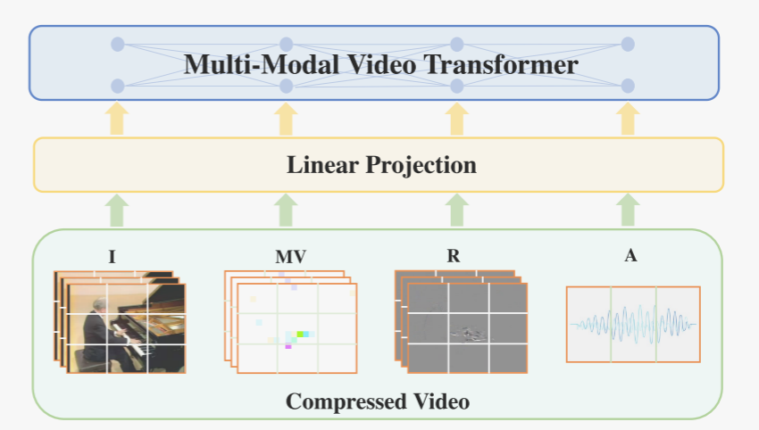
>
> 图1:我们提出的MM-ViT只在压缩视频领域运行，它允许协同融合外观(i帧)、运动(运动矢量和残余)和音频特征，以进行动作识别。据我们所知，MM-ViT是第一个将Transformer的优势与多模态学习相结合用于压缩视频动作识别的工作。

## 相关工作

视频动作识别:深度学习方法在基于图像的识别任务上的巨大成功激发了视频动作识别的重大进步。大多数最先进的解决方案都是基于cnn的，可以大致分为2D和3D-CNN方法。2D-CNN方法[20,32,33,40,55,41,65,68,82]对单个帧进行处理，提取帧级特征，然后通过后期融合/中期融合[33,68,82]、LSTM[39, 65]、信道移位[41]、特征时间差分[32,40]等时间建模进行聚合。可选的多流公式添加额外的CNN流来合并辅助数据模式，例如光流[17,20,37,55]、音频[23,36]、人体骨骼估计[15,76]。相比之下，3D-CNN方法[8,18,19,27,31,60]通过对一系列帧进行卷积来共同学习时空特征。虽然可以实现更高的精度，但3D卷积的计算量很大，使得部署困难。为了缓解这个问题，最近的研究[9,50,62,63]提出了一组伪3d卷积来降低计算成本，同时保持精度。

压缩视频动作识别:手工制作的运动表示，即密集的光流，包含了与深度学习特征互补的时间信息，因此使用光流几乎可以保证提高识别性能[17,37,41,51,63]。然而，不幸的是，光流的计算成本很高。为了绕过这个问题，开创性的工作[80,81]用压缩视频中存在的运动向量代替光流，用于编码像素块的运动。后续工作通过进一步利用残差[73]或在训练[54]期间通过光流监督来细化运动向量来获得更好的性能。尽管获得了令人鼓舞的结果，但与我们的模型不同，这些方法忽略了丰富的多模态关系，无法利用音频信号。

深度多模态表征学习： 借助深度学习的成功，许多深度多模态表征学习方法被提出。一些方法建议通过双线性池化[21]、外积[78]和统计正则化[3]将不同模态的特征融合到联合潜空间中。受使用变换器学习语境化语言表征所取得的巨大进步的启发[13, 42, 53, 77]，最近有几项研究通过添加额外的变换器流，将单模态变换器扩展到多模态环境中，以学习视觉-语言联合表征[44, 52]、视觉-听觉表征[38]和视觉-语言-听觉表征[64, 79]。我们的模型也是建立在转换器基础上的，但与前人不同的是，它使用单个转换器，借助有效的跨模态注意力，对模态内和模态间特征进行建模。

视觉变换器 自注意力已被广泛应用于计算机视觉任务中，例如图像分类 [5、14、43]、物体检测 [7、29、83] 和视频分类 [11、25、70]。通常，它与 CNN 结合使用，以增强卷积特征 [5, 7, 29, 46, 83]。直到最近，Vision Transformer（ViT）[14] 提出了一种纯粹的变换器架构，用自注意取代了所有卷积，它在一些下游图像任务中的表现优于 CNN 同类产品。基于 ViT 的设计，Timesformer [6] 和 ViViT [2] 将二维空间自注意扩展到三维时空卷，用于视频分类。为了保持可控的计算成本，这两项研究都提出了模型变体，在空间和时间维度上对变换器的不同组件进行因式分解。在本文中，我们为视频动作识别提出了一种新的纯变换器方法。与 [2, 6] 类似，我们的架构主要源自 ViT 设计。不过，我们的模型并不只使用解码后的 RGB 帧，而是直接应用于压缩视频，并同时利用压缩域中的视觉和音频模式。我们通过实证证明，在三个公共动作识别基准测试中，MMViT 的性能优于 Timesformer [6] 和 ViViT [2]，同时计算效率更高（以 FLOPs 计）。

## 方法论

### 3.1. 压缩视频的表示

常见的视频压缩算法，如MPEG4、H.264和HEVC，通过将视频分成i帧(编码帧)、p帧(预测帧)和/或b帧(双向帧)来实现高效的视频压缩。i帧是常规图像，并被压缩。p帧只保存前一帧图像中的变化，从而节省空间。在实践中，p帧包括运动矢量和残差。运动矢量表示从源帧到目标帧的像素块(通常在视频压缩期间将一帧分成16x16个宏块)的运动，因此大致类似于粗粒度的光流。残差根据运动矢量进行运动补偿后，保留了p帧与其参考i帧之间的RGB像素差，因此，残差通常显示外观和运动边界的变化。b帧可以看作是一个特殊的p帧，其中运动矢量是双向计算的。除了视觉模式外，压缩视频还包括音频流，在许多情况下，音频流可以在识别中发挥关键作用[23,45]。

### 3.2. 嵌入压缩视频片段

MM-ViT 对压缩视频片段 V 进行处理。视觉模式包括 T 个采样 I 帧、运动向量和高度为 H、宽度为 W 的残差。音频模式包括长度为 T‘ 的一维波形。形式上，$V = {I∈ R^{T×3×H×W},M∈R^{T×2×H×W},R∈R^{T×3×H×W},A∈R^{T'}}$，其中 I、M、R 和 A 分别代表 I 帧、运动矢量、残差和音频模态。为了（大致）对齐视觉和音频信号，我们将一维音频波形划分为 T 段，并使用预训练的 VGGish 模型 [24]，将每段投影到 128 维向量上。

在ViT[14]之后，我们将每个RGB i帧分解成N个大小为P × P的不重叠的patch，然后我们使用一个可学习的线性嵌入层$E^I∈R^{d×3P^2}$将这些patch投影到token嵌入中。此外，在每个patch令牌中加入一个时空位置编码$PE^I_{(p,t)}∈R^d$，以保留位置信息。同样的操作也应用于标记运动矢量和残差:

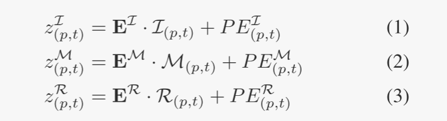

其中$z^I_{(p,t)}， z^M_{(p,t)}， z^R_{(p,t)}$是得到的视觉标记(p = 1，…，N, t = 1，…对于音频特征，我们首先使用线性层$E^A∈R^{d×128}$将其投影到与视觉标记相同的维度空间中，然后添加时间位置编码$PE^A_{(T)}$:

其中转换函数 Φ 由 VGGish 模型 [24] 参数化。为了在视觉和音频模式中实现完全的时空自我注意，我们将每个音频标记 $z^A_{(t)}$ 沿空间维度复制 N 次，因此对于 p, p' ∈ {1, ...,N}, $z^A_{(p,t)} = z^A_{(p',t)}$ 。

在 p = 1, ...,N，t = 1, ...,T 条件下产生的标记序列 $z^I_{(p,t)}， z^M_{(p,t)}， z^R_{(p,t)}$ 和 $z^A_{(p,t)}$，以及一个特殊的 "CLS "标记 $z^{CLS}_{(0,0)}$ 构成了 MM-ViT 的输入。按照 BERT [13]，我们使用 $z^{CLS}_{(0,0)}$ 的输出嵌入作为整个输入序列的集合表示。

### 3.3. 多模态视频变压器

在本节中，我们将介绍四种多模态视频变压器架构。我们从一个架构开始，它简单地采用标准的自关注机制来度量所有成对的令牌关系。然后，我们提出了三种有效的模型变体，它们以不同的策略对时空模态4D体积上的自关注计算进行因式分解(见图2)。

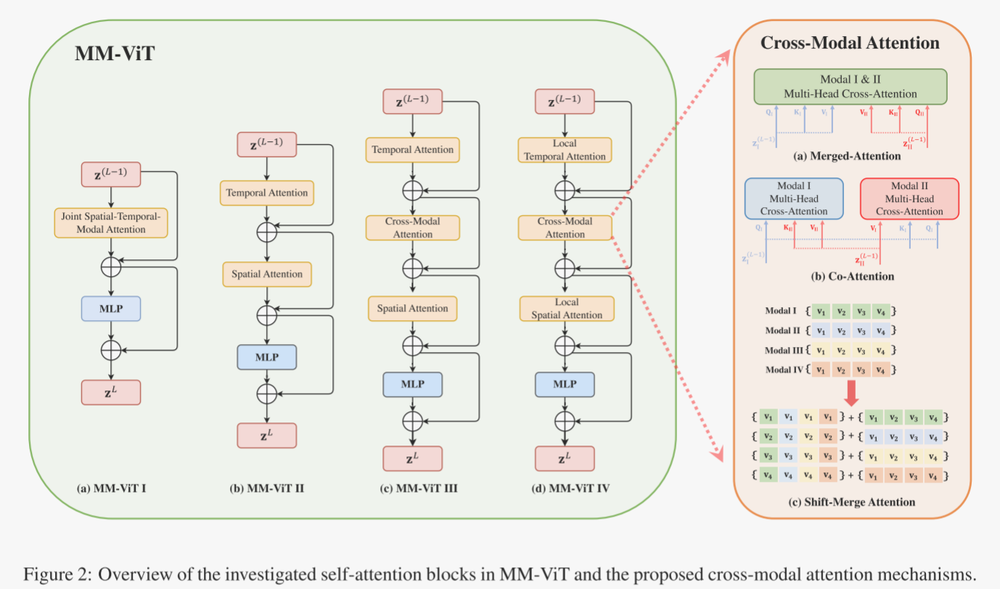

MM-ViT I--时空-模态联合注意（Joint Space-Time-Modality Attention）： 与 Timesformer 中的 "时空联合注意"[6] 和 ViViT 中的 "时空注意"[2] 类似，该模型的每个转换层都测量所有输入词块之间的成对交互作用。具体来说，MM-ViT I 由 L 个转换层组成。在每一层，首先要为上一层的每个输入标记嵌入 $z^{(l-1,s)}_{(p,t)}$计算一组查询（q）、键（k）和值（v）向量，如下所示：

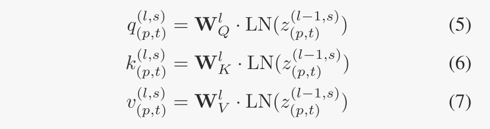

其中，$W^l_Q、W^l_K、W^l_V ∈ R^{d_h×d}$是可学习的嵌入矩阵，LN(-) 表示层归一化 [4]，s ∈ S = {I,M,R,A}。那么，查询补丁 $q^{(l,s)}_{(p,t)}$ 的自我关注权重由以下公式给出：

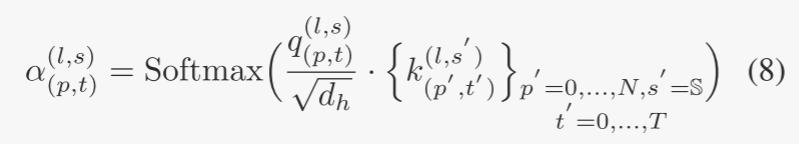

首先根据自注意权值计算值向量的加权和，然后通过MLP块进行线性投影，进一步得到输出标记$z^{(l,s)}_{(p,t)}$ 。利用剩余连接增强鲁棒性。

在实践中，我们采用了多头自注意(MSA)，它能产生更好的性能。具体来说，MSA使用了h组$\{W^l_Q、W^l_K、W^l_V\}$。h头的输出被连接并转发到下一层。请注意，尽管该模型允许所有令牌对之间的交互，但相对于令牌的数量，它的计算复杂度是二次的。

MM-ViT II - 因式时空注意力： 该模型不计算所有输入标记对的自我注意，而是将空间和时间维度的操作因素化。如图 2 所示（左侧面板为 "MM-ViT II"），给定来自第 l-1 层的标记 $z^{(l-1,s)}_{(p,t)}$，我们首先将其与所有模态中同一空间位置的所有标记进行比较，从而在时间（或空间）上进行自我注意。接下来，我们会应用空间注意力和线性投影，生成第 l 层的输出嵌入 $z^{(l,s)}_{(p,t)}$：

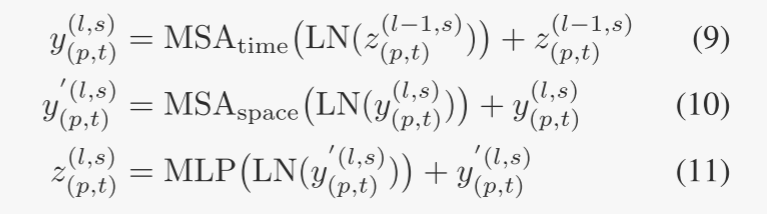

与 MM-ViT I 相比，由于多了一个 MSA 操作，该架构引入了更多参数。然而，通过解耦输入空间维度和时间维度上的自我关注，MM-ViT II 将每个光斑的计算复杂度从 O(N · T · |S|)降低到 O(N · |S| +T · |S|)。

MM-ViT III - 因子化时空跨模态注意： 我们的第三种模型进一步将自我注意在模态维度上进行因子化。在每个转换层，它依次关注空间、时间和模态维度，从而将每个补丁的计算复杂度降低到 O(N + T + |S|)。具体来说，第 l 层的补丁标记 $z^{(l,s)}_{(p,t)}$ 的计算过程如下：

其中MCA代表多头交叉注意，它是专门为跨模态关系建模而设计的。

这种架构的主要理念是建立有效的跨模式注意力，以促进从多模式数据中学习。为此，我们开发了三种不同的跨模式注意力机制（见图 2 右侧面板）。第一种称为 "合并注意力"。对于来自一种模态的查询，它会考虑所有的键和值，而不考虑模态类型。对于查询 $q^{(l,s)}_{(p,t)}$ ，该交叉注意模块的输出定义为

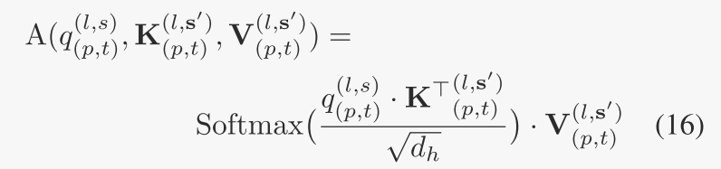

其中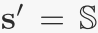, 或者，可以允许查询仅与来自其他模式的键和值交互，因此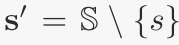。我们将这种跨模态注意称为“共同注意”。注意，这与Transformer中针对解码器模型提出的交叉注意操作相同[66]。

最后，我们提出了一种无需计算的基于移位的方法，称为 "移位-合并注意力"，以协助跨模态交互。它与 CNN 领域提出的移位方法（如 TSM [41]）具有相似的精神，力求在准确性和效率之间取得平衡。更具体地说，我们摒弃了查询和键，直接处理值嵌入，首先将每个 $v^{(l,s)}_{(p,t)}$ 平均分成四个部分 $v1^{(l,s)}_{(p,t)}、v2^{(l,s)}_{(p,t)}、v3^{(l,s)}_{(p,t)}$ 和 $v4^{(l,s)}_{(p,t)}$。然后，我们将不同模态的值嵌入部分进行移动和混合，但在相同的时空索引下，具体如下：

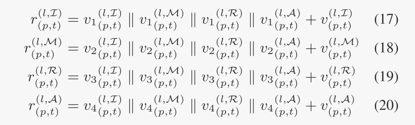

其中r表示结果编码，||表示连接。我们还添加了残差连接来保持学习能力。

MM-ViT IV - 因式化局部时空跨模态注意力： 最后提出的架构将 MM-ViT III 中的因子化时空注意力限制在非重叠的局部窗口中，因此计算成本进一步降低。假设一个局部空间和时间窗口分别包含 M 个和 F 个补丁，则每个补丁的计算复杂度为 O(M+F+|S|)。在实验中，我们设定 M = N/4，F = T/2。然而，将感受野限制在局部窗口可能会对模型的性能产生不利影响。为了缓解这一问题，我们建议在时间和空间注意力之后插入一个卷积层，以加强相邻窗口之间的联系。卷积核大小与窗口大小相同，步长 = 1。

请注意，我们意识到空间、时间和跨模态注意力的顺序可能会对模型性能产生影响，并将进一步的讨论留到第4.2节。

## 实验评价

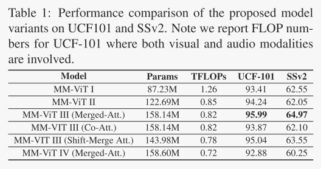

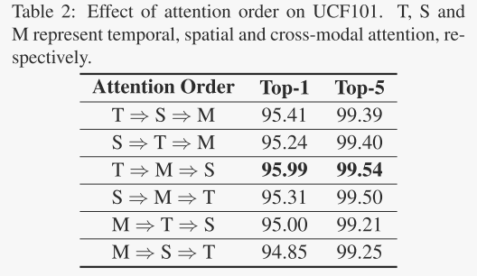