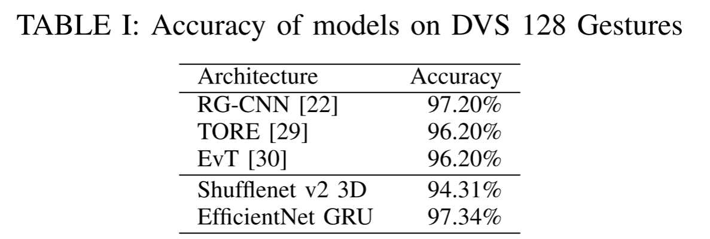
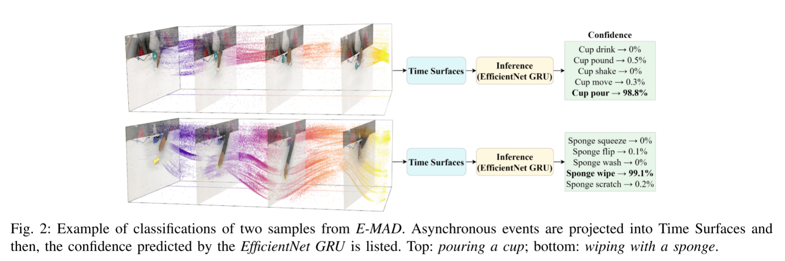
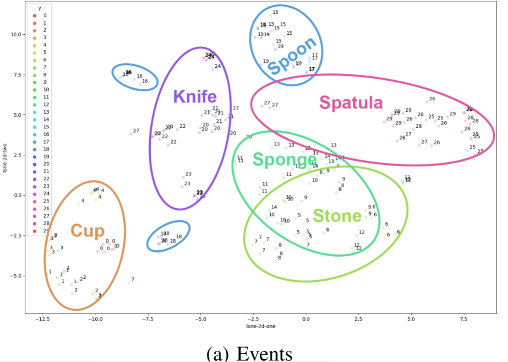
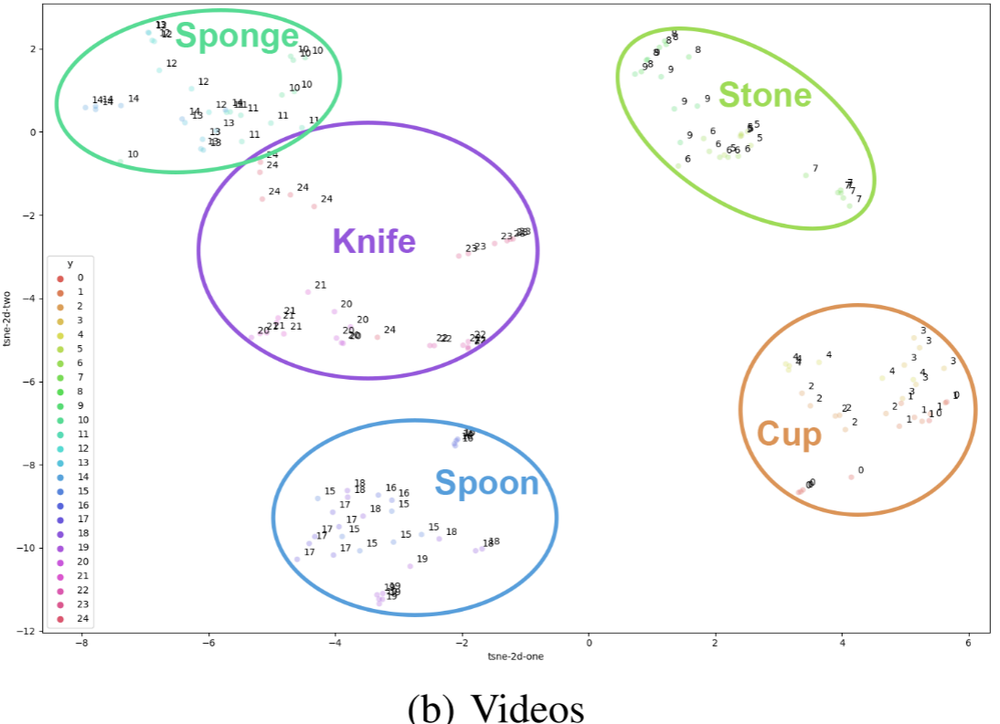
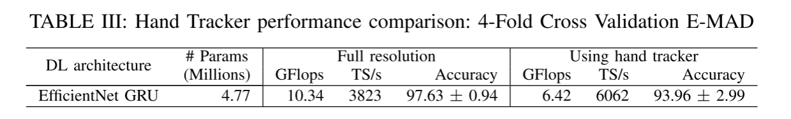

# When Do Neuromorphic Sensors Outperform cameras? Learning from Dynamic Features

> 摘要:视觉事件传感器仅在场景发生高频变化时才输出数据。这允许智能压缩场景，从而实现实时操作。尽管有这些优势，但与传统传感器相比，文献中的工作一直难以展示这些事件驱动方法的细分市场，特别是在关注精度性能时。在这项工作中，我们展示了一个案例，充分利用了事件传感器的优势:对于操作动作识别，学习事件实现了卓越的准确性和时间性能。操作动作的识别需要从手的姿态和轨迹以及与对象的交互中提取和学习特征。我们的工作表明，**基于事件传感器的方法是最适合提取这些动态特征的方法，而传统的基于全帧的方法主要是提取空间特征，需要从序列帧中重建动态。**最后，我们展示了如何使用跟踪器来提取仅在手部周围需要学习的特征，我们得到了一种与场景和对象几乎无关的方法，并在精度影响非常有限的情况下获得了良好的时间性能。
>
> 索引术语-事件处理，操作动作识别

## I. INTRODUCTION

人类动作识别(HAR)专注于研究人体动力学来理解他们的行为。最常见的是，HAR通过处理RGB帧[1]序列来识别人类活动。**由于相似-多样性二元性，动作识别是一个具有挑战性的问题:不同的动作可能看起来非常相似(类间相似性)，但相同的动作可能被不同的主体执行得非常不同(类内多样性)。**HAR的进展对于许多应用都至关重要，如监测系统[2]、患者监测[3]或手势识别[4]。HAR的一个特殊应用是操作动作的识别，这对开发人-机器人协作[5]具有重要意义。由于前面提到的挑战，**动作识别最显著的特征之一就是运动动力学**。捕捉运动动力学是区分操作动作[6]的关键，特别是当受试者对同一物体进行不同的动作或物体被部分遮挡时。在这种情况下，时间动态线索变得至关重要，因为只使用基于外观的特征有时会导致不正确的分类。然而，在基于视频的方法中，动态需要从帧中重建，使其难以捕捉。

最近的HAR解决方案在采用深度学习方法时取得了最好的效果。特别是，**3D卷积神经网络和2D循环神经网络是目前最流行的两种动作识别体系结构[7]**。例如，**在[8]中，作者使用3D cnn来分析视频片段的时空特征**;这些资源密集型操作允许模型同时从场景中的外观和运动中学习。**在[9]中，作者引入了一种长期循环卷积网络(LRCN)，该网络结合了一种2D卷积结构来提取图像的空间特征，并引入了一个循环层，即长期-短期记忆(LSTM)，以捕获序列中帧的时间关系**。

> [8] D. Tran, L. Bourdev, R. Fergus, L. Torresani, and M. Paluri, “Learning spatiotemporal features with 3d convolutional networks,” in Proceedings of the IEEE international conference on computer vision, **2015**, pp. 4489–4497.
> [9] J. Donahue, L. Anne Hendricks, S. Guadarrama, M. Rohrbach, S. Venu-gopalan, K. Saenko, and T. Darrell, “Long-term recurrent convolutional networks for visual recognition and description,” in Proceedings of the IEEE conference on computer vision and pattern recognition, **2015**, pp. 2625–2634.

当场景发生变化时，神经形态视觉传感器只以非常高的频率输出异步事件。这是一种压缩场景和选择移动物体轮廓或纹理[10]的时间线索的聪明方法。此外，它们的高时间分辨率避免了运动模糊，并支持实时实现。所有这些特性使事件传感器成为活动识别的最佳候选对象，因为时间动态不需要从帧序列重建，而是由时空事件信息来表征。然而，要做到这一点，需要新的事件驱动的方法。

在这项工作中，我们介绍了一个有效的基于事件的深度学习框架的动作识别。我们将其与两种最流行的用于动作识别的深度学习架构——3D卷积网络和长期循环卷积网络进行了比较。后者使用EfficientNetB0[11]主干提取空间特征，并结合门控循环单元(GRU)网络[12]来学习帧线索之间的时间关系。我们还将其与Shufflenet 3D进行了比较，我们使用Shufflenet v2网络[13]的3D卷积层实现了Shufflenet 3D。简而言之，**我们工作的主要贡献是:**

•一个高效的基于事件的深度学习解决方案，用于从异步事件中识别操作操作。

•比较和分析事件视觉和RGB视频方法在动作识别方面的优势。

•使用基于事件的手部跟踪器，以减少计算复杂性，并提供一个只依赖于手部动力学的对象不可知的解决方案

## II. RELATED METHODS

一些事件驱动的方法使用原始的单个事件或其中的小数据包进行[14]批处理。然而，更复杂的处理需要更多的空间和时间支持，而不仅仅是几个事件。然后，一些作品提出了事件框架，例如，2D直方图，计算每个空间位置[15]的事件。事件框架的主要缺点是它们忽略了时间信息。因此，文献中的其他方法也提出了构建Time surface: 2D地图，其中每个像素值都是一个时间值，它提供了关于该空间位置事件何时发生的信息。例如，[16]中的作者提出了HOTS方法，该方法在一个由时间常数定义的时空窗口中处理事件包，以在不同的空间尺度上创建分层的时间表面。此外，他们使用指数内核强调最近的事件而不是过去的事件(参见[17])。我们使用指数衰减来构建具有固定时空窗口的时间表面。

> [14] E. Mueggler, G. Gallego, H. Rebecq, and D. Scaramuzza, “Continuous-time visual-inertial odometry for event cameras,” IEEE Transactions on Robotics, vol. 34, no. 6, pp. 1425–1440, 2018.
>
> [16] X. Lagorce, G. Orchard, F. Galluppi, B. E. Shi, and R. B. Benosman,“Hots: a hierarchy of event-based time-surfaces for pattern recognition,” IEEE transactions on pattern analysis and machine intelligence, vol. 39, no. 7, pp. 1346–1359, 2016.
>
> <https://github.com/shaunirwin/event_based_time_surfaces>
>
> [17] S. Afshar, N. Ralph, Y. Xu, J. Tapson, A. v. Schaik, and G. Cohen, “Event-based feature extraction using adaptive selection thresholds,” Sensors, vol. 20, no. 6, p. 1600, 2020.

### A. Action Recognition

近年来，与手工制作的特征相比，深度学习在计算机视觉领域取得了极大的进步，尤其是在基于视频的人类动作识别[18]中。3D卷积网络(3dcnn)是视频动作识别最流行的深度学习体系结构之一。这些网络对相邻帧的前缀序列使用计算密集型的**3D卷积**操作来提取时空特征。然而，如果动作进行的时间较长，每批中需要分析的帧数可能会严重影响识别。另一种方便的动作识别方法是LRCNs，它结合**2D卷积**网络来处理视频中的空间特征，并与**一个循环层联合**训练来捕捉这些空间特征之间的时间关系。

目前，基于事件的动作识别已经出现了几种解决方案。**为了应用传统的计算机视觉算法，大多数方法都将异步事件转换为空间网格表示。**最常见的方法是从事件中构建人工图像，然后使用基于帧的卷积神经网络和循环神经网络来处理以**一批帧[19]形式出现的事件序列**。例如，在[20]中，作者提出使用时空滤波器通过卷积层从事件数据中提取特征进行手势识别。这些滤波器是在无监督的方式下学习的时空矩阵，表现出良好的性能。

尽管在操作动作识别方面缺乏事件驱动的工作，但基于事件的人类手势识别是一个与许多使用神经形态传感器的解决方案密切相关的应用。为了准确地识别手势，识别显著特征对于学习高速下同时出现的视觉空间模式至关重要。一些方法已经提出了利用**残差图卷积神经网络(RG-CNN)**[22]建模异步事件的时间依赖性进行空间特征学习的体系结构，用于对象分类。其他解决方案采用生物学上合理的策略。例如，在[21]中，作者使用Spiking神经网络(snn)，并使用SLAYER框架进行反向传播学习。最后，[23]的作者利用事件传感器的低功耗，在TrueNorth神经形态硬件上提出了一个高效的手势识别系统。

最后，IBM发布了用于人机交互的分布式128手势识别数据集[23]。它包括了超过1300个样本，代表了29名受试者所做的11个手势。但是，该数据集不包括任何人机交互。这也是我们在事件操作操作数据集(E-MAD)[24]上训练方法的原因。它包括750个样本，5个被试，进行30个不同的动作，与6个物体互动。

## III. OUR APPROACH

在这项工作中，我们介绍了一个有效的深度学习框架基于事件的动作识别。**我们分析了两种最流行的动作识别架构的性能，一种是3D卷积网络，另一种是长期循环卷积网络。**然后，我们在两个数据集上评估我们的事件驱动解决方案以进行动作识别。此外，我们使用操作动作数据集(MAD)[25]将我们的事件驱动解决方案与基于RGB视频的方法进行了比较，分析了神经形态视觉传感器在动作识别方面的优势。

在第二阶段，我们集成了基于事件的数据[26]的手工跟踪方法。将手部跟踪器集成到动作识别的管道中，寻求两个目标:**1)减少神经网络分析的事件数量，将感兴趣的区域限制在操纵物体的手所在的区域;2)使用（几乎）与对象无关的模型分析消融研究。**第一个目标与降低计算复杂度有关，因此，利用网络来开发事件处理的高时间分辨率，该网络在处理每一个事件时就集成了来自该事件的知识。第二个目标也有助于理解来自描述手部运动特征的事件的信息，即手部动力学，是否足以进行预测，以及仅使用这些特征进行识别的影响是什么。

### A.操作动作识别

首先，为了处理异步事件信息，我们构建了类似网格的表示结构。特别地，我们遵循指数衰减因子过程来构建时间曲面，就像在[17]中所做的那样。该方法将时间片(具有预定义长度)内的一组事件映射为2D空间表示，并使用衰减因子对最近的事件使用更大的权重。

基于深度学习的动作识别:在这项工作中，我们提出了两种基于事件的动作识别方法。**解决方案之一是3DCNN架构。该网络同时处理一批时间曲面，从神经形态数据中提取时空特征。3DCNN是一个非常复杂的结构，由于其参数大量，难以优化。**该实现使用一个ShuffleNet v2网络[13]作为我们的<u>3DCNN架构(ShuffleNet 3D)的骨干</u>。与ResNet[27]或Inception[28]网络等其他最先进的解决方案相比，Shufflenet是一种更有效的方法。它减少了对元素的操作，并对卷积操作进行了信道变换，使信道组之间能够通信，从而提高精度，提高效率[13]。

**另一方面，我们也比较了一个结合了2D CNN和RNN的LRCN。**<u>2D CNN从输入的Time Surfaces中提取一个特征向量。然后，RNN分析从相邻时间面中提取的特征向量序列，以便从运动动力学中学习以识别操作动作</u>。这种架构是端到端训练的，这意味着<u>2DCNN和RNN</u>模块是同时训练的。特别是，我们为我们的2D CNN部分选择了一个EfficientNet-B0架构[11]。EfficientNet是一个模型家族，其设计遵循一种新的缩放方法，该方法统一缩放所有维度的深度/宽度/分辨率，定义为复合缩放。该架构提供了最先进的性能，同时比其他最先进的cnn[11]小8.4倍，快6.1倍。EfficientNet- b0是EfficientNet家族中最简单、最高效的模型。对于RNN部分，我们集成了一个GRU层[12]。与传统的RNNs相比，gru在大序列中表现出更好的性能。

**事件操作操作数据集**:我们在两个基于事件的数据集上训练我们的解决方案:DVS128手势数据集[23]和事件操作操作数据集或E-MAD[24]。DVS128手势数据集包括了29名受试者的11个半身手势，大部分是用手和手臂完成的。在3种不同光照条件下进行记录。接下来，E-MAD包含了750个样本，代表了使用6个不同物体的30个操作动作，由5个受试者执行。考虑的对象是:杯子，石头，海绵，勺子，刀，和抹刀。

**训练过程**： 鉴于数据集中的动作较短，我们的方法每 33 毫秒构建一次新的时间曲面。训练过程如下：首先，应用随机旋转或随机时间窗口等不同的数据增强技术，然后构建时间曲面。然后，我们只对网络的最后几层进行 60 个历时的训练（我们使用 ImageNet 中预先训练好的权重），最后，再对模型进行 60 个历时的端到端训练。对于 E-MAD，训练分三个阶段进行： 1) 对模型进行 100 个历时的训练，以区分对象上的 6 个超类别动作，由于每个动作的样本数量较少，这将指导架构的优化；2) 对模型进行 10 个历时的迁移学习，以识别 30 个操作动作；3) 对模型进行 100 个额外历时的端对端训练，以对模型进行微调。在此过程中，我们使用亚当优化器，起始学习率为 0.0003。当验证损失达到至少 5 个历时的高点时，学习率将以 0.1 倍的系数递减。

### B.手跟踪器

作为我们研究的一部分，**我们将一个基于事件的手部跟踪器[26]集成到流水线中。**这个跟踪器是一种非常快速的方法，它实现了一个集群跟踪器，该跟踪器将矩形区域内的空间连接事件假设为属于同一对象部分的事件。**这个简单的方法只需要第一个输入，该输入用于构建要跟踪的对象的模型。**此外，它是实时运行的，因为只有生成事件的像素需要在感兴趣的区域内处理。由于神经形态传感器的高时间分辨率，计算成本局限于搜索通常非常接近的最近的聚类。

手部追踪器会定位并追踪操纵物体和执行动作的手，因此需要处理的数据仅限于手部周围区域。在这种情况下，我们的假设是应仅使用手部动态来识别动作，因此来自该区域的事件足以完成这项任务。但需要注意的是，在接触点之后（当手接触到物体时），属于物体本身的事件会部分包含在手的区域中，因为手和物体从那时起就无法分开。

使用手部跟踪器选择包含执行动作的手的区域有两个目的。一方面，降低输入时间表面的空间分辨率会直接影响预测的时间性能。分辨率的降低限制了执行推理所需的浮点运算（FLOPS），从而使预测速度更快。另一方面，将输入限制为手部数据有助于模型更有效地泛化，因为主体或场景的其他细节被排除在外。此外，只使用手部跟踪器的输出有利于模型专注于手部动态。

## IV. DISCUSSION AND RESULTS

### A.基于事件的动作识别

表一显示了为手势识别而训练的不同DL解决方案的性能，并将其与我们的两个方案进行了比较。最先进的工作在顶部达到96%以上的精度，特别是RG-CNN[22]达到97.2%。这是一种基于残差图卷积神经网络的方法，它利用了事件数据的稀疏性和异步性。接下来，在表格的底部，我们展示了我们的Shufflenet v2 3D和EfficientNet GRU实现的准确性。请注意，例如，Shufflenet v2 3D提供了超过94%的出色性能，但仍然比其他替代方案少2点。相反，EfficientNet GRU在手势识别方面达到了最高的准确性，使其成为动作识别的最佳候选人。

然而，表 I 中的结果显示了 DVS128 手势数据集的主要问题之一。**大多数方法的准确率都能达到 95% 以上，这是因为动作间的差异很大，只需关注传感器图像平面某些区域的事件活动空间特征，就能轻松识别动作。事实上，在不同的序列中，动作动态似乎并不重要；主要的挑战似乎在于动作内部的光照条件差异。**

为了发挥事件数据的潜力，**识别问题必须要求学习动作动态，而不仅仅关注空间特征。**接下来，我们将评估基于事件的视觉对识别操作动作的重要性。在识别操作动作时，主体需要与执行不同动作的物体进行互动。鉴于对同一物体做出不同动作时的类间相似性，准确捕捉动作动态对于识别动作至关重要。

关于使用视频进行动作识别，之前的工作已经表明，**动作中使用的物体的空间特征如何对识别[6]起决定性作用**。为了比较基于事件的视觉方法和基于视频的视觉方法的性能，我们在E-MAD和操作操作数据集[25]上训练我们的EfficientNet GRU模型。MAD和E-MAD分别用常规摄像机和神经形态传感器同时记录。考虑到这一点，它们都显示了执行动作的相同主体。图2中显示了一些示例，其中还列出了对前5个标签的信任程度。

图3和表2都支持基于视频的方法关注空间特征和从帧中重建动作动态，而这些帧不能满足动作操作识别的要求。相反，事件驱动的解决方案确实从动作动力学中提取特征，而不需要从同步样本中重建特征，这有利于更好的识别。图中给出了两个t-Distributed Stochastic Neighbour Embeddings (t-SNE)[31]，将DL模型提取的特征投影到2D空间上。图3b显示了基于视频的解决方案的2D投影。请注意，涉及相同对象的操作是如何清晰地集群化的。这是因为外观提供了足够的信息来确定使用的是哪个对象。在基于事件的解决方案的情况下(参见图3a)，对象没有被清晰地分开，因为在识别动作时，运动提供了比外观更多的信息。表二显示了基于事件的替代方案比基于视频的解决方案的准确性大约高出23%。尽管在对象的t-SNE图中显示了清晰的聚类，这个表显示基于视频的方法无法区分运动动力学中更微妙的线索，导致了更差的准确性。然而，对于事件驱动的解决方案，识别在于动作动态，更准确地捕获它们，而不需要从同步样本中重建它们。

> 
>
> 
>
> 图3:EfficientNet GRU提取特征的t-SNE投影。a)使用能够提供场景动态准确线索的事件。然而，由于缺乏基于外观的特征，样本不仅会根据参与动作的对象来分类，还会根据特定的运动来分类。b)利用视频，外观特征显著有助于区分物体。然而，对象上的操作类并没有被清楚地分开。

### B.时间表现:手跟踪器

在最后一项实验中，我们将手部跟踪器集成到了管道中，以了解用于分类的信息是否仅限于手部动作及其与物体的交互。换句话说，既然这些都是操作动作，那么来自动作动态的线索是否足以进行识别。此外，限制需要处理的区域有利于最终识别，提高推理时间性能，更重要的是，对于人机交互应用，它还能降低整个系统的延迟时间

在我们的分析中，我们对使用完整帧（左列）的 EfficientNet GRU 模型和将手部跟踪器集成到管道中并将输入减少到手部区域（右列）的 EfficientNet GRU 模型进行了消减比较。表 III 总结了 K 倍（K = 4）交叉验证的结果。其中包括以千兆浮点运算（Giga Flops）为单位的系统整体性能、以每秒处理的时间曲面为单位的推理时间性能以及准确度。

左列显示，当使用全分辨率时，EfficientNet GRU 模型的平均准确率超过 97%，推理速度超过 10 GFlops。然而，如果将输入事件限制在手部周围区域（右列），计算量将减少 38%，推理速度（TS/s）也将提高 1.6 倍。此外，这对准确率的影响有限，仅为 3.67 分。因此，本实验表明，尽管物体-手部遮挡具有挑战性，但识别率主要取决于执行动作的手部线索。

## V. CONCLUSIONS

多年来，基于帧的传统方法一直优于神经形态方法，尤其是在准确性方面。本文介绍的工作表明，动作识别是事件驱动解决方案能取得更好效果的问题之一。此外，事件驱动解决方案还具有其他优势，如由于其固有特性，可实现实时操作和低延迟。这些优势在人机交互等领域非常有价值，因为人机交互恰恰需要动作识别。

与基于视频的方法相比，本文展示了事件驱动神经网络如何通过学习时空特征来实现成功识别。本文进行的实验工作表明，基于视频的方法所需的重构不足以捕捉动作动态。此外，它还证明了基于视频的方法侧重于空间特征，而空间特征不足以实现成功识别。在分析具有挑战性的对同一物体的操作动作时，这一点更加明显，因为动作本身就存在差异。最后，手部跟踪器的集成也表明，我们的事件驱动方法与场景和对象几乎无关。此外，只学习操纵手周围的特征可以大大提高时间性能，而对准确性的影响却非常有限。

最后，手部追踪器的集成也表明，我们的事件驱动方法与场景和对象几乎无关。此外，只学习操纵手周围的特征可以大大提高时间性能，而对准确性的影响却非常有限。