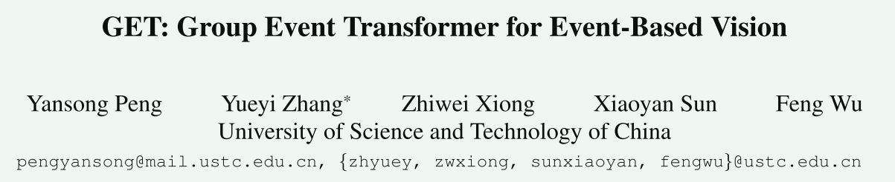
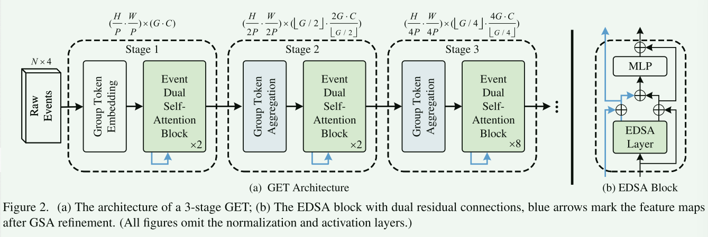
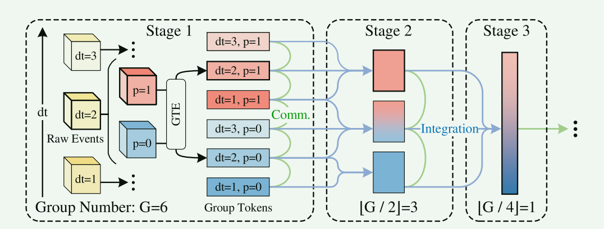
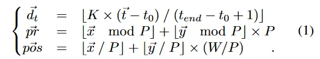
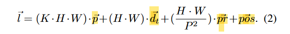
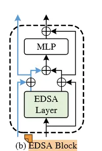
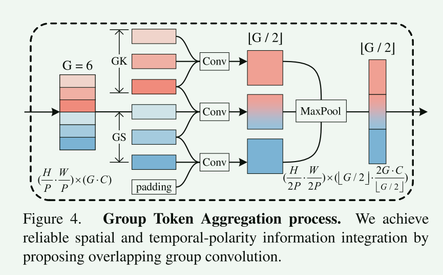
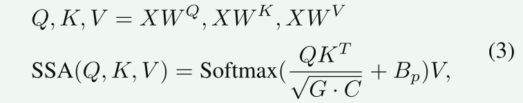
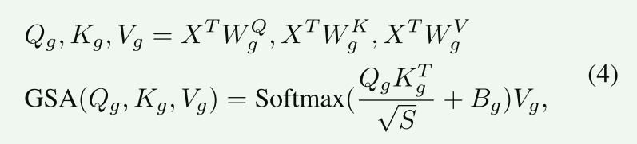
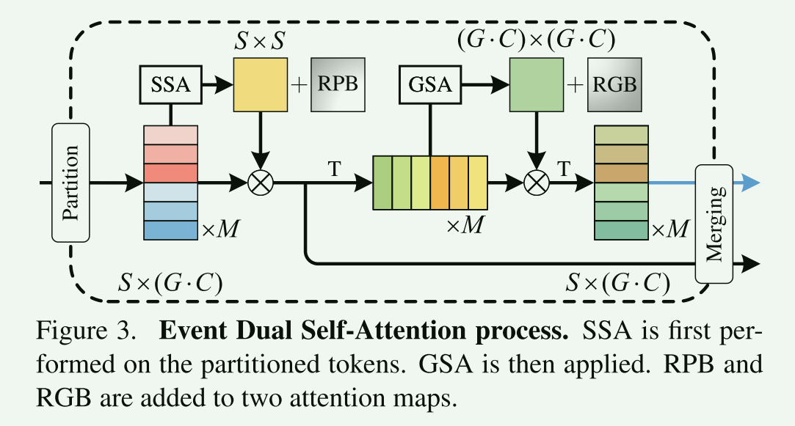

# GET: Group Event Transformer for Event-Based Vision

> 
>
> https://zhuanlan.zhihu.com/p/660871784
>
> 事件摄像机是一种新型的神经形态传感器，受到越来越多的关注。现有的基于事件的主干主要依赖于基于图像的设计来提取从事件变换后的图像中的空间信息，忽略了重要的事件属性，如时间和极性。为了解决这个问题，我们提出了一种新的基于组的视觉转换器主干，称为组事件转换器(Group Event Transformer, GET)，它在整个特征提取过程中对时间极性信息和空间信息进行解耦。**具体来说，我们首先提出了一种新的GET事件表示形式，名为Group Token，它根据异步事件的时间戳和极性对其进行分组**。然后，GET应用事件双自注意模块和组令牌聚合模块，以促进有效的特征通信和整合的空间和时间极性域。然后，GET可以通过与不同的头部连接，与不同的下游任务集成。我们在四个基于事件的分类数据集(Cifar10-DVS、N-MNIST、N-CARS和DVS128Gesture)和两个基于事件的对象检测数据集(1Mpx和Gen1)上评估了我们的方法，结果表明GET方法的性能优于其他最先进的方法。代码可以在https://github.com/Peterande/GET-Group-Event-Transformer上找到。

## 3.方法

图2。(a)分三个阶段的环境信息系统的结构;(b)双残留连接的EDSA块，蓝色箭头表示GSA细化后的特征图。(所有的图都省略了规范化层和激活层。)

输入事件，经过GTE变成GroupToken的表示，然后经过EDSA和GTA的组合；

### 3.2 GTE(Group Token Embedding)

> 
>
> 图1。组令牌在阶段1根据时间戳和事件的极性生成。在GET中，这些令牌被有效地通信和集成，在保持信息解耦的同时充分利用重要的事件信息。

GroupToken在网络中的大致变化

Group Token的思想：输入事件，按K间隔取几个帧，就成了图2左边的三个dt=i的帧；每个帧又有极性为0和1的部分，然后帧1和极性1/0组合，就成了两个组；所以最后有这么六个组。

方法简述：输入事件流，隔K时间取一帧，把(t,p,x,y)集成到一个1D的张量，最后concat起来，并embed；得到了GroupToken。

**组令牌嵌入（GTE）模块旨在将事件流转换为组令牌。**来自H×W分辨率的事件相机的事件流描述为$(\vec t,\vec p,\vec x,\vec y）$ ，其中$\vec t,\vec p$和$(\vec x,\vec y)$ 是时间、极性和位置坐标。我们首先将异步事件的时间离散为K个区间（隔K时间取一帧），并将位置坐标编码为P×P块的秩和块的位置。我们还定义了离散时间$\vec {d_t}$，patch秩$\vec {pr}$和patch位置$\vec {pos}$位置为：

加上极性P，就是4D的。然后我们把4D映射为1D的$\vec l$。

接着，利用权重为$\vec 1$和相对时间为$(\vec t-t_0)/(t_{end}- t_0)$的一维bincount操作，生成了两个长度为H · W · 2K的一维阵列。经过concat和reshape操作，我们得到了形状为$( H/P · W/P) × ( 2K · 2P^2)$的事件表示。然后，我们在MLP层之后用3 × 3组卷积层embed这个表示。最后，我们得到了维数为${H\over P} · {W \over P} × ( G · C)$的GroupToken，其中C表示每个group的通道数。变量G是具有不同时间间隔和极性组合的组数。换句话说，G要么等于2K，要么等于$2·{K\over 2}$，这取决于卷积层的分组划分。

### 3.3 EDSA(Event Dual Self-Attention Block)

EDSA块由EDSA层、MLP层和归一化层组成，如图2(b)所示。**它的设计是为了有效地提取空间和时间极性域的特征。然而，由于两个领域的上下文信息不同，两种特征映射的直接融合往往会产生干扰，使网络趋于局部最优。**为了解决这个问题，EDSA区块采用了双残留连接，如黑色和蓝色箭头所示。

> 

EDSA层的第一步是像Swin - Transformer一样，将特征图划分为大小为S的M个互不重叠的窗口来计算并行自注意力。如图4所示，先通过SSA(Spatial Self Attention)，再通过GSA(Group Self Attention)然后把一个SSA+GSA的结果和一个只通过SSA的结果merge成原来的Group Token形式。

> 

SSA操作可以描述为:

其中，$W^Q、W^K、W^V∈R^{(G·C)×(G·C)}$是线性权值，将输入沿通道维转换为查询Q、键K和值V。Bp为相对位置偏差(relative position bias, RPB)。注意图由Q和K之间的点积生成。特征映射是通过注意映射与V值之间的矩阵乘法运算得到的。

RPB和RGB分别是窗口间、组间相对位置的偏置。比如RPB，代码中创建了一个相对坐标表 'relative_coords_table'，其形状为 '(1, 2\*Wh-1, 2\*Ww-1, 2)'，其中 Wh 和 Ww 是窗口的高度和宽度。然后把table通过MLP并且reshape以适应注意力的计算。

执行 SSA 后，我们将输出特征图转置为 (G·C)×S 形，以执行群组自关注（GSA）。我们提出的 GSA 可捕捉组标记的时间和极性上下文信息，从而完善语义特征。GSA 操作可描述为

其中，$W^Q_g ,W^K_g ,W^V_g ∈ R^{S×S} $是线性权重，用于沿空间维度转换输入。我们还加入了相对群体偏差（RGB）$B_g ∈ R^{(G-C)×S}$来引导注意过程。相对组偏置指数介于 -G+1 和 G-1 之间，表示不同的特征组。注意力图谱由 $Q_g$ 和 $K_g$ 之间的点积生成。注意力图与 $V_g$ 之间的矩阵乘法运算计算出特征图。

最后，EDSA层输出两个特征图:一个是仅应用SSA得到的(黑色箭头)，另一个是同时应用SSA和GSA得到的(蓝色箭头)。EDSA块保证了在空间和时间极性域的有效特征通信。

整体EDSA Block的结构如图3所示，包含多个残差连接，蓝线是SSA+GSA，黑线是纯纯的SSA；残差连接都是采用直接加的方式融合的；加的时候，主干有一个DropPath的操作，在计算注意力时的dropout ratio在代码里都是0.1。

### 3.4 GTA(Group Token Aggregation)

图5 GTA模块的GroupToken变化

GTA模块由一个3 × 3的重叠组卷积、一个归一化层和一个3 × 3的最大池化操作组成，其中3 × 3表示核大小。

重叠组卷积的输入特征图形状为( H/P · W/P) × ( G · C)。然后将其划分为⌊G / 2⌋新的重叠组，并与相同组数的一组kernel去卷积。GTA有两个参数：**分组核( GK )表示每个核的输入组数，分组步长( GS )表示两个输入之间的分组距离。**

各组特征在空间域和时间-极性域都获得了更大的( 3 × )感受野。这种渐进式的组间集成类似于CNN网络中的内像素法集成，随着网络的加深，特征图获得了更大的感受野。