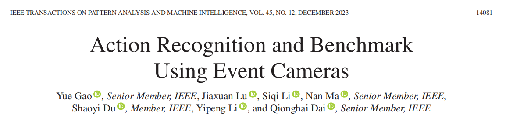

# Action Recognition and Benchmark Using Event Cameras

## III. METHOD

为了利用事件数据进行动作识别，我们提出了一个基于cnn的基于事件的动作识别框架，包括事件体素过滤模块、可学习的多表示融合模块、基于事件的慢速网络和基于事件的时空注意机制，如图2所示。事件体素滤波模块在保持事件分布的同时实现了事件去噪和实质性的降采样。提出的LMFR (Learnable Multi-Fusion Representation)以可学习的方式集成了多种主流事件表示，将原始事件数据转换为类似帧的cnn输入格式。基于事件的慢速网络利用人体运动和外表的快、慢特性。引入基于事件的时空注意机制，进一步提高性能。

### *A. Event Cameras and Event Stream*

事件相机是仿生视觉传感器，对每个像素的亮度变化做出异步响应。对于时间戳t处的像素(x, y)，事件相机在以下时间触发事件