# STAR-Transformer: A Spatio-temporal Cross Attention Transformer for Human Action Recognition

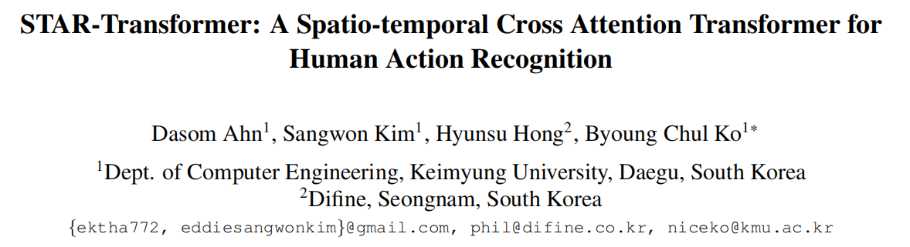

在动作识别中，虽然结合时空视频和骨架特征可以提高识别性能，但需要为跨模态数据建立单独的模型和平衡特征表示。为了解决这些问题，我们提出了时空变换器（STAR），它能有效地将两种跨模态特征表示为可识别的向量。首先，从输入的视频和骨架序列中，视频帧分别输出为全局网格标记，骨架输出为联合地图标记。然后将这些标记汇总为多类标记并输入 STAR 变换器。**STAR 变换器编码器由一个全时空注意力（FAttn）模块和一个拟议的之字形时空注意力（ZAttn）模块组成。同样，连续解码器由一个 FAttn 模块和一个拟议的二进制时空注意力 (BAttn) 模块组成**。STAR-transformer 通过合理安排 FAttn、ZAttn 和 BAttn 模块的配对，学习时空特征的高效多特征表示。在 Penn-Action、NTU-RGB+D 60 和 120 数据集上的实验结果表明，与之前的先进方法相比，所提出的方法在性能上取得了可喜的进步。

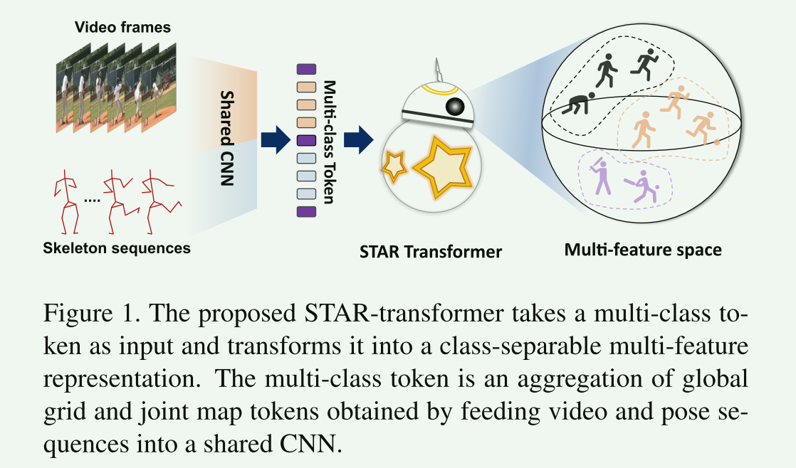

## 3.方法

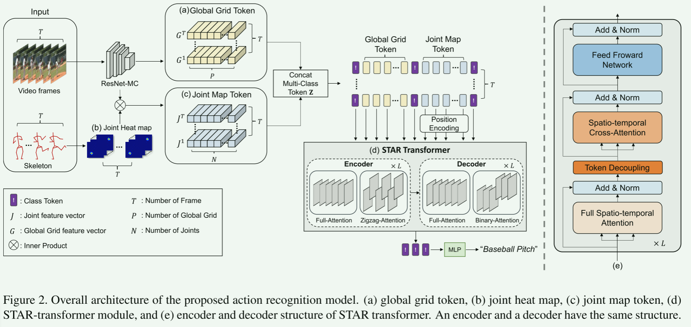

图 2 显示了基于 STAR 变换器模块的拟议动作识别模型的整体结构。输入接收 16 个视频帧和相应的骨架序列。每个帧都会经过预训练的 ResNet 混合卷积 18（MC18）[43]，以提取局部和全局特征图。ResNet MC18 模型不适合拟议的之字形和二进制操作，因为它们会在操作后缩小视频帧大小。全局特征图是 ResNet MC18 最后一层的输出，它被转化为代表图像视觉特征的全局网格标记（GG-token）（图 2 (a)）。如图 2 (c)所示，ResNet MC18 中间层输出的局部特征图与联合热图相结合（图 2 (b)），然后转化为联合图标记（JM-token）。JM 标记代表每个骨骼关节的局部特征。如图 2 (d)所示，这两个标记被聚合成一个多类标记，然后输入 STARtransformer，以推断出最终的动作标签。

### 3.1. Cross-Modal Learning

我们首先提出一种结合视频帧和骨架特征的跨模态学习方法。将视频帧发送到ResNet MC18，并从中间和最后两层提取特征图。由于中间层的feature map比上一层包含更详细的局部特征，因此使用中间层的feature map提取JM-token，最后一层的feature map提取GG-token。

**全局网格令牌(GG-token)**:设由P令牌组成的**GG-token $T_g$**为$T^t_g = \{g^t_1，…,g^t_P\}$.为了从**第t帧中**提取GG-token $g^t_P$的元素，将输入帧调整为224×224的大小，通过ResNet MC18生成的全局特征图的大小为h × w，再次将全局特征图平化为大小为hw (P)的向量，由于全局特征图由C通道组成，故$T^t_g$的每个元素的维数为$g^t_P∈R^C$。对于每一帧视频，这个过程都是这样进行的，因此我们可以得到T时态gg -token，如图2 (a)所示。

**关节图标记（JM-token）**： **在第 t 个视频帧对应的第 t 个姿势中**，我们获得每帧强调关节的 N 个关节热图，并基于这些热图获得 JM 标记集 $T^t_j = \{j^t_1, ..., j^t_N\}$。首先，获得 ResNet MC18 的局部特征图 $F∈ R^{C^′×h^′×w^′}$。第 n 个关节点热图 $h_n∈R^{h^′×w^′}$ 是将第 n 个关节点投影到大小为 h′×w′ 的临时图上，并以 σ 的比例进行高斯模糊处理的结果。 由于局部特征图由 C′通道组成，因此 $T^t_j$ 的每个关节点元素的维数为 $j^t_N∈R^{C'}$ 。第 t 个姿势上的关节元素$ j^t_n $是由局部特征图 F 和第 n 个关节热图 $h^t_n$ 连接（⊕）得到的，如下式所示：

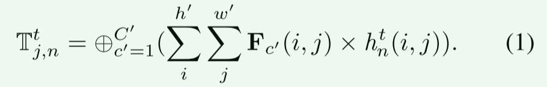

对于每个位姿序列，都是这样进行的，因此我们可以得到T个时间JM标记，如图2 (c)所示。

**多类令牌:**为了聚合使用跨模态数据生成的GG-和JM -令牌，我们提出了一种多类令牌聚合，如图3所示。纯ViT[16]，如图3 (a)所示，利用单类令牌学习输入令牌之间的全局关系。然而，**所提出的动作识别模型必须协同学习由跨域数据生成的多类令牌**。因此，本文提出的多类令牌聚合方法可以有效地学习不同特征表示的特征，如图3 (b)所示。

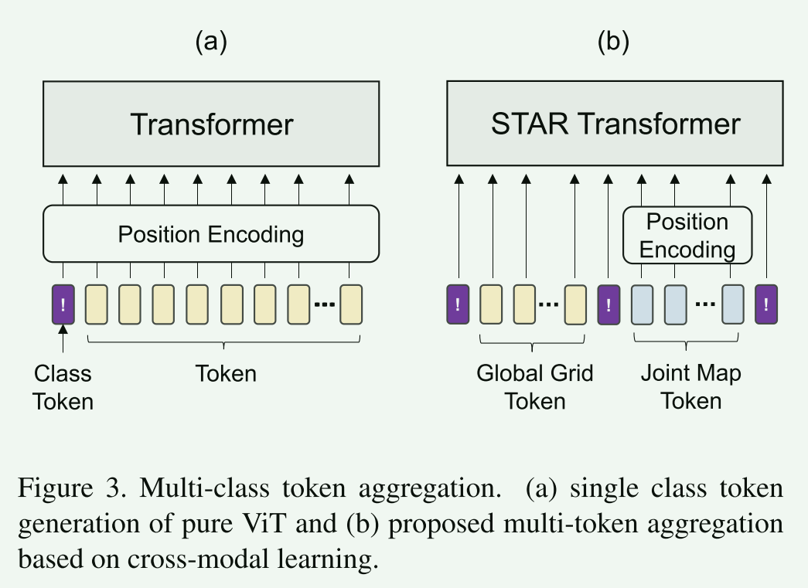

多类令牌 Z 是由 GG 类令牌（CLSglob）和 JM 类令牌（CLSjoint）的类令牌连接（⊕）而成，如下所示：

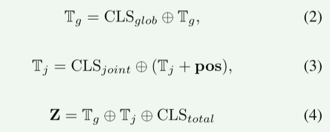

其中 CLStotal 是所有标记的类标记。与 GG 标记不同，在 JM 标记中，联合位置信息 pos 非常重要，因此 pos 只被添加到 JM 标记中。

### 3.2.时空交叉注意

受[2]的启发，我们首先提出了full spatio-temporal attention (FAttn)，如图4 (a)所示，**该方法对时空维度内的所有令牌都采用了注意机制**。当对**时间维T和空间维S**的所有令牌应用FAttn时，复杂度增加到$O(T^2S^2)$。然而，由于FAttn单独不足以处理时空特征，我们提出了两种额外的交叉注意机制，即**锯齿形时空注意(ZAttn)**，如图4 (b)所示，以及**二元时空注意(bAttn)**。如图4 (c)所示。我们不需要关注所有时间维t的令牌，而是**将所有令牌划分为两个令牌组，分别用于ZAttn和BAttn**。当ZAttn和BAttn应用于时间维T和空间维S的所有令牌时，由于时间维上的令牌被分成两组，计算复杂度比采用$O({1\over4}T^2S^2)$的FAttn降低了0.25倍。

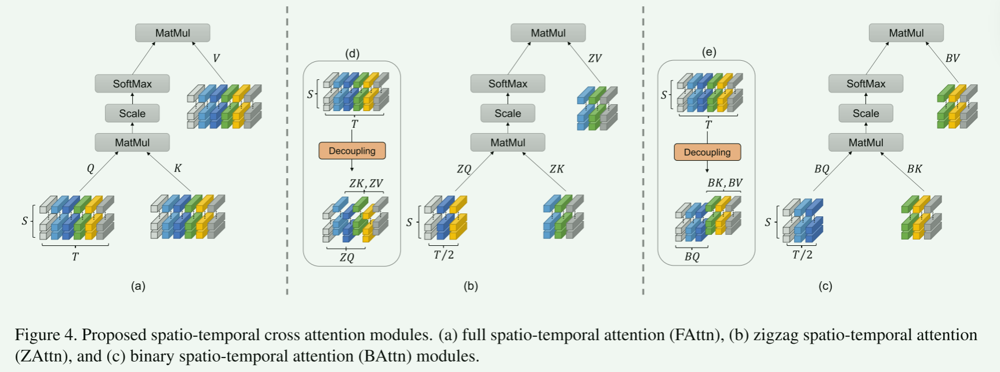

我们首先从多类令牌Z中得到相同大小的查询(Q)、键(K)和值(V)$∈R^{S×T}$矩阵，并计算如下所示的FAttn输出:

ZAttn 学习行动变化的详细过程。为了计算ZAttn，Z 中的奇数向量被分成 $ZQ'∈R^{S×T/2}$ ，Z 中的偶数向量被以之字形方式分成 ZK'和 $ZV'∈R^{S×T/2}$，如图 4 (b) 所示。相比之下，Z 中的奇数矢量被分为 ZK′′ 和 $ZV''∈ R^{S×T/2}$，Z 中的偶数矢量被分为 $ZQ''∈ R^{S×T/2}$。

我们使用下面的公式，以 "之 "字形方式分别计算出$ a'∈ R^{S×T/2} $和 $a''∈ R^{S×T/2}$，然后将输出结果 a′ 和 a′′ 合并为 ZAttn 的结果。

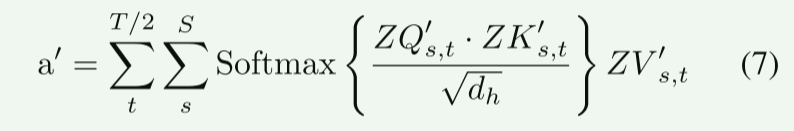

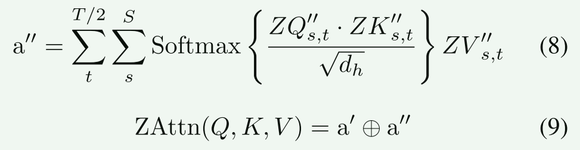

如图 4 (c)所示，BAttn 也是通过来回分割时间维度令牌生成的。通过这一过程，可以学习到动作开始和结束时的变化。在 BAttn 的情况下，以二进制方式将 Z 分成两组后，分别计算出前后向量 BQ′∈  $R^{S×T/2}$  和 BK′，以及 BV′∈  $R^{S×T/2}$ 矩阵。相比之下，Z 中的前向量分为 BK′′和 BV′′∈RS×T/2，Z 中的后向量分为 BQ′′∈ $R^{S×T/2}$ 。我们用 ZAttn 的相同公式计算两类矩阵中的单个 b′∈ $R^{S×T/2}$ 和 b′′∈  $R^{S×T/2}$ ，并将输出的 b′ 和 b′′ 合并为 BAttn 的结果。

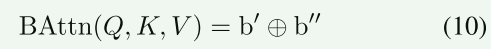

### 3.3. STAR-transformer encoder and decoder

本文提出的star变压器采用纯变压器[44]而非纯ViT[16]的编解码结构，如图2 (e)所示。但编码器由一系列FAttn(自注意)层和ZAttn L层组成，解码器由一系列FAttn层和BAttn层组成。编码器使用ZAttn来关注动作细节变化的学习关系，解码器使用BAttn来学习动作大变化的关系。star变压器层的结构如下:

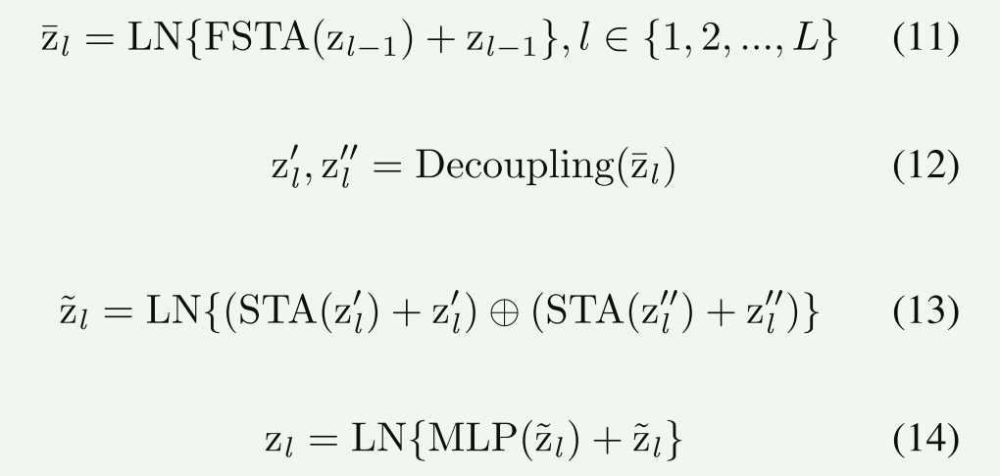

这里，l 是变压器层数，LN 是层归一化，FSTA 是 FAttn 的多头自注意。解耦指之字形或二元分组。STA 表示 ZAttn 和 BAttn 的时空注意，MLP 是多层感知器。

STAR-transformer输出的多类令牌通过平均并输入MLP来推断最终的动作标签，从而组合成单个类令牌。