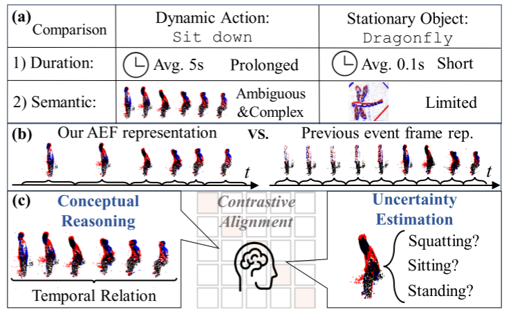
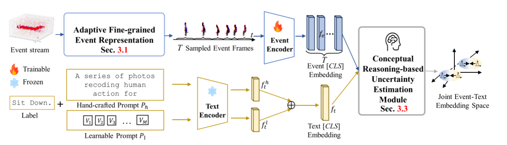
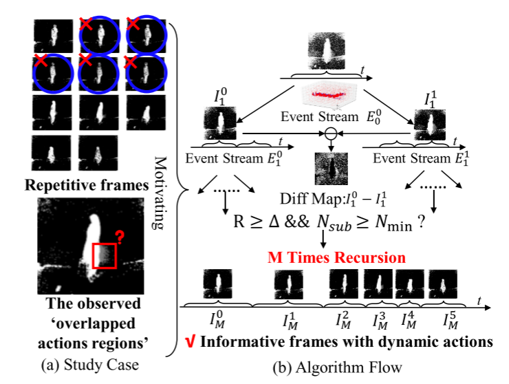
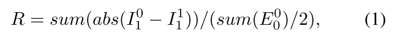
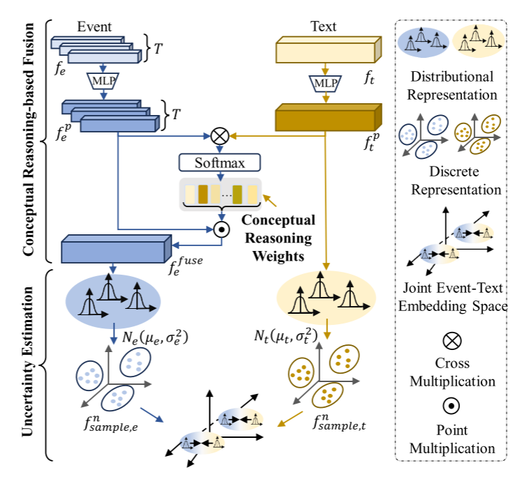
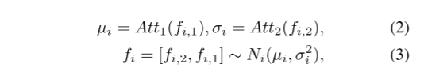
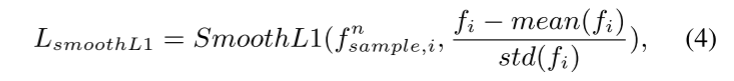
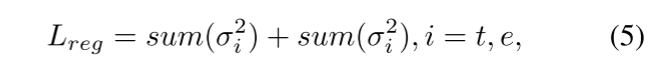
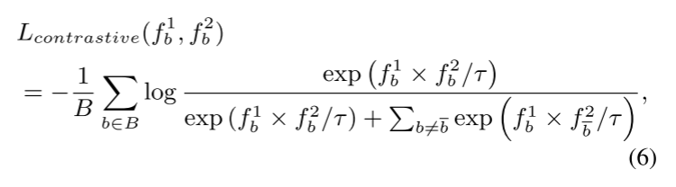
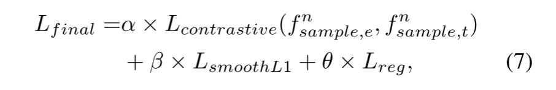

# ExACT: Language-guided Conceptual Reasoning and Uncertainty Estimation for Event-based Action Recognition and More

## Abstract

事件摄像头最近被证明有利于实际的视觉任务，如动作识别，这要归功于它们的高时间分辨率、高能效和减少隐私问题。然而，当前的研究受到以下两个问题的阻碍：1)事件持续时间长，动态动作具有复杂和模糊的语义，难以处理；2)固定堆栈的事件框架表示存在冗余的动作描述。我们发现，语言自然传达了丰富的语义信息，使其在减少语义不确定性方面具有惊人的优势。鉴于此，我们提出了一种新的方法，首次从跨通道概念化的角度来处理基于事件的动作识别。我们的Exact带来了两个技术贡献。首先，我们提出了一种自适应细粒度事件(AFE)表示法，在保留动态事件的同时，自适应地滤除静止目标的重复事件。这在不增加计算代价的情况下巧妙地提高了Exact的性能。然后，我们提出了一个基于概念推理的不确定性估计模块，该模块模拟了识别过程，丰富了语义表示。特别是，概念推理基于动作语义建立时态关系，不确定性估计基于分布表示处理功能的语义不确定性。实验表明，该算法在PAF、HARDVS和我们的片段数据集上的识别率分别达到了94.83%(+2.23%)、90.10%(+37.47%)和67.24%。

## 1.引言

动作识别是一项重要的视觉任务，具有许多应用，如机器人导航[33，43]和人类异常行为识别[25，35]。已经提出了许多基于框架的学习方法，导致了令人印象深刻的性能改进[24，43]。然而，对于功率受限的场景，例如监视[3，24]，这些方法可能不是理想的解决方案。由于运动模糊和光线变化等环境偏差[36]，RGB相机也会降级。此外，基于帧的摄像头由于直接捕捉用户的外表，引发了相当大的隐私问题。

最近，受生物启发的活动相机越来越受欢迎[1，14，27]，它忽略了背景，只记录下移动的物体。这导致了低功耗的传感效率和对快速运动和照明变化的适应能力。此外，活动摄像头大多反映物体的边缘，这缓解了用户对肤色和性别等隐私问题的担忧。由于这些优势，基于事件的动作识别为现实世界的实现提供了更实用的解决方案。这激发了基于事件的动作识别领域的研究努力[14，27，36，39，49，54，55]，表现合理。

然而，上述方法的不足有两个原因：1)它们识别大量不同的人类行为的能力有限，在包含300个类别的Tab中的HARDVS[48]数据集上的实验证明了这一点。1.这可能是由于动态动作和持续时间延长(约5s[48])导致的复杂和模棱两可的语义，而不是持续时间较短(约0.1s[48])和有限语义的对象。例如，如图1(A)所示，‘蜻蜓’vs.“请坐”。2)缺乏定制的事件表示，因为原始事件被直接堆叠到具有固定堆栈的事件帧中，导致具有描述相同动作的重叠或模糊边缘信息的事件帧，见图3和图1(B)。

视觉语言模型的最新进展[6，11，37]开创了跨文本和视觉通道整合语义概念的想法，旨在模拟人类概念化和推理的过程[19，41，42]。关键的洞察是，语言自然地传达着内在的语义丰富，这有助于对语义不确定性进行建模，并建立复杂的语义关系。受此启发，我们引入了语言作为基于事件的动作识别的指导。作为第一次探索，研究的障碍包括：1)如何在没有冗余事件框架的情况下表示事件以详细描述动态动作？2)如何将文本嵌入和事件嵌入结合起来，帮助推理动态动作的复杂语义，减少语义不确定性。

为此，我们提出了一个新的准确框架，从跨模式概念推理的角度来处理基于事件的动作识别，如图1(B)和(C)所示。为了解决第一个挑战，提出了一种自适应细粒度事件(AFE)表示(SEC.3.1)的灵感来自于图3中观察到的“重叠的动作区域”。这些区域表明一帧中的事件堆栈过多，这对于以前基于帧的固定堆栈的表示是不可避免的。不同的是，我们的AFE递归地和离线地根据重叠区域来寻找不同动作的分界线。它消除了重复事件并保留了动态动作，从而在不增加计算成本的情况下提高了模型的性能(Tab.2)。

> 
>
> 图1.(A)不同于静止物体，例如具有短持续时间(0.1秒)和有限语义的‘蜻蜓’，像‘坐下’这样的动态动作具有延长的持续时间(5秒)，具有模棱两可和复杂的语义。(B)与以往的事件表示方法相比，采用固定数量的事件堆叠，自适应地过滤出记录静态动作的事件，同时保留动态动作；(C)引入语言指导来刺激识别过程，特别是在概念推理时间关系和估计不确定语义方面。

对于第二个挑战，我们提出了一种新的基于概念推理的不确定性估计(CRUE)模块。3.3)模拟人类的动作识别过程。具体地说，CRUE通过利用文本嵌入来推理每个框架的语义，从而建立事件帧之间的时间关系，从而获得融合的事件嵌入。随后，CRUE将事件和文本嵌入从离散表示转换为分布表示，其中分布变化量化了语义不确定性。通过这种方式，我们提出的CRUE模块建立了一个语义丰富和不确定性感知的嵌入空间，以提高模型的性能(Tab.3)。

同时，由于现有的数据集只提供类别级别的标签，我们提出了包含58个动作类别的具有丰富语义的标题级别标签的摘要数据集。我们的数据集作为第一个用于事件文本动作识别的数据集(准确率为67.24%)。我们还进行了大量的实验，结果表明，我们的方法在公共数据集上的准确率明显优于以前的方法，PAF[34]的准确率为94.83%(+2.23%)，特别是在HARDVS[48]上的准确率为90.10%(+37.47%)。除了动作识别，我们的Exact还可以灵活地应用于事件-文本检索任务。

综上所述，我们的主要贡献是：(I)我们提出了第一个利用语言指导进行基于事件的动作识别的框架；(Ii)我们提出了CRUE模块来模仿人类的动作识别，为动作识别创造了一个丰富的、具有不确定性感知的跨模式嵌入空间。此外，我们的AFE表示自适应地过滤冗余事件，产生对动态动作的有效表示。(3)我们引入了带有详细文本字幕的Sact数据集来评估由多个具有不同语义的子动作组成的动作的识别能力。大量的实验证明了我们的框架在特定数据集和公共数据集上的优越性。

## 2.相关工作

基于事件的动作识别方法可以分为纯事件识别方法和事件-其他通道识别方法。对于纯事件框架，最广泛的技术包括将事件流堆叠到紧凑的框架中，然后使用现成的卷积神经网络(CNN)[14]或视觉转换器(VITS)[39，55]进行有效的特征提取。由于CNN/VIT主干的出色表现，这种方法目前展示了最先进的性能。同时，考虑到事件数据的异步性，研究界探索了仿生尖峰神经网络(SNN)[27]的适用性和图卷积网络(GCNS)[54]的时空能力，以更好地与事件数据的独特结构共振。然而，这些方法产生的性能不佳，适应性有限，部分原因是SNN固有的特殊硬件要求。

与此同时，人们一直在努力将事件数据与其他模式相结合。例如，将RGB[49]数据中丰富的颜色和纹理信息与事件信息结合在一起，或者利用光流[36]中的补充运动知识。综上所述，这些方法大多依赖于密集的连续事件帧，不可避免地导致具有重叠动作和不确定语义的冗余帧。为了表示事件以描述详细的动态行为，提出了自适应采样事件帧的AFE表示，而不引入额外的计算代价。

视觉语言模型 近年来，人们对用于多通道表示的大规模预训练的视觉语言模型[6，11]越来越感兴趣。受此启发，几个开创性的工作[7，52，58]研究了将VLM的能力转移到事件模式的可能性，从而重振了反对识别的最佳性能。此外，VLMS卓越的零激发能力促使研究人员探索基于事件的无标签[7]或零(少)激发应用[58]，从而解决了高质量事件数据集的稀缺问题。然而，现有的事件-文本方法侧重于识别语义有限的对象，而不能识别持续时间较长、语义复杂和模糊的事件。因此，我们的目标正是从跨通道概念推理的角度来增强基于事件的动作识别。

## 3.拟议的确切框架

概述。图2描述了我们的Exact框架的概述。Exact的关键思想是引入语言作为估计语义不确定性和建立基于事件的动作识别的语义关系的指南。以下小节解释了1)建议的自适应细粒度事件(AFE)表示(SEC.3.1)；2)事件编码器和文本编码器(Sec.3.2)；3)基于概念推理的不确定性估计(CRUE)模块(SEC.3.3)。此外，在SEC中。3.5，我们提出了语义丰富的基于事件的动作识别(SEACT)数据集，作为事件-文本动作识别的第一个数据集。

> 
>
> 图2.我们提议的确切框架的总体框架。它由四个部分组成：(1)AFE表示递归地消除重复事件并生成描述动态动作的事件帧(SEC。3.1)；(2)事件编码器和(3)文本编码器，分别负责事件和文本嵌入(Sec.3)；(4)CRUE模块模拟动作识别过程，对子动作建立复杂的语义关系，减少语义不确定性。(Sec.3)

### 3.1.AFE表示法

> 
>
> 图3.(A)与现有方法经常导致重复事件帧不同，我们的AFE表示基于观察到的重叠动作区域自适应地过滤出相同动作的重复事件；(B)AFE表示的插图。

大多数基于事件的动作识别模型[14、39、55]主要依赖于事件框架表示[31、56]，这与现成的CNN/VIT主干兼容。对于这些模型，事件流被空间地集成到具有固定事件计数或持续时间[57]的帧中，如图1(B)所示。然而，事件数据的高时间分辨率不可避免地导致大量重复的事件帧显示相同的静止对象(参见图3(A)蓝色圆圈)。因此，这种表示法很难刻画动态动作。为此，我们试图回答以下问题：我们能否自适应地过滤出静止对象的重复事件，同时保留记录动态行为的事件？

因此，我们将图3(A)中的先前事件帧表示[57]可视化。一个显著的观察是“重叠的动作区域”，如红色方块所示，它是帧转换过程的副产品，其中由于事件堆栈过多，连续的动作重叠。因此，对于不适当的事件采样间隔而言，这一‘重叠作用区域’是一个关键指标。有鉴于此，我们提出了AFE表示。

具体地说，为了根据重叠的动作区域找到最合适的不同动作的分界线，我们采用了经典的二进制搜索，并以高效的O(LogN)算法复杂度离线递归地实现。如图3(B)所示，搜索算法可以被视为寻找二叉树的叶节点。首先，我们将事件流E0(根)平均划分为两个子流E01(节点)和E11(节点)，从而生成它们对应的事件计数图像I01和I11。然后，我们用I11减去I0 1，得到差值映射。接下来，为了基于差值图来衡量重叠动作的比例，我们定义了一个名为差异率R的因子，它由以下公式给出：

其中sum(.)和abs(.)函数分别表示事件计数和绝对值运算。直观地说，R的高值表示将记录两个不同动作的事件堆叠到一帧中的可能性很高。在这种情况下，我们需要递归地划分事件子流。

对于递归算法，边界条件是很重要的。在我们的情况下，如果差率R高于最低采样阈值∆，则重复上述除法过程，直到其低于∆或子流Nsub的事件计数数小于最小聚集事件计数数Nmin。请注意，超参数Nmin和∆随不同的数据集而异。有关选择NMIN和∆的更多讨论，请参阅补充材料。经过上述M次递归的搜索过程，我们最终得到了一系列细粒度的事件帧I^T_M，其中包含T个事件帧(所有叶节点)。

### 3.2.功能编码

通过AFE表示，事件流被处理成一系列细粒度的事件帧IT M，然后利用[58]的预训练事件文本模型中的事件编码器和文本编码器来建立统一的事件文本嵌入空间。

事件编码器。如图2所示，它输入空间大小为H×W的RGB事件帧II M∈RH×W×3，i=1，2，...，T，并输出事件嵌入文件。给定T个事件帧，事件编码器处理T次并生成嵌入fE∈RT×He×We×Ne的事件[cls]。

文本编码器。它接受两种不同类型的文本提示作为输入：1)手动创建的文本提示‘A Series of Photos Record action for[CLASS].’，其中[CLASS]代表类别名称。2)可学习文本提示Pl=[P1，P2，...，Pn，PCLASS]，其中PI，i=1，2，...，Nl，是Dp维的随机初始化参数；Nl表示可学习文本提示的个数；PCLASS表示[CLASS]和[[]的编码单词嵌入。表示串联操作。然后，文本编码器将手工制作的文本提示Ph和可学习的文本提示Pl转换为对应的文本嵌入f^h_t和f^l_t。最后，我们通过对f^h_t和f^l_t求平均，得到了文本[cls]嵌入函数ft。

### 3.3.CRUE模块

以前的基于事件的动作识别方法[14，26]没有考虑以下几个方面：1)时间关系：与静止对象不同，动态动作随着时间的推移而展开。事件数据的时间信息对于理解动作的意义至关重要。例如，在图1中，“坐下”和“站起来”涉及具有相反时间发生的相似的子动作，即“站立”→“蹲下”“→”坐着“vs.‘Siting’→‘蹲着’→‘’Stand‘，从而产生了不同的语义。2)语义不确定性：动作由不同的子动作组成，其语义复杂性高于静止物体。以“坐下”为例。它包括子动作：“站立”、“蹲下”和“坐”。每个子操作都有特定的含义。因此，使用任何子动作都不足以表达整个动作“坐下”的意思。在这两个方面的启发下，我们提出了CRUE模块，通过提出的基于概念推理的融合和不确定性估计来模拟人类的动作识别过程。

基于概念推理的融合：与事件框架[14、36、39、55]的简单平均融合不同，所提出的CRUE模块利用文本嵌入来指导事件框架融合。具体地说，如图4所示，给定事件[cls]嵌入fe和文本[cls]嵌入ft，两层MLP网络被用于维度投影。这样，我们就可以得到投影事件嵌入f^p_e和文本嵌入f^p_t。然后，将f^p_e和f^p_t相乘，然后用Softmax函数生成概念推理权重。然后，将概念推理权重与原始投影事件嵌入f^p_e相乘，得到融合事件嵌入f^{f_fue}_e。直观地将概念推理权重作为基于事件框架时间序列生成的语义权重用于框架融合。

> 
>
> 图4.提出的CRUE模块包括1)基于事件之间的时间关系的框架融合的概念推理和2)利用分布表示对子动作的不确定性估计。

不确定性估计：语义不确定性是指所获得的信息倾向于呈现多个目标[19]。为了建模动作的语义不确定性，我们借用了自然语言处理(NLP)[2，8，47]和计算机视觉(CV)[5，41，42]中应用的分布表示的思想。与提取特征作为离散表示的方法不同，我们使用概率分布编码器[19]来嵌入事件和文本。因此，语义不确定性可以通过概率分布的方差来量化。

具体地说，如图4所示，嵌入f^{f_fue}\_e∈Rhe×We×Ne的融合事件[cls]在通道维度[19]被等分成f^{f_fue}\_{e，1}和f^{f_fue}\_{e，2}。然后，f^{f_fue}\_{e，1}和f^{f_fue}\_{e，2}被馈送到两个标准自我注意模块[46]。接下来，我们可以预测均值向量∈Rhe×We×Ne和方差向量σe∈Rhe×We×Ne。这里，µe和σe是多元高斯分布f^{f_fue}\_e∼N_e(µ_e，σ^2_e)的估计参数。我们对文本CLS嵌入f_t进行同样的运算，以估计其对应的多元高斯分布f^p_t∼Nt(µt，σ^2_t)。总体而言，上述操作可以表述如下：

其中i=e，t分别表示事件和文本嵌入；Att表示自我注意模块和[.]指示串联操作。

利用估计的分布表示Ni(µi，σ2 i)，i=t，e，我们现在量化事件和文本嵌入的语义不确定性。然后，我们通过使用重新参数化方法[23]对任意离散表示进行采样，以确保平滑的反向传播。也就是说，我们首先从标准正态分布中采样随机噪声δ∼N(0，i)，而不是直接从Fi∼Ni(µi，σ^2_i)采样，i=t，e。接下来，我们通过Fn采样获得采样的离散嵌入f^n_{sample，i}=µ\_i+δσ\_i，其中n=1，2，…，N，N是表示采样的离散嵌入的数目的超参数。(有关N的更多讨论请参阅SEC。4.3)得到的f^n\_{sample,i}观察到估计的分布Ni，因此它可以用于估计语义不确定性。

然而，上述随机抽样过程增加了训练的复杂性，特别是考虑到事件数据的空间稀疏性。为了加速模型收敛，我们引入了归一化的CLS嵌入f_i，i=t，e和抽样嵌入f^{n_sample,i}，i=t，e之间的平滑L1损失[15]：

其中n=1，2，...，N是表示采样离散嵌入次数的超参数，mean(.)和std(.)表示输入嵌入的均值和方差。此外，为了减少分布表示的语义不确定性，我们引入了正则化损失：

其中，sum(.)和abs(.)分别表示输入嵌入和绝对值运算的总和。实验结果表明，当模型收敛时，最终的Lreg大于零。这表明当方差大于零时，模型不会从分布表示退化为离散表示。

### 3.4.训练目标

为了建立用于动作识别的事件-文本联合表示空间，我们利用两个模式嵌入f^1^~b~和f^2^~b~之间的对比损失L(f^1^~b~，f^2^~b~)如下：

其中τ是温度系数，B表示小批量的大小，b和$\bar b$表示小批量中的第b和第$\bar b$个数据。

我们计算了所有样本事件嵌入F^n^~sample,e~和文本嵌入F^n^~sample,t~之间的对比损失。最后，整个训练目标由对比损失、平滑L1损失和正则化损失结合不同的速率超参数组成：

其中，在考虑其数值范围后，我们将α，β和θ的缺省值设置为1。