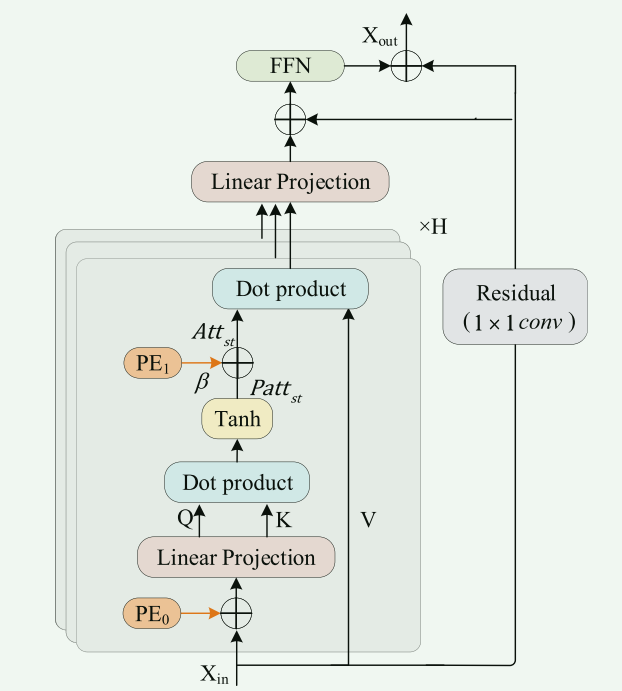
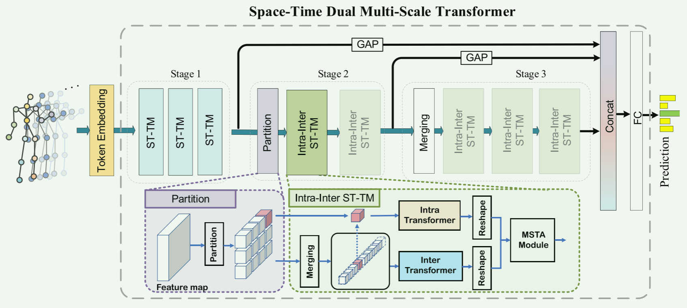
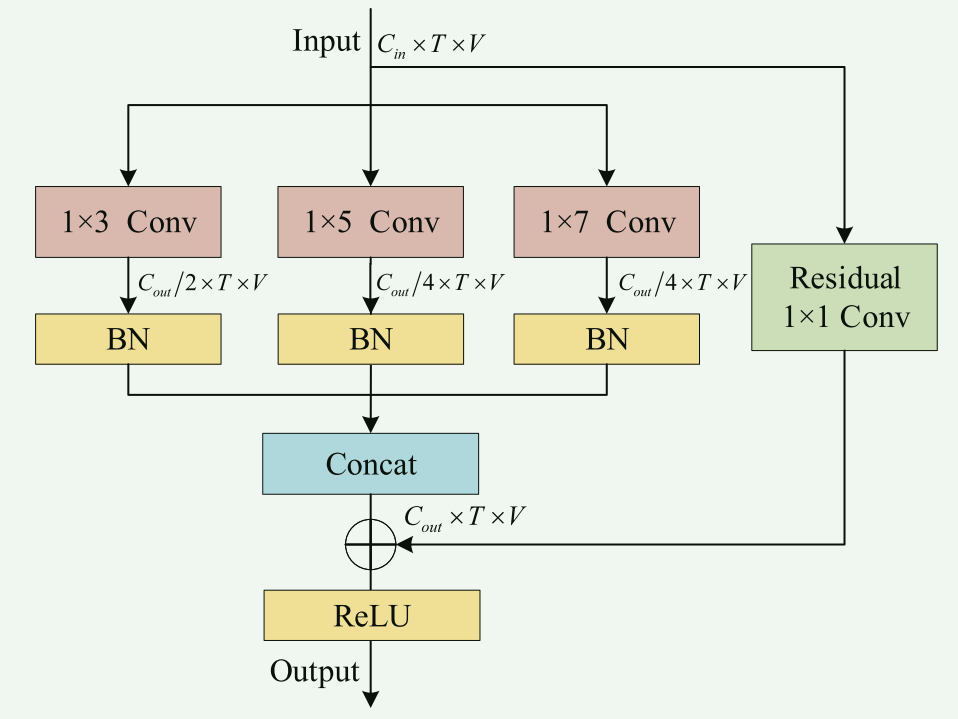
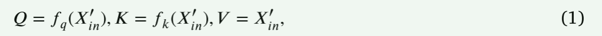
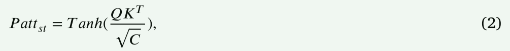
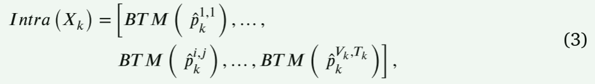
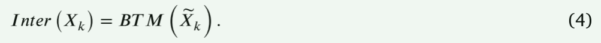
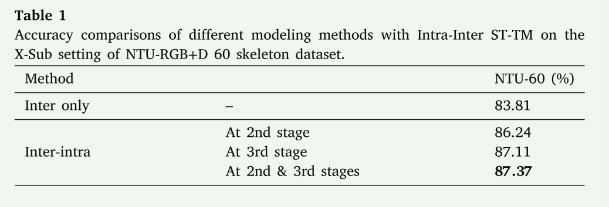
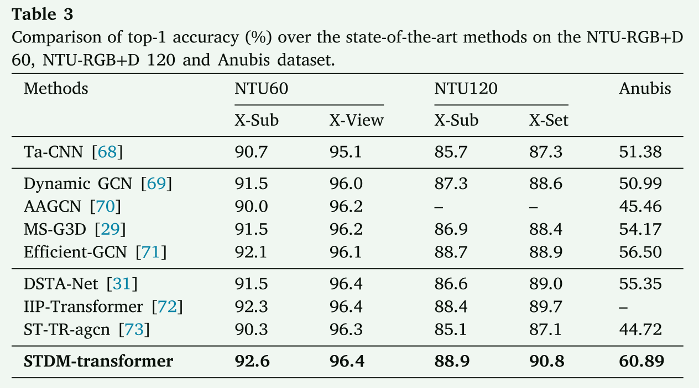

# STDM-transformer: Space-time dual multi-scale transformer network for skeleton-based action recognition

> 本笔记主要关注时序建模问题

## 简述

递归神经网络（RNN） 具有很强的捕捉时间动态特征的能力，可以有效地对动作进行分类。卷积神经网络（CNNs）[21,23] 可在以不同方式映射的伪图像上实现平移和缩放不变性。然而，RNN 和 CNN 没有充分利用骨架的图拓扑信息。那么GNN就被采用，能有效捕捉动作的顺序信息，但是大多数基于 GCN 的方法在对关节的全局依赖性进行自适应建模方面存在局限性，这对动作分类有潜在影响。

以下是空时变压器(ST-transformer)的BTM组块，它模仿标准的transformer的encoder模块，加入时空位置编码，并加入残差结构。

> 
>
> 图二。基本变压器模块(**BTM**)的结构，主要包括一个多头自注意模块和一个前馈网络(FFN)。灰色矩形举例说明了一个详细的单头自注意。Q、K、V分别为查询矩阵、键矩阵和值矩阵。PE0和PE1是两种位置编码。H为多头自注意模块个数。线性投影、点积和tanh表示不同的算子。

如图 3 所示，STDM-转换器包含三个阶段，分别对应关节、部位和身体比例。给定骨架序列后，利用标记嵌入将数据映射到高维空间，从而丰富骨架数据的特征。在第一阶段，每个标记代表一个关节的特征。三个时空变换模块（ST-TM）<u>利用 BTM 和多尺度时空聚合（MSTA）对连续帧中关节之间的时空关系进行建模</u>，并生成关节尺度特征。在第二阶段，采用<u>两个包含分割和合并策略的内部 ST-TM</u>，将关节尺度特征划分为空间-时间部分，并进一步将动作特征提升到部分尺度。在第三阶段，该结构将部分尺度特征作为输入，<u>并利用主体合并策略生成空间-时间主体。</u>采用与第二阶段相同的思路输出身体尺度特征。最后，设计全局平均池化和全连接层来融合关节尺度、部分尺度和身体尺度特征，以进行最终分类。

> 
>
> 图3。提出的时空双尺度变压器(**STDM-transformer**)的总体架构。提取关节、部位和体的时空特征分为三个阶段，分别记为阶段1、阶段2和阶段3。利用被连接运算符混淆的多尺度特征对动作类别进行分类。阶段1包含三个时空转换器模块(ST-TMs)。阶段2或阶段3由intar -inter时空互感器模块(intar -inter ST-TMs)组成。图中绿色虚线矩形为ST-TM的详细图。

> 
>
> 图4。多尺度时间聚合模块(**MSTA模块**)示意图。该模块包含一维时间卷积核(1 × 3,1 × 5和1 × 7)的三个尺度来增强时间特征。𝐶，𝑇，𝑉分别表示通道数，关节数，时间序列长度。BN(黄色矩形)表示批量归一化层。残差(绿色矩形)表示残差连接。

## 正文

在本文中，我们提出了一种时空双尺度多尺度变压器(STDM-transformer)，以探索基于细尺度和粗尺度运动信息的多尺度协同表示。所提出的stdm变压器将时空多尺度分层为两个层次。两个层次中的一个被提出的目的是建立局部运动的相互作用。这一层次的第一步是利用时空多尺度划分策略将特征划分到不同的尺度。然后，提出了一种新的时空内互感器模块，从骨骼数据中提取和聚合部分尺度和身体尺度信息。另外，另一层是为粗粒度的全局运动上下文建模而设计的。在网络的不同阶段提取联合尺度、局部尺度和体尺度特征，最后汇聚多尺度特征对行为进行分类。

为了验证所提模型的优越性，在大规模数据集上进行了大量实验。实验结果表明，所提出的stdm变压器在现有方法中具有较好的SOTA性能。本工作的主要贡献如下:

1. 提出了一种时空双尺度互感器(STDMtransformer)来研究多尺度协同表示，该互感器将时空多尺度分层为细粒度层和粗粒度层。
2. 在细粒度层面，提出了时空划分策略和新型的互感器内部块来提取和聚集局部交互作用。在粗粒度级，设计分层多尺度渐进式融合策略，对关节尺度、部分尺度和体尺度特征进行聚合。
3. 大量实验表明，所提出的stdm变压器在大规模数据集上达到了最先进的性能。

近年来，基于变压器的动作识别研究大多集中在以RGB或骨架序列作为输入。在基于rgb的动作识别任务中，许多方法[49-51]尝试探索变压器的各种解耦方式。MViT[52]研究了一种用于视频分类的多尺度变压器。对于基于骨架的动作识别任务，DSTA[31]和STST[32]设计了一个解耦时空转换器对动作进行分类。STTFormer[33]利用限制在局部时间窗口内的关节时空注意捕获骨架数据的时空依赖性。此外，[53]提出了MTT模块来提取多尺度的时间特征而不是多尺度的时空特征，这些特征是动作识别的重要线索。然而，这些方法忽略了骨骼数据中关节的局部语义和全局语义之间的差异。

2.1.基于骨骼的动作识别

对于基于骨架的一般动作识别，神经网络方法一直保持着最先进的水平，并且已被证明比早期基于手工的方法更具通用性和鲁棒性[45,46]。这些方法主要包括以下三类。递归神经网络（RNN）[24,26] 具有很强的捕捉时间动态特征的能力，可以有效地对动作进行分类。卷积神经网络（CNNs）[21,23] 可在以不同方式映射的伪图像上实现平移和缩放不变性。然而，RNN 和 CNN 没有充分利用骨架的图拓扑信息。为解决这一问题，图形卷积神经网络（GCN）已成功应用于这一任务。ST-GCN [40] 首先通过基于非欧几里得骨架数据的邻接矩阵构建了时空图。**随后，许多研究人员对其进行了扩展和改进。DGNN [27] 和 DDGCN [28] 用有向图表示骨架序列，能有效捕捉动作的顺序信息。**此外，许多基于 GCN 的方法[29,30,47,48] 被提出来扩大感受野，从而建立非相邻关节之间的联系。总的来说，大多数基于 GCN 的方法在对关节的全局依赖性进行自适应建模方面存在局限性，这对动作分类有潜在影响。

2.2.基于变压器的动作识别

近年来，基于变压器的动作识别研究大多集中在以RGB或骨架序列作为输入。在基于rgb的动作识别任务中，许多方法[49-51]尝试探索变压器的各种解耦方式。MViT[52]研究了一种用于视频分类的多尺度变压器。对于基于骨架的动作识别任务，DSTA[31]和STST[32]设计了一个解耦时空转换器对动作进行分类。STTFormer[33]利用限制**在局部时间窗口内**的关节时空注意捕获骨架数据的时空依赖性。此外，[53]提出了MTT模块**来提取多尺度的时间特征而不是多尺度的时空特征**，这些特征是动作识别的重要线索。然而，这些方法忽略了骨骼数据中关节的局部语义和全局语义之间的差异。

2.3.骨架数据的多尺度表示

为了进一步获得判别特征以提高基于骨骼的动作识别性能，人们提出了许多方法来聚合多尺度特征。这些方法可以分为两类。第一类的方法[29,30,54-56]被提出通过跨时空维度的多尺度接受域来捕获非局部邻域的特征。如[54,56]利用GCN与高阶邻接矩阵提取远端关节关系。**MST-GCN[30]将特征的通道分割成多个片段，再通过剩余连接集成MSGC和MS-TC模块，捕捉多尺度特征**。在第二类中，一些方法[57-60]观察到骨骼的自然多尺度表征，即关节、部位和身体。DMGNN[57]利用MGCU融合跨尺度特征进行运动特征学习。MSR-GCN[58]提出了一种U-Netlike GCN来产生运动模式。相反，我们的方法基于分层变压器结构，从细到粗探索时空信息，利用多尺度特征进行动作识别。

### 3.初步

> 
>
> 图二。基本变压器模块(BTM)的结构，主要包括一个多头自注意模块和一个前馈网络(FFN)。灰色矩形举例说明了一个详细的单头自注意。Q、K、V分别为查询矩阵、键矩阵和值矩阵。PE0和PE1是两种位置编码。H为多头自注意模块个数。线性投影、点积和tanh表示不同的算子。

在本节中，我们介绍了stdm变压器中的基本变压器模块(BTM)，它是每个空时变压器(ST-transformer)的重要组成部分。BTM包含一个多头自注意模块和一个前馈网络(FFN)，其结构如图2所示。为了便于说明，我们在这个图中以单头自我注意为例。具体来说，在本节中，我们将介绍提出的stdm变压器中的基本变压器模块(BTM)，它是每个空时变压器(ST-transformer)的重要组成部分。BTM包含一个多头自注意模块和一个前馈网络(FFN)，其结构如图2所示。为了便于说明，我们在这个图中以单头自我注意为例。具体来说，我们假设$𝑋_{𝑖𝑛}∈𝑅^{𝑁×𝐶}$是BTM的输入，其中𝑁表示时空令牌数量，𝐶表示通道数量。为了保留时空位置信息，在输入$𝑋_{𝑖𝑛}$中加入位置编码PE0，其结果记为$𝑋'_{𝑖𝑛}$。然后，我们通过以下方式生成查询$𝑄∈𝑅^{𝑁×𝑀_𝑞}$，键$𝐾∈𝑅^{𝑁×𝑀_𝑘}$，值$𝑉∈𝑅^{𝑁×𝑀_𝑣}$:

其中，𝑓𝑞(⋅)和𝑓𝑘(⋅)代表两种线性投影。而𝑀𝑞、𝑀𝑘和𝑀𝑣分别表示查询、键和值的维度。然后，利用点积算子和tanh函数得到初步的时空注意力图𝑃𝑎𝑡𝑡𝑠𝑡。在公式方面:

为了保留时空位置信息，𝑃𝑎𝑡𝑡𝑠𝑡和PE1相加得到时空注意图𝐴𝑡𝑡𝑠𝑡。PE1是特征的时空位置编码，对所有数据样本进行共享。它代表了人类关节的一种统一的内在关系模式。将权重𝛽相乘，以平衡时空位置编码的强度。**像典型的变压器一样，利用𝐴𝑡𝑡𝑠𝑡和值𝑉之间的点积(后跟一个线性投影)来获得增强的隐藏特性。然后加入逐点前馈神经网络得到输出𝑋𝑜𝑢𝑡**。另外，利用两个1 × 1核的剩余连接来聚合不同的特征，稳定网络训练。

### 4.时空双尺度多尺度变压器

在本节中，我们首先介绍了stdm变压器的总体架构，然后详细描述了时空多尺度划分策略。此外，给出了时空内互感器模块和多尺度时间聚合模块的技术细节。

#### 4.1.整体架构

该算法的主要思想是**构造骨架数据的多尺度协同表示**。通过将骨架数据的时空多尺度分层为双层，分别实现了细粒度局部交互和粗粒度全局交互。对于细级，动作特性首先通过合并策略转换到另一个尺度(部分或主体)。然后，时空内互感器模块提取该尺度对应的特征。如图3所示，上述操作依次在部分标度和本体标度中进行。对于粗级，聚合不同尺度(关节、部位和主体)的动作特征来预测动作类。

如图 3 所示，STDM-转换器包含三个阶段，分别对应关节、部位和身体比例。给定骨架序列后，利用标记嵌入将数据映射到高维空间，从而丰富骨架数据的特征。在第一阶段，每个标记代表一个关节的特征。三个时空变换模块（ST-TM）<u>利用 BTM 和多尺度时空聚合（MSTA）对连续帧中关节之间的时空关系进行建模</u>，并生成关节尺度特征。在第二阶段，采用<u>两个包含分割和合并策略的内部 ST-TM</u>，将关节尺度特征划分为空间-时间部分，并进一步将动作特征提升到部分尺度。在第三阶段，该结构将部分尺度特征作为输入，<u>并利用主体合并策略生成空间-时间主体。</u>采用与第二阶段相同的思路输出身体尺度特征。最后，设计全局平均池化和全连接层来融合关节尺度、部分尺度和身体尺度特征，以进行最终分类。下面我们将详细介绍时空分割策略和内部多尺度变换模块。

图3。提出的时空双尺度变压器(STDM-transformer)的总体架构。提取关节、部位和体的时空特征分为三个阶段，分别记为阶段1、阶段2和阶段3。利用被连接运算符混淆的多尺度特征对动作类别进行分类。阶段1包含三个时空转换器模块(ST-TMs)。

#### 4.2时空多尺度划分策略

在本小节中，我们提出了一种时空多尺度的分割策略，该策略在ST-TM内部具有重要作用。下面详细描述时空多尺度划分策略(如图1所示)，以便在下一小节中引入intar -inter ST-TM。

早期工作中的生物学观察[61-63]表明，人类能够从人体骨骼关节的运动中识别动作。此外，人体可以看作是由刚性骨骼和铰接关节组成的铰接系统，并进一步组合成四肢和躯干[64]。人类的动作是由这些肢体和躯干(身体部位)的短动作组成的。

基于上述观点，我们认为不同尺度的特征，如 "关节与部分 "和 "部分与身体"，是相辅相成的。**仅用单一尺度特征进行分类是不够的 [63]。例如，在区分 "跳 "和 "跳起 "这两种动作时，仅仅依靠身体比例信息不足以区分这两种动作。**我们**需要关注腿部，并使用部分比例信息作为补充，才能正确对其进行分类**。此外，当我们需**要区分 "握手 "或 "传球 "这两种动作时，仅仅依靠部分比例信息也不足以正确分类**。因此，我们需要关注手部的关节，并使用更详细的关节尺度信息作为部分尺度信息的补充。在我们的设置中，**第 2 阶段的部件运动分区和第 3 阶段的身体运动分区都采用了时空分区策略**。由于关节运动已经是骨架序列中的基本分区，我们忽略了它的分区。在部分运动分区中，整个人体动作在空间维度上被分割成六个部分（两只手臂、两条腿、一个头部和一个躯干），在时间维度上以三帧为间隔进行分割。对于身体-动作分割，空间分割包含上半身和下半身，时间间隔为 3 帧。

数学上，假设**第 𝑘 阶段的输入**为 $𝑋^′_{𝑘-1} ∈ 𝑅^{𝐶^′_{𝑘-1}×𝑉^′_{𝑘-1}×𝑇^′_{𝑘-1}}$，**即上一阶段的输出特征**。其中，𝑉 和 𝑇 分别表示输出特征在空间和时间维度上的分区数。𝐶 表示输出特征的通道编号。对于**第 𝑘 个尺度**，我们假设空间维度和时间维度的分区编号分别为 $𝑉_𝑘$ 和 $𝑇_𝑘$。因此，空间索引为𝑖、时间索引为𝑗的分区数据$𝑝^{𝑖,𝑗}_k$的形状为 $𝐶^′_{𝑘-1} × 𝐿^𝑖 _{𝑘,𝑠} × 𝐿_{𝑘,𝑡}$，其中 $𝐿_{𝑘,𝑡}$为时间间隔。**$𝐿^𝑖_{𝑘,𝑠}$表示$𝑝^{𝑖,𝑗}_k$包含前面阶段的$𝐿^𝑖_{𝑘,𝑠}$空间分区**。考虑到$𝐿^𝑖_{𝑘,𝑠}$在不同的空间索引中会发生变化，我们选择$𝐿_{𝑘,𝑠} = max(𝐿^𝑖_{𝑘,𝑠}|1 ≤𝑖 ≤ 𝑉_𝑘)$并填充$𝑝^{𝑖,𝑗}_k$到$\hat 𝑝^{𝑖,𝑗}_k$,其形状为 $𝐶^′_{𝑘-1} × 𝐿_{𝑘,𝑠} × 𝐿_{𝑘,𝑡}$，以方便变压器处理。第 𝑘 个尺度对应的时空多尺度分区的公式为 $𝑋_𝑘 = \{ 𝑝 ̂^{𝑖,𝑗}_𝑘 | 1 ≤𝑖 ≤ 𝑉_𝑘, 1 ≤j≤ 𝑇_𝑘 \} $。上述时空多尺度分区有利于通过所设计的内部 ST-TM 提取多尺度特征，具体如下。

通过时空分区，**时空内变换器（intra-transformer）和时空间变换器（inter-transformer）**被设计用来捕捉细粒度的多尺度表征。如图 3 中绿色虚线矩形所示，内部变换器利用自我注意机制来学习每个时空分区中的运动特征。给定分区$𝑝̂^{𝑖,𝑗}_𝑘$，其形状为 $𝐶^′_{𝑘-1} × 𝐿_{𝑘,𝑠}×𝐿_{𝑘,𝑡}$，通过 BTM 为分区中的每个 $𝐶^′_{𝑘-1}$ 维向量构建与其他特征向量的关系。

BTM 的标记数为（$𝐿_{𝑘,𝑠} × 𝐿_{𝑘,𝑡}$）。变压器**内部**的整个过程可表述为

其中运算符“[]”表示串联运算。对于互感器间，合并操作旨在重新变换输入$𝑋_𝑘$ 进入$𝑋̃_𝑘 =\tilde 𝑝^{𝑖,𝑗}_𝑘 |1 ≤𝑖 ≤ 𝑉_𝑘, 1 ≤𝑗 ≤ 𝑇_𝑘$, 其中的形状$𝑝^{𝑖,𝑗}_𝑘$ 是$𝐶_{𝑘 ×1}$,$𝐶_𝑘 = 𝐶^′_{𝑘-1} × 𝐿_{𝑘,𝑠} × 𝐿_{𝑘,𝑡}$. 然后，BTM探索不同分区之间的空间-时间相关性，以获得更高级别的动作表示，其令牌号为($𝑉_𝑘 ×𝑇_𝑘$). **变压器间**的公式为

然后将变压器内、变压器间的输出重构为$𝐶^′_{𝑘-1}×𝑉^′_{𝑘-1}×𝑇^′_{𝑘-1}$并拼接在一起。

4.2.1.时空内互感器模块

最后，将它们的连接结果送入多尺度时间聚合(MSTA)模块。MSTA模块(如图4所示)利用三个不同核大小的卷积核对时间多尺度信息进行集成。三个尺度的特征用一个剩余连接连接起来。

> 
>
> 图4。多尺度时间聚合模块(MSTA模块)示意图。该模块包含一维时间卷积核(1 × 3,1 × 5和1 × 7)的三个尺度来增强时间特征。𝐶，𝑇，𝑉分别表示通道数，关节数，时间序列长度。BN(黄色矩形)表示批量归一化层。残差(绿色矩形)表示残差连接。

### 实验结果

