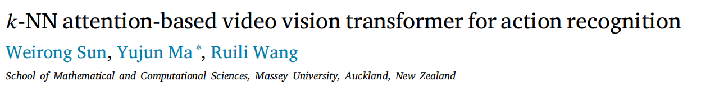

# k-NN attention-based video vision transformer for action recognition

动作识别（Action Recognition）旨在理解人类行为，并为每个动作预测一个标签。最近，Vision Transformer（ViT）在动作识别方面取得了令人瞩目的成绩，它可以对视频中超过空间和时间索引的长序列标记进行建模。全连接的自注意力层是 Vanilla Transformer 的基本关键。然而，视觉Transformer 模型的冗余架构忽略了视频帧块的位置性，这涉及到非信息标记，可能导致计算复杂度增加。为了解决这个问题，我们提出了一种基于k-NN 注意力的视频视觉转换器（k-ViViT）网络，用于动作识别。我们将k-NN注意力用于视频视觉Transformer （ViViT），而不是原始的自注意力，这样可以优化训练过程，忽略输入序列中不相关或有噪声的标记。我们在 UCF101 和 HMDB51 数据集上进行了实验，以验证模型的有效性。实验结果表明，在这些动作识别数据集上，与几种最先进的模型相比，所提出的k-ViViT 实现了更高的准确率。

## 1.简介

动作识别是计算机视觉领域的一项流行研究任务，旨在对视频中的动作进行分类，并开发了许多现实世界的应用[1]，如虚拟现实(VR)、视频检索、智能监控和智能医疗[2-6]。在过去的几十年里，人们提出了许多基于卷积神经网络(cnn)的动作识别方法[7-9]。

近年来，Transformer[10]作为一种主要依赖于自我注意机制的深度神经网络得到了发展。受 Transformer 在自然语言处理（NLP）[11,12] 方面取得的成就的启发，研究人员正在推动 Transformer 成为计算机视觉领域的新范式。后来，Dosovitskiy 等人[13]将 Transformer 网络应用于计算机视觉，推出了视觉转换器（ViT）模型。ViT 是为图像分类而提出的，它将图像划分为多个非重叠块，然后使用一系列线性投影层嵌入块。嵌入的块是变换器编码器的输入。

基于Transformer 的动作识别模式[14-16]类似于 ViT 的块嵌入，可以将单个视频帧分割成小块，然后标记化。例如，Arnab 等人[17] 提出了一种基于Transformer 的模型，命名为视频视觉Transformer （ViViT），它是 ViT 模型的扩展，专为动作识别量身定制，处理输入视频中的正则化时空小管集。Touvron 等人[18]为动作识别引入了一种名为 DeiT 的无卷积Transformer ，它对Transformer 采用了师生策略，并使用蒸馏标记来重现标签。DeiT 模型将图像分割成若干个块，并利用位置嵌入来作为 Transformer 编码器的输入标记。Ma 等人[14]提出了一种基于相对位置嵌入的空间和时间解耦 Transformer 模型，用于动作识别，该模型可减轻绝对位置嵌入和从输入视频中交织学习块中的空间和时间特征所带来的计算复杂性。受此启发，我们以空间和时间解耦的方式构建了我们的模型。

我们发现，上述所有作品[17,19]都有一个共同点，即都使用了vanilla Transformers，这就需要使用自注意。然而，当多头自注意（MSA）建模配对交互时，复杂度与标记数量成二次方关系。复杂度比率与输入帧的增加有关。此外，视觉Transformer 模型的冗余架构忽略了视频帧块的位置性，这涉及到噪声和非信息标记。

为了解决上述问题，我们将k-NN 注意[20]纳入视频变换器模型，从输入帧中选择最相似的标记，以减轻注意机制的复杂性。当相邻标记具有相似趋势时，k-NN 注意机制会扩展 CNN 的局部偏差，同时通过拾取最相关的标记来建立长距离依赖关系。因此，这种方法在加速训练过程的同时，还能有效去除视频中的噪声和非信息标记。

在本文中，我们将这种利用k-NN注意力的时空分解模型称为Dk-ViViT。我们还对Dk-ViViT和Uk-ViViT进行了比较，后者仅使用k-NN注意力而没有时空解耦。

据我们所知，我们是将k-NN 注意力应用于 ViViT 模型的先驱，无论是在基于视频动作识别的k-NN 注意力的开发还是效率分析方面。我们在视觉变换器编码器中采用kNN注意力，而不是使用传统的自注意力机制，以忽略噪声标记并提高变换器的训练速度。我们在 UCF101 [21] 和 HMDB51 [22] 数据集上进行了实验，以验证我们模型的有效性。在两个流行基准（即 UCF101 和 HMDB51）上进行的大量实验表明，所提出的k-ViViT 在定性和定量方面都达到了更高的准确度，其表现优于几个最先进的模型。

本文的其余部分结构如下。在第二节中，我们回顾了相关的动作识别模型和视觉转换模型。然后，我们在第3节中提出了我们的k-ViViT动作识别模型。第4节展示了k-ViViT模型的实验细节。最后，我们在第五节对本文进行总结。

## 相关工作

### 2.1. 动作识别

动作识别通常在时空数据上建立 2D 或 3D [23-26] 卷积层模型。在 Transformer 在计算机视觉领域大显身手之前，CNN 被广泛用于对 ImageNet 等高维数据集上的复杂图像进行分类 [27]。早期的动作识别模型 [28,29] 开始使用手工创建的特征来识别运动信息。自从 CNN 成为最优秀的识别方法后，越来越多的扩展模型 [30,31] 在动作识别中得到完善。AlexNet [32] 是二维图像卷积网络在视频数据集[33-35]中的最杰出成就。Ma 等人[15]提出了一种用于细粒度动作识别的卷积变换器网络（CTN），它利用原始输入视频片段的三维卷积来提取低级时空特征。Liu 等人[33]提出了红外成像下用于人脸表情识别的多标签学习网络，该网络通过柯西（Cauchy）分布函数学习表情多标签。随后，Liu 等人[8]提出了一种人体姿态估计模型，该模型利用联合方向线索和高斯坐标编码，在红外图像的不同场景下实现了准确而灵活的性能。同时，Zhang 等人[34] 针对面部表情识别任务提出了一种基于 CNN 的端到端学习模型，该模型学习相关情绪标签分布，并根据其相似性将多种情绪与面部表情关联起来。

随后，CNNs [36,37] 和 RNNs [38] 成为动作识别骨干的事实选择。随着 Kinetics [39] 等大型数据集的引入，三维 CNN [10,40] 逐渐成为计算机视觉领域的主流方向，这导致了参数数量的增加。Wang 等人[23] 提出了基于多线索的四流三维 ResNets（MF3D）模型用于动作识别，该模型由四个流组成，以提取更有效的时空特征。在这四个流之间注入了三个连接，并在模型中传输不同的线索。随后，Liu 等人[41]提出了一种用于动作识别的时空交互学习双流模型（STILT），该模型开发了一个时空学习模块，使用交替共注意力机制来学习视频中空间特征和时间特征之间的相互关系。Ma 等人[25]提出了一种用于 RGB-D 动作识别的多级因子化时空模型，其中包括一个三维中心差分卷积干模块和多个因子化时空阶段，以捕捉来自不同模态的细粒度运动。Zong 等人[42] 提出了一种基于时空显著性的四流动作识别模型，该模型采用基于多任务学习的 LSTM 来获得长期依赖相关性。Lu 等人[43] 提出了一种用于压缩动作识别的频域模型，该模型利用频域部分解压缩方法从频域数据中有效提取突出的空间和运动特征。空间到频域的师生网络实现了在可接受的精度下降低计算成本。

受Transformer在自然语言处理方面的进步[44]的启发，无论是基于 CNN 和Transformer组合的动作识别模型，还是纯粹的Transformer模型，都逐渐得到了普及。事实证明，Transformer能有效解决捕捉空间和时间维度上的长距离依赖关系这一难题。因此，在本文中，我们采用了视觉Transformer （ViT）模型 [13] 作为基线模型。

### 2.2. 视觉Transformer 

Transformer 是一种新型的深度神经网络，主要基于自我注意机制，可用于 NLP。Transformer 由编码器层和解码器层组成。编码器由多个自注意块和一个前馈层组成。解码器的结构与编码器类似，只是多了一个编码器-解码器注意机制。每一层都使用了残差连接，然后进行层归一化处理。由于其强大的表示能力和广阔的前景，许多研究[45,46]将变换器用于计算机视觉。ViT 最早是由 Dosovitskiy 等人提出的[13]，他们将纯变换器应用于分割图像片段序列。

有很多模型将 Transformer 与卷积结合在一起。例如，Girdhar 等人[47] 提出了一种基于卷积的 Transformer 模型，将从物体相关区域提取的特征聚合在一起，用于人类动作识别。Liu 等人[48]提出了一种用于动作识别的视频 Transformer 中位置模型的归纳偏置，它利用时空因式分解在全局范围内计算自我注意力。另一个具有代表性的基于 CNN 增强 Transformer 的动作识别模型是 [45]。时空注意力网络（STAN）引入了感应偏置通孔卷积，以提高计算效率。该模型扩展了双流 Transformer 模型，以学习用于长视频分类的时间依赖性。该模型用预先训练的 CNN 提取的空间和时间信息取代了标记化方法。

虽然大多数基于 CNN 的模型可以集成到任何设计中并扩展其优势，但它们在处理视频中的位置和时间信息时仍然存在缺陷。纯变换器模型取消了卷积集成架构，并被应用于位置和时间信息问题。例如，针对动作识别提出的 TimeSformer [49]，允许从帧级补丁序列中学习时空特征。TimeSformer 是一种无卷积模型，建立在空间和时间维度上的特定自我注意上，并开发了一种 "分割注意"，以在每个 Transformer 块中分离空间和时间注意。Sharir 等人[50] 在视觉 Transformer 模型中没有使用三维卷积层，而是提出了一种用于动作识别的全局注意力时空 Transformer 模型，从空间和时间输入中进行子采样，然后通过训练从输入视频帧的分数中学习空间和时间表示。该模型在审查少量视频帧而不是学习整个视频时，减少了计算量并保持了准确性。Arnab 等人[17]开发了几种变体编码器中的空间和时间维度因式分解模型，如因式分解编码器、因式分解自注意和因式分解点积。论文结果表明，一些数据集在未因子化模型上表现良好。Yan 等人[19]提出了用于视频识别的多视图变换器（MTV），它针对不同的视频视图拆分编码器，并利用横向联系进行信息融合。MTV 在捕捉时间特征的标记上使用了多头自我关注。

然而，ViT 的冗余结构忽略了视频帧块的位置性，涉及非信息和噪声标记，在训练过程中效率低下。为了解决上述问题，我们提出了一种基于 ViViT 模型的纯Transformer模型，用于动作识别。该模型使用k-NN注意力来选择最相似的标记，并在计算自我注意力时过滤掉噪声标记，从而在相对较小的数据集中进一步减少过拟合。

## 3.k-NN视频视觉Transformer

我们首先介绍 ViT 模型，然后在第 3.1 节将讨论扩展到 ViViT。ViViT 是我们模型的基础结构。然后，我们将在第 3.2 节中讨论k-NN 注意力，它不同于 ViviT 中的虚构自我注意力。最后，我们将在第 3.3 节中介绍我们提出的基于k-NN 注意力的 Transformer 模型，用于动作识别。

### 3.1. 起源:ViT和ViViT

ViT 将 NLP 中的 Transformer 模型转换为二维图像分类。特别是，ViT 将一幅图像 $𝑥_𝑖∈ R^{h× 𝑤 × 𝑐 }$分割成 𝑁 个不重叠的图像块，$𝑥_𝑝∈ R^{n × ( 𝑝^2 ⋅ 𝑐 ) }$、 𝑐是通道数，h × 𝑤 是初始图像的分辨率，$𝑝^2$ 是分区图像块的分辨率。然后，将这些图像块线性投影并光栅化为一维标记$𝑧_𝑖 ∈ R^𝑑$。这种标记化将通过下面的Transformer编码器进行转发：

其中，线性投影𝐸 可视为二维卷积。所有标记被串联起来形成一个具有$𝑧_{𝑐𝑙𝑠}$的序列，该序列在编码器服务的最后一层作为学习标记[51]被预置。此外，$𝑝 ∈ R^{𝑁 ×𝑑}$ 指的是学习到的位置嵌入，它也被添加到标记中以保留位置信息。

ViT和ViViT的区别在于嵌入视频剪辑。ViT嵌入到视频中的扩展是ViViT，它从输入视频中提取一个不重叠的时空“小管”并进行线性投影。与从视频中均匀采样$n_𝑡$帧相比，tubelet 的嵌入维度为 𝑡 × h × 𝑤 ，$n_𝑡 = [ {𝑇\over 𝑡} ] $、 $n_h = [ {H\over h} ] $和$n_w = [ {W\over w} ] $，令牌分别从时间、高度和宽度维度获得收益。然后，总共$n_𝑡⋅ n_ℎ⋅ n_u$令牌将被传递到Transformer编码器中。换句话说，小管嵌入可视为构建三维块，在标记化过程中融合了时空信息，如图 1 左侧所示。在层归一化（LN）块之后，Vanilla ViT 和 ViViT 模型的转换嵌入中包含了多头自注意（MSA）。多层感知器（MLP）块也需要在 LN 块之后的Transformer编码器中使用，它由两个线性投影组成，并由 GELU 非线性分隔[52]。MSA 块和 MLP 块如下：

其中𝓁表示L个Transformer编码器中的每一层。

### 3.2. Vanilla self-attention and k-NN attention

如图 1 右侧所示，当嵌入令牌通过Transformer编码器时，MSA [10] 和 LN [53] 会对令牌进行 L 次处理。残差连接是在自注意块之后进行的。Vanilla self-attention 是 Transformer 中的点积注意力。注意力矩阵𝐴是根据序列中两个元素与其查询𝑄 和关键词组 𝑄 之间的成对相似度计算得出的[13]，其定义为：

如Eq.(4)所示，$𝑄∈R^{n×𝑑}$表示查询，$𝐾∈R^{n×𝑑}$表示键，𝑑表示维度。新值$\hat 𝑉̂$ 是通过将值𝑉 与注意力矩阵𝐴 相乘计算得出的，如下所示：

直观地说，公式 (5) 表示对旧值的加权平均，注意力矩阵定义了Transformer中的权重。根据 vanilla Transformer 的知识，通过对输入标记𝑋 的线性投影计算出𝑄, 𝐾和 𝑉：

其中$𝑊_𝑄, 𝑊_𝐾 , 𝑊_V$为可学习权值。目前，ViViT模型在视频动作识别方面取得了成功。然而，vanilla self-attention的缺点是在计算不相关和有噪声的令牌时, 会降低计算效率和准确性，尽管离散标记的权重较小。完全连接的自我注意需要每个标记来计算注意图，包括关于杂乱背景和遮挡情况的嘈杂标记。这个问题导致了一个漫长的培训过程。完全连接的自我注意需要每个标记来计算注意图，包括关于杂乱背景和遮挡情况的嘈杂标记。这个问题导致了一个漫长的培训过程。

k-NN注意力的开发是为了在自我注意力机制中为每个查询选择最相关的键（key）和值（value）[20]。最初，k-NN 注意力有两个版本：慢速版本和快速版本。在最初的方法中，使用欧氏距离来计算每个查询的最相关键和值。然而，由于需要计算不同键之间的距离，计算速度特别慢。根据文献 [20]，k-NN 注意的快速版本利用了矩阵乘法运算的优势。它的有效性已在 11 种不同的视觉转换器模型中得到了经验验证。Wang 等人[20]提供的经验证据表明，所提出的k-NN 注意力机制可将全局和局部视觉转换器的分类性能提高 0.8%。因此，本文只讨论k-NN 注意的快速版本。k-NN快速版的具体做法是在softmax计算中逐行选择顶端k元素，$T_k(·)$，如下所示：

我们提出的模型标志着使用k-NN 注意机制的视频视觉转换器模型初步实现了卓越性能。ViViT 模型中原有的 MSA 机制需要计算线性增强输入帧所嵌入的所有标记。MSA 的计算复杂度变成了二次方。同时，视频数据集中存在一些冗余的输入帧，如杂乱的背景、不相关的物体和没有动作发生的输入帧。因此，我们首次在 ViViT 模型中采用k-NN 注意力来替代全连接注意力。根据k-NN 注意的细节，我们发现k-NN 注意会从序列中收集最靠前的k个相似标记来计算注意图，而不是使用所有的输入标记。我们的模型在提高训练速度和减少输入标记噪音的影响方面非常稳健。

### 3.3. k-NN基于注意力的视频视觉Transformer

如图1所示，我们提出了一个k-NN基于注意力的pure-Transformer动作识别模型。我们的模型受到ViViT的启发，可以更有效地扩展时空转换器的注意力。在分解后的编码器上也采用了注意机制，如图2所示，提高了网络训练速度，减少了视频中的噪声token，便于动作识别。

#### 3.3.1. 预训练模型

如图1所示，我们提出了一种高效的视频视觉Transformer用于动作识别。根据CNN模型中两个数据集的巨大成功，我们从小视频数据集的数据增强开始，这将在第4节中介绍。

同时，针对小视频数据集，我们从预训练的图像模型初始化pure-Transformer模型。在ViT模型中，图像位置嵌入维数为$n_𝑤⋅n_h×𝑑$。然而，ViT模型不同于我们的三维视频模型，我们的模型比原来的ViT模型有$n_𝑡$倍的token。这样，位置嵌入从$R^{n_𝑤⋅n_h×𝑑}$初始化为$R^{n_t·n_𝑤⋅n_h×𝑑}$，得到相同嵌入的相同空间索引。根据我们模型中的三维张量，我们建议使用“中心帧初始化”[17]对除中心以外的所有时间位置初始化嵌入权值为零。

因此，模型从之前的视频帧中学习时间信息。

#### 3.3.2. 未分解k-NN视频视觉Transformer(Uk-ViViT)

我们还提出了一个k-NN基于注意力的Transformer模型，它扩展了[17]的第一个未分解模型。我们使用tubelet嵌入将输入帧嵌入到令牌中，令牌包括时间、高度和宽度维度，然后将其馈送到Transformer编码器。在每个Transformer层的所有时空标记之间对所有的成对交互进行建模，从而使未分解的视频Transformer通过视频对远程交互进行建模。

此外，在每个Transformer层的LN块之后添加了快速版本的k-NN注意。我们的模型选择按行排列的top-k元素进行softmax计算，以减少噪声标记，加快训练过程。该机制只考虑最上面k相似度最高的块，这意味着选择一个合适的k值对块的相似度高具有重要意义。虽然在ViViT中，全连接的自注意具有捕获远程依赖的能力，但缺陷是在点积注意中混合了不相关的块，使得训练过程缓慢。因此，所提出的Uk-ViViT模型影响了与目标类相关的重要视觉块的收敛速度。

#### 3.3.3. 分解k-NN编码器(Dk-ViViT)

该模型由两个Transformer编码器组成，分别被分解为空间编码器和时间编码器。首先，从同一时间索引中提取的token输入空间编码器，如图2所示。点积注意被空间编码器中的kNN注意所取代，该编码器仅模拟来自相同时间索引的令牌之间的相互作用。然后，在$𝐿_𝑠$空间层之后，给出每个时间索引的表示，即$h_i∈R^𝑑$。$z^{𝐿_𝑠}_{𝑐𝑙𝑠}$是𝑐𝑙𝑠令牌到时态编码器输入的前缀。将帧级表示,$h_i$,连接到$𝐻∈R^{n_𝑡×𝑑}$中，经过层归一化后通过k-NN注意。时间编码器由$𝐿_𝑡$ Transformer层中的k-NN attention和MLP组成，用于模拟不同时间索引中的令牌之间的交互。然后，在模型的最后对输出进行分类。虽然Dk-ViViT模型可以比Uk-ViViT拥有更多的Transformer层，但Dk-ViViT通过增加k-NN注意机制(例如背景信息或其他对象排除主要对象)，实现了更少的浮点运算，减少了不相关图像块的混合。

## 4.实验设置

### 4.1. 数据增强

我们采用随机裁剪、翻转和颜色抖动作为数据增强策略，以增加训练样本的数量。随机裁剪尤其能提高模型的准确性和稳定性。我们采用 Mixup [54] 作为优化方法，它是一种学习原理，可以缓解大量记忆损坏标签的问题。我们的增强策略包括随机裁剪、翻转、颜色抖动和其他正则化，如 Kinetics-400 初始化、随机深度[55]、随机增强[56]、标签平滑[57]和 Mixup [54]，以增强 Transformer 在小型视频数据集中的鲁棒性和准确性。

### 4.2. 模型配置和训练

我们的骨干网络遵循 ViViT，预训练模态与 ViT 相同。我们设定𝐿 = 12 为 Uk-ViViT 的变换层数，$𝐿_𝑠 = 8$ 为 Dk-ViViT 的空间变换层数，$𝐿_𝑡 = 4 $为 Dk-ViViT 的时间变换层数。批次大小为 8 到 160 个历时。输入帧数为 8，帧间隔为 32。我们还对这些模型使用了相同的命名方案（例如，k-ViViT/16 × 2 表示 ViViT 是主干，而 tubelet 大小为 h× 𝑤 × 𝑡 = 16 × 16 × 2）。请注意，tubelet 的高度和宽度是相等的。因此，tubelet 的尺寸越小，包含的标记就越多，从而进一步增加了计算量。k是k-NN 注意中唯一极其重要的参数，对于简单的标记生成方法，k 值的一般规则是在每个规模阶段将 k 设为$n\over2$ 左右。复杂的令牌生成方法会在每个刻度阶段使用 ${2\over 3}n$或 ${4\over 5} n$，n 表示令牌总数。我们使用动量为 0.9 的同步 SGD，微调期间的余弦学习率安排和线性热身基于 [17] 的 160 个 epoch。遗憾的是，由于 GPU 内存和处理能力的限制，我们无法在 Kinetics 数据集[39]上对我们的模型进行测试。不过，值得注意的是，我们的模型在两个著名的动作识别数据集上表现出了卓越的性能。这些数据集涵盖了广泛的动作，包括人与人的交互和人与物体的交互。

#### 4.2.1. 数据集

我们使用两个公共动作识别数据集UCF101[22]和HMDB51[22]来评估我们的模型。

**UCF101 [21]**是一个动作识别数据集，包含来自YouTube的13320个逼真的动作视频，分配给101个类，超过13k个剪辑和27小时的视频。它包括各种各样的动作，在相机运动[58]，物体细节和不同的环境中具有巨大的变化。该数据集被简单地分为五类，并显示了来自同一视频的一些片段。训练数据集包含大约9.4万个视频，测试数据集包含大约3.7万个动作视频。

**HMDB51 [22]**由6.8k个动作视频和51个动作类组成，主要收集自电影和YouTube。拆分方法类似于UCF101数据集。HMDB51将数据集分成训练、测试和验证数据集。在实验中，我们采用三次分割的平均准确率作为动作识别的最终准确率。

### 4.3. 消融研究

#### 4.3.1. 输入标记化

我们在HMDB51上使用Uk-ViViT来考虑不同输入编码方式的效率。当帧间隔为32时，我们采样8帧，并设置长度为𝑡= 4的tubelet。我们针对不同的输入编码方法提出了我们的模型。如表1所示，“中心帧初始化”比“均匀帧采样”和“过滤器膨胀”[40]获得了最好的性能。ViT提供了“均匀帧采样”方法，该方法对帧进行采样并独立嵌入二维帧。然而，“中心帧初始化”考虑3D卷积滤波器从输入视频中提取tubelet用于动作识别。因此，我们考虑对所有实验使用“中心帧初始化”编码方法。

#### 4.3.2. 改变k-NN注意力的k值

我们首先在表 2 中处理了时间维度上不同标记数目的准确率结果。我们注意到，在我们所有的模型中，使用较小的tubelet 尺寸具有更高的准确性。

根据ViViT中最先进的结果，它们始终使用224的空间分辨率。因此，我们将224的分辨率输入到模型中。然后，我们采用适当数量的令牌，并证明k的值。直观地，我们通过使用不同的k值来比较Uk-ViViT的精度，${n\over 2},{{2\over 3 }n} $ 或者${4\over 5}n$表示HMDB51和UCF101上的计算k值。我们考虑使用Uk-ViViT/16x2和Dk-ViViT/16x2作为Transformer编码器的输入，对比如表3所示。此外，对于Dk-ViViT模型，空间编码器和时间编码器的k值是相同的。我们在HMDB51和UCF101的相同尺度阶段比较了我们提出的模型。

根据第3节的结果，我们注意到k值在${2\over 3}n$和${4 \over 5}n$之间没有显着差异。但是，$n\over 2$和${2\over 3}n$之间的精度差距较大。

#### 4.3.3. 模型变体

表 4 列出了我们提出的 UCF101 和 HMDB51 模型在效率和准确性方面的变体。表 4 中的所有模型都以 ViViT 为骨干，tubelet 大小为 16 × 2。原始 ViViT（时空）模型中的Transformer层数与 Uk-ViViT 相同，设置为 12 层。同时，我们将因式编码器模型中的空间Transformer层数设为 8。此外，在因式编码器和分解k-NN 编码器中，时间Transformer的数量设为 4。一个显著的缺点是，输入帧块本身包含非信息标记和无关信息，可能会在动作识别中造成误读。因此，我们提出了基于k-NN 的注意力时空因子化模型，从整个帧中选择最相关的标记，从而加快训练过程，提高动作推理的准确性。根据表 4 的结果，分解k-NN 编码器在 UCF101 和 HMDB51 上的表现最好。我们比较了 ViViT（模型 1、模型 2）[17]、Uk-ViViT 和 Dk-ViVIT 在 UCF101 和 HMDB51 上的 Top-1 准确率结果。实验结果表明，k-NN 注意在 Dk-ViViT 的动作识别中非常有效。如表 4 所示，在分解空间编码器和时间编码器方面，我们提出的模型在 HMDB51 和 UCF101 上分别提高了 7.5% 和 15.4%。这表明k-NN 注意机制可以在 ViViT 模型的基础上进一步提高准确率，即使放弃无关标记也是如此。

#### 4.3.4. 在空间和时间领域的有效性

我们进行了额外的消融研究，通过将k-NN注意机制分别应用于Dk-ViViT的空间和时间编码器，来评估其在空间和时间领域的有效性。我们在表5中详细说明了配置和结果。具体来说，Dk-ViViT-S是指k-NN注意力只在空间编码器中使用，而时间编码器保留了自我注意。另一方面，Dk-ViViT-T表示k-NN注意只在时间编码器中使用，而空间编码器继续使用自注意。Dk-ViViT表示k-NN注意力在空间和时间域中的实现。如表5所示，Dk-ViViT在四种配置中分类得分最高，说明k-NN在时空上都是有效的。我们认为，在空间域中，k-NN可以有效地过滤掉噪声和非信息标记化的块，而在时间域中，它擅长于选择与动作最相关的帧。因此，在DkViViT的最终配置中，我们将k-NN的注意力同时应用于空间和时间编码器。

### 4.4. 与最先进的比较

我们比较了几种最先进的动作识别模型在UCF101和HMDB51上的性能，如表6所示。从骨干类型、出版年份、Top-1准确性三个方面进行对比。对比方法包括基于cnn的模型和基于pure-Transformer的模型。

我们最初采用预训练模型，随后在HMDB51和UCF101数据集上微调权重参数。值得注意的是，我们的模型在HMDB51和UCF101数据集上的性能优于几个pure-Transformer模型。根据表6，我们将我们的模型与2023年发布的最先进的模型进行了比较。TTSN模型[66]仅采用时序Transformer编码器，并使用ResNet-50作为模型的混合主干，在UCF101上取得了相对较高的精度。然而，在HMDB51数据集上的性能并不显著，我们认为这是由于模型的空间特征学习不足。

SCT-L[65]在HMDB51和UCF101上实现了最高的精度，这归功于其在HMDB51和UCF101上微调之前在Kinetic-400上的预训练。这突出了用大规模训练集初始化模型的重要性，这种实践可以显著增强Transformer模型的能力。综上所述，现有的结果证明了我们提出的k-ViViT模型用于动作识别的有效性。我们提出的Dk-ViViT模型在HMDB51上的精度为82.5%，比I3D模型高16.1%，比STS模型高20.1%，比SVT模型高15.3%，比TTSN模型高2.3%。此外，我们提出的Dk-ViViT模型在UCF101上的准确率为94.2%，比I3D模型高0.8%，比STS模型高4.1%，比SVT模型高0.5%。我们提出的Dk-ViViT模型优于几种基于cnn和pure-Transformer的并发模型。

## 5. 结论及未来工作

在本文中，我们提出了一个k-NN基于注意力的视频视觉Transformer(k-ViViT)模型用于动作识别，该模型加快了训练过程并忽略了输入视频中不相关或有噪声的标记。在保持计算效率的同时，所提出的模型在两个动作识别基准上优于纯transformer模型所取得的各种最新结果。此外，我们证明了一种有效的数据增强策略来提高性能。我们未来的工作将集中在开发自我监督的预训练Transformer模型，用于动作识别，以及更复杂的任务，如视频字幕和手语翻译。

