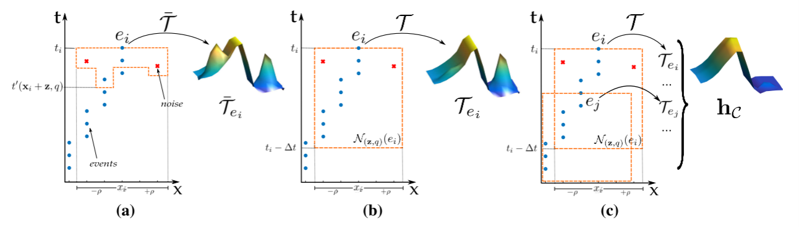
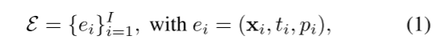
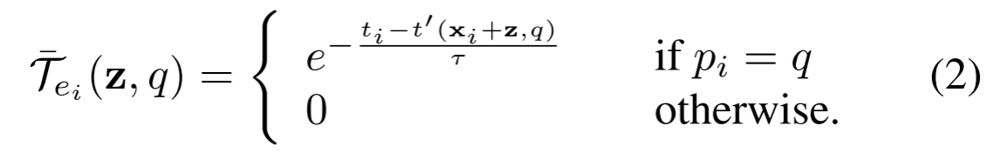
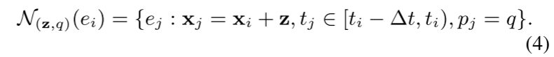
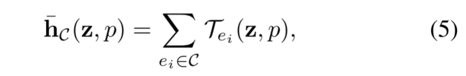
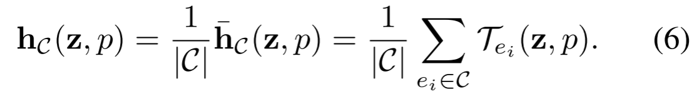
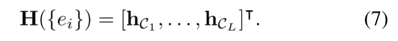
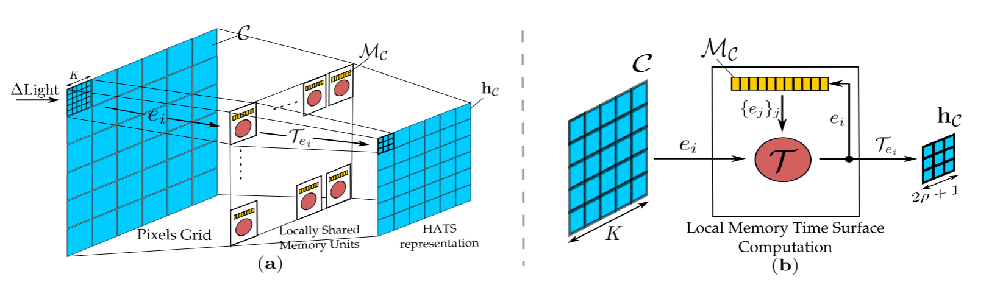
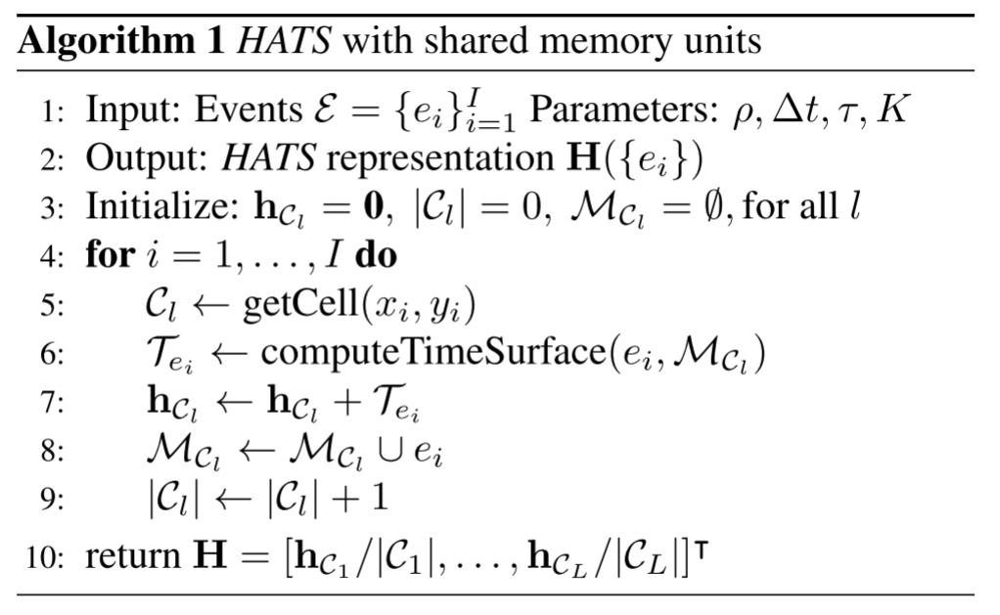

# HATS: Histograms of Averaged Time Surfaces for Robust Event-based Object Classification

> 与传统的基于帧的相机相比，基于通风口的相机在高时间分辨率、低功耗和高动态范围方面具有优势，因此最近引起了计算机视觉界的注意。这些特性使基于事件的相机成为自动驾驶汽车、机器人导航或无人机视觉等的理想选择。然而，基于事件的对象分类算法的准确性仍然远远落后于基于帧的算法，这对于任何在现实世界条件下可靠的系统工作都至关重要。造成这种性能差距的两个主要原因是：1。缺乏基于事件的对象分类和2。缺乏大型基于真实世界事件的数据集。在本文中，我们解决了这两个问题。首先，我们介绍了一种新颖的基于事件的特征表示以及一种新的机器学习架构。与以前的方法相比，我们使用局部记忆单元来有效地利用过去的时间信息，并建立一个稳健的基于事件的表示。其次，我们发布了第一个用于对象分类的基于真实世界事件的大型数据集。我们通过大量实验将我们的方法与最先进的方法进行了比较，显示出更好的分类性能和实时计算。

## 4. Method

图2:在噪声存在的情况下，围绕事件ei的时间面计算。有噪声的事件用红叉表示，无噪声的事件用蓝点表示。为了清晰的可视化，只显示事件流的x-t分量和单一极性。(a)在[30]中，时间面$\bar T_{e_i}$ (Eq.(2))的计算方法是只考虑在ei(橙色虚线)附近的最后一个事件的$t ' (x_i +z, q)$。因此，嘈杂的事件在$\bar T_{e_i}$中具有很大的权重。这是从$\bar T_{e_i}$表面的假峰上可以看到的。(b)相比之下，(3)式的局部记忆时间面$T_{e_i}$的定义考虑了所有过去事件在一个时空窗口下$N_{(z,q)}(e_i)$的贡献。这样，计算T时考虑的噪声事件的比例更小，结果更好地描述了底层事件流的真实动态。(c)时间表面可以通过对邻域内所有事件的时间表面进行空间平均来进一步正则化(式(6))。由于空间和时间的正则化，噪声的贡献几乎完全被抑制。

### 4.1. Time Surfaces

给定一个像素网格大小为M×N的基于事件的传感器，事件流由序列给出

其中xi = (xi, yi)∈[1，…， m]×[1， ...，N]为产生事件的像素坐标，ti≥0为事件产生的时间戳，i < j时ti≤tj, pi∈{−1,1}为事件的极性，−1,1分别表示OFF和ON事件，i为事件个数。从现在开始，我们将用ei引用单个事件，用{ei}引用一系列事件。

在[30]中，引入时间面的概念来描述事件周围的局部时空模式。**时间曲面**可以通过$\bar T_{e_i}(·，·):[−ρ， ρ]^2 ×\{−1,1\}→R$来形式化为作用于事件$e_i$的局部空间算子，其中**ρ是用于计算时间曲面的空间邻域的半径**。

**对于事件ei = (xi, ti, pi)**，并且$(z, q)∈[−ρ， ρ]^2 ×\{−1,1\}$，$\bar T_{ei}$由

其中$t ' (x_i + z, q)$是从像素$x_i + z$接收到的<u>最后一个极性为q的事件的时间(图2(a))</u>，而τ是一个衰减因子，赋予过去进一步事件更少的权重。**直观上，时间表面编码事件附近的动态上下文，因此提供时间和空间信息**。因此，这种场景内容的紧凑表示可以对不同的模式进行分类。

### 4.2. Local Memory Time Surfaces

为了构建特征表示，我们首先对Eq.(2)的时间面$\bar T_{e_i}$进行泛化。如图2(a)所示，仅使用时间面像素xi附近接收到的最后一个事件的时间$t ' (x_i + z, q)$，就得到了一个对噪声或事件流中的小变化过于敏感的描述符。

为了避免这个问题，我们通过**在一个大小为∆t的时间窗口**中考虑事件的历史来计算时间面。更准确地说，我们将一个局部记忆时间表面$T_{e_i}$定义为

其中：

如图2(b)所示，该公式在抵抗噪声和小的事件变化的同时，更健壮地描述了场景的真实动态。在补充材料中，我们比较了使用Eq.(2)或Eq.(3)在一个对象分类任务中获得的结果，显示了使用局部记忆公式获得更好的准确性的优势。

局部记忆时间表面的名称来自于这样一个事实，**即N(z,q)(ei)中的过去事件{ej}需要存储在内存单元中**，以防止算法“忘记”过去的信息。在第4.4节中，我们将描述内存单元如何被相邻的像素有效地共享。通过这种方式，我们可以在不显著增加内存需求的情况下计算出一个健壮的特征表示。

### 4.3. Histograms of Averaged Time Surfaces

式(3)的局部记忆时间面是我们在方法中使用的基本时空算子。在本节中，我们将描述如何使用这种新的时间表面来定义对对象分类有用的事件流的紧凑表示

受基于框架的视觉中的[13]的启发，我们**将相邻的像素分组在大小为$K ×K$的单元格$\{C_l\}^L_{l=1}$中**。然后，**对于每个单元C，我们将C中的事件计算的时间表面的成分求和成直方图。**更准确地说，对于单元格C，我们有:

其中，滥用符号时，如果且仅当事件的**像素坐标（xi，yi）属于 C 时，我们将 ei 写为∈C**。

基于事件的传感器的一个特征是，运动物体产生的事件数量与它的对比度成正比:高对比度的物体比低对比度的物体产生更多的事件。为了使单元格描述符更不变化，因此，我们根据用于计算它的时空窗口中包含的事件|C|的数量对$\bar h$进行规范化。这就产生了平均直方图:

一个细胞直方图$h_C(z, p)$的例子如图2(c)所示。给定一个事件流，我们最终的描述符，**我们称其为平均时间面直方图的HATS，是通过连接每个$h_C$给出的，对于所有位置z，极性和单元格1，…， l:**

图3(a)显示了我们方法的概述。与标准的计算机视觉方法类似，我们可以进一步将相邻的细胞分组为块，*并执行块归一化方案*，以获得速度和对比[13]更大的不变性。在第6节中，我们展示了与以前的方法相比，这种简单的表示是如何获得基于事件的对象分类的更高精度的。

图3:提议的体系结构的概述。(a)将像素网格划分为大小为K×K的单元格C。当一个像素检测到光的变化时，就会生成一个事件ei。然后，计算时间面Tei，用于更新直方图hC。HATS表示由直方图hC串接得到。(b)使用本地存储单元进行本地存储时间表面计算的细节。对于每个输入事件，Eq.(3)的时间面是通过使用存储在单元的本地内存unit $M_C$中的过去事件$e_j$ 's来计算的(第4.4节)。计算完成后，使用Tei更新对应cell的直方图$h_C$，将事件$e_i$添加到内存单元。为简单起见，事件的极性和直方图的标准化在方案中不被考虑。

### 4.4. Architecture with Locally Shared Memory Units

事件相机中的不规则访问是设计高效的事件相机算法的一个众所周知的限制因素。主要问题之一是，由于事件的稀疏性和异步性，标准硬件加速(如GPU)的使用并不是微不足道的。例如，在处理基于事件的数据时，访问连续内存块上的空间邻居可能会带来很大的开销。

事件相机中的不规则访问是设计高效的事件相机算法的一个众所周知的限制因素。主要问题之一是，由于事件的稀疏性和异步性，标准硬件加速(如GPU)的使用并不是微不足道的。例如，**在处理基于事件的数据时，访问连续内存块上的空间邻居可能会带来很大的开销。计算HATS表示的架构允许克服这个内存访问问题(图3)**。从公式(5)中我们注意到，对于每个传入的事件ei，我们需要迭代过去时空邻域中的所有事件。因为，**对于小的ρ值，大多数过去的事件将不在ei的附近**，循环通过整个时间有序的事件流将是非常昂贵和低效的。为了避免这种情况，我们注意到，**对于ρ≈K，落在同一个单元C中的事件，将共享用于计算Eq.(3)的大多数相邻的N(z,q)**。根据这一观察，对于每个单元，我们定义一个共享存储单元MC，其中存储与C相关的过去事件。这样，当新的事件到达C时，我们只通过循环MC来更新Eq.(5)，因为MC只包含过去的相关事件，从而计算Eq.(3)的本地记忆时间面(图3(b))。

算法1描述了带有内存单元的HATS的计算。虽然这不是本文的范围，但我们注意到算法1可以很容易地并行化并在专用的神经形态芯片中实现[62]。