# Spike timing-based unsupervised learning of orientation, disparity, and motion representations in a spiking neural network

尖峰神经网络中基于时间的方向、视差和运动表征的无监督学习

> 2021 CVPRW
>
> 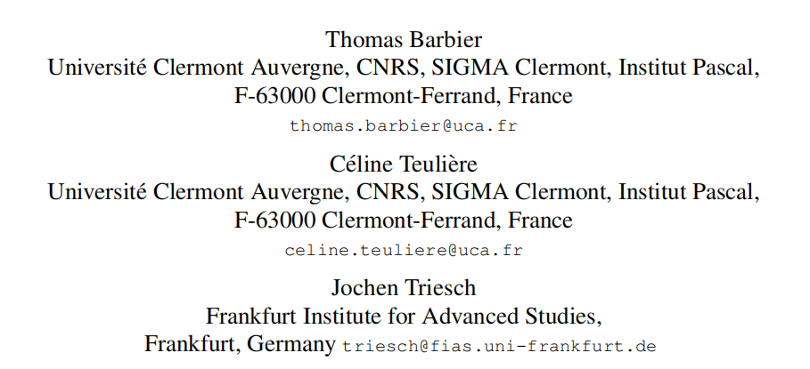
>
> 神经形态视觉传感器比基于帧的视觉传感器具有独特的优势。然而，从其异步输出的有效视觉表示的无监督学习仍然是一个挑战，需要重新思考传统的图像和视频处理方法。在这里，我们提出了一个由泄漏的整合和点火神经元组成的网络，它通过两个基于事件的视觉传感器的输入来学习类似于哺乳动物初级视觉皮层中的简单和复杂细胞的表征。通过结合尖峰时间依赖的可塑性和稳态机制，该网络以一种完全无监督的方式学习视觉特征检测器的方向、视差和运动。我们在一个移动机器人平台上验证了我们的方法。
>
> `pdf`:<https://pan.baidu.com/s/1ZXlkX1t3fYg469zT7789xw?pwd=964o>

第一个使用基于时间的可塑性规则学习复杂细胞的模型，展示了基于事件的视觉传感器输入的方法。

总的来说，我们的贡献如下:1.)我们提出了一种新的神经网络学习简单和复杂的细胞样接受域双目事件输入使用生物学似是而非的学习机制。2.)我们证明，学习的表示符合生物学的发现，并反映了输入信号的统计特性，在其分布的方向，运动和视差调整。3.)我们在一个移动机器人平台上验证了我们的方法。

## 方法

### 3.1. Leaky Integrate and Fire Neuron

LIF神经元，就像真正的神经元一样，是通过称为突触的加权连接来连接的。突触将信息从一个神经元传递到另一个神经元。突触的强度是可塑的，也就是说，它可以随时间变化。修改突触权值是控制尖峰神经网络行为的主要方法。这里，为了简单起见，我们使用静态值Vrest为0。指数衰减速度由膜时间常数τm控制。

当LIF神经元在t时刻接收到来自突触的输入(称为“突触前”输入)时，它的膜电位变化量wi。设∆t是电流输入到神经元的前一个输入的时间。那么新的膜电位可以在输入到达时直接计算为:

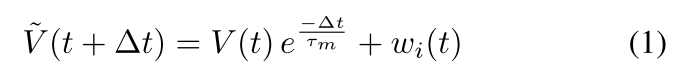

如果膜电位超过阈值Vθ，则神经元称为“刺突”。它产生一个动作电位，然后通过突触传播到其他神经元。然后将其膜电位重置为Vrest = 0:

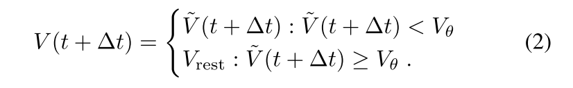

### 3.2体内平衡机制

3.2.1不应期

当神经元出现峰值时，它进入了一个低兴奋期，称为不应期。在频繁和/或大的输入情况下，这强烈限制了神经元的峰值频率。我们通过在每一个峰值后产生的痕量$η_{RP}$，然后以$τ_{RP}$定义的速率指数衰减回零来模拟一种难解机制。膜电位更新为:

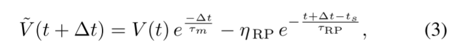

ts是神经元最后一次脉冲的时间。

3.2.2阈值和峰值速率适应

**基于事件的相机在输出频率上呈现出一种内在的可变性，这取决于光照条件、纹理数量或物体的相对速度等因素。这意味着神经元在运行过程中会受到可变数据率的影响，这反过来会导致其峰值率的高度变异性。**虽然这在某种程度上是不可避免的，但在不同的条件下，最好保持神经元的尖峰率在一个合理的范围内。生物学通过各种各样的内稳态机制来处理这个问题，无论是在神经元的核心部位，体细胞，还是在输入信号的部位，突触。

我们实施了两个这样的机制。第一个目标是长期监管。它根据神经元的峰值活动S(t)不断平衡阈值Vθ的值，以达到目标峰值速率S∗。它可以写成:

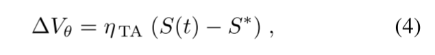

由ηTA控制阈值的适应速度。S(t)是通过计算在过去10秒内发生的峰值的数量来计算的。**阈值更新每秒钟发生一次，因此对于处理全局光照和速度条件来说，这是一个有点慢的过程。我们定义了一个最小阈值$V_{θ min}$，以避免在输入很少的区域捕捉相机噪声。**

**对于局部变化，我们使用一种更快的过程，称为峰值速率适应。就像阈值适应一样，它依赖于神经元的活动。**当神经元出现峰值时，微量的$V_{SRA}(t)$增加到$η_{SRA}$值。根据参数$τ_{SRA}$，每一个突触前输入都会减去这一轨迹，并指数衰减回0。膜电位内部更新为:

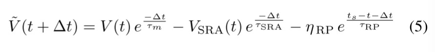

这种调节机制在峰值发生后立即起作用。通过选择一个相对较小的时间常数$τ_{SRA}$(几百毫秒量级)，峰值速率适应机制的影响只在较短的时间内可见，这与较慢的阈值更新相补充。

3.2.3侧抑制

除了兴奋性突触外，我们的神经网络还使用侧抑制性突触连接。然而，与生物学相比，我们简化了抑制的机制。我们并没有将特定的神经元指定为抑制细胞的角色，而是简单地认为某些神经元可以直接相互抑制。具体来说，当一个神经元突增时，它会立即通过从其膜电位中减去固定值$η_{INH}$来抑制其邻近的神经元。这种机制引入了邻近神经元之间的强烈竞争。

### 3.3依赖时间的可塑性

脉冲时间依赖可塑性(STDP)是神经系统的一种基本学习机制。如果一个神经元的刺突导致另一个神经元也刺突，那么从第一个神经元到第二个神经元的突触连接将得到加强。相反，如果突触后神经元在突触前神经元之前出现峰值，这通常会导致突触连接的减弱。这种简单的机制已经通过所谓的STDP规则[3]在snn中产生了一种最流行的无监督学习技术。STDP有很多不同的表述，但其主要思想是一致的。突触权值的演化取决于突触前和突触后峰值之间的相对时间。长时程增强(LTP)发生在突触前尖峰到达突触后尖峰之前。相反会导致长期萧条。

在我们的网络中，权重更新直接发生在神经元突触后。我们会记录每个突触前尖峰 ti 和最后两个突触后尖峰 ts 和 ts-1 的准确时间。突触权重的更新可写为

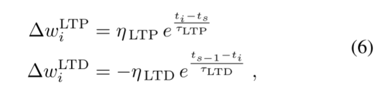

其中ts≥ti≥ts−1。$η_{LTP}$和$η_{LTD}$是控制势化窗和降窗高度的参数，而$τ_{LTP}$和$τ_{LTD}$控制势化窗的宽度

3.3.1权重归一化

上面的STDP规则不包括权重限制机制。为了提高稳定性和避免突触权值的无界增长，我们强制权值为正，并使用单独的权值归一化，其中来自每个事件极性(on和off)输入的突触分别归一化，以总和为一个目标值。

3.3.2不同延迟的平行突触

作为最后一种机制，我们允许传感器阵列的一个像素通过多个具有不同传输延迟的“并行”突触连接到网络中的一个神经元。这使得这些神经元能够通过STDP学习光流的表示。

### 3.4尖峰神经网络结构

3.4.1基于事件的像素阵列

基于事件的摄像机像素阵列作为SNN的输入层。基于事件的摄像机记录事件的极性，指示光强度变化的迹象。因此，如图 1 所示，我们根据事件的极性（开和关）将其分为两幅图。

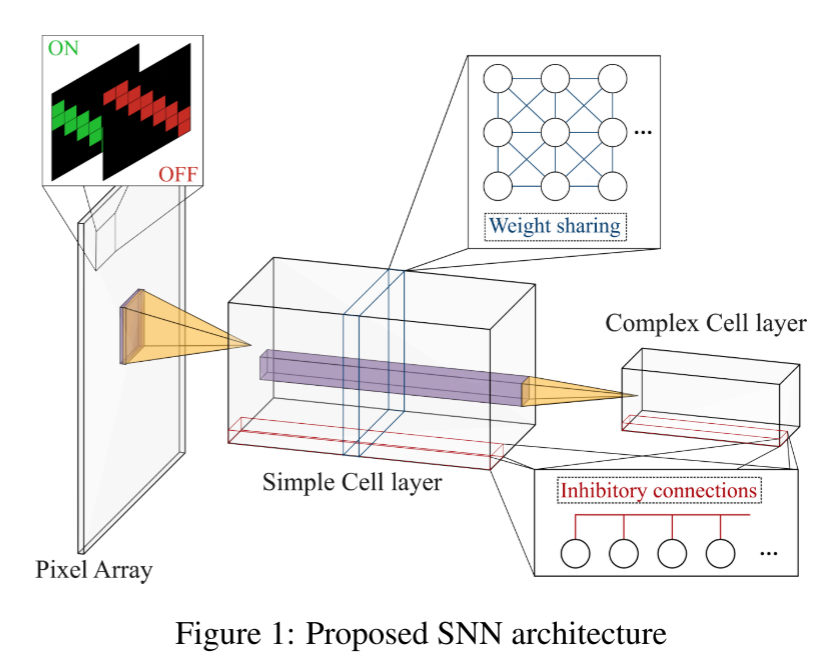

3.4.2简单细胞层

在人类早期的视觉通路中发现，简单的细胞是神经元的局部定向信息。**它们通常以Gabor函数的形式形成接受域，以适应特定的方向和可能的运动方向。**我们网络的第一层目的是模仿这些简单细胞的行为。它直接由像素阵列提供。表1给出了训练过程中使用的参数。我们选择了与生物学相关的最合理的参数。

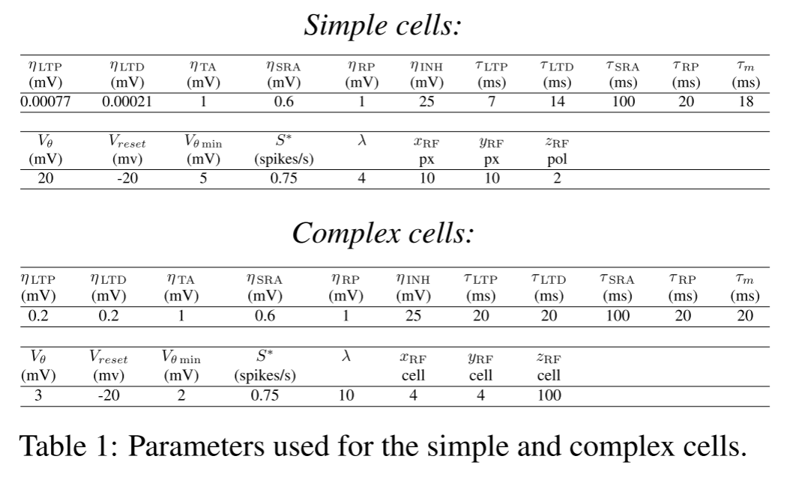

3.4.3复杂细胞层

复杂细胞层的神经元接收来自简单细胞的输入。它们汇集了来自更大一部分视野的输入。与视觉皮层中的复合细胞类似，它们应该学会独立于边缘的精确位置来表示定向边缘，这需要强烈的非线性行为 [15] [12]。通常，类似复杂细胞的行为是通过最大池化操作实现的，但在这里，我们感兴趣的是利用 STDP 学习复杂细胞的非线性行为。为此，我们调整了复杂细胞的参数，通过降低它们的尖峰阈值，使它们对输入更加敏感（参见表 1）。

我们还为复杂单元选择了不同的、更简单的 STDP 窗口。与简单单元相反，权重变化总是正的，遵循阶跃函数。通过权重归一化可以避免无约束增长。复杂单元的 STDP 规则写法如下

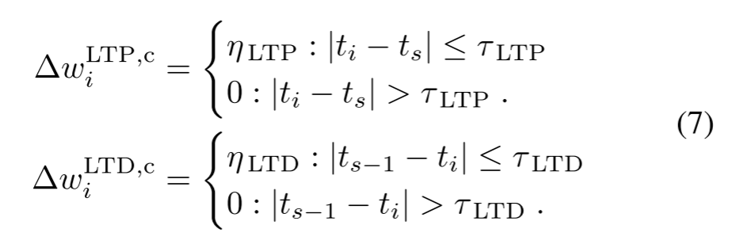

## 结果

### 4.1学习简单细胞感受野

我们首先评估我们网络的简单细胞层学习3个基本环境属性的能力:方向、运动和视差。我们制作了一个合成事件视频，我们精确地控制了这3个变量。最简单的刺激方式是在静态摄像机前移动(从左到右)条。我们选择了一个在黑暗背景上移动的亮条，如图2a所示。这导致了一个领先的正事件极性边，然后是一个负极性边。我们通过创建立体帧来创建人工视频，然后使用ESIM模拟器[31]将它们转换为基于事件的视频。由于刺激的综合性质，我们可以选择精确的横杆方向、运动和差异。

学习到的简单接受域如图2b和2c所示。它们被调整到垂直方向，与合成视频中的条形方向相匹配。当条形图在视野中从左到右移动时，特定极性的事件总是以相同的顺序出现(正的然后是负的)。学习的感受域反映了这种特定的顺序，类似于描述生物简单细胞感受域[2]的Gabor函数。

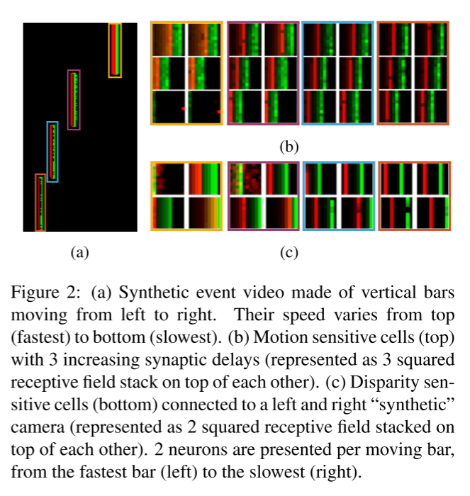

当在像素和简单细胞之间添加具有多重延迟的多突触连接时，它们就能学习到条形图的速度表示。具体来说，简单细胞与像素阵列之间使用 3 个具有不同延迟的突触连接。在图 2b 中，相应的 3 个感受子场（每个延迟一个）相互叠加。我们为每个条形图展示了两个学习到的感受野示例（用彩色框表示对应关系）。这四个条纹相对于摄像机的运动速度分别为（从上到下）420、210、140 和 105 像素/秒。为了准确捕捉这种运动，我们选择了 0、10 和 20 毫秒的突触延迟，感受野为 10 x 10 像素。这就意味着速度调整可达 ${10 \over 2^{10^{-3}} }= 500$ 像素/秒。超过这个速度，感受野就会太小（或延迟太大），无法捕捉到条形运动。从图 2b 中我们可以看到，速度越快，不同延迟所对应的子场之间的偏移就越大。对于移动速度最快的条形图（接近 500 像素/秒的极限），感受野在 20 毫秒延迟时开始 "断裂"（（b）中的下一行）。这是因为延迟为零的第一个子场并没有完全向右开始，从而将 20 毫秒突触延迟的移位推到了感受野大小之外。由于极性无关的权重归一化，随机突触像素的权重变得非常强（单个红色像素）。

我们通过添加第二组移动杆来扩展这个实验，以形成一个立体的设置。每条在第二视野中轻微移动，以模拟不同的双眼差异。具体来说，这些条有(从上到下)2、4、6和8个像素的差异。在这里，简单的细胞通过单个突触连接到两个立体视野。图2c描绘了相互叠加的左、右接收域。正如预期的那样，左右接受子字段之间的转换与栏的差异匹配。

### 4.2学习复杂细胞感受野

我们通过添加一层复杂的细胞，并将输入刺激改变为使用DAVIS 346摄像机制作的基于真实事件的记录来扩展网络。我们在摄像机前移动了一张画有各种形状的纸。基于事件的摄像机的真实输入包含大量的噪声，会影响训练。我们使用dv软件中的事件噪声过滤器(与DAVIS 346相机相关)来减少这种影响。视频在许多方向上呈现了许多边，如图3a所示。

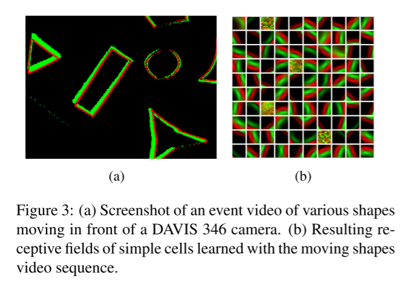

为了增加可变性，我们执行数据增强，在训练期间通过人工旋转和镜像效果来呈现相同的视频。这确保了神经元呈现出所有可能方向的边缘。我们使用第一层简单的细胞，而不使用多突触连接，然后添加第二层复杂的细胞，并对网络进行大约30分钟的训练。

图3b显示了简单细胞的接收域。它们也是gabor形状，但显示了广泛的方向调整。100个简单细胞中有4个什么也学不到。这是由于神经网络中的强烈抑制，阻止了它们在常规基础上变得活跃。事实上，当我们将简单细胞的数量增加到144个时，我们发现具有gabo形感受野的细胞数量基本保持不变，因为不断增加的细胞数量被永久抑制了。

复杂细胞的感受野较难可视化，因为它们汇集了许多简单细胞的活动，以非线性方式连接到像素阵列的较大区域。图 4 显示了与复杂细胞相连的简单细胞对复杂细胞的加权连接。左图是简单细胞图中所有加权的总和。黄色方框代表最强的连接。复杂细胞感受野已经局部化，即它们对来自像素阵列局部区域的输入做出反应。右侧的图像是通过为像素阵列的每个局部区域选择与复合细胞连接最强的简单细胞感受野来构建的。通常情况下，这些简单细胞感受野具有相似的方向，但相位却各不相同，因此复杂细胞具有相位不变性。此外，简单细胞对特定运动方向具有选择性，即方向选择性，而我们的复合细胞大多只有方向选择性。

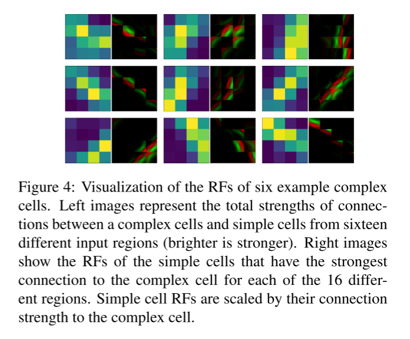