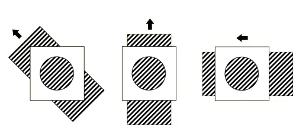
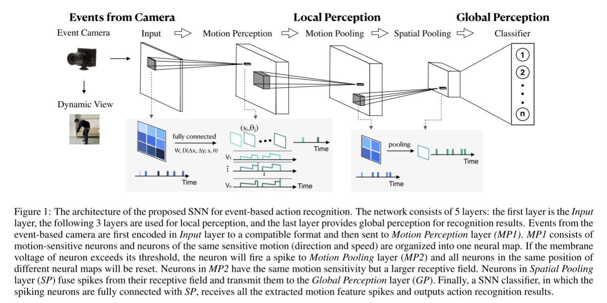

# Event-based Action Recognition Using Motion Information and Spiking Neural Networks

使用运动信息和尖峰神经网络的基于事件的动作识别

> 基于事件的相机因其具有生物启发范式和低功耗的优点而受到越来越多的关注。由于基于事件的摄像机将视觉输入记录为异步离散事件，因此它们天生就适合与尖峰神经网络(SNN)合作。现有的事件处理snn的工作主要集中在对象识别任务上。然而，基于事件的摄像机的事件是由动态变化触发的，这使得它成为捕捉视觉场景中的动作的理想选择。受视觉皮层背侧流的启发，我们提出了一种基于运动信息的基于事件的动作识别层次结构。运动特征的提取和利用从事件到局部，最后到全局感知的动作识别。据作者所知，这是SNN首次尝试将运动信息应用于基于事件的动作识别。我们在三个基于事件的动作识别数据集上评估了我们提出的SNN，包括我们新发布的DailyAction-DVS数据集，其中包含在不同记录条件下收集的12个动作。大量的实验结果表明了运动信息和我们提出的SNN结构在基于事件的动作识别中的有效性。
>
> `pdf`:<https://pan.baidu.com/s/1ZwzPUFUJ5QhSsbh_EGOQxA?pwd=7ka4>

我们提出了一个分层的SNN体系结构，利用运动信息进行基于事件的动作识别。**运动特征的提取和利用从事件到局部，最后到全局感知的动作识别。具体来说，我们首先采用运动敏感神经元来估计光流，以达到局部运动(方向和速度)感知的目的**。然后，**我们执行一个运动池化和一个空间池化来缓解孔径问题的影响[Orchard等人，2013]，并分别增加空间不变性。作为体系结构的最后阶段，采用一个SNN分类器作为识别结果的全局感知，其中尖峰神经元完全连接到前一层的池化层**。据作者所知，这是SNN首次尝试将运动信息应用于动作识别任务。

现有的snn与基于事件的相机合作的工作主要集中在物体识别任务上[Orchard等人，2015;Xiao et al.， 2019;刘等，2020b。然而，由于基于事件的摄像机能够自然地捕捉视觉场景中的动作，因此非常适合于动作识别任务。然而，SNN在基于事件的动作识别方面的研究还很有限。

人类可以准确识别动作，这促使我们探索生物视觉皮层，为基于事件的识别积累经验。**视觉皮层由两条不同的通路组成[Jhuang 等人，2007]。一条是处理形状信息的腹侧流，已被广泛应用于现有的尖峰物体识别模型中[Orchard 等人，2015；Liu 等人，2020b]。另一个是涉及运动信息分析的背侧流。由于代表动作的事件流包含丰富的运动信息，因此事件流的运动特征可能是动作识别任务的理想选择。**此外，背侧流的组织结构是分层的。神经元的感受野沿层次结构逐渐增加，对特征的选择性和不变性也逐渐增加。在当前视觉皮层理论的启发下，我们将逐步解决基于事件的动作识别问题。

我们提出了一个分层的SNN体系结构，利用运动信息进行基于事件的动作识别。运动特征的提取和利用从事件到局部，最后到全局感知的动作识别。具体来说，我们**首先采用运动敏感神经元来估计光流，以达到局部运动(方向和速度)感知的目的**。然后，**我们执行一个运动池化和一个空间池化来缓解<u>孔径问题</u>的影响[Orchard等人，2013]，并分别增加空间不变性**。作为体系结构的最后阶段，**采用一个SNN分类器作为识别结果的全局感知，其中尖峰神经元完全连接到前一层的池化层。**据作者所知，这是SNN首次尝试将运动信息应用于动作识别任务。

> 孔径问题 aperture problem：
>
> 本文中使用的AER传感器被称为异步基于时间的图像传感器（ATIS）[1]，但本文中描述的视觉运动估计Spiking架构（SAVME）旨在与任何变化检测传感器一起工作。SAVME由两层简单的整合和激发神经元组成。第一层计算法向流（视觉梯度方向上的光流分量），这也是传统的基于帧的梯度方法的第一步。第二层通过汇集来自第一层的局部法向流估计来估计光流。该池化层施加的约束与众所周知的Lucas Kanade方法[5]用于解决图像恒定性约束中的模糊性（即孔径问题）的约束相同。
>
> 孔径问题（Aperture Problem），如图，从圆孔中观察三种移动的条纹的变化，是一致的，从而无法通过圆孔得到条纹的真实移动方向（光流方向）
>
> LK算法是一种两帧差分的光流估计算法，其基本思想基于以下三个假设。
>
> - **亮度恒定：**就是同一点随着时间的变化，其亮度不会发生改变。这是**基本光流法的假定（所有光流法变种都必须满足）**，用于得到光流法基本方程。对于灰度图像（对于彩色图像同适用）这意味着像素的灰度值不会随着帧的跟踪改变。
> - **时间持续性（微小移动）：**就是时间的变化不会引起位置的剧烈变化，这样灰度才能对位置求偏导（换句话说，小运动情况下我们才能用前后帧之间单位位置变化引起的灰度变化去近似灰度对位置的偏导数），**这也是光流法不可或缺的假定**。图像上相机的移动随时间变化缓慢。实际上，这意味着时间的变化不会引起像素位置的剧烈变化，这样像素的灰度值才能对位置求对应的偏导数。
> - **空间一致性：**场景中相同表面的相邻点具有相似的运动，并且其投影到图像平面上的距离也比较近。一个场景上邻近的点投影到图像上也是邻近点，且邻近点速度一致。**这是Lucas-Kanade光流法特有的假定**，因为光流法基本方程约束只有一个，而要求x，y方向的速度，有两个未知变量。我们假定特征点邻域内做相似运动，就可以连立n多个方程求取x，y方向的速度（n为特征点邻域总点数，包括该特征点）
> - <https://zhuanlan.zhihu.com/p/384651830?utm_id=0>
>
> 三个基本假设中前两个是光流法的基本假设，第三个是LK算法特有的。
>
> > 特征匹配 - LK光流论文解析：<https://zhuanlan.zhihu.com/p/571640037?utm_id=0>

## 3 Method

图 1：拟用于基于事件的动作识别的 SNN 结构。该网络由 5 层组成：第一层是输入层，其后 3 层用于局部感知，最后一层提供识别结果的全局感知。来自基于事件的摄像头的事件首先在输入层编码成兼容格式，然后发送到运动感知层（MP1）。MP1 由运动敏感神经元组成，具有相同运动敏感性（方向和速度）的神经元被组织成一个神经图谱。如果神经元的膜电压超过阈值，神经元就会向运动池化层（MP2）发出一个尖峰，不同神经图谱中同一位置的所有神经元都会被重置。运动池层（MP2）中的神经元具有相同的运动灵敏度，但感受区更大。空间汇集层（SP）中的神经元会融合其感受区的尖峰，并将其传输到全局感知层（GP）。最后，SNN 分类器（其中的尖峰神经元与 SP 完全连接）接收所有提取的运动特征尖峰，并输出动作识别结果。

### **3.1 Events From Event-based Camera**

给定一个像素网格大小为N×M的基于事件的相机，第i个事件可以描述为:

其中，eti ≥ 0 是事件发生的时间戳，(exi ,eyi ) ∈ {1, 2, . ,N} × {1, 2, . . . ,M}是产生第 i 个事件的像素的位置，epi ∈ {-1, 1} 是事件的极性，-1、1 分别表示 OFF 和 ON 事件，I 是事件的数量。图 2 显示了 DvsGesture 数据集中代表左臂顺时针手势的事件流的可视化情况

来自摄像机的事件首先在输入层被编码成兼容的格式用于后续处理。**这一层可以被看作有两个神经映射，每个极性一个。每个地图由N个×M尖峰神经元组成，当接收到相应的事件时，没有内部动态来发出尖峰。**

### **3.2 Local Perception**

**Motion Perception (MP1)**

事件被发送到运动感知层(MP1)进行局部运动估计。Input和MP1之间的突触连接有传输延迟，这与突触后神经元对运动敏感有关。在[Orchard等人，2013]中，我们**将延迟指定为神经元被调谐的速度s和方向θ的函数，以及像素相对于神经元的位置**。**延迟函数**可以用下面的公式来描述:

其中 ∆x 和 ∆y 是神经元位置（x,y）与事件地址$（e_x, e_y）$之间的空间偏移。考虑到各种方向和速度的覆盖范围以及算法实现的复杂性，我们将方向 θ 设置为以 45 度为增量，速度 s 设置为以 2 倍为增量。在每个图上，神经元在位置 (x, y) 和时间 t 处的膜电压可描述为

其中，1{·} 是指示函数，$X(e_{x_i})=[e_{x_i}-r_{mp1}, e_{x_i} + r_{mp1}] $和 $Y(e_{y_i}) = [e_{y_i} - r_{mp1}, e_{y_i} + r_{mp1}]$ 表示该层神经元的感受野，$r_{mp1}$ 表示感受野大小，**W 表示突触权重**，$τ_m$ 表示衰减时间常数。

**每个尖峰神经元与前一层的$r_{mp1} × r_{mp1}$神经元之间有同等权重的连接，但这些连接有特定的延迟，当神经元敏感的运动(方向和速度)模式发出信号时，所有这些事件都会在很小的时间间隔内到达神经元，并触发神经元的膜电压做出反应**。当神经元的电压超过其阈值$V^{thr}_{mp1}$时，神经元就会发出一个脉冲。阈值$V^{thr}_{mp1}$是根据接收字段中输入事件的权值之和设置的。这样，当刺激输入时，最接近刺激的神经元最有可能首先触发。与此同时，尖刺会抑制其他神经映射中共享相同位置的神经元，并迫使它们重置。这种赢者通吃(WTA)机制将在下一个刺激通过时消除错误的特征峰值。

**Motion Pooling (MP2)**

这一层的尖峰神经元具有与运动感知层相同的神经动力学和连接延迟，但接收野更大(rmp2 > rmp1)。大的接受域大小增加了不同方向的边被纳入接受域的概率[Orchard et al.， 2013]。因此，局部运动池化解决了孔径问题，提供了事件流准确的运动特征。

图3展示了DvsGesture数据集[Amir et al.， 2017]中左臂顺时针方向的运动特征峰值，以及DailyAction-DVS数据集中的弯曲运动特征峰值。我们可以看到在左臂顺时针方向，运动的方向随着时间逐渐改变。在弯曲时，代表头部轨迹的中间部分比代表身体轨迹的侧面部分要快。这些观察与我们的经验是一致的。

**Spatial Pooling (SP)**

**在进行全局感知之前，我们在SNN架构中采用空间池化，目的是增加特征空间不变性，降低空间维数。**在之前的Motion Pooling层中，神经映射被划分为相邻的不重叠的$r_{sp} × r_{sp}$区域，从同一区域发出的特征尖峰将被传送到该层的相同神经元中。神经元没有特定的动力，当它们的接收区域接收到尖峰信号时就会发出尖峰信号。

### 3.3 Global Perception (GP): SNN Classifier

在本节中，我们将描述如何对最终的动作识别结果进行全局感知。这一层的尖峰神经元完全连接到之前的空间池层的所有神经元。连接权值由segmentation Probability-Maximization (SPA)训练[Liu等人，2020b]，这是一种专门为处理基于事件的数据而设计的有效SNN学习算法。

我们采用了泄露与发射(LIF)模型。神经动力学可以描述为:

其中wi和ti为突触权重和传入i的放电时间。Vrest为神经元的静息电位。K为归一化的突触后电位(PSP)核，其定义如下:

式中，$V_0$为核的最大值归一化系数，$τ_m$和$τ_s$分别为膜整合和突触电流的衰减时间常数。

SPA学习算法的目的是训练连接权值，使神经元对它们所代表的类的输入模式作出更积极的反应。根据类$c_k$和类j神经元所代表的输入模式，按如下方式更新权值。首先，我们找到代表j类神经元的峰值膜电压$V^j_{peak}$，并将相应的时间戳标记为峰值。第二，我们将表示类j的神经元的归一化输出放电率$f^j_{out}$定义为:

第三，我们使用公式更新权重:

其中，λ 是学习率。为方便起见，我们用 $f_{sum}$表示 $\sum^n_{j'=1}f^{j'}_{out}$。训练完成后，我们保持突触权重固定不变，并设置神经元的阈值$V^{gp}_{thr}$。输入的预测类别是通过平均每类神经元的点火率来确定的，然后选择平均点火率最高的类别。

## 实验

动作的移动方式可能比动作的样子更重要。时间信息很重要

- 我们的模型中使用的运动特征比[Xiao等人，2019]和[Liu等人，2020b]中使用的基于HMAX的形状特征更有效。这表明，在动作识别任务中，动作的移动方式可能比动作的样子更重要。
- [Gu等人，2019]在6层全连接SNN下的精度较低，为71.2%。原因是[Gu等人，2019]不是为具有高时间分辨率和稀疏表示的基于事件的数据而设计的。因此，它将失去对基于事件的动作识别至关重要的精确的时间信息。
