# DTS-SNN: Spiking Neural Networks With Dynamic Time-Surfaces

> **摘要** 卷积有助于尖峰神经网络（SNN）捕捉神经形态（事件）数据的时空结构，基于卷积的尖峰神经网络（C-SNN）在各种数据集上的分类精度达到了最先进的水平。然而，除了效率之外，C-SNN 的有效性也值得怀疑。为此，我们提出了具有新型可训练动态时间曲面（DTS-SNN）的 SNN，作为卷积的高效替代方案。这项工作中提出的新型动态时间曲面的特点是，由于使用了零和时间内核，它对移动物体的响应速度很高，而零和时间内核的灵感来源于早期视觉通路中简单细胞的感受范围。我们在三个真实世界基于事件的数据集（DVS128 手势、海德堡尖峰数据集和 N-Cars 数据集）上评估了 DTS-SNN 的性能和计算复杂度。结果表明，分类准确率很高，计算效率也有显著提高，例如，在 DVS128 手势数据集上，分类准确率仅比先进水平低 1.51%，但计算效率提高了 18 倍。代码可在线获取（https://github.com/dooseokjeong/DTS-SNN）。

## I. INTRODUCTION

在卷积神经网络（CNN）中实施时，基于卷积的方法在不同领域都有很高的效率，因此在各种深度学习应用领域都很普遍。尖峰神经网络（SNN）也是如此，基于卷积的 SNN（C-SNN）在各种数据集上都保持着最先进的分类精度[1], [2], [3]。卷积是一种操作密集型方法，涉及对三维特征图的大量乘积操作。因此，卷积通常会导致较高的计算复杂度和功耗，这是一项艰巨的挑战，尤其是对于 C-SNNs 而言，因为相对于深度神经网络（DNNs）而言，功耗低是 SNNs 的主要优势之一。

SNN 是由尖峰单元和单向突触组成的时变假说[4]。SNN 的优势之一是基于非同步尖峰的操作，而不像 DNN 中的分层顺序操作会带来前向锁定限制 [5]、[6]。为充分利用这一优势，需要在专用硬件中实现 SNN，即神经形态硬件 [7]、[8]、[9]、[10]、[11]。一般来说，神经形态处理器由多个内核组成，支持跨内核的基于事件的异步操作。由此产生的能效是神经形态硬件的主要特征。

时间面（TS）分析是处理各种任务中异步事件（尖峰）的有效方法 [12]、[13]、[14]。给定事件的 TS 是事件发生前事件时间戳在事件附近空间的二维地图。因此，TS 可以捕捉响应对象的事件的时空局部结构。不过，以前的 TS 并不适合 SNN，也很难支持端到端学习。

在这方面，我们尝试使用 TS 代替卷积，以高操作效率的方式提取事件数据的特征，从而充分利用 SNN 的关键优势，即功耗效率。据我们所知，这项工作是首次尝试将 TS 集成到 SNN 中以高效处理基于事件的数据。此外，为了更好地捕捉事件数据的动态特征，我们对传统的 TS 进行了重大改进，使用了零和时间核，其灵感来自早期视觉通路中简单细胞的时间核[15]。此外，我们的 TS 是动态的，因为它们是按每个时间步计算的，以编码事件动态，这与之前的 TS 不同，后者被称为动态时间曲面（DTS）。我们工作的主要贡献如下：

- 我们提出了 DTS-SNN 来取代 C-SNN，C-SNN 非常轻便，但在基于事件的数据上却表现出很高的分类准确性。 
- 我们提出的可训练 DTS 易受移动物体影响，并完全支持端到端学习。
- 我们在各种基于事件的数据集上评估了 DTS-SNN 的分类准确性和计算效率，包括 DVS128 手势 [16]、Spiking Heidelberg 数据集（SHD）[17] 和 N-Cars [13]。

## II. RELATED WORK

在视觉处理的早期阶段，简单细胞（线性神经元）对其感受野中特定空间和时间结构的视觉输入表现出线性响应[15]。感受野的时间结构（内核）的特点是，输入对简单细胞反应的正负贡献在时间上交替出现，特定点（t0）的输入会在一个时间窗口（宽度为 tc，即 t -t0 ≤ tc）内产生正贡献，而当时间超过窗口时，则会变成负贡献。图 1 是时间核的示意图。这种时间核支持简单细胞对其感受野内移动物体的响应。简单细胞对静态物体和运动物体的反应对比见图 1。

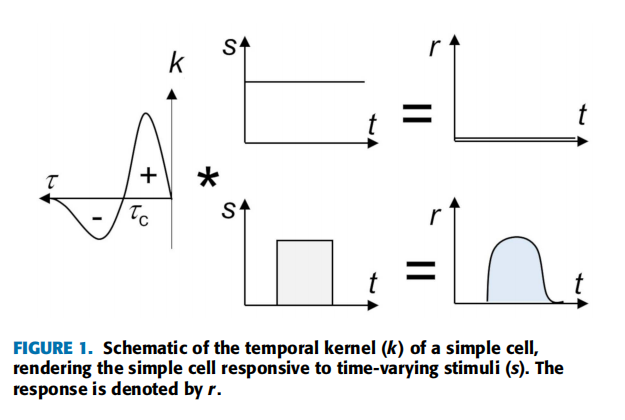

作为TS分析的早期研究，**HOTS只考虑给定TS中像素的最后一个时间戳**，虽然HOTS成功地引入了TS的概念来处理事件数据，但TS容易出现与所考虑对象[12]无关的事件噪声。

作为一种变通方法，**Sironi等人提出了基于平均TSs[13]的HATS**。为了简化表示，他们将输入域划分为网格单元。对于每个网格单元，**对网格单元中最近发生的几个事件的TS在整个时间步和网格单元中求平均，以获得一个具有网格单元代表性的平滑TS**。与HOTS不同，在HATS中，每个事件的TS通过将**事件流与指数衰减的时间内核进行卷积**来考虑几个最近的时间戳。

HOTS使用一组TS作为字典，将其与输入TS进行比较，从而构建特征映射**(匹配频率)**。这种比较在多个阶段重复进行。最后一阶段的特征直方图用于对输入数据进行分类，这是基于输入数据和每个类别中的实例之间的直方图相似度。HATS使用网格单元平均的ts作为字典。与HOTS相似，feature map是基于匹配频率构建的，但使用支持向量机作为分类器。值得注意的是，**HOTS和HATS都使用时不变(静态)的TSs作为它们的分类器的输入。**

> HOTS: A Hierarchy of Event-BasedTime-Surfaces for Pattern Recognition
>
> > Time-Surface原理
> >
> > 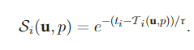
> > 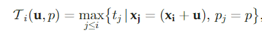
> > 简言之，就是对时空信息进行编码，就是在固定的事件领域内每个像素只记录一个事件。当有新的事件到达时，会利用一个衰减核函数对其空间领域内作比较，从而产生一个类似权重值的东西来记录当前到达的事件（包含两部分，正负极性事件分开)。
>
> HATS: Histograms of Averaged Time Surfaces for Robust Event-based Object Classification:<https://blog.csdn.net/xiaoliuya19/article/details/121577224>
>
> [Notes](../2018_CVPR_HATS\2018_CVPR_HATS.md)

随着snn训练算法的发展，人们尝试利用snn[1]，[2]，[18]，[19]，[20]的时空处理能力来处理事件数据。然而，为了获得较高的分类精度，大多数算法都使用了具有多个隐藏层的大型c - snn，这导致了显著的计算复杂度。

这让我们重新审视snn的最初动机，即能源效率，并因此重新思考使用TSs作为卷积的替代方法提取事件数据的时空特征的有效方法。为此，先决条件包括(i)将传统的时不变TSs修改为具有噪声鲁棒性的时间内核的时变(动态)形式，以及(ii)开发支持端到端批量学习的DTS构建器。

## III. SPIKING NEURAL NETWORKS WITH DYNAMIC TIME-SURFACES

**DTS-SNN由DTS构建器和SNN分类器组成。构建器在每个时间步中为事件构造dts，这些dts随后作为输入输入到SNN中。**为了验证所提出的DTS构建器的特征提取能力以及定义良好的特征对SNN的重要性，我们使用了一个带有单个隐藏层的简单密集SNN，该隐层是使用基于梯度的反向传播代理算法[21]训练的。本节阐述了DTS与以前的TSs的比较，以及为单个批次的样品并行构建DTS的方法。

#### A. DYNAMIC TIME-SURFACES WITH ZERO-SUM TEMPORAL KERNELS

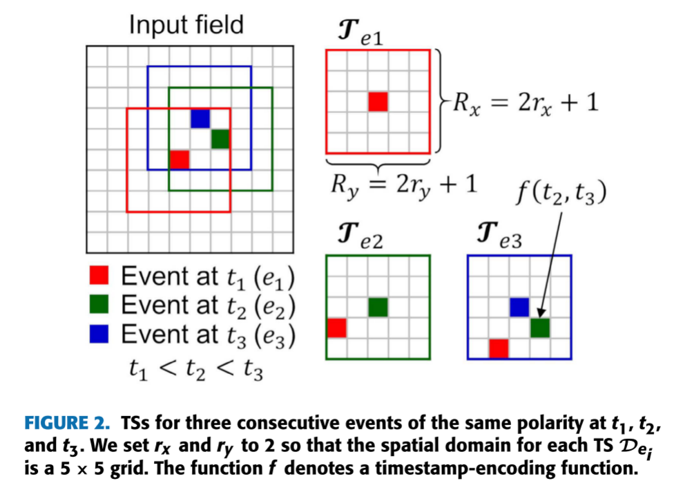

对于来自事件相机的事件流，第i个事件(ei) 被编码为ei = (pi, ti, Xi)，其中pi, ti, Xi表示它的极性pi∈{−1,1}，时间戳，以及在2D像素阵列Xi = (xi, yi)上的位置。**事件$T_{e_i}$的DTS**只考虑之前或同时存在的**相同极性**(pj = pi)事件ej(j≤i)，它们位于Xj =(xj, yj)∈Dei.空间域“$D_{e_i}$”定义为:$D_{e_i} =\{(x_j, y_j)|x_j−x_i|≤r_x，|y_j−y_i|≤r_y\}$。因此，$T_{e_i}(pi，\Delta x_{ij}，\Delta y_{ij})∈R^{2×Rx×Ry}$，$\Delta x_{ij} = x_j−x_i$, $\Delta y_{ij} = y_j−y_i$, $R_x = 2r_x + 1$,$R_y = 2r_y + 1$。图2中展示了为三个连续事件构建DTSs。

时间步长ti的DTS编码采用新的零和时间核$k_{tzs}$

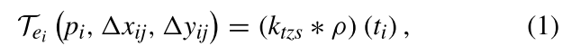

事件流ρ对于每个位置Xj是由

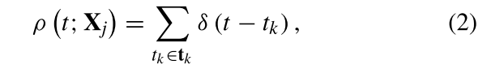

其中，δ为Dirac delta函数，tk为以前的时间戳tk ={tk|k≤j, Xk = Xj}的集合。零和时间核$k_{tzs}$由

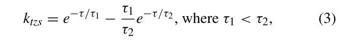

**给出了零和时间核ktzs，它区别于HOTS和HATS中使用的单指数时间核kt。**

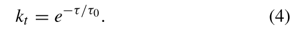

公式 (3) 被称为零和时间核，因为由于公式 (3) 中正负子核之间的平衡，在事件流恒定发射率上与该核卷积的结果为零。

定理 1：**考虑使用零和时间核 ktzs 对一列发射率为 r 的泊松尖峰 ρ 进行卷积，y (t) = (ktzs ∗ ρ) (t)**。随着时间 t 的增加，结果趋于零，即 y (∞) = 0。

定理 1 的推导见附录 A。根据阶式 1，核通过过滤掉恒定发射率的尖峰，从而对随时间变化的发射率的尖峰序列产生较高的响应度。因此，与单指数核相比，零和时间核赋予了时间戳编码对移动物体的高响应性。

> 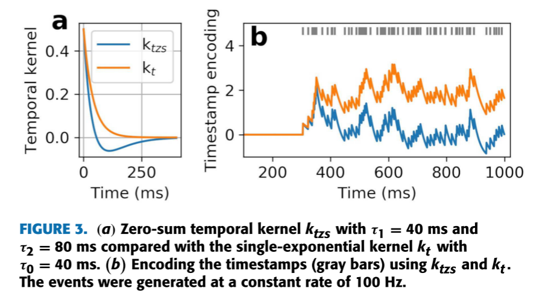
>
> 图 3 显示了使用零和时间核 ktzs 与使用单指数核 kt 进行编码的时间戳比较示例（图 3(a)）。图 3(b) 突出显示了编码函数对不同速率事件的高响应性，即在编码初始阶段输出高响应，而由于事件速率不变，随后的响应仅在零附近波动。与图 3（b）中使用单指数核 kt 的时间戳编码相比，这一点明显不同。
>

**与 HATS 类似，输入场被划分为网格单元，每个网格单元建立一个网格单元代表 DTS。**不过，与 HATS 不同的是，给定网格单元 c 和时间步 t 的代表性DTS Tc (t) 是**同时发生事件的 DTS的 Tei 的<u>加权和</u>。**

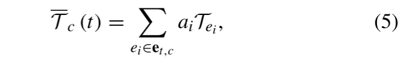

其中，$e_{t,c}$ = {ei|ti = t, Xi ∈ c}。每个元素时间面 Tei 的权重用 ai 表示，这是一个可训练的参数。**所有网格单元共享这组权重**。请注意，在 HATS 中，代表性 TS 是同时发生事件的 TS 的简单平均值，如下所示。

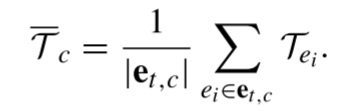

#### B. BUILDING DYNAMIC TIME-SURFACES IN PARALLEL

在给定数据集上使用 DTS 训练 SNN 的关键在于对一批数据中的所有样本进行 DTS 并行计算。此外，并行计算与现有深度学习框架的兼容性也能提高效率。**为此，我们提出了像素时间戳编码库 E (t)，每个时间步更新一次**。**当特定像素发生事件时，可以随时检索库中的时间戳编码**。该库随后会展开，为每个像素赋予一个元素时间表面。**在给定的时间步长内，同时发生的事件的要素时间曲面会被检索出来，并与它们的权重相加，计算出给定网格单元的 DTS。**

我们考虑在给定极性的 H × W 输入场上周期性分布网格单元；每个网格单元的大小为 hc ×wc，因此输入场上存在 H/hc ×W/wc 个网格单元。因此，每个 DTSDei 的空间域大小为 Rx × Ry，其中 Rx = (2rx + 1)，Ry = (2ry + 1)。下面各小节将详细介绍这一过程。伪代码见附录 D。

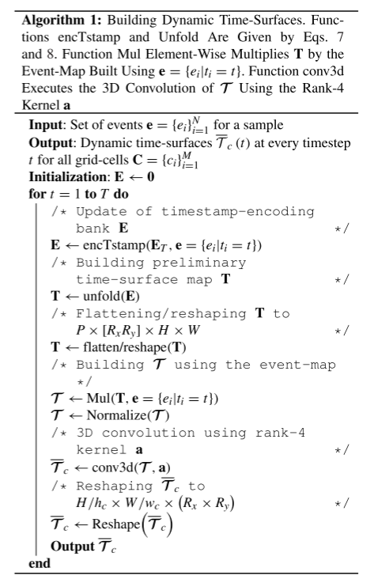

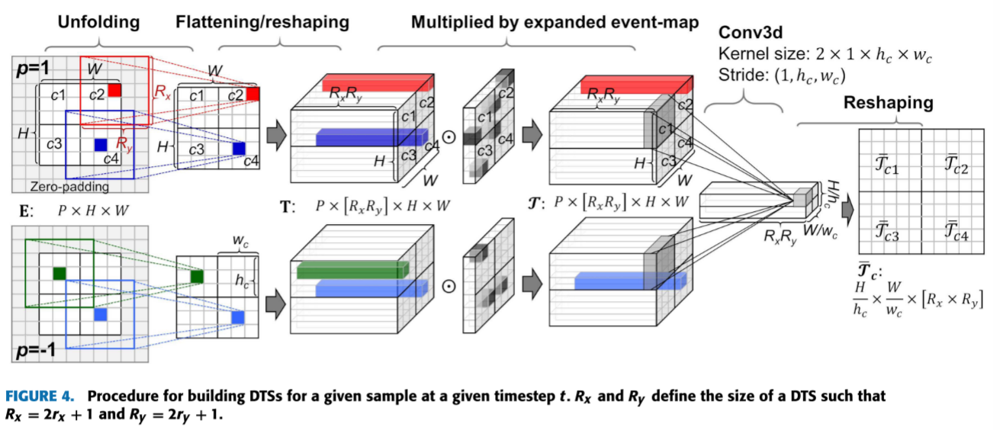

##### 1) BUILDING TIMESTAMP-ENCODING BANKS

时间戳编码库 E (t) 是所有像素的时间戳编码库，其维度与输入字段相同。对于 P×H×W 输入字段，$E (t) ∈ R^{P×H×W}$。 **每个元素**$ E_{pxy} (t)$ 的计算方法是，将一个位置 (x, y) 的事件流（极性 p）ρ (t; p, x, y) 与零和时序核 ktzs 进行卷积、

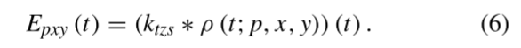

为了提高计算效率，我们将这种卷积转化为如下递归形式：

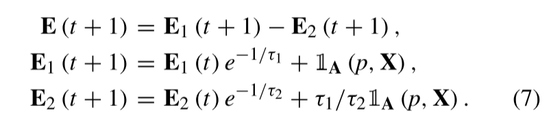

指标函数 1A (p, X) 是时间步 t 的事件映射，其中 A = {(pi, Xi) |ti = t}。

##### 2) UNFOLDING TIMESTAMP-ENCODING BANKS

随后，时间戳编码库 $E (t) ∈ R^{P×H×W}$展开，**建立初步时间面（time-surface）图** $T (t) ∈ R^{P×H×W×(Rx×Ry)}$ ，其中 P × H × W 输入场中的每个位置都有一个以该位置为中心的 $R_x × R_y$ 初步时间面，即

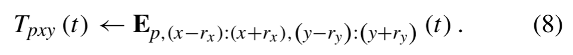

这个过程由图4中的“展开”表示。

##### 3) RESHAPING UNFOLDED BANKS

T (t)图中的每个初步时间面都会被平铺，从而形成 $P×H ×W×(R_xR_y)$图。随后将其重塑为$P × (R_xR_y)× H × W $地图。这**种重塑是为了使用三维卷积法按网格单元计算 DTS 的加权和。图 4 中用 "扁平化/重塑 "描述了这一过程。**

##### 4) MULTIPLICATION BY EVENT-MAPS

为此，我们重新使用公式 (7) 中的事件图 1A (p, X)。 通过沿扁平化的时间表面轴重复绘制该事件图，可以扩展该事件图。**将扩展后的事件映射与映射 T (t) 进行元素乘法运算，得到映射 T(t)，其中包括时间步 t 事件的非零元素时间曲面 $T_{e_i} (t)$。**图 4 中的 "乘以扩展事件图 "表示了这一过程。每个扁平化 Tei (t) 中的元素都经过 L2 归一化处理。

##### 5) GRID-CELL-WISE WEIGHTED SUM OF TIME-SURFACES

输入场为 $H/h_c × W/h_w$ 网格，每个网格单元的大小为 hc × wc。对于给定的网格单元，公式（5）中的 DTS Tc (t)是通过沿时间-表面轴对映射 T(t) 进行卷积计算得出的，使用的核 $a∈ R^{P×1×h_c×w_c}$，跨距为 1。请注意，核元素表示元素时间表面 T(t) 对网格单元代表 DTS Tc (t) 的贡献，如公式 (5) 所示。对下一个网格单元重复同样的过程：将内核移动到下一个网格单元（间距为 hc 或 hw），并以 1 的间距卷积 T(t)。因此，Tc (t) 的计算等同于使用秩 4 核 a 对元素时间-表面图 T(t) 进行三维卷积。

由此得到的$(R_xR_y)× H/h_c × W/w_c$ 地图是所有网格单元的扁平化 DTS 地图。该映射被重塑为 $H/h_c × W/w_c ×(R_x × R_y) $。所涉及的操作数（#OPDTS）为

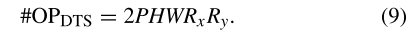

#### C. SPIKING NEURAL NETWORK CLASSIFIER

所使用的 SNN 分类器是一个简单的全连接网络（FCN），只有一个隐藏层。$H/h_c×W/w_c×R_x×R_y \space DTS$ 被扁平化，并在给定时间步作为突触电流输入 SNN 分类器。每个致密层都由符合尖峰响应模型（SRM）但没有折返机制的尖峰神经元组成。第 l 层第 i 个神经元的阈下膜电位用 $u^{(l)}_i(t)$表示。以下变量的下标和上标分别表示神经元索引和层索引。电位$u^{(l)}_i(t)$的计算公式为

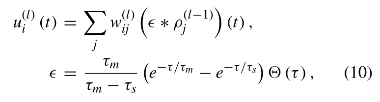

其中，$w^{(l)}_{ij}$、$τ_m$ 和 $τ_s$ 分别表示第（l - 1）层第 j 个神经元的权重、电位衰减的时间常数和突触电流衰减的时间常数。 来自第（l - 1）层第j个神经元的尖峰序列用$ρ^{(l-1)}_j $表示。我们使用尖峰函数$S_ϑ(u^{(l)}_i)$ 

当式（10）中的电位越过尖峰阈值ϑ时，就会发出尖峰。随后，电位重置为零。

我们使用基于代用梯度的时空反向传播（STBP）算法训练 SNN 分类器[21]。不过，为了简单起见，我们对 STBP 进行了修改，将梯度$∂S_ε/∂u^{(l)}_i $改为箱车函数 B，如下所示：

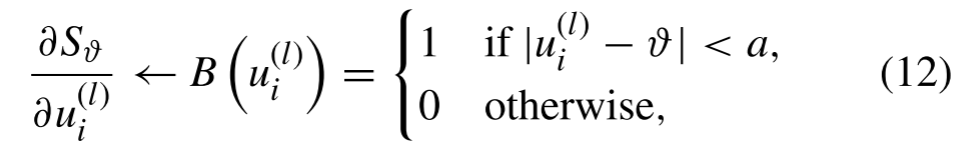

这里a是正常数。
